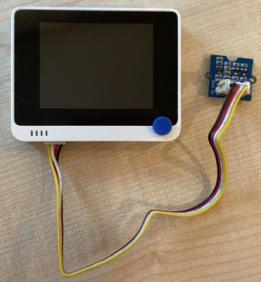

<!--
CO_OP_TRANSLATOR_METADATA:
{
  "original_hash": "288aebb0c59f7be1d2719b8f9660a313",
  "translation_date": "2025-08-25T16:41:41+00:00",
  "source_file": "4-manufacturing/lessons/4-trigger-fruit-detector/wio-terminal-proximity.md",
  "language_code": "hi"
}
-->
# निकटता का पता लगाएं - Wio Terminal

इस पाठ के इस भाग में, आप अपने Wio Terminal में एक निकटता सेंसर जोड़ेंगे और उससे दूरी पढ़ेंगे।

## हार्डवेयर

Wio Terminal को एक निकटता सेंसर की आवश्यकता है।

आप जो सेंसर उपयोग करेंगे वह है [Grove Time of Flight distance sensor](https://www.seeedstudio.com/Grove-Time-of-Flight-Distance-Sensor-VL53L0X.html)। यह सेंसर दूरी का पता लगाने के लिए एक लेजर रेंजिंग मॉड्यूल का उपयोग करता है। इस सेंसर की रेंज 10mm से 2000mm (1cm - 2m) है, और यह इस रेंज में दूरी को काफी सटीकता से रिपोर्ट करेगा। 1000mm से अधिक की दूरी को 8109mm के रूप में रिपोर्ट किया जाएगा।

लेजर रेंजफाइंडर सेंसर के पीछे की तरफ है, Grove सॉकेट के विपरीत दिशा में।

यह एक I²C सेंसर है।

### टाइम ऑफ फ्लाइट सेंसर को कनेक्ट करें

Grove टाइम ऑफ फ्लाइट सेंसर को Wio Terminal से जोड़ा जा सकता है।

#### कार्य - टाइम ऑफ फ्लाइट सेंसर को कनेक्ट करें

टाइम ऑफ फ्लाइट सेंसर को कनेक्ट करें।


1. Grove केबल के एक सिरे को टाइम ऑफ फ्लाइट सेंसर के सॉकेट में डालें। यह केवल एक ही दिशा में जाएगा।

1. Wio Terminal को अपने कंप्यूटर या किसी अन्य पावर सप्लाई से डिस्कनेक्ट करें। Grove केबल के दूसरे सिरे को Wio Terminal के स्क्रीन की ओर देखते हुए बाईं ओर के Grove सॉकेट में कनेक्ट करें। यह सॉकेट पावर बटन के सबसे करीब है। यह एक संयुक्त डिजिटल और I²C सॉकेट है।



1. अब आप Wio Terminal को अपने कंप्यूटर से कनेक्ट कर सकते हैं।

## टाइम ऑफ फ्लाइट सेंसर को प्रोग्राम करें

अब Wio Terminal को जुड़े हुए टाइम ऑफ फ्लाइट सेंसर का उपयोग करने के लिए प्रोग्राम किया जा सकता है।

### कार्य - टाइम ऑफ फ्लाइट सेंसर को प्रोग्राम करें

1. PlatformIO का उपयोग करके एक नया Wio Terminal प्रोजेक्ट बनाएं। इस प्रोजेक्ट का नाम `distance-sensor` रखें। `setup` फ़ंक्शन में सीरियल पोर्ट को कॉन्फ़िगर करने के लिए कोड जोड़ें।

1. प्रोजेक्ट की `platformio.ini` फाइल में Seeed Grove टाइम ऑफ फ्लाइट डिस्टेंस सेंसर लाइब्रेरी के लिए एक लाइब्रेरी डिपेंडेंसी जोड़ें:

    ```ini
    lib_deps =
        seeed-studio/Grove Ranging sensor - VL53L0X @ ^1.1.1
    ```

1. `main.cpp` में, मौजूदा इनक्लूड निर्देशों के नीचे निम्नलिखित जोड़ें ताकि `Seeed_vl53l0x` क्लास का एक इंस्टेंस डिक्लेयर किया जा सके, जो टाइम ऑफ फ्लाइट सेंसर के साथ इंटरैक्ट करेगा:

    ```cpp
    #include "Seeed_vl53l0x.h"
    
    Seeed_vl53l0x VL53L0X;
    ```

1. सेंसर को इनिशियलाइज़ करने के लिए `setup` फ़ंक्शन के नीचे निम्नलिखित जोड़ें:

    ```cpp
    VL53L0X.VL53L0X_common_init();
    VL53L0X.VL53L0X_high_accuracy_ranging_init();
    ```

1. `loop` फ़ंक्शन में, सेंसर से एक मान पढ़ें:

    ```cpp
    VL53L0X_RangingMeasurementData_t RangingMeasurementData;
    memset(&RangingMeasurementData, 0, sizeof(VL53L0X_RangingMeasurementData_t));

    VL53L0X.PerformSingleRangingMeasurement(&RangingMeasurementData);
    ```

    यह कोड डेटा पढ़ने के लिए एक डेटा स्ट्रक्चर इनिशियलाइज़ करता है, फिर इसे `PerformSingleRangingMeasurement` मेथड में पास करता है, जहां यह दूरी माप से भरा जाएगा।

1. इसके नीचे, दूरी माप को आउटपुट करें, फिर 1 सेकंड के लिए देरी करें:

    ```cpp
    Serial.print("Distance = ");
    Serial.print(RangingMeasurementData.RangeMilliMeter);
    Serial.println(" mm");

    delay(1000);
    ```

1. इस कोड को बिल्ड, अपलोड और रन करें। आप सीरियल मॉनिटर के साथ दूरी माप देख पाएंगे। सेंसर के पास वस्तुओं को रखें और आप दूरी माप देखेंगे:

    ```output
    Distance = 29 mm
    Distance = 28 mm
    Distance = 30 mm
    Distance = 151 mm
    ```

    रेंजफाइंडर सेंसर के पीछे की तरफ है, इसलिए दूरी मापते समय सही दिशा का उपयोग करना सुनिश्चित करें।

    

> 💁 आप इस कोड को [code-proximity/wio-terminal](../../../../../4-manufacturing/lessons/4-trigger-fruit-detector/code-proximity/wio-terminal) फोल्डर में पा सकते हैं।

😀 आपका निकटता सेंसर प्रोग्राम सफल रहा!

**अस्वीकरण**:  
यह दस्तावेज़ AI अनुवाद सेवा [Co-op Translator](https://github.com/Azure/co-op-translator) का उपयोग करके अनुवादित किया गया है। जबकि हम सटीकता सुनिश्चित करने का प्रयास करते हैं, कृपया ध्यान दें कि स्वचालित अनुवाद में त्रुटियां या अशुद्धियां हो सकती हैं। मूल भाषा में उपलब्ध मूल दस्तावेज़ को प्रामाणिक स्रोत माना जाना चाहिए। महत्वपूर्ण जानकारी के लिए, पेशेवर मानव अनुवाद की सिफारिश की जाती है। इस अनुवाद के उपयोग से उत्पन्न किसी भी गलतफहमी या गलत व्याख्या के लिए हम उत्तरदायी नहीं हैं।