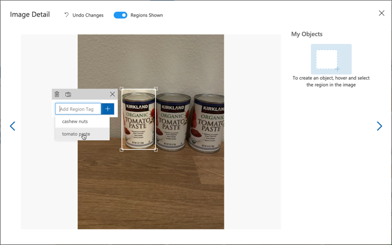

<!--
CO_OP_TRANSLATOR_METADATA:
{
  "original_hash": "8df310a42f902139a01417dacb1ffbef",
  "translation_date": "2025-08-25T16:24:05+00:00",
  "source_file": "5-retail/lessons/1-train-stock-detector/README.md",
  "language_code": "hi"
}
-->
# स्टॉक डिटेक्टर को प्रशिक्षित करें

> स्केच नोट [नित्या नरसिम्हन](https://github.com/nitya) द्वारा। बड़े संस्करण के लिए छवि पर क्लिक करें।

यह वीडियो Azure Custom Vision सेवा के ऑब्जेक्ट डिटेक्शन का अवलोकन देता है, जो इस पाठ में शामिल किया जाएगा।

> 🎥 वीडियो देखने के लिए ऊपर दी गई छवि पर क्लिक करें

## व्याख्यान से पहले का क्विज़

[व्याख्यान से पहले का क्विज़](https://black-meadow-040d15503.1.azurestaticapps.net/quiz/37)

## परिचय

पिछले प्रोजेक्ट में, आपने AI का उपयोग करके एक इमेज क्लासिफायर को प्रशिक्षित किया था - एक ऐसा मॉडल जो यह बता सकता है कि किसी छवि में कुछ है या नहीं, जैसे कि पका हुआ फल या कच्चा फल। छवियों के साथ उपयोग किए जाने वाले AI मॉडल का एक और प्रकार है ऑब्जेक्ट डिटेक्शन। ये मॉडल छवि को टैग्स के आधार पर वर्गीकृत नहीं करते, बल्कि इन्हें वस्तुओं को पहचानने के लिए प्रशिक्षित किया जाता है। ये न केवल यह पता लगाते हैं कि छवि में वस्तु मौजूद है, बल्कि यह भी पता लगाते हैं कि वह छवि में कहां है। इससे आप छवियों में वस्तुओं की गिनती कर सकते हैं।

इस पाठ में आप ऑब्जेक्ट डिटेक्शन के बारे में जानेंगे, जिसमें यह भी शामिल है कि इसे रिटेल में कैसे उपयोग किया जा सकता है। आप यह भी सीखेंगे कि क्लाउड में एक ऑब्जेक्ट डिटेक्टर को कैसे प्रशिक्षित किया जाए।

इस पाठ में हम निम्नलिखित विषयों को कवर करेंगे:

* [ऑब्जेक्ट डिटेक्शन](../../../../../5-retail/lessons/1-train-stock-detector)
* [रिटेल में ऑब्जेक्ट डिटेक्शन का उपयोग](../../../../../5-retail/lessons/1-train-stock-detector)
* [ऑब्जेक्ट डिटेक्टर को प्रशिक्षित करें](../../../../../5-retail/lessons/1-train-stock-detector)
* [अपने ऑब्जेक्ट डिटेक्टर का परीक्षण करें](../../../../../5-retail/lessons/1-train-stock-detector)
* [अपने ऑब्जेक्ट डिटेक्टर को पुनः प्रशिक्षित करें](../../../../../5-retail/lessons/1-train-stock-detector)

## ऑब्जेक्ट डिटेक्शन

ऑब्जेक्ट डिटेक्शन का मतलब है AI का उपयोग करके छवियों में वस्तुओं का पता लगाना। पिछले प्रोजेक्ट में आपने जो इमेज क्लासिफायर प्रशिक्षित किया था, उसके विपरीत, ऑब्जेक्ट डिटेक्शन का उद्देश्य पूरी छवि के लिए सबसे अच्छा टैग भविष्यवाणी करना नहीं है, बल्कि छवि में एक या अधिक वस्तुओं को ढूंढना है।

### ऑब्जेक्ट डिटेक्शन बनाम इमेज क्लासिफिकेशन

इमेज क्लासिफिकेशन का उद्देश्य पूरी छवि को वर्गीकृत करना है - यह अनुमान लगाना कि पूरी छवि प्रत्येक टैग से कितनी मेल खाती है। आपको मॉडल को प्रशिक्षित करने के लिए उपयोग किए गए प्रत्येक टैग के लिए संभावनाएं मिलती हैं।

ऊपर दिए गए उदाहरण में, दो छवियों को एक मॉडल का उपयोग करके वर्गीकृत किया गया है जिसे काजू के डिब्बे या टमाटर पेस्ट के कैन को वर्गीकृत करने के लिए प्रशिक्षित किया गया है। पहली छवि काजू के डिब्बे की है, और इमेज क्लासिफायर से दो परिणाम प्राप्त होते हैं:

| टैग            | संभावना |
| -------------- | -------: |
| `काजू`         | 98.4%   |
| `टमाटर पेस्ट`  | 1.6%    |

दूसरी छवि टमाटर पेस्ट के कैन की है, और परिणाम हैं:

| टैग            | संभावना |
| -------------- | -------: |
| `काजू`         | 0.7%    |
| `टमाटर पेस्ट`  | 99.3%   |

आप इन मानों का उपयोग यह अनुमान लगाने के लिए कर सकते हैं कि छवि में क्या है। लेकिन अगर किसी छवि में टमाटर पेस्ट के कई कैन या काजू और टमाटर पेस्ट दोनों हों, तो परिणाम शायद आपकी अपेक्षा के अनुरूप नहीं होंगे। यही वह जगह है जहां ऑब्जेक्ट डिटेक्शन काम आता है।

ऑब्जेक्ट डिटेक्शन में एक मॉडल को वस्तुओं को पहचानने के लिए प्रशिक्षित किया जाता है। इसे वस्तु वाली छवियां देने और यह बताने के बजाय कि प्रत्येक छवि एक टैग है या दूसरा, आप छवि के उस भाग को हाइलाइट करते हैं जिसमें विशिष्ट वस्तु होती है, और उसे टैग करते हैं। आप एक छवि में एक वस्तु या कई वस्तुओं को टैग कर सकते हैं। इस तरह मॉडल यह सीखता है कि वस्तु स्वयं कैसी दिखती है, न कि केवल उन छवियों को जो वस्तु को शामिल करती हैं।

जब आप इसे छवियों की भविष्यवाणी करने के लिए उपयोग करते हैं, तो आपको टैग और प्रतिशत की सूची के बजाय, पता लगी वस्तुओं की एक सूची मिलती है, उनके बॉन्डिंग बॉक्स और उस टैग से मेल खाने की संभावना के साथ।

> 🎓 *बॉन्डिंग बॉक्स* वे बॉक्स होते हैं जो किसी वस्तु के चारों ओर होते हैं।

ऊपर दी गई छवि में काजू का एक डिब्बा और टमाटर पेस्ट के तीन कैन हैं। ऑब्जेक्ट डिटेक्टर ने काजू का पता लगाया, और उस बॉन्डिंग बॉक्स को लौटाया जिसमें काजू है, और यह संभावना है कि बॉक्स में वस्तु है, इस मामले में 97.6%। ऑब्जेक्ट डिटेक्टर ने टमाटर पेस्ट के तीन कैन का भी पता लगाया है, और प्रत्येक कैन के लिए तीन अलग-अलग बॉन्डिंग बॉक्स प्रदान किए हैं, और प्रत्येक के पास यह संभावना है कि बॉक्स में टमाटर पेस्ट का कैन है।

✅ कुछ अलग-अलग परिदृश्यों के बारे में सोचें जिनके लिए आप छवि-आधारित AI मॉडल का उपयोग करना चाहेंगे। कौन से क्लासिफिकेशन की आवश्यकता होगी, और कौन से ऑब्जेक्ट डिटेक्शन की?

### ऑब्जेक्ट डिटेक्शन कैसे काम करता है

ऑब्जेक्ट डिटेक्शन जटिल ML मॉडल का उपयोग करता है। ये मॉडल छवि को कई कोशिकाओं में विभाजित करके काम करते हैं, फिर यह जांचते हैं कि बॉन्डिंग बॉक्स का केंद्र उस छवि के केंद्र से मेल खाता है या नहीं जो मॉडल को प्रशिक्षित करने के लिए उपयोग की गई छवियों में से एक से मेल खाती है। आप इसे छवि के विभिन्न भागों पर इमेज क्लासिफायर चलाने जैसा सोच सकते हैं ताकि मेल की तलाश की जा सके।

> 💁 यह एक अत्यधिक सरलीकरण है। ऑब्जेक्ट डिटेक्शन के लिए कई तकनीकें हैं, और आप उनके बारे में [विकिपीडिया पर ऑब्जेक्ट डिटेक्शन पेज](https://wikipedia.org/wiki/Object_detection) पर अधिक पढ़ सकते हैं।

ऑब्जेक्ट डिटेक्शन के लिए कई अलग-अलग मॉडल हैं। एक विशेष रूप से प्रसिद्ध मॉडल है [YOLO (You Only Look Once)](https://pjreddie.com/darknet/yolo/), जो अविश्वसनीय रूप से तेज़ है और 20 अलग-अलग प्रकार की वस्तुओं का पता लगा सकता है, जैसे लोग, कुत्ते, बोतलें और कारें।

✅ YOLO मॉडल के बारे में [pjreddie.com/darknet/yolo/](https://pjreddie.com/darknet/yolo/) पर पढ़ें।

ऑब्जेक्ट डिटेक्शन मॉडल को कस्टम वस्तुओं का पता लगाने के लिए ट्रांसफर लर्निंग का उपयोग करके पुनः प्रशिक्षित किया जा सकता है।

## रिटेल में ऑब्जेक्ट डिटेक्शन का उपयोग

रिटेल में ऑब्जेक्ट डिटेक्शन के कई उपयोग हैं। इनमें शामिल हैं:

* **स्टॉक की जांच और गिनती** - यह पहचानना कि शेल्फ पर स्टॉक कम है। यदि स्टॉक बहुत कम है, तो कर्मचारियों या रोबोट को शेल्फ भरने के लिए सूचित किया जा सकता है।
* **मास्क डिटेक्शन** - सार्वजनिक स्वास्थ्य घटनाओं के दौरान मास्क नीतियों वाले स्टोर्स में, ऑब्जेक्ट डिटेक्शन मास्क पहने और बिना मास्क वाले लोगों की पहचान कर सकता है।
* **स्वचालित बिलिंग** - स्वचालित स्टोर्स में शेल्फ से उठाए गए आइटम का पता लगाना और ग्राहकों को सही तरीके से बिल देना।
* **खतरे की पहचान** - फर्श पर टूटे हुए आइटम या गिरे हुए तरल पदार्थों की पहचान करना और सफाई कर्मचारियों को सूचित करना।

✅ कुछ शोध करें: रिटेल में ऑब्जेक्ट डिटेक्शन के और कौन से उपयोग हो सकते हैं?

## ऑब्जेक्ट डिटेक्टर को प्रशिक्षित करें

आप Custom Vision का उपयोग करके एक ऑब्जेक्ट डिटेक्टर को प्रशिक्षित कर सकते हैं, उसी तरह जैसे आपने एक इमेज क्लासिफायर को प्रशिक्षित किया था।

### कार्य - एक ऑब्जेक्ट डिटेक्टर बनाएं

1. इस प्रोजेक्ट के लिए `stock-detector` नामक एक Resource Group बनाएं।

1. `stock-detector` Resource Group में एक मुफ्त Custom Vision प्रशिक्षण संसाधन और एक मुफ्त Custom Vision प्रेडिक्शन संसाधन बनाएं। इन्हें `stock-detector-training` और `stock-detector-prediction` नाम दें।

    > 💁 आप केवल एक मुफ्त प्रशिक्षण और प्रेडिक्शन संसाधन रख सकते हैं, इसलिए सुनिश्चित करें कि आपने पहले के पाठों से अपने प्रोजेक्ट को साफ कर दिया है।

    > ⚠️ यदि आवश्यक हो, तो [प्रोजेक्ट 4, पाठ 1 से प्रशिक्षण और प्रेडिक्शन संसाधन बनाने के निर्देशों](../../../4-manufacturing/lessons/1-train-fruit-detector/README.md#task---create-a-cognitive-services-resource) का संदर्भ लें।

1. [CustomVision.ai](https://customvision.ai) पर Custom Vision पोर्टल लॉन्च करें, और अपने Azure खाते के लिए उपयोग किए गए Microsoft खाते से साइन इन करें।

1. [Microsoft Docs पर Build an object detector quickstart के Create a new Project सेक्शन](https://docs.microsoft.com/azure/cognitive-services/custom-vision-service/get-started-build-detector?WT.mc_id=academic-17441-jabenn#create-a-new-project) का पालन करें ताकि एक नया Custom Vision प्रोजेक्ट बनाया जा सके। UI बदल सकता है और ये दस्तावेज़ हमेशा सबसे अद्यतन संदर्भ होते हैं।

    अपने प्रोजेक्ट का नाम `stock-detector` रखें।

    जब आप अपना प्रोजेक्ट बनाएं, तो सुनिश्चित करें कि आपने पहले बनाए गए `stock-detector-training` संसाधन का उपयोग किया है। *Object Detection* प्रोजेक्ट प्रकार और *Products on Shelves* डोमेन का उपयोग करें।

    

    ✅ *Products on Shelves* डोमेन विशेष रूप से स्टोर शेल्फ पर स्टॉक का पता लगाने के लिए लक्षित है। [Microsoft Docs पर Select a domain दस्तावेज़](https://docs.microsoft.com/azure/cognitive-services/custom-vision-service/select-domain?WT.mc_id=academic-17441-jabenn#object-detection) में विभिन्न डोमेन के बारे में और पढ़ें।

✅ अपने ऑब्जेक्ट डिटेक्टर के लिए Custom Vision UI का पता लगाने के लिए कुछ समय निकालें।

### कार्य - अपने ऑब्जेक्ट डिटेक्टर को प्रशिक्षित करें

अपने मॉडल को प्रशिक्षित करने के लिए आपको उन वस्तुओं वाली छवियों का एक सेट चाहिए जिन्हें आप पहचानना चाहते हैं।

1. उन वस्तुओं वाली छवियां एकत्र करें जिन्हें पहचानना है। आपको प्रत्येक वस्तु के लिए कम से कम 15 छवियां चाहिए, जो विभिन्न कोणों और प्रकाश स्थितियों में हों, लेकिन जितनी अधिक हों उतना बेहतर। यह ऑब्जेक्ट डिटेक्टर *Products on Shelves* डोमेन का उपयोग करता है, इसलिए वस्तुओं को स्टोर शेल्फ पर रखने जैसा सेटअप करने का प्रयास करें। आपको मॉडल का परीक्षण करने के लिए कुछ छवियां भी चाहिए। यदि आप एक से अधिक वस्तु का पता लगा रहे हैं, तो आप कुछ परीक्षण छवियां चाहेंगे जिनमें सभी वस्तुएं हों।

    > 💁 विभिन्न वस्तुओं वाली छवियां छवि में मौजूद सभी वस्तुओं के लिए 15 छवियों की न्यूनतम आवश्यकता में गिनी जाती हैं।

    आपकी छवियां png या jpeg होनी चाहिए, और 6MB से छोटी होनी चाहिए। उदाहरण के लिए, यदि आप उन्हें iPhone से बनाते हैं, तो वे उच्च-रिज़ॉल्यूशन HEIC छवियां हो सकती हैं, जिन्हें परिवर्तित और संभवतः छोटा करना होगा। जितनी अधिक छवियां हों, उतना बेहतर, और आपके पास पके और कच्चे दोनों के समान संख्या होनी चाहिए।

    मॉडल को शेल्फ पर उत्पादों के लिए डिज़ाइन किया गया है, इसलिए वस्तुओं की तस्वीरें शेल्फ पर लेने का प्रयास करें।

    आप [images](../../../../../5-retail/lessons/1-train-stock-detector/images) फ़ोल्डर में काजू और टमाटर पेस्ट की कुछ उदाहरण छवियां पा सकते हैं, जिन्हें आप उपयोग कर सकते हैं।

1. [Microsoft Docs पर Build an object detector quickstart के Upload and tag images सेक्शन](https://docs.microsoft.com/azure/cognitive-services/custom-vision-service/get-started-build-detector?WT.mc_id=academic-17441-jabenn#upload-and-tag-images) का पालन करें ताकि अपनी प्रशिक्षण छवियां अपलोड की जा सकें। उन वस्तुओं के प्रकारों के आधार पर प्रासंगिक टैग बनाएं जिन्हें आप पहचानना चाहते हैं।

    

    जब आप वस्तुओं के लिए बॉन्डिंग बॉक्स बनाएं, तो उन्हें वस्तु के चारों ओर कसकर रखें। सभी छवियों को आउटलाइन करने में समय लग सकता है, लेकिन टूल यह पता लगाएगा कि उसे क्या लगता है कि बॉन्डिंग बॉक्स हैं, जिससे यह तेज़ हो जाएगा।

    

    > 💁 यदि आपके पास प्रत्येक वस्तु के लिए 15 से अधिक छवियां हैं, तो आप 15 के बाद प्रशिक्षण कर सकते हैं और **Suggested tags** सुविधा का उपयोग कर सकते हैं। यह बिना टैग वाली छवि में वस्तुओं का पता लगाने के लिए प्रशिक्षित मॉडल का उपयोग करेगा। आप फिर पता लगी वस्तुओं की पुष्टि कर सकते हैं, या बॉन्डिंग बॉक्स को अस्वीकार और पुनः खींच सकते हैं। यह *बहुत* समय बचा सकता है।

1. [Microsoft Docs पर Build an object detector quickstart के Train the detector सेक्शन](https://docs.microsoft.com/azure/cognitive-services/custom-vision-service/get-started-build-detector?WT.mc_id=academic-17441-jabenn#train-the-detector) का पालन करें ताकि अपने टैग की गई छवियों पर ऑब्जेक्ट डिटेक्टर को प्रशिक्षित किया जा सके।

    आपको प्रशिक्षण प्रकार का चयन करने का विकल्प दिया जाएगा। **Quick Training** चुनें।

ऑब्जेक्ट डिटेक्टर तब प्रशिक्षित होगा। प्रशिक्षण पूरा होने में कुछ मिनट लगेंगे।

## अपने ऑब्जेक्ट डिटेक्टर का परीक्षण करें

एक बार जब आपका ऑब्जेक्ट डिटेक्टर प्रशिक्षित हो जाए, तो आप इसे नई छवियां देकर वस्तुओं का पता लगाने के लिए परीक्षण कर सकते हैं।

### कार्य - अपने ऑब्जेक्ट डिटेक्टर का परीक्षण करें

1. **Quick Test** बटन का उपयोग करके परीक्षण छवियां अपलोड करें और सत्यापित करें कि वस्तुओं का पता लगाया गया है। उन परीक्षण छवियों का उपयोग करें जिन्हें आपने पहले बनाया था, न कि उन छवियों का जिन्हें आपने प्रशिक्षण के लिए उपयोग किया था।

    

1. आपके पास जितनी भी परीक्षण छवियां हैं, उनका उपयोग करें और संभावनाओं का अवलोकन करें।

## अपने ऑब्जेक्ट डिटेक्टर को पुनः प्रशिक्षित करें

जब आप अपने ऑब्जेक्ट डिटेक्टर का परीक्षण करते हैं, तो यह संभव है कि यह आपकी अपेक्षा के अनुसार परिणाम न दे, जैसा कि पिछले प्रोजेक्ट में इमेज क्लासिफायर के साथ हुआ था। आप इसे उन छवियों के साथ पुनः प्रशिक्षित करके अपने ऑब्जेक्ट डिटेक्टर में सुधार कर सकते हैं, जिनमें यह गलत हो गया।

हर बार जब आप क्विक टेस्ट विकल्प का उपयोग करके भविष्यवाणी करते हैं, तो छवि और परिणाम संग्रहीत किए जाते हैं। आप इन छवियों का उपयोग अपने मॉडल को पुनः प्रशिक्षित करने के लिए कर सकते हैं।

1. **Predictions** टैब का उपयोग करके उन छवियों का पता लगाएं जिन्हें आपने परीक्षण के लिए उपयोग किया था।

1. किसी भी सटीक पहचान की पुष्टि करें, किसी भी गलत को हटा दें और किसी भी गायब वस्तु को जोड़ें।

1. मॉडल को पुनः प्रशिक्षित करें और पुनः परीक्षण करें।

---

## 🚀 चुनौती

क्या होगा यदि आप ऑब्जेक्ट डिटेक्टर का उपयोग समान दिखने वाली वस्तुओं के साथ करें, जैसे कि एक ही ब्रांड के टमाटर पेस्ट और कटे हुए टमाटर के कैन?

यदि आपके पास कोई समान दिखने वाली वस्तुएं हैं, तो
[पोस्ट-लेक्चर क्विज़](https://black-meadow-040d15503.1.azurestaticapps.net/quiz/38)

## समीक्षा और स्व-अध्ययन

* जब आपने अपने ऑब्जेक्ट डिटेक्टर को प्रशिक्षित किया, तो आपने *Precision*, *Recall*, और *mAP* के मान देखे होंगे जो बनाए गए मॉडल को रेट करते हैं। इन मानों के बारे में अधिक जानने के लिए [Microsoft डॉक्युमेंट्स पर Build an object detector quickstart के Evaluate the detector सेक्शन](https://docs.microsoft.com/azure/cognitive-services/custom-vision-service/get-started-build-detector?WT.mc_id=academic-17441-jabenn#evaluate-the-detector) को पढ़ें।
* ऑब्जेक्ट डिटेक्शन के बारे में अधिक जानकारी [विकिपीडिया पर ऑब्जेक्ट डिटेक्शन पेज](https://wikipedia.org/wiki/Object_detection) पर पढ़ें।

## असाइनमेंट

[डोमेन की तुलना करें](assignment.md)

**अस्वीकरण**:  
यह दस्तावेज़ AI अनुवाद सेवा [Co-op Translator](https://github.com/Azure/co-op-translator) का उपयोग करके अनुवादित किया गया है। जबकि हम सटीकता के लिए प्रयासरत हैं, कृपया ध्यान दें कि स्वचालित अनुवादों में त्रुटियां या अशुद्धियां हो सकती हैं। मूल भाषा में उपलब्ध मूल दस्तावेज़ को आधिकारिक स्रोत माना जाना चाहिए। महत्वपूर्ण जानकारी के लिए, पेशेवर मानव अनुवाद की सिफारिश की जाती है। इस अनुवाद के उपयोग से उत्पन्न किसी भी गलतफहमी या गलत व्याख्या के लिए हम उत्तरदायी नहीं हैं।