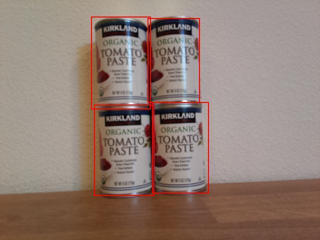

<!--
CO_OP_TRANSLATOR_METADATA:
{
  "original_hash": "0b2ae20b0fc8e73c9598dea937cac038",
  "translation_date": "2025-08-25T16:22:07+00:00",
  "source_file": "5-retail/lessons/2-check-stock-device/wio-terminal-count-stock.md",
  "language_code": "hi"
}
-->
# अपने IoT डिवाइस से स्टॉक गिनें - Wio Terminal

भविष्यवाणियों और उनके बॉक्सिंग बॉक्स का संयोजन छवि में स्टॉक गिनने के लिए उपयोग किया जा सकता है।

## स्टॉक गिनें



ऊपर दिखाई गई छवि में, बॉक्सिंग बॉक्स थोड़ा ओवरलैप कर रहे हैं। यदि यह ओवरलैप बहुत बड़ा होता, तो बॉक्सिंग बॉक्स एक ही वस्तु को इंगित कर सकते थे। वस्तुओं को सही तरीके से गिनने के लिए, आपको उन बॉक्स को नजरअंदाज करना होगा जिनमें महत्वपूर्ण ओवरलैप है।

### कार्य - ओवरलैप को नजरअंदाज करते हुए स्टॉक गिनें

1. यदि आपका `stock-counter` प्रोजेक्ट पहले से खुला नहीं है, तो इसे खोलें।

1. `processPredictions` फ़ंक्शन के ऊपर निम्नलिखित कोड जोड़ें:

    ```cpp
    const float overlap_threshold = 0.20f;
    ```

    यह परिभाषित करता है कि बॉक्सिंग बॉक्स को एक ही वस्तु मानने से पहले कितना प्रतिशत ओवरलैप की अनुमति है। 0.20 का मतलब है 20% ओवरलैप।

1. इसके नीचे, और `processPredictions` फ़ंक्शन के ऊपर, दो आयतों के बीच ओवरलैप की गणना करने के लिए निम्नलिखित कोड जोड़ें:

    ```cpp
    struct Point {
        float x, y;
    };

    struct Rect {
        Point topLeft, bottomRight;
    };

    float area(Rect rect)
    {
        return abs(rect.bottomRight.x - rect.topLeft.x) * abs(rect.bottomRight.y - rect.topLeft.y);
    }
     
    float overlappingArea(Rect rect1, Rect rect2)
    {
        float left = max(rect1.topLeft.x, rect2.topLeft.x);
        float right = min(rect1.bottomRight.x, rect2.bottomRight.x);
        float top = max(rect1.topLeft.y, rect2.topLeft.y);
        float bottom = min(rect1.bottomRight.y, rect2.bottomRight.y);
    
    
        if ( right > left && bottom > top )
        {
            return (right-left)*(bottom-top);
        }
        
        return 0.0f;
    }
    ```

    यह कोड एक `Point` स्ट्रक्चर परिभाषित करता है जो छवि पर बिंदुओं को संग्रहीत करता है, और एक `Rect` स्ट्रक्चर परिभाषित करता है जो एक आयत को शीर्ष बाएं और नीचे दाएं समन्वय का उपयोग करके परिभाषित करता है। फिर यह एक `area` फ़ंक्शन परिभाषित करता है जो शीर्ष बाएं और नीचे दाएं समन्वय से आयत का क्षेत्रफल गणना करता है।

    इसके बाद यह एक `overlappingArea` फ़ंक्शन परिभाषित करता है जो 2 आयतों के ओवरलैपिंग क्षेत्रफल की गणना करता है। यदि वे ओवरलैप नहीं करते हैं, तो यह 0 लौटाता है।

1. `overlappingArea` फ़ंक्शन के नीचे, एक फ़ंक्शन घोषित करें जो बॉक्सिंग बॉक्स को `Rect` में बदलता है:

    ```cpp
    Rect rectFromBoundingBox(JsonVariant prediction)
    {
        JsonObject bounding_box = prediction["boundingBox"].as<JsonObject>();
    
        float left = bounding_box["left"].as<float>();
        float top = bounding_box["top"].as<float>();
        float width = bounding_box["width"].as<float>();
        float height = bounding_box["height"].as<float>();
    
        Point topLeft = {left, top};
        Point bottomRight = {left + width, top + height};
    
        return {topLeft, bottomRight};
    }
    ```

    यह ऑब्जेक्ट डिटेक्टर से एक भविष्यवाणी लेता है, बॉक्सिंग बॉक्स निकालता है और बॉक्सिंग बॉक्स के मानों का उपयोग करके एक आयत को परिभाषित करता है। दाईं ओर को बाईं ओर प्लस चौड़ाई से गणना की जाती है। नीचे को शीर्ष प्लस ऊंचाई के रूप में गणना की जाती है।

1. भविष्यवाणियों को एक-दूसरे से तुलना करने की आवश्यकता है, और यदि 2 भविष्यवाणियों में थ्रेशोल्ड से अधिक ओवरलैप है, तो उनमें से एक को हटाने की आवश्यकता है। ओवरलैप थ्रेशोल्ड एक प्रतिशत है, इसलिए इसे सबसे छोटे बॉक्सिंग बॉक्स के आकार से गुणा करने की आवश्यकता है ताकि यह जांचा जा सके कि ओवरलैप बॉक्सिंग बॉक्स के दिए गए प्रतिशत से अधिक है, न कि पूरे छवि के दिए गए प्रतिशत से। `processPredictions` फ़ंक्शन की सामग्री को हटाकर शुरू करें।

1. खाली `processPredictions` फ़ंक्शन में निम्नलिखित जोड़ें:

    ```cpp
    std::vector<JsonVariant> passed_predictions;

    for (int i = 0; i < predictions.size(); ++i)
    {
        Rect prediction_1_rect = rectFromBoundingBox(predictions[i]);
        float prediction_1_area = area(prediction_1_rect);
        bool passed = true;

        for (int j = i + 1; j < predictions.size(); ++j)
        {
            Rect prediction_2_rect = rectFromBoundingBox(predictions[j]);
            float prediction_2_area = area(prediction_2_rect);

            float overlap = overlappingArea(prediction_1_rect, prediction_2_rect);
            float smallest_area = min(prediction_1_area, prediction_2_area);

            if (overlap > (overlap_threshold * smallest_area))
            {
                passed = false;
                break;
            }
        }

        if (passed)
        {
            passed_predictions.push_back(predictions[i]);
        }
    }
    ```

    यह कोड उन भविष्यवाणियों को संग्रहीत करने के लिए एक वेक्टर घोषित करता है जो ओवरलैप नहीं करते हैं। फिर यह सभी भविष्यवाणियों के माध्यम से लूप करता है, बॉक्सिंग बॉक्स से एक `Rect` बनाता है।

    इसके बाद यह शेष भविष्यवाणियों के माध्यम से लूप करता है, वर्तमान भविष्यवाणी के बाद से शुरू करते हुए। यह भविष्यवाणियों को एक से अधिक बार तुलना करने से रोकता है - एक बार 1 और 2 की तुलना हो जाने के बाद, 2 को 1 से तुलना करने की आवश्यकता नहीं है, केवल 3, 4, आदि से।

    प्रत्येक भविष्यवाणी जोड़ी के लिए ओवरलैपिंग क्षेत्रफल की गणना की जाती है। फिर इसे सबसे छोटे बॉक्सिंग बॉक्स के क्षेत्रफल से तुलना की जाती है - यदि ओवरलैप सबसे छोटे बॉक्सिंग बॉक्स के थ्रेशोल्ड प्रतिशत से अधिक है, तो भविष्यवाणी को पास नहीं माना जाता है। यदि सभी ओवरलैप की तुलना के बाद भविष्यवाणी पास हो जाती है, तो इसे `passed_predictions` संग्रह में जोड़ा जाता है।

    > 💁 यह ओवरलैप को हटाने का एक बहुत ही सरल तरीका है, बस ओवरलैपिंग जोड़ी में से पहले वाले को हटा देना। प्रोडक्शन कोड के लिए, आप यहां अधिक लॉजिक डालना चाहेंगे, जैसे कि कई वस्तुओं के बीच ओवरलैप पर विचार करना, या यदि एक बॉक्सिंग बॉक्स दूसरे में समाहित है।

1. इसके बाद, पास की गई भविष्यवाणियों का विवरण सीरियल मॉनिटर पर भेजने के लिए निम्नलिखित कोड जोड़ें:

    ```cpp
    for(JsonVariant prediction : passed_predictions)
    {
        String boundingBox = prediction["boundingBox"].as<String>();
        String tag = prediction["tagName"].as<String>();
        float probability = prediction["probability"].as<float>();

        char buff[32];
        sprintf(buff, "%s:\t%.2f%%\t%s", tag.c_str(), probability * 100.0, boundingBox.c_str());
        Serial.println(buff);
    }
    ```

    यह कोड पास की गई भविष्यवाणियों के माध्यम से लूप करता है और उनके विवरण को सीरियल मॉनिटर पर प्रिंट करता है।

1. इसके नीचे, गिने गए वस्तुओं की संख्या को सीरियल मॉनिटर पर प्रिंट करने के लिए कोड जोड़ें:

    ```cpp
    Serial.print("Counted ");
    Serial.print(passed_predictions.size());
    Serial.println(" stock items.");
    ```

    इसे फिर IoT सेवा को भेजा जा सकता है ताकि स्टॉक स्तर कम होने पर अलर्ट किया जा सके।

1. अपना कोड अपलोड करें और चलाएं। शेल्फ पर वस्तुओं की ओर कैमरा इंगित करें और C बटन दबाएं। `overlap_threshold` मान को समायोजित करने का प्रयास करें ताकि भविष्यवाणियों को नजरअंदाज किया जा सके।

    ```output
    Connecting to WiFi..
    Connected!
    Image captured
    Image read to buffer with length 17416
    tomato paste:   35.84%  {"left":0.395631,"top":0.215897,"width":0.180768,"height":0.359364}
    tomato paste:   35.87%  {"left":0.378554,"top":0.583012,"width":0.14824,"height":0.359382}
    tomato paste:   34.11%  {"left":0.699024,"top":0.592617,"width":0.124411,"height":0.350456}
    tomato paste:   35.16%  {"left":0.513006,"top":0.647853,"width":0.187472,"height":0.325817}
    Counted 4 stock items.
    ```

> 💁 आप इस कोड को [code-count/wio-terminal](../../../../../5-retail/lessons/2-check-stock-device/code-count/wio-terminal) फ़ोल्डर में पा सकते हैं।

😀 आपका स्टॉक काउंटर प्रोग्राम सफल रहा!

**अस्वीकरण**:  
यह दस्तावेज़ AI अनुवाद सेवा [Co-op Translator](https://github.com/Azure/co-op-translator) का उपयोग करके अनुवादित किया गया है। जबकि हम सटीकता सुनिश्चित करने का प्रयास करते हैं, कृपया ध्यान दें कि स्वचालित अनुवाद में त्रुटियां या अशुद्धियां हो सकती हैं। मूल भाषा में उपलब्ध मूल दस्तावेज़ को प्रामाणिक स्रोत माना जाना चाहिए। महत्वपूर्ण जानकारी के लिए, पेशेवर मानव अनुवाद की सिफारिश की जाती है। इस अनुवाद के उपयोग से उत्पन्न किसी भी गलतफहमी या गलत व्याख्या के लिए हम उत्तरदायी नहीं हैं।