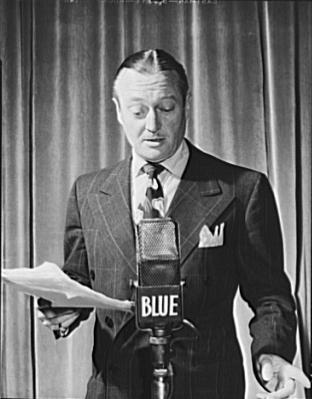

<!--
CO_OP_TRANSLATOR_METADATA:
{
  "original_hash": "6d6aa1be033625d201a190fc9c5cbfb4",
  "translation_date": "2025-08-25T17:50:45+00:00",
  "source_file": "6-consumer/lessons/1-speech-recognition/README.md",
  "language_code": "hi"
}
-->
# IoT डिवाइस के साथ भाषण को पहचानें


> स्केच नोट [नित्या नरसिम्हन](https://github.com/nitya) द्वारा। बड़े संस्करण के लिए छवि पर क्लिक करें।

यह वीडियो Azure भाषण सेवा का अवलोकन देता है, जो इस पाठ में कवर किया जाएगा:

[](https://www.youtube.com/watch?v=iW0Fw0l3mrA)

> 🎥 वीडियो देखने के लिए ऊपर दी गई छवि पर क्लिक करें

## प्री-लेक्चर क्विज़

[प्री-लेक्चर क्विज़](https://black-meadow-040d15503.1.azurestaticapps.net/quiz/41)

## परिचय

'एलेक्सा, 12 मिनट का टाइमर सेट करें'

'एलेक्सा, टाइमर की स्थिति'

'एलेक्सा, 8 मिनट का टाइमर सेट करें जिसका नाम स्टीम ब्रोकोली है'

स्मार्ट डिवाइस हमारे जीवन में तेजी से शामिल हो रहे हैं। न केवल स्मार्ट स्पीकर जैसे HomePods, Echos और Google Homes के रूप में, बल्कि हमारे फोन, घड़ियों, और यहां तक कि लाइट फिटिंग और थर्मोस्टैट्स में भी।

> 💁 मेरे घर में कम से कम 19 डिवाइस हैं जिनमें वॉयस असिस्टेंट हैं, और यह केवल वे हैं जिनके बारे में मुझे पता है!

वॉयस कंट्रोल उन लोगों के लिए पहुंच बढ़ाता है जिनकी गतिशीलता सीमित है। चाहे वह जन्मजात विकलांगता हो जैसे बिना हाथों के जन्म लेना, अस्थायी विकलांगता जैसे टूटे हुए हाथ, या खरीदारी या छोटे बच्चों से भरे हाथ, हमारी आवाज़ से घर को नियंत्रित करने की क्षमता हमारे हाथों के बजाय एक नई दुनिया खोलती है। 'हे सिरी, मेरा गेराज दरवाजा बंद करो' चिल्लाना, जबकि आप एक बच्चे को संभाल रहे हैं और एक शरारती बच्चे से निपट रहे हैं, जीवन में एक छोटा लेकिन प्रभावी सुधार हो सकता है।

वॉयस असिस्टेंट का एक लोकप्रिय उपयोग टाइमर सेट करना है, विशेष रूप से किचन टाइमर। केवल अपनी आवाज़ से कई टाइमर सेट करने की क्षमता रसोई में बहुत मददगार होती है - आटा गूंथने, सूप हिलाने, या अपने हाथों से डंपलिंग भरने को साफ करने की आवश्यकता नहीं होती।

इस पाठ में आप IoT डिवाइस में वॉयस रिकग्निशन बनाने के बारे में जानेंगे। आप माइक्रोफोन को सेंसर के रूप में समझेंगे, IoT डिवाइस से जुड़े माइक्रोफोन से ऑडियो कैप्चर करना सीखेंगे, और सुनी गई बात को टेक्स्ट में बदलने के लिए AI का उपयोग करना सीखेंगे। इस प्रोजेक्ट के बाकी हिस्सों में आप एक स्मार्ट किचन टाइमर बनाएंगे, जो आपकी आवाज़ का उपयोग करके कई भाषाओं में टाइमर सेट कर सके।

इस पाठ में हम निम्नलिखित को कवर करेंगे:

* [माइक्रोफोन](../../../../../6-consumer/lessons/1-speech-recognition)
* [अपने IoT डिवाइस से ऑडियो कैप्चर करें](../../../../../6-consumer/lessons/1-speech-recognition)
* [स्पीच टू टेक्स्ट](../../../../../6-consumer/lessons/1-speech-recognition)
* [भाषण को टेक्स्ट में बदलें](../../../../../6-consumer/lessons/1-speech-recognition)

## माइक्रोफोन

माइक्रोफोन एनालॉग सेंसर होते हैं जो ध्वनि तरंगों को विद्युत संकेतों में बदलते हैं। हवा में कंपन माइक्रोफोन के घटकों को बहुत छोटे स्तर पर हिलाते हैं, और ये छोटे बदलाव विद्युत संकेतों में परिवर्तन करते हैं। इन परिवर्तनों को बढ़ाकर विद्युत आउटपुट उत्पन्न किया जाता है।

### माइक्रोफोन के प्रकार

माइक्रोफोन विभिन्न प्रकारों में आते हैं:

* डायनामिक - डायनामिक माइक्रोफोन में एक चुंबक होता है जो एक चलने वाले डायाफ्राम से जुड़ा होता है, जो तार के कॉइल में विद्युत धारा उत्पन्न करता है। यह अधिकांश लाउडस्पीकरों के विपरीत होता है, जो विद्युत धारा का उपयोग करके चुंबक को कॉइल में हिलाते हैं, डायाफ्राम को ध्वनि उत्पन्न करने के लिए हिलाते हैं। इसका मतलब है कि स्पीकर को डायनामिक माइक्रोफोन के रूप में उपयोग किया जा सकता है, और डायनामिक माइक्रोफोन को स्पीकर के रूप में उपयोग किया जा सकता है। इंटरकॉम जैसे डिवाइस में, जहां उपयोगकर्ता या तो सुन रहा होता है या बोल रहा होता है, लेकिन दोनों नहीं, एक डिवाइस स्पीकर और माइक्रोफोन दोनों के रूप में कार्य कर सकता है।

    डायनामिक माइक्रोफोन को काम करने के लिए बिजली की आवश्यकता नहीं होती, विद्युत संकेत पूरी तरह से माइक्रोफोन से उत्पन्न होता है।

    

* रिबन - रिबन माइक्रोफोन डायनामिक माइक्रोफोन के समान होते हैं, लेकिन इनमें डायाफ्राम के बजाय एक धातु रिबन होता है। यह रिबन चुंबकीय क्षेत्र में हिलता है और विद्युत धारा उत्पन्न करता है। डायनामिक माइक्रोफोन की तरह, रिबन माइक्रोफोन को काम करने के लिए बिजली की आवश्यकता नहीं होती।

    

* कंडेंसर - कंडेंसर माइक्रोफोन में एक पतला धातु डायाफ्राम और एक स्थिर धातु बैकप्लेट होता है। इन दोनों पर बिजली लगाई जाती है और जैसे ही डायाफ्राम हिलता है, प्लेटों के बीच स्थिर चार्ज बदलता है और एक संकेत उत्पन्न करता है। कंडेंसर माइक्रोफोन को काम करने के लिए बिजली की आवश्यकता होती है - जिसे *फैंटम पावर* कहा जाता है।

    

* MEMS - माइक्रोइलेक्ट्रोमैकेनिकल सिस्टम माइक्रोफोन, या MEMS, चिप पर माइक्रोफोन होते हैं। इनमें सिलिकॉन चिप पर दबाव-संवेदनशील डायाफ्राम होता है, और यह कंडेंसर माइक्रोफोन के समान काम करता है। ये माइक्रोफोन बहुत छोटे हो सकते हैं और सर्किटरी में एकीकृत हो सकते हैं।

    

    ऊपर दी गई छवि में, **LEFT** लेबल वाला चिप एक MEMS माइक्रोफोन है, जिसमें एक छोटा डायाफ्राम है जो एक मिलीमीटर से भी कम चौड़ा है।

✅ शोध करें: आपके आसपास कौन-कौन से माइक्रोफोन हैं - चाहे वह आपके कंप्यूटर, फोन, हेडसेट या अन्य डिवाइस में हो। वे किस प्रकार के माइक्रोफोन हैं?

### डिजिटल ऑडियो

ऑडियो एक एनालॉग संकेत है जो बहुत सूक्ष्म जानकारी ले जाता है। इस संकेत को डिजिटल में बदलने के लिए, ऑडियो को प्रति सेकंड हजारों बार सैंपल किया जाना चाहिए।

> 🎓 सैंपलिंग ऑडियो संकेत को डिजिटल मान में बदलने की प्रक्रिया है, जो उस समय संकेत का प्रतिनिधित्व करता है।


डिजिटल ऑडियो को पल्स कोड मॉड्यूलेशन, या PCM का उपयोग करके सैंपल किया जाता है। PCM में संकेत के वोल्टेज को पढ़ना और उस वोल्टेज के सबसे करीब डिस्क्रीट मान का चयन करना शामिल है।

> 💁 आप PCM को पल्स विड्थ मॉड्यूलेशन, या PWM के सेंसर संस्करण के रूप में सोच सकते हैं (PWM को [शुरुआती प्रोजेक्ट के पाठ 3](../../../1-getting-started/lessons/3-sensors-and-actuators/README.md#pulse-width-modulation) में कवर किया गया था)। PCM एनालॉग संकेत को डिजिटल में बदलता है, PWM डिजिटल संकेत को एनालॉग में बदलता है।

उदाहरण के लिए, अधिकांश स्ट्रीमिंग म्यूजिक सेवाएं 16-बिट या 24-बिट ऑडियो प्रदान करती हैं। इसका मतलब है कि वे वोल्टेज को एक मान में बदलते हैं जो 16-बिट या 24-बिट पूर्णांक में फिट होता है। 16-बिट ऑडियो -32,768 से 32,767 की सीमा में फिट होता है, 24-बिट −8,388,608 से 8,388,607 की सीमा में। जितने अधिक बिट्स, सैंपल उतना ही हमारे कानों द्वारा सुने गए वास्तविक ऑडियो के करीब होता है।

> 💁 आपने 8-बिट ऑडियो के बारे में सुना होगा, जिसे अक्सर LoFi कहा जाता है। यह केवल 8-बिट का उपयोग करके सैंपल किया गया ऑडियो है, इसलिए -128 से 127। पहले कंप्यूटर ऑडियो हार्डवेयर सीमाओं के कारण 8-बिट तक सीमित था, इसलिए यह अक्सर रेट्रो गेमिंग में देखा जाता है।

ये सैंपल प्रति सेकंड हजारों बार लिए जाते हैं, अच्छी तरह से परिभाषित सैंपल दरों का उपयोग करते हुए, जिसे KHz (प्रति सेकंड हजारों रीडिंग) में मापा जाता है। स्ट्रीमिंग म्यूजिक सेवाएं अधिकांश ऑडियो के लिए 48KHz का उपयोग करती हैं, लेकिन कुछ 'लॉसलेस' ऑडियो 96KHz या यहां तक कि 192KHz तक का उपयोग करता है। सैंपल दर जितनी अधिक होगी, ऑडियो मूल के उतना ही करीब होगा, एक सीमा तक। इस बात पर बहस है कि क्या मनुष्य 48KHz से ऊपर के अंतर को पहचान सकते हैं।

✅ शोध करें: यदि आप स्ट्रीमिंग म्यूजिक सेवा का उपयोग करते हैं, तो यह कौन सी सैंपल दर और आकार का उपयोग करती है? यदि आप CDs का उपयोग करते हैं, तो CD ऑडियो की सैंपल दर और आकार क्या है?

ऑडियो डेटा के लिए कई अलग-अलग प्रारूप हैं। आपने शायद mp3 फाइलों के बारे में सुना होगा - ऑडियो डेटा जो गुणवत्ता खोए बिना छोटा किया गया है। बिना कंप्रेस किए ऑडियो अक्सर WAV फाइल के रूप में संग्रहीत किया जाता है - यह एक फाइल है जिसमें 44 बाइट्स का हेडर जानकारी होती है, उसके बाद कच्चा ऑडियो डेटा होता है। हेडर में सैंपल दर (उदाहरण के लिए 16000 के लिए 16KHz), सैंपल आकार (16 के लिए 16-बिट), और चैनलों की संख्या जैसी जानकारी होती है। हेडर के बाद, WAV फाइल में कच्चा ऑडियो डेटा होता है।

> 🎓 चैनल्स का मतलब है कि ऑडियो में कितने अलग-अलग ऑडियो स्ट्रीम शामिल हैं। उदाहरण के लिए, स्टीरियो ऑडियो के लिए जिसमें बाएं और दाएं चैनल होते हैं, 2 चैनल होंगे। होम थिएटर सिस्टम के लिए 7.1 सराउंड साउंड के लिए यह 8 होगा।

### ऑडियो डेटा का आकार

ऑडियो डेटा अपेक्षाकृत बड़ा होता है। उदाहरण के लिए, बिना कंप्रेस किए 16-बिट ऑडियो को 16KHz पर कैप्चर करना (स्पीच टू टेक्स्ट मॉडल के लिए पर्याप्त दर), प्रति सेकंड 32KB डेटा लेता है:

* 16-बिट का मतलब है प्रति सैंपल 2 बाइट्स (1 बाइट 8 बिट्स है)।
* 16KHz का मतलब है प्रति सेकंड 16,000 सैंपल।
* 16,000 x 2 बाइट्स = 32,000 बाइट्स प्रति सेकंड।

यह डेटा की छोटी मात्रा लगती है, लेकिन यदि आप सीमित मेमोरी वाले माइक्रोकंट्रोलर का उपयोग कर रहे हैं, तो यह बहुत अधिक हो सकता है। उदाहरण के लिए, Wio Terminal में 192KB मेमोरी है, और इसमें प्रोग्राम कोड और वेरिएबल्स को स्टोर करना होता है। भले ही आपका प्रोग्राम कोड छोटा हो, आप 5 सेकंड से अधिक ऑडियो कैप्चर नहीं कर सकते।

माइक्रोकंट्रोलर अतिरिक्त स्टोरेज तक पहुंच सकते हैं, जैसे SD कार्ड या फ्लैश मेमोरी। जब आप ऑडियो कैप्चर करने वाला IoT डिवाइस बना रहे हैं, तो आपको यह सुनिश्चित करना होगा कि आपके पास अतिरिक्त स्टोरेज है, और आपका कोड माइक्रोफोन से कैप्चर किए गए ऑडियो को सीधे उस स्टोरेज में लिखता है। जब इसे क्लाउड में भेजा जाता है, तो आप स्टोरेज से वेब अनुरोध तक स्ट्रीम करते हैं। इस तरह आप मेमोरी खत्म होने से बच सकते हैं, जो पूरे ऑडियो डेटा को एक बार में मेमोरी में रखने की कोशिश करता है।

## अपने IoT डिवाइस से ऑडियो कैप्चर करें

आपका IoT डिवाइस माइक्रोफोन से जुड़ा हो सकता है ताकि ऑडियो कैप्चर किया जा सके, जिसे टेक्स्ट में बदलने के लिए तैयार किया जा सके। इसे स्पीकर से भी जोड़ा जा सकता है ताकि ऑडियो आउटपुट किया जा सके। बाद के पाठों में इसका उपयोग ऑडियो फीडबैक देने के लिए किया जाएगा, लेकिन माइक्रोफोन का परीक्षण करने के लिए अभी स्पीकर सेट करना उपयोगी है।

### कार्य - अपने माइक्रोफोन और स्पीकर को कॉन्फ़िगर करें

अपने IoT डिवाइस के लिए माइक्रोफोन और स्पीकर को कॉन्फ़िगर करने के लिए संबंधित गाइड का पालन करें:

* [Arduino - Wio Terminal](wio-terminal-microphone.md)
* [सिंगल-बोर्ड कंप्यूटर - Raspberry Pi](pi-microphone.md)
* [सिंगल-बोर्ड कंप्यूटर - वर्चुअल डिवाइस](virtual-device-microphone.md)

### कार्य - ऑडियो कैप्चर करें

अपने IoT डिवाइस पर ऑडियो कैप्चर करने के लिए संबंधित गाइड का पालन करें:

* [Arduino - Wio Terminal](wio-terminal-audio.md)
* [सिंगल-बोर्ड कंप्यूटर - Raspberry Pi](pi-audio.md)
* [सिंगल-बोर्ड कंप्यूटर - वर्चुअल डिवाइस](virtual-device-audio.md)

## स्पीच टू टेक्स्ट

स्पीच टू टेक्स्ट, या भाषण पहचान, AI का उपयोग करके ऑडियो संकेत में शब्दों को टेक्स्ट में बदलने की प्रक्रिया है।

### भाषण पहचान मॉडल

भाषण को टेक्स्ट में बदलने के लिए, ऑडियो संकेत के नमूनों को समूहित किया जाता है और एक मशीन लर्निंग मॉडल में भेजा जाता है जो Recurrent Neural Network (RNN) पर आधारित होता है। यह मशीन लर्निंग मॉडल का एक प्रकार है जो पिछले डेटा का उपयोग करके आने वाले डेटा के बारे में निर्णय ले सकता है। उदाहरण के लिए, RNN एक ऑडियो नमूने को 'Hel' ध्वनि के रूप में पहचान सकता है, और जब इसे 'lo' ध्वनि के रूप में एक और नमूना मिलता है, तो यह पिछले ध्वनि के साथ इसे जोड़ सकता है, 'Hello' को एक मान्य शब्द के रूप में पहचान सकता है और इसे परिणाम के रूप में चुन सकता है।

ML मॉडल हमेशा हर बार समान आकार का डेटा स्वीकार करते हैं। आपने पहले के पाठ में जो इमेज क्लासिफायर बनाया था, वह छवियों को एक निश्चित आकार में बदलता है और उन्हें प्रोसेस करता है। भाषण मॉडल के साथ भी ऐसा ही होता है, उन्हें निश्चित आकार के ऑडियो टुकड़ों को प्रोसेस करना होता है। भाषण मॉडल को कई भविष्यवाणियों के आउटपुट को जोड़ने में सक्षम होना चाहिए ताकि वह 'Hi' और 'Highway', या 'flock' और 'floccinaucinihilipilification' के बीच अंतर कर सके।

भाषण मॉडल इतने उन्नत होते हैं कि वे संदर्भ को समझ सकते हैं और जैसे-जैसे अधिक ध्वनियां प्रोसेस होती हैं, वे शब्दों को सही कर सकते हैं। उदाहरण के लिए, यदि आप कहते हैं "मैं दुकान पर गया दो केले और एक सेब भी लेने", तो आप तीन शब्दों का उपयोग करेंगे जो समान ध्वनि करते हैं, लेकिन अलग-अलग तरीके से लिखे जाते हैं - to, two और too। भाषण मॉडल संदर्भ को समझने और शब्द की उपयुक्त वर्तनी का उपयोग करने में सक्षम होते हैं।
💁 कुछ वाणी सेवाएँ अनुकूलन की अनुमति देती हैं ताकि वे शोरगुल वाले वातावरण जैसे फैक्ट्रियों में, या उद्योग-विशिष्ट शब्दों जैसे रासायनिक नामों के साथ बेहतर काम कर सकें। इन अनुकूलनों को नमूना ऑडियो और एक प्रतिलिपि प्रदान करके प्रशिक्षित किया जाता है, और यह ट्रांसफर लर्निंग का उपयोग करके काम करता है, ठीक वैसे ही जैसे आपने पहले के पाठ में केवल कुछ छवियों का उपयोग करके एक इमेज क्लासिफायर को प्रशिक्षित किया था।
### गोपनीयता

किसी उपभोक्ता IoT डिवाइस में स्पीच-टू-टेक्स्ट का उपयोग करते समय, गोपनीयता अत्यंत महत्वपूर्ण होती है। ये डिवाइस लगातार ऑडियो सुनते हैं, इसलिए एक उपभोक्ता के रूप में आप नहीं चाहेंगे कि आपकी हर बात क्लाउड पर भेजी जाए और टेक्स्ट में परिवर्तित हो। इससे न केवल इंटरनेट बैंडविड्थ का अत्यधिक उपयोग होगा, बल्कि गोपनीयता पर भी गंभीर प्रभाव पड़ेगा, खासकर जब कुछ स्मार्ट डिवाइस निर्माता ऑडियो को यादृच्छिक रूप से चुनते हैं ताकि [मानव इसे टेक्स्ट के साथ सत्यापित कर सकें और अपने मॉडल को बेहतर बना सकें](https://www.theverge.com/2019/4/10/18305378/amazon-alexa-ai-voice-assistant-annotation-listen-private-recordings)।

आप केवल तब चाहेंगे कि आपका स्मार्ट डिवाइस ऑडियो को क्लाउड पर भेजे जब आप इसका उपयोग कर रहे हों, न कि जब यह आपके घर में ऑडियो सुनता है, जिसमें निजी बैठकें या अंतरंग बातचीत शामिल हो सकती हैं। अधिकांश स्मार्ट डिवाइस *वेक वर्ड* के साथ काम करते हैं, जैसे "Alexa", "Hey Siri", या "OK Google"। ये की-वाक्य डिवाइस को 'जागने' और आपकी बात सुनने के लिए प्रेरित करते हैं, जब तक कि यह आपके भाषण में विराम का पता नहीं लगाता, जो संकेत देता है कि आपने डिवाइस से बात करना समाप्त कर दिया है।

> 🎓 वेक वर्ड डिटेक्शन को *कीवर्ड स्पॉटिंग* या *कीवर्ड रिकग्निशन* भी कहा जाता है।

ये वेक वर्ड डिवाइस पर ही पहचाने जाते हैं, क्लाउड पर नहीं। ये स्मार्ट डिवाइस छोटे AI मॉडल का उपयोग करते हैं जो डिवाइस पर चलते हैं और वेक वर्ड को सुनते हैं। जब वेक वर्ड का पता चलता है, तो ये ऑडियो को क्लाउड पर पहचान के लिए स्ट्रीम करना शुरू कर देते हैं। ये मॉडल बहुत विशिष्ट होते हैं और केवल वेक वर्ड को सुनते हैं।

> 💁 कुछ टेक कंपनियां अपने डिवाइस में अधिक गोपनीयता जोड़ रही हैं और स्पीच-टू-टेक्स्ट रूपांतरण को डिवाइस पर ही कर रही हैं। Apple ने घोषणा की है कि उनके 2021 iOS और macOS अपडेट के हिस्से के रूप में वे डिवाइस पर स्पीच-टू-टेक्स्ट रूपांतरण का समर्थन करेंगे और कई अनुरोधों को क्लाउड का उपयोग किए बिना संभाल सकेंगे। यह उनके डिवाइस में शक्तिशाली प्रोसेसर होने के कारण संभव है, जो ML मॉडल चला सकते हैं।

✅ आपके विचार में क्लाउड पर भेजे गए ऑडियो को संग्रहीत करने के गोपनीयता और नैतिक प्रभाव क्या हैं? क्या इस ऑडियो को संग्रहीत किया जाना चाहिए, और यदि हां, तो कैसे? क्या आप रिकॉर्डिंग का उपयोग कानून प्रवर्तन के लिए गोपनीयता के नुकसान के बदले में एक अच्छा समझौता मानते हैं?

वेक वर्ड डिटेक्शन आमतौर पर एक तकनीक का उपयोग करता है जिसे TinyML कहा जाता है, जो ML मॉडल को माइक्रोकंट्रोलर पर चलाने योग्य बनाने के लिए परिवर्तित करता है। ये मॉडल आकार में छोटे होते हैं और इन्हें चलाने में बहुत कम ऊर्जा की आवश्यकता होती है।

वेक वर्ड मॉडल को प्रशिक्षित करने और उपयोग करने की जटिलता से बचने के लिए, इस पाठ में आप जो स्मार्ट टाइमर बना रहे हैं, वह स्पीच रिकग्निशन चालू करने के लिए एक बटन का उपयोग करेगा।

> 💁 यदि आप Wio Terminal या Raspberry Pi पर चलाने के लिए वेक वर्ड डिटेक्शन मॉडल बनाना चाहते हैं, तो Edge Impulse के इस [आपकी आवाज़ पर प्रतिक्रिया देने वाले ट्यूटोरियल](https://docs.edgeimpulse.com/docs/responding-to-your-voice) को देखें। यदि आप अपने कंप्यूटर का उपयोग करना चाहते हैं, तो Microsoft Docs पर [कस्टम कीवर्ड क्विकस्टार्ट](https://docs.microsoft.com/azure/cognitive-services/speech-service/keyword-recognition-overview?WT.mc_id=academic-17441-jabenn) को आज़माएं।

## स्पीच को टेक्स्ट में बदलें


जैसे कि एक पहले प्रोजेक्ट में इमेज क्लासिफिकेशन के साथ किया गया था, वैसे ही कुछ प्री-बिल्ट AI सेवाएं हैं जो ऑडियो फाइल के रूप में स्पीच को टेक्स्ट में बदल सकती हैं। ऐसी ही एक सेवा है स्पीच सर्विस, जो Cognitive Services का हिस्सा है, प्री-बिल्ट AI सेवाएं जिन्हें आप अपने ऐप्स में उपयोग कर सकते हैं।

### कार्य - स्पीच AI संसाधन को कॉन्फ़िगर करें

1. इस प्रोजेक्ट के लिए `smart-timer` नामक एक रिसोर्स ग्रुप बनाएं।

1. निम्नलिखित कमांड का उपयोग करके एक मुफ्त स्पीच संसाधन बनाएं:

    ```sh
    az cognitiveservices account create --name smart-timer \
                                        --resource-group smart-timer \
                                        --kind SpeechServices \
                                        --sku F0 \
                                        --yes \
                                        --location <location>
    ```

    `<location>` को उस स्थान से बदलें जिसे आपने रिसोर्स ग्रुप बनाते समय उपयोग किया था।

1. आपको अपने कोड से स्पीच संसाधन तक पहुंचने के लिए एक API कुंजी की आवश्यकता होगी। कुंजी प्राप्त करने के लिए निम्नलिखित कमांड चलाएं:

    ```sh
    az cognitiveservices account keys list --name smart-timer \
                                           --resource-group smart-timer \
                                           --output table
    ```

    कुंजियों में से एक की कॉपी लें।

### कार्य - स्पीच को टेक्स्ट में बदलें

अपने IoT डिवाइस पर स्पीच को टेक्स्ट में बदलने के लिए संबंधित गाइड का अनुसरण करें:

* [Arduino - Wio Terminal](wio-terminal-speech-to-text.md)
* [Single-board computer - Raspberry Pi](pi-speech-to-text.md)
* [Single-board computer - Virtual device](virtual-device-speech-to-text.md)

---

## 🚀 चुनौती

स्पीच रिकग्निशन लंबे समय से मौजूद है और लगातार सुधार हो रहा है। वर्तमान क्षमताओं पर शोध करें और तुलना करें कि ये समय के साथ कैसे विकसित हुई हैं, जिसमें मशीन ट्रांसक्रिप्शन की सटीकता मानव की तुलना में कैसी है।

आपके विचार में स्पीच रिकग्निशन का भविष्य क्या है?

## पोस्ट-लेक्चर क्विज़

[पोस्ट-लेक्चर क्विज़](https://black-meadow-040d15503.1.azurestaticapps.net/quiz/42)

## समीक्षा और स्व-अध्ययन

* विभिन्न माइक्रोफोन प्रकारों और उनके काम करने के तरीके के बारे में पढ़ें [Musician's HQ पर डायनामिक और कंडेंसर माइक्रोफोन के बीच का अंतर](https://musicianshq.com/whats-the-difference-between-dynamic-and-condenser-microphones/)।
* Microsoft Docs पर [स्पीच सर्विस डाक्यूमेंटेशन](https://docs.microsoft.com/azure/cognitive-services/speech-service/?WT.mc_id=academic-17441-jabenn) पर Cognitive Services स्पीच सर्विस के बारे में अधिक पढ़ें।
* Microsoft Docs पर [कीवर्ड रिकग्निशन डाक्यूमेंटेशन](https://docs.microsoft.com/azure/cognitive-services/speech-service/keyword-recognition-overview?WT.mc_id=academic-17441-jabenn) पर कीवर्ड स्पॉटिंग के बारे में पढ़ें।

## असाइनमेंट

[](assignment.md)

**अस्वीकरण**:  
यह दस्तावेज़ AI अनुवाद सेवा [Co-op Translator](https://github.com/Azure/co-op-translator) का उपयोग करके अनुवादित किया गया है। जबकि हम सटीकता सुनिश्चित करने का प्रयास करते हैं, कृपया ध्यान दें कि स्वचालित अनुवाद में त्रुटियां या अशुद्धियां हो सकती हैं। मूल भाषा में उपलब्ध मूल दस्तावेज़ को प्रामाणिक स्रोत माना जाना चाहिए। महत्वपूर्ण जानकारी के लिए, पेशेवर मानव अनुवाद की सिफारिश की जाती है। इस अनुवाद के उपयोग से उत्पन्न किसी भी गलतफहमी या गलत व्याख्या के लिए हम जिम्मेदार नहीं हैं।