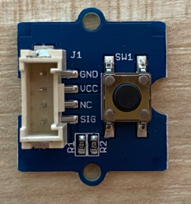

<!--
CO_OP_TRANSLATOR_METADATA:
{
  "original_hash": "0ac0afcfb40cb5970ef4cb74f01c32e9",
  "translation_date": "2025-08-25T17:49:59+00:00",
  "source_file": "6-consumer/lessons/1-speech-recognition/pi-audio.md",
  "language_code": "hi"
}
-->
# ऑडियो कैप्चर करें - रास्पबेरी पाई

इस पाठ के इस भाग में, आप रास्पबेरी पाई पर ऑडियो कैप्चर करने के लिए कोड लिखेंगे। ऑडियो कैप्चर को एक बटन द्वारा नियंत्रित किया जाएगा।

## हार्डवेयर

रास्पबेरी पाई को ऑडियो कैप्चर को नियंत्रित करने के लिए एक बटन की आवश्यकता होती है।

आप जो बटन उपयोग करेंगे वह एक ग्रोव बटन है। यह एक डिजिटल सेंसर है जो सिग्नल को चालू या बंद करता है। इन बटनों को इस तरह से कॉन्फ़िगर किया जा सकता है कि जब बटन दबाया जाए तो यह उच्च सिग्नल भेजे और जब न दबाया जाए तो निम्न सिग्नल, या जब दबाया जाए तो निम्न और जब न दबाया जाए तो उच्च सिग्नल भेजे।

यदि आप माइक्रोफोन के रूप में ReSpeaker 2-Mics Pi HAT का उपयोग कर रहे हैं, तो बटन को कनेक्ट करने की आवश्यकता नहीं है क्योंकि इस HAT में पहले से ही एक बटन लगा हुआ है। अगले सेक्शन पर जाएं।

### बटन कनेक्ट करें

बटन को ग्रोव बेस HAT से जोड़ा जा सकता है।

#### कार्य - बटन कनेक्ट करें



1. ग्रोव केबल के एक सिरे को बटन मॉड्यूल के सॉकेट में डालें। यह केवल एक ही दिशा में जाएगा।

1. रास्पबेरी पाई को बंद करके, ग्रोव केबल के दूसरे सिरे को ग्रोव बेस HAT पर **D5** नामक डिजिटल सॉकेट में कनेक्ट करें। यह सॉकेट GPIO पिन के पास वाले सॉकेट की पंक्ति में बाईं ओर से दूसरा है।


## ऑडियो कैप्चर करें

आप माइक्रोफोन से ऑडियो को पायथन कोड का उपयोग करके कैप्चर कर सकते हैं।

### कार्य - ऑडियो कैप्चर करें

1. पाई को चालू करें और इसके बूट होने का इंतजार करें।

1. VS Code लॉन्च करें, या तो सीधे पाई पर, या Remote SSH एक्सटेंशन के माध्यम से कनेक्ट करें।

1. PyAudio Pip पैकेज में ऑडियो रिकॉर्ड और प्लेबैक करने के लिए फंक्शन होते हैं। इस पैकेज को कुछ ऑडियो लाइब्रेरीज़ की आवश्यकता होती है जिन्हें पहले इंस्टॉल करना होगा। इन कमांड्स को टर्मिनल में चलाएं:

    ```sh
    sudo apt update
    sudo apt install libportaudio0 libportaudio2 libportaudiocpp0 portaudio19-dev libasound2-plugins --yes 
    ```

1. PyAudio Pip पैकेज इंस्टॉल करें।

    ```sh
    pip3 install pyaudio
    ```

1. `smart-timer` नाम का एक नया फोल्डर बनाएं और इस फोल्डर में `app.py` नाम की एक फाइल जोड़ें।

1. इस फाइल के शीर्ष पर निम्नलिखित इम्पोर्ट्स जोड़ें:

    ```python
    import io
    import pyaudio
    import time
    import wave
    
    from grove.factory import Factory
    ```

    यह `pyaudio` मॉड्यूल, वेव फाइल्स को हैंडल करने के लिए कुछ स्टैंडर्ड पायथन मॉड्यूल, और `grove.factory` मॉड्यूल को एक बटन क्लास बनाने के लिए इम्पोर्ट करता है।

1. इसके नीचे, एक ग्रोव बटन बनाने के लिए कोड जोड़ें।

    यदि आप ReSpeaker 2-Mics Pi HAT का उपयोग कर रहे हैं, तो निम्नलिखित कोड का उपयोग करें:

    ```python
    # The button on the ReSpeaker 2-Mics Pi HAT
    button = Factory.getButton("GPIO-LOW", 17)
    ```

    यह **D17** पोर्ट पर एक बटन बनाता है, जो पोर्ट ReSpeaker 2-Mics Pi HAT पर बटन से जुड़ा हुआ है। यह बटन दबाए जाने पर निम्न सिग्नल भेजने के लिए सेट है।

    यदि आप ReSpeaker 2-Mics Pi HAT का उपयोग नहीं कर रहे हैं और ग्रोव बटन का उपयोग कर रहे हैं, तो इस कोड का उपयोग करें:

    ```python
    button = Factory.getButton("GPIO-HIGH", 5)
    ```

    यह **D5** पोर्ट पर एक बटन बनाता है, जो दबाए जाने पर उच्च सिग्नल भेजने के लिए सेट है।

1. इसके नीचे, ऑडियो को हैंडल करने के लिए PyAudio क्लास का एक इंस्टेंस बनाएं:

    ```python
    audio = pyaudio.PyAudio()
    ```

1. माइक्रोफोन और स्पीकर के लिए हार्डवेयर कार्ड नंबर घोषित करें। यह वह नंबर होगा जो आपने इस पाठ में पहले `arecord -l` और `aplay -l` चलाकर पाया था।

    ```python
    microphone_card_number = <microphone card number>
    speaker_card_number = <speaker card number>
    ```

    `<microphone card number>` को अपने माइक्रोफोन के कार्ड नंबर से बदलें।

    `<speaker card number>` को अपने स्पीकर के कार्ड नंबर से बदलें, वही नंबर जिसे आपने `alsa.conf` फाइल में सेट किया था।

1. इसके नीचे, ऑडियो कैप्चर और प्लेबैक के लिए उपयोग करने के लिए सैंपल रेट घोषित करें। आपको इसे अपने हार्डवेयर के आधार पर बदलने की आवश्यकता हो सकती है।

    ```python
    rate = 48000 #48KHz
    ```

    यदि बाद में इस कोड को चलाते समय सैंपल रेट एरर मिलती है, तो इस वैल्यू को `44100` या `16000` में बदलें। वैल्यू जितनी अधिक होगी, साउंड की क्वालिटी उतनी ही बेहतर होगी।

1. इसके नीचे, `capture_audio` नामक एक नया फंक्शन बनाएं। यह माइक्रोफोन से ऑडियो कैप्चर करने के लिए कॉल किया जाएगा:

    ```python
    def capture_audio():
    ```

1. इस फंक्शन के अंदर, ऑडियो कैप्चर करने के लिए निम्नलिखित जोड़ें:

    ```python
    stream = audio.open(format = pyaudio.paInt16,
                        rate = rate,
                        channels = 1, 
                        input_device_index = microphone_card_number,
                        input = True,
                        frames_per_buffer = 4096)

    frames = []

    while button.is_pressed():
        frames.append(stream.read(4096))

    stream.stop_stream()
    stream.close()
    ```

    यह कोड PyAudio ऑब्जेक्ट का उपयोग करके एक ऑडियो इनपुट स्ट्रीम खोलता है। यह स्ट्रीम माइक्रोफोन से 16KHz पर ऑडियो कैप्चर करेगा, इसे 4096 बाइट्स के बफर्स में कैप्चर करेगा।

    कोड तब तक लूप करता है जब तक ग्रोव बटन दबा रहता है, हर बार इन 4096 बाइट बफर्स को एक एरे में पढ़ता है।

    > 💁 आप `open` मेथड को पास किए गए विकल्पों के बारे में अधिक जानकारी [PyAudio डाक्यूमेंटेशन](https://people.csail.mit.edu/hubert/pyaudio/docs/) में पढ़ सकते हैं।

    एक बार जब बटन छोड़ दिया जाता है, तो स्ट्रीम को बंद कर दिया जाता है।

1. इस फंक्शन के अंत में निम्नलिखित जोड़ें:

    ```python
    wav_buffer = io.BytesIO()
    with wave.open(wav_buffer, 'wb') as wavefile:
        wavefile.setnchannels(1)
        wavefile.setsampwidth(audio.get_sample_size(pyaudio.paInt16))
        wavefile.setframerate(rate)
        wavefile.writeframes(b''.join(frames))
        wav_buffer.seek(0)

    return wav_buffer
    ```

    यह कोड एक बाइनरी बफर बनाता है, और सभी कैप्चर किए गए ऑडियो को एक [WAV फाइल](https://wikipedia.org/wiki/WAV) के रूप में लिखता है। यह बिना कंप्रेस किए गए ऑडियो को फाइल में लिखने का एक मानक तरीका है। यह बफर फिर रिटर्न किया जाता है।

1. ऑडियो बफर को प्ले करने के लिए निम्नलिखित `play_audio` फंक्शन जोड़ें:

    ```python
    def play_audio(buffer):
        stream = audio.open(format = pyaudio.paInt16,
                            rate = rate,
                            channels = 1,
                            output_device_index = speaker_card_number,
                            output = True)
    
        with wave.open(buffer, 'rb') as wf:
            data = wf.readframes(4096)
    
            while len(data) > 0:
                stream.write(data)
                data = wf.readframes(4096)
    
            stream.close()
    ```

    यह फंक्शन एक और ऑडियो स्ट्रीम खोलता है, इस बार आउटपुट के लिए - ऑडियो प्ले करने के लिए। यह इनपुट स्ट्रीम के समान सेटिंग्स का उपयोग करता है। बफर को एक वेव फाइल के रूप में खोला जाता है और 4096 बाइट्स के चंक्स में आउटपुट स्ट्रीम में लिखा जाता है, ऑडियो प्ले करता है। फिर स्ट्रीम बंद कर दिया जाता है।

1. `capture_audio` फंक्शन के नीचे निम्नलिखित कोड जोड़ें ताकि यह तब तक लूप करे जब तक बटन दबाया न जाए। एक बार बटन दबाए जाने पर, ऑडियो कैप्चर किया जाएगा और फिर प्ले किया जाएगा।

    ```python
    while True:
        while not button.is_pressed():
            time.sleep(.1)
        
        buffer = capture_audio()
        play_audio(buffer)
    ```

1. कोड चलाएं। बटन दबाएं और माइक्रोफोन में बोलें। जब आप समाप्त कर लें तो बटन छोड़ दें, और आप रिकॉर्डिंग सुनेंगे।

    PyAudio इंस्टेंस बनाए जाने पर आपको कुछ ALSA एरर मिल सकती हैं। यह पाई पर उन ऑडियो डिवाइस के लिए कॉन्फ़िगरेशन के कारण है जो आपके पास नहीं हैं। आप इन एरर को नजरअंदाज कर सकते हैं।

    ```output
    pi@raspberrypi:~/smart-timer $ python3 app.py 
    ALSA lib pcm.c:2565:(snd_pcm_open_noupdate) Unknown PCM cards.pcm.front
    ALSA lib pcm.c:2565:(snd_pcm_open_noupdate) Unknown PCM cards.pcm.rear
    ALSA lib pcm.c:2565:(snd_pcm_open_noupdate) Unknown PCM cards.pcm.center_lfe
    ALSA lib pcm.c:2565:(snd_pcm_open_noupdate) Unknown PCM cards.pcm.side
    ```

    यदि आपको निम्नलिखित एरर मिलती है:

    ```output
    OSError: [Errno -9997] Invalid sample rate
    ```

    तो `rate` को या तो 44100 या 16000 में बदलें।

> 💁 आप इस कोड को [code-record/pi](../../../../../6-consumer/lessons/1-speech-recognition/code-record/pi) फोल्डर में पा सकते हैं।

😀 आपका ऑडियो रिकॉर्डिंग प्रोग्राम सफल रहा!

**अस्वीकरण**:  
यह दस्तावेज़ AI अनुवाद सेवा [Co-op Translator](https://github.com/Azure/co-op-translator) का उपयोग करके अनुवादित किया गया है। जबकि हम सटीकता सुनिश्चित करने का प्रयास करते हैं, कृपया ध्यान दें कि स्वचालित अनुवाद में त्रुटियां या अशुद्धियां हो सकती हैं। मूल भाषा में उपलब्ध मूल दस्तावेज़ को आधिकारिक स्रोत माना जाना चाहिए। महत्वपूर्ण जानकारी के लिए, पेशेवर मानव अनुवाद की सिफारिश की जाती है। इस अनुवाद के उपयोग से उत्पन्न किसी भी गलतफहमी या गलत व्याख्या के लिए हम उत्तरदायी नहीं हैं।