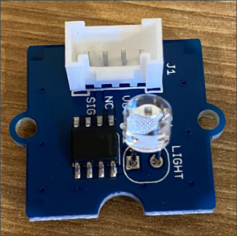

<!--
CO_OP_TRANSLATOR_METADATA:
{
  "original_hash": "ea733bd0cdf2479e082373f765a08678",
  "translation_date": "2025-08-26T15:02:30+00:00",
  "source_file": "1-getting-started/lessons/3-sensors-and-actuators/pi-sensor.md",
  "language_code": "hk"
}
-->
# 建造夜燈 - Raspberry Pi

在這部分課程中，你將為 Raspberry Pi 添加一個光線感測器。

## 硬件

本課程使用的感測器是**光線感測器**，它利用[光電二極管](https://wikipedia.org/wiki/Photodiode)將光轉換為電信號。這是一個類比感測器，會傳送一個介於 0 到 1,000 的整數值，表示相對的光量，但不對應任何標準測量單位，例如 [lux](https://wikipedia.org/wiki/Lux)。

光線感測器是一個外部 Grove 感測器，需要連接到 Raspberry Pi 上的 Grove Base hat。

### 連接光線感測器

用於檢測光線水平的 Grove 光線感測器需要連接到 Raspberry Pi。

#### 任務 - 連接光線感測器

連接光線感測器



1. 將 Grove 電纜的一端插入光線感測器模組上的插座。它只能以一種方式插入。

1. 在 Raspberry Pi 關機的情況下，將 Grove 電纜的另一端連接到 Grove Base hat 上標記為 **A0** 的類比插座。此插座位於 GPIO 插針旁邊插座排的右數第二個。


## 程式設計光線感測器

現在可以使用 Grove 光線感測器進行程式設計。

### 任務 - 程式設計光線感測器

程式設計裝置。

1. 啟動 Raspberry Pi，等待其完成啟動。

1. 在 VS Code 中打開你在上一部分作業中建立的夜燈專案，可以直接在 Pi 上運行，也可以使用 Remote SSH 擴展連接。

1. 打開 `app.py` 文件，並刪除其中的所有程式碼。

1. 在 `app.py` 文件中添加以下程式碼以導入一些所需的庫：

    ```python
    import time
    from grove.grove_light_sensor_v1_2 import GroveLightSensor
    ```

    `import time` 語句導入了 `time` 模組，稍後在本作業中會使用。

    `from grove.grove_light_sensor_v1_2 import GroveLightSensor` 語句從 Grove Python 庫中導入了 `GroveLightSensor`。此庫包含與 Grove 光線感測器交互的程式碼，並在 Pi 設置過程中已全域安裝。

1. 在上述程式碼之後添加以下程式碼，以建立管理光線感測器的類別實例：

    ```python
    light_sensor = GroveLightSensor(0)
    ```

    `light_sensor = GroveLightSensor(0)` 這一行建立了一個 `GroveLightSensor` 類別的實例，連接到 **A0** 插針——光線感測器所連接的 Grove 類比插針。

1. 在上述程式碼之後添加一個無限迴圈，用於輪詢光線感測器的值並將其輸出到控制台：

    ```python
    while True:
        light = light_sensor.light
        print('Light level:', light)
    ```

    這將使用 `GroveLightSensor` 類別的 `light` 屬性讀取 0-1,023 範圍內的當前光線水平。此屬性從插針讀取類比值，然後將該值輸出到控制台。

1. 在迴圈的末尾添加一秒的短暫休眠，因為不需要連續檢查光線水平。休眠可以降低裝置的功耗。

    ```python
    time.sleep(1)
    ```

1. 從 VS Code 的終端運行以下命令以運行你的 Python 應用程式：

    ```sh
    python3 app.py
    ```

    光線值將輸出到控制台。遮住或移開光線感測器，值將發生變化：

    ```output
    pi@raspberrypi:~/nightlight $ python3 app.py 
    Light level: 634
    Light level: 634
    Light level: 634
    Light level: 230
    Light level: 104
    Light level: 290
    ```

> 💁 你可以在 [code-sensor/pi](../../../../../1-getting-started/lessons/3-sensors-and-actuators/code-sensor/pi) 資料夾中找到這段程式碼。

😀 為你的夜燈程式添加感測器成功了！

---

**免責聲明**：  
本文件已使用人工智能翻譯服務 [Co-op Translator](https://github.com/Azure/co-op-translator) 進行翻譯。儘管我們致力於提供準確的翻譯，但請注意，自動翻譯可能包含錯誤或不準確之處。原始語言的文件應被視為權威來源。對於重要資訊，建議使用專業人工翻譯。我們對因使用此翻譯而引起的任何誤解或錯誤解釋概不負責。