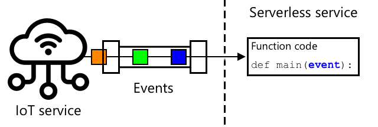

<!--
CO_OP_TRANSLATOR_METADATA:
{
  "original_hash": "5f2d2f4a5a023c93ab34a0cc5b47c0c4",
  "translation_date": "2025-08-26T14:37:08+00:00",
  "source_file": "2-farm/lessons/5-migrate-application-to-the-cloud/README.md",
  "language_code": "hk"
}
-->
# 將應用程式邏輯遷移到雲端


> 手繪筆記由 [Nitya Narasimhan](https://github.com/nitya) 提供。點擊圖片查看更大版本。

本課程是 [IoT for Beginners Project 2 - Digital Agriculture 系列](https://youtube.com/playlist?list=PLmsFUfdnGr3yCutmcVg6eAUEfsGiFXgcx) 的一部分，由 [Microsoft Reactor](https://developer.microsoft.com/reactor/?WT.mc_id=academic-17441-jabenn) 提供。

[](https://youtu.be/VVZDcs5u1_I)

## 課前測驗

[課前測驗](https://black-meadow-040d15503.1.azurestaticapps.net/quiz/17)

## 簡介

在上一課中，您學會了如何將植物土壤濕度監測和繼電器控制連接到基於雲端的 IoT 服務。下一步是將控制繼電器定時的伺服器代碼遷移到雲端。在本課中，您將學習如何使用無伺服器函數來完成這一過程。

本課將涵蓋以下內容：

* [什麼是無伺服器？](../../../../../2-farm/lessons/5-migrate-application-to-the-cloud)
* [建立無伺服器應用程式](../../../../../2-farm/lessons/5-migrate-application-to-the-cloud)
* [建立 IoT Hub 事件觸發器](../../../../../2-farm/lessons/5-migrate-application-to-the-cloud)
* [從無伺服器代碼發送直接方法請求](../../../../../2-farm/lessons/5-migrate-application-to-the-cloud)
* [將無伺服器代碼部署到雲端](../../../../../2-farm/lessons/5-migrate-application-to-the-cloud)

## 什麼是無伺服器？

無伺服器（或無伺服器計算）是指創建小型代碼塊，這些代碼塊會在雲端中根據不同類型的事件執行。當事件發生時，您的代碼會被執行，並接收有關該事件的數據。這些事件可以來自多種來源，包括網頁請求、放入佇列的消息、數據庫中數據的更改，或者 IoT 裝置發送到 IoT 服務的消息。



> 💁 如果您之前使用過數據庫觸發器，可以將其視為類似的概念，即代碼因事件（如插入一行）而觸發。


您的代碼僅在事件發生時執行，其他時間並不會保持活躍。事件發生時，您的代碼會被加載並執行。這使得無伺服器具有很高的可擴展性——如果許多事件同時發生，雲端提供商可以根據需要同時運行多個函數，利用其可用的伺服器資源。這種模式的缺點是，如果需要在事件之間共享信息，則需要將其存儲在數據庫等地方，而不是存儲在記憶體中。

您的代碼以函數的形式編寫，並將事件的詳細信息作為參數傳遞。您可以使用多種程式語言來編寫這些無伺服器函數。

> 🎓 無伺服器也被稱為「函數即服務」（Functions as a Service，FaaS），因為每個事件觸發器都以代碼中的函數形式實現。

儘管名稱是「無伺服器」，但實際上仍然使用伺服器。這個名稱的由來是因為作為開發者，您不需要關心運行代碼所需的伺服器，您只需關心代碼是否能響應事件執行。雲端提供商有一個無伺服器*運行時*，負責管理伺服器分配、網絡、存儲、CPU、記憶體以及運行代碼所需的一切。這種模式意味著您無法按伺服器付費，因為並不存在具體的伺服器。相反，您按代碼運行的時間和使用的記憶體量付費。

> 💰 無伺服器是運行雲端代碼最便宜的方式之一。例如，在撰寫本文時，一家雲端提供商允許所有無伺服器函數每月執行總計 1,000,000 次之前免費，超過後每 1,000,000 次執行收費 0.20 美元。當您的代碼未運行時，您不需要支付任何費用。

作為 IoT 開發者，無伺服器模型非常理想。您可以編寫一個函數，當任何連接到雲端 IoT 服務的 IoT 裝置發送消息時，該函數會被調用。您的代碼將處理所有發送的消息，但僅在需要時運行。

✅ 回顧您之前編寫的伺服器代碼，該代碼通過 MQTT 接收消息。這段代碼如何在雲端使用無伺服器運行？您認為需要對代碼進行哪些更改以支持無伺服器計算？

> 💁 無伺服器模型正在擴展到其他雲端服務，不僅僅是運行代碼。例如，雲端中還有無伺服器數據庫，這些數據庫使用無伺服器定價模型，按對數據庫的請求次數（如查詢或插入）付費，通常基於完成請求所需的工作量定價。例如，根據主鍵選擇一行的操作成本低於執行多表聯接並返回數千行的複雜操作。

## 建立無伺服器應用程式

Microsoft 的無伺服器計算服務稱為 Azure Functions。


以下的短視頻提供了 Azure Functions 的概覽：

[](https://www.youtube.com/watch?v=8-jz5f_JyEQ)

> 🎥 點擊上方圖片觀看視頻

✅ 花點時間進行一些研究，閱讀 [Microsoft Azure Functions 文檔](https://docs.microsoft.com/azure/azure-functions/functions-overview?WT.mc_id=academic-17441-jabenn) 中的 Azure Functions 概覽。

要編寫 Azure Functions，您需要從選擇的程式語言開始創建 Azure Functions 應用程式。Azure Functions 原生支持 Python、JavaScript、TypeScript、C#、F#、Java 和 Powershell。在本課中，您將學習如何使用 Python 編寫 Azure Functions 應用程式。

> 💁 Azure Functions 還支持自定義處理程序，因此您可以使用任何支持 HTTP 請求的語言編寫函數，包括像 COBOL 這樣的舊語言。

Functions 應用程式由一個或多個*觸發器*組成——這些觸發器是響應事件的函數。您可以在一個應用程式中包含多個觸發器，並共享通用配置。例如，您的 Functions 應用程式的配置文件中可以包含 IoT Hub 的連接詳細信息，應用程式中的所有函數都可以使用這些信息來連接並監聽事件。

### 任務 - 安裝 Azure Functions 工具

> 在撰寫本文時，Azure Functions 的代碼工具在 Apple Silicon 上對 Python 項目尚未完全支持。您需要使用基於 Intel 的 Mac、Windows PC 或 Linux PC。

Azure Functions 的一大特點是您可以在本地運行它們。與雲端中使用的運行時相同的運行時可以在您的電腦上運行，這使您能夠編寫響應 IoT 消息的代碼並在本地運行。您甚至可以在處理事件時調試代碼。一旦您對代碼感到滿意，就可以將其部署到雲端。

Azure Functions 工具可作為 CLI 使用，稱為 Azure Functions Core Tools。

1. 按照 [Azure Functions Core Tools 文檔](https://docs.microsoft.com/azure/azure-functions/functions-run-local?WT.mc_id=academic-17441-jabenn) 中的說明安裝 Azure Functions Core Tools。

1. 安裝 VS Code 的 Azure Functions 擴展。此擴展提供創建、調試和部署 Azure Functions 的支持。請參考 [Azure Functions 擴展文檔](https://marketplace.visualstudio.com/items?WT.mc_id=academic-17441-jabenn&itemName=ms-azuretools.vscode-azurefunctions) 了解如何在 VS Code 中安裝此擴展。

當您將 Azure Functions 應用程式部署到雲端時，它需要使用少量雲端存儲來存儲應用程式文件和日誌文件等內容。當您在本地運行 Functions 應用程式時，仍然需要連接到雲端存儲，但可以使用名為 [Azurite](https://github.com/Azure/Azurite) 的存儲模擬器。這個模擬器在本地運行，但表現得像雲端存儲。

> 🎓 在 Azure 中，Azure Functions 使用的存儲是 Azure Storage Account。這些帳戶可以存儲文件、Blob、表中的數據或佇列中的數據。您可以在多個應用程式之間共享一個存儲帳戶，例如 Functions 應用程式和 Web 應用程式。

1. Azurite 是一個 Node.js 應用程式，因此您需要安裝 Node.js。您可以在 [Node.js 官網](https://nodejs.org/) 上找到下載和安裝說明。如果您使用的是 Mac，也可以通過 [Homebrew](https://formulae.brew.sh/formula/node) 安裝。

1. 使用以下命令安裝 Azurite（`npm` 是安裝 Node.js 時附帶的工具）：

    ```sh
    npm install -g azurite
    ```

1. 創建一個名為 `azurite` 的資料夾，供 Azurite 用於存儲數據：

    ```sh
    mkdir azurite
    ```

1. 運行 Azurite，並將此新資料夾作為參數傳遞：

    ```sh
    azurite --location azurite
    ```

    Azurite 存儲模擬器將啟動，並準備好供本地 Functions 運行時連接。

    ```output
    ➜  ~ azurite --location azurite  
    Azurite Blob service is starting at http://127.0.0.1:10000
    Azurite Blob service is successfully listening at http://127.0.0.1:10000
    Azurite Queue service is starting at http://127.0.0.1:10001
    Azurite Queue service is successfully listening at http://127.0.0.1:10001
    Azurite Table service is starting at http://127.0.0.1:10002
    Azurite Table service is successfully listening at http://127.0.0.1:10002
    ```

### 任務 - 創建 Azure Functions 項目

Azure Functions CLI 可用於創建新的 Functions 應用程式。

1. 為您的 Functions 應用程式創建一個資料夾並進入該資料夾。將其命名為 `soil-moisture-trigger`：

    ```sh
    mkdir soil-moisture-trigger
    cd soil-moisture-trigger
    ```

1. 在此資料夾中創建一個 Python 虛擬環境：

    ```sh
    python3 -m venv .venv
    ```

1. 啟用虛擬環境：

    * 在 Windows 上：
        * 如果您使用的是命令提示符或 Windows Terminal 中的命令提示符，運行：

            ```cmd
            .venv\Scripts\activate.bat
            ```

        * 如果您使用的是 PowerShell，運行：

            ```powershell
            .\.venv\Scripts\Activate.ps1
            ```

    * 在 macOS 或 Linux 上，運行：

        ```cmd
        source ./.venv/bin/activate
        ```

    > 💁 這些命令應從您創建虛擬環境的相同位置運行。您永遠不需要進入 `.venv` 資料夾，應始終從創建虛擬環境時所在的資料夾運行啟用命令以及任何安裝包或運行代碼的命令。

1. 運行以下命令以在此資料夾中創建 Functions 應用程式：

    ```sh
    func init --worker-runtime python soil-moisture-trigger
    ```

    這將在當前資料夾中創建三個文件：

    * `host.json` - 此 JSON 文件包含您的 Functions 應用程式的設置。您無需修改這些設置。
    * `local.settings.json` - 此 JSON 文件包含應用程式在本地運行時使用的設置，例如 IoT Hub 的連接字符串。這些設置僅限於本地使用，不應添加到源代碼控制中。當應用程式部署到雲端時，這些設置不會被部署，而是從應用程式設置中加載。這將在本課稍後介紹。
    * `requirements.txt` - 這是一個 [Pip requirements 文件](https://pip.pypa.io/en/stable/user_guide/#requirements-files)，其中包含運行 Functions 應用程式所需的 Pip 包。

1. `local.settings.json` 文件中有一個設置是 Functions 應用程式將使用的存儲帳戶。默認為空設置，因此需要設置為以下值以連接到 Azurite 本地存儲模擬器：

    ```json
    "AzureWebJobsStorage": "UseDevelopmentStorage=true",
    ```

1. 使用 requirements 文件安裝必要的 Pip 包：

    ```sh
    pip install -r requirements.txt
    ```

    > 💁 必需的 Pip 包需要在此文件中，以便當 Functions 應用程式部署到雲端時，運行時可以確保安裝正確的包。

1. 為測試一切是否正常運行，您可以啟動 Functions 運行時。運行以下命令啟動：

    ```sh
    func start
    ```

    您將看到運行時啟動並報告未找到任何作業函數（觸發器）。

    ```output
    (.venv) ➜  soil-moisture-trigger func start
    Found Python version 3.9.1 (python3).
    
    Azure Functions Core Tools
    Core Tools Version:       3.0.3442 Commit hash: 6bfab24b2743f8421475d996402c398d2fe4a9e0  (64-bit)
    Function Runtime Version: 3.0.15417.0
    
    [2021-05-05T01:24:46.795Z] No job functions found.
    ```
> ⚠️ 如果收到防火牆通知，請授予訪問權限，因為 `func` 應用程式需要能夠讀寫您的網絡。
> ⚠️ 如果你正在使用 macOS，輸出可能會出現警告：
>
> ```output
    > (.venv) ➜  soil-moisture-trigger func start
    > Found Python version 3.9.1 (python3).
    >
    > Azure Functions Core Tools
    > Core Tools Version:       3.0.3442 Commit hash: 6bfab24b2743f8421475d996402c398d2fe4a9e0  (64-bit)
    > Function Runtime Version: 3.0.15417.0
    >
    > [2021-06-16T08:18:28.315Z] Cannot create directory for shared memory usage: /dev/shm/AzureFunctions
    > [2021-06-16T08:18:28.316Z] System.IO.FileSystem: Access to the path '/dev/shm/AzureFunctions' is denied. Operation not permitted.
    > [2021-06-16T08:18:30.361Z] No job functions found.
    > ```
>
> 只要 Functions 應用程式能正確啟動並列出正在運行的函數，你可以忽略這些警告。如 [Microsoft Docs Q&A 上的這個問題](https://docs.microsoft.com/answers/questions/396617/azure-functions-core-tools-error-osx-devshmazurefu.html?WT.mc_id=academic-17441-jabenn) 所述，這些警告可以忽略。

1. 按下 `ctrl+c` 停止 Functions 應用程式。

1. 在 VS Code 中打開當前資料夾，可以直接打開 VS Code 然後選擇此資料夾，或者執行以下命令：

    ```sh
    code .
    ```

    VS Code 會檢測到你的 Functions 專案並顯示一個通知：

    ```output
    Detected an Azure Functions Project in folder "soil-moisture-trigger" that may have been created outside of
    VS Code. Initialize for optimal use with VS Code?
    ```

    

    在通知中選擇 **Yes**。

1. 確保 Python 虛擬環境在 VS Code 的終端中正在運行。如果需要，終止並重新啟動它。

## 建立 IoT Hub 事件觸發器

Functions 應用程式是你的無伺服器代碼的外殼。為了響應 IoT Hub 的事件，你可以在此應用程式中新增一個 IoT Hub 觸發器。此觸發器需要連接到發送到 IoT Hub 的消息流並對其作出響應。要獲取這些消息流，你的觸發器需要連接到 IoT Hub 的 *事件中心兼容端點*。

IoT Hub 是基於另一個 Azure 服務 Azure Event Hubs 的。Event Hubs 是一個允許發送和接收消息的服務，而 IoT Hub 擴展了它以增加 IoT 設備的功能。連接到 IoT Hub 以讀取消息的方式與使用 Event Hubs 是相同的。

✅ 做一些研究：閱讀 [Azure Event Hubs 文件](https://docs.microsoft.com/azure/event-hubs/event-hubs-about?WT.mc_id=academic-17441-jabenn) 中的概述。基本功能與 IoT Hub 有何不同？

要讓 IoT 設備連接到 IoT Hub，它必須使用一個密鑰來確保只有允許的設備可以連接。同樣，當連接以讀取消息時，你的代碼需要一個包含密鑰的連接字串以及 IoT Hub 的詳細信息。

> 💁 預設的連接字串具有 **iothubowner** 權限，這使得任何使用它的代碼都擁有 IoT Hub 的全部權限。理想情況下，你應該使用最低必要權限進行連接。這將在下一課中介紹。

一旦你的觸發器已連接，函數中的代碼將會在每次消息發送到 IoT Hub 時被調用，無論是哪個設備發送的。觸發器會將消息作為參數傳遞。

### 任務 - 獲取事件中心兼容端點的連接字串

1. 從 VS Code 的終端執行以下命令以獲取 IoT Hub 的事件中心兼容端點的連接字串：

    ```sh
    az iot hub connection-string show --default-eventhub \
                                      --output table \
                                      --hub-name <hub_name>
    ```

    將 `<hub_name>` 替換為你用於 IoT Hub 的名稱。

1. 在 VS Code 中打開 `local.settings.json` 文件。在 `Values` 部分內新增以下值：

    ```json
    "IOT_HUB_CONNECTION_STRING": "<connection string>"
    ```

    將 `<connection string>` 替換為上一步中的值。你需要在上一行後添加逗號以使其成為有效的 JSON。

### 任務 - 建立事件觸發器

現在你可以建立事件觸發器了。

1. 從 VS Code 的終端，在 `soil-moisture-trigger` 資料夾內執行以下命令：

    ```sh
    func new --name iot-hub-trigger --template "Azure Event Hub trigger"
    ```

    這將建立一個名為 `iot-hub-trigger` 的新函數。觸發器將連接到 IoT Hub 的事件中心兼容端點，因此你可以使用事件中心觸發器。沒有特定的 IoT Hub 觸發器。

這將在 `soil-moisture-trigger` 資料夾內建立一個名為 `iot-hub-trigger` 的資料夾，其中包含此函數。此資料夾內將包含以下文件：

* `__init__.py` - 這是包含觸發器的 Python 代碼文件，使用標準的 Python 文件命名規則將此資料夾轉換為 Python 模組。

    此文件將包含以下代碼：

    ```python
    import logging

    import azure.functions as func


    def main(event: func.EventHubEvent):
        logging.info('Python EventHub trigger processed an event: %s',
                    event.get_body().decode('utf-8'))
    ```

    觸發器的核心是 `main` 函數。每次 IoT Hub 發送消息時，該函數都會被調用，並將消息作為 `event` 傳遞，還有一些屬性與你在上一課中看到的註解相同。

    此函數的核心是記錄事件。

* `function.json` - 此文件包含觸發器的配置。主要配置在名為 `bindings` 的部分中。綁定是 Azure Functions 與其他 Azure 服務之間的連接術語。此函數有一個輸入綁定到事件中心 - 它連接到事件中心並接收數據。

    > 💁 你也可以有輸出綁定，函數的輸出可以發送到另一個服務。例如，你可以新增一個輸出綁定到資料庫，並將 IoT Hub 的事件從函數返回，這樣它就會自動插入到資料庫中。

    ✅ 做一些研究：閱讀 [Azure Functions 觸發器和綁定概念文件](https://docs.microsoft.com/azure/azure-functions/functions-triggers-bindings?WT.mc_id=academic-17441-jabenn&tabs=python) 中的綁定相關內容。

    `bindings` 部分包括綁定的配置。以下是一些重要的值：

  * `"type": "eventHubTrigger"` - 指定函數需要監聽來自事件中心的事件
  * `"name": "events"` - 事件中心事件的參數名稱。這與 Python 代碼中 `main` 函數的參數名稱一致。
  * `"direction": "in"` - 這是一個輸入綁定，事件中心的數據進入函數
  * `"connection": ""` - 定義要從設置中讀取連接字串的名稱。在本地運行時，這將從 `local.settings.json` 文件中讀取此設置。

    > 💁 連接字串不能存儲在 `function.json` 文件中，必須從設置中讀取。這是為了防止意外暴露你的連接字串。

1. 由於 [Azure Functions 模板中的一個錯誤](https://github.com/Azure/azure-functions-templates/issues/1250)，`function.json` 中的 `cardinality` 字段值不正確。將此字段的值從 `many` 更新為 `one`：

    ```json
    "cardinality": "one",
    ```

1. 更新 `function.json` 文件中 `"connection"` 的值，使其指向你在 `local.settings.json` 文件中新增的值：

    ```json
    "connection": "IOT_HUB_CONNECTION_STRING",
    ```

    > 💁 記住 - 這需要指向設置，而不是包含實際的連接字串。

1. 連接字串包含 `eventHubName` 值，因此 `function.json` 文件中的此值需要清空。將此值更新為空字串：

    ```json
    "eventHubName": "",
    ```

### 任務 - 運行事件觸發器

1. 確保你沒有運行 IoT Hub 事件監視器。如果此監視器與 Functions 應用程式同時運行，Functions 應用程式將無法連接並消耗事件。

    > 💁 多個應用程式可以使用不同的 *消費者組* 連接到 IoT Hub 的端點。這些內容將在後續課程中介紹。

1. 要運行 Functions 應用程式，從 VS Code 的終端執行以下命令：

    ```sh
    func start
    ```

    Functions 應用程式將啟動，並發現 `iot-hub-trigger` 函數。它將處理過去一天內已發送到 IoT Hub 的任何事件。

    ```output
    (.venv) ➜  soil-moisture-trigger func start
    Found Python version 3.9.1 (python3).
    
    Azure Functions Core Tools
    Core Tools Version:       3.0.3442 Commit hash: 6bfab24b2743f8421475d996402c398d2fe4a9e0  (64-bit)
    Function Runtime Version: 3.0.15417.0
    
    Functions:
    
            iot-hub-trigger: eventHubTrigger
    
    For detailed output, run func with --verbose flag.
    [2021-05-05T02:44:07.517Z] Worker process started and initialized.
    [2021-05-05T02:44:09.202Z] Executing 'Functions.iot-hub-trigger' (Reason='(null)', Id=802803a5-eae9-4401-a1f4-176631456ce4)
    [2021-05-05T02:44:09.205Z] Trigger Details: PartitionId: 0, Offset: 1011240-1011632, EnqueueTimeUtc: 2021-05-04T19:04:04.2030000Z-2021-05-04T19:04:04.3900000Z, SequenceNumber: 2546-2547, Count: 2
    [2021-05-05T02:44:09.352Z] Python EventHub trigger processed an event: {"soil_moisture":628}
    [2021-05-05T02:44:09.354Z] Python EventHub trigger processed an event: {"soil_moisture":624}
    [2021-05-05T02:44:09.395Z] Executed 'Functions.iot-hub-trigger' (Succeeded, Id=802803a5-eae9-4401-a1f4-176631456ce4, Duration=245ms)
    ```

    每次函數調用的輸出都會被 `Executing 'Functions.iot-hub-trigger'`/`Executed 'Functions.iot-hub-trigger'` 塊包圍，因此你可以看到每次函數調用處理了多少消息。

1. 確保你的 IoT 設備正在運行，你將看到新的土壤濕度消息出現在 Functions 應用程式中。

1. 停止並重新啟動 Functions 應用程式。你會看到它不會再次處理之前的消息，只會處理新的消息。

> 💁 VS Code 也支持調試你的 Functions。你可以通過點擊代碼行開始處的邊框設置斷點，或者將光標放在代碼行上並選擇 *Run -> Toggle breakpoint*，或者按下 `F9`。你可以通過選擇 *Run -> Start debugging*，按下 `F5`，或者選擇 *Run and debug* 面板並點擊 **Start debugging** 按鈕啟動調試器。通過這樣做，你可以查看正在處理的事件的詳細信息。

#### 疑難排解

* 如果出現以下錯誤：

    ```output
    The listener for function 'Functions.iot-hub-trigger' was unable to start. Microsoft.WindowsAzure.Storage: Connection refused. System.Net.Http: Connection refused. System.Private.CoreLib: Connection refused.
    ```

    檢查 Azurite 是否正在運行，並且你已在 `local.settings.json` 文件中將 `AzureWebJobsStorage` 設置為 `UseDevelopmentStorage=true`。

* 如果出現以下錯誤：

    ```output
    System.Private.CoreLib: Exception while executing function: Functions.iot-hub-trigger. System.Private.CoreLib: Result: Failure Exception: AttributeError: 'list' object has no attribute 'get_body'
    ```

    檢查你是否已將 `function.json` 文件中的 `cardinality` 設置為 `one`。

* 如果出現以下錯誤：

    ```output
    Azure.Messaging.EventHubs: The path to an Event Hub may be specified as part of the connection string or as a separate value, but not both.  Please verify that your connection string does not have the `EntityPath` token if you are passing an explicit Event Hub name. (Parameter 'connectionString').
    ```

    檢查你是否已將 `function.json` 文件中的 `eventHubName` 設置為空字串。

## 從無伺服器代碼發送直接方法請求

到目前為止，你的 Functions 應用程式正在使用事件中心兼容端點監聽來自 IoT Hub 的消息。現在你需要向 IoT 設備發送命令。這是通過使用 *Registry Manager* 連接到 IoT Hub 來完成的。Registry Manager 是一個工具，允許你查看哪些設備已註冊到 IoT Hub，並通過發送雲到設備消息、直接方法請求或更新設備雙向通信。你也可以使用它來註冊、更新或刪除 IoT Hub 中的設備。

要連接到 Registry Manager，你需要一個連接字串。

### 任務 - 獲取 Registry Manager 連接字串

1. 要獲取連接字串，執行以下命令：

    ```sh
    az iot hub connection-string show --policy-name service \
                                      --output table \
                                      --hub-name <hub_name>
    ```

    將 `<hub_name>` 替換為你用於 IoT Hub 的名稱。

    連接字串是為 *ServiceConnect* 策略請求的，使用 `--policy-name service` 參數。當你請求連接字串時，可以指定該連接字串允許的權限。ServiceConnect 策略允許你的代碼連接並向 IoT 設備發送消息。

    ✅ 做一些研究：閱讀 [IoT Hub 權限文件](https://docs.microsoft.com/azure/iot-hub/iot-hub-devguide-security#iot-hub-permissions?WT.mc_id=academic-17441-jabenn) 中的不同策略。

1. 在 VS Code 中打開 `local.settings.json` 文件。在 `Values` 部分內新增以下值：

    ```json
    "REGISTRY_MANAGER_CONNECTION_STRING": "<connection string>"
    ```

    將 `<connection string>` 替換為上一步中的值。你需要在上一行後添加逗號以使其成為有效的 JSON。

### 任務 - 向設備發送直接方法請求

1. Registry Manager 的 SDK 可通過 Pip 套件獲得。在 `requirements.txt` 文件中新增以下行以添加此套件的依賴：

    ```sh
    azure-iot-hub
    ```

1. 確保 VS Code 終端已激活虛擬環境，並執行以下命令以安裝 Pip 套件：

    ```sh
    pip install -r requirements.txt
    ```

1. 在 `__init__.py` 文件中新增以下導入：

    ```python
    import json
    import os
    from azure.iot.hub import IoTHubRegistryManager
    from azure.iot.hub.models import CloudToDeviceMethod
    ```

    這導入了一些系統庫，以及與 Registry Manager 交互並發送直接方法請求的庫。

1. 移除 `main` 方法內的代碼，但保留該方法本身。

1. 在 `main` 方法內新增以下代碼：

    ```python
    body = json.loads(event.get_body().decode('utf-8'))
    device_id = event.iothub_metadata['connection-device-id']

    logging.info(f'Received message: {body} from {device_id}')
    ```

    此代碼提取事件的主體，其中包含 IoT 設備發送的 JSON 消息。

    然後從消息的註解中獲取設備 ID。事件的主體包含作為遙測發送的消息，`iothub_metadata` 字典包含 IoT Hub 設置的屬性，例如發送者的設備 ID 和消息發送的時間。

    此信息隨後被記錄。當你在本地運行 Functions 應用程式時，你會在終端中看到這些日誌。

1. 在此代碼下方新增以下代碼：

    ```python
    soil_moisture = body['soil_moisture']

    if soil_moisture > 450:
        direct_method = CloudToDeviceMethod(method_name='relay_on', payload='{}')
    else:
        direct_method = CloudToDeviceMethod(method_name='relay_off', payload='{}')
    ```

    此代碼從消息中獲取土壤濕度。然後檢查土壤濕度，根據其值，為 `relay_on` 或 `relay_off` 直接方法創建一個輔助類。方法請求不需要有效載荷，因此發送一個空的 JSON 文檔。

1. 在此代碼下方新增以下代碼：

    ```python
    logging.info(f'Sending direct method request for {direct_method.method_name} for device {device_id}')

    registry_manager_connection_string = os.environ['REGISTRY_MANAGER_CONNECTION_STRING']
    registry_manager = IoTHubRegistryManager(registry_manager_connection_string)
    ```
此程式碼從 `local.settings.json` 檔案中載入 `REGISTRY_MANAGER_CONNECTION_STRING`。該檔案中的值會作為環境變數提供，並可透過 `os.environ` 函數讀取，該函數會返回所有環境變數的字典。

> 💁 當此程式碼部署到雲端時，`local.settings.json` 檔案中的值將被設置為 *應用程式設定*，並可從環境變數中讀取。

接著，程式碼使用連接字串建立一個 Registry Manager 輔助類別的實例。

1. 在下方新增以下程式碼：

    ```python
    registry_manager.invoke_device_method(device_id, direct_method)

    logging.info('Direct method request sent!')
    ```

    此程式碼指示 Registry Manager 將直接方法請求發送到傳送遙測數據的裝置。

    > 💁 在您之前使用 MQTT 創建的應用程式版本中，繼電器控制命令是發送給所有裝置的。程式碼假設您只有一個裝置。此版本的程式碼將方法請求發送給單一裝置，因此即使您有多個濕度感測器和繼電器的設置，也能將正確的直接方法請求發送到正確的裝置。

1. 執行 Functions 應用程式，並確保您的 IoT 裝置正在傳送數據。您將看到訊息被處理，並且直接方法請求被發送。將土壤濕度感測器插入或移出土壤，觀察數值變化以及繼電器的開啟與關閉。

> 💁 您可以在 [code/functions](../../../../../2-farm/lessons/5-migrate-application-to-the-cloud/code/functions) 資料夾中找到此程式碼。

## 將無伺服器程式碼部署到雲端

您的程式碼現在已在本地運行，下一步是將 Functions 應用程式部署到雲端。

### 任務 - 建立雲端資源

您的 Functions 應用程式需要部署到 Azure 中的 Functions App 資源，該資源位於您為 IoT Hub 創建的資源群組內。您還需要在 Azure 中建立一個儲存帳戶，以取代您本地運行的模擬儲存。

1. 執行以下命令以建立儲存帳戶：

    ```sh
    az storage account create --resource-group soil-moisture-sensor \
                              --sku Standard_LRS \
                              --name <storage_name> 
    ```

    將 `<storage_name>` 替換為您的儲存帳戶名稱。此名稱需要在全球範圍內唯一，因為它是用於訪問儲存帳戶的 URL 的一部分。名稱只能使用小寫字母和數字，不能包含其他字符，且限制為 24 個字符。可以使用類似 `sms` 的名稱，並在末尾添加唯一標識符，例如隨機單詞或您的名字。

    `--sku Standard_LRS` 選擇定價層，選擇最低成本的通用帳戶。儲存沒有免費層，您需要為使用的部分付費。成本相對較低，最昂貴的儲存每月每 GB 不到 0.05 美元。

    ✅ 在 [Azure 儲存帳戶定價頁面](https://azure.microsoft.com/pricing/details/storage/?WT.mc_id=academic-17441-jabenn) 上了解定價。

1. 執行以下命令以建立 Functions App：

    ```sh
    az functionapp create --resource-group soil-moisture-sensor \
                          --runtime python \
                          --functions-version 3 \
                          --os-type Linux \
                          --consumption-plan-location <location> \
                          --storage-account <storage_name> \
                          --name <functions_app_name>
    ```

    將 `<location>` 替換為您在上一課程中創建資源群組時使用的位置。

    將 `<storage_name>` 替換為您在上一步中創建的儲存帳戶名稱。

    將 `<functions_app_name>` 替換為您的 Functions App 的唯一名稱。此名稱需要在全球範圍內唯一，因為它是用於訪問 Functions App 的 URL 的一部分。可以使用類似 `soil-moisture-sensor-` 的名稱，並在末尾添加唯一標識符，例如隨機單詞或您的名字。

    `--functions-version 3` 選項設置要使用的 Azure Functions 版本。版本 3 是最新版本。

    `--os-type Linux` 告訴 Functions 執行時使用 Linux 作為操作系統來託管這些功能。Functions 可以根據使用的程式語言託管在 Linux 或 Windows 上。Python 應用程式僅支援 Linux。

### 任務 - 上傳您的應用程式設定

在開發 Functions App 時，您將一些設定存儲在 `local.settings.json` 檔案中，用於 IoT Hub 的連接字串。這些設定需要寫入 Azure 中的 Functions App 的應用程式設定，以便程式碼可以使用。

> 🎓 `local.settings.json` 檔案僅用於本地開發設定，這些設定不應提交到版本控制系統（如 GitHub）。當部署到雲端時，應用程式設定會被使用。應用程式設定是託管在雲端的鍵/值對，可以在程式碼中或執行時通過環境變數讀取。

1. 執行以下命令以在 Functions App 的應用程式設定中設置 `IOT_HUB_CONNECTION_STRING`：

    ```sh
    az functionapp config appsettings set --resource-group soil-moisture-sensor \
                                          --name <functions_app_name> \
                                          --settings "IOT_HUB_CONNECTION_STRING=<connection string>"
    ```

    將 `<functions_app_name>` 替換為您為 Functions App 使用的名稱。

    將 `<connection string>` 替換為 `local.settings.json` 檔案中 `IOT_HUB_CONNECTION_STRING` 的值。

1. 重複上述步驟，但將 `REGISTRY_MANAGER_CONNECTION_STRING` 的值設置為 `local.settings.json` 檔案中對應的值。

執行這些命令時，還會輸出 Functions App 的所有應用程式設定列表。您可以使用此列表檢查值是否正確設置。

> 💁 您將看到一個已設置的 `AzureWebJobsStorage` 值。在您的 `local.settings.json` 檔案中，此值被設置為使用本地儲存模擬器。當您創建 Functions App 時，您將儲存帳戶作為參數傳遞，並且此值會自動設置。

### 任務 - 將 Functions App 部署到雲端

現在 Functions App 已準備好，您的程式碼可以部署。

1. 從 VS Code 的終端執行以下命令以發佈 Functions App：

    ```sh
    func azure functionapp publish <functions_app_name>
    ```

    將 `<functions_app_name>` 替換為您為 Functions App 使用的名稱。

程式碼將被打包並發送到 Functions App，然後部署並啟動。會有大量的控制台輸出，最後會確認部署完成並列出已部署的功能。在此情況下，列表中只會包含觸發器。

```output
Deployment successful.
Remote build succeeded!
Syncing triggers...
Functions in soil-moisture-sensor:
    iot-hub-trigger - [eventHubTrigger]
```

確保您的 IoT 裝置正在運行。通過調整土壤濕度或將感測器插入或移出土壤來改變濕度水平。您將看到繼電器隨著土壤濕度的變化而開啟和關閉。

---

## 🚀 挑戰

在上一課程中，您通過在繼電器開啟時取消訂閱 MQTT 訊息，以及在其關閉後短時間內取消訂閱，來管理繼電器的計時。在這裡，您無法使用此方法——您無法取消訂閱 IoT Hub 觸發器。

思考在 Functions App 中處理此問題的不同方法。

## 課後測驗

[課後測驗](https://black-meadow-040d15503.1.azurestaticapps.net/quiz/18)

## 回顧與自學

* 在 [Wikipedia 的無伺服器計算頁面](https://wikipedia.org/wiki/Serverless_computing) 上閱讀有關無伺服器計算的內容。
* 閱讀 [Azure 部落格文章](https://azure.microsoft.com/blog/go-serverless-for-your-iot-needs/?WT.mc_id=academic-17441-jabenn)，了解在 Azure 中使用無伺服器的更多範例。
* 在 [Azure Functions YouTube 頻道](https://www.youtube.com/c/AzureFunctions) 上學習更多有關 Azure Functions 的知識。

## 作業

[新增手動繼電器控制](assignment.md)

---

**免責聲明**：  
本文件已使用人工智能翻譯服務 [Co-op Translator](https://github.com/Azure/co-op-translator) 進行翻譯。儘管我們致力於提供準確的翻譯，但請注意，自動翻譯可能包含錯誤或不準確之處。原始語言的文件應被視為權威來源。對於重要信息，建議使用專業人工翻譯。我們對因使用此翻譯而引起的任何誤解或錯誤解釋概不負責。