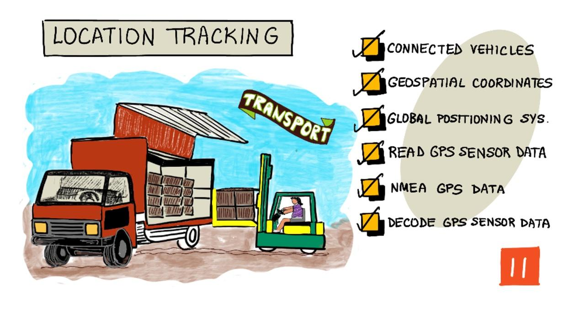

<!--
CO_OP_TRANSLATOR_METADATA:
{
  "original_hash": "52ed2bd997d08040f79a1a6ef2bac958",
  "translation_date": "2025-08-26T15:46:57+00:00",
  "source_file": "3-transport/lessons/1-location-tracking/README.md",
  "language_code": "hk"
}
-->
# 位置追蹤

> 手繪筆記由 [Nitya Narasimhan](https://github.com/nitya) 提供。點擊圖片查看更大版本。

## 課前測驗

[課前測驗](https://black-meadow-040d15503.1.azurestaticapps.net/quiz/21)

## 簡介

將食物從農場送到消費者手中的主要過程包括將農產品裝箱後，運輸到卡車、船隻、飛機或其他商業運輸工具上，然後將食物送到某個地方——可能是直接送到客戶手中，或者送到一個中央樞紐或倉庫進行處理。從農場到消費者的整個端到端過程被稱為*供應鏈*。以下是亞利桑那州立大學 W. P. Carey 商學院的一段影片，詳細介紹了供應鏈的概念及其管理方式。

> 🎥 點擊上方圖片觀看影片

添加物聯網（IoT）設備可以大幅改善供應鏈管理，讓您能更好地掌握物品的位置，規劃運輸和貨物處理，並更快速地應對問題。

當管理一隊車輛（如卡車）時，知道每輛車在某一時間的位置是非常有幫助的。車輛可以安裝 GPS 感應器，將其位置發送到物聯網系統，讓車主能精確定位車輛的位置，查看其行駛路線，並知道它們何時會到達目的地。大多數車輛在 WiFi 覆蓋範圍之外運行，因此它們使用行動網絡來傳送這類數據。有時，GPS 感應器內建於更複雜的物聯網設備中，例如電子日誌。這些設備可以追蹤卡車的行駛時間，以確保駕駛員遵守當地的工作時數法律。

在本課程中，您將學習如何使用全球定位系統（GPS）感應器追蹤車輛的位置。

本課程將涵蓋以下內容：

* [連接車輛](../../../../../3-transport/lessons/1-location-tracking)
* [地理空間座標](../../../../../3-transport/lessons/1-location-tracking)
* [全球定位系統（GPS）](../../../../../3-transport/lessons/1-location-tracking)
* [讀取 GPS 感應器數據](../../../../../3-transport/lessons/1-location-tracking)
* [NMEA GPS 數據](../../../../../3-transport/lessons/1-location-tracking)
* [解碼 GPS 感應器數據](../../../../../3-transport/lessons/1-location-tracking)

## 連接車輛

物聯網正在改變貨物運輸的方式，通過創建一隊*連接車輛*。這些車輛與中央 IT 系統相連，報告其位置和其他感應器數據。擁有一隊連接車輛有多種好處：

* 位置追蹤 - 您可以隨時精確定位車輛的位置，這樣可以：

  * 當車輛即將到達目的地時收到警報，為卸貨工作做好準備
  * 定位被盜車輛
  * 將位置和路線數據與交通問題結合，讓您在行程中重新規劃車輛路線
  * 符合法律規定。例如，一些國家會根據車輛在公共道路上行駛的里程數徵稅（如[紐西蘭的道路使用費](https://www.nzta.govt.nz/vehicles/licensing-rego/road-user-charges/)），因此知道車輛何時在公共道路上行駛 vs 私人道路上行駛，可以更容易計算應繳稅款。
  * 在車輛故障時知道派遣維修人員的位置

* 駕駛員數據 - 確保駕駛員遵守速度限制、以適當的速度轉彎、提前且有效地剎車，並安全駕駛。連接車輛還可以配備攝像頭記錄事故。這可以與保險掛鉤，為良好駕駛員提供更低的保費。

* 駕駛時數合規 - 確保駕駛員僅在法律允許的時數內駕駛，根據他們啟動和關閉引擎的時間進行追蹤。

這些好處可以結合使用——例如，將駕駛時數合規與位置追蹤結合，重新規劃駕駛員的路線，如果他們無法在允許的駕駛時數內到達目的地。這些還可以與其他車輛特定的數據結合，例如冷藏卡車的溫度數據，讓車輛在當前路線無法保持貨物溫度時重新規劃路線。

> 🎓 物流是將貨物從一個地方運送到另一個地方的過程，例如從農場經過一個或多個倉庫運送到超市。一位農夫將西紅柿裝箱，裝上卡車，運送到中央倉庫，然後裝上另一輛可能載有不同類型農產品的卡車，最終送到超市。

車輛追蹤的核心組件是 GPS——能夠在地球上任何地方精確定位的感應器。在本課程中，您將學習如何使用 GPS 感應器，首先從學習如何定義地球上的位置開始。

## 地理空間座標

地理空間座標用於定義地球表面上的點，類似於如何使用座標在電腦螢幕上繪製像素或在十字繡中定位針腳。對於單個點，您需要一對座標。例如，美國華盛頓州雷德蒙市的微軟總部位於 47.6423109, -122.1390293。

### 緯度和經度

地球是一個球體——一個三維的圓。因此，點的位置是通過將其分為 360 度來定義的，這與圓的幾何學相同。緯度測量從北到南的度數，經度測量從東到西的度數。

> 💁 沒有人真正知道為什麼圓被分為 360 度。[維基百科上的角度頁面](https://wikipedia.org/wiki/Degree_(angle))介紹了一些可能的原因。

緯度是通過圍繞地球並與赤道平行的線來測量的，將北半球和南半球分為各 90°。赤道為 0°，北極為 90°，也稱為北緯 90°，南極為 -90°，或南緯 90°。

經度是測量東西方向的度數。經度的 0° 起點稱為*本初子午線*，於 1884 年被定義為一條從北極到南極的線，通過[英國格林威治皇家天文台](https://wikipedia.org/wiki/Royal_Observatory,_Greenwich)。

> 🎓 子午線是一條從北極到南極的假想直線，形成一個半圓。

要測量某一點的經度，您需要測量從本初子午線到通過該點的子午線沿赤道的度數。經度範圍從 -180°（即西經 180°），經過本初子午線的 0°，到 180°（即東經 180°）。180° 和 -180° 指的是同一點，即對蹠子午線或第 180 條子午線。這是一條位於地球另一側的子午線，與本初子午線相對。

> 💁 對蹠子午線不要與國際日期變更線混淆，雖然它們大致位於相同位置，但國際日期變更線並不是一條直線，會根據地緣政治邊界進行調整。

✅ 做一些研究：試著找出您目前位置的緯度和經度。

### 度、分和秒 vs 十進制度數

傳統上，緯度和經度的度數測量使用六十進制（sexagesimal）數字系統，這是一種由古巴比倫人使用的數字系統，他們最早測量並記錄了時間和距離。您可能每天都在使用六十進制而不自知——例如將小時分為 60 分鐘，將分鐘分為 60 秒。

緯度和經度以度、分和秒為單位測量，其中 1 分為 1/60 度，1 秒為 1/60 分。

例如，在赤道上：

* 1° 緯度約為 **111.3 公里**
* 1 分緯度為 111.3/60 = **1.855 公里**
* 1 秒緯度為 1.855/60 = **0.031 公里**

分的符號為單引號，秒的符號為雙引號。例如，2 度 17 分 43 秒可以寫作 2°17'43"。秒的小數部分以小數表示，例如半秒為 0°0'0.5"。

電腦不使用六十進制，因此在大多數電腦系統中，這些座標以十進制度數表示。例如，2°17'43" 為 2.295277。通常省略度數符號。

一個點的座標總是以 `緯度, 經度` 的格式給出，因此前面提到的微軟總部 47.6423109,-122.117198 的座標為：

* 緯度為 47.6423109（赤道以北 47.6423109 度）
* 經度為 -122.1390293（本初子午線以西 122.1390293 度）。

## 全球定位系統（GPS）

GPS 系統使用多顆環繞地球運行的衛星來定位您的位置。您可能在不知不覺中使用過 GPS 系統——例如在手機上的地圖應用（如 Apple 地圖或 Google 地圖）中查看您的位置，或者在叫車應用（如 Uber 或 Lyft）中查看您的車輛位置，或者在車內使用衛星導航（sat-nav）。

> 🎓 衛星導航中的“衛星”指的就是 GPS 衛星！

GPS 系統的工作原理是多顆衛星發送信號，包含每顆衛星的當前位置和精確的時間戳。這些信號通過無線電波傳送，並由 GPS 感應器中的天線接收。GPS 感應器檢測到這些信號後，使用當前時間測量信號從衛星到達感應器所需的時間。由於無線電波的速度是恆定的，GPS 感應器可以使用發送的時間戳計算感應器與衛星的距離。通過結合至少 3 顆衛星的數據和發送的位置，GPS 感應器可以精確定位其在地球上的位置。

> 💁 GPS 感應器需要天線來檢測無線電波。內建於卡車和汽車的 GPS 天線通常安裝在擋風玻璃或車頂，以獲得良好的信號。如果您使用的是單獨的 GPS 系統，例如智能手機或物聯網設備，則需要確保內建於 GPS 系統或手機中的天線能夠清晰地看到天空，例如安裝在擋風玻璃上。

GPS 衛星環繞地球運行，並非固定在感應器上方，因此位置數據包括海拔高度（相對於海平面）以及緯度和經度。

過去，GPS 的精確度受到美國軍方的限制，精度約為 5 米。這一限制於 2000 年被取消，現在的精度可達 30 厘米。但由於信號干擾，並非總能達到這一精度。

✅ 如果您有智能手機，打開地圖應用，看看您的位置有多精確。可能需要一段時間讓手機檢測到多顆衛星以獲得更精確的位置。
💁 衛星內部配備了極其精準的原子鐘，但由於愛因斯坦的特殊相對論和廣義相對論所預測的速度增加導致時間減慢的現象，衛星每天相比地球上的原子鐘會漂移38微秒（0.0000038秒）。這是因為衛星的運行速度比地球自轉速度更快。這種漂移現象已被用來證明特殊相對論和廣義相對論的預測，並且在設計GPS系統時必須進行調整。從字面上看，GPS衛星上的時間運行得更慢。
GPS 系統已由多個國家和政治聯盟開發並部署，包括美國、俄羅斯、日本、印度、歐盟和中國。現代 GPS 感應器可以連接到大多數這些系統，以獲得更快速和更準確的定位。

> 🎓 每個部署中的衛星群組被稱為星座（constellations）。

## 讀取 GPS 感應器數據

大多數 GPS 感應器通過 UART 傳輸 GPS 數據。

> ⚠️ UART 已在 [項目 2，第 2 課](../../../2-farm/lessons/2-detect-soil-moisture/README.md#universal-asynchronous-receiver-transmitter-uart) 中介紹。如有需要，請回顧該課程。

您可以在 IoT 設備上使用 GPS 感應器來獲取 GPS 數據。

### 任務 - 連接 GPS 感應器並讀取 GPS 數據

按照相關指南，使用您的 IoT 設備讀取 GPS 數據：

* [Arduino - Wio Terminal](wio-terminal-gps-sensor.md)
* [單板電腦 - Raspberry Pi](pi-gps-sensor.md)
* [單板電腦 - 虛擬設備](virtual-device-gps-sensor.md)

## NMEA GPS 數據

當您運行代碼時，可能會在輸出中看到一些看似亂碼的內容。這其實是標準的 GPS 數據，每一部分都有其意義。

GPS 感應器使用 NMEA 消息輸出數據，遵循 NMEA 0183 標準。NMEA 是 [National Marine Electronics Association](https://www.nmea.org)（美國國家海洋電子協會）的縮寫，這是一個美國的貿易組織，負責制定海洋電子設備之間的通信標準。

> 💁 該標準是專有的，售價至少為 2,000 美元，但由於有足夠的信息已進入公共領域，大部分標準已被逆向工程，可用於開源和其他非商業代碼。

這些消息是基於文本的。每條消息由一個以 `$` 字符開頭的 *句子* 組成，接著是兩個字符表示消息來源（例如，GP 表示美國 GPS 系統，GN 表示 GLONASS，俄羅斯的 GPS 系統），以及三個字符表示消息類型。消息的其餘部分是用逗號分隔的字段，最後以換行符結束。

一些可以接收到的消息類型包括：

| 類型 | 描述 |
| ---- | ----------- |
| GGA | GPS 定位數據，包括 GPS 感應器的緯度、經度和海拔，以及用於計算該定位的可見衛星數量。 |
| ZDA | 當前日期和時間，包括本地時區。 |
| GSV | 可見衛星的詳細信息 - 定義為 GPS 感應器可以檢測到信號的衛星。 |

> 💁 GPS 數據包括時間戳，因此您的 IoT 設備可以從 GPS 感應器獲取時間，而無需依賴 NTP 服務器或內部實時時鐘。

GGA 消息包括當前位置，使用 `(dd)dmm.mmmm` 格式，並附帶一個單字符表示方向。格式中的 `d` 表示度數，`m` 表示分，秒則以分的小數表示。例如，2°17'43" 會表示為 217.716666667 - 即 2 度，17.716666667 分。

方向字符可以是 `N` 或 `S` 表示緯度的北或南，`E` 或 `W` 表示經度的東或西。例如，緯度 2°17'43" 的方向字符為 `N`，而 -2°17'43" 的方向字符為 `S`。

例如 - NMEA 句子 `$GNGGA,020604.001,4738.538654,N,12208.341758,W,1,3,,164.7,M,-17.1,M,,*67`

* 緯度部分是 `4738.538654,N`，轉換為十進制度數為 47.6423109。`4738.538654` 是 47.6423109，方向為 `N`（北），因此是正緯度。

* 經度部分是 `12208.341758,W`，轉換為十進制度數為 -122.1390293。`12208.341758` 是 122.1390293°，方向為 `W`（西），因此是負經度。

## 解碼 GPS 感應器數據

與其使用原始的 NMEA 數據，不如將其解碼為更有用的格式。您可以使用多個開源庫來幫助從原始 NMEA 消息中提取有用的數據。

### 任務 - 解碼 GPS 感應器數據

按照相關指南，使用您的 IoT 設備解碼 GPS 感應器數據：

* [Arduino - Wio Terminal](wio-terminal-gps-decode.md)
* [單板電腦 - Raspberry Pi/虛擬 IoT 設備](single-board-computer-gps-decode.md)

---

## 🚀 挑戰

編寫您自己的 NMEA 解碼器！與其依賴第三方庫來解碼 NMEA 句子，您能否編寫自己的解碼器來從 NMEA 句子中提取緯度和經度？

## 課後測驗

[課後測驗](https://black-meadow-040d15503.1.azurestaticapps.net/quiz/22)

## 回顧與自學

* 在 [維基百科的地理坐標系統頁面](https://wikipedia.org/wiki/Geographic_coordinate_system) 閱讀更多關於地理坐標的信息。
* 在 [維基百科的本初子午線頁面](https://wikipedia.org/wiki/Prime_meridian#Prime_meridian_on_other_planetary_bodies) 閱讀地球以外其他天體的本初子午線。
* 研究來自歐盟、日本、俄羅斯、印度和美國等不同國家和政治聯盟的各種 GPS 系統。

## 作業

[調查其他 GPS 數據](assignment.md)

---

**免責聲明**：  
本文件已使用人工智能翻譯服務 [Co-op Translator](https://github.com/Azure/co-op-translator) 進行翻譯。儘管我們致力於提供準確的翻譯，但請注意，自動翻譯可能包含錯誤或不準確之處。原始文件的母語版本應被視為權威來源。對於重要信息，建議使用專業人工翻譯。我們對因使用此翻譯而引起的任何誤解或錯誤解釋概不負責。