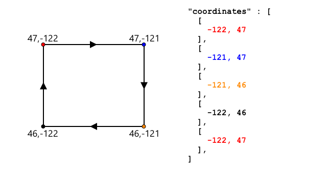

<!--
CO_OP_TRANSLATOR_METADATA:
{
  "original_hash": "078ae664c7b686bf069545e9a5fc95b2",
  "translation_date": "2025-08-26T15:42:55+00:00",
  "source_file": "3-transport/lessons/4-geofences/README.md",
  "language_code": "hk"
}
-->
# 地理圍欄


> 手繪筆記由 [Nitya Narasimhan](https://github.com/nitya) 提供。點擊圖片查看更大版本。

這段影片概述了地理圍欄及如何在 Azure Maps 中使用它們，這些是本課程將涵蓋的主題：

[](https://www.youtube.com/watch?v=nsrgYhaYNVY)

> 🎥 點擊上方圖片觀看影片

## 課前測驗

[課前測驗](https://black-meadow-040d15503.1.azurestaticapps.net/quiz/27)

## 簡介

在過去的三節課中，你已經使用物聯網技術定位從農場運送到加工中心的卡車。你捕捉了 GPS 數據，將其發送到雲端存儲，並在地圖上進行可視化。提高供應鏈效率的下一步是當卡車即將到達加工中心時收到警報，這樣卸貨所需的工作人員就可以準備好叉車和其他設備，確保車輛一到就能快速卸貨。這樣可以減少卡車和司機的等待時間。

在本課程中，你將學習地理圍欄——定義的地理空間區域，例如加工中心周圍 2 公里車程範圍內的區域，以及如何測試 GPS 坐標是否在地理圍欄內或外，以便判斷你的 GPS 傳感器是否已到達或離開某個區域。

本課程將涵蓋以下內容：

* [什麼是地理圍欄](../../../../../3-transport/lessons/4-geofences)
* [定義地理圍欄](../../../../../3-transport/lessons/4-geofences)
* [測試點是否在地理圍欄內](../../../../../3-transport/lessons/4-geofences)
* [從無伺服器代碼中使用地理圍欄](../../../../../3-transport/lessons/4-geofences)

> 🗑 這是本項目的最後一課，因此完成本課程和作業後，別忘了清理你的雲端服務。你需要這些服務來完成作業，因此請確保先完成作業。
>
> 如有需要，請參考[清理項目指南](../../../clean-up.md)以獲取相關指示。

## 什麼是地理圍欄

地理圍欄是一個虛擬的邊界，用於真實世界的地理區域。地理圍欄可以是圓形的，定義為一個點和半徑（例如建築物周圍 100 米的圓形），或者是覆蓋某個區域的多邊形，例如學校區域、城市邊界或大學或辦公園區。


> 💁 你可能已經在不知情的情況下使用過地理圍欄。如果你曾使用 iOS 提醒應用或 Google Keep 根據位置設置提醒，那麼你就使用過地理圍欄。這些應用會根據提供的位置設置地理圍欄，並在你的手機進入地理圍欄時提醒你。

以下是一些需要知道車輛是否在地理圍欄內或外的原因：

* **卸貨準備** - 收到車輛到達現場的通知可以讓工作人員準備卸貨，減少車輛等待時間。這樣可以讓司機在一天內完成更多次的交付，減少等待時間。
* **稅務合規** - 某些國家（例如新西蘭）根據車輛重量對柴油車輛在公共道路上的行駛徵收道路稅。使用地理圍欄可以追蹤車輛在公共道路上的行駛里程，而不是在農場或伐木區等私人道路上的行駛里程。
* **盜竊監控** - 如果車輛應該只停留在某個區域（例如農場），但離開了地理圍欄，可能表明車輛被盜。
* **位置合規** - 工作場地、農場或工廠的某些區域可能禁止某些車輛進入，例如防止運送人工肥料和農藥的車輛進入種植有機農產品的田地。如果進入地理圍欄，則車輛處於不合規狀態，司機可以收到通知。

✅ 你能想到其他地理圍欄的用途嗎？

Azure Maps（你在上一課中用來可視化 GPS 數據的服務）允許你定義地理圍欄，然後測試某個點是否在地理圍欄內或外。

## 定義地理圍欄

地理圍欄使用 GeoJSON 定義，與上一課中添加到地圖上的點相同。在這種情況下，它不是包含 `Point` 值的 `FeatureCollection`，而是包含 `Polygon` 的 `FeatureCollection`。

```json
{
   "type": "FeatureCollection",
   "features": [
     {
       "type": "Feature",
       "geometry": {
         "type": "Polygon",
         "coordinates": [
           [
             [
               -122.13393688201903,
               47.63829579223815
             ],
             [
               -122.13389128446579,
               47.63782047131512
             ],
             [
               -122.13240802288054,
               47.63783312249837
             ],
             [
               -122.13238388299942,
               47.63829037035086
             ],
             [
               -122.13393688201903,
               47.63829579223815
             ]
           ]
         ]
       },
       "properties": {
         "geometryId": "1"
       }
     }
   ]
}
```

多邊形的每個點都定義為一個經度和緯度的數組，這些點存儲在作為 `coordinates` 的數組中。在上一課的 `Point` 中，`coordinates` 是包含兩個值（緯度和經度）的數組，而在 `Polygon` 中，它是一個包含兩個值（經度和緯度）的數組的數組。

> 💁 請記住，GeoJSON 使用 `經度, 緯度` 定義點，而不是 `緯度, 經度`

多邊形的坐標數組總是比多邊形的點數多一個，最後一個條目與第一個條目相同，用於閉合多邊形。例如，對於矩形，會有 5 個點。



在上圖中，有一個矩形。多邊形坐標從左上角的 47,-122 開始，然後向右移動到 47,-121，再向下移動到 46,-121，然後向左移動到 46,-122，最後回到起始點 47,-122。這樣多邊形就有 5 個點——左上角、右上角、右下角、左下角，然後是左上角以閉合多邊形。

✅ 嘗試使用 [GeoJSON.io](https://geojson.io/) 等工具創建一個圍繞你家或學校的 GeoJSON 多邊形。

### 任務 - 定義地理圍欄

要在 Azure Maps 中使用地理圍欄，首先需要將其上傳到你的 Azure Maps 帳戶。一旦上傳，你將獲得一個唯一的 ID，可以用來測試某個點是否在地理圍欄內。要將地理圍欄上傳到 Azure Maps，你需要使用地圖 Web API。你可以使用名為 [curl](https://curl.se) 的工具調用 Azure Maps Web API。

> 🎓 Curl 是一個命令行工具，用於向 Web 端點發送請求

1. 如果你使用的是 Linux、macOS 或 Windows 10 的最新版本，你可能已經安裝了 curl。從終端或命令行運行以下命令進行檢查：

    ```sh
    curl --version
    ```

    如果沒有看到 curl 的版本信息，你需要從 [curl 下載頁面](https://curl.se/download.html) 安裝它。

    > 💁 如果你熟悉 Postman，也可以選擇使用它。

1. 創建一個包含多邊形的 GeoJSON 文件。你將使用你的 GPS 傳感器測試它，因此請在你的當前位置周圍創建一個多邊形。你可以手動編輯上面提供的 GeoJSON 示例，或者使用 [GeoJSON.io](https://geojson.io/) 等工具。

    GeoJSON 需要包含一個 `FeatureCollection`，其中包含一個 `geometry` 類型為 `Polygon` 的 `Feature`。

    你**必須**在 `geometry` 元素的同一層級添加一個 `properties` 元素，並且該元素必須包含一個 `geometryId`：

    ```json
    "properties": {
        "geometryId": "1"
    }
    ```

    如果你使用 [GeoJSON.io](https://geojson.io/)，則需要手動將此項添加到空的 `properties` 元素中，可以在下載 JSON 文件後或應用中的 JSON 編輯器中進行。

    此 `geometryId` 必須在此文件中唯一。你可以在同一 GeoJSON 文件中的 `FeatureCollection` 中上傳多個地理圍欄作為多個 `Feature`，只要每個地理圍欄有不同的 `geometryId`。如果從不同的文件在不同的時間上傳，多邊形可以有相同的 `geometryId`。

1. 將此文件保存為 `geofence.json`，並在終端或控制台中導航到保存位置。

1. 運行以下 curl 命令以創建地理圍欄：

    ```sh
    curl --request POST 'https://atlas.microsoft.com/mapData/upload?api-version=1.0&dataFormat=geojson&subscription-key=<subscription_key>' \
         --header 'Content-Type: application/json' \
         --include \
         --data @geofence.json
    ```

    將 URL 中的 `<subscription_key>` 替換為你的 Azure Maps 帳戶的 API 密鑰。

    URL 用於通過 `https://atlas.microsoft.com/mapData/upload` API 上傳地圖數據。調用包括一個 `api-version` 參數，用於指定使用哪個 Azure Maps API，這是為了允許 API 隨時間變化但保持向後兼容。上傳的數據格式設置為 `geojson`。

    此命令將運行 POST 請求到上傳 API，並返回一系列響應標頭，其中包括名為 `location` 的標頭。

    ```output
    content-type: application/json
    location: https://us.atlas.microsoft.com/mapData/operations/1560ced6-3a80-46f2-84b2-5b1531820eab?api-version=1.0
    x-ms-azuremaps-region: West US 2
    x-content-type-options: nosniff
    strict-transport-security: max-age=31536000; includeSubDomains
    x-cache: CONFIG_NOCACHE
    date: Sat, 22 May 2021 21:34:57 GMT
    content-length: 0
    ```

    > 🎓 在調用 Web 端點時，可以通過添加 `?` 後跟 `key=value` 的鍵值對來傳遞參數，鍵值對之間用 `&` 分隔。

1. Azure Maps 不會立即處理此請求，因此你需要使用 `location` 標頭中提供的 URL 檢查上傳請求是否已完成。通過向此位置發送 GET 請求來查看狀態。你需要在 `location` URL 的末尾添加你的訂閱密鑰，方法是添加 `&subscription-key=<subscription_key>`，將 `<subscription_key>` 替換為你的 Azure Maps 帳戶的 API 密鑰。運行以下命令：

    ```sh
    curl --request GET '<location>&subscription-key=<subscription_key>'
    ```

    將 `<location>` 替換為 `location` 標頭的值，並將 `<subscription_key>` 替換為你的 Azure Maps 帳戶的 API 密鑰。

1. 檢查響應中的 `status` 值。如果不是 `Succeeded`，請等待一分鐘後再嘗試。

1. 一旦狀態返回為 `Succeeded`，查看響應中的 `resourceLocation`。這包含 GeoJSON 對象的唯一 ID（稱為 UDID）的詳細信息。UDID 是 `metadata/` 之後的值，不包括 `api-version`。例如，如果 `resourceLocation` 是：

    ```json
    {
      "resourceLocation": "https://us.atlas.microsoft.com/mapData/metadata/7c3776eb-da87-4c52-ae83-caadf980323a?api-version=1.0"
    }
    ```

    那麼 UDID 將是 `7c3776eb-da87-4c52-ae83-caadf980323a`。

    保存此 UDID，因為你將需要它來測試地理圍欄。

## 測試點是否在地理圍欄內

一旦多邊形上傳到 Azure Maps，你可以測試某個點是否在地理圍欄內或外。你可以通過發送 Web API 請求，傳遞地理圍欄的 UDID，以及要測試的點的緯度和經度來完成此操作。

在發送此請求時，你還可以傳遞一個名為 `searchBuffer` 的值。這告訴 Maps API 返回結果時的精確度。原因是 GPS 並不完全準確，有時位置可能會偏差幾米甚至更多。默認的搜索緩衝區為 50 米，但你可以設置 0 米到 500 米之間的值。

當 API 調用返回結果時，結果的一部分是測量到地理圍欄邊緣最近點的 `distance`，如果點在地理圍欄外則為正值，若在地理圍欄內則為負值。如果此距離小於搜索緩衝區，則返回實際距離（以米為單位），否則值為 999 或 -999。999 表示點距地理圍欄超過搜索緩衝區，-999 表示點距地理圍欄內超過搜索緩衝區。


在上圖中，地理圍欄有一個 50 米的搜索緩衝區。

* 地理圍欄中心的點，遠遠在搜索緩衝區內，距離為 **-999**
* 遠遠在搜索緩衝區外的點，距離為 **999**
* 地理圍欄內且在搜索緩衝區內的點，距地理圍欄 6 米，距離為 **6 米**
* 地理圍欄外且在搜索緩衝區內的點，距地理圍欄 39 米，距離為 **39 米**

了解到地理圍欄邊緣的距離非常重要，並結合其他信息（例如其他 GPS 讀數、速度和道路數據）來基於車輛位置做出決策。

例如，假設 GPS 讀數顯示車輛沿著一條道路行駛，該道路最終與地理圍欄相鄰。如果單個 GPS 值不準確，將車輛定位在地理圍欄內，儘管沒有車輛通行的可能性，那麼可以忽略該值。


在上圖中，微軟園區的一部分設置了地理圍欄。紅線顯示卡車沿著520行駛，圓圈表示GPS讀數。大部分讀數是準確的並沿著520，但有一個不準確的讀數位於地理圍欄內。這個讀數不可能是正確的——卡車不可能突然從520轉入園區，然後再回到520。檢查地理圍欄的程式碼需要在執行地理圍欄測試結果之前考慮之前的讀數。

✅ 你需要哪些額外的數據來檢查GPS讀數是否可以被認為是正確的？

### 任務 - 測試點是否在地理圍欄內

1. 首先建立用於Web API查詢的URL。格式如下：

    ```output
    https://atlas.microsoft.com/spatial/geofence/json?api-version=1.0&deviceId=gps-sensor&subscription-key=<subscription-key>&udid=<UDID>&lat=<lat>&lon=<lon>
    ```

    將 `<subscription_key>` 替換為你的Azure Maps帳戶的API密鑰。

    將 `<UDID>` 替換為上一個任務中地理圍欄的UDID。

    將 `<lat>` 和 `<lon>` 替換為你想要測試的緯度和經度。

    此URL使用 `https://atlas.microsoft.com/spatial/geofence/json` API來查詢使用GeoJSON定義的地理圍欄。它針對 `1.0` API版本。`deviceId` 參數是必需的，應該是緯度和經度來源設備的名稱。

    預設的搜索緩衝區是50米，你可以通過傳遞額外的參數 `searchBuffer=<distance>` 來更改此值，將 `<distance>` 設置為搜索緩衝區距離（以米為單位），範圍為0到500。

1. 使用curl向此URL發送GET請求：

    ```sh
    curl --request GET '<URL>'
    ```

    > 💁 如果你收到 `BadRequest` 的響應代碼，並伴隨以下錯誤：
    >
    > ```output
    > Invalid GeoJSON: All feature properties should contain a geometryId, which is used for identifying the geofence.
    > ```
    >
    > 那麼你的GeoJSON缺少 `properties` 部分中的 `geometryId`。你需要修復你的GeoJSON，然後重複上述步驟重新上傳並獲取新的UDID。

1. 響應將包含一個 `geometries` 列表，每個幾何形狀對應於用於創建地理圍欄的GeoJSON中定義的多邊形。每個幾何形狀有三個重要字段：`distance`、`nearestLat` 和 `nearestLon`。

    ```output
    {
        "geometries": [
            {
                "deviceId": "gps-sensor",
                "udId": "7c3776eb-da87-4c52-ae83-caadf980323a",
                "geometryId": "1",
                "distance": 999.0,
                "nearestLat": 47.645875,
                "nearestLon": -122.142713
            }
        ],
        "expiredGeofenceGeometryId": [],
        "invalidPeriodGeofenceGeometryId": []
    }
    ```

    * `nearestLat` 和 `nearestLon` 是距離被測試位置最近的地理圍欄邊緣點的緯度和經度。

    * `distance` 是被測試位置到地理圍欄邊緣最近點的距離。負數表示在地理圍欄內，正數表示在地理圍欄外。此值將小於50（預設搜索緩衝區），或999。

1. 使用地理圍欄內外的多個位置重複此操作。

## 從無伺服器代碼中使用地理圍欄

現在你可以為你的Functions應用程式添加一個新觸發器，以測試IoT Hub GPS事件數據是否在地理圍欄內。

### 消費者群組

如你在之前的課程中所記得，IoT Hub允許你重播已接收到但未處理的事件。但如果多個觸發器連接會發生什麼？它如何知道哪個觸發器處理了哪些事件？

答案是它無法知道！相反，你可以定義多個獨立的連接來讀取事件，每個連接都可以管理未讀消息的重播。這些被稱為*消費者群組*。當你連接到端點時，你可以指定你想要連接的消費者群組。應用程式的每個組件將連接到不同的消費者群組。


理論上，每個消費者群組最多可以連接5個應用程式，並且它們都會在消息到達時接收消息。最佳實踐是每個消費者群組僅由一個應用程式訪問，以避免重複消息處理，並確保在重新啟動時所有排隊消息都能正確處理。例如，如果你在本地啟動了Functions應用程式並且在雲端運行，它們都會處理消息，導致存儲帳戶中存儲的Blob重複。

如果你查看之前課程中創建的IoT Hub觸發器的 `function.json` 文件，你會看到事件中心觸發器綁定部分中的消費者群組：

```json
"consumerGroup": "$Default"
```

當你創建IoT Hub時，系統會默認創建 `$Default` 消費者群組。如果你想添加額外的觸發器，可以使用新的消費者群組。

> 💁 在本課程中，你將使用不同的函數來測試地理圍欄，而不是用於存儲GPS數據的函數。這是為了展示如何使用消費者群組並分離代碼，使其更易於閱讀和理解。在生產應用程式中，你可能會有多種架構方式——將兩者放在一個函數中，使用存儲帳戶上的觸發器運行函數來檢查地理圍欄，或使用多個函數。沒有“正確的方式”，這取決於你的應用程式的其他部分和需求。

### 任務 - 創建新的消費者群組

1. 運行以下命令為你的IoT Hub創建名為 `geofence` 的新消費者群組：

    ```sh
    az iot hub consumer-group create --name geofence \
                                     --hub-name <hub_name>
    ```

    將 `<hub_name>` 替換為你用於IoT Hub的名稱。

1. 如果你想查看IoT Hub的所有消費者群組，運行以下命令：

    ```sh
    az iot hub consumer-group list --output table \
                                   --hub-name <hub_name>
    ```

    將 `<hub_name>` 替換為你用於IoT Hub的名稱。這將列出所有消費者群組。

    ```output
    Name      ResourceGroup
    --------  ---------------
    $Default  gps-sensor
    geofence  gps-sensor
    ```

> 💁 當你在之前的課程中運行IoT Hub事件監視器時，它連接到了 `$Default` 消費者群組。這就是為什麼你不能同時運行事件監視器和事件觸發器。如果你想同時運行兩者，那麼你可以為所有Functions應用程式使用其他消費者群組，並保留 `$Default` 用於事件監視器。

### 任務 - 創建新的IoT Hub觸發器

1. 為你在之前課程中創建的 `gps-trigger` Functions應用程式添加新的IoT Hub事件觸發器。將此函數命名為 `geofence-trigger`。

    > ⚠️ 如果需要，你可以參考[項目2，課程5中創建IoT Hub事件觸發器的指導](../../../2-farm/lessons/5-migrate-application-to-the-cloud/README.md#create-an-iot-hub-event-trigger)。

1. 在 `function.json` 文件中配置IoT Hub連接字符串。`local.settings.json` 在Functions應用程式中的所有觸發器之間共享。

1. 更新 `function.json` 文件中 `consumerGroup` 的值以引用新的 `geofence` 消費者群組：

    ```json
    "consumerGroup": "geofence"
    ```

1. 你需要在此觸發器中使用Azure Maps帳戶的訂閱密鑰，因此在 `local.settings.json` 文件中添加名為 `MAPS_KEY` 的新條目。

1. 運行Functions應用程式以確保它正在連接並處理消息。之前課程中的 `iot-hub-trigger` 也會運行並將Blob上傳到存儲。

    > 為避免存儲帳戶中的Blob重複GPS讀數，你可以停止在雲端運行的Functions應用程式。要執行此操作，使用以下命令：
    >
    > ```sh
    > az functionapp stop --resource-group gps-sensor \
    >                     --name <functions_app_name>
    > ```
    >
    > 將 `<functions_app_name>` 替換為你用於Functions應用程式的名稱。
    >
    > 你可以稍後使用以下命令重新啟動它：
    >
    > ```sh
    > az functionapp start --resource-group gps-sensor \
    >                     --name <functions_app_name>
    > ```
    >
    > 將 `<functions_app_name>` 替換為你用於Functions應用程式的名稱。

### 任務 - 從觸發器測試地理圍欄

在本課程的早些時候，你使用curl查詢地理圍欄以查看某個點是否位於內部或外部。你可以從觸發器內部進行類似的Web請求。

1. 要查詢地理圍欄，你需要其UDID。在 `local.settings.json` 文件中添加名為 `GEOFENCE_UDID` 的新條目，並填入此值。

1. 打開新觸發器 `geofence-trigger` 的 `__init__.py` 文件。

1. 在文件頂部添加以下導入：

    ```python
    import json
    import os
    import requests
    ```

    `requests` 套件允許你進行Web API調用。Azure Maps沒有Python SDK，你需要通過Web API調用來從Python代碼中使用它。

1. 在 `main` 方法的開頭添加以下兩行以獲取Maps訂閱密鑰：

    ```python
    maps_key = os.environ['MAPS_KEY']
    geofence_udid = os.environ['GEOFENCE_UDID']    
    ```

1. 在 `for event in events` 循環內，添加以下代碼以從每個事件中獲取緯度和經度：

    ```python
    event_body = json.loads(event.get_body().decode('utf-8'))
    lat = event_body['gps']['lat']
    lon = event_body['gps']['lon']
    ```

    此代碼將事件正文中的JSON轉換為字典，然後從 `gps` 字段中提取 `lat` 和 `lon`。

1. 使用 `requests` 時，與使用curl建立長URL不同，你可以僅使用URL部分並將參數作為字典傳遞。添加以下代碼以定義要調用的URL並配置參數：

    ```python
    url = 'https://atlas.microsoft.com/spatial/geofence/json'

    params = {
        'api-version': 1.0,
        'deviceId': 'gps-sensor',
        'subscription-key': maps_key,
        'udid' : geofence_udid,
        'lat' : lat,
        'lon' : lon
    }
    ```

    `params` 字典中的項目將與你通過curl調用Web API時使用的鍵值對匹配。

1. 添加以下代碼行以調用Web API：

    ```python
    response = requests.get(url, params=params)
    response_body = json.loads(response.text)
    ```

    此代碼調用URL並傳遞參數，並返回一個響應對象。

1. 在此代碼下方添加以下代碼：

    ```python
    distance = response_body['geometries'][0]['distance']

    if distance == 999:
        logging.info('Point is outside geofence')
    elif distance > 0:
        logging.info(f'Point is just outside geofence by a distance of {distance}m')
    elif distance == -999:
        logging.info(f'Point is inside geofence')
    else:
        logging.info(f'Point is just inside geofence by a distance of {distance}m')
    ```

    此代碼假設只有一個幾何形狀，並從該幾何形狀中提取距離。然後根據距離記錄不同的消息。

1. 運行此代碼。你將在日誌輸出中看到GPS坐標是否在地理圍欄內或外，並且如果點在50米內，會顯示距離。使用基於GPS傳感器位置的不同地理圍欄嘗試此代碼，嘗試移動傳感器（例如通過手機WiFi連接，或使用虛擬IoT設備上的不同坐標）以查看此變化。

1. 當你準備好時，將此代碼部署到雲端的Functions應用程式中。不要忘記部署新的應用程式設置。

    > ⚠️ 如果需要，你可以參考[項目2，課程5中上傳應用程式設置的指導](../../../2-farm/lessons/5-migrate-application-to-the-cloud/README.md#task---upload-your-application-settings)。

    > ⚠️ 如果需要，你可以參考[項目2，課程5中部署Functions應用程式的指導](../../../2-farm/lessons/5-migrate-application-to-the-cloud/README.md#task---deploy-your-functions-app-to-the-cloud)。

> 💁 你可以在 [code/functions](../../../../../3-transport/lessons/4-geofences/code/functions) 文件夾中找到此代碼。

---

## 🚀 挑戰

在本課程中，你使用具有單個多邊形的GeoJSON文件添加了一個地理圍欄。你可以同時上傳多個多邊形，只要它們在 `properties` 部分中具有不同的 `geometryId` 值。

嘗試上傳具有多個多邊形的GeoJSON文件，並調整你的代碼以找到GPS坐標最接近或位於哪個多邊形內。

## 課後測驗

[課後測驗](https://black-meadow-040d15503.1.azurestaticapps.net/quiz/28)

## 回顧與自學

* 在[維基百科的地理圍欄頁面](https://en.wikipedia.org/wiki/Geo-fence)上閱讀更多關於地理圍欄及其一些使用案例。
* 在[Microsoft Azure Maps Spatial - Get Geofence文檔](https://docs.microsoft.com/rest/api/maps/spatial/getgeofence?WT.mc_id=academic-17441-jabenn)上閱讀更多關於Azure Maps地理圍欄API。
* 在[Microsoft文檔的Azure Event Hubs功能和術語 - 事件消費者文檔](https://docs.microsoft.com/azure/event-hubs/event-hubs-features?WT.mc_id=academic-17441-jabenn#event-consumers)上閱讀更多關於消費者群組。

## 作業

[使用Twilio發送通知](assignment.md)

---

**免責聲明**：  
本文件已使用人工智能翻譯服務 [Co-op Translator](https://github.com/Azure/co-op-translator) 進行翻譯。儘管我們致力於提供準確的翻譯，但請注意，自動翻譯可能包含錯誤或不準確之處。原始語言的文件應被視為權威來源。對於重要資訊，建議使用專業人工翻譯。我們對因使用此翻譯而引起的任何誤解或錯誤解釋概不負責。