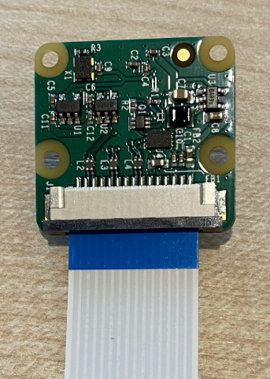
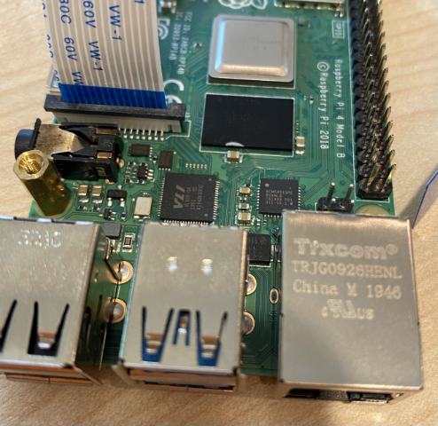

<!--
CO_OP_TRANSLATOR_METADATA:
{
  "original_hash": "c677667095f6133eee418c7e53615d05",
  "translation_date": "2025-08-26T14:10:53+00:00",
  "source_file": "4-manufacturing/lessons/2-check-fruit-from-device/pi-camera.md",
  "language_code": "hk"
}
-->
# 捕捉影像 - Raspberry Pi

在這部分課程中，你將為 Raspberry Pi 添加一個相機感測器，並從中讀取影像。

## 硬件

Raspberry Pi 需要一個相機。

你將使用的相機是 [Raspberry Pi Camera Module](https://www.raspberrypi.org/products/camera-module-v2/)。這款相機專為 Raspberry Pi 設計，通過 Pi 上的專用連接器進行連接。

> 💁 這款相機使用 [Camera Serial Interface，一種由移動產業處理器接口聯盟制定的協議](https://wikipedia.org/wiki/Camera_Serial_Interface)，簡稱 MIPI-CSI。這是一種專用的影像傳輸協議。

## 連接相機

相機可以通過一條扁平排線連接到 Raspberry Pi。

### 任務 - 連接相機


1. 關閉 Raspberry Pi 的電源。

1. 將相機附帶的扁平排線連接到相機上。方法是輕輕拉動插座上的黑色塑料夾，使其稍微向外拉出，然後將排線滑入插座，藍色面朝遠離鏡頭的一側，金屬針條面朝向鏡頭。插入到位後，將黑色塑料夾推回原位。

    你可以在 [Raspberry Pi 相機模組入門文檔](https://projects.raspberrypi.org/en/projects/getting-started-with-picamera/2) 中找到如何打開夾子並插入排線的動畫。

    

1. 從 Raspberry Pi 上移除 Grove Base Hat。

1. 將扁平排線穿過 Grove Base Hat 上的相機插槽。確保排線的藍色面朝向標有 **A0**、**A1** 等的模擬端口。

    

1. 將扁平排線插入 Raspberry Pi 上的相機端口。同樣，拉起黑色塑料夾，插入排線，然後推回夾子。排線的藍色面應朝向 USB 和以太網端口。

    

1. 重新安裝 Grove Base Hat。

## 編程相機

現在可以使用 [PiCamera](https://pypi.org/project/picamera/) Python 庫來編程 Raspberry Pi 以使用相機。

### 任務 - 啟用舊版相機模式

不幸的是，隨著 Raspberry Pi OS Bullseye 的發布，操作系統附帶的相機軟件發生了變化，導致 PiCamera 默認無法使用。目前正在開發一個替代方案，名為 PiCamera2，但尚未準備好使用。

目前，你可以將 Raspberry Pi 設置為舊版相機模式，以使 PiCamera 能夠正常工作。相機插座默認是禁用的，但啟用舊版相機軟件會自動啟用插座。

1. 啟動 Raspberry Pi，並等待其完成啟動。

1. 啟動 VS Code，可以直接在 Raspberry Pi 上啟動，也可以通過 Remote SSH 擴展連接。

1. 在終端中運行以下命令：

    ```sh
    sudo raspi-config nonint do_legacy 0
    sudo reboot
    ```

    這將切換設置以啟用舊版相機軟件，然後重新啟動 Raspberry Pi 以使該設置生效。

1. 等待 Raspberry Pi 重新啟動，然後重新啟動 VS Code。

### 任務 - 編程相機

編程設備。

1. 在終端中，於 `pi` 用戶的主目錄中創建一個名為 `fruit-quality-detector` 的新文件夾。在此文件夾中創建一個名為 `app.py` 的文件。

1. 在 VS Code 中打開此文件夾。

1. 要與相機交互，可以使用 PiCamera Python 庫。使用以下命令安裝 Pip 套件：

    ```sh
    pip3 install picamera
    ```

1. 在 `app.py` 文件中添加以下代碼：

    ```python
    import io
    import time
    from picamera import PiCamera
    ```

    此代碼導入了一些需要的庫，包括 `PiCamera` 庫。

1. 在此代碼下方添加以下代碼以初始化相機：

    ```python
    camera = PiCamera()
    camera.resolution = (640, 480)
    camera.rotation = 0
    
    time.sleep(2)
    ```

    此代碼創建了一個 PiCamera 對象，並將解析度設置為 640x480。雖然支持更高的解析度（最高可達 3280x2464），但影像分類器使用的影像尺寸要小得多（227x227），因此無需捕捉和傳輸更大的影像。

    `camera.rotation = 0` 行設置影像的旋轉角度。扁平排線從相機底部進入，但如果你的相機旋轉過以便更容易指向你想要分類的物品，則可以將此行更改為旋轉的角度。

    

    例如，如果你將扁平排線懸掛在某物上，使其位於相機的頂部，則將旋轉設置為 180：

    ```python
    camera.rotation = 180
    ```

    相機啟動需要幾秒鐘，因此需要 `time.sleep(2)`。

1. 在此代碼下方添加以下代碼以捕捉影像為二進制數據：

    ```python
    image = io.BytesIO()
    camera.capture(image, 'jpeg')
    image.seek(0)
    ```

    此代碼創建了一個 `BytesIO` 對象來存儲二進制數據。影像以 JPEG 文件的形式從相機讀取並存儲在此對象中。此對象有一個位置指示器，用於指示數據的當前位置，以便需要時可以向末尾寫入更多數據，因此 `image.seek(0)` 行將此位置移回起始位置，以便稍後可以讀取所有數據。

1. 在此代碼下方添加以下代碼以將影像保存到文件：

    ```python
    with open('image.jpg', 'wb') as image_file:
        image_file.write(image.read())
    ```

    此代碼打開一個名為 `image.jpg` 的文件進行寫入，然後從 `BytesIO` 對象中讀取所有數據並寫入該文件。

    > 💁 你可以直接將影像捕捉到文件，而不是使用 `BytesIO` 對象，只需將文件名傳遞給 `camera.capture` 調用即可。使用 `BytesIO` 對象的原因是稍後在課程中你可以將影像發送到影像分類器。

1. 將相機對準某物並運行此代碼。

1. 一張影像將被捕捉並保存為當前文件夾中的 `image.jpg`。你可以在 VS Code 的資源管理器中看到此文件。選擇該文件以查看影像。如果需要旋轉，根據需要更新 `camera.rotation = 0` 行，然後再拍一張照片。

> 💁 你可以在 [code-camera/pi](../../../../../4-manufacturing/lessons/2-check-fruit-from-device/code-camera/pi) 文件夾中找到此代碼。

😀 你的相機程式成功了！

---

**免責聲明**：  
本文件已使用人工智能翻譯服務 [Co-op Translator](https://github.com/Azure/co-op-translator) 進行翻譯。雖然我們致力於提供準確的翻譯，但請注意，自動翻譯可能包含錯誤或不準確之處。原始語言的文件應被視為權威來源。對於重要資訊，建議使用專業人工翻譯。我們對因使用此翻譯而引起的任何誤解或錯誤解釋概不負責。