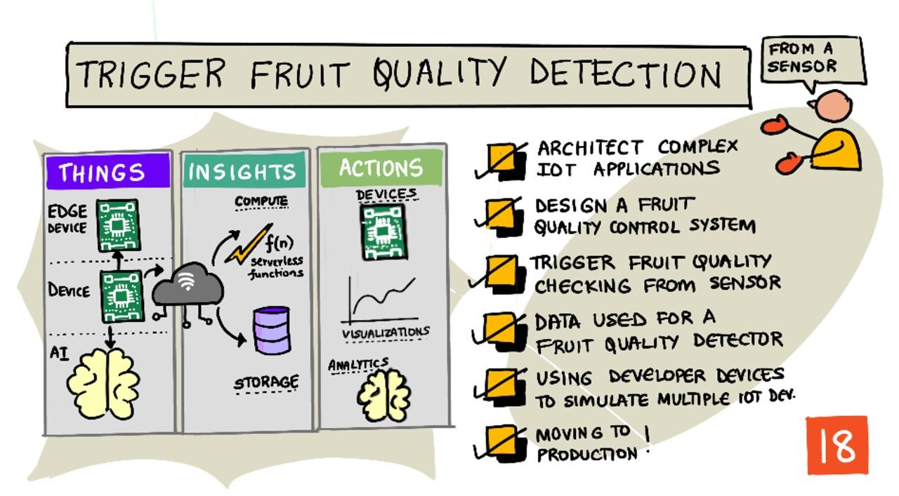

<!--
CO_OP_TRANSLATOR_METADATA:
{
  "original_hash": "f74f4ccb61f00e5f7e9f49c3ed416e36",
  "translation_date": "2025-08-26T14:21:04+00:00",
  "source_file": "4-manufacturing/lessons/4-trigger-fruit-detector/README.md",
  "language_code": "hk"
}
-->
# 從感應器觸發水果質量檢測



> 手繪筆記由 [Nitya Narasimhan](https://github.com/nitya) 提供。點擊圖片查看更大版本。

## 課前測驗

[課前測驗](https://black-meadow-040d15503.1.azurestaticapps.net/quiz/35)

## 簡介

物聯網應用程式不僅僅是單一設備捕捉數據並將其發送到雲端，更多時候是多個設備協同工作，通過感應器從物理世界捕捉數據，根據這些數據做出決策，並通過執行器或可視化與物理世界進行交互。

在本課中，您將學習如何設計更複雜的物聯網應用程式，結合多個感應器和雲端服務來分析和存儲數據，並通過執行器顯示響應。您將學習如何設計一個水果質量控制系統的原型，包括使用接近感應器觸發物聯網應用程式，以及該原型的架構。

本課將涵蓋以下內容：

* [設計複雜的物聯網應用程式](../../../../../4-manufacturing/lessons/4-trigger-fruit-detector)
* [設計水果質量控制系統](../../../../../4-manufacturing/lessons/4-trigger-fruit-detector)
* [從感應器觸發水果質量檢測](../../../../../4-manufacturing/lessons/4-trigger-fruit-detector)
* [水果質量檢測器使用的數據](../../../../../4-manufacturing/lessons/4-trigger-fruit-detector)
* [使用開發設備模擬多個物聯網設備](../../../../../4-manufacturing/lessons/4-trigger-fruit-detector)
* [進入生產階段](../../../../../4-manufacturing/lessons/4-trigger-fruit-detector)

> 🗑 這是本項目中的最後一課，因此在完成本課和作業後，別忘了清理您的雲端服務。您需要這些服務來完成作業，因此請確保先完成作業。
>
> 如有需要，請參考[清理項目指南](../../../clean-up.md)以獲取相關指導。

## 設計複雜的物聯網應用程式

物聯網應用程式由許多組件組成，包括各種設備和互聯網服務。

物聯網應用程式可以描述為*設備*（things）發送數據以生成*洞察*（insights）。這些*洞察*會驅動*行動*（actions），以改進業務或流程。例如，一個引擎（設備）發送溫度數據。這些數據用於評估引擎是否按預期運行（洞察）。洞察則用於主動優化引擎的維護計劃（行動）。

* 不同的設備收集不同的數據。
* 物聯網服務基於這些數據提供洞察，有時還會結合其他來源的數據。
* 這些洞察驅動行動，包括控制設備中的執行器或可視化數據。

### 參考物聯網架構


上圖展示了一個參考物聯網架構。

> 🎓 *參考架構*是一個可以在設計新系統時用作參考的示例架構。在這種情況下，如果您正在構建一個新的物聯網系統，可以遵循參考架構，並根據需要替換為您自己的設備和服務。

* **設備**是從感應器收集數據的裝置，可能與邊緣服務交互以解釋這些數據，例如用於解釋圖像數據的圖像分類器。設備的數據被發送到物聯網服務。
* **洞察**來自無伺服器應用程式，或來自對存儲數據的分析。
* **行動**可以是發送給設備的命令，或是數據的可視化，讓人類做出決策。


上圖展示了在這些課程中涵蓋的一些組件和服務，以及它們如何在參考物聯網架構中相互連接。

* **設備** - 您已經編寫了設備代碼來從感應器捕捉數據，並使用 Custom Vision 在雲端和邊緣設備上分析圖像。這些數據被發送到 IoT Hub。
* **洞察** - 您已經使用 Azure Functions 來響應發送到 IoT Hub 的消息，並將數據存儲在 Azure Storage 中以供後續分析。
* **行動** - 您已經基於雲端的決策控制執行器，並通過命令發送給設備，還使用 Azure Maps 可視化數據。

✅ 想一想您使用過的其他物聯網設備，例如智能家居設備。這些設備及其軟件中涉及的設備、洞察和行動是什麼？

這種模式可以根據需要擴展到更大或更小的規模，添加更多設備和服務。

### 數據與安全性

在定義系統架構時，您需要不斷考慮數據和安全性。

* 您的設備發送和接收哪些數據？
* 這些數據應如何被保護和加密？
* 如何控制對設備和雲端服務的訪問？

✅ 想一想您擁有的任何物聯網設備的數據安全性。這些數據中有多少是個人數據，應在傳輸和存儲時保持私密？哪些數據不應被存儲？

## 設計水果質量控制系統

現在，讓我們將設備、洞察和行動的概念應用到我們的水果質量檢測器，設計一個更大的端到端應用程式。

假設您被分配了一個任務，構建一個用於加工廠的水果質量檢測器。水果通過傳送帶系統運輸，目前員工需要手動檢查水果並移除未成熟的水果。為了降低成本，工廠老闆希望實現自動化系統。

✅ 隨著物聯網（以及技術總體）的興起，許多手動工作正在被機器取代。進行一些研究：估計有多少工作會因物聯網而消失？又會創造多少新工作來構建物聯網設備？

您需要構建一個系統，當水果到達傳送帶時進行檢測，然後拍照並使用在邊緣運行的 AI 模型進行檢查。結果將被發送到雲端存儲，如果水果未成熟，則發出通知以便移除未成熟的水果。

|   |   |
| - | - |
| **設備** | 檢測水果到達傳送帶的感應器<br>拍照並分類水果的相機<br>運行分類器的邊緣設備<br>通知未成熟水果的設備 |
| **洞察** | 決定檢查水果的成熟度<br>存儲成熟度分類的結果<br>確定是否需要對未成熟水果發出警報 |
| **行動** | 發送命令給設備拍攝水果並使用圖像分類器檢查<br>發送命令給設備警告水果未成熟 |

### 應用程式原型設計


上圖展示了該原型應用程式的參考架構。

* 一個帶有接近感應器的物聯網設備檢測到水果的到來，並向雲端發送消息表示檢測到水果。
* 雲端中的無伺服器應用程式向另一個設備發送命令，要求拍照並進行分類。
* 一個帶有相機的物聯網設備拍攝照片並將其發送到運行在邊緣的圖像分類器。結果隨後被發送到雲端。
* 雲端中的無伺服器應用程式存儲這些信息以供後續分析，查看未成熟水果的百分比。如果水果未成熟，則向另一個帶有 LED 的物聯網設備發送命令，通知工廠工人有未成熟水果。

> 💁 整個物聯網應用程式可以作為單一設備實現，所有啟動圖像分類和控制 LED 的邏輯都內建其中。它可以僅使用 IoT Hub 來跟蹤檢測到的未成熟水果數量並配置設備。在本課中，該應用程式被擴展以展示大規模物聯網應用程式的概念。

對於原型，您將在單一設備上實現所有這些功能。如果您使用的是微控制器，則需要使用單獨的邊緣設備來運行圖像分類器。您已經學習了構建這些所需的大部分內容。

## 從感應器觸發水果質量檢測

物聯網設備需要某種觸發器來指示水果何時準備好進行分類。一種觸發方式是通過測量傳送帶上水果與感應器的距離，確定水果是否處於正確位置。


接近感應器可以用來測量感應器與物體之間的距離。它們通常發射一束電磁輻射（如激光束或紅外光），然後檢測反射回來的輻射。從激光束發射到信號反射回來的時間可以用來計算與感應器的距離。

> 💁 您可能在不知不覺中使用過接近感應器。例如，大多數智能手機在您將其靠近耳朵時會關閉屏幕，以防止耳垂意外結束通話。這是通過接近感應器實現的，當檢測到屏幕附近有物體時，會在通話期間禁用觸控功能，直到手機與物體保持一定距離。

### 任務 - 使用距離感應器觸發水果質量檢測

按照相關指南，使用接近感應器檢測物體，並在您的物聯網設備上實現：

* [Arduino - Wio Terminal](wio-terminal-proximity.md)
* [單板電腦 - Raspberry Pi](pi-proximity.md)
* [單板電腦 - 虛擬設備](virtual-device-proximity.md)

## 水果質量檢測器使用的數據

原型水果檢測器包含多個相互通信的組件。


* 一個接近感應器測量與水果的距離，並將數據發送到 IoT Hub
* 控制相機的命令從 IoT Hub 發送到相機設備
* 圖像分類的結果被發送到 IoT Hub
* 控制 LED 發出未成熟水果警報的命令從 IoT Hub 發送到帶有 LED 的設備

在構建應用程式之前，提前定義這些消息的結構是很有必要的。

> 💁 幾乎每位有經驗的開發者都曾經因為發送的數據與預期不符而花費數小時、數天甚至數週來排查錯誤。

例如 - 如果您正在發送溫度信息，如何定義 JSON？您可以使用一個名為 `temperature` 的字段，或者使用常見的縮寫 `temp`。

```json
{
    "temperature": 20.7
}
```

與：

```json
{
    "temp": 20.7
}
```

您還需要考慮單位 - 溫度是以 °C 還是 °F 表示？如果您使用的是消費者設備，並且他們更改了顯示單位，您需要確保發送到雲端的單位保持一致。

✅ 進行一些研究：單位問題如何導致價值 1.25 億美元的火星氣候探測器（Mars Climate Orbiter）墜毀？

思考水果質量檢測器發送的數據。您會如何定義每條消息？您會在哪裡分析數據並決定發送哪些數據？

例如 - 使用接近感應器觸發圖像分類。物聯網設備測量距離，但決策在哪裡做出？設備是否決定水果足夠接近，並發送消息告訴 IoT Hub 觸發分類？還是它發送距離測量數據，讓 IoT Hub 做出決策？

這類問題的答案是 - 視情況而定。每個使用案例都不同，因此作為物聯網開發者，您需要了解您正在構建的系統、它的使用方式以及檢測到的數據。

* 如果決策由 IoT Hub 做出，您需要發送多個距離測量數據。
* 如果發送過多消息，會增加 IoT Hub 的成本，以及物聯網設備所需的帶寬（特別是在有數百萬設備的工廠中）。這也可能會減慢設備的速度。
* 如果在設備上做出決策，您需要提供一種方式來配置設備以微調機器。

## 使用開發設備模擬多個物聯網設備

為了構建您的原型，您需要讓您的物聯網開發套件模擬多個設備，發送遙測數據並響應命令。

### 在 Raspberry Pi 或虛擬物聯網硬件上模擬多個物聯網設備

當使用像 Raspberry Pi 這樣的單板電腦時，您可以同時運行多個應用程式。這意味著您可以通過創建多個應用程式（每個應用程式代表一個“物聯網設備”）來模擬多個物聯網設備。例如，您可以將每個設備實現為一個單獨的 Python 文件，並在不同的終端會話中運行它們。
💁 請注意，某些硬件在同時被多個應用程式存取時可能無法正常運作。
### 在微控制器上模擬多個設備

在微控制器上模擬多個設備會比較複雜。與單板電腦不同，微控制器無法同時運行多個應用程式，必須將所有不同 IoT 設備的邏輯整合到一個應用程式中。

以下是一些讓這個過程更簡單的建議：

* 為每個 IoT 設備創建一個或多個類別，例如名為 `DistanceSensor`、`ClassifierCamera`、`LEDController` 的類別。每個類別可以有自己的 `setup` 和 `loop` 方法，這些方法由主 `setup` 和 `loop` 函數調用。
* 在一個地方處理所有指令，並根據需要將指令分配到相關的設備類別。
* 在主 `loop` 函數中，您需要考慮每個不同設備的時間安排。例如，如果有一個設備類別需要每 10 秒處理一次，另一個需要每 1 秒處理一次，那麼在主 `loop` 函數中可以使用 1 秒的延遲。每次 `loop` 調用都會觸發需要每秒處理的設備的相關代碼，並使用一個計數器來計算每次循環，當計數器達到 10 時處理另一個設備（然後重置計數器）。

## 移向生產階段

原型將成為最終生產系統的基礎。在移向生產階段時，可能會有以下一些不同之處：

* 耐用的元件 - 使用能夠承受工廠中的噪音、熱量、振動和壓力的硬件。
* 使用內部通信 - 一些元件會直接通信，避免跳轉到雲端，僅將數據發送到雲端進行存儲。具體如何實現取決於工廠的設置，可以是直接通信，也可以通過使用網關設備在邊緣運行部分 IoT 服務。
* 配置選項 - 每個工廠和使用場景都不同，因此硬件需要可配置。例如，接近傳感器可能需要在不同距離檢測不同的水果。與其將觸發分類的距離硬編碼，不如通過雲端進行配置，例如使用設備雙胞胎。
* 自動化水果移除 - 不再使用 LED 提示水果未成熟，而是使用自動化設備將其移除。

✅ 做一些研究：生產設備與開發套件還有哪些其他不同之處？

---

## 🚀 挑戰

在本課中，您已經學習了一些設計 IoT 系統所需的概念。回想之前的項目，它們如何適應上述的參考架構？

選擇一個之前的項目，思考如何設計一個更複雜的解決方案，將多種功能結合在一起，超越項目中涵蓋的內容。繪製架構圖，並考慮您需要的所有設備和服務。

例如 - 一個結合 GPS 和傳感器的車輛追蹤設備，用於監控冷藏卡車內的溫度、引擎啟動和關閉時間，以及駕駛員的身份。涉及哪些設備、服務、傳輸的數據，以及安全和隱私的考量？

## 課後測驗

[課後測驗](https://black-meadow-040d15503.1.azurestaticapps.net/quiz/36)

## 回顧與自學

* 閱讀更多關於 IoT 架構的內容，請參考 [Microsoft Docs 上的 Azure IoT 參考架構文檔](https://docs.microsoft.com/azure/architecture/reference-architectures/iot?WT.mc_id=academic-17441-jabenn)
* 閱讀更多關於設備雙胞胎的內容，請參考 [Microsoft Docs 上的 IoT Hub 設備雙胞胎文檔](https://docs.microsoft.com/azure/iot-hub/iot-hub-devguide-device-twins?WT.mc_id=academic-17441-jabenn)
* 閱讀關於 OPC-UA 的內容，這是一種用於工業自動化的機器對機器通信協議，請參考 [Wikipedia 上的 OPC-UA 頁面](https://wikipedia.org/wiki/OPC_Unified_Architecture)

## 作業

[建立一個水果品質檢測器](assignment.md)

---

**免責聲明**：  
本文件已使用人工智能翻譯服務 [Co-op Translator](https://github.com/Azure/co-op-translator) 進行翻譯。儘管我們致力於提供準確的翻譯，但請注意，自動翻譯可能包含錯誤或不準確之處。原始文件的母語版本應被視為權威來源。對於重要信息，建議使用專業人工翻譯。我們對因使用此翻譯而引起的任何誤解或錯誤解釋概不負責。