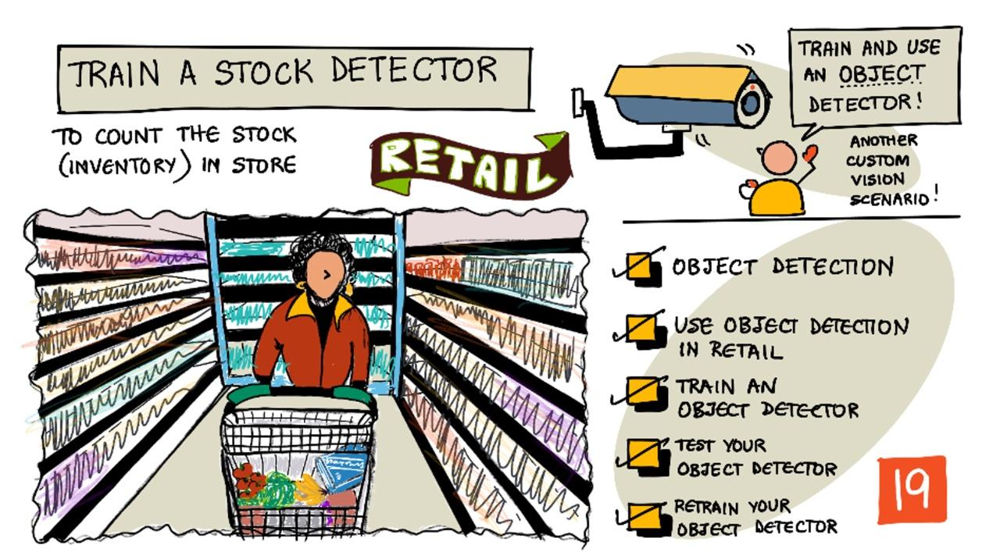

<!--
CO_OP_TRANSLATOR_METADATA:
{
  "original_hash": "8df310a42f902139a01417dacb1ffbef",
  "translation_date": "2025-08-26T14:04:31+00:00",
  "source_file": "5-retail/lessons/1-train-stock-detector/README.md",
  "language_code": "hk"
}
-->
# 訓練一個庫存檢測器

> 手繪筆記由 [Nitya Narasimhan](https://github.com/nitya) 提供。點擊圖片查看更大版本。

這段影片概述了 Azure Custom Vision 服務中的物件檢測功能，這是本課程將涵蓋的內容。

> 🎥 點擊上方圖片觀看影片

## 課前測驗

[課前測驗](https://black-meadow-040d15503.1.azurestaticapps.net/quiz/37)

## 簡介

在上一個項目中，你使用人工智能訓練了一個影像分類器——一個可以判斷影像中是否包含某些物品（例如成熟水果或未成熟水果）的模型。另一種可以用於影像的人工智能模型是物件檢測。這些模型不會通過標籤來分類影像，而是訓練來識別物件，並能在影像中找到它們，不僅能檢測影像中是否存在物件，還能檢測物件在影像中的位置。這使得你可以計算影像中的物件數量。

在本課程中，你將學習物件檢測，包括它在零售中的應用方式。你還將學習如何在雲端訓練一個物件檢測器。

本課程將涵蓋：

* [物件檢測](../../../../../5-retail/lessons/1-train-stock-detector)
* [在零售中使用物件檢測](../../../../../5-retail/lessons/1-train-stock-detector)
* [訓練物件檢測器](../../../../../5-retail/lessons/1-train-stock-detector)
* [測試你的物件檢測器](../../../../../5-retail/lessons/1-train-stock-detector)
* [重新訓練你的物件檢測器](../../../../../5-retail/lessons/1-train-stock-detector)

## 物件檢測

物件檢測是使用人工智能來檢測影像中的物件。與你在上一個項目中訓練的影像分類器不同，物件檢測不是用來預測整個影像的最佳標籤，而是用來在影像中找到一個或多個物件。

### 物件檢測 vs 影像分類

影像分類是針對整個影像進行分類——判斷整個影像符合每個標籤的概率。你會得到模型訓練時使用的每個標籤的概率。

在上面的例子中，兩張影像使用了一個訓練來分類腰果罐或番茄醬罐的模型進行分類。第一張影像是一罐腰果，影像分類器的結果如下：

| 標籤            | 機率       |
| -------------- | ----------: |
| `腰果`         | 98.4%       |
| `番茄醬`       | 1.6%        |

第二張影像是一罐番茄醬，結果如下：

| 標籤            | 機率       |
| -------------- | ----------: |
| `腰果`         | 0.7%        |
| `番茄醬`       | 99.3%       |

你可以使用這些數值和一個閾值百分比來預測影像中包含的物品。但如果影像中包含多罐番茄醬，或者同時包含腰果和番茄醬呢？結果可能不會給你想要的答案。這就是物件檢測的用武之地。

物件檢測涉及訓練一個模型來識別物件。與其提供包含物件的影像並告訴它每張影像是某個標籤，不如突出影像中包含特定物件的部分，並標記它。你可以在影像中標記單個物件或多個物件。這樣模型就能學習物件本身的樣子，而不僅僅是包含物件的影像的樣子。

當你用它來預測影像時，與返回標籤和百分比的列表不同，你會得到一個檢測到的物件列表，包括它們的邊界框以及該邊界框符合分配標籤的概率。

> 🎓 *邊界框* 是物件周圍的框。

上面的影像包含一罐腰果和三罐番茄醬。物件檢測器檢測到了腰果，返回了包含腰果的邊界框以及該邊界框包含物件的概率，在此例中為 97.6%。物件檢測器還檢測到了三罐番茄醬，並提供了三個單獨的邊界框，每個檢測到的罐子都有一個邊界框以及該邊界框包含番茄醬罐的概率。

✅ 想一想你可能想用基於影像的人工智能模型來完成的不同場景。哪些需要分類，哪些需要物件檢測？

### 物件檢測的工作原理

物件檢測使用複雜的機器學習模型。這些模型通過將影像分成多個單元，然後檢查邊界框的中心是否是影像中符合模型訓練影像的中心。你可以將其想像成在影像的不同部分運行影像分類器以尋找匹配。

> 💁 這是一個非常簡化的描述。物件檢測有許多技術，你可以在 [Wikipedia 的物件檢測頁面](https://wikipedia.org/wiki/Object_detection) 上了解更多。

有許多不同的模型可以進行物件檢測。一個特別著名的模型是 [YOLO (You only look once)](https://pjreddie.com/darknet/yolo/)，它速度非常快，可以檢測 20 種不同類別的物件，例如人、狗、瓶子和汽車。

✅ 閱讀 [pjreddie.com/darknet/yolo/](https://pjreddie.com/darknet/yolo/) 上的 YOLO 模型相關內容。

物件檢測模型可以通過遷移學習重新訓練來檢測自定義物件。

## 在零售中使用物件檢測

物件檢測在零售中有多種用途。一些包括：

* **庫存檢查和計數** - 識別貨架上的庫存是否不足。如果庫存過低，可以向員工或機器人發送通知以補充貨架。
* **口罩檢測** - 在公共衛生事件期間有口罩政策的商店中，物件檢測可以識別佩戴口罩和未佩戴口罩的人。
* **自動結算** - 在自動化商店中檢測從貨架上取下的物品並適當地向顧客收費。
* **危險檢測** - 識別地板上的破損物品或溢出的液體，通知清潔人員。

✅ 做一些研究：物件檢測在零售中還有哪些其他用途？

## 訓練物件檢測器

你可以使用 Custom Vision 訓練物件檢測器，方式與訓練影像分類器類似。

### 任務 - 創建物件檢測器

1. 為此項目創建一個名為 `stock-detector` 的資源群組。

1. 在 `stock-detector` 資源群組中創建一個免費的 Custom Vision 訓練資源和一個免費的 Custom Vision 預測資源。分別命名為 `stock-detector-training` 和 `stock-detector-prediction`。

    > 💁 你只能擁有一個免費的訓練和預測資源，因此請確保你已清理之前課程中的項目。

    > ⚠️ 如果需要，可以參考 [項目 4，課程 1 中創建訓練和預測資源的指導](../../../4-manufacturing/lessons/1-train-fruit-detector/README.md#task---create-a-cognitive-services-resource)。

1. 打開 [CustomVision.ai](https://customvision.ai) 的 Custom Vision 入口網站，並使用你的 Azure 帳戶的 Microsoft 帳戶登錄。

1. 按照 Microsoft Docs 上 [Build an object detector quickstart 的 Create a new Project 部分](https://docs.microsoft.com/azure/cognitive-services/custom-vision-service/get-started-build-detector?WT.mc_id=academic-17441-jabenn#create-a-new-project) 創建一個新的 Custom Vision 項目。UI 可能會改變，這些文檔始終是最新的參考。

    將你的項目命名為 `stock-detector`。

    創建項目時，請確保使用你之前創建的 `stock-detector-training` 資源。使用 *Object Detection* 項目類型和 *Products on Shelves* 域。

    

    ✅ *Products on Shelves* 域專門用於檢測貨架上的庫存。閱讀更多有關不同域的信息，請參考 [Microsoft Docs 上的 Select a domain 文檔](https://docs.microsoft.com/azure/cognitive-services/custom-vision-service/select-domain?WT.mc_id=academic-17441-jabenn#object-detection)。

✅ 花些時間探索你的物件檢測器的 Custom Vision UI。

### 任務 - 訓練你的物件檢測器

要訓練你的模型，你需要一組包含你想檢測的物件的影像。

1. 收集包含要檢測物件的影像。你需要至少 15 張包含每個物件的影像，角度和光線條件各異，但越多越好。此物件檢測器使用 *Products on Shelves* 域，因此嘗試將物件設置為像在商店貨架上一樣。你還需要一些影像來測試模型。如果你要檢測多個物件，你會希望一些測試影像包含所有物件。

    > 💁 包含多個不同物件的影像計入影像最低要求的 15 張。

    你的影像應該是 png 或 jpeg 格式，大小小於 6MB。如果你使用 iPhone 創建影像，它們可能是高分辨率的 HEIC 格式，因此需要轉換並可能縮小。影像越多越好，並且應該有相似數量的成熟和未成熟物件。

    該模型專為貨架上的產品設計，因此嘗試在貨架上拍攝物件的照片。

    你可以在 [images](../../../../../5-retail/lessons/1-train-stock-detector/images) 文件夾中找到一些腰果和番茄醬的示例影像供你使用。

1. 按照 Microsoft Docs 上 [Build an object detector quickstart 的 Upload and tag images 部分](https://docs.microsoft.com/azure/cognitive-services/custom-vision-service/get-started-build-detector?WT.mc_id=academic-17441-jabenn#upload-and-tag-images) 上傳你的訓練影像。根據你想檢測的物件類型創建相關標籤。

    

    畫物件的邊界框時，保持框緊貼物件。標記所有影像可能需要一些時間，但工具會檢測它認為是邊界框的部分，從而加快速度。

    

    > 💁 如果你有超過 15 張影像的每個物件，你可以在 15 張影像後進行訓練，然後使用 **Suggested tags** 功能。這將使用訓練的模型檢測未標記影像中的物件。你可以確認檢測到的物件，或者拒絕並重新畫邊界框。這可以節省大量時間。

1. 按照 Microsoft Docs 上 [Build an object detector quickstart 的 Train the detector 部分](https://docs.microsoft.com/azure/cognitive-services/custom-vision-service/get-started-build-detector?WT.mc_id=academic-17441-jabenn#train-the-detector) 訓練你的物件檢測器。

    你將被要求選擇訓練類型。選擇 **Quick Training**。

物件檢測器將開始訓練。訓練完成需要幾分鐘。

## 測試你的物件檢測器

一旦你的物件檢測器訓練完成，你可以通過提供新的影像來測試它是否能檢測物件。

### 任務 - 測試你的物件檢測器

1. 使用 **Quick Test** 按鈕上傳測試影像並驗證物件是否被檢測到。使用你之前創建的測試影像，而不是任何用於訓練的影像。

    

1. 嘗試所有你擁有的測試影像並觀察概率。

## 重新訓練你的物件檢測器

當你測試你的物件檢測器時，它可能不會給出你期望的結果，就像在上一個項目中的影像分類器一樣。你可以通過使用錯誤的影像重新訓練來改進你的物件檢測器。

每次使用快速測試選項進行預測時，影像和結果都會被存儲。你可以使用這些影像重新訓練你的模型。

1. 使用 **Predictions** 標籤找到你用於測試的影像。

1. 確認任何準確的檢測，刪除錯誤的檢測並添加任何缺失的物件。

1. 重新訓練並重新測試模型。

---

## 🚀 挑戰

如果你用物件檢測器檢測外觀相似的物品，例如同品牌的番茄醬罐和切碎番茄罐，會發生什麼？

如果你有任何外觀相似的物品，嘗試將它們的影像添加到你的物件檢測器中進行測試。

## 課後測驗
[課後測驗](https://black-meadow-040d15503.1.azurestaticapps.net/quiz/38)

## 回顧與自學

* 當你訓練物件偵測器時，你應該會看到 *Precision*（精確度）、*Recall*（召回率）和 *mAP*（平均精度）等數值，這些數值用來評估所建立的模型。請參考 [Microsoft 文件中「建立物件偵測器快速入門」的「評估偵測器」部分](https://docs.microsoft.com/azure/cognitive-services/custom-vision-service/get-started-build-detector?WT.mc_id=academic-17441-jabenn#evaluate-the-detector) 了解這些數值的含義。
* 在 [維基百科的物件偵測頁面](https://wikipedia.org/wiki/Object_detection) 閱讀更多關於物件偵測的資訊。

## 作業

[比較領域](assignment.md)

---

**免責聲明**：  
此文件已使用 AI 翻譯服務 [Co-op Translator](https://github.com/Azure/co-op-translator) 翻譯。我們致力於提供準確的翻譯，但請注意，自動翻譯可能包含錯誤或不準確之處。應以原始語言的文件作為權威來源。對於關鍵資訊，建議尋求專業人工翻譯。我們對因使用此翻譯而引起的任何誤解或錯誤詮釋概不負責。  