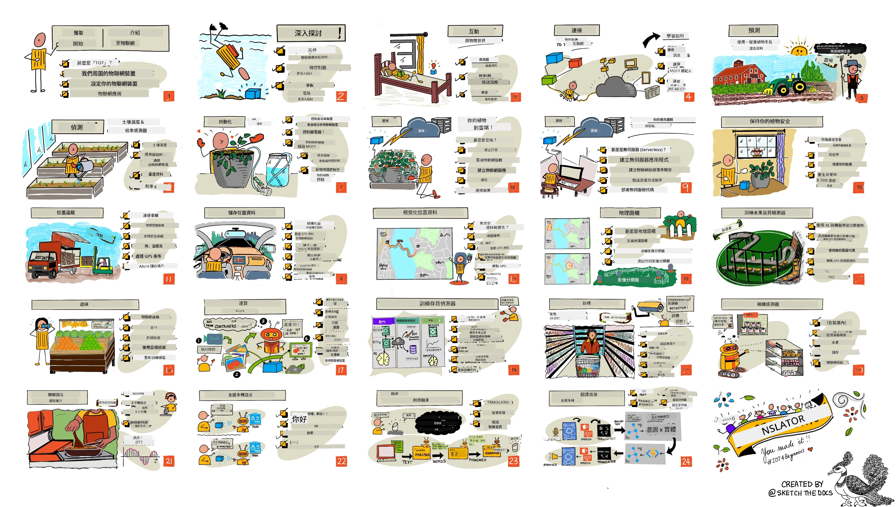

<!--
CO_OP_TRANSLATOR_METADATA:
{
  "original_hash": "6c354ec3487e4f6cfafbe44557996cd9",
  "translation_date": "2026-01-05T17:26:34+00:00",
  "source_file": "README.md",
  "language_code": "hk"
}
-->
[](https://github.com/microsoft/IoT-For-Beginners/blob/master/LICENSE)
[](https://GitHub.com/microsoft/IoT-For-Beginners/graphs/contributors/)
[](https://GitHub.com/microsoft/IoT-For-Beginners/issues/)
[](https://GitHub.com/microsoft/IoT-For-Beginners/pulls/)
[](http://makeapullrequest.com)

[](https://GitHub.com/microsoft/IoT-For-Beginners/watchers/)
[](https://GitHub.com/microsoft/IoT-For-Beginners/network/)
[](https://GitHub.com/microsoft/IoT-For-Beginners/stargazers/)

### 加入 Azure AI Foundry 社群

如果你在建立 AI 應用程式時遇到困難或有任何問題，請加入其他學習者和有經驗的開發者，一同討論 MCP。這是一個支持性的社群，歡迎提出問題並自由分享知識。

[](https://discord.gg/nTYy5BXMWG)

如果你在建立過程中有產品反饋或錯誤，請造訪：

[](https://aka.ms/foundry/forum)

按照以下步驟開始使用這些資源：
1. **分叉儲存庫**：點擊 [](https://GitHub.com/microsoft/IoT-For-Beginners/fork)
2. **複製儲存庫**： `git clone https://github.com/microsoft/IoT-For-Beginners.git`
3. [**加入 Microsoft Foundry Discord，與專家及其他開發者交流**](https://discord.com/invite/ByRwuEEgH4)


### 🌐 多語言支持

#### 由 GitHub Action 支持（自動且隨時更新）

<!-- CO-OP TRANSLATOR LANGUAGES TABLE START -->
[阿拉伯語](../ar/README.md) | [孟加拉語](../bn/README.md) | [保加利亞語](../bg/README.md) | [緬甸語 (緬甸)](../my/README.md) | [中文 (簡體)](../zh/README.md) | [中文 (繁體, 香港)](./README.md) | [中文 (繁體, 澳門)](../mo/README.md) | [中文 (繁體, 台灣)](../tw/README.md) | [克羅地亞語](../hr/README.md) | [捷克語](../cs/README.md) | [丹麥語](../da/README.md) | [荷蘭語](../nl/README.md) | [愛沙尼亞語](../et/README.md) | [芬蘭語](../fi/README.md) | [法語](../fr/README.md) | [德語](../de/README.md) | [希臘語](../el/README.md) | [希伯來語](../he/README.md) | [印地語](../hi/README.md) | [匈牙利語](../hu/README.md) | [印度尼西亞語](../id/README.md) | [義大利語](../it/README.md) | [日語](../ja/README.md) | [卡納達語](../kn/README.md) | [韓語](../ko/README.md) | [立陶宛語](../lt/README.md) | [馬來語](../ms/README.md) | [馬拉雅拉姆語](../ml/README.md) | [馬拉地語](../mr/README.md) | [尼泊爾語](../ne/README.md) | [奈及利亞皮欽語](../pcm/README.md) | [挪威語](../no/README.md) | [波斯語 (法爾西語)](../fa/README.md) | [波蘭語](../pl/README.md) | [葡萄牙語 (巴西)](../br/README.md) | [葡萄牙語 (葡萄牙)](../pt/README.md) | [旁遮普語 (古魯穆奇)](../pa/README.md) | [羅馬尼亞語](../ro/README.md) | [俄語](../ru/README.md) | [塞爾維亞語 (西里爾字)](../sr/README.md) | [斯洛伐克語](../sk/README.md) | [斯洛文尼亞語](../sl/README.md) | [西班牙語](../es/README.md) | [斯瓦希里語](../sw/README.md) | [瑞典語](../sv/README.md) | [他加祿語 (菲律賓語)](../tl/README.md) | [泰米爾語](../ta/README.md) | [泰盧固語](../te/README.md) | [泰語](../th/README.md) | [土耳其語](../tr/README.md) | [烏克蘭語](../uk/README.md) | [烏爾都語](../ur/README.md) | [越南語](../vi/README.md)

> **想要本機複製？**

> 此儲存庫包含 50 多種語言翻譯，這會大幅增加下載大小。若想不包含翻譯複製，請使用稀疏簽出：
> ```bash
> git clone --filter=blob:none --sparse https://github.com/microsoft/IoT-For-Beginners.git
> cd IoT-For-Beginners
> git sparse-checkout set --no-cone '/*' '!translations' '!translated_images'
> ```
> 這樣會讓你用更快的下載速度取得完成課程所需的所有內容。
<!-- CO-OP TRANSLATOR LANGUAGES TABLE END -->

# 物聯網初學者課程綱要

微軟 Azure 雲端推廣專家很高興提供一個為期 12 週、共 24 節課的物聯網基礎課程。每節課包含課前與課後小測驗、完成課程的書面指導、解答、作業等等。我們以專案為基礎的教學法讓你邊學邊做，這是新技能更容易記住的證明方法。

這些專案涵蓋食品從農場到餐桌的整個過程，包含農業、物流、製造、零售和消費者──這些都是物聯網裝置非常熱門的產業領域。



> 手繪記錄由 [Nitya Narasimhan](https://github.com/nitya) 製作。點擊圖片可觀看大圖。

**衷心感謝我們的作者們：[Jen Fox](https://github.com/jenfoxbot)、[Jen Looper](https://github.com/jlooper)、[Jim Bennett](https://github.com/jimbobbennett) 以及我們的手繪記錄藝術家 [Nitya Narasimhan](https://github.com/nitya)。**

**同時感謝我們的 [Microsoft Learn 學生大使](https://studentambassadors.microsoft.com?WT.mc_id=academic-17441-jabenn) 團隊，他們協助審核與翻譯此課程 ─ [Aditya Garg](https://github.com/AdityaGarg00)、[Anurag Sharma](https://github.com/Anurag-0-1-A)、[Arpita Das](https://github.com/Arpiiitaaa)、[Aryan Jain](https://www.linkedin.com/in/aryan-jain-47a4a1145/)、[Bhavesh Suneja](https://github.com/EliteWarrior315)、[Faith Hunja](https://faithhunja.github.io/)、[Lateefah Bello](https://www.linkedin.com/in/lateefah-bello/)、[Manvi Jha](https://github.com/Severus-Matthew)、[Mireille Tan](https://www.linkedin.com/in/mireille-tan-a4834819a/)、[Mohammad Iftekher (Iftu) Ebne Jalal](https://github.com/Iftu119)、[Mohammad Zulfikar](https://github.com/mohzulfikar)、[Priyanshu Srivastav](https://www.linkedin.com/in/priyanshu-srivastav-b067241ba)、[Thanmai Gowducheruvu](https://github.com/innovation-platform)、[Zina Kamel](https://www.linkedin.com/in/zina-kamel/)。**

認識團隊！

[](https://youtu.be/-wippUJRi5k)

**Gif 製作者** [Mohit Jaisal](https://linkedin.com/in/mohitjaisal)

> 🎥 點擊上方圖片觀看專案影片！

> **教師們**，我們附上了[使用本課程綱要的建議](for-teachers.md)。若想自訂課程，亦提供了[課程範本](lesson-template/README.md)。

> **[學生們](https://aka.ms/student-page)**，若想自行使用本課程，請分叉整個儲存庫並自行完成練習，從課前測驗開始，再讀課程內容並完成其餘活動。嘗試透過理解課程來建立專案，而非僅複製解答程式碼；但這些程式碼會在各專案導向課程的 /solutions 資料夾中提供。另一個方法是與朋友組成學習小組，一同學習內容。欲進一步學習，我們推薦[Microsoft Learn](https://docs.microsoft.com/users/jimbobbennett/collections/ke2ehd351jopwr?WT.mc_id=academic-17441-jabenn)。

本課程介紹影片，請參考：

[](https://youtube.com/watch?v=bccEMm8gRuc "宣傳影片")

> 🎥 點擊上方圖片觀看專案影片！

## 教學法

我們在設計本課程時選擇了兩項教學原則：確保課程以專案為基礎，並包含頻繁的小測驗。系列結束時，學生將完成一個植物監測與澆水系統、一個車輛追蹤器、一個智慧工廠用來追蹤與檢查食物的裝置，以及一個聲控烹飪計時器，並學會物聯網基礎知識，包括如何撰寫裝置程式碼、連接至雲端、分析遙測資料及於邊緣運行 AI。

藉由確保內容與專案對齊，過程對學生更具吸引力，且概念記憶得以加強。

此外，課前的小考有助於設定學生學習主題的學習意圖，課後小考則進一步提升記憶力。此課程設計靈活有趣，可整體或部分選擇修習。專案由淺入深，於 12 週周期結束時漸趨複雜。

每個專案皆以學生與愛好者可取得的實體硬體為基礎。每個專案深入特定領域，提供相關背景知識。成為成功開發者，理解所處領域以解決問題很重要，提供這些背景知識可讓學生在物聯網解決方案與學習中，從可能面對的現實問題角度思考。學生了解他們正在建置解決方案的「為何」，並能理解最終使用者。

## 硬體

我們提供兩種物聯網硬體選擇以配合專案需求，依個人喜好、程式語言能力、學習目標或取得方便程度決定。我們也提供「虛擬硬體」版本，供沒有硬體、或想先進一步學習再購買的人使用。您可在[硬體頁面](./hardware.md)了解更多及取得購買來自 Seeed Studio 朋友的完整套件的連結。
> 💁 尋找我們的[行為準則](CODE_OF_CONDUCT.md)、[貢獻指南](CONTRIBUTING.md)及[翻譯指南](TRANSLATIONS.md)。歡迎您的建設性意見！
>
> 🔧 遇到問題嗎？查看我們的[疑難排解指南](TROUBLESHOOTING.md)以獲得常見問題的解決方案。

## 每節課程包括：

- 草圖筆記
- 可選補充影片
- 課前熱身小測驗
- 書面課程
- 專案式課程的話，包含一步一步的專案建置指引
- 知識檢測
- 挑戰
- 補充閱讀
- 作業
- [課後小測驗](https://ff-quizzes.netlify.app/en/)

> **關於測驗的一點說明**：所有測驗均包含在 quiz-app 資料夾中，共 48 個測驗，每個測驗包含三個問題。測驗會在課程中連結，但測驗應用程式可於本地運行或部署至 Azure；請遵照 `quiz-app` 資料夾中的說明執行。測驗正逐步本地化中。

## 課程

|       |              專案名稱               |                       教授概念                        | 學習目標                                                                                                                                                              |                                                        連結課程                                                          |
| :---: | :--------------------------------: | :---------------------------------------------------: | ------------------------------------------------------------------------------------------------------------------------------------------------------------------- | :------------------------------------------------------------------------------------------------------------------------: |
|  01   | [入門](./1-getting-started/README.md) |                     物聯網介紹                     | 學習物聯網基本原理及物聯網解決方案的基本元素，如感測器與雲端服務，同時設置您的第一個物聯網裝置                                                                           |                     [物聯網介紹](./1-getting-started/lessons/1-introduction-to-iot/README.md)                      |
|  02   | [入門](./1-getting-started/README.md) |                   物聯網深入探討                   | 深入了解物聯網系統的元件，以及微控制器和單板電腦                                                                                                                     |                       [物聯網深入探討](./1-getting-started/lessons/2-deeper-dive/README.md)                       |
|  03   | [入門](./1-getting-started/README.md) | 使用感測器與執行器互動物理世界 | 學習使用感測器蒐集物理世界的數據，以及使用執行器發送回饋，同時建置一個夜燈                                                                                                 | [使用感測器與執行器互動物理世界](./1-getting-started/lessons/3-sensors-and-actuators/README.md) |
|  04   | [入門](./1-getting-started/README.md) |             將裝置連接至網際網路             | 學習如何將物聯網裝置連接至網際網路以發送與接收訊息，示範如何將夜燈連接到 MQTT 代理                                                                                   |                [將裝置連接至網際網路](./1-getting-started/lessons/4-connect-internet/README.md)                |
|  05   |            [農場](./2-farm/README.md)            |                    預測植物生長                     | 學習如何使用物聯網裝置捕獲的溫度資料來預測植物生長                                                                                                                  |                          [預測植物生長](./2-farm/lessons/1-predict-plant-growth/README.md)                           |
|  06   |            [農場](./2-farm/README.md)            |                    偵測土壤濕度                     | 學習如何偵測土壤濕度並校正土壤濕度感測器                                                                                                                            |                          [偵測土壤濕度](./2-farm/lessons/2-detect-soil-moisture/README.md)                           |
|  07   |            [農場](./2-farm/README.md)            |                  自動化植物澆水                   | 學習如何使用繼電器和 MQTT 自動化及定時澆水                                                                                                                          |                      [自動化植物澆水](./2-farm/lessons/3-automated-plant-watering/README.md)                       |
|  08   |            [農場](./2-farm/README.md)            |               將植物資料移轉至雲端               | 了解雲端及雲端托管的物聯網服務，以及如何將植物裝置連接至這些服務而非公共 MQTT 代理                                                                                   |               [將植物資料移轉至雲端](./2-farm/lessons/4-migrate-your-plant-to-the-cloud/README.md)                |
|  09   |            [農場](./2-farm/README.md)            |         將應用邏輯移轉至雲端         | 瞭解如何在雲端編寫回應物聯網訊息的應用邏輯                                                                                                                          |         [將應用邏輯移轉至雲端](./2-farm/lessons/5-migrate-application-to-the-cloud/README.md)         |
|  10   |            [農場](./2-farm/README.md)            |                   保護您的植物安全                    | 了解物聯網安全以及如何使用金鑰和憑證保護您的植物                                                                                                                    |                        [保護您的植物安全](./2-farm/lessons/6-keep-your-plant-secure/README.md)                         |
|  11   |       [運輸](./3-transport/README.md)       |                      位置追蹤                      | 了解 GPS 物聯網裝置的定位追蹤                                                                                                                                        |                           [位置追蹤](./3-transport/lessons/1-location-tracking/README.md)                           |
|  12   |       [運輸](./3-transport/README.md)       |                     儲存位置資料                     | 學習如何儲存物聯網資料以便後續視覺化或分析                                                                                                                           |                         [儲存位置資料](./3-transport/lessons/2-store-location-data/README.md)                         |
|  13   |       [運輸](./3-transport/README.md)       |                   位置資料視覺化                   | 了解如何在地圖上視覺化位置資料，以及地圖如何以二維表示現實世界的三維環境                                                                                            |                     [位置資料視覺化](./3-transport/lessons/3-visualize-location-data/README.md)                     |
|  14   |       [運輸](./3-transport/README.md)       |                          地理圍欄                          | 了解地理圍欄，以及如何用於當供應鏈中車輛接近目的地時發出警報                                                                                                          |                                   [地理圍欄](./3-transport/lessons/4-geofences/README.md)                                   |
|  15   |   [製造](./4-manufacturing/README.md)   |               訓練水果品質檢測器                | 了解如何在雲端訓練影像分類器以檢測水果品質                                                                                                                          |                 [訓練水果品質檢測器](./4-manufacturing/lessons/1-train-fruit-detector/README.md)                 |
|  16   |   [製造](./4-manufacturing/README.md)   |           從物聯網裝置檢查水果品質            | 了解如何從物聯網裝置使用您的水果品質檢測器                                                                                                                         |           [從物聯網裝置檢查水果品質](./4-manufacturing/lessons/2-check-fruit-from-device/README.md)            |
|  17   |   [製造](./4-manufacturing/README.md)   |             在邊緣運行您的水果檢測器             | 了解如何在物聯網邊緣裝置上運行您的水果檢測器                                                                                                                       |             [在邊緣運行您的水果檢測器](./4-manufacturing/lessons/3-run-fruit-detector-edge/README.md)             |
|  18   |   [製造](./4-manufacturing/README.md)   |        從感測器觸發水果品質檢測        | 了解如何由感測器觸發水果品質檢測                                                                                                                                    |        [從感測器觸發水果品質檢測](./4-manufacturing/lessons/4-trigger-fruit-detector/README.md)         |
|  19   |          [零售](./5-retail/README.md)          |                   訓練庫存檢測器                    | 了解如何使用物件偵測來訓練庫存檢測器，計算店內庫存                                                                                                                |                        [訓練庫存檢測器](./5-retail/lessons/1-train-stock-detector/README.md)                         |
|  20   |          [零售](./5-retail/README.md)          |               從物聯網裝置檢查庫存                | 了解如何使用物聯網裝置內的物件偵測模型檢查庫存                                                                                                                     |                     [從物聯網裝置檢查庫存](./5-retail/lessons/2-check-stock-device/README.md)                      |
|  21   |        [消費](./6-consumer/README.md)        |             使用物聯網裝置進行語音識別             | 了解如何從物聯網裝置辨識語音，以建置智慧計時器                                                                                                                     |                  [使用物聯網裝置進行語音識別](./6-consumer/lessons/1-speech-recognition/README.md)                  |
|  22   |        [消費](./6-consumer/README.md)        |                     語言理解                     | 了解如何理解對物聯網裝置說出的句子                                                                                                                                  |                        [語言理解](./6-consumer/lessons/2-language-understanding/README.md)                        |
|  23   |        [消費](./6-consumer/README.md)        |           設定計時器並給予語音回饋           | 了解如何在物聯網裝置上設定計時器，並於設定及倒數完成時給予語音回饋                                                                                                 |                 [設定計時器並給予語音回饋](./6-consumer/lessons/3-spoken-feedback/README.md)                  |
|  24   |        [消費](./6-consumer/README.md)        |                 支援多種語言                  | 了解如何同時支援多種語言，包括語音輸入和智慧計時器的語音回應                                                                                                      |                   [支援多種語言](./6-consumer/lessons/4-multiple-language-support/README.md)                   |

## 離線存取

您可以透過使用 [Docsify](https://docsify.js.org/#/) 離線使用這份文件。將此存放庫分支，於本機安裝 [Docsify](https://docsify.js.org/#/quickstart)，然後在此存放庫根目錄中輸入 `docsify serve`。網站會在您本機的 3000 埠口提供服務：`localhost:3000`。

## 測驗

感謝社群舉辦互動式測驗，測試您對每一章節的知識。您可在[此處](https://ff-quizzes.netlify.app/en/)測試您的知識。

### PDF

如果需要，也可將本內容產生成 PDF 以便離線閱覽。請確保您已安裝 [npm](https://docs.npmjs.com/downloading-and-installing-node-js-and-npm)，在此存放庫根目錄中執行以下指令：

```sh
npm i
npm run convert
```

### 投影片

部分課程有投影片資料，請參考 [slides](../../slides) 資料夾。

## 其他課程

我們團隊還製作其他課程！敬請查看：

<!-- CO-OP TRANSLATOR OTHER COURSES START -->
### LangChain
[](https://aka.ms/langchain4j-for-beginners)
[](https://aka.ms/langchainjs-for-beginners?WT.mc_id=m365-94501-dwahlin)

---

### Azure / Edge / MCP / Agents
[](https://github.com/microsoft/AZD-for-beginners?WT.mc_id=academic-105485-koreyst)
[](https://github.com/microsoft/edgeai-for-beginners?WT.mc_id=academic-105485-koreyst)
[](https://github.com/microsoft/mcp-for-beginners?WT.mc_id=academic-105485-koreyst)
[](https://github.com/microsoft/ai-agents-for-beginners?WT.mc_id=academic-105485-koreyst)

---
 
### 生成式 AI 系列
[](https://github.com/microsoft/generative-ai-for-beginners?WT.mc_id=academic-105485-koreyst)
[-9333EA?style=for-the-badge&labelColor=E5E7EB&color=9333EA)](https://github.com/microsoft/Generative-AI-for-beginners-dotnet?WT.mc_id=academic-105485-koreyst)
[-C084FC?style=for-the-badge&labelColor=E5E7EB&color=C084FC)](https://github.com/microsoft/generative-ai-for-beginners-java?WT.mc_id=academic-105485-koreyst)
[-E879F9?style=for-the-badge&labelColor=E5E7EB&color=E879F9)](https://github.com/microsoft/generative-ai-with-javascript?WT.mc_id=academic-105485-koreyst)

---
 
### 核心學習
[](https://aka.ms/ml-beginners?WT.mc_id=academic-105485-koreyst)
[](https://aka.ms/datascience-beginners?WT.mc_id=academic-105485-koreyst)
[](https://aka.ms/ai-beginners?WT.mc_id=academic-105485-koreyst)
[](https://github.com/microsoft/Security-101?WT.mc_id=academic-96948-sayoung)
[](https://aka.ms/webdev-beginners?WT.mc_id=academic-105485-koreyst)
[](https://aka.ms/iot-beginners?WT.mc_id=academic-105485-koreyst)
[](https://github.com/microsoft/xr-development-for-beginners?WT.mc_id=academic-105485-koreyst)

---
 
### Copilot 系列
[](https://aka.ms/GitHubCopilotAI?WT.mc_id=academic-105485-koreyst)
[](https://github.com/microsoft/mastering-github-copilot-for-dotnet-csharp-developers?WT.mc_id=academic-105485-koreyst)
[](https://github.com/microsoft/CopilotAdventures?WT.mc_id=academic-105485-koreyst)
<!-- CO-OP TRANSLATOR OTHER COURSES END -->

## 影像來源聲明

你可以在 [Attributions](./attributions.md) 中找到此課程所使用影像的所有來源聲明。

---

<!-- CO-OP TRANSLATOR DISCLAIMER START -->
**免責聲明**：  
本文件經由 AI 翻譯服務 [Co-op Translator](https://github.com/Azure/co-op-translator) 翻譯。儘管我們致力於確保翻譯的準確性，但請注意，自動翻譯可能包含錯誤或不準確之處。原始文件的母語版本應視為權威來源。對於重要資訊，建議尋求專業人工翻譯。我們對因使用此翻譯而引起的任何誤解或誤釋不負任何責任。
<!-- CO-OP TRANSLATOR DISCLAIMER END -->