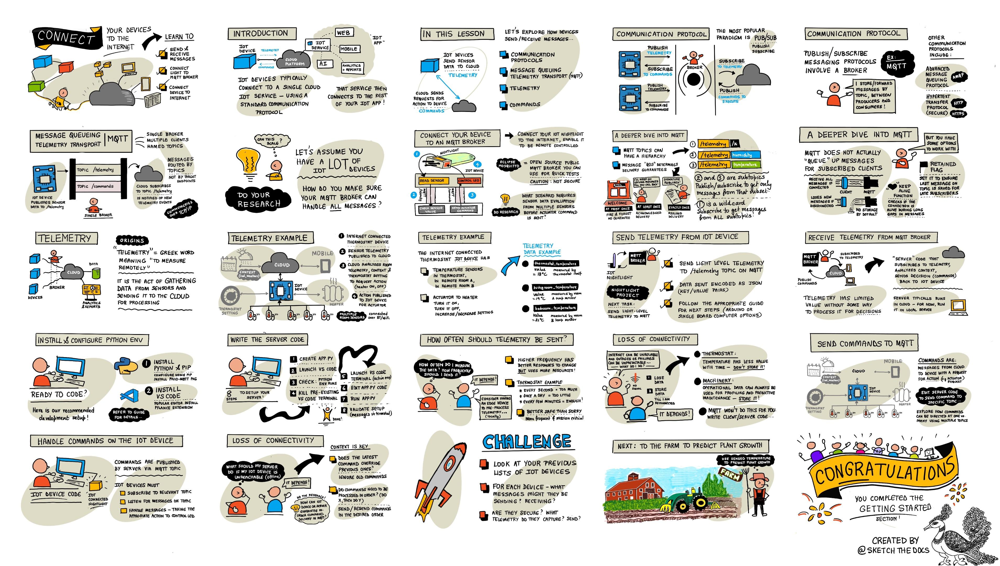

<!--
CO_OP_TRANSLATOR_METADATA:
{
  "original_hash": "71b5040e0b3472f1c0949c9b55f224c0",
  "translation_date": "2025-08-28T13:45:35+00:00",
  "source_file": "1-getting-started/lessons/4-connect-internet/README.md",
  "language_code": "hr"
}
-->
# Povežite svoj uređaj s internetom



> Sketchnote autorice [Nitya Narasimhan](https://github.com/nitya). Kliknite na sliku za veću verziju.

Ova lekcija je dio serije [Hello IoT](https://youtube.com/playlist?list=PLmsFUfdnGr3xRts0TIwyaHyQuHaNQcb6-) iz [Microsoft Reactor](https://developer.microsoft.com/reactor/?WT.mc_id=academic-17441-jabenn). Lekcija je podijeljena u dva videa - sat vremena predavanja i sat vremena dodatnih pitanja i dubljeg objašnjenja dijelova lekcije.

[](https://youtu.be/O4dd172mZhs)

[](https://youtu.be/j-cVCzRDE2Q)

> 🎥 Kliknite na slike iznad za gledanje videa

## Kviz prije predavanja

[Kviz prije predavanja](https://black-meadow-040d15503.1.azurestaticapps.net/quiz/7)

## Uvod

**I** u IoT označava **Internet** - povezivanje s oblakom i usluge koje omogućuju mnoge značajke IoT uređaja, od prikupljanja mjerenja sa senzora povezanih s uređajem do slanja poruka za upravljanje aktuatorima. IoT uređaji obično se povezuju s jednom uslugom u oblaku koristeći standardni komunikacijski protokol, a ta usluga je povezana s ostatkom vaše IoT aplikacije, od AI usluga za donošenje pametnih odluka na temelju podataka do web aplikacija za upravljanje ili izvještavanje.

> 🎓 Podaci prikupljeni sa senzora i poslani u oblak nazivaju se telemetrija.

IoT uređaji mogu primati poruke iz oblaka. Često te poruke sadrže naredbe - upute za izvršavanje neke radnje, bilo interno (kao što je ponovno pokretanje ili ažuriranje firmwarea) ili pomoću aktuatora (kao što je uključivanje svjetla).

Ova lekcija uvodi neke od komunikacijskih protokola koje IoT uređaji mogu koristiti za povezivanje s oblakom, kao i vrste podataka koje mogu slati ili primati. Također ćete praktično raditi s njima, dodajući internetsku kontrolu svom noćnom svjetlu, premještajući logiku upravljanja LED-om na 'server' kod koji se lokalno izvršava.

U ovoj lekciji obradit ćemo:

* [Komunikacijski protokoli](../../../../../1-getting-started/lessons/4-connect-internet)
* [Message Queueing Telemetry Transport (MQTT)](../../../../../1-getting-started/lessons/4-connect-internet)
* [Telemetrija](../../../../../1-getting-started/lessons/4-connect-internet)
* [Naredbe](../../../../../1-getting-started/lessons/4-connect-internet)

## Komunikacijski protokoli

Postoji nekoliko popularnih komunikacijskih protokola koje IoT uređaji koriste za komunikaciju s internetom. Najpopularniji su oni koji se temelje na objavljivanju/pretplati putem posrednika (broker). IoT uređaji povezuju se s posrednikom, objavljuju telemetriju i pretplaćuju se na naredbe. Usluge u oblaku također se povezuju s posrednikom, pretplaćuju se na sve telemetrijske poruke i objavljuju naredbe ili za specifične uređaje ili za grupe uređaja.


MQTT je najpopularniji komunikacijski protokol za IoT uređaje i obrađen je u ovoj lekciji. Ostali protokoli uključuju AMQP i HTTP/HTTPS.

## Message Queueing Telemetry Transport (MQTT)

[MQTT](http://mqtt.org) je lagani, otvoreni standardni protokol za razmjenu poruka koji omogućuje slanje poruka između uređaja. Dizajniran je 1999. za praćenje naftovoda, a 15 godina kasnije IBM ga je objavio kao otvoreni standard.

MQTT ima jednog posrednika i više klijenata. Svi klijenti povezuju se s posrednikom, a posrednik usmjerava poruke relevantnim klijentima. Poruke se usmjeravaju pomoću imenovanih tema, umjesto da se šalju izravno pojedinom klijentu. Klijent može objaviti poruku na temu, a svi klijenti pretplaćeni na tu temu primit će poruku.


✅ Istražite. Ako imate mnogo IoT uređaja, kako možete osigurati da vaš MQTT posrednik može obraditi sve poruke?

### Povežite svoj IoT uređaj s MQTT-om

Prvi korak u dodavanju internetske kontrole vašem noćnom svjetlu je povezivanje s MQTT posrednikom.

#### Zadatak

Povežite svoj uređaj s MQTT posrednikom.

U ovom dijelu lekcije povezat ćete svoje IoT noćno svjetlo s internetom kako biste ga mogli daljinski kontrolirati. Kasnije u ovoj lekciji, vaš IoT uređaj poslat će telemetrijsku poruku putem MQTT-a javnom MQTT posredniku s razinom svjetlosti, gdje će je preuzeti neki server kod koji ćete napisati. Ovaj kod provjerit će razinu svjetlosti i poslati povratnu naredbu uređaju s uputom da uključi ili isključi LED.

Stvarni slučaj upotrebe za ovakvu postavku mogao bi biti prikupljanje podataka s više senzora svjetlosti prije donošenja odluke o uključivanju svjetala na lokaciji s mnogo svjetala, poput stadiona. Ovo bi moglo spriječiti uključivanje svjetala ako je samo jedan senzor prekriven oblacima ili pticom, dok ostali senzori detektiraju dovoljno svjetla.

✅ Koje bi druge situacije zahtijevale procjenu podataka s više senzora prije slanja naredbi?

Umjesto da se bavite složenostima postavljanja MQTT posrednika kao dijela ovog zadatka, možete koristiti javni testni server koji pokreće [Eclipse Mosquitto](https://www.mosquitto.org), otvoreni MQTT posrednik. Ovaj testni posrednik javno je dostupan na [test.mosquitto.org](https://test.mosquitto.org) i ne zahtijeva postavljanje računa, što ga čini izvrsnim alatom za testiranje MQTT klijenata i servera.

> 💁 Ovaj testni posrednik je javan i nije siguran. Svatko može slušati što objavljujete, stoga ga nemojte koristiti za podatke koji trebaju ostati privatni.


Slijedite odgovarajući korak u nastavku kako biste povezali svoj uređaj s MQTT posrednikom:

* [Arduino - Wio Terminal](wio-terminal-mqtt.md)
* [Jednoplatično računalo - Raspberry Pi/Virtualni IoT uređaj](single-board-computer-mqtt.md)

### Dublje istraživanje MQTT-a

Teme mogu imati hijerarhiju, a klijenti se mogu pretplatiti na različite razine hijerarhije koristeći zamjenske znakove. Na primjer, možete slati telemetrijske poruke o temperaturi na temu `/telemetry/temperature` i poruke o vlažnosti na temu `/telemetry/humidity`, a zatim se u svojoj aplikaciji u oblaku pretplatiti na temu `/telemetry/*` kako biste primali i poruke o temperaturi i o vlažnosti.

Poruke se mogu slati s različitim razinama kvalitete usluge (QoS), što određuje jamstvo primitka poruke.

* Najviše jednom - poruka se šalje samo jednom, a klijent i posrednik ne poduzimaju dodatne korake za potvrdu isporuke (pošalji i zaboravi).
* Najmanje jednom - poruka se više puta šalje dok se ne primi potvrda (potvrđena isporuka).
* Točno jednom - pošiljatelj i primatelj provode dvostupanjsko rukovanje kako bi osigurali da se poruka primi samo jednom (osigurana isporuka).

✅ Koje bi situacije zahtijevale osiguranu isporuku poruke umjesto "pošalji i zaboravi" poruke?

Iako naziv uključuje Message Queueing (MQTT), protokol zapravo ne podržava redove poruka. To znači da, ako se klijent odspoji pa ponovno poveže, neće primiti poruke poslane tijekom prekida veze, osim onih koje je već počeo obrađivati koristeći QoS proces. Poruke mogu imati postavljenu zastavicu za zadržavanje. Ako je postavljena, MQTT posrednik pohranit će posljednju poruku poslanu na temu s tom zastavicom i poslati je svim klijentima koji se kasnije pretplate na tu temu. Na taj način klijenti će uvijek dobiti najnoviju poruku.

MQTT također podržava funkciju održavanja veze koja provjerava je li veza još uvijek aktivna tijekom dugih razmaka između poruka.

> 🦟 [Mosquitto iz Eclipse Foundation](https://mosquitto.org) nudi besplatni MQTT posrednik koji možete sami pokrenuti za eksperimentiranje s MQTT-om, kao i javni MQTT posrednik koji možete koristiti za testiranje svog koda, dostupan na [test.mosquitto.org](https://test.mosquitto.org).

MQTT veze mogu biti javne i otvorene ili šifrirane i osigurane pomoću korisničkih imena i lozinki ili certifikata.

> 💁 MQTT komunicira putem TCP/IP-a, istog osnovnog mrežnog protokola kao i HTTP, ali na drugom portu. Također možete koristiti MQTT preko websockets-a za komunikaciju s web aplikacijama koje se izvode u pregledniku ili u situacijama gdje vatrozidi ili druga mrežna pravila blokiraju standardne MQTT veze.

## Telemetrija

Riječ telemetrija dolazi od grčkih korijena i znači mjerenje na daljinu. Telemetrija je čin prikupljanja podataka sa senzora i slanja tih podataka u oblak.

> 💁 Jedan od prvih uređaja za telemetriju izumljen je u Francuskoj 1874. godine i slao je podatke o vremenu i dubini snijega u stvarnom vremenu s Mont Blanca u Pariz. Koristio je fizičke žice jer bežične tehnologije tada nisu bile dostupne.

Pogledajmo ponovno primjer pametnog termostata iz Lekcije 1.


Termostat ima senzore temperature za prikupljanje telemetrije. Najvjerojatnije bi imao jedan ugrađeni senzor temperature, a mogao bi se povezati s više vanjskih senzora temperature putem bežičnog protokola poput [Bluetooth Low Energy](https://wikipedia.org/wiki/Bluetooth_Low_Energy) (BLE).

Primjer telemetrijskih podataka koje bi mogao poslati:

| Naziv | Vrijednost | Opis |
| ----- | --------- | ----- |
| `thermostat_temperature` | 18°C | Temperatura izmjerena ugrađenim senzorom temperature termostata |
| `livingroom_temperature` | 19°C | Temperatura izmjerena udaljenim senzorom temperature koji je nazvan `livingroom` kako bi se identificirala soba u kojoj se nalazi |
| `bedroom_temperature` | 21°C | Temperatura izmjerena udaljenim senzorom temperature koji je nazvan `bedroom` kako bi se identificirala soba u kojoj se nalazi |

Usluga u oblaku tada može koristiti ove telemetrijske podatke za donošenje odluka o tome koje naredbe poslati za upravljanje grijanjem.

### Slanje telemetrije s vašeg IoT uređaja

Sljedeći korak u dodavanju internetske kontrole vašem noćnom svjetlu je slanje telemetrije o razini svjetlosti MQTT posredniku na telemetrijsku temu.

#### Zadatak - slanje telemetrije s vašeg IoT uređaja

Pošaljite telemetriju o razini svjetlosti MQTT posredniku.

Podaci se šalju kodirani kao JSON - skraćenica za JavaScript Object Notation, standard za kodiranje podataka u tekstu koristeći parove ključ/vrijednost.

✅ Ako se još niste susreli s JSON-om, možete saznati više o njemu u [JSON.org dokumentaciji](https://www.json.org/).

Slijedite odgovarajući korak u nastavku kako biste poslali telemetriju s vašeg uređaja MQTT posredniku:

* [Arduino - Wio Terminal](wio-terminal-telemetry.md)
* [Jednoplatično računalo - Raspberry Pi/Virtualni IoT uređaj](single-board-computer-telemetry.md)

### Primanje telemetrije od MQTT posrednika

Nema smisla slati telemetriju ako na drugom kraju nema ništa što je sluša. Telemetrija o razini svjetlosti treba nešto što će je slušati i obrađivati. Ovaj 'server' kod je vrsta koda koju ćete implementirati na uslugu u oblaku kao dio veće IoT aplikacije, ali ovdje ćete taj kod pokrenuti lokalno na svom računalu (ili na svom Raspberry Pi-ju ako tamo kodirate). Server kod sastoji se od Python aplikacije koja sluša telemetrijske poruke putem MQTT-a s razinama svjetlosti. Kasnije u ovoj lekciji, učinit ćete da odgovara naredbenom porukom s uputama za uključivanje ili isključivanje LED-a.

✅ Istražite: Što se događa s MQTT porukama ako nema slušatelja?

#### Instalirajte Python i VS Code

Ako nemate instalirane Python i VS Code lokalno, trebat ćete ih instalirati kako biste mogli pisati server kod. Ako koristite virtualni IoT uređaj ili radite na svom Raspberry Pi-ju, možete preskočiti ovaj korak jer biste to već trebali imati instalirano i konfigurirano.

##### Zadatak - instalirajte Python i VS Code

Instalirajte Python i VS Code.

1. Instalirajte Python. Pogledajte [stranicu za preuzimanje Pythona](https://www.python.org/downloads/) za upute o instalaciji najnovije verzije Pythona.

2. Instalirajte Visual Studio Code (VS Code). Ovo je uređivač koji ćete koristiti za pisanje koda vašeg virtualnog uređaja u Pythonu. Pogledajte [dokumentaciju za VS Code](https://code.visualstudio.com?WT.mc_id=academic-17441-jabenn) za upute o instalaciji VS Code-a.
💁 Slobodno koristite bilo koji Python IDE ili uređivač za ove lekcije ako imate omiljeni alat, ali lekcije će davati upute na temelju korištenja VS Code-a.
1. Instalirajte VS Code Pylance ekstenziju. Ovo je ekstenzija za VS Code koja pruža podršku za Python programski jezik. Pogledajte [dokumentaciju za Pylance ekstenziju](https://marketplace.visualstudio.com/items?WT.mc_id=academic-17441-jabenn&itemName=ms-python.vscode-pylance) za upute o instalaciji ove ekstenzije u VS Code.

#### Konfigurirajte Python virtualno okruženje

Jedna od moćnih značajki Pythona je mogućnost instalacije [pip paketa](https://pypi.org) - to su paketi koda koje su napisali drugi ljudi i objavili na internetu. Pip paket možete instalirati na svoje računalo jednim naredbom, a zatim koristiti taj paket u svom kodu. Koristit ćete pip za instalaciju paketa za komunikaciju putem MQTT-a.

Po defaultu, kada instalirate paket, on je dostupan svugdje na vašem računalu, što može dovesti do problema s verzijama paketa - na primjer, jedna aplikacija ovisi o jednoj verziji paketa koja se može pokvariti kada instalirate novu verziju za drugu aplikaciju. Da biste zaobišli ovaj problem, možete koristiti [Python virtualno okruženje](https://docs.python.org/3/library/venv.html), što je u suštini kopija Pythona u posvećenom direktoriju, a kada instalirate pip pakete, oni se instaliraju samo u taj direktorij.

##### Zadatak - konfigurirajte Python virtualno okruženje

Konfigurirajte Python virtualno okruženje i instalirajte MQTT pip pakete.

1. Iz terminala ili naredbenog retka pokrenite sljedeće na lokaciji po vašem izboru kako biste kreirali i navigirali u novi direktorij:

    ```sh
    mkdir nightlight-server
    cd nightlight-server
    ```

1. Sada pokrenite sljedeće kako biste kreirali virtualno okruženje u `.venv` direktoriju:

    ```sh
    python3 -m venv .venv
    ```

    > 💁 Morate eksplicitno pozvati `python3` kako biste kreirali virtualno okruženje, za slučaj da imate instaliran Python 2 uz Python 3 (najnoviju verziju). Ako imate instaliran Python 2, pozivanje `python` će koristiti Python 2 umjesto Python 3.

1. Aktivirajte virtualno okruženje:

    * Na Windowsu:
        * Ako koristite Command Prompt ili Command Prompt kroz Windows Terminal, pokrenite:

            ```cmd
            .venv\Scripts\activate.bat
            ```

        * Ako koristite PowerShell, pokrenite:

            ```powershell
            .\.venv\Scripts\Activate.ps1
            ```

    * Na macOS-u ili Linuxu, pokrenite:

        ```cmd
        source ./.venv/bin/activate
        ```

    > 💁 Ove naredbe treba pokrenuti s iste lokacije na kojoj ste pokrenuli naredbu za kreiranje virtualnog okruženja. Nikada nećete trebati navigirati u `.venv` direktorij, uvijek biste trebali pokrenuti naredbu za aktivaciju i bilo koje naredbe za instalaciju paketa ili pokretanje koda iz direktorija u kojem ste kreirali virtualno okruženje.

1. Kada je virtualno okruženje aktivirano, defaultna naredba `python` će pokrenuti verziju Pythona koja je korištena za kreiranje virtualnog okruženja. Pokrenite sljedeće kako biste dobili verziju:

    ```sh
    python --version
    ```

    Izlaz će biti sličan sljedećem:

    ```output
    (.venv) ➜  nightlight-server python --version
    Python 3.9.1
    ```

    > 💁 Vaša verzija Pythona može biti drugačija - sve dok je verzija 3.6 ili novija, u redu je. Ako nije, izbrišite ovaj direktorij, instalirajte noviju verziju Pythona i pokušajte ponovno.

1. Pokrenite sljedeće naredbe kako biste instalirali pip paket za [Paho-MQTT](https://pypi.org/project/paho-mqtt/), popularnu MQTT biblioteku.

    ```sh
    pip install paho-mqtt
    ```

    Ovaj pip paket će biti instaliran samo u virtualnom okruženju i neće biti dostupan izvan njega.

#### Napišite kod za server

Sada se može napisati kod za server u Pythonu.

##### Zadatak - napišite kod za server

Napišite kod za server.

1. Iz terminala ili naredbenog retka pokrenite sljedeće unutar virtualnog okruženja kako biste kreirali Python datoteku pod nazivom `app.py`:

    * Na Windowsu pokrenite:

        ```cmd
        type nul > app.py
        ```

    * Na macOS-u ili Linuxu pokrenite:

        ```cmd
        touch app.py
        ```

1. Otvorite trenutni direktorij u VS Code:

    ```sh
    code .
    ```

1. Kada se VS Code pokrene, aktivirat će Python virtualno okruženje. Ovo će biti prikazano u donjoj statusnoj traci:

    

1. Ako je VS Code Terminal već pokrenut kada se VS Code pokrene, virtualno okruženje neće biti aktivirano u njemu. Najlakše je ubiti terminal koristeći gumb **Kill the active terminal instance**:

    

1. Pokrenite novi VS Code Terminal odabirom *Terminal -> New Terminal*, ili pritiskom na `` CTRL+` ``. Novi terminal će učitati virtualno okruženje, s pozivom za aktivaciju koji se pojavljuje u terminalu. Ime virtualnog okruženja (`.venv`) također će biti u promptu:

    ```output
    ➜  nightlight-server source .venv/bin/activate
    (.venv) ➜  nightlight 
    ```

1. Otvorite datoteku `app.py` iz VS Code explorera i dodajte sljedeći kod:

    ```python
    import json
    import time
    
    import paho.mqtt.client as mqtt
    
    id = '<ID>'
    
    client_telemetry_topic = id + '/telemetry'
    client_name = id + 'nightlight_server'
    
    mqtt_client = mqtt.Client(client_name)
    mqtt_client.connect('test.mosquitto.org')
    
    mqtt_client.loop_start()
    
    def handle_telemetry(client, userdata, message):
        payload = json.loads(message.payload.decode())
        print("Message received:", payload)
    
    mqtt_client.subscribe(client_telemetry_topic)
    mqtt_client.on_message = handle_telemetry
    
    while True:
        time.sleep(2)
    ```

    Zamijenite `<ID>` u liniji 6 s jedinstvenim ID-om koji ste koristili prilikom kreiranja koda za uređaj.

    ⚠️ Ovo **mora** biti isti ID koji ste koristili na svom uređaju, inače kod za server neće pretplatiti ili objaviti na ispravnu temu.

    Ovaj kod kreira MQTT klijent s jedinstvenim imenom i povezuje se na *test.mosquitto.org* broker. Zatim pokreće procesnu petlju koja radi u pozadinskoj niti i sluša poruke na svim pretplaćenim temama.

    Klijent se zatim pretplaćuje na poruke na telemetrijskoj temi i definira funkciju koja se poziva kada se poruka primi. Kada se primi telemetrijska poruka, funkcija `handle_telemetry` se poziva, ispisujući primljenu poruku na konzolu.

    Na kraju, beskonačna petlja održava aplikaciju aktivnom. MQTT klijent sluša poruke u pozadinskoj niti i radi sve dok glavna aplikacija radi.

1. Iz VS Code terminala pokrenite sljedeće kako biste pokrenuli svoju Python aplikaciju:

    ```sh
    python app.py
    ```

    Aplikacija će početi slušati poruke s IoT uređaja.

1. Provjerite je li vaš uređaj pokrenut i šalje telemetrijske poruke. Podesite razine svjetlosti koje detektira vaš fizički ili virtualni uređaj. Poruke koje se primaju bit će ispisane na terminalu.

    ```output
    (.venv) ➜  nightlight-server python app.py
    Message received: {'light': 0}
    Message received: {'light': 400}
    ```

    Datoteka app.py u virtualnom okruženju nightlight mora biti pokrenuta kako bi datoteka app.py u virtualnom okruženju nightlight-server primila poruke koje se šalju.

> 💁 Ovaj kod možete pronaći u [code-server/server](../../../../../1-getting-started/lessons/4-connect-internet/code-server/server) direktoriju.

### Koliko često treba slati telemetriju?

Jedno važno razmatranje kod telemetrije je koliko često mjeriti i slati podatke? Odgovor je - ovisi. Ako mjerite često, možete brže reagirati na promjene u mjerenjima, ali koristite više energije, više propusnosti, generirate više podataka i trebate više resursa u oblaku za obradu. Trebate mjeriti dovoljno često, ali ne prečesto.

Za termostat, mjerenje svakih nekoliko minuta vjerojatno je više nego dovoljno jer se temperature ne mijenjaju tako često. Ako mjerite samo jednom dnevno, mogli biste završiti s grijanjem kuće za noćne temperature usred sunčanog dana, dok ako mjerite svake sekunde, imat ćete tisuće nepotrebno dupliciranih mjerenja temperature koja će usporiti korisnikov internet i propusnost (problem za ljude s ograničenim planovima propusnosti), koristiti više energije što može biti problem za uređaje na baterije poput udaljenih senzora, i povećati troškove resursa za obradu i pohranu u oblaku.

Ako pratite podatke oko stroja u tvornici koji, ako se pokvari, može uzrokovati katastrofalnu štetu i milijune dolara izgubljenog prihoda, tada bi mjerenje više puta u sekundi moglo biti potrebno. Bolje je potrošiti propusnost nego propustiti telemetriju koja ukazuje na to da stroj treba zaustaviti i popraviti prije nego što se pokvari.

> 💁 U takvoj situaciji, mogli biste razmotriti korištenje edge uređaja za obradu telemetrije kako biste smanjili oslanjanje na internet.

### Gubitak povezivosti

Internetske veze mogu biti nepouzdane, s čestim prekidima. Što bi IoT uređaj trebao učiniti u takvim okolnostima - treba li izgubiti podatke ili ih pohraniti dok se povezanost ne obnovi? Opet, odgovor je - ovisi.

Za termostat podaci se vjerojatno mogu izgubiti čim se uzme novo mjerenje temperature. Sustav grijanja ne mari za to da je prije 20 minuta temperatura bila 20.5°C ako je sada 19°C, trenutna temperatura određuje treba li grijanje biti uključeno ili isključeno.

Za strojeve možda želite zadržati podatke, pogotovo ako se koriste za traženje trendova. Postoje modeli strojnog učenja koji mogu otkriti anomalije u tokovima podataka gledajući podatke iz definiranog vremenskog razdoblja (kao što je posljednji sat) i uočavajući anomalne podatke. Ovo se često koristi za prediktivno održavanje, tražeći indikacije da bi nešto moglo uskoro puknuti kako biste to mogli popraviti ili zamijeniti prije nego što se dogodi. Možda želite da se sva telemetrija za stroj pošalje kako bi se mogla obraditi za otkrivanje anomalija, pa kada se IoT uređaj ponovno poveže, poslat će svu telemetriju generiranu tijekom prekida interneta.

Dizajneri IoT uređaja također bi trebali razmotriti može li se IoT uređaj koristiti tijekom prekida interneta ili gubitka signala uzrokovanog lokacijom. Pametni termostat trebao bi moći donositi neke ograničene odluke za kontrolu grijanja ako ne može poslati telemetriju u oblak zbog prekida.

[](https://twitter.com/internetofshit/status/1315736960082808832)

Za MQTT, uređaj i kod za server moraju biti odgovorni za osiguranje isporuke poruka ako je to potrebno, na primjer zahtijevanjem da se na sve poslane poruke odgovori dodatnim porukama na povratnoj temi, a ako ne, one se ručno stavljaju u red za ponovno slanje kasnije.

## Naredbe

Naredbe su poruke koje šalje oblak uređaju, upućujući ga da nešto učini. Većinu vremena to uključuje davanje nekog izlaza putem aktuatora, ali to može biti i instrukcija za sam uređaj, poput ponovnog pokretanja ili prikupljanja dodatne telemetrije i vraćanja kao odgovora na naredbu.


Termostat bi mogao primiti naredbu iz oblaka za uključivanje grijanja. Na temelju telemetrijskih podataka sa svih senzora, ako je oblačna usluga odlučila da grijanje treba biti uključeno, šalje odgovarajuću naredbu.

### Slanje naredbi MQTT brokeru

Sljedeći korak za naš Internet kontrolirani noćni svjetlosni uređaj je da kod za server pošalje naredbu natrag IoT uređaju kako bi kontrolirao svjetlo na temelju razine svjetlosti koju detektira.

1. Otvorite kod za server u VS Code

1. Dodajte sljedeći redak nakon deklaracije `client_telemetry_topic` kako biste definirali na kojoj temi slati naredbe:

    ```python
    server_command_topic = id + '/commands'
    ```

1. Dodajte sljedeći kod na kraj funkcije `handle_telemetry`:

    ```python
    command = { 'led_on' : payload['light'] < 300 }
    print("Sending message:", command)
    
    client.publish(server_command_topic, json.dumps(command))
    ```

    Ovo šalje JSON poruku na temu naredbi s vrijednošću `led_on` postavljenom na true ili false ovisno o tome je li svjetlo manje od 300 ili ne. Ako je svjetlo manje od 300, šalje se true kako bi se uređaju naložilo da uključi LED.

1. Pokrenite kod kao i prije

1. Podesite razine svjetlosti koje detektira vaš fizički ili virtualni uređaj. Poruke koje se primaju i naredbe koje se šalju bit će ispisane na terminalu:

    ```output
    (.venv) ➜  nightlight-server python app.py
    Message received: {'light': 0}
    Sending message: {'led_on': True}
    Message received: {'light': 400}
    Sending message: {'led_on': False}
    ```

> 💁 Telemetrija i naredbe se šalju na jednu temu svaka. To znači da će telemetrija s više uređaja biti prikazana na istoj telemetrijskoj temi, a naredbe za više uređaja će biti prikazane na istoj temi naredbi. Ako želite poslati naredbu određenom uređaju, mogli biste koristiti više tema, imenovanih s jedinstvenim ID-om uređaja, poput `/commands/device1`, `/commands/device2`. Na taj način uređaj može slušati poruke namijenjene samo tom jednom uređaju.

> 💁 Ovaj kod možete pronaći u [code-commands/server](../../../../../1-getting-started/lessons/4-connect-internet/code-commands/server) direktoriju.

### Obrada naredbi na IoT uređaju

Sada kada se naredbe šalju s servera, možete dodati kod na IoT uređaj kako biste ih obradili i kontrolirali LED.

Slijedite relevantni korak u nastavku kako biste slušali naredbe s MQTT brokera:

* [Arduino - Wio Terminal](wio-terminal-commands.md)
* [Jednostavno računalo - Raspberry Pi/Virtualni IoT uređaj](single-board-computer-commands.md)

Kada je ovaj kod napisan i pokrenut, eksperimentirajte s promjenom razina svjetlosti. Promatrajte izlaz sa servera i uređaja, te promatrajte LED dok mijenjate razine svjetlosti.

### Gubitak povezivosti

Što bi oblačna usluga trebala učiniti ako treba poslati naredbu IoT uređaju koji je offline? Opet, odgovor je - ovisi.

Ako najnovija naredba poništava raniju, tada se ranije mogu vjerojatno ignorirati. Ako oblačna usluga pošalje naredbu za uključivanje grijanja, a zatim naredbu za isključivanje, tada se naredba za uključivanje može ignorirati i ne ponovno poslati.

Ako naredbe trebaju biti obrađene redoslijedom, poput pomicanja robotske ruke gore, a zatim zatvaranja hvataljke, tada ih treba poslati redoslijedom kada se povezanost obnovi.

✅ Kako bi uređaj ili kod za server mogli osigurati da se naredbe uvijek šalju i obrađuju redoslijedom preko MQTT-a ako je potrebno?

---

## 🚀 Izazov

Izazov u posljednje tri lekcije bio je nabrojati što više IoT uređaja koje možete pronaći u svom domu, školi ili radnom mjestu i odlučiti jesu li izgrađeni oko mikrokontrolera ili jednostavnih računala, ili čak mješavine oboje, te razmisliti o tome koje senzore i aktuatore koriste.
Za ove uređaje, razmislite o porukama koje bi mogli slati ili primati. Koju telemetriju šalju? Koje poruke ili naredbe bi mogli primati? Smatrate li da su sigurni?

## Kviz nakon predavanja

[Kviz nakon predavanja](https://black-meadow-040d15503.1.azurestaticapps.net/quiz/8)

## Pregled i samostalno učenje

Pročitajte više o MQTT-u na [MQTT Wikipedia stranici](https://wikipedia.org/wiki/MQTT).

Pokušajte sami pokrenuti MQTT poslužitelj koristeći [Mosquitto](https://www.mosquitto.org) i povežite se na njega sa svojim IoT uređajem i serverskim kodom.

> 💁 Savjet - prema zadanim postavkama Mosquitto ne dopušta anonimne veze (odnosno povezivanje bez korisničkog imena i lozinke) i ne dopušta veze izvan računala na kojem se pokreće.  
> Ovo možete riješiti pomoću [`mosquitto.conf` konfiguracijske datoteke](https://www.mosquitto.org/man/mosquitto-conf-5.html) s ovim sadržajem:
>
> ```sh
> listener 1883 0.0.0.0
> allow_anonymous true
> ```

## Zadatak

[Usporedite i kontrastirajte MQTT s drugim komunikacijskim protokolima](assignment.md)

---

**Odricanje od odgovornosti**:  
Ovaj dokument je preveden pomoću AI usluge za prevođenje [Co-op Translator](https://github.com/Azure/co-op-translator). Iako nastojimo osigurati točnost, imajte na umu da automatski prijevodi mogu sadržavati pogreške ili netočnosti. Izvorni dokument na izvornom jeziku treba smatrati autoritativnim izvorom. Za kritične informacije preporučuje se profesionalni prijevod od strane čovjeka. Ne preuzimamo odgovornost za bilo kakve nesporazume ili pogrešne interpretacije koje proizlaze iz korištenja ovog prijevoda.