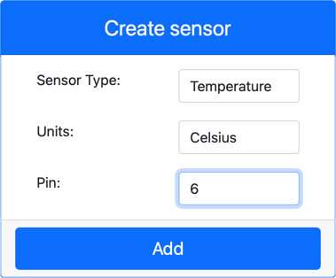

<!--
CO_OP_TRANSLATOR_METADATA:
{
  "original_hash": "70e5a428b607cd5a9a4f422c2a4df03d",
  "translation_date": "2025-08-28T15:15:11+00:00",
  "source_file": "2-farm/lessons/1-predict-plant-growth/virtual-device-temp.md",
  "language_code": "hr"
}
-->
# Mjerenje temperature - Virtualni IoT uređaj

U ovom dijelu lekcije dodati ćete senzor temperature svom virtualnom IoT uređaju.

## Virtualni hardver

Virtualni IoT uređaj koristit će simulirani Grove Digital Humidity and Temperature senzor. Ovo omogućuje da laboratorij ostane isti kao korištenje Raspberry Pi uređaja s fizičkim Grove DHT11 senzorom.

Senzor kombinira **senzor temperature** s **senzorom vlage**, ali u ovom laboratoriju zanima vas samo komponenta senzora temperature. Na fizičkom IoT uređaju, senzor temperature bio bi [termistor](https://wikipedia.org/wiki/Thermistor) koji mjeri temperaturu osjetivši promjenu otpora kako se temperatura mijenja. Senzori temperature obično su digitalni senzori koji interno pretvaraju izmjereni otpor u temperaturu u stupnjevima Celzija (ili Kelvina, ili Fahrenheita).

### Dodavanje senzora u CounterFit

Za korištenje virtualnog senzora vlage i temperature, potrebno je dodati dva senzora u CounterFit aplikaciju.

#### Zadatak - dodavanje senzora u CounterFit

Dodajte senzore vlage i temperature u CounterFit aplikaciju.

1. Kreirajte novu Python aplikaciju na svom računalu u mapi nazvanoj `temperature-sensor` s jednim datotekama nazvanim `app.py` i Python virtualnim okruženjem, te dodajte CounterFit pip pakete.

    > ⚠️ Možete se referirati na [upute za kreiranje i postavljanje CounterFit Python projekta u lekciji 1 ako je potrebno](../../../1-getting-started/lessons/1-introduction-to-iot/virtual-device.md).

1. Instalirajte dodatni Pip paket za instalaciju CounterFit shima za DHT11 senzor. Pobrinite se da ovo instalirate iz terminala s aktiviranim virtualnim okruženjem.

    ```sh
    pip install counterfit-shims-seeed-python-dht
    ```

1. Pobrinite se da je CounterFit web aplikacija pokrenuta.

1. Kreirajte senzor vlage:

    1. U okviru *Create sensor* u *Sensors* panelu, otvorite padajući izbornik *Sensor type* i odaberite *Humidity*.

    1. Ostavite *Units* postavljen na *Percentage*.

    1. Pobrinite se da je *Pin* postavljen na *5*.

    1. Odaberite gumb **Add** za kreiranje senzora vlage na pinu 5.

    

    Senzor vlage će biti kreiran i pojavit će se na popisu senzora.

    

1. Kreirajte senzor temperature:

    1. U okviru *Create sensor* u *Sensors* panelu, otvorite padajući izbornik *Sensor type* i odaberite *Temperature*.

    1. Ostavite *Units* postavljen na *Celsius*.

    1. Pobrinite se da je *Pin* postavljen na *6*.

    1. Odaberite gumb **Add** za kreiranje senzora temperature na pinu 6.

    

    Senzor temperature će biti kreiran i pojavit će se na popisu senzora.

    

## Programiranje aplikacije za senzor temperature

Aplikacija za senzor temperature sada se može programirati koristeći CounterFit senzore.

### Zadatak - programiranje aplikacije za senzor temperature

Programirajte aplikaciju za senzor temperature.

1. Pobrinite se da je aplikacija `temperature-sensor` otvorena u VS Code-u.

1. Otvorite datoteku `app.py`.

1. Dodajte sljedeći kod na vrh datoteke `app.py` za povezivanje aplikacije s CounterFit-om:

    ```python
    from counterfit_connection import CounterFitConnection
    CounterFitConnection.init('127.0.0.1', 5000)
    ```

1. Dodajte sljedeći kod u datoteku `app.py` za uvoz potrebnih biblioteka:

    ```python
    import time
    from counterfit_shims_seeed_python_dht import DHT
    ```

    Izjava `from seeed_dht import DHT` uvozi klasu `DHT` senzora za interakciju s virtualnim Grove senzorom temperature koristeći shim iz modula `counterfit_shims_seeed_python_dht`.

1. Dodajte sljedeći kod nakon prethodnog za kreiranje instance klase koja upravlja virtualnim senzorom vlage i temperature:

    ```python
    sensor = DHT("11", 5)
    ```

    Ovo deklarira instancu klase `DHT` koja upravlja virtualnim **D**igitalnim **H**umidity i **T**emperature senzorom. Prvi parametar govori kodu da se koristi virtualni *DHT11* senzor. Drugi parametar govori kodu da je senzor povezan na port `5`.

    > 💁 CounterFit simulira ovaj kombinirani senzor vlage i temperature povezivanjem na 2 senzora, senzor vlage na pinu koji je naveden prilikom kreiranja klase `DHT`, i senzor temperature koji radi na sljedećem pinu. Ako je senzor vlage na pinu 5, shim očekuje da je senzor temperature na pinu 6.

1. Dodajte beskonačnu petlju nakon prethodnog koda za očitavanje vrijednosti senzora temperature i ispis na konzolu:

    ```python
    while True:
        _, temp = sensor.read()
        print(f'Temperature {temp}°C')
    ```

    Poziv `sensor.read()` vraća tuple s vrijednostima vlage i temperature. Potrebna vam je samo vrijednost temperature, pa se vlaga ignorira. Vrijednost temperature se zatim ispisuje na konzolu.

1. Dodajte kratku pauzu od deset sekundi na kraju petlje jer razine temperature ne trebaju biti kontinuirano provjeravane. Pauza smanjuje potrošnju energije uređaja.

    ```python
    time.sleep(10)
    ```

1. Iz terminala u VS Code-u s aktiviranim virtualnim okruženjem, pokrenite sljedeće za pokretanje vaše Python aplikacije:

    ```sh
    python app.py
    ```

1. U CounterFit aplikaciji promijenite vrijednost senzora temperature koju će aplikacija očitavati. To možete učiniti na dva načina:

    * Unesite broj u okvir *Value* za senzor temperature, zatim odaberite gumb **Set**. Broj koji unesete bit će vrijednost koju senzor vraća.

    * Označite *Random* checkbox i unesite *Min* i *Max* vrijednosti, zatim odaberite gumb **Set**. Svaki put kada senzor očita vrijednost, očitat će nasumičan broj između *Min* i *Max*.

    Trebali biste vidjeti vrijednosti koje ste postavili kako se pojavljuju na konzoli. Promijenite *Value* ili postavke *Random* da biste vidjeli promjenu vrijednosti.

    ```output
    (.venv) ➜  temperature-sensor python app.py
    Temperature 28.25°C
    Temperature 30.71°C
    Temperature 25.17°C
    ```

> 💁 Ovaj kod možete pronaći u mapi [code-temperature/virtual-device](../../../../../2-farm/lessons/1-predict-plant-growth/code-temperature/virtual-device).

😀 Vaš program za senzor temperature bio je uspješan!

---

**Odricanje od odgovornosti**:  
Ovaj dokument je preveden pomoću AI usluge za prevođenje [Co-op Translator](https://github.com/Azure/co-op-translator). Iako nastojimo osigurati točnost, imajte na umu da automatski prijevodi mogu sadržavati pogreške ili netočnosti. Izvorni dokument na izvornom jeziku treba smatrati autoritativnim izvorom. Za ključne informacije preporučuje se profesionalni prijevod od strane ljudskog prevoditelja. Ne preuzimamo odgovornost za nesporazume ili pogrešne interpretacije koje mogu proizaći iz korištenja ovog prijevoda.