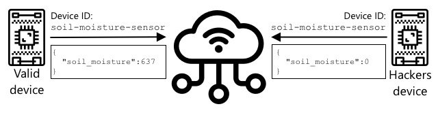

<!--
CO_OP_TRANSLATOR_METADATA:
{
  "original_hash": "81c437c568eee1b0dda1f04e88150d37",
  "translation_date": "2025-08-28T14:52:40+00:00",
  "source_file": "2-farm/lessons/6-keep-your-plant-secure/README.md",
  "language_code": "hr"
}
-->
# Osigurajte svoju biljku


> Sketchnote autor [Nitya Narasimhan](https://github.com/nitya). Kliknite na sliku za veću verziju.

## Kviz prije predavanja

[Kviz prije predavanja](https://black-meadow-040d15503.1.azurestaticapps.net/quiz/19)

## Uvod

U posljednjih nekoliko lekcija kreirali ste IoT uređaj za praćenje tla i povezali ga s oblakom. No, što ako hakeri koji rade za konkurentskog poljoprivrednika preuzmu kontrolu nad vašim IoT uređajima? Što ako pošalju visoke očitanja vlažnosti tla kako vaše biljke nikada ne bi bile zalijevane, ili uključe sustav za zalijevanje da radi neprekidno, ubijajući vaše biljke prekomjernim zalijevanjem i uzrokujući vam velike troškove za vodu?

U ovoj lekciji naučit ćete kako osigurati IoT uređaje. Budući da je ovo posljednja lekcija za ovaj projekt, također ćete naučiti kako očistiti svoje resurse u oblaku, smanjujući potencijalne troškove.

U ovoj lekciji obradit ćemo:

* [Zašto trebate osigurati IoT uređaje?](../../../../../2-farm/lessons/6-keep-your-plant-secure)
* [Kriptografija](../../../../../2-farm/lessons/6-keep-your-plant-secure)
* [Osigurajte svoje IoT uređaje](../../../../../2-farm/lessons/6-keep-your-plant-secure)
* [Generirajte i koristite X.509 certifikat](../../../../../2-farm/lessons/6-keep-your-plant-secure)

> 🗑 Ovo je posljednja lekcija u ovom projektu, pa nakon što završite ovu lekciju i zadatak, ne zaboravite očistiti svoje usluge u oblaku. Trebat će vam usluge za dovršavanje zadatka, pa se pobrinite da prvo to završite.
>
> Ako je potrebno, pogledajte [vodič za čišćenje projekta](../../../clean-up.md) za upute kako to učiniti.

## Zašto trebate osigurati IoT uređaje?

Sigurnost IoT-a uključuje osiguranje da samo očekivani uređaji mogu povezati se s vašom IoT uslugom u oblaku i slati telemetriju, te da samo vaša usluga u oblaku može slati naredbe vašim uređajima. IoT podaci također mogu biti osobni, uključujući medicinske ili intimne podatke, pa cijela vaša aplikacija mora uzeti u obzir sigurnost kako bi spriječila curenje tih podataka.

Ako vaša IoT aplikacija nije sigurna, postoji niz rizika:

* Lažni uređaj mogao bi poslati netočne podatke, uzrokujući da vaša aplikacija reagira pogrešno. Na primjer, mogli bi poslati stalno visoke očitanja vlažnosti tla, što znači da se vaš sustav za navodnjavanje nikada ne uključuje i vaše biljke umiru od nedostatka vode.
* Neovlašteni korisnici mogli bi čitati podatke s IoT uređaja, uključujući osobne ili poslovno kritične podatke.
* Hakeri bi mogli slati naredbe za kontrolu uređaja na način koji bi mogao uzrokovati štetu uređaju ili povezanom hardveru.
* Povezivanjem na IoT uređaj, hakeri mogu koristiti to za pristup dodatnim mrežama i dobiti pristup privatnim sustavima.
* Zlonamjerni korisnici mogli bi pristupiti osobnim podacima i koristiti ih za ucjenu.

Ovo su scenariji iz stvarnog svijeta i događaju se stalno. Neki primjeri su navedeni u ranijim lekcijama, ali evo još nekoliko:

* Godine 2018., hakeri su koristili otvorenu WiFi pristupnu točku na termostatu akvarija kako bi dobili pristup mreži kasina i ukrali podatke. [The Hacker News - Casino Gets Hacked Through Its Internet-Connected Fish Tank Thermometer](https://thehackernews.com/2018/04/iot-hacking-thermometer.html)
* Godine 2016., Mirai Botnet pokrenuo je napad uskraćivanja usluge protiv Dyn-a, pružatelja internetskih usluga, čime je srušio velike dijelove interneta. Ovaj botnet koristio je zlonamjerni softver za povezivanje s IoT uređajima poput DVR-ova i kamera koje su koristile zadane korisničke imena i lozinke, i odatle pokrenuo napad. [The Guardian - DDoS attack that disrupted internet was largest of its kind in history, experts say](https://www.theguardian.com/technology/2016/oct/26/ddos-attack-dyn-mirai-botnet)
* Spiral Toys imao je bazu podataka korisnika svojih povezanih igračaka CloudPets javno dostupnu na internetu. [Troy Hunt - Data from connected CloudPets teddy bears leaked and ransomed, exposing kids' voice messages](https://www.troyhunt.com/data-from-connected-cloudpets-teddy-bears-leaked-and-ransomed-exposing-kids-voice-messages/).
* Strava je označavala trkače koje ste prošli i prikazivala njihove rute, omogućujući strancima da praktički vide gdje živite. [Kim Komndo - Fitness app could lead a stranger right to your home — change this setting](https://www.komando.com/security-privacy/strava-fitness-app-privacy/755349/).

✅ Istražite: Potražite više primjera hakiranja IoT-a i proboja IoT podataka, posebno s osobnim predmetima poput internetski povezanih četkica za zube ili vaga. Razmislite o utjecaju koji bi ti napadi mogli imati na žrtve ili kupce.

> 💁 Sigurnost je ogromna tema, a ova lekcija će se dotaknuti samo nekih osnovnih stvari vezanih uz povezivanje vašeg uređaja s oblakom. Ostale teme koje neće biti pokrivene uključuju praćenje promjena podataka u prijenosu, hakiranje uređaja izravno ili promjene konfiguracija uređaja. Hakiranje IoT-a je toliko velika prijetnja da su razvijeni alati poput [Azure Defender for IoT](https://azure.microsoft.com/services/azure-defender-for-iot/?WT.mc_id=academic-17441-jabenn). Ovi alati su slični antivirusnim i sigurnosnim alatima koje možda imate na svom računalu, samo dizajnirani za male, niskoenergetske IoT uređaje.

## Kriptografija

Kada se uređaj povezuje s IoT uslugom, koristi ID za identifikaciju. Problem je što se taj ID može klonirati - haker bi mogao postaviti zlonamjerni uređaj koji koristi isti ID kao pravi uređaj, ali šalje lažne podatke.



Rješenje za ovo je pretvaranje podataka koji se šalju u šifrirani format, koristeći neku vrijednost poznatu samo uređaju i oblaku. Ovaj proces se naziva *šifriranje*, a vrijednost koja se koristi za šifriranje podataka naziva se *ključ za šifriranje*.


Usluga u oblaku tada može pretvoriti podatke natrag u čitljiv format, koristeći proces nazvan *dešifriranje*, koristeći ili isti ključ za šifriranje ili *ključ za dešifriranje*. Ako se šifrirana poruka ne može dešifrirati pomoću ključa, uređaj je hakiran i poruka se odbija.

Tehnika za šifriranje i dešifriranje naziva se *kriptografija*.

### Rani oblici kriptografije

Najraniji oblici kriptografije bili su zamjenske šifre, koje datiraju unatrag 3.500 godina. Zamjenske šifre uključuju zamjenu jednog slova drugim. Na primjer, [Cezarova šifra](https://wikipedia.org/wiki/Caesar_cipher) uključuje pomicanje abecede za određeni broj mjesta, pri čemu samo pošiljatelj šifrirane poruke i namijenjeni primatelj znaju za koliko mjesta pomaknuti.

[Vigenèreova šifra](https://wikipedia.org/wiki/Vigenère_cipher) je otišla korak dalje koristeći riječi za šifriranje teksta, tako da je svako slovo u originalnom tekstu pomaknuto za različit broj mjesta, umjesto da se uvijek pomiče za isti broj slova.

Kriptografija se koristila za širok raspon svrha, poput zaštite recepta za glazuru lončara u drevnoj Mezopotamiji, pisanja tajnih ljubavnih poruka u Indiji ili čuvanja drevnih egipatskih magijskih čarolija u tajnosti.

### Moderna kriptografija

Moderna kriptografija je mnogo naprednija, što je čini težom za razbijanje od ranijih metoda. Moderna kriptografija koristi složenu matematiku za šifriranje podataka s previše mogućih ključeva da bi napadi grube sile bili mogući.

Kriptografija se koristi na mnogo različitih načina za sigurne komunikacije. Ako čitate ovu stranicu na GitHubu, možda ćete primijetiti da web adresa počinje s *HTTPS*, što znači da je komunikacija između vašeg preglednika i web poslužitelja GitHuba šifrirana. Ako bi netko mogao čitati internetski promet koji teče između vašeg preglednika i GitHuba, ne bi mogao pročitati podatke jer su šifrirani. Vaše računalo čak može šifrirati sve podatke na vašem tvrdom disku, tako da ako ga netko ukrade, neće moći pročitati vaše podatke bez vaše lozinke.

> 🎓 HTTPS označava HyperText Transfer Protocol **Secure**

Nažalost, nije sve sigurno. Neki uređaji nemaju nikakvu sigurnost, drugi su osigurani lako razbijivim ključevima, ili čak svi uređaji iste vrste koriste isti ključ. Postoje izvještaji o vrlo osobnim IoT uređajima koji svi imaju istu lozinku za povezivanje putem WiFi-a ili Bluetootha. Ako se možete povezati sa svojim uređajem, možete se povezati i s tuđim. Jednom povezani, mogli biste pristupiti vrlo privatnim podacima ili imati kontrolu nad njihovim uređajem.

> 💁 Unatoč složenosti moderne kriptografije i tvrdnjama da razbijanje šifriranja može trajati milijardama godina, uspon kvantnog računalstva doveo je do mogućnosti razbijanja svih poznatih šifriranja u vrlo kratkom vremenu!

### Simetrični i asimetrični ključevi

Šifriranje dolazi u dva oblika - simetrično i asimetrično.

**Simetrično** šifriranje koristi isti ključ za šifriranje i dešifriranje podataka. I pošiljatelj i primatelj moraju znati isti ključ. Ovo je najmanje siguran tip, jer se ključ mora nekako podijeliti. Da bi pošiljatelj poslao šifriranu poruku primatelju, pošiljatelj prvo mora poslati primatelju ključ.


Ako se ključ ukrade tijekom prijenosa, ili ako pošiljatelj ili primatelj budu hakirani i ključ se pronađe, šifriranje se može razbiti.


**Asimetrično** šifriranje koristi 2 ključa - ključ za šifriranje i ključ za dešifriranje, poznate kao javno/privatni par ključeva. Javni ključ se koristi za šifriranje poruke, ali se ne može koristiti za dešifriranje, dok se privatni ključ koristi za dešifriranje poruke, ali se ne može koristiti za šifriranje.


Primatelj dijeli svoj javni ključ, a pošiljatelj koristi ovaj ključ za šifriranje poruke. Nakon što je poruka poslana, primatelj je dešifrira svojim privatnim ključem. Asimetrično šifriranje je sigurnije jer se privatni ključ čuva privatnim od strane primatelja i nikada se ne dijeli. Javni ključ može imati bilo tko jer se može koristiti samo za šifriranje poruka.

Simetrično šifriranje je brže od asimetričnog, dok je asimetrično sigurnije. Neki sustavi koriste oba - koristeći asimetrično šifriranje za šifriranje i dijeljenje simetričnog ključa, a zatim koristeći simetrični ključ za šifriranje svih podataka. Ovo čini dijeljenje simetričnog ključa između pošiljatelja i primatelja sigurnijim, i bržim kada se šifriraju i dešifriraju podaci.

## Osigurajte svoje IoT uređaje

IoT uređaji mogu se osigurati korištenjem simetričnog ili asimetričnog šifriranja. Simetrično je jednostavnije, ali manje sigurno.

### Simetrični ključevi

Kada ste postavili svoj IoT uređaj za interakciju s IoT Hubom, koristili ste niz za povezivanje. Primjer niza za povezivanje je:

```output
HostName=soil-moisture-sensor.azure-devices.net;DeviceId=soil-moisture-sensor;SharedAccessKey=Bhry+ind7kKEIDxubK61RiEHHRTrPl7HUow8cEm/mU0=
```

Ovaj niz za povezivanje sastoji se od tri dijela odvojenih točkama-zarezima, pri čemu je svaki dio ključ i vrijednost:

| Ključ | Vrijednost | Opis |
| --- | ----- | ----------- |
| HostName | `soil-moisture-sensor.azure-devices.net` | URL IoT Huba |
| DeviceId | `soil-moisture-sensor` | Jedinstveni ID uređaja |
| SharedAccessKey | `Bhry+ind7kKEIDxubK61RiEHHRTrPl7HUow8cEm/mU0=` | Simetrični ključ poznat uređaju i IoT Hubu |

Posljednji dio ovog niza za povezivanje, `SharedAccessKey`, je simetrični ključ poznat i uređaju i IoT Hubu. Ovaj ključ nikada se ne šalje s uređaja na oblak, niti s oblaka na uređaj. Umjesto toga, koristi se za šifriranje podataka koji se šalju ili primaju.

✅ Napravite eksperiment. Što mislite da će se dogoditi ako promijenite dio `SharedAccessKey` u nizu za povezivanje prilikom povezivanja vašeg IoT uređaja? Isprobajte.

Kada se uređaj prvi put pokušava povezati, šalje token zajedničkog pristupa (SAS) koji se sastoji od URL-a IoT Huba, vremenske oznake kada će token isteći (obično 1 dan od trenutnog vremena) i potpisa. Ovaj potpis se sastoji od URL-a i vremena isteka šifriranih zajedničkim ključem za pristup iz niza za povezivanje.

IoT Hub dešifrira ovaj potpis zajedničkim ključem za pristup, i ako dešifrirana vrijednost odgovara URL-u i vremenu isteka, uređaju je dopušteno povezivanje. Također provjerava da je trenutno vrijeme prije isteka, kako bi spriječio zlonamjerni uređaj da uhvati SAS token pravog uređaja i koristi ga.

Ovo je elegantan način za provjeru da je pošiljatelj ispravan uređaj. Slanjem nekih poznatih podataka u šifriranom i nešifriranom obliku, poslužitelj može provjeriti uređaj osiguravajući da kada dešifrira šifrirane podatke, rezultat odgovara nešifriranoj verziji koja je poslana. Ako se podaci podudaraju, tada i pošiljatelj i primatelj imaju isti simetrični ključ za šifriranje.
💁 Zbog vremena isteka, vaš IoT uređaj mora znati točno vrijeme, koje se obično očitava s [NTP](https://wikipedia.org/wiki/Network_Time_Protocol) poslužitelja. Ako vrijeme nije točno, veza će propasti.
Nakon povezivanja, svi podaci poslani na IoT Hub s uređaja ili s IoT Huba na uređaj bit će šifrirani pomoću zajedničkog pristupnog ključa.

✅ Što mislite, što će se dogoditi ako više uređaja dijeli isti niz za povezivanje?

> 💁 Loša je sigurnosna praksa pohranjivati ovaj ključ u kodu. Ako haker dođe do vašeg izvornog koda, može doći i do vašeg ključa. Također, kompliciranije je prilikom objavljivanja koda jer biste morali ponovno kompajlirati s ažuriranim ključem za svaki uređaj. Bolje je učitati ovaj ključ iz hardverskog sigurnosnog modula - čipa na IoT uređaju koji pohranjuje šifrirane vrijednosti koje vaš kod može čitati.
>
> Kada učite o IoT-u, često je lakše staviti ključ u kod, kao što ste to učinili u ranijoj lekciji, ali morate osigurati da taj ključ nije javno dostupan u sustavu za kontrolu izvornog koda.

Uređaji imaju 2 ključa i 2 odgovarajuća niza za povezivanje. To omogućuje rotaciju ključeva - prelazak s jednog ključa na drugi ako je prvi kompromitiran, te ponovno generiranje prvog ključa.

### X.509 certifikati

Kada koristite asimetrično šifriranje s parom javnog/privatnog ključa, trebate pružiti svoj javni ključ svima koji vam žele poslati podatke. Problem je, kako primatelj vašeg ključa može biti siguran da je to zaista vaš javni ključ, a ne nečiji drugi tko se pretvara da ste vi? Umjesto pružanja ključa, možete pružiti svoj javni ključ unutar certifikata koji je verificiran od strane pouzdane treće strane, nazvane X.509 certifikat.

X.509 certifikati su digitalni dokumenti koji sadrže javni dio para javnog/privatnog ključa. Obično ih izdaju organizacije koje se nazivaju [Certifikacijske vlasti](https://wikipedia.org/wiki/Certificate_authority) (CAs), i digitalno ih potpisuju kako bi naznačili da je ključ valjan i da dolazi od vas. Vjerujete certifikatu i da je javni ključ od onoga tko certifikat tvrdi da je, jer vjerujete CA-u, slično kao što biste vjerovali putovnici ili vozačkoj dozvoli jer vjerujete zemlji koja ih izdaje. Certifikati koštaju, pa možete i sami potpisati certifikat, tj. stvoriti certifikat koji sami potpisujete, za potrebe testiranja.

> 💁 Nikada ne biste trebali koristiti samopotpisani certifikat za produkcijsko izdanje.

Ovi certifikati sadrže niz polja, uključujući od koga je javni ključ, detalje o CA-u koji ga je izdao, koliko dugo vrijedi i sam javni ključ. Prije korištenja certifikata, dobra je praksa provjeriti ga kako biste osigurali da ga je potpisao izvorni CA.

✅ Možete pročitati potpuni popis polja u certifikatu u [Microsoftovom vodiču za razumijevanje X.509 certifikata javnog ključa](https://docs.microsoft.com/azure/iot-hub/tutorial-x509-certificates?WT.mc_id=academic-17441-jabenn#certificate-fields)

Kada koristite X.509 certifikate, i pošiljatelj i primatelj imaju svoje javne i privatne ključeve, kao i X.509 certifikate koji sadrže javni ključ. Zatim razmjenjuju X.509 certifikate na neki način, koristeći javne ključeve jedni drugih za šifriranje podataka koje šalju, i svoje privatne ključeve za dešifriranje podataka koje primaju.


Jedna velika prednost korištenja X.509 certifikata je što se mogu dijeliti između uređaja. Možete stvoriti jedan certifikat, učitati ga na IoT Hub i koristiti ga za sve svoje uređaje. Svaki uređaj tada samo treba znati privatni ključ kako bi dešifrirao poruke koje prima od IoT Huba.

Certifikat koji vaš uređaj koristi za šifriranje poruka koje šalje na IoT Hub objavljuje Microsoft. To je isti certifikat koji koristi mnogo Azure usluga i ponekad je ugrađen u SDK-ove.

> 💁 Zapamtite, javni ključ je upravo to - javan. Azure javni ključ može se koristiti samo za šifriranje podataka poslanih Azureu, ne i za njihovo dešifriranje, tako da se može dijeliti svugdje, uključujući u izvornom kodu. Na primjer, možete ga vidjeti u [Azure IoT C SDK izvornom kodu](https://github.com/Azure/azure-iot-sdk-c/blob/master/certs/certs.c).

✅ Postoji mnogo stručnih izraza vezanih uz X.509 certifikate. Možete pročitati definicije nekih pojmova na koje možete naići u [Vodiču za laike o X.509 certifikatima](https://techcommunity.microsoft.com/t5/internet-of-things/the-layman-s-guide-to-x-509-certificate-jargon/ba-p/2203540?WT.mc_id=academic-17441-jabenn)

## Generiranje i korištenje X.509 certifikata

Koraci za generiranje X.509 certifikata su:

1. Stvorite par javnog/privatnog ključa. Jedan od najčešće korištenih algoritama za generiranje para javnog/privatnog ključa zove se [Rivest–Shamir–Adleman](https://wikipedia.org/wiki/RSA_(cryptosystem))(RSA).

1. Pošaljite javni ključ s pripadajućim podacima na potpisivanje, bilo CA-u ili samopotpisivanjem.

Azure CLI ima naredbe za stvaranje novog identiteta uređaja u IoT Hubu i automatsko generiranje para javnog/privatnog ključa te stvaranje samopotpisanog certifikata.

> 💁 Ako želite vidjeti korake detaljno, umjesto korištenja Azure CLI-a, možete ih pronaći u [Vodiču za korištenje OpenSSL-a za stvaranje samopotpisanih certifikata u Microsoftovoj IoT Hub dokumentaciji](https://docs.microsoft.com/azure/iot-hub/tutorial-x509-self-sign?WT.mc_id=academic-17441-jabenn)

### Zadatak - stvaranje identiteta uređaja pomoću X.509 certifikata

1. Pokrenite sljedeću naredbu za registraciju novog identiteta uređaja, automatski generirajući ključeve i certifikate:

    ```sh
    az iot hub device-identity create --device-id soil-moisture-sensor-x509 \
                                      --am x509_thumbprint \
                                      --output-dir . \
                                      --hub-name <hub_name>
    ```

    Zamijenite `<hub_name>` imenom koje ste koristili za svoj IoT Hub.

    Ovo će stvoriti uređaj s ID-om `soil-moisture-sensor-x509` kako bi se razlikovao od identiteta uređaja koji ste stvorili u prošloj lekciji. Ova naredba također će stvoriti 2 datoteke u trenutnom direktoriju:

    * `soil-moisture-sensor-x509-key.pem` - ova datoteka sadrži privatni ključ za uređaj.
    * `soil-moisture-sensor-x509-cert.pem` - ovo je X.509 certifikat za uređaj.

    Čuvajte ove datoteke na sigurnom! Datoteka s privatnim ključem ne bi smjela biti javno dostupna u sustavu za kontrolu izvornog koda.

### Zadatak - korištenje X.509 certifikata u kodu vašeg uređaja

Prođite kroz odgovarajući vodič za povezivanje vašeg IoT uređaja s oblakom koristeći X.509 certifikat:

* [Arduino - Wio Terminal](wio-terminal-x509.md)
* [Jednobordno računalo - Raspberry Pi/Virtualni IoT uređaj](single-board-computer-x509.md)

---

## 🚀 Izazov

Postoji više načina za stvaranje, upravljanje i brisanje Azure usluga poput Resource Groupa i IoT Hubova. Jedan od načina je [Azure Portal](https://portal.azure.com?WT.mc_id=academic-17441-jabenn) - web sučelje koje vam pruža GUI za upravljanje vašim Azure uslugama.

Posjetite [portal.azure.com](https://portal.azure.com?WT.mc_id=academic-17441-jabenn) i istražite portal. Pokušajte stvoriti IoT Hub koristeći portal, a zatim ga obrišite.

**Savjet** - prilikom stvaranja usluga putem portala, ne morate unaprijed stvoriti Resource Group, jedna se može stvoriti tijekom stvaranja usluge. Obavezno je obrišite kada završite!

Možete pronaći obilje dokumentacije, vodiča i uputa o Azure Portalu u [Azure portal dokumentaciji](https://docs.microsoft.com/azure/azure-portal/?WT.mc_id=academic-17441-jabenn).

## Kviz nakon predavanja

[Kviz nakon predavanja](https://black-meadow-040d15503.1.azurestaticapps.net/quiz/20)

## Pregled i samostalno učenje

* Pročitajte o povijesti kriptografije na [stranici Povijest kriptografije na Wikipediji](https://wikipedia.org/wiki/History_of_cryptography).
* Pročitajte o X.509 certifikatima na [stranici X.509 na Wikipediji](https://wikipedia.org/wiki/X.509).

## Zadatak

[Izgradite novi IoT uređaj](assignment.md)

---

**Odricanje od odgovornosti**:  
Ovaj dokument je preveden pomoću AI usluge za prevođenje [Co-op Translator](https://github.com/Azure/co-op-translator). Iako nastojimo osigurati točnost, imajte na umu da automatski prijevodi mogu sadržavati pogreške ili netočnosti. Izvorni dokument na izvornom jeziku treba smatrati autoritativnim izvorom. Za ključne informacije preporučuje se profesionalni prijevod od strane čovjeka. Ne preuzimamo odgovornost za nesporazume ili pogrešna tumačenja koja mogu proizaći iz korištenja ovog prijevoda.