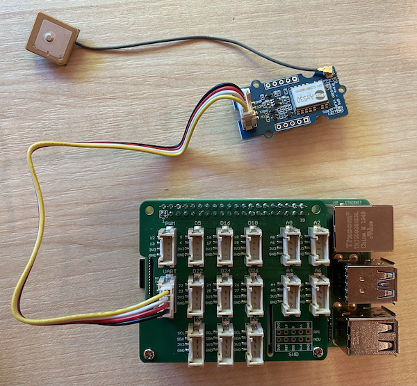

<!--
CO_OP_TRANSLATOR_METADATA:
{
  "original_hash": "3b2448c7ab4e9673e77e35a50c5e350d",
  "translation_date": "2025-08-28T13:16:49+00:00",
  "source_file": "3-transport/lessons/1-location-tracking/pi-gps-sensor.md",
  "language_code": "hr"
}
-->
# Čitanje GPS podataka - Raspberry Pi

U ovom dijelu lekcije, dodati ćete GPS senzor na svoj Raspberry Pi i očitati vrijednosti s njega.

## Hardver

Raspberry Pi treba GPS senzor.

Senzor koji ćete koristiti je [Grove GPS Air530 senzor](https://www.seeedstudio.com/Grove-GPS-Air530-p-4584.html). Ovaj senzor može se povezati s više GPS sustava za brzo i precizno određivanje lokacije. Senzor se sastoji od 2 dijela - osnovne elektronike senzora i vanjske antene povezane tankim kabelom za primanje radio valova sa satelita.

Ovo je UART senzor, što znači da šalje GPS podatke putem UART-a.

## Povezivanje GPS senzora

Grove GPS senzor može se povezati s Raspberry Pi-jem.

### Zadatak - povezivanje GPS senzora

Povežite GPS senzor.


1. Umetnite jedan kraj Grove kabela u utičnicu na GPS senzoru. Kabel će ući samo na jedan način.

1. Dok je Raspberry Pi isključen, povežite drugi kraj Grove kabela s UART utičnicom označenom **UART** na Grove Base hatu pričvršćenom na Pi. Ova utičnica nalazi se u srednjem redu, na strani najbližoj utoru za SD karticu, na suprotnoj strani od USB portova i ethernet utičnice.

    

1. Postavite GPS senzor tako da povezana antena ima vidljivost prema nebu - idealno pored otvorenog prozora ili vani. Lakše je dobiti jasniji signal bez prepreka između antene i neba.

## Programiranje GPS senzora

Raspberry Pi sada se može programirati za korištenje povezanog GPS senzora.

### Zadatak - programiranje GPS senzora

Programirajte uređaj.

1. Uključite Pi i pričekajte da se pokrene.

1. GPS senzor ima 2 LED diode - plavu LED diodu koja treperi kada se podaci prenose i zelenu LED diodu koja treperi svake sekunde kada prima podatke sa satelita. Provjerite treperi li plava LED dioda kada uključite Pi. Nakon nekoliko minuta, zelena LED dioda će početi treperiti - ako ne, možda ćete morati premjestiti antenu.

1. Pokrenite VS Code, bilo direktno na Pi-ju ili se povežite putem Remote SSH ekstenzije.

    > ⚠️ Možete se referirati na [upute za postavljanje i pokretanje VS Code-a u lekciji 1 ako je potrebno](../../../1-getting-started/lessons/1-introduction-to-iot/pi.md).

1. Kod novijih verzija Raspberry Pi-ja koje podržavaju Bluetooth, postoji konflikt između serijskog porta koji koristi Bluetooth i onog koji koristi Grove UART port. Da biste to riješili, učinite sljedeće:

    1. Iz terminala u VS Code-u, uredite datoteku `/boot/config.txt` koristeći `nano`, ugrađeni terminalski tekst editor, s naredbom:

        ```sh
        sudo nano /boot/config.txt
        ```

        > Ovu datoteku ne možete uređivati putem VS Code-a jer je potrebno koristiti `sudo` dozvole, odnosno povišene dozvole. VS Code ne radi s tim dozvolama.

    1. Koristite tipke sa strelicama za navigaciju do kraja datoteke, zatim kopirajte kod ispod i zalijepite ga na kraj datoteke:

        ```ini
        dtoverlay=pi3-miniuart-bt
        dtoverlay=pi3-disable-bt
        enable_uart=1
        ```

        Možete zalijepiti koristeći uobičajene prečace na tipkovnici za vaš uređaj (`Ctrl+v` na Windows, Linux ili Raspberry Pi OS, `Cmd+v` na macOS).

    1. Spremite ovu datoteku i izađite iz nano-a pritiskom na `Ctrl+x`. Pritisnite `y` kada vas pita želite li spremiti izmijenjeni buffer, zatim pritisnite `enter` za potvrdu da želite prebrisati `/boot/config.txt`.

        > Ako napravite grešku, možete izaći bez spremanja, zatim ponoviti ove korake.

    1. Uredite datoteku `/boot/cmdline.txt` u nano-u s naredbom:

        ```sh
        sudo nano /boot/cmdline.txt
        ```

    1. Ova datoteka ima niz parova ključ/vrijednost odvojenih razmacima. Uklonite sve parove ključ/vrijednost za ključ `console`. Oni će vjerojatno izgledati ovako:

        ```output
        console=serial0,115200 console=tty1 
        ```

        Možete navigirati do ovih unosa koristeći tipke sa strelicama, zatim ih obrisati koristeći uobičajene tipke `del` ili `backspace`.

        Na primjer, ako vaša originalna datoteka izgleda ovako:

        ```output
        console=serial0,115200 console=tty1 root=PARTUUID=058e2867-02 rootfstype=ext4 elevator=deadline fsck.repair=yes rootwait
        ```

        Nova verzija će izgledati ovako:

        ```output
        root=PARTUUID=058e2867-02 rootfstype=ext4 elevator=deadline fsck.repair=yes rootwait
        ```

    1. Slijedite gore navedene korake za spremanje ove datoteke i izlazak iz nano-a.

    1. Ponovno pokrenite svoj Pi, zatim se ponovno povežite u VS Code nakon što se Pi ponovno pokrene.

1. Iz terminala, kreirajte novu mapu u home direktoriju korisnika `pi` nazvanu `gps-sensor`. Kreirajte datoteku u ovoj mapi nazvanu `app.py`.

1. Otvorite ovu mapu u VS Code-u.

1. GPS modul šalje UART podatke preko serijskog porta. Instalirajte `pyserial` Pip paket za komunikaciju sa serijskim portom iz vašeg Python koda:

    ```sh
    pip3 install pyserial
    ```

1. Dodajte sljedeći kod u svoju datoteku `app.py`:

    ```python
    import time
    import serial
    
    serial = serial.Serial('/dev/ttyAMA0', 9600, timeout=1)
    serial.reset_input_buffer()
    serial.flush()
    
    def print_gps_data(line):
        print(line.rstrip())
    
    while True:
        line = serial.readline().decode('utf-8')
    
        while len(line) > 0:
            print_gps_data(line)
            line = serial.readline().decode('utf-8')
    
        time.sleep(1)
    ```

    Ovaj kod uvozi modul `serial` iz `pyserial` Pip paketa. Zatim se povezuje na serijski port `/dev/ttyAMA0` - ovo je adresa serijskog porta koji Grove Pi Base Hat koristi za svoj UART port. Zatim briše sve postojeće podatke s ove serijske veze.

    Zatim se definira funkcija `print_gps_data` koja ispisuje liniju proslijeđenu njoj na konzolu.

    Nakon toga, kod se beskonačno ponavlja, čitajući što više linija teksta može sa serijskog porta u svakom ciklusu. Poziva funkciju `print_gps_data` za svaku liniju.

    Nakon što su svi podaci pročitani, petlja spava 1 sekundu, zatim pokušava ponovno.

1. Pokrenite ovaj kod. Vidjet ćete sirovi izlaz s GPS senzora, nešto poput sljedećeg:

    ```output
    $GNGGA,020604.001,4738.538654,N,12208.341758,W,1,3,,164.7,M,-17.1,M,,*67
    $GPGSA,A,1,,,,,,,,,,,,,,,*1E
    $BDGSA,A,1,,,,,,,,,,,,,,,*0F
    $GPGSV,1,1,00*79
    $BDGSV,1,1,00*68
    ```

    > Ako dobijete jednu od sljedećih grešaka prilikom zaustavljanja i ponovnog pokretanja koda, dodajte `try - except` blok u svoju while petlju.

      ```output
      UnicodeDecodeError: 'utf-8' codec can't decode byte 0x93 in position 0: invalid start byte
      UnicodeDecodeError: 'utf-8' codec can't decode byte 0xf1 in position 0: invalid continuation byte
      ```

    ```python
    while True:
        try:
            line = serial.readline().decode('utf-8')
              
            while len(line) > 0:
                print_gps_data()
                line = serial.readline().decode('utf-8')
      
        # There's a random chance the first byte being read is part way through a character.
        # Read another full line and continue.

        except UnicodeDecodeError:
            line = serial.readline().decode('utf-8')

    time.sleep(1)
    ```

> 💁 Ovaj kod možete pronaći u mapi [code-gps/pi](../../../../../3-transport/lessons/1-location-tracking/code-gps/pi).

😀 Vaš program za GPS senzor je uspješno završen!

---

**Odricanje od odgovornosti**:  
Ovaj dokument je preveden pomoću AI usluge za prevođenje [Co-op Translator](https://github.com/Azure/co-op-translator). Iako nastojimo osigurati točnost, imajte na umu da automatski prijevodi mogu sadržavati pogreške ili netočnosti. Izvorni dokument na izvornom jeziku treba smatrati autoritativnim izvorom. Za ključne informacije preporučuje se profesionalni prijevod od strane čovjeka. Ne preuzimamo odgovornost za bilo kakva nesporazuma ili pogrešna tumačenja koja proizlaze iz korištenja ovog prijevoda.