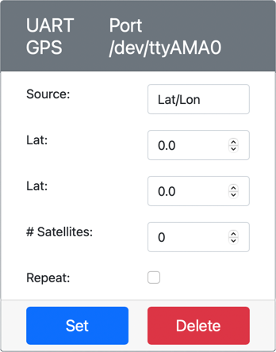

<!--
CO_OP_TRANSLATOR_METADATA:
{
  "original_hash": "64f18a8f8aaa1fef5e7320e0992d8b3a",
  "translation_date": "2025-08-28T13:20:10+00:00",
  "source_file": "3-transport/lessons/1-location-tracking/virtual-device-gps-sensor.md",
  "language_code": "hr"
}
-->
# Čitanje GPS podataka - Virtualni IoT uređaj

U ovom dijelu lekcije, dodati ćete GPS senzor svom virtualnom IoT uređaju i čitati vrijednosti s njega.

## Virtualni hardver

Virtualni IoT uređaj koristi simulirani GPS senzor koji je dostupan putem UART-a preko serijskog porta.

Fizički GPS senzor ima antenu za primanje radio valova s GPS satelita i pretvaranje GPS signala u GPS podatke. Virtualna verzija simulira ovo omogućujući vam da postavite geografsku širinu i dužinu, pošaljete sirove NMEA rečenice ili učitate GPX datoteku s više lokacija koje se mogu uzastopno vraćati.

> 🎓 NMEA rečenice će biti objašnjene kasnije u ovoj lekciji

### Dodavanje senzora u CounterFit

Za korištenje virtualnog GPS senzora, potrebno je dodati jedan u CounterFit aplikaciju.

#### Zadatak - dodavanje senzora u CounterFit

Dodajte GPS senzor u CounterFit aplikaciju.

1. Kreirajte novu Python aplikaciju na svom računalu u mapi nazvanoj `gps-sensor` s jednim datotekama nazvanim `app.py` i Python virtualnim okruženjem, te dodajte CounterFit pip pakete.

    > ⚠️ Možete se referirati na [upute za kreiranje i postavljanje CounterFit Python projekta u lekciji 1 ako je potrebno](../../../1-getting-started/lessons/1-introduction-to-iot/virtual-device.md).

1. Instalirajte dodatni Pip paket za instalaciju CounterFit shima koji može komunicirati sa senzorima temeljenim na UART-u preko serijske veze. Provjerite da instalaciju radite iz terminala s aktiviranim virtualnim okruženjem.

    ```sh
    pip install counterfit-shims-serial
    ```

1. Provjerite da je CounterFit web aplikacija pokrenuta.

1. Kreirajte GPS senzor:

    1. U okviru *Create sensor* u *Sensors* panelu, otvorite padajući izbornik *Sensor type* i odaberite *UART GPS*.

    1. Ostavite *Port* postavljen na */dev/ttyAMA0*

    1. Odaberite gumb **Add** za kreiranje GPS senzora na portu `/dev/ttyAMA0`.

    

    GPS senzor će biti kreiran i pojavit će se na popisu senzora.

    

## Programiranje GPS senzora

Virtualni IoT uređaj sada može biti programiran za korištenje virtualnog GPS senzora.

### Zadatak - programiranje GPS senzora

Programirajte aplikaciju za GPS senzor.

1. Provjerite da je aplikacija `gps-sensor` otvorena u VS Code-u.

1. Otvorite datoteku `app.py`.

1. Dodajte sljedeći kod na vrh `app.py` za povezivanje aplikacije s CounterFit-om:

    ```python
    from counterfit_connection import CounterFitConnection
    CounterFitConnection.init('127.0.0.1', 5000)
    ```

1. Dodajte sljedeći kod ispod ovog za uvoz potrebnih biblioteka, uključujući biblioteku za CounterFit serijski port:

    ```python
    import time
    import counterfit_shims_serial
    
    serial = counterfit_shims_serial.Serial('/dev/ttyAMA0')
    ```

    Ovaj kod uvozi modul `serial` iz Pip paketa `counterfit_shims_serial`. Zatim se povezuje na serijski port `/dev/ttyAMA0` - ovo je adresa serijskog porta koji virtualni GPS senzor koristi za svoj UART port.

1. Dodajte sljedeći kod ispod ovog za čitanje sa serijskog porta i ispis vrijednosti na konzolu:

    ```python
    def print_gps_data(line):
        print(line.rstrip())
    
    while True:
        line = serial.readline().decode('utf-8')
    
        while len(line) > 0:
            print_gps_data(line)
            line = serial.readline().decode('utf-8')
    
        time.sleep(1)
    ```

    Definirana je funkcija `print_gps_data` koja ispisuje liniju proslijeđenu njoj na konzolu.

    Zatim kod ulazi u beskonačnu petlju, čitajući što više linija teksta može sa serijskog porta u svakom ciklusu. Poziva funkciju `print_gps_data` za svaku liniju.

    Nakon što su svi podaci pročitani, petlja spava 1 sekundu, zatim pokušava ponovno.

1. Pokrenite ovaj kod, osiguravajući da koristite drugi terminal od onog na kojem CounterFit aplikacija radi, kako bi CounterFit aplikacija ostala pokrenuta.

1. Iz CounterFit aplikacije, promijenite vrijednost GPS senzora. To možete učiniti na jedan od sljedećih načina:

    * Postavite **Source** na `Lat/Lon`, i postavite eksplicitnu geografsku širinu, dužinu i broj satelita korištenih za GPS fiks. Ova vrijednost će biti poslana samo jednom, pa označite **Repeat** okvir kako bi se podaci ponavljali svake sekunde.

      

    * Postavite **Source** na `NMEA` i dodajte neke NMEA rečenice u tekstualni okvir. Sve ove vrijednosti će biti poslane, s odgodom od 1 sekunde prije svake nove GGA (pozicijski fiks) rečenice koja se može pročitati.

      

      Možete koristiti alat poput [nmeagen.org](https://www.nmeagen.org) za generiranje ovih rečenica crtanjem na karti. Ove vrijednosti će biti poslane samo jednom, pa označite **Repeat** okvir kako bi se podaci ponavljali jednu sekundu nakon što su svi poslani.

    * Postavite **Source** na GPX datoteku i učitajte GPX datoteku s lokacijama staza. GPX datoteke možete preuzeti s brojnih popularnih stranica za kartografiju i planinarenje, poput [AllTrails](https://www.alltrails.com/). Ove datoteke sadrže više GPS lokacija kao stazu, a GPS senzor će vraćati svaku novu lokaciju u intervalima od 1 sekunde.

      

      Ove vrijednosti će biti poslane samo jednom, pa označite **Repeat** okvir kako bi se podaci ponavljali jednu sekundu nakon što su svi poslani.

    Nakon što ste konfigurirali GPS postavke, odaberite gumb **Set** za potvrdu ovih vrijednosti senzoru.

1. Vidjet ćete sirovi izlaz GPS senzora, nešto poput sljedećeg:

    ```output
    $GNGGA,020604.001,4738.538654,N,12208.341758,W,1,3,,164.7,M,-17.1,M,,*67
    $GNGGA,020604.001,4738.538654,N,12208.341758,W,1,3,,164.7,M,-17.1,M,,*67
    ```

> 💁 Ovaj kod možete pronaći u mapi [code-gps/virtual-device](../../../../../3-transport/lessons/1-location-tracking/code-gps/virtual-device).

😀 Vaš program za GPS senzor je uspješno završen!

---

**Odricanje od odgovornosti**:  
Ovaj dokument je preveden pomoću AI usluge za prevođenje [Co-op Translator](https://github.com/Azure/co-op-translator). Iako nastojimo osigurati točnost, imajte na umu da automatski prijevodi mogu sadržavati pogreške ili netočnosti. Izvorni dokument na izvornom jeziku treba smatrati autoritativnim izvorom. Za ključne informacije preporučuje se profesionalni prijevod od strane čovjeka. Ne preuzimamo odgovornost za bilo kakva nesporazuma ili pogrešna tumačenja koja proizlaze iz korištenja ovog prijevoda.