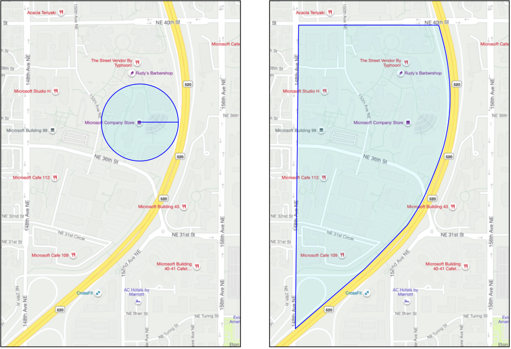

<!--
CO_OP_TRANSLATOR_METADATA:
{
  "original_hash": "078ae664c7b686bf069545e9a5fc95b2",
  "translation_date": "2025-08-28T13:22:57+00:00",
  "source_file": "3-transport/lessons/4-geofences/README.md",
  "language_code": "hr"
}
-->
# Geoograde


> Sketchnote od [Nitya Narasimhan](https://github.com/nitya). Kliknite na sliku za veću verziju.

Ovaj video daje pregled geooograda i kako ih koristiti u Azure Maps, teme koje će biti obrađene u ovoj lekciji:

[](https://www.youtube.com/watch?v=nsrgYhaYNVY)

> 🎥 Kliknite na sliku iznad za gledanje videa

## Kviz prije predavanja

[Kviz prije predavanja](https://black-meadow-040d15503.1.azurestaticapps.net/quiz/27)

## Uvod

U posljednje tri lekcije koristili ste IoT za lociranje kamiona koji prevoze vaše proizvode s farme do centra za obradu. Prikupljali ste GPS podatke, slali ih u oblak za pohranu i vizualizirali ih na karti. Sljedeći korak u povećanju učinkovitosti vašeg lanca opskrbe je dobivanje obavijesti kada se kamion približava centru za obradu, kako bi ekipa za istovar bila spremna s viljuškarima i drugom opremom čim vozilo stigne. Na taj način istovar može biti brz, a vi ne plaćate kamion i vozača za čekanje.

U ovoj lekciji naučit ćete o geooogradama - definiranim geospacijalnim regijama, poput područja unutar 2 km vožnje od centra za obradu, i kako testirati jesu li GPS koordinate unutar ili izvan geooograde, kako biste mogli vidjeti je li vaš GPS senzor stigao ili napustio područje.

U ovoj lekciji obradit ćemo:

* [Što su geoograde](../../../../../3-transport/lessons/4-geofences)
* [Definiranje geooograde](../../../../../3-transport/lessons/4-geofences)
* [Testiranje točaka u odnosu na geooogradu](../../../../../3-transport/lessons/4-geofences)
* [Korištenje geooograda iz serverless koda](../../../../../3-transport/lessons/4-geofences)

> 🗑 Ovo je posljednja lekcija u ovom projektu, pa nakon završetka lekcije i zadatka, ne zaboravite očistiti svoje cloud usluge. Trebat će vam usluge za dovršetak zadatka, pa se pobrinite da prvo dovršite zadatak.
>
> Ako je potrebno, pogledajte [vodič za čišćenje projekta](../../../clean-up.md) za upute kako to učiniti.

## Što su geoograde

Geooograda je virtualni perimetar za stvarnu geografsku regiju. Geooograde mogu biti krugovi definirani kao točka i radijus (na primjer, krug širine 100m oko zgrade) ili poligon koji pokriva područje poput školske zone, granica grada, sveučilišnog ili uredskog kampusa.



> 💁 Možda ste već koristili geooograde, a da to niste znali. Ako ste postavili podsjetnik pomoću aplikacije iOS Reminders ili Google Keep na temelju lokacije, koristili ste geooogradu. Te aplikacije postavljaju geooogradu na temelju zadane lokacije i obavještavaju vas kada vaš telefon uđe u geooogradu.

Postoji mnogo razloga zašto biste željeli znati je li vozilo unutar ili izvan geooograde:

* Priprema za istovar - dobivanje obavijesti da je vozilo stiglo na lokaciju omogućuje ekipi da se pripremi za istovar vozila, smanjujući vrijeme čekanja vozila. To može omogućiti vozaču da obavi više dostava u danu s manje vremena čekanja.
* Porezna usklađenost - neke zemlje, poput Novog Zelanda, naplaćuju poreze na ceste za dizelska vozila na temelju težine vozila kada voze samo javnim cestama. Korištenje geooograda omogućuje praćenje kilometraže na javnim cestama u odnosu na privatne ceste na lokacijama poput farmi ili područja za sječu drva.
* Praćenje krađe - ako vozilo treba ostati samo u određenom području, poput farme, a napusti geooogradu, možda je ukradeno.
* Usklađenost lokacije - neki dijelovi radnog mjesta, farme ili tvornice mogu biti zabranjeni za određena vozila, poput držanja vozila koja prevoze umjetna gnojiva i pesticide dalje od polja na kojima se uzgajaju organski proizvodi. Ako se uđe u geooogradu, vozilo je izvan usklađenosti i vozač može biti obaviješten.

✅ Možete li smisliti druge primjene geooograda?

Azure Maps, usluga koju ste koristili u prethodnoj lekciji za vizualizaciju GPS podataka, omogućuje vam definiranje geooograda, a zatim testiranje je li točka unutar ili izvan geooograde.

## Definiranje geooograde

Geooograde se definiraju pomoću GeoJSON-a, isto kao i točke koje su dodane na kartu u prethodnoj lekciji. U ovom slučaju, umjesto da budu `FeatureCollection` vrijednosti `Point`, to je `FeatureCollection` koji sadrži `Polygon`.

```json
{
   "type": "FeatureCollection",
   "features": [
     {
       "type": "Feature",
       "geometry": {
         "type": "Polygon",
         "coordinates": [
           [
             [
               -122.13393688201903,
               47.63829579223815
             ],
             [
               -122.13389128446579,
               47.63782047131512
             ],
             [
               -122.13240802288054,
               47.63783312249837
             ],
             [
               -122.13238388299942,
               47.63829037035086
             ],
             [
               -122.13393688201903,
               47.63829579223815
             ]
           ]
         ]
       },
       "properties": {
         "geometryId": "1"
       }
     }
   ]
}
```

Svaka točka na poligonu definirana je kao par dužine i širine u nizu, a te točke su u nizu koji je postavljen kao `coordinates`. U `Point` u prethodnoj lekciji, `coordinates` je bio niz koji sadrži 2 vrijednosti, širinu i dužinu, za `Polygon` to je niz nizova koji sadrže 2 vrijednosti, dužinu i širinu.

> 💁 Zapamtite, GeoJSON koristi `dužinu, širinu` za točke, a ne `širinu, dužinu`

Niz koordinata poligona uvijek ima 1 unos više od broja točaka na poligonu, pri čemu je posljednji unos isti kao i prvi, zatvarajući poligon. Na primjer, za pravokutnik bi bilo 5 točaka.


Na slici iznad nalazi se pravokutnik. Koordinate poligona počinju u gornjem lijevom kutu na 47,-122, zatim se pomiču desno na 47,-121, zatim dolje na 46,-121, zatim desno na 46,-122, zatim natrag gore na početnu točku na 47,-122. To daje poligonu 5 točaka - gornji lijevi, gornji desni, donji desni, donji lijevi, zatim gornji lijevi za zatvaranje.

✅ Pokušajte stvoriti GeoJSON poligon oko svog doma ili škole. Koristite alat poput [GeoJSON.io](https://geojson.io/).

### Zadatak - definiranje geooograde

Kako biste koristili geooogradu u Azure Maps, prvo je morate učitati na svoj Azure Maps račun. Nakon učitavanja, dobit ćete jedinstveni ID koji možete koristiti za testiranje točke u odnosu na geooogradu. Za učitavanje geooograda u Azure Maps, morate koristiti web API za karte. Možete pozvati Azure Maps web API pomoću alata zvanog [curl](https://curl.se).

> 🎓 Curl je alat naredbenog retka za slanje zahtjeva web endpointima

1. Ako koristite Linux, macOS ili noviju verziju Windows 10, vjerojatno već imate curl instaliran. Pokrenite sljedeće iz svog terminala ili naredbenog retka za provjeru:

    ```sh
    curl --version
    ```

    Ako ne vidite informacije o verziji za curl, morat ćete ga instalirati s [stranice za preuzimanje curl](https://curl.se/download.html).

    > 💁 Ako ste iskusni s Postmanom, možete ga koristiti umjesto toga ako želite.

1. Stvorite GeoJSON datoteku koja sadrži poligon. Testirat ćete ovo pomoću svog GPS senzora, pa stvorite poligon oko svoje trenutne lokacije. Možete ga ručno stvoriti uređivanjem GeoJSON primjera danog iznad ili koristiti alat poput [GeoJSON.io](https://geojson.io/).

    GeoJSON mora sadržavati `FeatureCollection`, koji sadrži `Feature` s `geometry` tipa `Polygon`.

    Također **MORATE** dodati element `properties` na istoj razini kao i element `geometry`, a ovaj mora sadržavati `geometryId`:

    ```json
    "properties": {
        "geometryId": "1"
    }
    ```

    Ako koristite [GeoJSON.io](https://geojson.io/), tada ćete ručno morati dodati ovaj element u prazni `properties` element, bilo nakon preuzimanja JSON datoteke ili u JSON uređivaču u aplikaciji.

    Ovaj `geometryId` mora biti jedinstven u ovoj datoteci. Možete učitati više geooograda kao više `Features` u `FeatureCollection` u istoj GeoJSON datoteci, sve dok svaka ima različiti `geometryId`. Poligoni mogu imati isti `geometryId` ako su učitani iz različite datoteke u različito vrijeme.

1. Spremite ovu datoteku kao `geofence.json` i navigirajte do mjesta gdje je spremljena u svom terminalu ili konzoli.

1. Pokrenite sljedeću curl naredbu za stvaranje GeoFence:

    ```sh
    curl --request POST 'https://atlas.microsoft.com/mapData/upload?api-version=1.0&dataFormat=geojson&subscription-key=<subscription_key>' \
         --header 'Content-Type: application/json' \
         --include \
         --data @geofence.json
    ```

    Zamijenite `<subscription_key>` u URL-u s API ključem za vaš Azure Maps račun.

    URL se koristi za učitavanje podataka o karti putem API-ja `https://atlas.microsoft.com/mapData/upload`. Poziv uključuje parametar `api-version` za određivanje koje Azure Maps API koristiti, kako bi se omogućilo da se API mijenja tijekom vremena, ali zadrži kompatibilnost unatrag. Format podataka koji se učitava postavljen je na `geojson`.

    Ovo će pokrenuti POST zahtjev prema API-ju za učitavanje i vratiti popis zaglavlja odgovora koji uključuje zaglavlje nazvano `location`.

    ```output
    content-type: application/json
    location: https://us.atlas.microsoft.com/mapData/operations/1560ced6-3a80-46f2-84b2-5b1531820eab?api-version=1.0
    x-ms-azuremaps-region: West US 2
    x-content-type-options: nosniff
    strict-transport-security: max-age=31536000; includeSubDomains
    x-cache: CONFIG_NOCACHE
    date: Sat, 22 May 2021 21:34:57 GMT
    content-length: 0
    ```

    > 🎓 Kada pozivate web endpoint, možete proslijediti parametre pozivu dodavanjem `?` nakon čega slijede parovi ključeva i vrijednosti kao `key=value`, odvajajući parove ključeva i vrijednosti s `&`.

1. Azure Maps ne obrađuje ovo odmah, pa ćete morati provjeriti je li zahtjev za učitavanje dovršen pomoću URL-a danog u zaglavlju `location`. Napravite GET zahtjev na ovu lokaciju kako biste vidjeli status. Morat ćete dodati svoj ključ pretplate na kraj URL-a `location` dodavanjem `&subscription-key=<subscription_key>` na kraj, zamjenjujući `<subscription_key>` s API ključem za vaš Azure Maps račun. Pokrenite sljedeću naredbu:

    ```sh
    curl --request GET '<location>&subscription-key=<subscription_key>'
    ```

    Zamijenite `<location>` s vrijednošću zaglavlja `location` i `<subscription_key>` s API ključem za vaš Azure Maps račun.

1. Provjerite vrijednost `status` u odgovoru. Ako nije `Succeeded`, pričekajte minutu i pokušajte ponovno.

1. Kada status vrati `Succeeded`, pogledajte `resourceLocation` iz odgovora. Ovo sadrži detalje o jedinstvenom ID-u (poznatom kao UDID) za GeoJSON objekt. UDID je vrijednost nakon `metadata/`, a ne uključujući `api-version`. Na primjer, ako je `resourceLocation` bio:

    ```json
    {
      "resourceLocation": "https://us.atlas.microsoft.com/mapData/metadata/7c3776eb-da87-4c52-ae83-caadf980323a?api-version=1.0"
    }
    ```

    Tada bi UDID bio `7c3776eb-da87-4c52-ae83-caadf980323a`.

    Zadržite kopiju ovog UDID-a jer će vam trebati za testiranje geooograde.

## Testiranje točaka u odnosu na geooogradu

Nakon što je poligon učitan u Azure Maps, možete testirati točku kako biste vidjeli je li unutar ili izvan geooograde. To radite slanjem zahtjeva web API-ju, prosljeđujući UDID geooograde i širinu i dužinu točke za testiranje.

Kada napravite ovaj zahtjev, možete također proslijediti vrijednost zvanu `searchBuffer`. Ovo govori Maps API-ju koliko točno treba biti pri vraćanju rezultata. Razlog za to je što GPS nije savršeno točan, a ponekad lokacije mogu biti pogrešne za nekoliko metara ili više. Zadano za search buffer je 50m, ali možete postaviti vrijednosti od 0m do 500m.

Kada se rezultati vrate iz API poziva, jedan od dijelova rezultata je `distance` izmjeren do najbliže točke na rubu geooograde, s pozitivnom vrijednošću ako je točka izvan geooograde, negativnom ako je unutar geooograde. Ako je ova udaljenost manja od search buffer-a, stvarna udaljenost se vraća u metrima, inače je vrijednost 999 ili -999. 999 znači da je točka izvan geooograde za više od search buffer-a, -999 znači da je unutar geooograde za više od search buffer-a.


Na slici iznad, geooograda ima 50m search buffer.

* Točka u središtu geooograde, dobro unutar search buffer-a ima udaljenost **-999**
* Točka dobro izvan search buffer-a ima udaljenost **999**
* Točka unutar geooograde i unutar search buffer-a, 6m od geooograde, ima udaljenost **6m**
* Točka izvan geooograde i unutar search buffer-a, 39m od geooograde, ima udaljenost **39m**

Važno je znati udaljenost do ruba geooograde i kombinirati je s drugim informacijama poput drugih GPS očitanja, brzine i podataka o cestama pri donošenju odluka na temelju lokacije vozila.

Na primjer, zamislite GPS očitanja koja pokazuju da je vozilo vozilo cestom koja završava uz geooogradu. Ako jedno GPS očitanje nije točno i postavi vozilo unutar geooograde, unatoč tome što nema pristupa vozilima, tada se može zanemariti.


Na gornjoj slici prikazan je geofence preko dijela Microsoft kampusa. Crvena linija prikazuje kamion koji vozi duž autoceste 520, s krugovima koji označavaju GPS očitanja. Većina tih očitanja je točna i nalazi se duž autoceste 520, dok jedno netočno očitanje pokazuje lokaciju unutar geofencea. Nema načina da to očitanje bude ispravno - nema cesta koje bi omogućile kamionu da iznenada skrene s autoceste 520 na kampus, a zatim se vrati na autocestu 520. Kod koji provjerava ovaj geofence morat će uzeti u obzir prethodna očitanja prije nego što djeluje na rezultate testa geofencea.

✅ Koje dodatne podatke biste trebali provjeriti kako biste utvrdili može li se GPS očitanje smatrati točnim?

### Zadatak - testiranje točaka u odnosu na geofence

1. Započnite izradom URL-a za upit web API-ja. Format je:

    ```output
    https://atlas.microsoft.com/spatial/geofence/json?api-version=1.0&deviceId=gps-sensor&subscription-key=<subscription-key>&udid=<UDID>&lat=<lat>&lon=<lon>
    ```

    Zamijenite `<subscription_key>` API ključem za vaš Azure Maps račun.

    Zamijenite `<UDID>` UDID-om geofencea iz prethodnog zadatka.

    Zamijenite `<lat>` i `<lon>` geografskom širinom i dužinom koje želite testirati.

    Ovaj URL koristi API `https://atlas.microsoft.com/spatial/geofence/json` za upit geofencea definiranog pomoću GeoJSON-a. Cilja verziju API-ja `1.0`. Parametar `deviceId` je obavezan i trebao bi biti naziv uređaja s kojeg dolaze geografska širina i dužina.

    Zadani pretraživački buffer je 50m, a možete ga promijeniti dodavanjem dodatnog parametra `searchBuffer=<distance>`, postavljajući `<distance>` na udaljenost pretraživačkog buffer-a u metrima, od 0 do 500.

1. Koristite curl za slanje GET zahtjeva na ovaj URL:

    ```sh
    curl --request GET '<URL>'
    ```

    > 💁 Ako dobijete odgovor s kodom `BadRequest`, s greškom:
    >
    > ```output
    > Invalid GeoJSON: All feature properties should contain a geometryId, which is used for identifying the geofence.
    > ```
    >
    > tada vaš GeoJSON nedostaje sekcija `properties` s `geometryId`. Morat ćete ispraviti svoj GeoJSON, a zatim ponoviti gore navedene korake za ponovno učitavanje i dobivanje novog UDID-a.

1. Odgovor će sadržavati popis `geometries`, po jedan za svaki poligon definiran u GeoJSON-u korištenom za izradu geofencea. Svaka geometrija ima 3 polja od interesa: `distance`, `nearestLat` i `nearestLon`.

    ```output
    {
        "geometries": [
            {
                "deviceId": "gps-sensor",
                "udId": "7c3776eb-da87-4c52-ae83-caadf980323a",
                "geometryId": "1",
                "distance": 999.0,
                "nearestLat": 47.645875,
                "nearestLon": -122.142713
            }
        ],
        "expiredGeofenceGeometryId": [],
        "invalidPeriodGeofenceGeometryId": []
    }
    ```

    * `nearestLat` i `nearestLon` su geografska širina i dužina točke na rubu geofencea koja je najbliža lokaciji koja se testira.

    * `distance` je udaljenost od lokacije koja se testira do najbliže točke na rubu geofencea. Negativni brojevi znače unutar geofencea, pozitivni izvan. Ova vrijednost bit će manja od 50 (zadani pretraživački buffer) ili 999.

1. Ponovite ovo više puta s lokacijama unutar i izvan geofencea.

## Korištenje geofencea iz serverless koda

Sada možete dodati novi okidač svojoj Functions aplikaciji za testiranje GPS podataka IoT Hub-a u odnosu na geofence.

### Potrošačke grupe

Kao što se sjećate iz prethodnih lekcija, IoT Hub omogućuje ponovno reproduciranje događaja koji su primljeni od huba, ali nisu obrađeni. No, što bi se dogodilo ako se poveže više okidača? Kako će znati koji je obradio koje događaje?

Odgovor je da ne može! Umjesto toga, možete definirati više odvojenih veza za čitanje događaja, a svaka od njih može upravljati reprodukcijom nepročitanih poruka. To se zove *potrošačke grupe*. Kada se povežete s krajnjom točkom, možete odrediti koju potrošačku grupu želite koristiti. Svaka komponenta vaše aplikacije povezat će se s različitom potrošačkom grupom.


Teoretski, do 5 aplikacija može se povezati s svakom potrošačkom grupom, i sve će primati poruke kada stignu. Najbolja praksa je imati samo jednu aplikaciju koja pristupa svakoj potrošačkoj grupi kako bi se izbjeglo dupliciranje obrade poruka i osiguralo da se prilikom ponovnog pokretanja sve poruke u redu obrađuju ispravno. Na primjer, ako pokrenete svoju Functions aplikaciju lokalno, kao i u oblaku, obje bi obrađivale poruke, što bi dovelo do dupliciranja blobova pohranjenih u storage računu.

Ako pregledate datoteku `function.json` za IoT Hub okidač koji ste kreirali u ranijoj lekciji, vidjet ćete potrošačku grupu u sekciji za povezivanje okidača event huba:

```json
"consumerGroup": "$Default"
```

Kada kreirate IoT Hub, automatski se kreira `$Default` potrošačka grupa. Ako želite dodati dodatni okidač, možete ga dodati koristeći novu potrošačku grupu.

> 💁 U ovoj lekciji koristit ćete drugačiju funkciju za testiranje geofencea od one koja se koristi za pohranu GPS podataka. Ovo je kako biste pokazali kako koristiti potrošačke grupe i odvojiti kod radi lakšeg čitanja i razumijevanja. U produkcijskoj aplikaciji postoji mnogo načina na koje biste mogli arhitektirati ovo - stavljanjem oba na jednu funkciju, korištenjem okidača na storage računu za pokretanje funkcije za provjeru geofencea ili korištenjem više funkcija. Ne postoji 'ispravan način', sve ovisi o ostatku vaše aplikacije i vašim potrebama.

### Zadatak - kreiranje nove potrošačke grupe

1. Pokrenite sljedeću naredbu za kreiranje nove potrošačke grupe nazvane `geofence` za vaš IoT Hub:

    ```sh
    az iot hub consumer-group create --name geofence \
                                     --hub-name <hub_name>
    ```

    Zamijenite `<hub_name>` nazivom koji ste koristili za svoj IoT Hub.

1. Ako želite vidjeti sve potrošačke grupe za IoT Hub, pokrenite sljedeću naredbu:

    ```sh
    az iot hub consumer-group list --output table \
                                   --hub-name <hub_name>
    ```

    Zamijenite `<hub_name>` nazivom koji ste koristili za svoj IoT Hub. Ovo će prikazati sve potrošačke grupe.

    ```output
    Name      ResourceGroup
    --------  ---------------
    $Default  gps-sensor
    geofence  gps-sensor
    ```

> 💁 Kada ste ranije pokrenuli monitor događaja IoT Hub-a, povezao se s `$Default` potrošačkom grupom. Zbog toga ne možete pokrenuti monitor događaja i okidač događaja istovremeno. Ako želite pokrenuti oba, tada možete koristiti druge potrošačke grupe za sve svoje Functions aplikacije, a `$Default` zadržati za monitor događaja.

### Zadatak - kreiranje novog IoT Hub okidača

1. Dodajte novi IoT Hub okidač događaja svojoj `gps-trigger` Functions aplikaciji koju ste kreirali u ranijoj lekciji. Nazovite ovu funkciju `geofence-trigger`.

    > ⚠️ Možete se referirati na [upute za kreiranje IoT Hub okidača događaja iz projekta 2, lekcija 5 ako je potrebno](../../../2-farm/lessons/5-migrate-application-to-the-cloud/README.md#create-an-iot-hub-event-trigger).

1. Konfigurirajte IoT Hub string za povezivanje u datoteci `function.json`. Datoteka `local.settings.json` dijeli se između svih okidača u Functions aplikaciji.

1. Ažurirajte vrijednost `consumerGroup` u datoteci `function.json` kako biste referencirali novu potrošačku grupu `geofence`:

    ```json
    "consumerGroup": "geofence"
    ```

1. Trebat ćete koristiti ključ pretplate za svoj Azure Maps račun u ovom okidaču, pa dodajte novi unos u datoteku `local.settings.json` nazvan `MAPS_KEY`.

1. Pokrenite Functions aplikaciju kako biste osigurali da se povezuje i obrađuje poruke. `iot-hub-trigger` iz ranije lekcije također će se pokrenuti i učitati blobove u storage.

    > Kako biste izbjegli dupliciranje GPS očitanja u blob storageu, možete zaustaviti Functions aplikaciju koju imate pokrenutu u oblaku. Za to koristite sljedeću naredbu:
    >
    > ```sh
    > az functionapp stop --resource-group gps-sensor \
    >                     --name <functions_app_name>
    > ```
    >
    > Zamijenite `<functions_app_name>` nazivom koji ste koristili za svoju Functions aplikaciju.
    >
    > Možete je kasnije ponovno pokrenuti sljedećom naredbom:
    >
    > ```sh
    > az functionapp start --resource-group gps-sensor \
    >                     --name <functions_app_name>
    > ```
    >
    > Zamijenite `<functions_app_name>` nazivom koji ste koristili za svoju Functions aplikaciju.

### Zadatak - testiranje geofencea iz okidača

Ranije u ovoj lekciji koristili ste curl za upit geofencea kako biste vidjeli nalazi li se točka unutar ili izvan njega. Sličan web zahtjev možete napraviti iz svog okidača.

1. Za upit geofencea, potreban vam je njegov UDID. Dodajte novi unos u datoteku `local.settings.json` nazvan `GEOFENCE_UDID` s ovom vrijednošću.

1. Otvorite datoteku `__init__.py` iz novog okidača `geofence-trigger`.

1. Dodajte sljedeći import na vrh datoteke:

    ```python
    import json
    import os
    import requests
    ```

    Paket `requests` omogućuje vam slanje web API poziva. Azure Maps nema Python SDK, pa morate koristiti web API pozive za korištenje iz Python koda.

1. Dodajte sljedeće 2 linije na početak metode `main` kako biste dobili ključ pretplate za Maps:

    ```python
    maps_key = os.environ['MAPS_KEY']
    geofence_udid = os.environ['GEOFENCE_UDID']    
    ```

1. Unutar petlje `for event in events`, dodajte sljedeće kako biste dobili geografsku širinu i dužinu iz svakog događaja:

    ```python
    event_body = json.loads(event.get_body().decode('utf-8'))
    lat = event_body['gps']['lat']
    lon = event_body['gps']['lon']
    ```

    Ovaj kod pretvara JSON iz tijela događaja u rječnik, a zatim izdvaja `lat` i `lon` iz polja `gps`.

1. Kada koristite `requests`, umjesto da gradite dugačak URL kao što ste to radili s curl-om, možete koristiti samo dio URL-a i proslijediti parametre kao rječnik. Dodajte sljedeći kod za definiranje URL-a za poziv i konfiguriranje parametara:

    ```python
    url = 'https://atlas.microsoft.com/spatial/geofence/json'

    params = {
        'api-version': 1.0,
        'deviceId': 'gps-sensor',
        'subscription-key': maps_key,
        'udid' : geofence_udid,
        'lat' : lat,
        'lon' : lon
    }
    ```

    Stavke u rječniku `params` odgovarat će parovima ključeva i vrijednosti koje ste koristili prilikom pozivanja web API-ja putem curl-a.

1. Dodajte sljedeće linije koda za pozivanje web API-ja:

    ```python
    response = requests.get(url, params=params)
    response_body = json.loads(response.text)
    ```

    Ovo poziva URL s parametrima i vraća objekt odgovora.

1. Dodajte sljedeći kod ispod ovoga:

    ```python
    distance = response_body['geometries'][0]['distance']

    if distance == 999:
        logging.info('Point is outside geofence')
    elif distance > 0:
        logging.info(f'Point is just outside geofence by a distance of {distance}m')
    elif distance == -999:
        logging.info(f'Point is inside geofence')
    else:
        logging.info(f'Point is just inside geofence by a distance of {distance}m')
    ```

    Ovaj kod pretpostavlja jednu geometriju i izdvaja udaljenost iz te jedne geometrije. Zatim bilježi različite poruke na temelju udaljenosti.

1. Pokrenite ovaj kod. Vidjet ćete u izlazu logova je li GPS koordinata unutar ili izvan geofencea, s udaljenosti ako je točka unutar 50m. Isprobajte ovaj kod s različitim geofenceima na temelju lokacije vašeg GPS senzora, pokušajte pomaknuti senzor (na primjer, povezan s WiFi-jem s mobilnog telefona ili s različitim koordinatama na virtualnom IoT uređaju) kako biste vidjeli ovu promjenu.

1. Kada budete spremni, implementirajte ovaj kod u svoju Functions aplikaciju u oblaku. Ne zaboravite implementirati nove postavke aplikacije.

    > ⚠️ Možete se referirati na [upute za učitavanje postavki aplikacije iz projekta 2, lekcija 5 ako je potrebno](../../../2-farm/lessons/5-migrate-application-to-the-cloud/README.md#task---upload-your-application-settings).

    > ⚠️ Možete se referirati na [upute za implementaciju vaše Functions aplikacije iz projekta 2, lekcija 5 ako je potrebno](../../../2-farm/lessons/5-migrate-application-to-the-cloud/README.md#task---deploy-your-functions-app-to-the-cloud).

> 💁 Ovaj kod možete pronaći u mapi [code/functions](../../../../../3-transport/lessons/4-geofences/code/functions).

---

## 🚀 Izazov

U ovoj lekciji dodali ste jedan geofence koristeći GeoJSON datoteku s jednim poligonom. Možete učitati više poligona odjednom, sve dok imaju različite vrijednosti `geometryId` u sekciji `properties`.

Pokušajte učitati GeoJSON datoteku s više poligona i prilagodite svoj kod kako biste pronašli koji je poligon GPS koordinatama najbliži ili u kojem se nalaze.

## Kviz nakon predavanja

[Kviz nakon predavanja](https://black-meadow-040d15503.1.azurestaticapps.net/quiz/28)

## Pregled i samostalno učenje

* Pročitajte više o geofenceima i nekim njihovim slučajevima upotrebe na [stranici o geofencingu na Wikipediji](https://en.wikipedia.org/wiki/Geo-fence).
* Pročitajte više o Azure Maps geofencing API-ju na [Microsoft Azure Maps Spatial - Get Geofence dokumentaciji](https://docs.microsoft.com/rest/api/maps/spatial/getgeofence?WT.mc_id=academic-17441-jabenn).
* Pročitajte više o potrošačkim grupama u [Značajke i terminologija u Azure Event Hubs - dokumentacija o potrošačima događaja na Microsoft docs](https://docs.microsoft.com/azure/event-hubs/event-hubs-features?WT.mc_id=academic-17441-jabenn#event-consumers).

## Zadatak

[Slanje obavijesti pomoću Twilio](assignment.md)

---

**Odricanje od odgovornosti**:  
Ovaj dokument je preveden pomoću AI usluge za prevođenje [Co-op Translator](https://github.com/Azure/co-op-translator). Iako nastojimo osigurati točnost, imajte na umu da automatski prijevodi mogu sadržavati pogreške ili netočnosti. Izvorni dokument na izvornom jeziku treba smatrati autoritativnim izvorom. Za ključne informacije preporučuje se profesionalni prijevod od strane ljudskog prevoditelja. Ne preuzimamo odgovornost za nesporazume ili pogrešne interpretacije koje mogu proizaći iz korištenja ovog prijevoda.