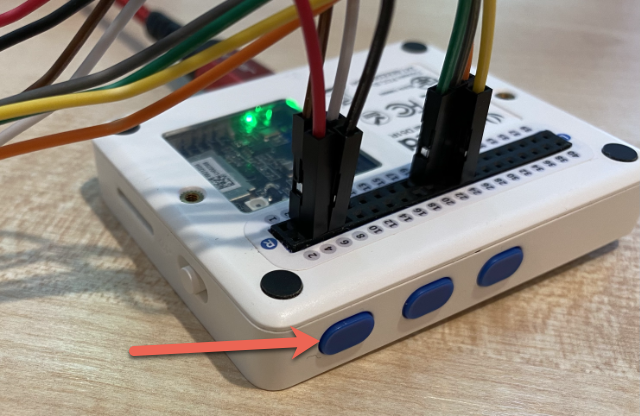

<!--
CO_OP_TRANSLATOR_METADATA:
{
  "original_hash": "160be8c0f558687f6686dca64f10f739",
  "translation_date": "2025-08-28T12:29:25+00:00",
  "source_file": "4-manufacturing/lessons/2-check-fruit-from-device/wio-terminal-camera.md",
  "language_code": "hr"
}
-->
# Snimanje slike - Wio Terminal

U ovom dijelu lekcije dodati ćete kameru na svoj Wio Terminal i snimiti slike pomoću nje.

## Hardver

Wio Terminal treba kameru.

Kamera koju ćete koristiti je [ArduCam Mini 2MP Plus](https://www.arducam.com/product/arducam-2mp-spi-camera-b0067-arduino/). Ovo je kamera od 2 megapiksela bazirana na OV2640 senzoru slike. Komunicira putem SPI sučelja za snimanje slika i koristi I2C za konfiguraciju senzora.

## Povezivanje kamere

ArduCam nema Grove priključak, već se povezuje na SPI i I2C sabirnice putem GPIO pinova na Wio Terminalu.

### Zadatak - povezivanje kamere

Povežite kameru.


1. Pinovi na bazi ArduCam-a trebaju biti povezani na GPIO pinove na Wio Terminalu. Kako biste lakše pronašli odgovarajuće pinove, zalijepite naljepnicu s GPIO pinovima koja dolazi uz Wio Terminal oko pinova:

    

1. Koristeći žice za povezivanje, napravite sljedeće veze:

    | Pin ArduCAM-a | Pin Wio Terminala | Opis                                    |
    | ------------- | ----------------- | --------------------------------------- |
    | CS            | 24 (SPI_CS)       | SPI odabir čipa                         |
    | MOSI          | 19 (SPI_MOSI)     | SPI izlaz kontrolera, ulaz periferije   |
    | MISO          | 21 (SPI_MISO)     | SPI ulaz kontrolera, izlaz periferije   |
    | SCK           | 23 (SPI_SCLK)     | SPI serijski sat                        |
    | GND           | 6 (GND)           | Zemlja - 0V                             |
    | VCC           | 4 (5V)            | Napajanje od 5V                         |
    | SDA           | 3 (I2C1_SDA)      | I2C serijski podaci                     |
    | SCL           | 5 (I2C1_SCL)      | I2C serijski sat                        |

    

    GND i VCC veze osiguravaju napajanje od 5V za ArduCam. Kamera radi na 5V, za razliku od Grove senzora koji rade na 3V. Ovo napajanje dolazi direktno iz USB-C priključka koji napaja uređaj.

    > 💁 Za SPI vezu oznake pinova na ArduCam-u i nazivi pinova na Wio Terminalu koji se koriste u kodu još uvijek koriste staru konvenciju imenovanja. Upute u ovoj lekciji koristit će novu konvenciju imenovanja, osim kada se nazivi pinova koriste u kodu.

1. Sada možete povezati Wio Terminal s računalom.

## Programiranje uređaja za povezivanje s kamerom

Wio Terminal sada može biti programiran za korištenje priključene ArduCAM kamere.

### Zadatak - programiranje uređaja za povezivanje s kamerom

1. Kreirajte potpuno novi projekt za Wio Terminal koristeći PlatformIO. Nazovite projekt `fruit-quality-detector`. Dodajte kod u funkciju `setup` za konfiguraciju serijskog porta.

1. Dodajte kod za povezivanje na WiFi, koristeći vaše WiFi vjerodajnice u datoteci `config.h`. Ne zaboravite dodati potrebne biblioteke u datoteku `platformio.ini`.

1. Biblioteka ArduCam nije dostupna kao Arduino biblioteka koja se može instalirati iz datoteke `platformio.ini`. Umjesto toga, potrebno ju je instalirati iz izvornog koda s njihove GitHub stranice. Možete je dobiti na sljedeće načine:

    * Kloniranjem repozitorija s [https://github.com/ArduCAM/Arduino.git](https://github.com/ArduCAM/Arduino.git)
    * Posjetom repozitoriju na GitHub-u na [github.com/ArduCAM/Arduino](https://github.com/ArduCAM/Arduino) i preuzimanjem koda kao zip datoteke putem gumba **Code**

1. Trebate samo mapu `ArduCAM` iz ovog koda. Kopirajte cijelu mapu u mapu `lib` u vašem projektu.

    > ⚠️ Cijela mapa mora biti kopirana, tako da je kod u `lib/ArduCam`. Nemojte samo kopirati sadržaj mape `ArduCam` u mapu `lib`, kopirajte cijelu mapu.

1. Kod biblioteke ArduCam radi za više vrsta kamera. Tip kamere koju želite koristiti konfigurira se pomoću zastavica kompajlera - ovo održava biblioteku što manjom uklanjanjem koda za kamere koje ne koristite. Za konfiguraciju biblioteke za OV2640 kameru, dodajte sljedeće na kraj datoteke `platformio.ini`:

    ```ini
    build_flags =
        -DARDUCAM_SHIELD_V2
        -DOV2640_CAM
    ```

    Ovo postavlja 2 zastavice kompajlera:

      * `ARDUCAM_SHIELD_V2` za informiranje biblioteke da je kamera na Arduino ploči, poznatoj kao shield.
      * `OV2640_CAM` za informiranje biblioteke da uključi samo kod za OV2640 kameru.

1. Dodajte zaglavnu datoteku u mapu `src` nazvanu `camera.h`. Ova datoteka će sadržavati kod za komunikaciju s kamerom. Dodajte sljedeći kod u ovu datoteku:

    ```cpp
    #pragma once
    
    #include <ArduCAM.h>
    #include <Wire.h>
    
    class Camera
    {
    public:
        Camera(int format, int image_size) : _arducam(OV2640, PIN_SPI_SS)
        {
            _format = format;
            _image_size = image_size;
        }
    
        bool init()
        {
            // Reset the CPLD
            _arducam.write_reg(0x07, 0x80);
            delay(100);
    
            _arducam.write_reg(0x07, 0x00);
            delay(100);
    
            // Check if the ArduCAM SPI bus is OK
            _arducam.write_reg(ARDUCHIP_TEST1, 0x55);
            if (_arducam.read_reg(ARDUCHIP_TEST1) != 0x55)
            {
                return false;
            }
                
            // Change MCU mode
            _arducam.set_mode(MCU2LCD_MODE);
    
            uint8_t vid, pid;
    
            // Check if the camera module type is OV2640
            _arducam.wrSensorReg8_8(0xff, 0x01);
            _arducam.rdSensorReg8_8(OV2640_CHIPID_HIGH, &vid);
            _arducam.rdSensorReg8_8(OV2640_CHIPID_LOW, &pid);
            if ((vid != 0x26) && ((pid != 0x41) || (pid != 0x42)))
            {
                return false;
            }
            
            _arducam.set_format(_format);
            _arducam.InitCAM();
            _arducam.OV2640_set_JPEG_size(_image_size);
            _arducam.OV2640_set_Light_Mode(Auto);
            _arducam.OV2640_set_Special_effects(Normal);
            delay(1000);
    
            return true;
        }
    
        void startCapture()
        {
            _arducam.flush_fifo();
            _arducam.clear_fifo_flag();
            _arducam.start_capture();
        }
    
        bool captureReady()
        {
            return _arducam.get_bit(ARDUCHIP_TRIG, CAP_DONE_MASK);
        }
    
        bool readImageToBuffer(byte **buffer, uint32_t &buffer_length)
        {
            if (!captureReady()) return false;
    
            // Get the image file length
            uint32_t length = _arducam.read_fifo_length();
            buffer_length = length;
    
            if (length >= MAX_FIFO_SIZE)
            {
                return false;
            }
            if (length == 0)
            {
                return false;
            }
    
            // create the buffer
            byte *buf = new byte[length];
    
            uint8_t temp = 0, temp_last = 0;
            int i = 0;
            uint32_t buffer_pos = 0;
            bool is_header = false;
    
            _arducam.CS_LOW();
            _arducam.set_fifo_burst();
            
            while (length--)
            {
                temp_last = temp;
                temp = SPI.transfer(0x00);
                //Read JPEG data from FIFO
                if ((temp == 0xD9) && (temp_last == 0xFF)) //If find the end ,break while,
                {
                    buf[buffer_pos] = temp;
    
                    buffer_pos++;
                    i++;
                    
                    _arducam.CS_HIGH();
                }
                if (is_header == true)
                {
                    //Write image data to buffer if not full
                    if (i < 256)
                    {
                        buf[buffer_pos] = temp;
                        buffer_pos++;
                        i++;
                    }
                    else
                    {
                        _arducam.CS_HIGH();
    
                        i = 0;
                        buf[buffer_pos] = temp;
    
                        buffer_pos++;
                        i++;
    
                        _arducam.CS_LOW();
                        _arducam.set_fifo_burst();
                    }
                }
                else if ((temp == 0xD8) & (temp_last == 0xFF))
                {
                    is_header = true;
    
                    buf[buffer_pos] = temp_last;
                    buffer_pos++;
                    i++;
    
                    buf[buffer_pos] = temp;
                    buffer_pos++;
                    i++;
                }
            }
            
            _arducam.clear_fifo_flag();
    
            _arducam.set_format(_format);
            _arducam.InitCAM();
            _arducam.OV2640_set_JPEG_size(_image_size);
    
            // return the buffer
            *buffer = buf;
        }
    
    private:
        ArduCAM _arducam;
        int _format;
        int _image_size;
    };
    ```

    Ovo je kod niske razine koji konfigurira kameru koristeći biblioteke ArduCam i izvlači slike kada je potrebno koristeći SPI sabirnicu. Ovaj kod je vrlo specifičan za ArduCam, tako da ne morate brinuti o tome kako radi u ovom trenutku.

1. U `main.cpp`, dodajte sljedeći kod ispod ostalih `include` izjava za uključivanje ove nove datoteke i kreiranje instance klase kamere:

    ```cpp
    #include "camera.h"

    Camera camera = Camera(JPEG, OV2640_640x480);
    ```

    Ovo kreira `Camera` koja sprema slike kao JPEG-ove u rezoluciji 640x480. Iako su podržane veće rezolucije (do 3280x2464), klasifikator slika radi na mnogo manjim slikama (227x227), tako da nema potrebe za snimanjem i slanjem većih slika.

1. Dodajte sljedeći kod ispod ovoga za definiranje funkcije za postavljanje kamere:

    ```cpp
    void setupCamera()
    {
        pinMode(PIN_SPI_SS, OUTPUT);
        digitalWrite(PIN_SPI_SS, HIGH);
    
        Wire.begin();
        SPI.begin();
    
        if (!camera.init())
        {
            Serial.println("Error setting up the camera!");
        }
    }
    ```

    Ova funkcija `setupCamera` započinje konfiguracijom SPI pina za odabir čipa (`PIN_SPI_SS`) kao visokog, čime Wio Terminal postaje SPI kontroler. Zatim pokreće I2C i SPI sabirnice. Na kraju inicijalizira klasu kamere koja konfigurira postavke senzora kamere i osigurava da je sve ispravno povezano.

1. Pozovite ovu funkciju na kraju funkcije `setup`:

    ```cpp
    setupCamera();
    ```

1. Izgradite i učitajte ovaj kod te provjerite izlaz iz serijskog monitora. Ako vidite `Error setting up the camera!`, provjerite ožičenje kako biste osigurali da su svi kablovi povezani na ispravne pinove na ArduCam-u i GPIO pinove na Wio Terminalu te da su svi kablovi ispravno postavljeni.

## Snimanje slike

Wio Terminal sada može biti programiran za snimanje slike kada se pritisne gumb.

### Zadatak - snimanje slike

1. Mikrokontroleri kontinuirano izvršavaju vaš kod, tako da nije lako pokrenuti nešto poput snimanja fotografije bez reagiranja na senzor. Wio Terminal ima gumbe, pa se kamera može postaviti da se aktivira jednim od gumba. Dodajte sljedeći kod na kraj funkcije `setup` za konfiguraciju gumba C (jednog od tri gumba na vrhu, onog najbližeg prekidaču za napajanje).

    

    ```cpp
    pinMode(WIO_KEY_C, INPUT_PULLUP);
    ```

    Način rada `INPUT_PULLUP` u osnovi invertira ulaz. Na primjer, normalno bi gumb slao nizak signal kada nije pritisnut, a visok signal kada je pritisnut. Kada je postavljen na `INPUT_PULLUP`, šalje visok signal kada nije pritisnut, a nizak signal kada je pritisnut.

1. Dodajte praznu funkciju za reagiranje na pritisak gumba prije funkcije `loop`:

    ```cpp
    void buttonPressed()
    {
        
    }
    ```

1. Pozovite ovu funkciju u metodi `loop` kada je gumb pritisnut:

    ```cpp
    void loop()
    {
        if (digitalRead(WIO_KEY_C) == LOW)
        {
            buttonPressed();
            delay(2000);
        }
    
        delay(200);
    }
    ```

    Ovaj ključ provjerava je li gumb pritisnut. Ako je pritisnut, poziva se funkcija `buttonPressed`, a petlja se odgađa za 2 sekunde. Ovo omogućuje vrijeme za otpuštanje gumba kako se dugi pritisak ne bi registrirao dvaput.

    > 💁 Gumb na Wio Terminalu je postavljen na `INPUT_PULLUP`, pa šalje visok signal kada nije pritisnut, a nizak signal kada je pritisnut.

1. Dodajte sljedeći kod u funkciju `buttonPressed`:

    ```cpp
    camera.startCapture();
 
    while (!camera.captureReady())
        delay(100);

    Serial.println("Image captured");

    byte *buffer;
    uint32_t length;

    if (camera.readImageToBuffer(&buffer, length))
    {
        Serial.print("Image read to buffer with length ");
        Serial.println(length);

        delete(buffer);
    }
    ```

    Ovaj kod započinje snimanje kamere pozivom `startCapture`. Hardver kamere ne radi tako da vraća podatke kada ih zatražite, već šaljete instrukciju za početak snimanja, a kamera će raditi u pozadini na snimanju slike, pretvaranju u JPEG i spremanju u lokalni međuspremnik na samoj kameri. Poziv `captureReady` zatim provjerava je li snimanje slike završeno.

    Kada je snimanje završeno, podaci slike kopiraju se iz međuspremnika na kameri u lokalni međuspremnik (niz bajtova) pozivom `readImageToBuffer`. Duljina međuspremnika zatim se šalje na serijski monitor.

1. Izgradite i učitajte ovaj kod te provjerite izlaz na serijskom monitoru. Svaki put kada pritisnete gumb C, slika će biti snimljena i vidjet ćete veličinu slike poslanu na serijski monitor.

    ```output
    Connecting to WiFi..
    Connected!
    Image captured
    Image read to buffer with length 9224
    Image captured
    Image read to buffer with length 11272
    ```

    Različite slike imat će različite veličine. Komprimirane su kao JPEG-ovi, a veličina JPEG datoteke za određenu rezoluciju ovisi o tome što se nalazi na slici.

> 💁 Ovaj kod možete pronaći u mapi [code-camera/wio-terminal](../../../../../4-manufacturing/lessons/2-check-fruit-from-device/code-camera/wio-terminal).

😀 Uspješno ste snimili slike pomoću svog Wio Terminala.

## Opcionalno - provjera slika kamere pomoću SD kartice

Najlakši način za pregled slika koje je kamera snimila je zapisivanje na SD karticu u Wio Terminalu, a zatim pregled na vašem računalu. Napravite ovaj korak ako imate rezervnu microSD karticu i microSD priključak na vašem računalu ili adapter.

Wio Terminal podržava samo microSD kartice do 16GB. Ako imate veću SD karticu, neće raditi.

### Zadatak - provjera slika kamere pomoću SD kartice

1. Formatirajte microSD karticu kao FAT32 ili exFAT koristeći odgovarajuće aplikacije na vašem računalu (Disk Utility na macOS-u, File Explorer na Windowsima ili pomoću alata naredbenog retka na Linuxu).

1. Umetnite microSD karticu u priključak odmah ispod prekidača za napajanje. Provjerite je li potpuno umetnuta dok ne klikne i ostane na mjestu; možda ćete je morati gurnuti pomoću nokta ili tankog alata.

1. Dodajte sljedeće `include` izjave na vrh datoteke `main.cpp`:

    ```cpp
    #include "SD/Seeed_SD.h"
    #include <Seeed_FS.h>
    ```

1. Dodajte sljedeću funkciju prije funkcije `setup`:

    ```cpp
    void setupSDCard()
    {
        while (!SD.begin(SDCARD_SS_PIN, SDCARD_SPI))
        {
            Serial.println("SD Card Error");
        }
    }
    ```

    Ovo konfigurira SD karticu koristeći SPI sabirnicu.

1. Pozovite ovo iz funkcije `setup`:

    ```cpp
    setupSDCard();
    ```

1. Dodajte sljedeći kod iznad funkcije `buttonPressed`:

    ```cpp
    int fileNum = 1;

    void saveToSDCard(byte *buffer, uint32_t length)
    {
        char buff[16];
        sprintf(buff, "%d.jpg", fileNum);
        fileNum++;
    
        File outFile = SD.open(buff, FILE_WRITE );
        outFile.write(buffer, length);
        outFile.close();

        Serial.print("Image written to file ");
        Serial.println(buff);
    }
    ```

    Ovo definira globalnu varijablu za broj datoteka. Koristi se za nazive datoteka slika kako bi se moglo snimiti više slika s povećavajućim nazivima datoteka - `1.jpg`, `2.jpg` i tako dalje.

    Zatim definira funkciju `saveToSDCard` koja prima međuspremnik podataka bajtova i duljinu međuspremnika. Naziv datoteke se kreira koristeći broj datoteka, a broj datoteka se povećava za sljedeću datoteku. Binarni podaci iz međuspremnika zatim se zapisuju u datoteku.

1. Pozovite funkciju `saveToSDCard` iz funkcije `buttonPressed`. Poziv bi trebao biti **prije** nego što se međuspremnik izbriše:

    ```cpp
    Serial.print("Image read to buffer with length ");
    Serial.println(length);

    saveToSDCard(buffer, length);
    
    delete(buffer);
    ```

1. Izgradite i učitajte ovaj kod te provjerite izlaz na serijskom monitoru. Svaki put kada pritisnete gumb C, slika će biti snimljena i spremljena na SD karticu.

    ```output
    Connecting to WiFi..
    Connected!
    Image captured
    Image read to buffer with length 16392
    Image written to file 1.jpg
    Image captured
    Image read to buffer with length 14344
    Image written to file 2.jpg
    ```

1. Isključite microSD karticu i izvadite je laganim pritiskom i otpuštanjem, te će iskočiti. Možda ćete morati koristiti tanki alat za ovo. Priključite microSD karticu na svoje računalo kako biste pregledali slike.

    
💁 Možda će biti potrebno nekoliko slika da se bijela ravnoteža kamere prilagodi. Primijetit ćete to na temelju boje snimljenih slika, prve nekoliko mogu izgledati neispravno u boji. Uvijek možete zaobići ovo promjenom koda kako biste snimili nekoliko slika koje se ignoriraju u funkciji `setup`.


---

**Odricanje od odgovornosti**:  
Ovaj dokument je preveden pomoću AI usluge za prevođenje [Co-op Translator](https://github.com/Azure/co-op-translator). Iako nastojimo osigurati točnost, imajte na umu da automatski prijevodi mogu sadržavati pogreške ili netočnosti. Izvorni dokument na izvornom jeziku treba smatrati autoritativnim izvorom. Za ključne informacije preporučuje se profesionalni prijevod od strane čovjeka. Ne preuzimamo odgovornost za bilo kakva nesporazuma ili pogrešna tumačenja koja proizlaze iz korištenja ovog prijevoda.