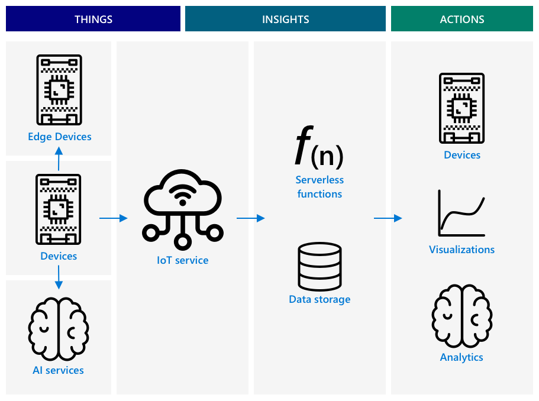
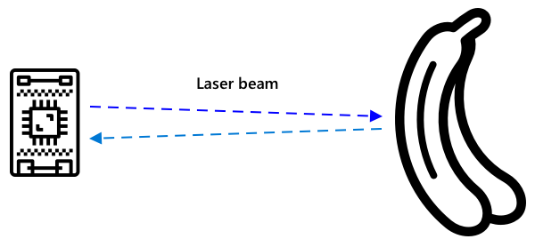

<!--
CO_OP_TRANSLATOR_METADATA:
{
  "original_hash": "f74f4ccb61f00e5f7e9f49c3ed416e36",
  "translation_date": "2025-08-28T12:09:50+00:00",
  "source_file": "4-manufacturing/lessons/4-trigger-fruit-detector/README.md",
  "language_code": "hr"
}
-->
# Pokretanje detekcije kvalitete voća pomoću senzora


> Sketchnote autorice [Nitya Narasimhan](https://github.com/nitya). Kliknite na sliku za veću verziju.

## Kviz prije predavanja

[Kviz prije predavanja](https://black-meadow-040d15503.1.azurestaticapps.net/quiz/35)

## Uvod

IoT aplikacija nije samo jedan uređaj koji prikuplja podatke i šalje ih u oblak; često se radi o više uređaja koji zajedno rade na prikupljanju podataka iz fizičkog svijeta pomoću senzora, donošenju odluka na temelju tih podataka i interakciji s fizičkim svijetom putem aktuatora ili vizualizacija.

U ovoj lekciji naučit ćete više o arhitekturi složenih IoT aplikacija, uključivanju više senzora, različitih cloud usluga za analizu i pohranu podataka te prikazivanju odgovora putem aktuatora. Naučit ćete kako osmisliti prototip sustava za kontrolu kvalitete voća, uključujući korištenje senzora blizine za pokretanje IoT aplikacije i kako bi izgledala arhitektura ovog prototipa.

U ovoj lekciji obradit ćemo:

* [Arhitektura složenih IoT aplikacija](../../../../../4-manufacturing/lessons/4-trigger-fruit-detector)
* [Dizajn sustava za kontrolu kvalitete voća](../../../../../4-manufacturing/lessons/4-trigger-fruit-detector)
* [Pokretanje provjere kvalitete voća pomoću senzora](../../../../../4-manufacturing/lessons/4-trigger-fruit-detector)
* [Podaci korišteni za detektor kvalitete voća](../../../../../4-manufacturing/lessons/4-trigger-fruit-detector)
* [Korištenje razvojnih uređaja za simulaciju više IoT uređaja](../../../../../4-manufacturing/lessons/4-trigger-fruit-detector)
* [Prijelaz na proizvodnju](../../../../../4-manufacturing/lessons/4-trigger-fruit-detector)

> 🗑 Ovo je posljednja lekcija u ovom projektu, pa nakon što završite lekciju i zadatak, ne zaboravite očistiti svoje cloud usluge. Usluge će vam trebati za dovršavanje zadatka, pa se pobrinite da prvo dovršite zadatak.
>
> Ako je potrebno, pogledajte [vodič za čišćenje projekta](../../../clean-up.md) za upute kako to učiniti.

## Arhitektura složenih IoT aplikacija

IoT aplikacije sastoje se od mnogih komponenti, uključujući razne uređaje i internetske usluge.

IoT aplikacije mogu se opisati kao *stvari* (uređaji) koje šalju podatke koji generiraju *uvide*. Ti *uvide* generiraju *akcije* za poboljšanje poslovanja ili procesa. Primjer je motor (stvar) koji šalje podatke o temperaturi. Ti podaci se koriste za procjenu radi li motor kako se očekuje (uvid). Uvid se koristi za proaktivno određivanje prioriteta rasporeda održavanja motora (akcija).

* Različite stvari prikupljaju različite dijelove podataka.
* IoT usluge pružaju uvide na temelju tih podataka, ponekad ih obogaćujući podacima iz dodatnih izvora.
* Ti uvidi pokreću akcije, uključujući upravljanje aktuatorima u uređajima ili vizualizaciju podataka.

### Referentna IoT arhitektura



Gornji dijagram prikazuje referentnu IoT arhitekturu.

> 🎓 *Referentna arhitektura* je primjer arhitekture koji možete koristiti kao referencu prilikom dizajniranja novih sustava. U ovom slučaju, ako gradite novi IoT sustav, možete slijediti referentnu arhitekturu, zamjenjujući vlastite uređaje i usluge gdje je to prikladno.

* **Stvari** su uređaji koji prikupljaju podatke pomoću senzora, možda komunicirajući s edge uslugama za interpretaciju tih podataka, poput klasifikatora slika za interpretaciju slikovnih podataka. Podaci s uređaja šalju se IoT usluzi.
* **Uvidi** dolaze iz serverless aplikacija ili iz analize pohranjenih podataka.
* **Akcije** mogu biti naredbe poslane uređajima ili vizualizacija podataka koja omogućuje ljudima donošenje odluka.


Gornji dijagram prikazuje neke od komponenti i usluga obrađenih u ovim lekcijama i kako se povezuju u referentnoj IoT arhitekturi.

* **Stvari** - napisali ste kod za uređaje za prikupljanje podataka pomoću senzora i analizu slika koristeći Custom Vision, koji se izvodi u oblaku i na edge uređaju. Ti podaci su poslani u IoT Hub.
* **Uvidi** - koristili ste Azure Functions za odgovaranje na poruke poslane u IoT Hub i pohranili podatke za kasniju analizu u Azure Storage.
* **Akcije** - upravljali ste aktuatorima na temelju odluka donesenih u oblaku i naredbi poslanih uređajima te ste vizualizirali podatke koristeći Azure Maps.

✅ Razmislite o drugim IoT uređajima koje ste koristili, poput pametnih kućanskih aparata. Koje su stvari, uvidi i akcije uključeni u taj uređaj i njegov softver?

Ovaj obrazac može se skalirati koliko god je potrebno, dodajući više uređaja i više usluga.

### Podaci i sigurnost

Dok definirate arhitekturu svog sustava, morate stalno razmišljati o podacima i sigurnosti.

* Koje podatke vaš uređaj šalje i prima?
* Kako bi ti podaci trebali biti osigurani i zaštićeni?
* Kako bi pristup uređaju i cloud usluzi trebao biti kontroliran?

✅ Razmislite o sigurnosti podataka bilo kojeg IoT uređaja koji posjedujete. Koliko je tih podataka osobno i treba ih čuvati privatnima, kako u prijenosu tako i kada su pohranjeni? Koji podaci ne bi trebali biti pohranjeni?

## Dizajn sustava za kontrolu kvalitete voća

Sada ćemo primijeniti ideju stvari, uvida i akcija na naš detektor kvalitete voća kako bismo osmislili veći end-to-end sustav.

Zamislite da ste dobili zadatak izgraditi detektor kvalitete voća za korištenje u tvornici za preradu. Voće se kreće na sustavu pokretne trake gdje zaposlenici trenutno ručno provjeravaju voće i uklanjaju nezrelo voće. Kako bi smanjio troškove, vlasnik tvornice želi automatizirani sustav.

✅ Jedan od trendova s porastom IoT-a (i tehnologije općenito) je zamjena ručnih poslova strojevima. Istražite: Koliko se poslova procjenjuje da će biti izgubljeno zbog IoT-a? Koliko će novih poslova biti stvoreno za izgradnju IoT uređaja?

Morate izgraditi sustav gdje se voće detektira čim stigne na pokretnu traku, zatim se fotografira i provjerava pomoću AI modela koji se izvodi na edge uređaju. Rezultati se šalju u oblak za pohranu, a ako je voće nezrelo, šalje se obavijest kako bi se nezrelo voće uklonilo.

|   |   |
| - | - |
| **Stvari** | Detektor za dolazak voća na pokretnu traku<br>Kamera za fotografiranje i klasifikaciju voća<br>Edge uređaj koji pokreće klasifikator<br>Uređaj za obavještavanje o nezrelom voću |
| **Uvidi** | Odluka o provjeri zrelosti voća<br>Pohrana rezultata klasifikacije zrelosti<br>Određivanje potrebe za upozorenjem o nezrelom voću |
| **Akcije** | Slanje naredbe uređaju za fotografiranje voća i provjeru pomoću klasifikatora slika<br>Slanje naredbe uređaju za upozorenje o nezrelom voću |

### Prototipiranje aplikacije


Gornji dijagram prikazuje referentnu arhitekturu za ovu prototip aplikaciju.

* IoT uređaj s senzorom blizine detektira dolazak voća. Ovo šalje poruku u oblak da je voće detektirano.
* Serverless aplikacija u oblaku šalje naredbu drugom uređaju da fotografira i klasificira sliku.
* IoT uređaj s kamerom fotografira i šalje sliku klasifikatoru slika koji se izvodi na edge uređaju. Rezultati se zatim šalju u oblak.
* Serverless aplikacija u oblaku pohranjuje ove informacije za kasniju analizu kako bi se vidjelo koliki postotak voća je nezreo. Ako je voće nezrelo, šalje naredbu drugom IoT uređaju da upozori radnike u tvornici o nezrelom voću putem LED-a.

> 💁 Cijela IoT aplikacija mogla bi se implementirati kao jedan uređaj, s ugrađenom logikom za pokretanje klasifikacije slika i upravljanje LED-om. Mogla bi koristiti IoT Hub samo za praćenje broja detektiranih nezrelih plodova i konfiguraciju uređaja. U ovoj lekciji proširena je kako bi se demonstrirali koncepti za velike IoT aplikacije.

Za prototip ćete sve implementirati na jednom uređaju. Ako koristite mikrokontroler, tada ćete koristiti zaseban edge uređaj za pokretanje klasifikatora slika.

## Pokretanje provjere kvalitete voća pomoću senzora

IoT uređaj treba neku vrstu okidača koji će označiti kada je voće spremno za klasifikaciju. Jedan od okidača mogao bi biti mjerenje kada je voće na pravom mjestu na pokretnoj traci mjerenjem udaljenosti do senzora.



Senzori blizine mogu se koristiti za mjerenje udaljenosti od senzora do objekta. Obično emitiraju zraku elektromagnetskog zračenja, poput laserske zrake ili infracrvenog svjetla, a zatim detektiraju zračenje koje se odbija od objekta. Vrijeme između slanja laserske zrake i povratka signala može se koristiti za izračunavanje udaljenosti do senzora.

> 💁 Vjerojatno ste koristili senzore blizine, a da toga niste bili svjesni. Većina pametnih telefona isključuje ekran kada ih prislonite uz uho kako biste spriječili slučajno prekidanje poziva uhom, a to funkcionira pomoću senzora blizine koji detektira objekt blizu ekrana tijekom poziva i onemogućuje dodirne funkcije dok telefon nije na određenoj udaljenosti.

### Zadatak - pokretanje detekcije kvalitete voća pomoću senzora udaljenosti

Prođite kroz odgovarajući vodič za korištenje senzora blizine za detekciju objekta pomoću vašeg IoT uređaja:

* [Arduino - Wio Terminal](wio-terminal-proximity.md)
* [Jednoplano računalo - Raspberry Pi](pi-proximity.md)
* [Jednoplano računalo - Virtualni uređaj](virtual-device-proximity.md)

## Podaci korišteni za detektor kvalitete voća

Prototip detektora voća ima više komponenti koje međusobno komuniciraju.


* Senzor blizine mjeri udaljenost do komada voća i šalje to u IoT Hub
* Naredba za upravljanje kamerom dolazi iz IoT Hub-a prema uređaju s kamerom
* Rezultati klasifikacije slike šalju se u IoT Hub
* Naredba za upravljanje LED-om za upozorenje o nezrelom voću šalje se iz IoT Hub-a prema uređaju s LED-om

Dobro je unaprijed definirati strukturu ovih poruka prije nego što izgradite aplikaciju.

> 💁 Gotovo svaki iskusni programer u nekom trenutku svoje karijere proveo je sate, dane ili čak tjedne tražeći greške uzrokovane razlikama između podataka koji se šalju i onih koji se očekuju.

Na primjer - ako šaljete informacije o temperaturi, kako biste definirali JSON? Mogli biste imati polje nazvano `temperature`, ili biste mogli koristiti uobičajenu skraćenicu `temp`.

```json
{
    "temperature": 20.7
}
```

u usporedbi s:

```json
{
    "temp": 20.7
}
```

Također morate razmotriti jedinice - je li temperatura u °C ili °F? Ako mjerite temperaturu pomoću potrošačkog uređaja i korisnik promijeni prikaz jedinica, morate osigurati da jedinice poslane u oblak ostanu dosljedne.

✅ Istražite: Kako su problemi s jedinicama uzrokovali pad Mars Climate Orbitera vrijednog 125 milijuna dolara?

Razmislite o podacima koji se šalju za detektor kvalitete voća. Kako biste definirali svaku poruku? Gdje biste analizirali podatke i donosili odluke o tome koje podatke poslati?

Na primjer - pokretanje klasifikacije slike pomoću senzora blizine. IoT uređaj mjeri udaljenost, ali gdje se donosi odluka? Odlučuje li uređaj da je voće dovoljno blizu i šalje poruku IoT Hub-u da pokrene klasifikaciju? Ili šalje mjerenja udaljenosti i dopušta IoT Hub-u da odluči?

Odgovor na ovakva pitanja je - ovisi. Svaki slučaj upotrebe je drugačiji, zbog čega kao IoT programer morate razumjeti sustav koji gradite, kako se koristi i podatke koji se detektiraju.

* Ako se odluka donosi u IoT Hub-u, morate poslati više mjerenja udaljenosti.
* Ako šaljete previše poruka, to povećava trošak IoT Hub-a i količinu potrebne propusnosti za vaše IoT uređaje (posebno u tvornici s milijunima uređaja). Također može usporiti vaš uređaj.
* Ako odluku donosite na uređaju, morat ćete osigurati način za konfiguriranje uređaja kako biste fino podesili stroj.

## Korištenje razvojnih uređaja za simulaciju više IoT uređaja

Za izgradnju vašeg prototipa, trebat će vam vaš IoT razvojni komplet da se ponaša kao više uređaja, šaljući telemetriju i odgovarajući na naredbe.

### Simulacija više IoT uređaja na Raspberry Pi-ju ili virtualnom IoT hardveru

Kada koristite jednoplano računalo poput Raspberry Pi-ja, možete pokrenuti više aplikacija odjednom. To znači da možete simulirati više IoT uređaja stvaranjem više aplikacija, po jednu za svaki 'IoT uređaj'. Na primjer, možete implementirati svaki uređaj kao zasebnu Python datoteku i pokrenuti ih u različitim terminalskim sesijama.
> 💁 Budite svjesni da neki hardver neće raditi kada ga istovremeno koriste više aplikacija.
### Simulacija više uređaja na mikrokontroleru

Mikrokontrolere je teže koristiti za simulaciju više uređaja. Za razliku od jednopločnih računala, na mikrokontrolerima ne možete pokretati više aplikacija istovremeno; morate uključiti svu logiku za sve odvojene IoT uređaje u jednu aplikaciju.

Neki prijedlozi kako olakšati ovaj proces su:

* Kreirajte jednu ili više klasa za svaki IoT uređaj - na primjer, klase nazvane `DistanceSensor`, `ClassifierCamera`, `LEDController`. Svaka od njih može imati vlastite metode `setup` i `loop` koje poziva glavne funkcije `setup` i `loop`.
* Obradite naredbe na jednom mjestu i usmjerite ih prema odgovarajućoj klasi uređaja prema potrebi.
* U glavnoj funkciji `loop` morat ćete uzeti u obzir vremenske zahtjeve za svaki uređaj. Na primjer, ako imate jednu klasu uređaja koja treba obraditi podatke svakih 10 sekundi, a drugu koja to treba raditi svake sekunde, tada u glavnoj funkciji `loop` koristite kašnjenje od 1 sekunde. Svaki poziv funkcije `loop` pokreće relevantni kod za uređaj koji treba obraditi podatke svake sekunde, a pomoću brojača brojite svaki prolaz petlje, obrađujući drugi uređaj kada brojač dosegne 10 (nakon čega se brojač resetira).

## Prijelaz na proizvodnju

Prototip će činiti osnovu za konačni proizvodni sustav. Neke od razlika prilikom prijelaza na proizvodnju uključuju:

* Robusne komponente - korištenje hardvera dizajniranog da izdrži buku, toplinu, vibracije i stres u tvornici.
* Korištenje interne komunikacije - neki bi se dijelovi međusobno izravno povezivali, izbjegavajući prijenos podataka u oblak, šaljući podatke u oblak samo za pohranu. Način na koji se to postiže ovisi o postavkama tvornice, bilo putem izravne komunikacije ili pokretanjem dijela IoT usluge na rubu koristeći gateway uređaj.
* Opcije konfiguracije - svaka tvornica i slučaj upotrebe su različiti, pa bi hardver trebao biti konfigurabilan. Na primjer, senzor blizine možda će trebati detektirati različite vrste voća na različitim udaljenostima. Umjesto da unaprijed definirate udaljenost za pokretanje klasifikacije, želite da to bude konfigurabilno putem oblaka, na primjer korištenjem device twin-a.
* Automatizirano uklanjanje voća - umjesto LED-a koji signalizira da voće nije zrelo, automatizirani uređaji bi ga uklonili.

✅ Istražite: Na koje bi se još načine proizvodni uređaji razlikovali od razvojnih kompleta?

---

## 🚀 Izazov

U ovoj lekciji naučili ste neke od koncepata potrebnih za arhitekturu IoT sustava. Prisjetite se prethodnih projekata. Kako se oni uklapaju u referentnu arhitekturu prikazanu gore?

Odaberite jedan od dosadašnjih projekata i osmislite dizajn složenijeg rješenja koje objedinjuje više mogućnosti izvan onoga što je obrađeno u projektima. Nacrtajte arhitekturu i razmislite o svim uređajima i uslugama koje bi vam bile potrebne.

Na primjer - uređaj za praćenje vozila koji kombinira GPS sa senzorima za praćenje, poput temperature u rashlađenom kamionu, vremena uključivanja i isključivanja motora te identiteta vozača. Koji su uređaji uključeni, koje usluge su potrebne, koji se podaci prenose i koje sigurnosne i privatne aspekte treba uzeti u obzir?

## Kviz nakon predavanja

[Kviz nakon predavanja](https://black-meadow-040d15503.1.azurestaticapps.net/quiz/36)

## Pregled i samostalno učenje

* Pročitajte više o IoT arhitekturi u [Azure IoT referentnoj arhitekturi na Microsoft dokumentaciji](https://docs.microsoft.com/azure/architecture/reference-architectures/iot?WT.mc_id=academic-17441-jabenn)
* Pročitajte više o device twin-ovima u [dokumentaciji o razumijevanju i korištenju device twin-ova u IoT Hubu na Microsoft dokumentaciji](https://docs.microsoft.com/azure/iot-hub/iot-hub-devguide-device-twins?WT.mc_id=academic-17441-jabenn)
* Pročitajte o OPC-UA, protokolu za komunikaciju između strojeva koji se koristi u industrijskoj automatizaciji, na [OPC-UA stranici na Wikipediji](https://wikipedia.org/wiki/OPC_Unified_Architecture)

## Zadatak

[Izradite detektor kvalitete voća](assignment.md)

---

**Odricanje od odgovornosti**:  
Ovaj dokument je preveden pomoću AI usluge za prevođenje [Co-op Translator](https://github.com/Azure/co-op-translator). Iako nastojimo osigurati točnost, imajte na umu da automatski prijevodi mogu sadržavati pogreške ili netočnosti. Izvorni dokument na izvornom jeziku treba smatrati autoritativnim izvorom. Za ključne informacije preporučuje se profesionalni prijevod od strane čovjeka. Ne preuzimamo odgovornost za bilo kakva nesporazuma ili pogrešna tumačenja koja proizlaze iz korištenja ovog prijevoda.