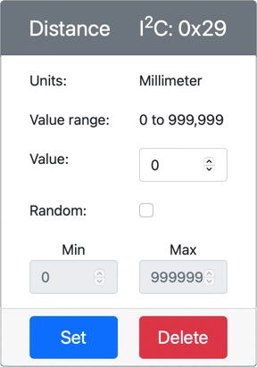

<!--
CO_OP_TRANSLATOR_METADATA:
{
  "original_hash": "7e9f05bdc50a40fd924b1d66934471bf",
  "translation_date": "2025-08-28T12:14:54+00:00",
  "source_file": "4-manufacturing/lessons/4-trigger-fruit-detector/virtual-device-proximity.md",
  "language_code": "hr"
}
-->
# Otkrivanje blizine - Virtualni IoT hardver

U ovom dijelu lekcije dodat ćete senzor blizine svom virtualnom IoT uređaju i očitavati udaljenost s njega.

## Hardver

Virtualni IoT uređaj koristit će simulirani senzor udaljenosti.

Na fizičkom IoT uređaju koristili biste senzor s modulom za lasersko mjerenje udaljenosti.

### Dodavanje senzora udaljenosti u CounterFit

Da biste koristili virtualni senzor udaljenosti, trebate ga dodati u CounterFit aplikaciju.

#### Zadatak - dodavanje senzora udaljenosti u CounterFit

Dodajte senzor udaljenosti u CounterFit aplikaciju.

1. Otvorite kod `fruit-quality-detector` u VS Code-u i provjerite je li virtualno okruženje aktivirano.

1. Instalirajte dodatni Pip paket za instalaciju CounterFit shima koji može komunicirati sa senzorima udaljenosti simulirajući [rpi-vl53l0x Pip paket](https://pypi.org/project/rpi-vl53l0x/), Python paket koji radi s [VL53L0X senzorom udaljenosti na temelju vremena leta](https://wiki.seeedstudio.com/Grove-Time_of_Flight_Distance_Sensor-VL53L0X/). Provjerite instalirate li ovo iz terminala s aktiviranim virtualnim okruženjem.

    ```sh
    pip install counterfit-shims-rpi-vl53l0x
    ```

1. Provjerite je li CounterFit web aplikacija pokrenuta.

1. Kreirajte senzor udaljenosti:

    1. U okviru *Create sensor* u odjeljku *Sensors*, otvorite padajući izbornik *Sensor type* i odaberite *Distance*.

    1. Ostavite *Units* kao `Millimeter`.

    1. Ovaj senzor je I²C senzor, pa postavite adresu na `0x29`. Ako biste koristili fizički VL53L0X senzor, bio bi unaprijed postavljen na ovu adresu.

    1. Kliknite na gumb **Add** za kreiranje senzora udaljenosti.

    

    Senzor udaljenosti će biti kreiran i pojavit će se na popisu senzora.

    

## Programiranje senzora udaljenosti

Virtualni IoT uređaj sada se može programirati za korištenje simuliranog senzora udaljenosti.

### Zadatak - programiranje senzora udaljenosti

1. Kreirajte novu datoteku u projektu `fruit-quality-detector` pod nazivom `distance-sensor.py`.

    > 💁 Jednostavan način za simulaciju više IoT uređaja je da svaki uređaj bude u zasebnoj Python datoteci, a zatim ih pokrenete istovremeno.

1. Pokrenite vezu s CounterFit-om pomoću sljedećeg koda:

    ```python
    from counterfit_connection import CounterFitConnection
    CounterFitConnection.init('127.0.0.1', 5000)
    ```

1. Dodajte sljedeći kod ispod:

    ```python
    import time
    
    from counterfit_shims_rpi_vl53l0x.vl53l0x import VL53L0X
    ```

    Ovaj kod uvozi biblioteku shima za VL53L0X senzor udaljenosti na temelju vremena leta.

1. Ispod toga dodajte sljedeći kod za pristup senzoru:

    ```python
    distance_sensor = VL53L0X()
    distance_sensor.begin()
    ```

    Ovaj kod deklarira senzor udaljenosti, a zatim pokreće senzor.

1. Na kraju, dodajte beskonačnu petlju za očitavanje udaljenosti:

    ```python
    while True:
        distance_sensor.wait_ready()
        print(f'Distance = {distance_sensor.get_distance()} mm')
        time.sleep(1)
    ```

    Ovaj kod čeka da senzor bude spreman za očitavanje vrijednosti, a zatim ispisuje tu vrijednost u konzolu.

1. Pokrenite ovaj kod.

    > 💁 Ne zaboravite da se ova datoteka zove `distance-sensor.py`! Provjerite pokrećete li je putem Pythona, a ne `app.py`.

1. Vidjet ćete očitanja udaljenosti u konzoli. Promijenite vrijednost u CounterFit-u kako biste vidjeli promjenu, ili koristite nasumične vrijednosti.

    ```output
    (.venv) ➜  fruit-quality-detector python distance-sensor.py 
    Distance = 37 mm
    Distance = 42 mm
    Distance = 29 mm
    ```

> 💁 Ovaj kod možete pronaći u mapi [code-proximity/virtual-iot-device](../../../../../4-manufacturing/lessons/4-trigger-fruit-detector/code-proximity/virtual-iot-device).

😀 Vaš program za senzor blizine uspješno je završen!

---

**Odricanje od odgovornosti**:  
Ovaj dokument je preveden pomoću AI usluge za prevođenje [Co-op Translator](https://github.com/Azure/co-op-translator). Iako nastojimo osigurati točnost, imajte na umu da automatski prijevodi mogu sadržavati pogreške ili netočnosti. Izvorni dokument na izvornom jeziku treba smatrati autoritativnim izvorom. Za ključne informacije preporučuje se profesionalni prijevod od strane čovjeka. Ne preuzimamo odgovornost za bilo kakva nesporazuma ili pogrešna tumačenja koja proizlaze iz korištenja ovog prijevoda.