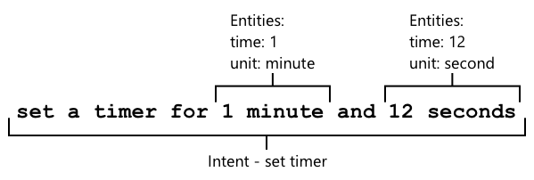

<!--
CO_OP_TRANSLATOR_METADATA:
{
  "original_hash": "6f4ba69d77f16c4a5110623a96a215c3",
  "translation_date": "2025-08-28T12:35:41+00:00",
  "source_file": "6-consumer/lessons/2-language-understanding/README.md",
  "language_code": "hr"
}
-->
# Razumijevanje jezika


> Sketchnote autorice [Nitya Narasimhan](https://github.com/nitya). Kliknite na sliku za veću verziju.

## Kviz prije predavanja

[Kviz prije predavanja](https://black-meadow-040d15503.1.azurestaticapps.net/quiz/43)

## Uvod

U prethodnoj lekciji pretvorili ste govor u tekst. Da bi se to moglo koristiti za programiranje pametnog timera, vaš kod mora razumjeti što je rečeno. Mogli biste pretpostaviti da će korisnik izgovoriti fiksnu frazu, poput "Postavi timer na 3 minute", i analizirati taj izraz kako biste dobili trajanje timera, ali to nije baš korisnički prijateljski. Ako bi korisnik rekao "Postavi timer za 3 minute", vi ili ja bismo razumjeli što to znači, ali vaš kod ne bi, jer bi očekivao fiksnu frazu.

Tu dolazi razumijevanje jezika, koristeći AI modele za interpretaciju teksta i vraćanje potrebnih detalja, na primjer, prepoznavanje i "Postavi timer na 3 minute" i "Postavi timer za 3 minute" te razumijevanje da je potreban timer za 3 minute.

U ovoj lekciji naučit ćete o modelima za razumijevanje jezika, kako ih kreirati, trenirati i koristiti u svom kodu.

U ovoj lekciji obradit ćemo:

* [Razumijevanje jezika](../../../../../6-consumer/lessons/2-language-understanding)
* [Kreiranje modela za razumijevanje jezika](../../../../../6-consumer/lessons/2-language-understanding)
* [Namjere i entiteti](../../../../../6-consumer/lessons/2-language-understanding)
* [Korištenje modela za razumijevanje jezika](../../../../../6-consumer/lessons/2-language-understanding)

## Razumijevanje jezika

Ljudi koriste jezik za komunikaciju stotinama tisuća godina. Komuniciramo riječima, zvukovima ili radnjama i razumijemo što je rečeno, ne samo značenje riječi, zvukova ili radnji, već i njihov kontekst. Razumijemo iskrenost i sarkazam, omogućujući da iste riječi znače različite stvari ovisno o tonu našeg glasa.

✅ Razmislite o nekim razgovorima koje ste nedavno vodili. Koliko bi tih razgovora bilo teško za računalo razumjeti jer zahtijevaju kontekst?

Razumijevanje jezika, također poznato kao razumijevanje prirodnog jezika, dio je područja umjetne inteligencije zvanog obrada prirodnog jezika (NLP) i bavi se razumijevanjem detalja riječi ili rečenica. Ako koristite glasovnog asistenta poput Alexe ili Siri, koristili ste usluge za razumijevanje jezika. To su AI usluge koje pretvaraju "Alexa, pusti najnoviji album Taylor Swift" u moju kćer kako pleše po dnevnom boravku uz svoje omiljene pjesme.

> 💁 Računala, unatoč svim svojim napretcima, još uvijek imaju dug put do pravog razumijevanja teksta. Kada govorimo o razumijevanju jezika kod računala, ne mislimo na nešto ni približno napredno kao ljudska komunikacija, već na uzimanje riječi i izdvajanje ključnih detalja.

Kao ljudi, razumijemo jezik bez puno razmišljanja. Ako bih zamolio drugu osobu da "pusti najnoviji album Taylor Swift", ona bi instinktivno znala što mislim. Za računalo je to teže. Moralo bi uzeti riječi, pretvorene iz govora u tekst, i razraditi sljedeće informacije:

* Treba pustiti glazbu
* Glazba je od izvođača Taylor Swift
* Specifična glazba je cijeli album s više pjesama u nizu
* Taylor Swift ima mnogo albuma, pa ih treba poredati kronološki, a najnoviji je onaj koji se traži

✅ Razmislite o nekim drugim rečenicama koje ste izgovorili prilikom postavljanja zahtjeva, poput naručivanja kave ili traženja člana obitelji da vam nešto doda. Pokušajte ih razložiti na dijelove informacija koje bi računalo trebalo izdvojiti kako bi razumjelo rečenicu.

Modeli za razumijevanje jezika su AI modeli koji su obučeni za izdvajanje određenih detalja iz jezika, a zatim se obučavaju za specifične zadatke koristeći transferno učenje, na isti način na koji ste obučavali model za prilagođenu viziju koristeći mali skup slika. Možete uzeti model, a zatim ga obučiti koristeći tekst koji želite da razumije.

## Kreiranje modela za razumijevanje jezika


Možete kreirati modele za razumijevanje jezika koristeći LUIS, uslugu za razumijevanje jezika od Microsofta koja je dio Cognitive Services.

### Zadatak - kreiranje resursa za autorstvo

Za korištenje LUIS-a, trebate kreirati resurs za autorstvo.

1. Koristite sljedeću naredbu za kreiranje resursa za autorstvo u svojoj `smart-timer` grupi resursa:

    ```python
    az cognitiveservices account create --name smart-timer-luis-authoring \
                                        --resource-group smart-timer \
                                        --kind LUIS.Authoring \
                                        --sku F0 \
                                        --yes \
                                        --location <location>
    ```

    Zamijenite `<location>` lokacijom koju ste koristili prilikom kreiranja grupe resursa.

    > ⚠️ LUIS nije dostupan u svim regijama, pa ako dobijete sljedeću grešku:
    >
    > ```output
    > InvalidApiSetId: The account type 'LUIS.Authoring' is either invalid or unavailable in given region.
    > ```
    >
    > odaberite drugu regiju.

    Ovo će kreirati besplatni LUIS resurs za autorstvo.

### Zadatak - kreiranje aplikacije za razumijevanje jezika

1. Otvorite LUIS portal na [luis.ai](https://luis.ai?WT.mc_id=academic-17441-jabenn) u svom pregledniku i prijavite se s istim računom koji koristite za Azure.

1. Slijedite upute na dijaloškom okviru za odabir svoje Azure pretplate, a zatim odaberite `smart-timer-luis-authoring` resurs koji ste upravo kreirali.

1. Na popisu *Conversation apps* odaberite gumb **New app** za kreiranje nove aplikacije. Nazovite novu aplikaciju `smart-timer` i postavite *Culture* na svoj jezik.

    > 💁 Postoji polje za resurs za predikciju. Možete kreirati drugi resurs samo za predikciju, ali besplatni resurs za autorstvo omogućuje 1.000 predikcija mjesečno, što bi trebalo biti dovoljno za razvoj, pa ovo možete ostaviti prazno.

1. Pročitajte vodič koji se pojavi nakon što kreirate aplikaciju kako biste razumjeli korake potrebne za obuku modela za razumijevanje jezika. Zatvorite vodič kada završite.

## Namjere i entiteti

Razumijevanje jezika temelji se na *namjerama* i *entitetima*. Namjere su ono što riječi žele postići, na primjer puštanje glazbe, postavljanje timera ili naručivanje hrane. Entiteti su ono na što se namjera odnosi, poput albuma, trajanja timera ili vrste hrane. Svaka rečenica koju model interpretira trebala bi imati barem jednu namjeru i opcionalno jedan ili više entiteta.

Neki primjeri:

| Rečenica                                           | Namjera          | Entiteti                                   |
| -------------------------------------------------- | ---------------- | ----------------------------------------- |
| "Pusti najnoviji album Taylor Swift"              | *pusti glazbu*   | *najnoviji album Taylor Swift*            |
| "Postavi timer na 3 minute"                       | *postavi timer*  | *3 minute*                                |
| "Otkaži moj timer"                                | *otkaži timer*   | Nema                                      |
| "Naruči 3 velike pizze s ananasom i cezar salatu" | *naruči hranu*   | *3 velike pizze s ananasom*, *cezar salata* |

✅ Kod rečenica o kojima ste ranije razmišljali, koja bi bila namjera i koji entiteti u toj rečenici?

Za obuku LUIS-a, prvo postavljate entitete. Oni mogu biti fiksni popis pojmova ili naučeni iz teksta. Na primjer, možete pružiti fiksni popis hrane dostupne na vašem jelovniku, s varijacijama (ili sinonimima) za svaku riječ, poput *patlidžan* i *balancana* kao varijacije za *patlidžan*. LUIS također ima unaprijed definirane entitete koji se mogu koristiti, poput brojeva i lokacija.

Za postavljanje timera, mogli biste imati jedan entitet koristeći unaprijed definirane entitete za brojeve za vrijeme i drugi za jedinice, poput minuta i sekundi. Svaka jedinica imala bi više varijacija kako bi pokrila jedninu i množinu - poput minuta i minute.

Nakon što definirate entitete, kreirate namjere. One se uče modelu na temelju primjera rečenica koje pružate (poznatih kao izrazi). Na primjer, za namjeru *postavi timer*, mogli biste pružiti sljedeće rečenice:

* `postavi timer na 1 sekundu`
* `postavi timer na 1 minutu i 12 sekundi`
* `postavi timer na 3 minute`
* `postavi timer na 9 minuta i 30 sekundi`

Zatim LUIS-u kažete koji dijelovi ovih rečenica odgovaraju entitetima:



Rečenica `postavi timer na 1 minutu i 12 sekundi` ima namjeru `postavi timer`. Također ima 2 entiteta s po 2 vrijednosti:

|            | vrijeme | jedinica |
| ---------- | ------: | -------- |
| 1 minuta   | 1       | minuta   |
| 12 sekundi | 12      | sekunda  |

Za obuku dobrog modela, trebate niz različitih primjera rečenica kako biste pokrili mnoge različite načine na koje bi netko mogao tražiti istu stvar.

> 💁 Kao i kod svakog AI modela, što više podataka i što su podaci točniji, to će model biti bolji.

✅ Razmislite o različitim načinima na koje biste mogli tražiti istu stvar i očekivati da vas čovjek razumije.

### Zadatak - dodavanje entiteta u modele za razumijevanje jezika

Za timer trebate dodati 2 entiteta - jedan za jedinicu vremena (minute ili sekunde) i jedan za broj minuta ili sekundi.

Upute za korištenje LUIS portala možete pronaći u [Quickstart: Build your app in LUIS portal dokumentaciji na Microsoft Docs](https://docs.microsoft.com/azure/cognitive-services/luis/luis-get-started-create-app?WT.mc_id=academic-17441-jabenn).

1. Na LUIS portalu odaberite karticu *Entities* i dodajte unaprijed definirani entitet *number* odabirom gumba **Add prebuilt entity**, a zatim odabirom *number* s popisa.

1. Kreirajte novi entitet za jedinicu vremena koristeći gumb **Create**. Nazovite entitet `time unit` i postavite tip na *List*. Dodajte vrijednosti za `minute` i `second` na popis *Normalized values*, dodajući jedninu i množinu u popis *synonyms*. Pritisnite `return` nakon dodavanja svakog sinonima kako biste ga dodali na popis.

    | Normalizirana vrijednost | Sinonimi         |
    | ------------------------ | ---------------- |
    | minuta                  | minuta, minute   |
    | sekunda                 | sekunda, sekunde |

### Zadatak - dodavanje namjera u modele za razumijevanje jezika

1. Na kartici *Intents* odaberite gumb **Create** za kreiranje nove namjere. Nazovite ovu namjeru `set timer`.

1. U primjerima unesite različite načine za postavljanje timera koristeći minute, sekunde i kombinaciju minuta i sekundi. Primjeri mogu biti:

    * `postavi timer na 1 sekundu`
    * `postavi timer na 4 minute`
    * `postavi timer na četiri minute i šest sekundi`
    * `postavi timer na 9 minuta i 30 sekundi`
    * `postavi timer na 1 minutu i 12 sekundi`
    * `postavi timer na 3 minute`
    * `postavi timer na 3 minute i 1 sekundu`
    * `postavi timer na tri minute i jednu sekundu`
    * `postavi timer na 1 minutu i 1 sekundu`
    * `postavi timer na 30 sekundi`
    * `postavi timer na 1 sekundu`

    Kombinirajte brojeve kao riječi i numeričke vrijednosti kako bi model naučio raditi s obje.

1. Dok unosite svaki primjer, LUIS će početi prepoznavati entitete i podcrtavati te označavati sve što pronađe.

    

### Zadatak - treniranje i testiranje modela

1. Kada su entiteti i namjere konfigurirani, možete trenirati model koristeći gumb **Train** na gornjem izborniku. Odaberite ovaj gumb i model bi se trebao obučiti za nekoliko sekundi. Gumb će biti zasivljen tijekom treniranja i ponovno omogućen kada završi.

1. Odaberite gumb **Test** na gornjem izborniku za testiranje modela za razumijevanje jezika. Unesite tekst poput `postavi timer na 5 minuta i 4 sekunde` i pritisnite return. Rečenica će se pojaviti u okviru ispod tekstualnog okvira u koji ste je unijeli, a ispod toga će biti *top intent*, odnosno namjera koja je prepoznata s najvećom vjerojatnošću. To bi trebalo biti `set timer`. Ime namjere bit će popraćeno vjerojatnošću da je prepoznata namjera ispravna.

1. Odaberite opciju **Inspect** za pregled rezultata. Vidjet ćete namjeru s najvećim rezultatom i njezin postotak vjerojatnosti, zajedno s popisima prepoznatih entiteta.

1. Zatvorite *Test* prozor kada završite s testiranjem.

### Zadatak - objavljivanje modela

Da biste koristili ovaj model iz koda, trebate ga objaviti. Kada objavljujete iz LUIS-a, možete objaviti u okruženje za testiranje (staging) ili u produkcijsko okruženje za potpuno izdanje. U ovoj lekciji, okruženje za testiranje je dovoljno.

1. Na LUIS portalu odaberite gumb **Publish** na gornjem izborniku.

1. Provjerite je li odabrana opcija *Staging slot*, a zatim odaberite **Done**. Vidjet ćete obavijest kada aplikacija bude objavljena.

1. Ovo možete testirati koristeći curl. Za izradu curl naredbe trebate tri vrijednosti - endpoint, ID aplikacije (App ID) i API ključ. Te vrijednosti možete pronaći na kartici **MANAGE** koja se može odabrati s gornjeg izbornika.

    1. Iz sekcije *Settings* kopirajte App ID.
1. Iz odjeljka *Azure Resources* odaberite *Authoring Resource* i kopirajte *Primary Key* i *Endpoint URL*.

1. Pokrenite sljedeću curl naredbu u svom naredbenom retku ili terminalu:

    ```sh
    curl "<endpoint url>/luis/prediction/v3.0/apps/<app id>/slots/staging/predict" \
          --request GET \
          --get \
          --data "subscription-key=<primary key>" \
          --data "verbose=false" \
          --data "show-all-intents=true" \
          --data-urlencode "query=<sentence>"
    ```

    Zamijenite `<endpoint url>` s Endpoint URL-om iz odjeljka *Azure Resources*.

    Zamijenite `<app id>` s App ID-om iz odjeljka *Settings*.

    Zamijenite `<primary key>` s Primary Key-om iz odjeljka *Azure Resources*.

    Zamijenite `<sentence>` s rečenicom koju želite testirati.

1. Izlaz ovog poziva bit će JSON dokument koji detaljno opisuje upit, glavni intent i popis entiteta razvrstanih prema tipu.

    ```JSON
    {
        "query": "set a timer for 45 minutes and 12 seconds",
        "prediction": {
            "topIntent": "set timer",
            "intents": {
                "set timer": {
                    "score": 0.97031575
                },
                "None": {
                    "score": 0.02205793
                }
            },
            "entities": {
                "number": [
                    45,
                    12
                ],
                "time-unit": [
                    [
                        "minute"
                    ],
                    [
                        "second"
                    ]
                ]
            }
        }
    }
    ```

    Gornji JSON dolazi od upita s `set a timer for 45 minutes and 12 seconds`:

    * `set timer` je bio glavni intent s vjerojatnošću od 97%.
    * Otkrivena su dva entiteta tipa *number*, `45` i `12`.
    * Otkrivena su dva entiteta tipa *time-unit*, `minute` i `second`.

## Korištenje modela za razumijevanje jezika

Nakon objavljivanja, LUIS model može se pozivati iz koda. U prethodnim lekcijama koristili ste IoT Hub za upravljanje komunikacijom s cloud servisima, slanje telemetrije i osluškivanje naredbi. Ovo je vrlo asinkrono - nakon slanja telemetrije vaš kod ne čeka odgovor, a ako cloud servis ne radi, to nećete znati.

Za pametni timer želimo odmah dobiti odgovor kako bismo korisniku mogli reći da je timer postavljen ili ga upozoriti da cloud servisi nisu dostupni. Da bismo to postigli, naš IoT uređaj će izravno pozivati web endpoint, umjesto da se oslanja na IoT Hub.

Umjesto da LUIS pozivate izravno s IoT uređaja, možete koristiti serverless kod s drugačijim tipom okidača - HTTP okidačem. Ovo omogućuje vašoj funkciji da osluškuje REST zahtjeve i odgovara na njih. Ova funkcija će biti REST endpoint koji vaš uređaj može pozvati.

> 💁 Iako možete pozivati LUIS izravno s vašeg IoT uređaja, bolje je koristiti nešto poput serverless koda. Na taj način, kada želite promijeniti LUIS aplikaciju koju pozivate, na primjer kada obučite bolji model ili model na drugom jeziku, trebate ažurirati samo cloud kod, a ne ponovno implementirati kod na potencijalno tisuće ili milijune IoT uređaja.

### Zadatak - kreiranje serverless funkcijske aplikacije

1. Kreirajte Azure Functions aplikaciju nazvanu `smart-timer-trigger` i otvorite je u VS Code.

1. Dodajte HTTP okidač ovoj aplikaciji nazvan `speech-trigger` koristeći sljedeću naredbu unutar terminala u VS Code:

    ```sh
    func new --name text-to-timer --template "HTTP trigger"
    ```

    Ovo će kreirati HTTP okidač nazvan `text-to-timer`.

1. Testirajte HTTP okidač pokretanjem funkcijske aplikacije. Kada se pokrene, endpoint će biti prikazan u izlazu:

    ```output
    Functions:
    
            text-to-timer: [GET,POST] http://localhost:7071/api/text-to-timer
    ```

    Testirajte ovo učitavanjem URL-a [http://localhost:7071/api/text-to-timer](http://localhost:7071/api/text-to-timer) u svom pregledniku.

    ```output
    This HTTP triggered function executed successfully. Pass a name in the query string or in the request body for a personalized response.
    ```

### Zadatak - korištenje modela za razumijevanje jezika

1. SDK za LUIS dostupan je putem Pip paketa. Dodajte sljedeći redak u datoteku `requirements.txt` kako biste dodali ovisnost o ovom paketu:

    ```sh
    azure-cognitiveservices-language-luis
    ```

1. Provjerite je li virtualno okruženje aktivirano u terminalu VS Code i pokrenite sljedeću naredbu za instalaciju Pip paketa:

    ```sh
    pip install -r requirements.txt
    ```

    > 💁 Ako naiđete na greške, možda ćete trebati ažurirati pip pomoću sljedeće naredbe:
    >
    > ```sh
    > pip install --upgrade pip
    > ```

1. Dodajte nove unose u datoteku `local.settings.json` za vaš LUIS API Key, Endpoint URL i App ID iz **MANAGE** kartice LUIS portala:

    ```JSON
    "LUIS_KEY": "<primary key>",
    "LUIS_ENDPOINT_URL": "<endpoint url>",
    "LUIS_APP_ID": "<app id>"
    ```

    Zamijenite `<endpoint url>` s Endpoint URL-om iz odjeljka *Azure Resources* kartice **MANAGE**. Ovo će biti `https://<location>.api.cognitive.microsoft.com/`.

    Zamijenite `<app id>` s App ID-om iz odjeljka *Settings* kartice **MANAGE**.

    Zamijenite `<primary key>` s Primary Key-om iz odjeljka *Azure Resources* kartice **MANAGE**.

1. Dodajte sljedeće uvoze u datoteku `__init__.py`:

    ```python
    import json
    import os
    from azure.cognitiveservices.language.luis.runtime import LUISRuntimeClient
    from msrest.authentication import CognitiveServicesCredentials
    ```

    Ovo uvozi neke sistemske biblioteke, kao i biblioteke za interakciju s LUIS-om.

1. Obrišite sadržaj metode `main` i dodajte sljedeći kod:

    ```python
    luis_key = os.environ['LUIS_KEY']
    endpoint_url = os.environ['LUIS_ENDPOINT_URL']
    app_id = os.environ['LUIS_APP_ID']
    
    credentials = CognitiveServicesCredentials(luis_key)
    client = LUISRuntimeClient(endpoint=endpoint_url, credentials=credentials)
    ```

    Ovo učitava vrijednosti koje ste dodali u datoteku `local.settings.json` za vašu LUIS aplikaciju, kreira objekt vjerodajnica s vašim API ključem, a zatim kreira LUIS klijent objekt za interakciju s vašom LUIS aplikacijom.

1. Ovaj HTTP okidač će se pozivati prosljeđivanjem teksta za razumijevanje kao JSON, s tekstom u svojstvu nazvanom `text`. Sljedeći kod izvlači vrijednost iz tijela HTTP zahtjeva i zapisuje je u konzolu. Dodajte ovaj kod u funkciju `main`:

    ```python
    req_body = req.get_json()
    text = req_body['text']
    logging.info(f'Request - {text}')
    ```

1. Predikcije se traže od LUIS-a slanjem zahtjeva za predikciju - JSON dokumenta koji sadrži tekst za predikciju. Kreirajte ovo pomoću sljedećeg koda:

    ```python
    prediction_request = { 'query' : text }
    ```

1. Ovaj zahtjev se zatim može poslati LUIS-u, koristeći staging slot na koji je vaša aplikacija objavljena:

    ```python
    prediction_response = client.prediction.get_slot_prediction(app_id, 'Staging', prediction_request)
    ```

1. Odgovor na predikciju sadrži glavni intent - intent s najvišim rezultatom predikcije, zajedno s entitetima. Ako je glavni intent `set timer`, tada se entiteti mogu pročitati kako bi se dobilo vrijeme potrebno za timer:

    ```python
    if prediction_response.prediction.top_intent == 'set timer':
        numbers = prediction_response.prediction.entities['number']
        time_units = prediction_response.prediction.entities['time unit']
        total_seconds = 0
    ```

    Entiteti tipa `number` bit će niz brojeva. Na primjer, ako kažete *"Set a four minute 17 second timer."*, tada će niz `number` sadržavati 2 cijela broja - 4 i 17.

    Entiteti tipa `time unit` bit će niz nizova stringova, s svakom vremenskom jedinicom kao nizom stringova unutar niza. Na primjer, ako kažete *"Set a four minute 17 second timer."*, tada će niz `time unit` sadržavati 2 niza s po jednom vrijednošću - `['minute']` i `['second']`.

    JSON verzija ovih entiteta za *"Set a four minute 17 second timer."* je:

    ```json
    {
        "number": [4, 17],
        "time unit": [
            ["minute"],
            ["second"]
        ]
    }
    ```

    Ovaj kod također definira brojač za ukupno vrijeme za timer u sekundama. Ovo će se popuniti vrijednostima iz entiteta.

1. Entiteti nisu povezani, ali možemo napraviti neke pretpostavke o njima. Bit će u redoslijedu u kojem su izgovoreni, tako da se pozicija u nizu može koristiti za određivanje koji broj odgovara kojoj vremenskoj jedinici. Na primjer:

    * *"Set a 30 second timer"* - ovo će imati jedan broj, `30`, i jednu vremensku jedinicu, `second`, tako da će taj broj odgovarati toj vremenskoj jedinici.
    * *"Set a 2 minute and 30 second timer"* - ovo će imati dva broja, `2` i `30`, i dvije vremenske jedinice, `minute` i `second`, tako da će prvi broj odgovarati prvoj vremenskoj jedinici (2 minute), a drugi broj drugoj vremenskoj jedinici (30 sekundi).

    Sljedeći kod dobiva broj stavki u entitetima tipa `number` i koristi to za izdvajanje prve stavke iz svakog niza, zatim druge i tako dalje. Dodajte ovo unutar `if` bloka.

    ```python
    for i in range(0, len(numbers)):
        number = numbers[i]
        time_unit = time_units[i][0]
    ```

    Za *"Set a four minute 17 second timer."*, ovo će se ponoviti dva puta, dajući sljedeće vrijednosti:

    | broj ponavljanja | `number` | `time_unit` |
    | ----------------:| --------:| ------------|
    | 0                | 4        | minute      |
    | 1                | 17       | second      |

1. Unutar ove petlje, koristite broj i vremensku jedinicu za izračun ukupnog vremena za timer, dodajući 60 sekundi za svaku minutu i broj sekundi za bilo koje sekunde.

    ```python
    if time_unit == 'minute':
        total_seconds += number * 60
    else:
        total_seconds += number
    ```

1. Izvan ove petlje kroz entitete, zabilježite ukupno vrijeme za timer:

    ```python
    logging.info(f'Timer required for {total_seconds} seconds')
    ```

1. Broj sekundi treba vratiti iz funkcije kao HTTP odgovor. Na kraju `if` bloka, dodajte sljedeće:

    ```python
    payload = {
        'seconds': total_seconds
    }
    return func.HttpResponse(json.dumps(payload), status_code=200)
    ```

    Ovaj kod kreira payload koji sadrži ukupan broj sekundi za timer, pretvara ga u JSON string i vraća ga kao HTTP rezultat sa statusnim kodom 200, što znači da je poziv bio uspješan.

1. Na kraju, izvan `if` bloka, obradite slučaj kada intent nije prepoznat vraćanjem koda greške:

    ```python
    return func.HttpResponse(status_code=404)
    ```

    404 je statusni kod za *nije pronađeno*.

1. Pokrenite funkcijsku aplikaciju i testirajte je pomoću curl-a.

    ```sh
    curl --request POST 'http://localhost:7071/api/text-to-timer' \
         --header 'Content-Type: application/json' \
         --include \
         --data '{"text":"<text>"}'
    ```

    Zamijenite `<text>` s tekstom vašeg zahtjeva, na primjer `set a 2 minutes 27 second timer`.

    Vidjet ćete sljedeći izlaz iz funkcijske aplikacije:

    ```output
    Functions:

            text-to-timer: [GET,POST] http://localhost:7071/api/text-to-timer
    
    For detailed output, run func with --verbose flag.
    [2021-06-26T19:45:14.502Z] Worker process started and initialized.
    [2021-06-26T19:45:19.338Z] Host lock lease acquired by instance ID '000000000000000000000000951CAE4E'.
    [2021-06-26T19:45:52.059Z] Executing 'Functions.text-to-timer' (Reason='This function was programmatically called via the host APIs.', Id=f68bfb90-30e4-47a5-99da-126b66218e81)
    [2021-06-26T19:45:53.577Z] Timer required for 147 seconds
    [2021-06-26T19:45:53.746Z] Executed 'Functions.text-to-timer' (Succeeded, Id=f68bfb90-30e4-47a5-99da-126b66218e81, Duration=1750ms)
    ```

    Poziv curl-a vratit će sljedeće:

    ```output
    HTTP/1.1 200 OK
    Date: Tue, 29 Jun 2021 01:14:11 GMT
    Content-Type: text/plain; charset=utf-8
    Server: Kestrel
    Transfer-Encoding: chunked
    
    {"seconds": 147}
    ```

    Broj sekundi za timer nalazi se u vrijednosti `"seconds"`.

> 💁 Ovaj kod možete pronaći u mapi [code/functions](../../../../../6-consumer/lessons/2-language-understanding/code/functions).

### Zadatak - omogućite vašoj funkciji pristup IoT uređaju

1. Da bi vaš IoT uređaj mogao pozvati vaš REST endpoint, trebat će mu URL. Kada ste mu ranije pristupili, koristili ste `localhost`, što je prečac za pristup REST endpointima na vašem lokalnom računalu. Da biste omogućili pristup IoT uređaju, trebate ili objaviti funkcijsku aplikaciju u oblaku ili dobiti svoju IP adresu za lokalni pristup.

    > ⚠️ Ako koristite Wio Terminal, lakše je pokrenuti funkcijsku aplikaciju lokalno, jer će postojati ovisnost o bibliotekama koja znači da ne možete implementirati funkcijsku aplikaciju na isti način kao prije. Pokrenite funkcijsku aplikaciju lokalno i pristupite joj putem IP adrese vašeg računala. Ako ipak želite implementirati u oblak, informacije o tome bit će pružene u kasnijoj lekciji.

    * Objavite funkcijsku aplikaciju - slijedite upute iz prethodnih lekcija za objavljivanje vaše funkcijske aplikacije u oblaku. Nakon objavljivanja, URL će biti `https://<APP_NAME>.azurewebsites.net/api/text-to-timer`, gdje `<APP_NAME>` predstavlja ime vaše funkcijske aplikacije. Obavezno također objavite svoje lokalne postavke.

      Kada radite s HTTP okidačima, oni su prema zadanim postavkama osigurani funkcijskim ključem aplikacije. Da biste dobili ovaj ključ, pokrenite sljedeću naredbu:

      ```sh
      az functionapp keys list --resource-group smart-timer \
                               --name <APP_NAME>                               
      ```

      Kopirajte vrijednost unosa `default` iz odjeljka `functionKeys`.

      ```output
      {
        "functionKeys": {
          "default": "sQO1LQaeK9N1qYD6SXeb/TctCmwQEkToLJU6Dw8TthNeUH8VA45hlA=="
        },
        "masterKey": "RSKOAIlyvvQEQt9dfpabJT018scaLpQu9p1poHIMCxx5LYrIQZyQ/g==",
        "systemKeys": {}
      }
      ```

      Ovaj ključ treba dodati kao parametar upita u URL, tako da će konačni URL biti `https://<APP_NAME>.azurewebsites.net/api/text-to-timer?code=<FUNCTION_KEY>`, gdje `<APP_NAME>` predstavlja ime vaše funkcijske aplikacije, a `<FUNCTION_KEY>` vaš zadani funkcijski ključ.

      > 💁 Možete promijeniti vrstu autorizacije HTTP okidača koristeći postavku `authlevel` u datoteci `function.json`. Više o tome možete pročitati u [odjeljku o konfiguraciji HTTP okidača funkcija na Microsoft dokumentaciji](https://docs.microsoft.com/azure/azure-functions/functions-bindings-http-webhook-trigger?WT.mc_id=academic-17441-jabenn&tabs=python#configuration).

    * Pokrenite funkcijsku aplikaciju lokalno i pristupite joj koristeći IP adresu - možete dobiti IP adresu vašeg računala na lokalnoj mreži i koristiti je za izgradnju URL-a.

      Pronađite svoju IP adresu:

      * Na Windows 10, slijedite [vodič za pronalaženje IP adrese](https://support.microsoft.com/windows/find-your-ip-address-f21a9bbc-c582-55cd-35e0-73431160a1b9?WT.mc_id=academic-17441-jabenn)
      * Na macOS, slijedite [vodič za pronalaženje IP adrese na Macu](https://www.hellotech.com/guide/for/how-to-find-ip-address-on-mac)
      * Na Linuxu, slijedite odjeljak o pronalaženju privatne IP adrese u [vodiču za pronalaženje IP adrese u Linuxu](https://opensource.com/article/18/5/how-find-ip-address-linux)

      Kada dobijete svoju IP adresu, moći ćete pristupiti funkciji na `http://`.

:7071/api/text-to-timer`, gdje će `<IP_ADDRESS>` biti vaša IP adresa, na primjer `http://192.168.1.10:7071/api/text-to-timer`.

      > 💁 Imajte na umu da se koristi port 7071, pa nakon IP adrese trebate dodati `:7071`.

      > 💁 Ovo će raditi samo ako je vaš IoT uređaj na istoj mreži kao i vaše računalo.

1. Testirajte endpoint pristupajući mu pomoću curl-a.

---

## 🚀 Izazov

Postoji mnogo načina za postavljanje iste stvari, poput postavljanja timera. Razmislite o različitim načinima kako to učiniti i koristite ih kao primjere u svojoj LUIS aplikaciji. Isprobajte ih kako biste vidjeli koliko dobro vaš model može podnijeti različite načine postavljanja zahtjeva za timer.

## Kviz nakon predavanja

[Kviz nakon predavanja](https://black-meadow-040d15503.1.azurestaticapps.net/quiz/44)

## Pregled i samostalno učenje

* Pročitajte više o LUIS-u i njegovim mogućnostima na [stranici dokumentacije za Language Understanding (LUIS) na Microsoft docs](https://docs.microsoft.com/azure/cognitive-services/luis/?WT.mc_id=academic-17441-jabenn)
* Pročitajte više o razumijevanju jezika na [stranici o razumijevanju prirodnog jezika na Wikipediji](https://wikipedia.org/wiki/Natural-language_understanding)
* Pročitajte više o HTTP okidačima u [dokumentaciji za HTTP okidače u Azure Functions na Microsoft docs](https://docs.microsoft.com/azure/azure-functions/functions-bindings-http-webhook-trigger?WT.mc_id=academic-17441-jabenn&tabs=python)

## Zadatak

[Otkažite timer](assignment.md)

---

**Odricanje od odgovornosti**:  
Ovaj dokument je preveden pomoću AI usluge za prevođenje [Co-op Translator](https://github.com/Azure/co-op-translator). Iako nastojimo osigurati točnost, imajte na umu da automatski prijevodi mogu sadržavati pogreške ili netočnosti. Izvorni dokument na izvornom jeziku treba smatrati autoritativnim izvorom. Za kritične informacije preporučuje se profesionalni prijevod od strane stručnjaka. Ne preuzimamo odgovornost za nesporazume ili pogrešne interpretacije koje mogu proizaći iz korištenja ovog prijevoda.