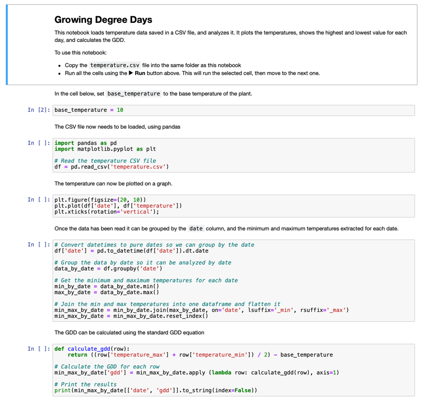

<!--
CO_OP_TRANSLATOR_METADATA:
{
  "original_hash": "1e21b012c6685f8bf73e0e76cdca3347",
  "translation_date": "2025-08-27T23:20:58+00:00",
  "source_file": "2-farm/lessons/1-predict-plant-growth/assignment.md",
  "language_code": "hu"
}
-->
# GDD adatok vizualizálása Jupyter Notebook segítségével

## Útmutató

Ebben a leckében IoT szenzor segítségével gyűjtöttél GDD adatokat. Ahhoz, hogy jó GDD adatokat kapj, több napra vonatkozó adatokat kell gyűjtened. A hőmérsékleti adatok vizualizálásához és a GDD kiszámításához olyan eszközöket használhatsz, mint a [Jupyter Notebooks](https://jupyter.org), amelyek segítenek az adatok elemzésében.

Kezdd azzal, hogy néhány napra vonatkozó adatokat gyűjtesz. Biztosítanod kell, hogy a szerver kódod folyamatosan fusson, amíg az IoT eszközöd működik. Ezt megteheted például az energiafelügyeleti beállítások módosításával, vagy egy olyan szkript futtatásával, mint [ez a Python script, amely aktívan tartja a rendszert](https://github.com/jaqsparow/keep-system-active).

Miután megvannak a hőmérsékleti adatok, használhatod a Jupyter Notebookot ebben a repóban, hogy vizualizáld az adatokat és kiszámítsd a GDD-t. A Jupyter notebookok kódot és utasításokat kevernek *cellákban*, gyakran Python kóddal. Elolvashatod az utasításokat, majd egyenként futtathatod a kódblokkokat. A kódot szerkesztheted is. Ebben a notebookban például módosíthatod az alap hőmérsékletet, amelyet a növényed GDD-jének kiszámításához használsz.

1. Hozz létre egy `gdd-calculation` nevű mappát.

1. Töltsd le a [gdd.ipynb](./code-notebook/gdd.ipynb) fájlt, és másold be a `gdd-calculation` mappába.

1. Másold be az MQTT szerver által létrehozott `temperature.csv` fájlt.

1. Hozz létre egy új Python virtuális környezetet a `gdd-calculation` mappában.

1. Telepíts néhány pip csomagot a Jupyter notebookokhoz, valamint az adatok kezeléséhez és ábrázolásához szükséges könyvtárakat:

    ```sh
    pip install --upgrade pip
    pip install pandas
    pip install matplotlib
    pip install jupyter
    ```

1. Futtasd a notebookot Jupyterben:

    ```sh
    jupyter notebook gdd.ipynb
    ```

    A Jupyter elindul, és megnyitja a notebookot a böngésződben. Kövesd a notebookban található utasításokat, hogy vizualizáld a mért hőmérsékleteket, és kiszámítsd a növekedési foknapokat (GDD).

    

## Értékelési szempontok

| Kritérium | Kiváló | Megfelelő | Fejlesztésre szorul |
| --------- | ------- | --------- | ------------------- |
| Adatgyűjtés | Legalább 2 teljes nap adatainak gyűjtése | Legalább 1 teljes nap adatainak gyűjtése | Néhány adat gyűjtése |
| GDD számítása | A notebook sikeres futtatása és a GDD kiszámítása | A notebook sikeres futtatása | Nem sikerült futtatni a notebookot |

---

**Felelősség kizárása**:  
Ez a dokumentum az AI fordítási szolgáltatás, a [Co-op Translator](https://github.com/Azure/co-op-translator) segítségével lett lefordítva. Bár törekszünk a pontosságra, kérjük, vegye figyelembe, hogy az automatikus fordítások hibákat vagy pontatlanságokat tartalmazhatnak. Az eredeti dokumentum az eredeti nyelvén tekintendő hiteles forrásnak. Kritikus információk esetén javasolt professzionális emberi fordítást igénybe venni. Nem vállalunk felelősséget semmilyen félreértésért vagy téves értelmezésért, amely a fordítás használatából eredhet.