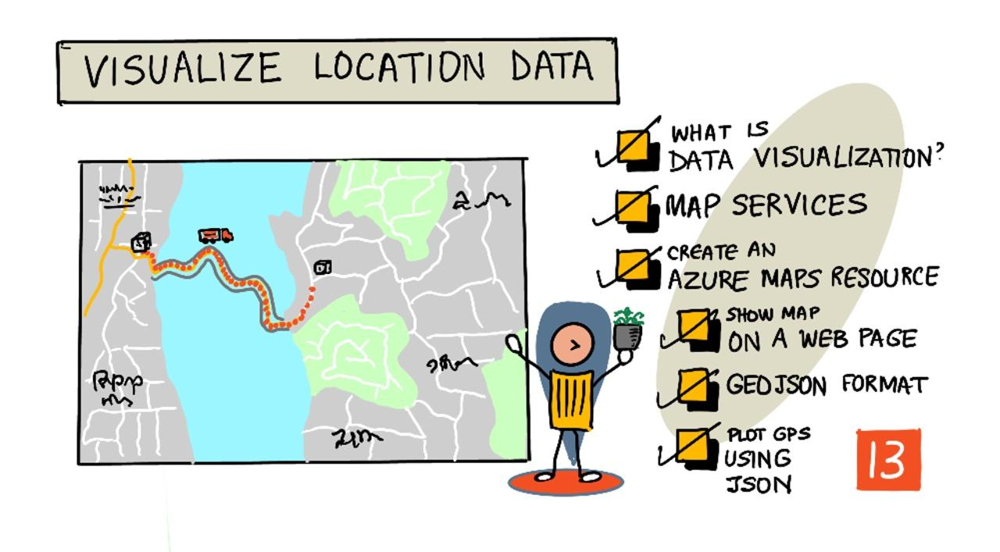

<!--
CO_OP_TRANSLATOR_METADATA:
{
  "original_hash": "9095c61445c2bca7245ef9b59a186a11",
  "translation_date": "2025-08-27T21:50:37+00:00",
  "source_file": "3-transport/lessons/3-visualize-location-data/README.md",
  "language_code": "hu"
}
-->
# Helyadatok vizualizálása



> Sketchnote készítette: [Nitya Narasimhan](https://github.com/nitya). Kattints a képre a nagyobb verzióért.

Ez a videó áttekintést nyújt az Azure Maps és IoT szolgáltatásról, amelyet ebben a leckében fogunk tárgyalni.

[](https://www.youtube.com/watch?v=P5i2GFTtb2s)

> 🎥 Kattints a fenti képre a videó megtekintéséhez

## Előadás előtti kvíz

[Előadás előtti kvíz](https://black-meadow-040d15503.1.azurestaticapps.net/quiz/25)

## Bevezetés

Az előző leckében megtanultad, hogyan gyűjts GPS adatokat az érzékelőidről, és hogyan mentsd el őket a felhőbe egy tárolóba szerver nélküli kód segítségével. Most felfedezheted, hogyan lehet ezeket a pontokat megjeleníteni egy Azure térképen. Megtanulod, hogyan hozz létre térképet egy weboldalon, megismered a GeoJSON adatformátumot, és megtudod, hogyan használhatod azt az összegyűjtött GPS pontok térképen való ábrázolására.

Ebben a leckében az alábbiakat fogjuk tárgyalni:

* [Mi az adatvizualizáció](../../../../../3-transport/lessons/3-visualize-location-data)
* [Térképszolgáltatások](../../../../../3-transport/lessons/3-visualize-location-data)
* [Azure Maps erőforrás létrehozása](../../../../../3-transport/lessons/3-visualize-location-data)
* [Térkép megjelenítése weboldalon](../../../../../3-transport/lessons/3-visualize-location-data)
* [A GeoJSON formátum](../../../../../3-transport/lessons/3-visualize-location-data)
* [GPS adatok ábrázolása térképen GeoJSON segítségével](../../../../../3-transport/lessons/3-visualize-location-data)

> 💁 Ez a lecke egy kis mennyiségű HTML és JavaScript használatát igényli. Ha többet szeretnél megtudni a webfejlesztésről HTML és JavaScript segítségével, nézd meg a [Webfejlesztés kezdőknek](https://github.com/microsoft/Web-Dev-For-Beginners) című anyagot.

## Mi az adatvizualizáció

Az adatvizualizáció, ahogy a neve is sugallja, az adatok olyan módon történő megjelenítéséről szól, amely megkönnyíti az emberek számára azok megértését. Általában diagramokkal és grafikonokkal társítják, de bármilyen képi ábrázolás, amely segíti az embereket az adatok jobb megértésében és döntéshozatalban.

Egy egyszerű példát véve - a farm projektnél talajnedvesség adatokat gyűjtöttél. Egy táblázat, amely az óránkénti talajnedvesség adatokat tartalmazza 2021. június 1-jén, így nézhet ki:

| Dátum            | Érték   |
| ---------------- | ------: |
| 01/06/2021 00:00 |     257 |
| 01/06/2021 01:00 |     268 |
| 01/06/2021 02:00 |     295 |
| 01/06/2021 03:00 |     305 |
| 01/06/2021 04:00 |     325 |
| 01/06/2021 05:00 |     359 |
| 01/06/2021 06:00 |     398 |
| 01/06/2021 07:00 |     410 |
| 01/06/2021 08:00 |     429 |
| 01/06/2021 09:00 |     451 |
| 01/06/2021 10:00 |     460 |
| 01/06/2021 11:00 |     452 |
| 01/06/2021 12:00 |     420 |
| 01/06/2021 13:00 |     408 |
| 01/06/2021 14:00 |     431 |
| 01/06/2021 15:00 |     462 |
| 01/06/2021 16:00 |     432 |
| 01/06/2021 17:00 |     402 |
| 01/06/2021 18:00 |     387 |
| 01/06/2021 19:00 |     360 |
| 01/06/2021 20:00 |     358 |
| 01/06/2021 21:00 |     354 |
| 01/06/2021 22:00 |     356 |
| 01/06/2021 23:00 |     362 |

Emberként ennek az adatnak a megértése nehéz lehet. Ez egy számokból álló fal, amelynek nincs jelentése. Az adatok vizualizálásának első lépéseként egy vonaldiagramon ábrázolhatjuk őket:


Ez tovább javítható egy vonal hozzáadásával, amely jelzi, hogy az automatikus öntözőrendszer bekapcsolt, amikor a talajnedvesség értéke elérte a 450-et:


Ez a diagram gyorsan megmutatja nemcsak a talajnedvesség szintjeit, hanem azokat a pontokat is, ahol az öntözőrendszer bekapcsolt.

A diagramok nem az egyetlen eszköz az adatok vizualizálására. Az időjárást követő IoT eszközök webes vagy mobilalkalmazásokban vizualizálhatják az időjárási körülményeket szimbólumokkal, például felhő szimbólummal a felhős napokra, esőfelhővel az esős napokra stb. Számos módja van az adatok vizualizálásának, sok komoly, néhány szórakoztató.

✅ Gondolj azokra a módokra, ahogyan már láttál adatokat vizualizálva. Melyik módszer volt a legérthetőbb, és melyik segített a leggyorsabban döntést hozni?

A legjobb vizualizációk lehetővé teszik az emberek számára, hogy gyorsan döntéseket hozzanak. Például egy falnyi műszer, amely ipari gépek mindenféle értékeit mutatja, nehezen feldolgozható, de egy villogó piros fény, amikor valami elromlik, lehetővé teszi az ember számára, hogy döntést hozzon. Néha a legjobb vizualizáció egy villogó fény!

GPS adatokkal dolgozva a legérthetőbb vizualizáció az lehet, ha az adatokat térképen ábrázoljuk. Egy térkép, amely például szállító teherautókat mutat, segíthet egy feldolgozóüzem dolgozóinak látni, mikor érkeznek meg a teherautók. Ha ez a térkép nemcsak a teherautók aktuális helyét mutatja, hanem információt ad a teherautó tartalmáról is, akkor az üzem dolgozói ennek megfelelően tervezhetnek - ha például egy hűtött teherautót látnak közelben, tudják, hogy helyet kell készíteniük a hűtőben.

## Térképszolgáltatások

A térképekkel való munka érdekes feladat, és sokféle térképszolgáltatás közül választhatsz, például Bing Maps, Leaflet, Open Street Maps és Google Maps. Ebben a leckében az [Azure Maps](https://azure.microsoft.com/services/azure-maps/?WT.mc_id=academic-17441-jabenn) szolgáltatást fogod megismerni, és megtanulod, hogyan jelenítheted meg GPS adataidat.


Az Azure Maps "egy gyűjteménye geospaciális szolgáltatásoknak és SDK-knak, amelyek friss térképadatokat használnak, hogy földrajzi kontextust biztosítsanak webes és mobilalkalmazások számára." A fejlesztők eszközöket kapnak gyönyörű, interaktív térképek létrehozásához, amelyek például ajánlott útvonalakat, forgalmi eseményekről szóló információkat, beltéri navigációt, keresési lehetőségeket, magassági adatokat, időjárási szolgáltatásokat és még sok mást kínálnak.

✅ Kísérletezz néhány [kódmintával térképekhez](https://docs.microsoft.com/samples/browse?WT.mc_id=academic-17441-jabenn&products=azure-maps)

A térképeket megjelenítheted üres vászonként, csempékként, műholdképként, műholdképként utakkal, különböző típusú szürkeárnyalatos térképként, domborzati árnyékolással, éjszakai nézetként vagy nagy kontrasztú térképként. Valós idejű frissítéseket kaphatsz térképeiden, ha integrálod őket az [Azure Event Grid](https://azure.microsoft.com/services/event-grid/?WT.mc_id=academic-17441-jabenn) szolgáltatással. Szabályozhatod térképeid viselkedését és megjelenését különböző vezérlők engedélyezésével, amelyek lehetővé teszik a térkép reagálását eseményekre, például csípésre, húzásra és kattintásra. A térképed megjelenését rétegek hozzáadásával szabályozhatod, amelyek buborékokat, vonalakat, sokszögeket, hőtérképeket és még sok mást tartalmazhatnak. Az általad választott SDK határozza meg, hogy melyik térképtípust valósítod meg.

Az Azure Maps API-khoz hozzáférhetsz a [REST API](https://docs.microsoft.com/javascript/api/azure-maps-rest/?WT.mc_id=academic-17441-jabenn&view=azure-maps-typescript-latest), a [Web SDK](https://docs.microsoft.com/azure/azure-maps/how-to-use-map-control?WT.mc_id=academic-17441-jabenn), vagy, ha mobilalkalmazást építesz, az [Android SDK](https://docs.microsoft.com/azure/azure-maps/how-to-use-android-map-control-library?WT.mc_id=academic-17441-jabenn&pivots=programming-language-java-android) használatával.

Ebben a leckében a webes SDK-t fogod használni, hogy térképet rajzolj és megjelenítsd az érzékelőd GPS helyadatait.

## Azure Maps erőforrás létrehozása

Az első lépés egy Azure Maps fiók létrehozása.

### Feladat - Azure Maps erőforrás létrehozása

1. Futtasd az alábbi parancsot a Terminálodban vagy Parancssorodban, hogy létrehozz egy Azure Maps erőforrást a `gps-sensor` erőforráscsoportban:

    ```sh
    az maps account create --name gps-sensor \
                           --resource-group gps-sensor \
                           --accept-tos \
                           --sku S1
    ```

    Ez létrehoz egy `gps-sensor` nevű Azure Maps erőforrást. Az alkalmazott szint az `S1`, amely egy fizetős szint, amely számos funkciót tartalmaz, de nagylelkű mennyiségű ingyenes hívást kínál.

    > 💁 Az Azure Maps használatának költségeit a [Azure Maps árképzési oldalán](https://azure.microsoft.com/pricing/details/azure-maps/?WT.mc_id=academic-17441-jabenn) tekintheted meg.

1. Szükséged lesz egy API kulcsra a térképerőforráshoz. Használd az alábbi parancsot ennek megszerzéséhez:

    ```sh
    az maps account keys list --name gps-sensor \
                              --resource-group gps-sensor \
                              --output table
    ```

    Másold ki a `PrimaryKey` értékét.

## Térkép megjelenítése weboldalon

Most megteheted a következő lépést, amely egy térkép megjelenítése egy weboldalon. Csak egy `html` fájlt fogunk használni a kis webalkalmazásodhoz; ne feledd, hogy egy éles vagy csapatkörnyezetben a webalkalmazásod valószínűleg több mozgó alkotóelemmel fog rendelkezni!

### Feladat - térkép megjelenítése weboldalon

1. Hozz létre egy index.html nevű fájlt egy mappában a számítógépeden. Adj hozzá HTML jelölést a térképhez:

    ```html
    <html>
    <head>
        <style>
            #myMap {
                width:100%;
                height:100%;
            }
        </style>
    </head>
    
    <body onload="init()">
        <div id="myMap"></div>
    </body>
    </html>
    ```

    A térkép a `myMap` `div`-ben fog betöltődni. Néhány stílus lehetővé teszi, hogy az oldal szélességét és magasságát kitöltse.

    > 🎓 A `div` egy weboldal szekciója, amely elnevezhető és stílusozható.

1. Az `<head>` nyitó tag alatt adj hozzá egy külső stíluslapot a térkép megjelenítésének szabályozásához, és egy külső szkriptet a Web SDK-ból a viselkedésének kezeléséhez:

    ```html
    <link rel="stylesheet" href="https://atlas.microsoft.com/sdk/javascript/mapcontrol/2/atlas.min.css" type="text/css" />
    <script src="https://atlas.microsoft.com/sdk/javascript/mapcontrol/2/atlas.min.js"></script>
    ```

    Ez a stíluslap tartalmazza a térkép kinézetének beállításait, és a szkriptfájl tartalmazza a térkép betöltéséhez szükséges kódot. Ennek a kódnak a hozzáadása hasonló a C++ fejlécfájlok vagy Python modulok importálásához.

1. A szkript alatt adj hozzá egy szkriptblokkot a térkép elindításához.

    ```javascript
    <script type='text/javascript'>
        function init() {
            var map = new atlas.Map('myMap', {
                center: [-122.26473, 47.73444],
                zoom: 12,
                authOptions: {
                    authType: "subscriptionKey",
                    subscriptionKey: "<subscription_key>",

                }
            });
        }
    </script>
    ```

    Cseréld ki `<subscription_key>`-t az Azure Maps fiókod API kulcsára.

    Ha megnyitod az `index.html` fájlt egy webböngészőben, egy térképet kell látnod, amely a Seattle környékére van fókuszálva.

    

    ✅ Kísérletezz a zoom és középpont paraméterekkel, hogy megváltoztasd a térkép megjelenítését. Hozzáadhatsz különböző koordinátákat, amelyek megfelelnek az adataid szélességi és hosszúsági értékeinek, hogy újraközéppontozd a térképet.

> 💁 Jobb módja a webalkalmazások helyi futtatásának, ha telepíted a [http-server](https://www.npmjs.com/package/http-server) eszközt. Ehhez szükséged lesz a [node.js](https://nodejs.org/) és [npm](https://www.npmjs.com/) telepítésére. Miután ezek az eszközök telepítve vannak, navigálj az `index.html` fájl helyére, és írd be a `http-server` parancsot. A webalkalmazás megnyílik egy helyi webszerveren [http://127.0.0.1:8080/](http://127.0.0.1:8080/).

## A GeoJSON formátum

Most, hogy a webalkalmazásod készen áll, és a térkép megjelenik, ki kell nyerned a GPS adatokat a tárolódból, és meg kell jelenítened őket egy rétegben jelölőkkel a térkép tetején. Mielőtt ezt megtennénk, nézzük meg a [GeoJSON](https://wikipedia.org/wiki/GeoJSON) formátumot, amelyet az Azure Maps igényel.

[GeoJSON](https://geojson.org/) egy nyílt szabványú JSON specifikáció, amely különleges formázást tartalmaz, amelyet földrajzi adatok kezelésére terveztek. Megismerheted, ha mintaadatokat tesztelsz a [geojson.io](https://geojson.io) segítségével, amely szintén hasznos eszköz a GeoJSON fájlok hibakereséséhez.

A GeoJSON mintaadatok így néznek ki:

```json
{
  "type": "FeatureCollection",
  "features": [
    {
      "type": "Feature",
      "geometry": {
        "type": "Point",
        "coordinates": [
          -2.10237979888916,
          57.164918677004714
        ]
      }
    }
  ]
}
```

Különösen érdekes a `Feature` objektum, amely egy `FeatureCollection`-ben van beágyazva. Ebben az objektumban található a `geometry`, amelyben a `coordinates` jelzi a szélességi és hosszúsági értékeket.

✅ Amikor GeoJSON-t építesz, figyelj a `latitude` és `longitude` sorrendjére az objektumb
✅ Az Azure Maps támogatja a standard GeoJSON-t, valamint néhány [kibővített funkciót](https://docs.microsoft.com/azure/azure-maps/extend-geojson?WT.mc_id=academic-17441-jabenn), például körök és más geometriai alakzatok rajzolását.

## GPS-adatok megjelenítése térképen GeoJSON segítségével

Most készen állsz arra, hogy felhasználd az előző leckében létrehozott tárhelyből származó adatokat. Emlékeztetőül: az adatok blob tárhelyen fájlok formájában vannak tárolva, így ezeket le kell kérned és feldolgoznod, hogy az Azure Maps használni tudja őket.

### Feladat - tárhely konfigurálása weboldalról való eléréshez

Ha hívást indítasz a tárhelyedre az adatok lekéréséhez, meglepődve tapasztalhatod, hogy hibák jelennek meg a böngésződ konzoljában. Ennek oka, hogy be kell állítanod a [CORS](https://developer.mozilla.org/docs/Web/HTTP/CORS) engedélyeket a tárhelyen, hogy külső webalkalmazások hozzáférhessenek az adatokhoz.

> 🎓 A CORS jelentése "Cross-Origin Resource Sharing" (kereszt-domain erőforrás-megosztás), és általában biztonsági okokból explicit módon kell beállítani az Azure-ban. Ez megakadályozza, hogy nem várt webhelyek hozzáférjenek az adataidhoz.

1. Futtasd az alábbi parancsot a CORS engedélyezéséhez:

    ```sh
    az storage cors add --methods GET \
                        --origins "*" \
                        --services b \
                        --account-name <storage_name> \
                        --account-key <key1>
    ```

    Cseréld ki `<storage_name>`-t a tárhelyfiókod nevére, és `<key1>`-et a tárhelyfiókod kulcsára.

    Ez a parancs lehetővé teszi, hogy bármely weboldal (a `*` joker karakter azt jelenti, hogy bármelyik) *GET* kérést indítson, azaz adatokat kérjen le a tárhelyfiókodból. A `--services b` azt jelenti, hogy ez a beállítás csak a blobokra vonatkozik.

### Feladat - GPS-adatok betöltése a tárhelyről

1. Cseréld ki az `init` függvény teljes tartalmát az alábbi kóddal:

    ```javascript
    fetch("https://<storage_name>.blob.core.windows.net/gps-data/?restype=container&comp=list")
        .then(response => response.text())
        .then(str => new window.DOMParser().parseFromString(str, "text/xml"))
        .then(xml => {
            let blobList = Array.from(xml.querySelectorAll("Url"));
                blobList.forEach(async blobUrl => {
                    loadJSON(blobUrl.innerHTML)                
        });
    })
    .then( response => {
        map = new atlas.Map('myMap', {
            center: [-122.26473, 47.73444],
            zoom: 14,
            authOptions: {
                authType: "subscriptionKey",
                subscriptionKey: "<subscription_key>",
    
            }
        });
        map.events.add('ready', function () {
            var source = new atlas.source.DataSource();
            map.sources.add(source);
            map.layers.add(new atlas.layer.BubbleLayer(source));
            source.add(features);
        })
    })
    ```

    Cseréld ki `<storage_name>`-t a tárhelyfiókod nevére, és `<subscription_key>`-t az Azure Maps fiókod API kulcsára.

    Itt több dolog történik. Először a kód lekéri a GPS-adatokat a blob tárolóból egy URL végpont segítségével, amelyet a tárhelyfiókod neve alapján épít fel. Ez az URL a `gps-data`-ból kér le adatokat, jelezve, hogy az erőforrás típusa egy tároló (`restype=container`), és listázza az összes blob információit. Ez a lista nem magukat a blobokat adja vissza, hanem minden blobhoz egy URL-t, amelyet az adatok betöltésére lehet használni.

    > 💁 Ezt az URL-t beírhatod a böngésződbe, hogy megnézd a tárolóban lévő összes blob részleteit. Minden elemnek lesz egy `Url` tulajdonsága, amelyet szintén betölthetsz a böngésződbe, hogy megnézd a blob tartalmát.

    Ezután a kód betölti az egyes blobokat, meghívva egy `loadJSON` függvényt, amelyet a következő lépésben hozunk létre. Ezután létrehozza a térképvezérlőt, és kódot ad hozzá a `ready` eseményhez. Ez az esemény akkor hívódik meg, amikor a térkép megjelenik a weboldalon.

    A `ready` esemény létrehoz egy Azure Maps adatforrást - egy tárolót, amely GeoJSON adatokat tartalmaz, amelyeket később töltünk fel. Ez az adatforrás egy buborékréteg létrehozására szolgál - azaz egy sor körre a térképen, amelyek a GeoJSON-ban szereplő pontok középpontjában helyezkednek el.

1. Add hozzá a `loadJSON` függvényt a szkriptblokkhoz, az `init` függvény alá:

    ```javascript
    var map, features;

    function loadJSON(file) {
        var xhr = new XMLHttpRequest();
        features = [];
        xhr.onreadystatechange = function () {
            if (xhr.readyState === XMLHttpRequest.DONE) {
                if (xhr.status === 200) {
                    gps = JSON.parse(xhr.responseText)
                    features.push(
                        new atlas.data.Feature(new atlas.data.Point([parseFloat(gps.gps.lon), parseFloat(gps.gps.lat)]))
                    )
                }
            }
        };
        xhr.open("GET", file, true);
        xhr.send();
    }    
    ```

    Ezt a függvényt a lekérési rutin hívja meg, hogy feldolgozza a JSON adatokat, és hosszúsági és szélességi koordinátákká alakítsa GeoJSON formátumban.
    A feldolgozás után az adatok egy GeoJSON `Feature` részeként kerülnek beállításra. A térkép inicializálódik, és kis buborékok jelennek meg az adatok által kirajzolt útvonal mentén:

1. Töltsd be a HTML oldalt a böngésződbe. A térkép betöltődik, majd a GPS-adatok a tárhelyről betöltődnek, és megjelennek a térképen.

    

> 💁 Ezt a kódot megtalálod a [code](../../../../../3-transport/lessons/3-visualize-location-data/code) mappában.

---

## 🚀 Kihívás

Jó dolog statikus adatokat megjeleníteni térképen jelölőkkel. Tudod-e továbbfejleszteni ezt a webalkalmazást úgy, hogy animációt adj hozzá, és az útvonalat idővel megjelenítsd a timestampelt JSON fájlok alapján? Itt van néhány [minta](https://azuremapscodesamples.azurewebsites.net/) az animációk használatáról térképeken.

## Előadás utáni kvíz

[Előadás utáni kvíz](https://black-meadow-040d15503.1.azurestaticapps.net/quiz/26)

## Áttekintés és önálló tanulás

Az Azure Maps különösen hasznos IoT eszközökkel való munkához.

* Kutass néhány felhasználási módot az [Azure Maps dokumentációban a Microsoft Docs-on](https://docs.microsoft.com/azure/azure-maps/tutorial-iot-hub-maps?WT.mc_id=academic-17441-jabenn).
* Mélyítsd el tudásodat a térképkészítésről és útvonalpontokról az [Azure Maps első útvonaltervező alkalmazásának létrehozása önálló tanulási modulban a Microsoft Learn-en](https://docs.microsoft.com/learn/modules/create-your-first-app-with-azure-maps/?WT.mc_id=academic-17441-jabenn).

## Feladat

[Telepítsd az alkalmazásodat](assignment.md)

---

**Felelősség kizárása**:  
Ez a dokumentum az AI fordítási szolgáltatás, a [Co-op Translator](https://github.com/Azure/co-op-translator) segítségével lett lefordítva. Bár törekszünk a pontosságra, kérjük, vegye figyelembe, hogy az automatikus fordítások hibákat vagy pontatlanságokat tartalmazhatnak. Az eredeti dokumentum az eredeti nyelvén tekintendő hiteles forrásnak. Kritikus információk esetén javasolt professzionális emberi fordítást igénybe venni. Nem vállalunk felelősséget semmilyen félreértésért vagy téves értelmezésért, amely a fordítás használatából eredhet.