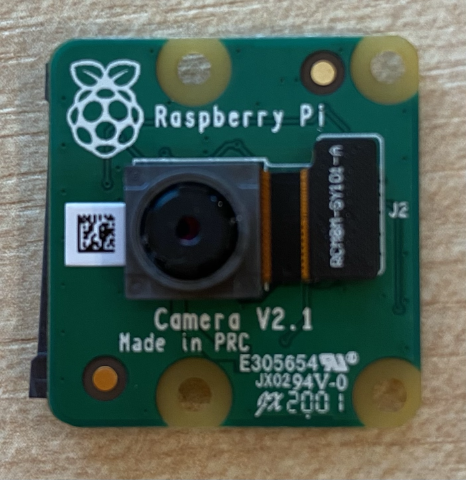

<!--
CO_OP_TRANSLATOR_METADATA:
{
  "original_hash": "c677667095f6133eee418c7e53615d05",
  "translation_date": "2025-08-27T20:54:57+00:00",
  "source_file": "4-manufacturing/lessons/2-check-fruit-from-device/pi-camera.md",
  "language_code": "hu"
}
-->
# Kép rögzítése - Raspberry Pi

Ebben a leckében hozzáadunk egy kamerát a Raspberry Pi-hez, és képeket olvasunk be róla.

## Hardver

A Raspberry Pi-hez kamera szükséges.

Az általad használt kamera a [Raspberry Pi Camera Module](https://www.raspberrypi.org/products/camera-module-v2/). Ez a kamera kifejezetten a Raspberry Pi-hez készült, és egy dedikált csatlakozón keresztül kapcsolódik a Pi-hez.

> 💁 Ez a kamera a [Camera Serial Interface, a Mobile Industry Processor Interface Alliance protokollját](https://wikipedia.org/wiki/Camera_Serial_Interface) használja, amelyet MIPI-CSI néven ismernek. Ez egy dedikált protokoll a képek továbbítására.

## A kamera csatlakoztatása

A kamerát egy szalagkábel segítségével lehet csatlakoztatni a Raspberry Pi-hez.

### Feladat - a kamera csatlakoztatása



1. Kapcsolja ki a Pi-t.

1. Csatlakoztassa a kamerához mellékelt szalagkábelt a kamerához. Ehhez óvatosan húzza ki a fekete műanyag klipet a tartóból, hogy kissé kijöjjön, majd csúsztassa be a kábelt a foglalatba úgy, hogy a kék oldal a lencsétől elfelé, a fém érintkezők pedig a lencse felé nézzenek. Miután teljesen behelyezte, nyomja vissza a fekete műanyag klipet a helyére.

    Az animáció, amely bemutatja, hogyan kell kinyitni a klipet és behelyezni a kábelt, megtalálható a [Raspberry Pi Getting Started with the Camera module dokumentációban](https://projects.raspberrypi.org/en/projects/getting-started-with-picamera/2).

    

1. Távolítsa el a Grove Base Hat-et a Pi-ről.

1. Vezesse át a szalagkábelt a Grove Base Hat kamera nyílásán. Ügyeljen arra, hogy a kábel kék oldala az **A0**, **A1** stb. analóg portok felé nézzen.

    

1. Helyezze be a szalagkábelt a Pi kamera portjába. Ismét húzza fel a fekete műanyag klipet, helyezze be a kábelt, majd nyomja vissza a klipet. A kábel kék oldala az USB és ethernet portok felé nézzen.

    

1. Szerelje vissza a Grove Base Hat-et.

## A kamera programozása

A Raspberry Pi most már programozható, hogy használja a kamerát a [PiCamera](https://pypi.org/project/picamera/) Python könyvtár segítségével.

### Feladat - régi kamera mód engedélyezése

Sajnos a Raspberry Pi OS Bullseye kiadásával megváltozott az operációs rendszerhez tartozó kamera szoftver, ami miatt alapértelmezés szerint a PiCamera már nem működik. Egy új verzió készül, PiCamera2 néven, de ez még nem áll készen a használatra.

Egyelőre beállíthatja a Pi-t régi kamera módba, hogy a PiCamera működjön. A kamera foglalat alapértelmezés szerint le van tiltva, de a régi kamera szoftver bekapcsolása automatikusan engedélyezi a foglalatot.

1. Kapcsolja be a Pi-t, és várja meg, amíg elindul.

1. Indítsa el a VS Code-ot, akár közvetlenül a Pi-n, akár a Remote SSH bővítmény segítségével csatlakozva.

1. Futtassa a következő parancsokat a terminálból:

    ```sh
    sudo raspi-config nonint do_legacy 0
    sudo reboot
    ```

    Ez engedélyezi a régi kamera szoftvert, majd újraindítja a Pi-t, hogy a beállítás érvénybe lépjen.

1. Várja meg, amíg a Pi újraindul, majd indítsa újra a VS Code-ot.

### Feladat - a kamera programozása

Programozza az eszközt.

1. A terminálból hozzon létre egy új mappát a `pi` felhasználó otthoni könyvtárában `fruit-quality-detector` néven. Hozzon létre egy fájlt ebben a mappában `app.py` néven.

1. Nyissa meg ezt a mappát a VS Code-ban.

1. A kamerával való interakcióhoz használhatja a PiCamera Python könyvtárat. Telepítse a Pip csomagot a következő parancs segítségével:

    ```sh
    pip3 install picamera
    ```

1. Adja hozzá a következő kódot az `app.py` fájlhoz:

    ```python
    import io
    import time
    from picamera import PiCamera
    ```

    Ez a kód importálja a szükséges könyvtárakat, beleértve a `PiCamera` könyvtárat.

1. Adja hozzá a következő kódot alatta a kamera inicializálásához:

    ```python
    camera = PiCamera()
    camera.resolution = (640, 480)
    camera.rotation = 0
    
    time.sleep(2)
    ```

    Ez a kód létrehoz egy PiCamera objektumot, és beállítja a felbontást 640x480-ra. Bár nagyobb felbontások is támogatottak (akár 3280x2464), az image classifier sokkal kisebb képeken (227x227) dolgozik, így nincs szükség nagyobb képek rögzítésére és küldésére.

    A `camera.rotation = 0` sor beállítja a kép forgatását. A szalagkábel a kamera aljába csatlakozik, de ha a kamerát elforgatta, hogy könnyebben ráirányítsa a kívánt tárgyra, akkor ezt a sort a forgatás szögének megfelelően módosíthatja.

    

    Például, ha a szalagkábelt úgy helyezi el, hogy a kamera tetején legyen, állítsa a forgatást 180 fokra:

    ```python
    camera.rotation = 180
    ```

    A kamera néhány másodpercet igényel az indításhoz, ezért van szükség a `time.sleep(2)` sorra.

1. Adja hozzá a következő kódot alatta, hogy a képet bináris adatként rögzítse:

    ```python
    image = io.BytesIO()
    camera.capture(image, 'jpeg')
    image.seek(0)
    ```

    Ez a kód létrehoz egy `BytesIO` objektumot bináris adatok tárolására. A képet JPEG fájlként olvassa be a kamerából, és ebben az objektumban tárolja. Az objektumnak van egy pozíciójelzője, amely megmutatja, hol tart az adatokban, így további adatok hozzáadhatók a végéhez, ha szükséges. A `image.seek(0)` sor visszaállítja ezt a pozíciót az elejére, hogy később az összes adatot el lehessen olvasni.

1. Alatta adja hozzá a következőt, hogy a képet fájlba mentse:

    ```python
    with open('image.jpg', 'wb') as image_file:
        image_file.write(image.read())
    ```

    Ez a kód megnyit egy `image.jpg` nevű fájlt írásra, majd az összes adatot kiolvassa a `BytesIO` objektumból, és ezt a fájlba írja.

    > 💁 A képet közvetlenül fájlba is rögzítheti a `camera.capture` hívásnak fájlnevet megadva. Azért használjuk a `BytesIO` objektumot, hogy a későbbiekben a képet elküldhessük az image classifier-nek.

1. Irányítsa a kamerát valamire, és futtassa ezt a kódot.

1. Egy kép rögzítésre kerül, és `image.jpg` néven mentésre kerül az aktuális mappába. Ezt a fájlt látni fogja a VS Code böngészőjében. Válassza ki a fájlt, hogy megtekintse a képet. Ha forgatásra van szükség, módosítsa a `camera.rotation = 0` sort, és készítsen új képet.

> 💁 Ezt a kódot megtalálja a [code-camera/pi](../../../../../4-manufacturing/lessons/2-check-fruit-from-device/code-camera/pi) mappában.

😀 Sikerült a kamera programozása!

---

**Felelősség kizárása**:  
Ez a dokumentum az AI fordítási szolgáltatás [Co-op Translator](https://github.com/Azure/co-op-translator) segítségével lett lefordítva. Bár törekszünk a pontosságra, kérjük, vegye figyelembe, hogy az automatikus fordítások hibákat vagy pontatlanságokat tartalmazhatnak. Az eredeti dokumentum az eredeti nyelvén tekintendő hiteles forrásnak. Kritikus információk esetén javasolt professzionális emberi fordítást igénybe venni. Nem vállalunk felelősséget semmilyen félreértésért vagy téves értelmezésért, amely a fordítás használatából eredhet.