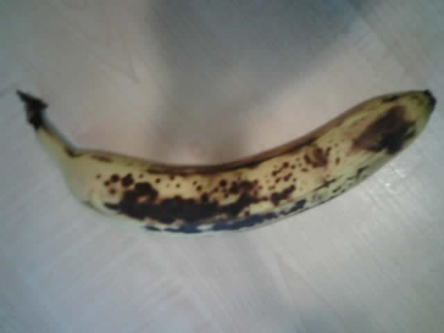

<!--
CO_OP_TRANSLATOR_METADATA:
{
  "original_hash": "160be8c0f558687f6686dca64f10f739",
  "translation_date": "2025-08-27T20:57:34+00:00",
  "source_file": "4-manufacturing/lessons/2-check-fruit-from-device/wio-terminal-camera.md",
  "language_code": "hu"
}
-->
# Kép rögzítése - Wio Terminal

A lecke ezen részében egy kamerát csatlakoztatsz a Wio Terminalhoz, és képeket készítesz vele.

## Hardver

A Wio Terminalhoz szükség van egy kamerára.

A kamera, amit használni fogsz, az [ArduCam Mini 2MP Plus](https://www.arducam.com/product/arducam-2mp-spi-camera-b0067-arduino/). Ez egy 2 megapixeles kamera, amely az OV2640 képérzékelőn alapul. SPI interfészen keresztül kommunikál a képek rögzítéséhez, és I2C-t használ az érzékelő konfigurálásához.

## A kamera csatlakoztatása

Az ArduCam nem rendelkezik Grove csatlakozóval, helyette az SPI és I2C buszokhoz csatlakozik a Wio Terminal GPIO tüskéin keresztül.

### Feladat - a kamera csatlakoztatása

Csatlakoztasd a kamerát.


1. Az ArduCam alján található tüskéket a Wio Terminal GPIO tüskéihez kell csatlakoztatni. Hogy könnyebben megtaláld a megfelelő tüskéket, helyezd fel a Wio Terminalhoz mellékelt GPIO tüske matricát a tüskék köré:

    

1. Használj jumper kábeleket az alábbi csatlakozásokhoz:

    | ArduCAM tüske | Wio Terminal tüske | Leírás                                  |
    | ------------- | ------------------- | --------------------------------------- |
    | CS            | 24 (SPI_CS)        | SPI Chip Select                         |
    | MOSI          | 19 (SPI_MOSI)      | SPI Vezérlő kimenet, periféria bemenet  |
    | MISO          | 21 (SPI_MISO)      | SPI Vezérlő bemenet, periféria kimenet  |
    | SCK           | 23 (SPI_SCLK)      | SPI Soros órajel                        |
    | GND           | 6 (GND)            | Föld - 0V                               |
    | VCC           | 4 (5V)             | 5V tápfeszültség                        |
    | SDA           | 3 (I2C1_SDA)       | I2C Soros adat                          |
    | SCL           | 5 (I2C1_SCL)       | I2C Soros órajel                        |

    

    A GND és VCC csatlakozások 5V tápfeszültséget biztosítanak az ArduCam számára. Ez 5V-on működik, ellentétben a Grove érzékelőkkel, amelyek 3V-on működnek. Ez az energia közvetlenül az USB-C csatlakozóról érkezik, amely a készüléket táplálja.

    > 💁 Az SPI csatlakozásnál az ArduCam tüske címkéi és a Wio Terminal kódban használt tüske nevei még a régi elnevezési konvenciót használják. A lecke utasításai az új elnevezési konvenciót használják, kivéve, ha a tüske nevei kódban szerepelnek.

1. Most már csatlakoztathatod a Wio Terminalt a számítógépedhez.

## Az eszköz programozása a kamera csatlakoztatásához

A Wio Terminal most már programozható az ArduCAM kamera használatára.

### Feladat - az eszköz programozása a kamera csatlakoztatásához

1. Hozz létre egy új Wio Terminal projektet a PlatformIO segítségével. Nevezd el a projektet `fruit-quality-detector` névre. Adj hozzá kódot a `setup` függvényben a soros port konfigurálásához.

1. Adj hozzá kódot a WiFi-hez való csatlakozáshoz, a WiFi hitelesítési adataiddal egy `config.h` nevű fájlban. Ne felejtsd el hozzáadni a szükséges könyvtárakat a `platformio.ini` fájlhoz.

1. Az ArduCam könyvtár nem érhető el Arduino könyvtárként, amelyet a `platformio.ini` fájlból lehetne telepíteni. Ehelyett a GitHub oldalukról kell telepíteni forrásból. Ezt az alábbi módokon szerezheted be:

    * Klónozd a repót innen: [https://github.com/ArduCAM/Arduino.git](https://github.com/ArduCAM/Arduino.git)
    * Látogass el a GitHub repóra: [github.com/ArduCAM/Arduino](https://github.com/ArduCAM/Arduino), és töltsd le a kódot zip fájlként a **Code** gombra kattintva.

1. Csak az `ArduCAM` mappára van szükséged ebből a kódból. Másold az egész mappát a projekted `lib` mappájába.

    > ⚠️ Az egész mappát másold, hogy a kód a `lib/ArduCam` mappában legyen. Ne csak az `ArduCam` mappa tartalmát másold a `lib` mappába, hanem az egész mappát.

1. Az ArduCam könyvtár kódja többféle kamerához működik. A használni kívánt kamera típusát fordítási zászlókkal kell konfigurálni - ez a lehető legkisebbre csökkenti a lefordított könyvtár méretét azáltal, hogy eltávolítja a nem használt kamerákhoz tartozó kódot. Az OV2640 kamerához való konfiguráláshoz add hozzá a következőket a `platformio.ini` fájl végéhez:

    ```ini
    build_flags =
        -DARDUCAM_SHIELD_V2
        -DOV2640_CAM
    ```

    Ez két fordítási zászlót állít be:

      * `ARDUCAM_SHIELD_V2` - ezzel jelezve a könyvtárnak, hogy a kamera egy Arduino táblán van, amit shield-nek neveznek.
      * `OV2640_CAM` - ezzel jelezve a könyvtárnak, hogy csak az OV2640 kamerához tartozó kódot tartalmazza.

1. Adj hozzá egy fejlécfájlt a `src` mappába `camera.h` néven. Ez tartalmazza a kamerával való kommunikációhoz szükséges kódot. Add hozzá a következő kódot ebbe a fájlba:

    ```cpp
    #pragma once
    
    #include <ArduCAM.h>
    #include <Wire.h>
    
    class Camera
    {
    public:
        Camera(int format, int image_size) : _arducam(OV2640, PIN_SPI_SS)
        {
            _format = format;
            _image_size = image_size;
        }
    
        bool init()
        {
            // Reset the CPLD
            _arducam.write_reg(0x07, 0x80);
            delay(100);
    
            _arducam.write_reg(0x07, 0x00);
            delay(100);
    
            // Check if the ArduCAM SPI bus is OK
            _arducam.write_reg(ARDUCHIP_TEST1, 0x55);
            if (_arducam.read_reg(ARDUCHIP_TEST1) != 0x55)
            {
                return false;
            }
                
            // Change MCU mode
            _arducam.set_mode(MCU2LCD_MODE);
    
            uint8_t vid, pid;
    
            // Check if the camera module type is OV2640
            _arducam.wrSensorReg8_8(0xff, 0x01);
            _arducam.rdSensorReg8_8(OV2640_CHIPID_HIGH, &vid);
            _arducam.rdSensorReg8_8(OV2640_CHIPID_LOW, &pid);
            if ((vid != 0x26) && ((pid != 0x41) || (pid != 0x42)))
            {
                return false;
            }
            
            _arducam.set_format(_format);
            _arducam.InitCAM();
            _arducam.OV2640_set_JPEG_size(_image_size);
            _arducam.OV2640_set_Light_Mode(Auto);
            _arducam.OV2640_set_Special_effects(Normal);
            delay(1000);
    
            return true;
        }
    
        void startCapture()
        {
            _arducam.flush_fifo();
            _arducam.clear_fifo_flag();
            _arducam.start_capture();
        }
    
        bool captureReady()
        {
            return _arducam.get_bit(ARDUCHIP_TRIG, CAP_DONE_MASK);
        }
    
        bool readImageToBuffer(byte **buffer, uint32_t &buffer_length)
        {
            if (!captureReady()) return false;
    
            // Get the image file length
            uint32_t length = _arducam.read_fifo_length();
            buffer_length = length;
    
            if (length >= MAX_FIFO_SIZE)
            {
                return false;
            }
            if (length == 0)
            {
                return false;
            }
    
            // create the buffer
            byte *buf = new byte[length];
    
            uint8_t temp = 0, temp_last = 0;
            int i = 0;
            uint32_t buffer_pos = 0;
            bool is_header = false;
    
            _arducam.CS_LOW();
            _arducam.set_fifo_burst();
            
            while (length--)
            {
                temp_last = temp;
                temp = SPI.transfer(0x00);
                //Read JPEG data from FIFO
                if ((temp == 0xD9) && (temp_last == 0xFF)) //If find the end ,break while,
                {
                    buf[buffer_pos] = temp;
    
                    buffer_pos++;
                    i++;
                    
                    _arducam.CS_HIGH();
                }
                if (is_header == true)
                {
                    //Write image data to buffer if not full
                    if (i < 256)
                    {
                        buf[buffer_pos] = temp;
                        buffer_pos++;
                        i++;
                    }
                    else
                    {
                        _arducam.CS_HIGH();
    
                        i = 0;
                        buf[buffer_pos] = temp;
    
                        buffer_pos++;
                        i++;
    
                        _arducam.CS_LOW();
                        _arducam.set_fifo_burst();
                    }
                }
                else if ((temp == 0xD8) & (temp_last == 0xFF))
                {
                    is_header = true;
    
                    buf[buffer_pos] = temp_last;
                    buffer_pos++;
                    i++;
    
                    buf[buffer_pos] = temp;
                    buffer_pos++;
                    i++;
                }
            }
            
            _arducam.clear_fifo_flag();
    
            _arducam.set_format(_format);
            _arducam.InitCAM();
            _arducam.OV2640_set_JPEG_size(_image_size);
    
            // return the buffer
            *buffer = buf;
        }
    
    private:
        ArduCAM _arducam;
        int _format;
        int _image_size;
    };
    ```

    Ez egy alacsony szintű kód, amely az ArduCam könyvtárakat használja a kamera konfigurálásához, és a képek kinyeréséhez az SPI buszon keresztül. Ez a kód nagyon specifikus az ArduCamhoz, így nem szükséges részletesen megértened, hogyan működik.

1. A `main.cpp` fájlban add hozzá a következő kódot a többi `include` utasítás alá, hogy beilleszd ezt az új fájlt, és létrehozz egy példányt a kamera osztályból:

    ```cpp
    #include "camera.h"

    Camera camera = Camera(JPEG, OV2640_640x480);
    ```

    Ez létrehoz egy `Camera` példányt, amely a képeket JPEG formátumban menti 640x480-as felbontásban. Bár nagyobb felbontások is támogatottak (akár 3280x2464), a képosztályozó sokkal kisebb képeken (227x227) működik, így nincs szükség nagyobb képek rögzítésére és küldésére.

1. Add hozzá a következő kódot alá, hogy definiálj egy függvényt a kamera beállításához:

    ```cpp
    void setupCamera()
    {
        pinMode(PIN_SPI_SS, OUTPUT);
        digitalWrite(PIN_SPI_SS, HIGH);
    
        Wire.begin();
        SPI.begin();
    
        if (!camera.init())
        {
            Serial.println("Error setting up the camera!");
        }
    }
    ```

    Ez a `setupCamera` függvény azzal kezdődik, hogy az SPI chip select tüskét (`PIN_SPI_SS`) magasra állítja, így a Wio Terminal lesz az SPI vezérlő. Ezután elindítja az I2C és SPI buszokat. Végül inicializálja a kamera osztályt, amely konfigurálja a kamera érzékelő beállításait, és biztosítja, hogy minden megfelelően legyen bekötve.

1. Hívd meg ezt a függvényt a `setup` függvény végén:

    ```cpp
    setupCamera();
    ```

1. Fordítsd és töltsd fel ezt a kódot, majd ellenőrizd a soros monitor kimenetét. Ha azt látod, hogy `Error setting up the camera!`, akkor ellenőrizd a kábelezést, hogy minden kábel a megfelelő tüskékhez csatlakozik-e az ArduCamon és a Wio Terminalon, és hogy minden jumper kábel megfelelően van-e rögzítve.

## Kép rögzítése

A Wio Terminal most már programozható úgy, hogy képet készítsen, amikor egy gombot megnyomsz.

### Feladat - kép rögzítése

1. A mikrokontrollerek folyamatosan futtatják a kódodat, így nem egyszerű olyan eseményt, mint például egy fénykép készítése, érzékelő nélkül elindítani. A Wio Terminal rendelkezik gombokkal, így a kamerát be lehet állítani úgy, hogy az egyik gomb megnyomásával aktiválódjon. Add hozzá a következő kódot a `setup` függvény végéhez, hogy konfiguráld a C gombot (a három felső gomb közül a legközelebbit a bekapcsoló kapcsolóhoz).

    

    ```cpp
    pinMode(WIO_KEY_C, INPUT_PULLUP);
    ```

    Az `INPUT_PULLUP` mód lényegében megfordítja a bemenetet. Például egy gomb általában alacsony jelet küld, amikor nincs megnyomva, és magas jelet, amikor meg van nyomva. Ha `INPUT_PULLUP`-ra van állítva, akkor magas jelet küld, amikor nincs megnyomva, és alacsony jelet, amikor meg van nyomva.

1. Adj hozzá egy üres függvényt a gombnyomásra való reagáláshoz a `loop` függvény előtt:

    ```cpp
    void buttonPressed()
    {
        
    }
    ```

1. Hívd meg ezt a függvényt a `loop` metódusban, amikor a gombot megnyomják:

    ```cpp
    void loop()
    {
        if (digitalRead(WIO_KEY_C) == LOW)
        {
            buttonPressed();
            delay(2000);
        }
    
        delay(200);
    }
    ```

    Ez a kulcs ellenőrzi, hogy a gomb meg van-e nyomva. Ha meg van nyomva, a `buttonPressed` függvény hívódik meg, és a ciklus 2 másodpercet késleltet. Ez azért van, hogy legyen idő a gomb felengedésére, így egy hosszú nyomás nem kerül kétszer regisztrálásra.

    > 💁 A Wio Terminal gombja `INPUT_PULLUP`-ra van állítva, így magas jelet küld, amikor nincs megnyomva, és alacsony jelet, amikor meg van nyomva.

1. Add hozzá a következő kódot a `buttonPressed` függvényhez:

    ```cpp
    camera.startCapture();
 
    while (!camera.captureReady())
        delay(100);

    Serial.println("Image captured");

    byte *buffer;
    uint32_t length;

    if (camera.readImageToBuffer(&buffer, length))
    {
        Serial.print("Image read to buffer with length ");
        Serial.println(length);

        delete(buffer);
    }
    ```

    Ez a kód elindítja a kamera rögzítést a `startCapture` hívásával. A kamera hardver nem úgy működik, hogy az adatokat azonnal visszaadja, amikor kérjük, hanem egy utasítást küldünk a rögzítés elindítására, és a kamera a háttérben dolgozik a kép rögzítésén, JPEG formátumba konvertálásán, és a kamera helyi pufferében való tárolásán. A `captureReady` hívás ezután ellenőrzi, hogy a kép rögzítése befejeződött-e.

    Miután a rögzítés befejeződött, a kép adatai a kamera pufferéből egy helyi pufferbe (bájtok tömbje) kerülnek a `readImageToBuffer` hívással. A puffer hossza ezután elküldésre kerül a soros monitorra.

1. Fordítsd és töltsd fel ezt a kódot, majd ellenőrizd a soros monitor kimenetét. Minden alkalommal, amikor megnyomod a C gombot, egy kép készül, és a kép mérete megjelenik a soros monitoron.

    ```output
    Connecting to WiFi..
    Connected!
    Image captured
    Image read to buffer with length 9224
    Image captured
    Image read to buffer with length 11272
    ```

    Különböző képek különböző méretűek lesznek. Ezek JPEG formátumban vannak tömörítve, és egy adott felbontású JPEG fájl mérete attól függ, hogy mi van a képen.

> 💁 Ezt a kódot megtalálod a [code-camera/wio-terminal](../../../../../4-manufacturing/lessons/2-check-fruit-from-device/code-camera/wio-terminal) mappában.

😀 Sikeresen készítettél képeket a Wio Terminal segítségével.

## Opcionális - a kamera képeinek ellenőrzése SD kártya segítségével

A legegyszerűbb módja annak, hogy megnézd a kamera által rögzített képeket, ha azokat egy SD kártyára írod a Wio Terminalban, majd a számítógépeden megtekinted. Ezt a lépést akkor végezd el, ha van egy szabad microSD kártyád és egy microSD kártya foglalat a számítógépedben, vagy egy adapter.

A Wio Terminal csak legfeljebb 16GB méretű microSD kártyákat támogat. Ha nagyobb SD kártyád van, az nem fog működni.

### Feladat - a kamera képeinek ellenőrzése SD kártya segítségével

1. Formázd a microSD kártyát FAT32 vagy exFAT formátumra a számítógépeden található megfelelő alkalmazásokkal (Disk Utility macOS-en, File Explorer Windows-on, vagy parancssori eszközök Linuxon).

1. Helyezd be a microSD kártyát a bekapcsoló kapcsoló alatti foglalatba. Győződj meg róla, hogy teljesen be van tolva, amíg kattan és a helyén marad. Ehhez lehet, hogy körömmel vagy egy vékony eszközzel kell megnyomnod.

1. Add hozzá a következő `include` utasításokat a `main.cpp` fájl tetejére:

    ```cpp
    #include "SD/Seeed_SD.h"
    #include <Seeed_FS.h>
    ```

1. Adj hozzá a következő függvényt a `setup` függvény elé:

    ```cpp
    void setupSDCard()
    {
        while (!SD.begin(SDCARD_SS_PIN, SDCARD_SPI))
        {
            Serial.println("SD Card Error");
        }
    }
    ```

    Ez az SPI busz használatával konfigurálja az SD kártyát.

1. Hívd meg ezt a `setup` függvényből:

    ```cpp
    setupSDCard();
    ```

1. Add hozzá a következő kódot a `buttonPressed` függvény fölé:

    ```cpp
    int fileNum = 1;

    void saveToSDCard(byte *buffer, uint32_t length)
    {
        char buff[16];
        sprintf(buff, "%d.jpg", fileNum);
        fileNum++;
    
        File outFile = SD.open(buff, FILE_WRITE );
        outFile.write(buffer, length);
        outFile.close();

        Serial.print("Image written to file ");
        Serial.println(buff);
    }
    ```

    Ez egy globális változót definiál a fájlok számához. Ez a kép fájlnevekhez használatos, így több kép rögzíthető növekvő fájlnevekkel - `1.jpg`, `2.jpg` és így tovább.

    Ezután definiálja a `saveToSDCard` függvényt, amely egy bájt adatpuffert és a puffer hosszát veszi át. Egy fájlnév jön létre a fájlszámláló segítségével, majd a fájlszámláló növekszik a következő fájlhoz. A bináris adatokat a pufferből a fájlba írja.

1. Hívd meg a `saveToSDCard` függvényt a `buttonPressed` függvényből. A hívásnak **a puffer törlése előtt** kell lennie:

    ```cpp
    Serial.print("Image read to buffer with length ");
    Serial.println(length);

    saveToSDCard(buffer, length);
    
    delete(buffer);
    ```

1. Fordítsd és töltsd fel ezt a kódot, majd ellenőrizd a soros monitor kimenetét. Minden alkalommal, amikor megnyomod a C gombot, egy kép készül, és elmentésre kerül az SD kártyára.

    ```output
    Connecting to WiFi..
    Connected!
    Image captured
    Image read to buffer with length 16392
    Image written to file 1.jpg
    Image captured
    Image read to buffer with length 14344
    Image written to file 2.jpg
    ```

1. Kapcsold ki a microSD kártyát, és távolítsd el úgy, hogy kissé benyomod, majd elengeded, és ki fog ugrani. Ehhez lehet, hogy egy vékony eszközt kell használnod. Csatlakoztasd a microSD kártyát a számítógépedhez, hogy megnézd a képeket.

    
💁 Előfordulhat, hogy néhány kép szükséges ahhoz, hogy a kamera fehéregyensúlya beálljon. Ezt az elkészített képek színe alapján fogja észrevenni, az első néhány kép színe eltérő lehet. Ezt mindig megkerülheti úgy, hogy módosítja a kódot, hogy a `setup` függvényben néhány képet készítsen, amelyeket figyelmen kívül hagy.


---

**Felelősség kizárása**:  
Ez a dokumentum az AI fordítási szolgáltatás, a [Co-op Translator](https://github.com/Azure/co-op-translator) segítségével lett lefordítva. Bár törekszünk a pontosságra, kérjük, vegye figyelembe, hogy az automatikus fordítások hibákat vagy pontatlanságokat tartalmazhatnak. Az eredeti dokumentum az eredeti nyelvén tekintendő hiteles forrásnak. Kritikus információk esetén javasolt professzionális emberi fordítást igénybe venni. Nem vállalunk felelősséget semmilyen félreértésért vagy téves értelmezésért, amely a fordítás használatából eredhet.