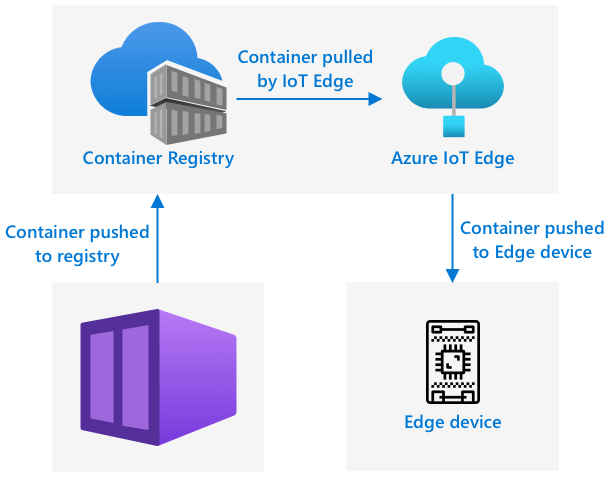

<!--
CO_OP_TRANSLATOR_METADATA:
{
  "original_hash": "2625af24587465c5547ae33d6cc000a5",
  "translation_date": "2025-08-27T20:47:16+00:00",
  "source_file": "4-manufacturing/lessons/3-run-fruit-detector-edge/README.md",
  "language_code": "hu"
}
-->
# Futtasd a gyümölcsdetektorodat az edge-en


> Vázlat: [Nitya Narasimhan](https://github.com/nitya). Kattints a képre a nagyobb verzióért.

Ez a videó áttekintést nyújt arról, hogyan futtathatók képosztályozók IoT-eszközökön, amely a lecke témája.

[](https://www.youtube.com/watch?v=_K5fqGLO8us)

## Előadás előtti kvíz

[Előadás előtti kvíz](https://black-meadow-040d15503.1.azurestaticapps.net/quiz/33)

## Bevezetés

Az előző leckében a képosztályozódat használtad arra, hogy érett és éretlen gyümölcsöket osztályozz, miközben a kamerával rögzített képet az IoT-eszközödről az interneten keresztül egy felhőszolgáltatásba küldted. Ezek a hívások időt vesznek igénybe, pénzbe kerülnek, és az általad használt képadatok típusától függően adatvédelmi kérdéseket is felvethetnek.

Ebben a leckében megtanulod, hogyan futtathatsz gépi tanulási (ML) modelleket az edge-en – azaz az IoT-eszközökön, amelyek a saját hálózatodon futnak, nem pedig a felhőben. Megismered az edge computing és a felhőalapú számítástechnika előnyeit és hátrányait, hogyan telepítheted az AI modelledet az edge-re, és hogyan érheted el azt az IoT-eszközödről.

Ebben a leckében a következőket tárgyaljuk:

* [Edge computing](../../../../../4-manufacturing/lessons/3-run-fruit-detector-edge)
* [Azure IoT Edge](../../../../../4-manufacturing/lessons/3-run-fruit-detector-edge)
* [IoT Edge-eszköz regisztrálása](../../../../../4-manufacturing/lessons/3-run-fruit-detector-edge)
* [IoT Edge-eszköz beállítása](../../../../../4-manufacturing/lessons/3-run-fruit-detector-edge)
* [Modelled exportálása](../../../../../4-manufacturing/lessons/3-run-fruit-detector-edge)
* [Konténered előkészítése telepítésre](../../../../../4-manufacturing/lessons/3-run-fruit-detector-edge)
* [Konténer telepítése](../../../../../4-manufacturing/lessons/3-run-fruit-detector-edge)
* [IoT Edge-eszköz használata](../../../../../4-manufacturing/lessons/3-run-fruit-detector-edge)

## Edge computing

Az edge computing azt jelenti, hogy az IoT-adatokat feldolgozó számítógépek a lehető legközelebb helyezkednek el az adatok keletkezési helyéhez. Ahelyett, hogy ez a feldolgozás a felhőben történne, az a felhő szélére kerül – azaz a belső hálózatodra.


Az eddigi leckékben az eszközök adatokat gyűjtöttek és küldtek a felhőbe elemzésre, ahol szerver nélküli funkciók vagy AI modellek futottak.


Az edge computing során a felhőszolgáltatások egy részét áthelyezik a felhőről az IoT-eszközökkel azonos hálózaton futó számítógépekre, és csak akkor kommunikálnak a felhővel, ha szükséges. Például AI modelleket futtathatsz edge-eszközökön, hogy elemezd a gyümölcsök érettségét, és csak az elemzéseket küldheted vissza a felhőbe, például az érett és éretlen gyümölcsök számát.

✅ Gondold át az eddig épített IoT-alkalmazásaidat. Mely részeiket lehetne áthelyezni az edge-re?

### Előnyök

Az edge computing előnyei a következők:

1. **Gyorsaság** – az edge computing ideális az időérzékeny adatokhoz, mivel a műveletek ugyanazon a hálózaton történnek, mint az eszköz, nem pedig az interneten keresztül. Ez nagyobb sebességet tesz lehetővé, mivel a belső hálózatok lényegesen gyorsabbak lehetnek, mint az internetkapcsolatok, és az adatok sokkal rövidebb távolságot tesznek meg.

    > 💁 Bár az internetkapcsolatokhoz optikai kábeleket használnak, amelyek lehetővé teszik az adatok fénysebességgel történő továbbítását, az adatoknak időbe telik, hogy a világ körül eljussanak a felhőszolgáltatókhoz. Például, ha Európából küldesz adatokat az Egyesült Államokban lévő felhőszolgáltatásokhoz, legalább 28 ms szükséges ahhoz, hogy az adatok átkeljenek az Atlanti-óceánon egy optikai kábelen, és ez nem számítja bele az időt, amely az adatok kábelhez juttatásához, az elektromos jelek fényjelekké alakításához és visszaalakításához szükséges.

    Az edge computing kevesebb hálózati forgalmat is igényel, csökkentve annak kockázatát, hogy az adatok az internetkapcsolat korlátozott sávszélessége miatt lelassuljanak.

1. **Távoli hozzáférhetőség** – az edge computing akkor is működik, ha korlátozott vagy nincs kapcsolat, vagy ha a kapcsolat túl drága ahhoz, hogy folyamatosan használjuk. Például humanitárius katasztrófa sújtotta területeken, ahol az infrastruktúra korlátozott, vagy fejlődő országokban.

1. **Alacsonyabb költségek** – az adatok gyűjtése, tárolása, elemzése és a műveletek végrehajtása az edge-eszközön csökkenti a felhőszolgáltatások használatát, ami csökkentheti az IoT-alkalmazás teljes költségét. Az utóbbi időben növekedett az edge computingra tervezett eszközök száma, például az AI-gyorsító táblák, mint az [NVIDIA Jetson Nano](https://developer.nvidia.com/embedded/jetson-nano-developer-kit), amelyek kevesebb mint 100 USD-ért képesek AI-munkaterheléseket futtatni GPU-alapú hardverrel.

1. **Adatvédelem és biztonság** – az edge computing esetében az adatok a hálózatodon maradnak, és nem kerülnek feltöltésre a felhőbe. Ez különösen előnyös érzékeny és személyazonosításra alkalmas információk esetén, mivel az adatok elemzés után nem szükségesek tárolni, ami jelentősen csökkenti az adatlopás kockázatát. Példák: orvosi adatok és biztonsági kamerafelvételek.

1. **Biztonsági hibás eszközök kezelése** – ha olyan eszközeid vannak, amelyek ismert biztonsági hibákkal rendelkeznek, és nem szeretnéd közvetlenül csatlakoztatni őket a hálózatodhoz vagy az internethez, akkor külön hálózatra csatlakoztathatod őket egy IoT Edge gateway eszközhöz. Ez az edge-eszköz csatlakozhat a szélesebb hálózathoz vagy az internethez, és kezelheti az adatáramlást.

1. **Nem kompatibilis eszközök támogatása** – ha olyan eszközeid vannak, amelyek nem tudnak csatlakozni az IoT Hubhoz, például csak HTTP-kapcsolatot támogató eszközök vagy csak Bluetooth-kapcsolattal rendelkező eszközök, akkor egy IoT edge-eszközt használhatsz gateway eszközként, amely továbbítja az üzeneteket az IoT Hubhoz.

✅ Kutass egy kicsit: Milyen más előnyei lehetnek az edge computingnak?

### Hátrányok

Az edge computing hátrányai, amikor a felhő lehet előnyösebb:

1. **Skálázhatóság és rugalmasság** – a felhőalapú számítástechnika valós időben képes alkalmazkodni a hálózati és adatigényekhez további szerverek és erőforrások hozzáadásával vagy csökkentésével. Az edge számítógépek hozzáadása manuális eszközök telepítését igényli.

1. **Megbízhatóság és ellenállóképesség** – a felhőalapú számítástechnika több szervert biztosít, gyakran több helyszínen a redundancia és a katasztrófa utáni helyreállítás érdekében. Az edge-en ugyanezen szintű redundancia eléréséhez nagy beruházásokra és sok konfigurációs munkára van szükség.

1. **Karbantartás** – a felhőszolgáltatók biztosítják a rendszer karbantartását és frissítéseit.

✅ Kutass egy kicsit: Milyen más hátrányai lehetnek az edge computingnak?

A hátrányok valójában a felhőhasználat előnyeinek ellentétei – ezeket az eszközöket magadnak kell felépítened és kezelned, ahelyett, hogy a felhőszolgáltatók szakértelmére és méretgazdaságosságára támaszkodnál.

Néhány kockázatot maga az edge computing természete enyhít. Például, ha egy edge-eszköz egy gyárban fut, amely adatokat gyűjt a gépektől, nem kell gondolnod bizonyos katasztrófa utáni helyreállítási forgatókönyvekre. Ha a gyárban elmegy az áram, akkor nincs szükség tartalék edge-eszközre, mivel azok a gépek, amelyek az adatokat generálják, szintén áram nélkül maradnak.

Az IoT-rendszerek esetében gyakran a felhő és az edge computing keverékére lesz szükséged, az egyes szolgáltatásokat a rendszer, az ügyfelek és a karbantartók igényei alapján kihasználva.

## Azure IoT Edge


Az Azure IoT Edge egy olyan szolgáltatás, amely segíthet a munkaterheléseket a felhőből az edge-re helyezni. Egy eszközt edge-eszközként állítasz be, és a felhőből kódot telepíthetsz erre az edge-eszközre. Ez lehetővé teszi a felhő és az edge képességeinek keverését.

> 🎓 A *munkaterhelések* kifejezés bármilyen szolgáltatásra utal, amely valamilyen munkát végez, például AI modellek, alkalmazások vagy szerver nélküli funkciók.

Például egy képosztályozót betaníthatsz a felhőben, majd a felhőből telepítheted egy edge-eszközre. Az IoT-eszközöd ezután képeket küld az edge-eszköznek osztályozásra, ahelyett, hogy az interneten keresztül küldené azokat. Ha egy új modellverziót kell telepítened, azt a felhőben betaníthatod, és az IoT Edge segítségével frissítheted az edge-eszközön futó modellt az új verzióra.

> 🎓 Az IoT Edge-re telepített szoftvereket *moduloknak* nevezik. Alapértelmezés szerint az IoT Edge olyan modulokat futtat, amelyek kommunikálnak az IoT Hubbal, például az `edgeAgent` és `edgeHub` modulokat. Amikor egy képosztályozót telepítesz, az egy további modulként kerül telepítésre.

Az IoT Edge be van építve az IoT Hubba, így az edge-eszközöket ugyanazzal a szolgáltatással kezelheted, amelyet az IoT-eszközök kezelésére használnál, ugyanolyan szintű biztonsággal.

Az IoT Edge kódot futtat *konténerekből* – önálló alkalmazásokból, amelyek elkülönítve futnak a számítógéped többi alkalmazásától. Amikor egy konténert futtatsz, az olyan, mintha egy külön számítógép futna a számítógépeden belül, saját szoftverrel, szolgáltatásokkal és alkalmazásokkal. A legtöbb esetben a konténerek nem férnek hozzá semmihez a számítógépeden, hacsak nem osztasz meg velük például egy mappát. A konténer ezután nyitott porton keresztül nyújt szolgáltatásokat, amelyekhez csatlakozhatsz, vagy amelyeket megoszthatsz a hálózatoddal.


Például lehet egy konténered, amely egy weboldalt futtat a 80-as porton, az alapértelmezett HTTP-porton, és ezt a számítógépedről is elérhetővé teheted a 80-as porton.

✅ Kutass egy kicsit: Olvass utána a konténereknek és olyan szolgáltatásoknak, mint a Docker vagy a Moby.

A Custom Vision segítségével letöltheted a képosztályozókat, és konténerekként telepítheted őket, akár közvetlenül egy eszközre, akár az IoT Edge-en keresztül. Miután ezek konténerben futnak, ugyanazzal a REST API-val érhetők el, mint a felhőverzió, de az endpoint az edge-eszközre mutat, amely a konténert futtatja.

## IoT Edge-eszköz regisztrálása

Ahhoz, hogy egy IoT Edge-eszközt használhass, regisztrálnod kell az IoT Hubban.

### Feladat – IoT Edge-eszköz regisztrálása

1. Hozz létre egy IoT Hubot a `fruit-quality-detector` erőforráscsoportban. Adj neki egyedi nevet, például `fruit-quality-detector`.

1. Regisztrálj egy `fruit-quality-detector-edge` nevű IoT Edge-eszközt az IoT Hubban. A parancs hasonló a nem edge-eszköz regisztrálásához, de meg kell adnod a `--edge-enabled` kapcsolót.

    ```sh
    az iot hub device-identity create --edge-enabled \
                                      --device-id fruit-quality-detector-edge \
                                      --hub-name <hub_name>
    ```

    Cseréld ki a `<hub_name>` helyére az IoT Hubod nevét.

1. Szerezd meg az eszköz kapcsolatláncát a következő parancs segítségével:

    ```sh
    az iot hub device-identity connection-string show --device-id fruit-quality-detector-edge \
                                                      --output table \
                                                      --hub-name <hub_name>
    ```

    Cseréld ki a `<hub_name>` helyére az IoT Hubod nevét.

    Másold ki a kimenetben megjelenő kapcsolatláncot.

## IoT Edge-eszköz beállítása

Miután létrehoztad az edge-eszköz regisztrációját az IoT Hubban, beállíthatod az edge-eszközt.

### Feladat – Az IoT Edge Runtime telepítése és elindítása

**Az IoT Edge runtime csak Linux konténereket futtat.** Linuxon vagy Windows-on Linux virtuális gépek használatával futtatható.

* Ha Raspberry Pi-t használsz IoT-eszközként, az támogatott Linux-verziót futtat, és képes az IoT Edge runtime futtatására. Kövesd az [Azure IoT Edge telepítése Linuxra útmutatót a Microsoft dokumentációjában](https://docs.microsoft.com/azure/iot-edge/how-to-install-iot-edge?WT.mc_id=academic-17441-jabenn), hogy telepítsd az IoT Edge-et és állítsd be a kapcsolatláncot.

    > 💁 Ne feledd, a Raspberry Pi OS a Debian Linux egy változata.

* Ha nem Raspberry Pi-t használsz, de van Linux számítógéped, futtathatod az IoT Edge runtime-ot. Kövesd az [Azure IoT Edge telepítése Linuxra útmutatót a Microsoft dokumentációjában](https://docs.microsoft.com/azure/iot-edge/how-to-install-iot-edge?WT.mc_id=academic-17441-jabenn), hogy telepítsd az IoT Edge-et és állítsd be a kapcsolatláncot.

* Ha Windows-t használsz, telepítheted az IoT Edge runtime-ot egy Linux virtu
1. Nyisd meg a Custom Vision portált a [CustomVision.ai](https://customvision.ai) oldalon, és jelentkezz be, ha még nem tetted meg. Ezután nyisd meg a `fruit-quality-detector` projektedet.

1. Válaszd ki a **Beállítások** gombot (⚙ ikon).

1. A *Domainok* listában válaszd ki a *Food (compact)* opciót.

1. Az *Exportálási lehetőségek* alatt győződj meg róla, hogy a *Basic platforms (Tensorflow, CoreML, ONNX, ...)* van kiválasztva.

1. A Beállítások oldal alján kattints a **Változtatások mentése** gombra.

1. Tanítsd újra a modellt a **Train** gombbal, és válaszd a *Gyors tanítás* opciót.

### Feladat - exportáld a modelledet

Miután a modell betanításra került, konténerként kell exportálni.

1. Válaszd ki a **Teljesítmény** fület, és keresd meg a legutóbbi iterációt, amelyet a kompakt domain használatával tanítottál.

1. Kattints a **Exportálás** gombra a tetején.

1. Válaszd ki a **DockerFile** opciót, majd válassz egy verziót, amely megfelel az edge eszközödnek:

    * Ha Linux számítógépen, Windows számítógépen vagy virtuális gépen futtatod az IoT Edge-t, válaszd a *Linux* verziót.
    * Ha Raspberry Pi-n futtatod az IoT Edge-t, válaszd az *ARM (Raspberry Pi 3)* verziót.

> 🎓 A Docker az egyik legnépszerűbb eszköz a konténerek kezelésére, és a DockerFile egy utasításkészlet arról, hogyan állítsuk be a konténert.

1. Kattints az **Exportálás** gombra, hogy a Custom Vision létrehozza a szükséges fájlokat, majd kattints a **Letöltés** gombra, hogy letöltsd őket egy zip fájlban.

1. Mentsd el a fájlokat a számítógépedre, majd csomagold ki a mappát.

## Készítsd elő a konténert a telepítéshez



Miután letöltötted a modelledet, konténerként kell felépíteni, majd feltölteni egy konténer regisztrációs helyre - egy online helyre, ahol tárolhatod a konténereket. Az IoT Edge ezután letölti a konténert a regisztrációs helyről, és telepíti az eszközödre.


A konténer regisztrációs hely, amelyet ebben a leckében használni fogsz, az Azure Container Registry. Ez nem ingyenes szolgáltatás, ezért pénzt takaríthatsz meg, ha [kitakarítod a projektedet](../../../clean-up.md), miután befejezted.

> 💁 Az Azure Container Registry használatának költségeit megtekintheted az [Azure Container Registry árképzési oldalán](https://azure.microsoft.com/pricing/details/container-registry/?WT.mc_id=academic-17441-jabenn).

### Feladat - telepítsd a Dockert

Ahhoz, hogy felépítsd és telepítsd az osztályozót, szükséged lehet a [Docker](https://www.docker.com/) telepítésére.

Csak akkor kell ezt megtenned, ha a konténert egy másik eszközről építed, mint amelyre az IoT Edge-t telepítetted - az IoT Edge telepítése részeként a Docker automatikusan telepítésre kerül.

1. Ha a Docker konténert egy másik eszközről építed, mint az IoT Edge eszközöd, kövesd a Docker telepítési utasításait a [Docker telepítési oldalán](https://www.docker.com/products/docker-desktop), hogy telepítsd a Docker Desktopot vagy a Docker motort. Győződj meg róla, hogy a telepítés után fut.

### Feladat - hozz létre egy konténer regisztrációs erőforrást

1. Futtasd az alábbi parancsot a terminálodban vagy parancssorodban, hogy létrehozz egy Azure Container Registry erőforrást:

    ```sh
    az acr create --resource-group fruit-quality-detector \
                  --sku Basic \
                  --name <Container registry name>
    ```

    Cseréld ki a `<Container registry name>` helyet egy egyedi névre a konténer regisztrációs helyed számára, csak betűket és számokat használva. Alapozd ezt a `fruitqualitydetector` névre. Ez a név az URL része lesz, amelyen keresztül elérheted a konténer regisztrációs helyet, ezért globálisan egyedinek kell lennie.

1. Jelentkezz be az Azure Container Registry-be az alábbi parancs segítségével:

    ```sh
    az acr login --name <Container registry name>
    ```

    Cseréld ki a `<Container registry name>` helyet azzal a névvel, amelyet a konténer regisztrációs helyedhez használtál.

1. Állítsd a konténer regisztrációs helyet adminisztrációs módba, hogy jelszót generálhass az alábbi parancs segítségével:

    ```sh
    az acr update --admin-enabled true \
                 --name <Container registry name>
    ```

    Cseréld ki a `<Container registry name>` helyet azzal a névvel, amelyet a konténer regisztrációs helyedhez használtál.

1. Generálj jelszavakat a konténer regisztrációs helyedhez az alábbi parancs segítségével:

    ```sh
     az acr credential renew --password-name password \
                             --output table \
                             --name <Container registry name>
    ```

    Cseréld ki a `<Container registry name>` helyet azzal a névvel, amelyet a konténer regisztrációs helyedhez használtál.

    Jegyezd fel a `PASSWORD` értékét, mert később szükséged lesz rá.

### Feladat - építsd fel a konténeredet

A Custom Vision-től letöltött fájl egy DockerFile volt, amely tartalmazza az utasításokat arról, hogyan kell felépíteni a konténert, valamint az alkalmazáskódot, amely a konténeren belül fut, hogy hosztolja a Custom Vision modelledet, és egy REST API-t biztosítson a hívásához. A Docker segítségével felépíthetsz egy címkézett konténert a DockerFile-ból, majd feltöltheted a konténer regisztrációs helyedre.

> 🎓 A konténerek címkéket kapnak, amelyek meghatározzák a nevüket és verziójukat. Ha frissíteni kell egy konténert, ugyanazzal a címkével, de újabb verzióval építheted fel.

1. Nyisd meg a terminálodat vagy parancssorodat, és navigálj a kicsomagolt modellhez, amelyet a Custom Vision-től letöltöttél.

1. Futtasd az alábbi parancsot, hogy felépítsd és címkézd az image-t:

    ```sh
    docker build --platform <platform> -t <Container registry name>.azurecr.io/classifier:v1 .
    ```

    Cseréld ki a `<platform>` helyet azzal a platformmal, amelyen a konténer futni fog. Ha Raspberry Pi-n futtatod az IoT Edge-t, állítsd `linux/armhf`-re, különben állítsd `linux/amd64`-re.

    > 💁 Ha ezt a parancsot az IoT Edge eszközödön futtatod, például Raspberry Pi-ről, kihagyhatod a `--platform <platform>` részt, mivel alapértelmezés szerint az aktuális platformot használja.

    Cseréld ki a `<Container registry name>` helyet azzal a névvel, amelyet a konténer regisztrációs helyedhez használtál.

    > 💁 Ha Linuxot vagy Raspberry Pi OS-t használsz, előfordulhat, hogy `sudo`-t kell használnod a parancs futtatásához.

    A Docker felépíti az image-t, konfigurálva az összes szükséges szoftvert. Az image ezután `classifier:v1` címkét kap.

    ```output
    ➜  d4ccc45da0bb478bad287128e1274c3c.DockerFile.Linux docker build --platform linux/amd64 -t  fruitqualitydetectorjimb.azurecr.io/classifier:v1 .
    [+] Building 102.4s (11/11) FINISHED
     => [internal] load build definition from Dockerfile
     => => transferring dockerfile: 131B
     => [internal] load .dockerignore
     => => transferring context: 2B
     => [internal] load metadata for docker.io/library/python:3.7-slim
     => [internal] load build context
     => => transferring context: 905B
     => [1/6] FROM docker.io/library/python:3.7-slim@sha256:b21b91c9618e951a8cbca5b696424fa5e820800a88b7e7afd66bba0441a764d6
     => => resolve docker.io/library/python:3.7-slim@sha256:b21b91c9618e951a8cbca5b696424fa5e820800a88b7e7afd66bba0441a764d6
     => => sha256:b4d181a07f8025e00e0cb28f1cc14613da2ce26450b80c54aea537fa93cf3bda 27.15MB / 27.15MB
     => => sha256:de8ecf497b753094723ccf9cea8a46076e7cb845f333df99a6f4f397c93c6ea9 2.77MB / 2.77MB
     => => sha256:707b80804672b7c5d8f21e37c8396f319151e1298d976186b4f3b76ead9f10c8 10.06MB / 10.06MB
     => => sha256:b21b91c9618e951a8cbca5b696424fa5e820800a88b7e7afd66bba0441a764d6 1.86kB / 1.86kB
     => => sha256:44073386687709c437586676b572ff45128ff1f1570153c2f727140d4a9accad 1.37kB / 1.37kB
     => => sha256:3d94f0f2ca798607808b771a7766f47ae62a26f820e871dd488baeccc69838d1 8.31kB / 8.31kB
     => => sha256:283715715396fd56d0e90355125fd4ec57b4f0773f306fcd5fa353b998beeb41 233B / 233B
     => => sha256:8353afd48f6b84c3603ea49d204bdcf2a1daada15f5d6cad9cc916e186610a9f 2.64MB / 2.64MB
     => => extracting sha256:b4d181a07f8025e00e0cb28f1cc14613da2ce26450b80c54aea537fa93cf3bda
     => => extracting sha256:de8ecf497b753094723ccf9cea8a46076e7cb845f333df99a6f4f397c93c6ea9
     => => extracting sha256:707b80804672b7c5d8f21e37c8396f319151e1298d976186b4f3b76ead9f10c8
     => => extracting sha256:283715715396fd56d0e90355125fd4ec57b4f0773f306fcd5fa353b998beeb41
     => => extracting sha256:8353afd48f6b84c3603ea49d204bdcf2a1daada15f5d6cad9cc916e186610a9f
     => [2/6] RUN pip install -U pip
     => [3/6] RUN pip install --no-cache-dir numpy~=1.17.5 tensorflow~=2.0.2 flask~=1.1.2 pillow~=7.2.0
     => [4/6] RUN pip install --no-cache-dir mscviplib==2.200731.16
     => [5/6] COPY app /app
     => [6/6] WORKDIR /app
     => exporting to image
     => => exporting layers
     => => writing image sha256:1846b6f134431f78507ba7c079358ed66d944c0e185ab53428276bd822400386
     => => naming to fruitqualitydetectorjimb.azurecr.io/classifier:v1
    ```

### Feladat - töltsd fel a konténeredet a konténer regisztrációs helyedre

1. Használd az alábbi parancsot, hogy feltöltsd a konténeredet a konténer regisztrációs helyedre:

    ```sh
    docker push <Container registry name>.azurecr.io/classifier:v1
    ```

    Cseréld ki a `<Container registry name>` helyet azzal a névvel, amelyet a konténer regisztrációs helyedhez használtál.

    > 💁 Ha Linuxot használsz, előfordulhat, hogy `sudo`-t kell használnod a parancs futtatásához.

    A konténer feltöltésre kerül a konténer regisztrációs helyre.

    ```output
    ➜  d4ccc45da0bb478bad287128e1274c3c.DockerFile.Linux docker push fruitqualitydetectorjimb.azurecr.io/classifier:v1
    The push refers to repository [fruitqualitydetectorjimb.azurecr.io/classifier]
    5f70bf18a086: Pushed 
    8a1ba9294a22: Pushed 
    56cf27184a76: Pushed 
    b32154f3f5dd: Pushed 
    36103e9a3104: Pushed 
    e2abb3cacca0: Pushed 
    4213fd357bbe: Pushed 
    7ea163ba4dce: Pushed 
    537313a13d90: Pushed 
    764055ebc9a7: Pushed 
    v1: digest: sha256:ea7894652e610de83a5a9e429618e763b8904284253f4fa0c9f65f0df3a5ded8 size: 2423
    ```

1. A feltöltés ellenőrzéséhez listázhatod a konténereket a regisztrációs helyeden az alábbi parancs segítségével:

    ```sh
    az acr repository list --output table \
                           --name <Container registry name> 
    ```

    Cseréld ki a `<Container registry name>` helyet azzal a névvel, amelyet a konténer regisztrációs helyedhez használtál.

    ```output
    ➜  d4ccc45da0bb478bad287128e1274c3c.DockerFile.Linux az acr repository list --name fruitqualitydetectorjimb --output table
    Result
    ----------
    classifier
    ```

    Az outputban látni fogod az osztályozódat.

## Telepítsd a konténeredet

A konténered most telepíthető az IoT Edge eszközödre. A telepítéshez létre kell hoznod egy telepítési manifestet - egy JSON dokumentumot, amely felsorolja az edge eszközre telepítendő modulokat.

### Feladat - hozz létre egy telepítési manifestet

1. Hozz létre egy új fájlt `deployment.json` néven valahol a számítógépeden.

1. Add hozzá az alábbiakat a fájlhoz:

    ```json
    {
        "content": {
            "modulesContent": {
                "$edgeAgent": {
                    "properties.desired": {
                        "schemaVersion": "1.1",
                        "runtime": {
                            "type": "docker",
                            "settings": {
                                "minDockerVersion": "v1.25",
                                "loggingOptions": "",
                                "registryCredentials": {
                                    "ClassifierRegistry": {
                                        "username": "<Container registry name>",
                                        "password": "<Container registry password>",
                                        "address": "<Container registry name>.azurecr.io"
                                      }
                                }
                            }
                        },
                        "systemModules": {
                            "edgeAgent": {
                                "type": "docker",
                                "settings": {
                                    "image": "mcr.microsoft.com/azureiotedge-agent:1.1",
                                    "createOptions": "{}"
                                }
                            },
                            "edgeHub": {
                                "type": "docker",
                                "status": "running",
                                "restartPolicy": "always",
                                "settings": {
                                    "image": "mcr.microsoft.com/azureiotedge-hub:1.1",
                                    "createOptions": "{\"HostConfig\":{\"PortBindings\":{\"5671/tcp\":[{\"HostPort\":\"5671\"}],\"8883/tcp\":[{\"HostPort\":\"8883\"}],\"443/tcp\":[{\"HostPort\":\"443\"}]}}}"
                                }
                            }
                        },
                        "modules": {
                            "ImageClassifier": {
                                "version": "1.0",
                                "type": "docker",
                                "status": "running",
                                "restartPolicy": "always",
                                "settings": {
                                    "image": "<Container registry name>.azurecr.io/classifier:v1",
                                    "createOptions": "{\"ExposedPorts\": {\"80/tcp\": {}},\"HostConfig\": {\"PortBindings\": {\"80/tcp\": [{\"HostPort\": \"80\"}]}}}"
                                }
                            }
                        }
                    }
                },
                "$edgeHub": {
                    "properties.desired": {
                        "schemaVersion": "1.1",
                        "routes": {
                            "upstream": "FROM /messages/* INTO $upstream"
                        },
                        "storeAndForwardConfiguration": {
                            "timeToLiveSecs": 7200
                        }
                    }
                }
            }
        }
    }
    ```

    > 💁 Ezt a fájlt megtalálhatod a [code-deployment/deployment](../../../../../4-manufacturing/lessons/3-run-fruit-detector-edge/code-deployment/deployment) mappában.

    Cseréld ki a három `<Container registry name>` előfordulást azzal a névvel, amelyet a konténer regisztrációs helyedhez használtál. Az egyik az `ImageClassifier` modul szekcióban van, a másik kettő pedig a `registryCredentials` szekcióban.

    Cseréld ki a `<Container registry password>`-t a `registryCredentials` szekcióban a konténer regisztrációs helyed jelszavával.

1. A telepítési manifestet tartalmazó mappából futtasd az alábbi parancsot:

    ```sh
    az iot edge set-modules --device-id fruit-quality-detector-edge \
                            --content deployment.json \
                            --hub-name <hub_name>
    ```

    Cseréld ki a `<hub_name>` helyet az IoT Hub nevével.

    Az image osztályozó modul telepítésre kerül az edge eszközödre.

### Feladat - ellenőrizd, hogy az osztályozó fut-e

1. Csatlakozz az IoT Edge eszközhöz:

    * Ha Raspberry Pi-t használsz az IoT Edge futtatásához, csatlakozz ssh-n keresztül a terminálodból vagy egy távoli SSH munkamenetből a VS Code-ban.
    * Ha Linux konténerben futtatod az IoT Edge-t Windows-on, kövesd a [sikeres konfiguráció ellenőrzési útmutatót](https://docs.microsoft.com/azure/iot-edge/how-to-install-iot-edge-on-windows?WT.mc_id=academic-17441-jabenn&view=iotedge-2018-06&tabs=powershell#verify-successful-configuration), hogy csatlakozz az IoT Edge eszközhöz.
    * Ha virtuális gépen futtatod az IoT Edge-t, ssh-n keresztül csatlakozhatsz a géphez az `adminUsername` és `password` használatával, amelyet a VM létrehozásakor állítottál be, valamint az IP cím vagy DNS név használatával:

        ```sh
        ssh <adminUsername>@<IP address>
        ```

        Vagy:

        ```sh
        ssh <adminUsername>@<DNS Name>
        ```

        Add meg a jelszavadat, amikor kéri.

1. Miután csatlakoztál, futtasd az alábbi parancsot, hogy megkapd az IoT Edge modulok listáját:

    ```sh
    iotedge list
    ```

    > 💁 Előfordulhat, hogy `sudo`-t kell használnod a parancs futtatásához.

    Látni fogod a futó modulokat:

    ```output
    jim@fruit-quality-detector-jimb:~$ iotedge list
    NAME             STATUS           DESCRIPTION      CONFIG
    ImageClassifier  running          Up 42 minutes    fruitqualitydetectorjimb.azurecr.io/classifier:v1
    edgeAgent        running          Up 42 minutes    mcr.microsoft.com/azureiotedge-agent:1.1
    edgeHub          running          Up 42 minutes    mcr.microsoft.com/azureiotedge-hub:1.1
    ```

1. Ellenőrizd az Image osztályozó modul naplóit az alábbi parancs segítségével:

    ```sh
    iotedge logs ImageClassifier
    ```

    > 💁 Előfordulhat, hogy `sudo`-t kell használnod a parancs futtatásához.

    ```output
    jim@fruit-quality-detector-jimb:~$ iotedge logs ImageClassifier
    2021-07-05 20:30:15.387144: I tensorflow/core/platform/cpu_feature_guard.cc:142] Your CPU supports instructions that this TensorFlow binary was not compiled to use: AVX2 FMA
    2021-07-05 20:30:15.392185: I tensorflow/core/platform/profile_utils/cpu_utils.cc:94] CPU Frequency: 2394450000 Hz
    2021-07-05 20:30:15.392712: I tensorflow/compiler/xla/service/service.cc:168] XLA service 0x55ed9ac83470 executing computations on platform Host. Devices:
    2021-07-05 20:30:15.392806: I tensorflow/compiler/xla/service/service.cc:175]   StreamExecutor device (0): Host, Default Version
    Loading model...Success!
    Loading labels...2 found. Success!
     * Serving Flask app "app" (lazy loading)
     * Environment: production
       WARNING: This is a development server. Do not use it in a production deployment.
       Use a production WSGI server instead.
     * Debug mode: off
     * Running on http://0.0.0.0:80/ (Press CTRL+C to quit)
    ```

### Feladat - teszteld az image osztályozót

1. A CURL segítségével tesztelheted az image osztályozót az IoT Edge ügynököt futtató számítógép IP címével vagy host nevével. Keresd meg az IP címet:

    * Ha ugyanazon a gépen vagy, amelyen az IoT Edge fut, használhatod a `localhost`-ot host névként.
    * Ha VM-et használsz, használhatod a VM IP címét vagy DNS nevét.
    * Ellenkező esetben megtalálhatod az IoT Edge-t futtató gép IP címét:
      * Windows 10-en kövesd az [IP cím keresési útmutatót](https://support.microsoft.com/windows/find-your-ip-address-f21a9bbc-c582-55cd-35e0-73431160a1b9?WT.mc_id=academic-17441-jabenn).
      * macOS-en kövesd az [IP cím keresési útmutatót Mac-en](https://www.hellotech.com/guide/for/how-to-find-ip-address-on-mac).
      * Linuxon kövesd az [IP cím keresési útmutatót Linuxon](https://opensource.com/article/18/5/how-find-ip-address-linux).

1. Tesztelheted a konténert egy helyi fájllal az alábbi curl parancs futtatásával:

    ```sh
    curl --location \
         --request POST 'http://<IP address or name>/image' \
         --header 'Content-Type: image/png' \
         --data-binary '@<file_Name>' 
    ```

    Cseréld ki a `<IP address or name>` helyet az IoT Edge-t futtató számítógép IP címével vagy host nevével. Cseréld ki a `<file_Name>` helyet a tesztelendő fájl nevével.

    Az outputban látni fogod az előrejelzési eredményeket:

    ```output
    {
        "created": "2021-07-05T21:44:39.573181",
        "id": "",
        "iteration": "",
        "predictions": [
            {
                "boundingBox": null,
                "probability": 0.9995615482330322,
                "tagId": "",
                "tagName": "ripe"
            },
            {
                "boundingBox": null,
                "probability": 0.0004384400090202689,
                "tagId": "",
                "tagName": "unripe"
            }
        ],
        "project": ""
    }
    ```

    > 💁 Itt nincs szükség előrejelzési kulcs megadására, mivel ez nem egy Azure erőforrást használ. Ehelyett a biztonságot a belső hálózaton belüli igények alapján konfigurálnák, nem pedig egy nyilvános végpont és API kulcs használatával.

## Használd az IoT Edge eszközödet

Most, hogy az Image osztályozó telepítve lett az IoT Edge eszközre, használhatod az IoT eszközödről.

### Feladat - használd az IoT Edge eszközödet

Dolgozd végig a megfelelő útmutatót, hogy képeket osztályozz az IoT Edge osztályozóval:

* [Arduino - Wio Terminal](wio-terminal.md)
* [Egylapos számítógép - Raspberry Pi/Virtual IoT eszköz](single-board-computer.md)

### Modell újratanítása

Az IoT Edge-en futó image osztályozók egyik hátránya, hogy nem kapcsolódnak a Custom Vision projekthez. Ha megnézed a **Predictions** fület a Custom Vision-ben, nem fogod látni azokat a képeket, amelyeket az Edge-alapú osztályozóval osztályoztál.

Ez a várt viselkedés - a képek nem kerülnek a felhőbe osztályozásra, így nem lesznek elérhetők a felhőben. Az IoT Edge használatának egyik előnye a magánélet védelme, biztosítva, hogy a képek ne hagyják el a hálózatodat, a másik pedig az offline működés képessége, így nem kell a képeket feltölteni, amikor az eszköznek nincs internetkapcsolata. A hátrány viszont a modelled javítása - más módot kellene megvalósítanod a képek tárolására, amelyeket manuálisan újra lehet osztályozni a kép osztályozó javítása és újratanítása érdekében.

✅ Gondolkodj el azon, hogyan lehetne képeket feltölteni az osztályozó újratanításához.

---

## 🚀 Kihívás

Az AI modellek edge eszközökön történő futtatása gyorsabb lehet,
* Olvass többet az edge computingról, különös tekintettel arra, hogyan segíthet a 5G az edge computing terjesztésében a [mi az edge computing és miért fontos? cikkben a NetworkWorld oldalán](https://www.networkworld.com/article/3224893/what-is-edge-computing-and-how-its-changing-the-network.html)
* Tudj meg többet arról, hogyan futtathatsz AI szolgáltatásokat az IoT Edge-en, ha megnézed a [tanuld meg, hogyan használd az Azure IoT Edge-et egy előre elkészített AI szolgáltatáson az Edge-en nyelvfelismeréshez epizódot a Learn Live sorozatban a Microsoft Channel9-en](https://channel9.msdn.com/Shows/Learn-Live/Sharpen-Your-AI-Edge-Skills-Episode-4-Learn-How-to-Use-Azure-IoT-Edge-on-a-Pre-Built-AI-Service-on-t?WT.mc_id=academic-17441-jabenn)

## Feladat

[Futtass más szolgáltatásokat az edge-en](assignment.md)

---

**Felelősség kizárása**:  
Ez a dokumentum az AI fordítási szolgáltatás [Co-op Translator](https://github.com/Azure/co-op-translator) segítségével lett lefordítva. Bár törekszünk a pontosságra, kérjük, vegye figyelembe, hogy az automatikus fordítások hibákat vagy pontatlanságokat tartalmazhatnak. Az eredeti dokumentum az eredeti nyelvén tekintendő hiteles forrásnak. Kritikus információk esetén javasolt professzionális emberi fordítást igénybe venni. Nem vállalunk felelősséget az ebből a fordításból eredő félreértésekért vagy téves értelmezésekért.