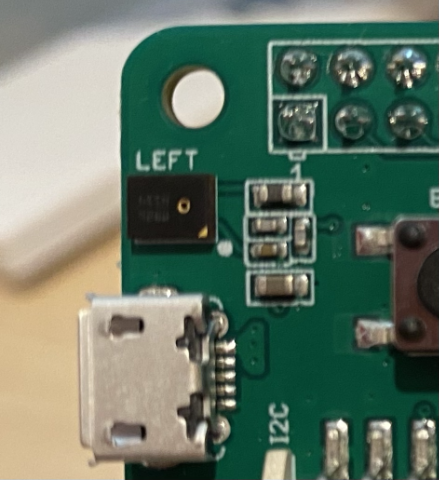

<!--
CO_OP_TRANSLATOR_METADATA:
{
  "original_hash": "6d6aa1be033625d201a190fc9c5cbfb4",
  "translation_date": "2025-08-27T21:17:24+00:00",
  "source_file": "6-consumer/lessons/1-speech-recognition/README.md",
  "language_code": "hu"
}
-->
# Beszédfelismerés IoT eszközzel


> Vázlatrajz: [Nitya Narasimhan](https://github.com/nitya). Kattints a képre a nagyobb verzióért.

Ez a videó áttekintést nyújt az Azure beszédszolgáltatásról, amelyet ebben a leckében fogunk tárgyalni:

[](https://www.youtube.com/watch?v=iW0Fw0l3mrA)

> 🎥 Kattints a fenti képre a videó megtekintéséhez

## Előadás előtti kvíz

[Előadás előtti kvíz](https://black-meadow-040d15503.1.azurestaticapps.net/quiz/41)

## Bevezetés

'Alexa, állíts be egy 12 perces időzítőt'

'Alexa, időzítő állapota'

'Alexa, állíts be egy 8 perces időzítőt, nevezzük el brokkoli párolásnak'

Az okoseszközök egyre elterjedtebbé válnak. Nemcsak okoshangszórók formájában, mint a HomePod, Echo és Google Home, hanem beépítve telefonjainkba, óráinkba, sőt, lámpatestekbe és termosztátokba is.

> 💁 Az otthonomban legalább 19 olyan eszköz van, amely hangasszisztenst használ, és ez csak azok, amikről tudok!

A hangvezérlés növeli az akadálymentességet, lehetővé téve, hogy korlátozott mozgásképességű emberek is könnyen használhassák az eszközöket. Legyen szó állandó fogyatékosságról, például ha valaki karok nélkül született, vagy ideiglenes sérülésről, mint a törött karok, esetleg telepakolt kezekről bevásárláskor vagy kisgyerekekkel, a hangvezérlés lehetőséget ad arra, hogy kéz helyett hanggal irányítsuk otthonunkat. Az, hogy ki tudjuk mondani: 'Hey Siri, zárd be a garázsajtót', miközben egy babát pelenkázunk és egy rakoncátlan kisgyerekkel küzdünk, apró, de hatékony javulást hozhat az életünkbe.

A hangasszisztensek egyik legnépszerűbb funkciója az időzítők beállítása, különösen a konyhai időzítők. Az, hogy több időzítőt is beállíthatunk pusztán a hangunkkal, nagy segítség a konyhában – nem kell abbahagyni a tészta gyúrását, a leves keverését, vagy megtisztítani a kezünket a gombóc tölteléktől, hogy használhassunk egy fizikai időzítőt.

Ebben a leckében megtanulod, hogyan építs be hangfelismerést IoT eszközökbe. Megismered a mikrofonokat mint érzékelőket, megtanulod, hogyan rögzíts hangot egy IoT eszközhöz csatlakoztatott mikrofonról, és hogyan használd az AI-t a hallottak szöveggé alakítására. A projekt során egy okos konyhai időzítőt fogsz építeni, amely képes több nyelven hangvezérléssel időzítőket beállítani.

Ebben a leckében az alábbiakat fogjuk tárgyalni:

* [Mikrofonok](../../../../../6-consumer/lessons/1-speech-recognition)
* [Hang rögzítése IoT eszközödről](../../../../../6-consumer/lessons/1-speech-recognition)
* [Beszéd szöveggé alakítása](../../../../../6-consumer/lessons/1-speech-recognition)
* [Beszéd szöveggé konvertálása](../../../../../6-consumer/lessons/1-speech-recognition)

## Mikrofonok

A mikrofonok analóg érzékelők, amelyek a hanghullámokat elektromos jelekké alakítják. A levegőben lévő rezgések apró mozgásokat okoznak a mikrofon alkatrészeiben, amelyek apró változásokat idéznek elő az elektromos jelekben. Ezeket a változásokat felerősítik, hogy elektromos kimenetet generáljanak.

### Mikrofontípusok

A mikrofonok különböző típusokban érhetők el:

* Dinamikus - A dinamikus mikrofonokban egy mágnes van rögzítve egy mozgó membránhoz, amely egy tekercsben mozogva elektromos áramot hoz létre. Ez az ellentéte a legtöbb hangszórónak, amelyek elektromos áramot használnak egy mágnes mozgatására egy tekercsben, amely egy membránt mozgatva hangot hoz létre. Ez azt jelenti, hogy a hangszórók dinamikus mikrofonként is használhatók, és a dinamikus mikrofonok hangszóróként is működhetnek. Az olyan eszközökben, mint az intercomok, ahol a felhasználó vagy hallgat, vagy beszél, de nem mindkettőt egyszerre, egy eszköz lehet hangszóró és mikrofon is.

    A dinamikus mikrofonoknak nincs szükségük áramra a működéshez, az elektromos jelet teljes egészében a mikrofon hozza létre.

    

* Szalag - A szalagos mikrofonok hasonlóak a dinamikus mikrofonokhoz, de membrán helyett fém szalagot használnak. Ez a szalag egy mágneses mezőben mozogva elektromos áramot generál. A dinamikus mikrofonokhoz hasonlóan a szalagos mikrofonoknak sincs szükségük áramra a működéshez.

    

* Kondenzátor - A kondenzátoros mikrofonoknak vékony fém membránjuk és rögzített fém hátlapjuk van. Mindkettőre elektromosságot alkalmaznak, és ahogy a membrán rezeg, a lemezek közötti statikus töltés változik, jelet generálva. A kondenzátoros mikrofonoknak áramra van szükségük a működéshez – ezt *fantomtáplálásnak* nevezik.

    

* MEMS - A mikroelektromechanikai rendszerek mikrofonjai, vagy MEMS, egy chipen található mikrofonok. Nyomásérzékeny membránjuk van, amelyet szilícium chipre véstek, és hasonlóan működnek, mint a kondenzátoros mikrofonok. Ezek a mikrofonok rendkívül kicsik lehetnek, és integrálhatók az áramkörökbe.

    

    A fenti képen a **LEFT** feliratú chip egy MEMS mikrofon, amelynek apró membránja kevesebb mint egy milliméter széles.

✅ Kutatás: Milyen mikrofonok vannak körülötted – akár a számítógépedben, telefonodban, headsetedben vagy más eszközökben? Milyen típusú mikrofonok ezek?

### Digitális hang

A hang analóg jel, amely rendkívül finom részleteket hordoz. Ahhoz, hogy ezt a jelet digitálissá alakítsuk, a hangot másodpercenként több ezer alkalommal kell mintavételezni.

> 🎓 A mintavételezés a hangjel digitális értékké alakítása, amely az adott időpontban a jelet képviseli.


A digitális hangot impulzuskód-modulációval (Pulse Code Modulation, PCM) mintavételezik. A PCM során a jel feszültségét olvassák le, és kiválasztják a legközelebbi diszkrét értéket az adott feszültséghez egy meghatározott méret alapján.

> 💁 A PCM-t úgy képzelheted el, mint az érzékelő verzióját az impulzusszélesség-modulációnak (PWM). (A PWM-et korábban tárgyaltuk a [kezdő projekt 3. leckéjében](../../../1-getting-started/lessons/3-sensors-and-actuators/README.md#pulse-width-modulation)). A PCM az analóg jelet digitálissá alakítja, míg a PWM a digitális jelet analóggá.

Például a legtöbb streaming zenei szolgáltatás 16 bites vagy 24 bites hangot kínál. Ez azt jelenti, hogy a feszültséget olyan értékké alakítják, amely belefér egy 16 bites vagy 24 bites egész számba. A 16 bites hang -32,768 és 32,767 közötti értékekbe illeszkedik, míg a 24 bites -8,388,608 és 8,388,607 közötti tartományba. Minél több bit, annál közelebb van a mintavétel ahhoz, amit a fülünk valójában hall.

> 💁 Talán hallottál már 8 bites hangról, amelyet gyakran LoFi-nak neveznek. Ez olyan hang, amelyet csak 8 biten mintavételeztek, tehát -128 és 127 között. Az első számítógépes hangot hardverkorlátok miatt 8 bitre korlátozták, így ez gyakran megjelenik retro játékokban.

Ezeket a mintákat másodpercenként több ezer alkalommal veszik, jól meghatározott mintavételi frekvenciákkal, amelyeket KHz-ben (ezredmásodpercenkénti leolvasások) mérnek. A streaming zenei szolgáltatások 48KHz-et használnak a legtöbb hanghoz, de néhány 'veszteségmentes' hang akár 96KHz-et vagy 192KHz-et is használhat. Minél magasabb a mintavételi frekvencia, annál közelebb van az eredeti hanghoz, egy bizonyos pontig. Vita tárgya, hogy az emberek meg tudják-e különböztetni a 48KHz feletti hangokat.

✅ Kutatás: Ha streaming zenei szolgáltatást használsz, milyen mintavételi frekvenciát és méretet használ? Ha CD-t használsz, milyen a CD hangjának mintavételi frekvenciája és mérete?

Számos különböző formátum létezik a hangadatokhoz. Valószínűleg hallottál már mp3 fájlokról – ezek olyan hangadatok, amelyeket tömörítettek, hogy kisebbek legyenek anélkül, hogy minőséget veszítenének. A tömörítetlen hangot gyakran WAV fájlként tárolják – ez egy fájl, amely 44 bájtnyi fejlécinformációt tartalmaz, majd nyers hangadatokat. A fejléc olyan információkat tartalmaz, mint a mintavételi frekvencia (például 16000 a 16KHz-hez), a mintaméret (16 a 16 bithez), és a csatornák száma. A fejléc után a WAV fájl tartalmazza a nyers hangadatokat.

> 🎓 A csatornák arra utalnak, hogy hány különböző hangfolyam alkotja a hangot. Például sztereó hang esetén, bal és jobb csatornával, 2 csatorna lenne. Egy 7.1-es házimozi rendszer esetén ez 8 csatorna lenne.

### Hangadatok mérete

A hangadatok viszonylag nagyok. Például, ha tömörítetlen 16 bites hangot rögzítünk 16KHz-en (ami elég jó a beszéd szöveggé alakításához), másodpercenként 32KB adatot igényel:

* 16 bit azt jelenti, hogy mintánként 2 bájt (1 bájt 8 bit).
* 16KHz 16,000 mintát jelent másodpercenként.
* 16,000 x 2 bájt = 32,000 bájt másodpercenként.

Ez kis mennyiségű adatnak tűnik, de ha egy mikrokontrollert használunk korlátozott memóriával, ez sok lehet. Például a Wio Terminal 192KB memóriával rendelkezik, amelynek tárolnia kell a programkódot és a változókat. Még ha a programkód nagyon kicsi is lenne, nem tudnál több mint 5 másodpercnyi hangot rögzíteni.

A mikrokontrollerek hozzáférhetnek további tárolóhoz, például SD kártyákhoz vagy flash memóriához. Ha olyan IoT eszközt építesz, amely hangot rögzít, biztosítanod kell, hogy ne csak további tárolóval rendelkezz, hanem a kódod közvetlenül a tárolóra írja a mikrofonról rögzített hangot, és amikor a felhőbe küldöd, a tárolóból streameld a webes kéréshez. Így elkerülheted, hogy kifogyj a memóriából, ha megpróbálnád az egész hangadatblokkot egyszerre a memóriában tartani.

## Hang rögzítése IoT eszközödről

Az IoT eszközöd mikrofonhoz csatlakoztatható, hogy hangot rögzítsen, amely készen áll a szöveggé alakításra. Hangszórókhoz is csatlakoztatható, hogy hangot adjon ki. A későbbi leckékben ezt hangos visszajelzésre fogjuk használni, de hasznos most beállítani a hangszórókat a mikrofon teszteléséhez.

### Feladat - mikrofon és hangszórók konfigurálása

Kövesd a megfelelő útmutatót, hogy konfiguráld a mikrofont és hangszórókat az IoT eszközödhöz:

* [Arduino - Wio Terminal](wio-terminal-microphone.md)
* [Egylapkás számítógép - Raspberry Pi](pi-microphone.md)
* [Egylapkás számítógép - Virtuális eszköz](virtual-device-microphone.md)

### Feladat - hang rögzítése

Kövesd a megfelelő útmutatót, hogy hangot rögzíts az IoT eszközödön:

* [Arduino - Wio Terminal](wio-terminal-audio.md)
* [Egylapkás számítógép - Raspberry Pi](pi-audio.md)
* [Egylapkás számítógép - Virtuális eszköz](virtual-device-audio.md)

## Beszéd szöveggé alakítása

A beszéd szöveggé alakítása, vagy beszédfelismerés, AI-t használ arra, hogy az audiojelben lévő szavakat szöveggé alakítsa.

### Beszédfelismerési modellek

A beszéd szöveggé alakításához az audiojel mintáit csoportosítják, és egy gépi tanulási modellbe táplálják, amely egy Recurrent Neural Network (RNN) alapú. Ez egy olyan gépi tanulási modell, amely korábbi adatokat használhat arra, hogy döntést hozzon a beérkező adatokkal kapcsolatban. Például az RNN felismerheti az egyik audio mintát 'Hel' hangként, és amikor egy másikat kap, amelyet 'lo' hangként azonosít, kombinálhatja az előző hanggal, és felismerheti, hogy a 'Hello' egy érvényes szó, és ezt választja eredményként.

A gépi tanulási modellek mindig azonos méretű adatokat fogadnak el minden alkalommal. Az a képosztályozó, amelyet egy korábbi leckében építettél, átméretezi a képeket egy fix méretre, és úgy dolgozza fel őket. Ugyanez igaz a beszédmodellekre is, amelyeknek fix méretű audio darabokat kell feldolgozniuk. A beszédmodelleknek képesnek kell lenniük arra, hogy több előrejelzés eredményeit kombinálják, hogy megkapják a választ, lehetővé téve, hogy megkülönböztessék például a 'Hi' és 'Highway', vagy a 'flock' és 'floccinaucinihilipilification' szavakat.

A beszédmodellek elég fejlettek ahhoz, hogy megértsék a kontextust, és javítsák a felismerésüket
💁 Néhány beszédfelismerő szolgáltatás testreszabható, hogy jobban működjön zajos környezetekben, például gyárakban, vagy iparág-specifikus szavakkal, mint például vegyi anyagok nevei. Ezeket a testreszabásokat mintahangok és átiratok biztosításával tanítják, és átviteli tanulást alkalmaznak, ugyanúgy, ahogy korábbi leckében képosztályozót tanítottál néhány kép segítségével.
### Adatvédelem

Amikor beszédfelismerést használunk egy fogyasztói IoT eszközön, az adatvédelem rendkívül fontos. Ezek az eszközök folyamatosan hallgatják a hangot, így fogyasztóként nem szeretnénk, hogy minden, amit mondunk, a felhőbe kerüljön és szöveggé legyen alakítva. Ez nemcsak rengeteg internetes sávszélességet használna, hanem komoly adatvédelmi problémákat is felvetne, különösen, ha egyes okoseszköz-gyártók véletlenszerűen kiválasztanak hangfelvételeket, hogy [emberek ellenőrizzék a generált szöveget a modelljük fejlesztése érdekében](https://www.theverge.com/2019/4/10/18305378/amazon-alexa-ai-voice-assistant-annotation-listen-private-recordings).

Csak akkor szeretnénk, hogy az okoseszközünk hangot küldjön a felhőbe feldolgozásra, amikor használjuk, nem pedig akkor, amikor hangot hall az otthonunkban, amely magában foglalhat privát megbeszéléseket vagy intim interakciókat. Az okoseszközök többsége úgy működik, hogy van egy *ébresztőszó*, egy kulcskifejezés, mint például "Alexa", "Hey Siri" vagy "OK Google", amely arra készteti az eszközt, hogy "felébredjen" és hallgassa, amit mondunk, egészen addig, amíg nem érzékel egy szünetet a beszédünkben, jelezve, hogy befejeztük az eszközhöz való beszédet.

> 🎓 Az ébresztőszó felismerést *kulcsszó-keresésnek* vagy *kulcsszó-felismerésnek* is nevezik.

Ezeket az ébresztőszavakat az eszközön, nem pedig a felhőben érzékelik. Az okoseszközök kis AI modelleket futtatnak az eszközön, amelyek az ébresztőszót figyelik, és amikor azt érzékelik, elkezdik a hangot a felhőbe streamelni felismerés céljából. Ezek a modellek nagyon specializáltak, és csak az ébresztőszót figyelik.

> 💁 Egyes technológiai cégek növelik az eszközeik adatvédelmét, és a beszéd szöveggé alakításának egy részét az eszközön végzik. Az Apple bejelentette, hogy a 2021-es iOS és macOS frissítéseik részeként támogatni fogják a beszéd szöveggé alakítását az eszközön, és képesek lesznek számos kérést kezelni anélkül, hogy a felhőt használnák. Ez annak köszönhető, hogy az eszközeikben erős processzorok vannak, amelyek képesek ML modelleket futtatni.

✅ Mit gondolsz, milyen adatvédelmi és etikai következményei vannak annak, ha a felhőbe küldött hangot tárolják? Tárolni kellene ezt a hangot, és ha igen, hogyan? Szerinted a felvételek felhasználása bűnüldözési célokra jó kompromisszum az adatvédelem elvesztéséért?

Az ébresztőszó felismerés általában egy TinyML nevű technikát használ, amely az ML modellek átalakítását jelenti, hogy mikrovezérlőkön is futtathatók legyenek. Ezek a modellek kicsik, és nagyon kevés energiát fogyasztanak.

Az ébresztőszó modell betanításának és használatának bonyolultságának elkerülése érdekében az okos időzítő, amelyet ebben a leckében építesz, egy gombot fog használni a beszédfelismerés bekapcsolásához.

> 💁 Ha szeretnél ébresztőszó felismerő modellt készíteni, amely a Wio Terminal vagy Raspberry Pi eszközön fut, nézd meg ezt a [hangodra reagáló Edge Impulse útmutatót](https://docs.edgeimpulse.com/docs/responding-to-your-voice). Ha a számítógépedet szeretnéd erre használni, próbáld ki a [Custom Keyword gyorsindítót a Microsoft dokumentációjában](https://docs.microsoft.com/azure/cognitive-services/speech-service/keyword-recognition-overview?WT.mc_id=academic-17441-jabenn).

## Beszéd szöveggé alakítása


Csakúgy, mint a képosztályozásnál egy korábbi projektben, vannak előre elkészített AI szolgáltatások, amelyek képesek a beszédet hangfájlként szöveggé alakítani. Az egyik ilyen szolgáltatás a Speech Service, amely a Cognitive Services része, előre elkészített AI szolgáltatások, amelyeket az alkalmazásaidban használhatsz.

### Feladat - beszéd AI erőforrás konfigurálása

1. Hozz létre egy `smart-timer` nevű erőforráscsoportot ehhez a projekthez.

1. Használd a következő parancsot egy ingyenes beszéd erőforrás létrehozásához:

    ```sh
    az cognitiveservices account create --name smart-timer \
                                        --resource-group smart-timer \
                                        --kind SpeechServices \
                                        --sku F0 \
                                        --yes \
                                        --location <location>
    ```

    Cseréld ki `<location>`-t arra a helyre, amelyet az erőforráscsoport létrehozásakor használtál.

1. Szükséged lesz egy API kulcsra, hogy a kódodból elérd a beszéd erőforrást. Futtasd a következő parancsot a kulcs megszerzéséhez:

    ```sh
    az cognitiveservices account keys list --name smart-timer \
                                           --resource-group smart-timer \
                                           --output table
    ```

    Másold le az egyik kulcsot.

### Feladat - beszéd szöveggé alakítása

Dolgozd végig a megfelelő útmutatót, hogy beszédet szöveggé alakíts az IoT eszközödön:

* [Arduino - Wio Terminal](wio-terminal-speech-to-text.md)
* [Egylapkás számítógép - Raspberry Pi](pi-speech-to-text.md)
* [Egylapkás számítógép - Virtuális eszköz](virtual-device-speech-to-text.md)

---

## 🚀 Kihívás

A beszédfelismerés már régóta létezik, és folyamatosan fejlődik. Kutass a jelenlegi képességekről, és hasonlítsd össze, hogyan fejlődtek az idők során, beleértve azt is, hogy mennyire pontosak a gépi átiratok az emberihez képest.

Mit gondolsz, mit tartogat a jövő a beszédfelismerés számára?

## Előadás utáni kvíz

[Előadás utáni kvíz](https://black-meadow-040d15503.1.azurestaticapps.net/quiz/42)

## Áttekintés és önálló tanulás

* Olvass a különböző mikrofontípusokról és működésükről a [dinamikus és kondenzátoros mikrofonok közötti különbségekről szóló cikkben a Musician's HQ-n](https://musicianshq.com/whats-the-difference-between-dynamic-and-condenser-microphones/).
* Olvass többet a Cognitive Services beszéd szolgáltatásról a [Microsoft Docs beszéd szolgáltatás dokumentációjában](https://docs.microsoft.com/azure/cognitive-services/speech-service/?WT.mc_id=academic-17441-jabenn).
* Olvass a kulcsszó-keresésről a [Microsoft Docs kulcsszó-felismerés dokumentációjában](https://docs.microsoft.com/azure/cognitive-services/speech-service/keyword-recognition-overview?WT.mc_id=academic-17441-jabenn).

## Feladat

[](assignment.md)

---

**Felelősség kizárása**:  
Ez a dokumentum az AI fordítási szolgáltatás, a [Co-op Translator](https://github.com/Azure/co-op-translator) segítségével lett lefordítva. Bár törekszünk a pontosságra, kérjük, vegye figyelembe, hogy az automatikus fordítások hibákat vagy pontatlanságokat tartalmazhatnak. Az eredeti dokumentum az eredeti nyelvén tekintendő hiteles forrásnak. Kritikus információk esetén javasolt professzionális emberi fordítást igénybe venni. Nem vállalunk felelősséget semmilyen félreértésért vagy téves értelmezésért, amely a fordítás használatából eredhet.