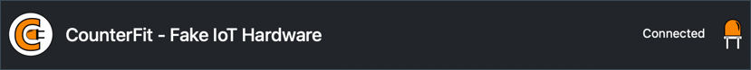

<!--
CO_OP_TRANSLATOR_METADATA:
{
  "original_hash": "52b4de6144b2efdced7797a5339d6035",
  "translation_date": "2025-08-27T22:41:28+00:00",
  "source_file": "1-getting-started/lessons/1-introduction-to-iot/virtual-device.md",
  "language_code": "id"
}
-->
# Komputer papan tunggal virtual

Daripada membeli perangkat IoT beserta sensor dan aktuatornya, Anda dapat menggunakan komputer Anda untuk mensimulasikan perangkat keras IoT. Proyek [CounterFit](https://github.com/CounterFit-IoT/CounterFit) memungkinkan Anda menjalankan aplikasi secara lokal yang mensimulasikan perangkat keras IoT seperti sensor dan aktuator, serta mengakses sensor dan aktuator tersebut dari kode Python lokal yang ditulis dengan cara yang sama seperti kode yang akan Anda tulis di Raspberry Pi menggunakan perangkat keras fisik.

## Persiapan

Untuk menggunakan CounterFit, Anda perlu menginstal beberapa perangkat lunak gratis di komputer Anda.

### Tugas

Instal perangkat lunak yang diperlukan.

1. Instal Python. Lihat [halaman unduhan Python](https://www.python.org/downloads/) untuk petunjuk menginstal versi terbaru Python.

1. Instal Visual Studio Code (VS Code). Ini adalah editor yang akan Anda gunakan untuk menulis kode perangkat virtual Anda dalam Python. Lihat [dokumentasi VS Code](https://code.visualstudio.com?WT.mc_id=academic-17441-jabenn) untuk petunjuk menginstal VS Code.

    > 💁 Anda bebas menggunakan IDE atau editor Python lain untuk pelajaran ini jika Anda memiliki alat yang disukai, tetapi instruksi dalam pelajaran akan didasarkan pada penggunaan VS Code.

1. Instal ekstensi Pylance untuk VS Code. Ini adalah ekstensi untuk VS Code yang menyediakan dukungan bahasa Python. Lihat [dokumentasi ekstensi Pylance](https://marketplace.visualstudio.com/items?WT.mc_id=academic-17441-jabenn&itemName=ms-python.vscode-pylance) untuk petunjuk menginstal ekstensi ini di VS Code.

Petunjuk untuk menginstal dan mengonfigurasi aplikasi CounterFit akan diberikan pada waktu yang relevan dalam instruksi tugas karena aplikasi ini diinstal berdasarkan proyek.

## Hello world

Secara tradisional, saat memulai dengan bahasa pemrograman atau teknologi baru, Anda membuat aplikasi 'Hello World' - aplikasi kecil yang menampilkan teks seperti `"Hello World"` untuk menunjukkan bahwa semua alat telah dikonfigurasi dengan benar.

Aplikasi Hello World untuk perangkat keras IoT virtual akan memastikan bahwa Python dan Visual Studio Code telah diinstal dengan benar. Aplikasi ini juga akan terhubung ke CounterFit untuk sensor dan aktuator IoT virtual. Aplikasi ini tidak akan menggunakan perangkat keras apa pun, hanya akan terhubung untuk membuktikan bahwa semuanya berfungsi.

Aplikasi ini akan berada dalam folder bernama `nightlight`, dan akan digunakan kembali dengan kode yang berbeda di bagian selanjutnya dari tugas ini untuk membangun aplikasi nightlight.

### Konfigurasi lingkungan virtual Python

Salah satu fitur kuat Python adalah kemampuan untuk menginstal [paket Pip](https://pypi.org) - ini adalah paket kode yang ditulis oleh orang lain dan dipublikasikan di Internet. Anda dapat menginstal paket Pip di komputer Anda dengan satu perintah, lalu menggunakan paket tersebut dalam kode Anda. Anda akan menggunakan Pip untuk menginstal paket untuk berkomunikasi dengan CounterFit.

Secara default, ketika Anda menginstal paket, paket tersebut tersedia di seluruh komputer Anda, dan ini dapat menyebabkan masalah dengan versi paket - seperti satu aplikasi yang bergantung pada satu versi paket yang rusak saat Anda menginstal versi baru untuk aplikasi lain. Untuk mengatasi masalah ini, Anda dapat menggunakan [lingkungan virtual Python](https://docs.python.org/3/library/venv.html), yang pada dasarnya adalah salinan Python dalam folder khusus, dan ketika Anda menginstal paket Pip, paket tersebut hanya diinstal di folder tersebut.

> 💁 Jika Anda menggunakan Raspberry Pi, maka Anda tidak mengatur lingkungan virtual di perangkat tersebut untuk mengelola paket Pip, melainkan menggunakan paket global, karena paket Grove diinstal secara global oleh skrip penginstal.

#### Tugas - konfigurasi lingkungan virtual Python

Konfigurasikan lingkungan virtual Python dan instal paket Pip untuk CounterFit.

1. Dari terminal atau command line Anda, jalankan perintah berikut di lokasi pilihan Anda untuk membuat dan menavigasi ke direktori baru:

    ```sh
    mkdir nightlight
    cd nightlight
    ```

1. Sekarang jalankan perintah berikut untuk membuat lingkungan virtual di folder `.venv`:

    ```sh
    python3 -m venv .venv
    ```

    > 💁 Anda perlu secara eksplisit memanggil `python3` untuk membuat lingkungan virtual jika Anda memiliki Python 2 yang diinstal selain Python 3 (versi terbaru). Jika Anda memiliki Python 2 yang diinstal, maka memanggil `python` akan menggunakan Python 2 alih-alih Python 3.

1. Aktifkan lingkungan virtual:

    * Di Windows:
        * Jika Anda menggunakan Command Prompt, atau Command Prompt melalui Windows Terminal, jalankan:

            ```cmd
            .venv\Scripts\activate.bat
            ```

        * Jika Anda menggunakan PowerShell, jalankan:

            ```powershell
            .\.venv\Scripts\Activate.ps1
            ```

            > Jika Anda mendapatkan kesalahan tentang skrip yang dinonaktifkan di sistem ini, Anda perlu mengaktifkan skrip dengan menetapkan kebijakan eksekusi yang sesuai. Anda dapat melakukannya dengan meluncurkan PowerShell sebagai administrator, lalu menjalankan perintah berikut:

            ```powershell
            Set-ExecutionPolicy -ExecutionPolicy Unrestricted
            ```

            Masukkan `Y` saat diminta untuk mengonfirmasi. Kemudian luncurkan ulang PowerShell dan coba lagi.

            Anda dapat mengatur ulang kebijakan eksekusi ini di kemudian hari jika diperlukan. Anda dapat membaca lebih lanjut tentang ini di [halaman Kebijakan Eksekusi di Microsoft Docs](https://docs.microsoft.com/powershell/module/microsoft.powershell.core/about/about_execution_policies?WT.mc_id=academic-17441-jabenn).

    * Di macOS atau Linux, jalankan:

        ```cmd
        source ./.venv/bin/activate
        ```

    > 💁 Perintah-perintah ini harus dijalankan dari lokasi yang sama dengan tempat Anda menjalankan perintah untuk membuat lingkungan virtual. Anda tidak perlu menavigasi ke dalam folder `.venv`, Anda harus selalu menjalankan perintah aktivasi dan perintah apa pun untuk menginstal paket atau menjalankan kode dari folder tempat Anda membuat lingkungan virtual.

1. Setelah lingkungan virtual diaktifkan, perintah `python` default akan menjalankan versi Python yang digunakan untuk membuat lingkungan virtual. Jalankan perintah berikut untuk mendapatkan versinya:

    ```sh
    python --version
    ```

    Outputnya harus berisi hal berikut:

    ```output
    (.venv) ➜  nightlight python --version
    Python 3.9.1
    ```

    > 💁 Versi Python Anda mungkin berbeda - selama versinya 3.6 atau lebih tinggi, Anda sudah siap. Jika tidak, hapus folder ini, instal versi Python yang lebih baru, dan coba lagi.

1. Jalankan perintah berikut untuk menginstal paket Pip untuk CounterFit. Paket-paket ini mencakup aplikasi utama CounterFit serta shims untuk perangkat keras Grove. Shims ini memungkinkan Anda menulis kode seolah-olah Anda sedang memprogram menggunakan sensor dan aktuator fisik dari ekosistem Grove tetapi terhubung ke perangkat IoT virtual.

    ```sh
    pip install CounterFit
    pip install counterfit-connection
    pip install counterfit-shims-grove
    ```

    Paket-paket pip ini hanya akan diinstal di lingkungan virtual, dan tidak akan tersedia di luar lingkungan ini.

### Menulis kode

Setelah lingkungan virtual Python siap, Anda dapat menulis kode untuk aplikasi 'Hello World'.

#### Tugas - menulis kode

Buat aplikasi Python untuk mencetak `"Hello World"` ke konsol.

1. Dari terminal atau command line Anda, jalankan perintah berikut di dalam lingkungan virtual untuk membuat file Python bernama `app.py`:

    * Dari Windows jalankan:

        ```cmd
        type nul > app.py
        ```

    * Di macOS atau Linux, jalankan:

        ```cmd
        touch app.py
        ```

1. Buka folder saat ini di VS Code:

    ```sh
    code .
    ```

    > 💁 Jika terminal Anda mengembalikan `command not found` di macOS, itu berarti VS Code belum ditambahkan ke PATH Anda. Anda dapat menambahkan VS Code ke PATH dengan mengikuti petunjuk di [bagian Meluncurkan dari command line di dokumentasi VS Code](https://code.visualstudio.com/docs/setup/mac?WT.mc_id=academic-17441-jabenn#_launching-from-the-command-line) dan menjalankan perintah setelahnya. VS Code secara default ditambahkan ke PATH di Windows dan Linux.

1. Ketika VS Code diluncurkan, itu akan mengaktifkan lingkungan virtual Python. Lingkungan virtual yang dipilih akan muncul di bilah status bawah:

    

1. Jika Terminal VS Code sudah berjalan saat VS Code dimulai, lingkungan virtual tidak akan diaktifkan di dalamnya. Cara termudah untuk mengatasinya adalah dengan menutup terminal menggunakan tombol **Kill the active terminal instance**:

    

    Anda dapat mengetahui apakah terminal memiliki lingkungan virtual yang diaktifkan karena nama lingkungan virtual akan menjadi awalan pada prompt terminal. Misalnya, mungkin:

    ```sh
    (.venv) ➜  nightlight
    ```

    Jika Anda tidak memiliki `.venv` sebagai awalan pada prompt, lingkungan virtual tidak aktif di terminal.

1. Luncurkan terminal VS Code baru dengan memilih *Terminal -> New Terminal*, atau menekan `` CTRL+` ``. Terminal baru akan memuat lingkungan virtual, dan panggilan untuk mengaktifkan ini akan muncul di terminal. Prompt juga akan memiliki nama lingkungan virtual (`.venv`):

    ```output
    ➜  nightlight source .venv/bin/activate
    (.venv) ➜  nightlight 
    ```

1. Buka file `app.py` dari penjelajah VS Code dan tambahkan kode berikut:

    ```python
    print('Hello World!')
    ```

    Fungsi `print` mencetak apa pun yang diteruskan ke konsol.

1. Dari terminal VS Code, jalankan perintah berikut untuk menjalankan aplikasi Python Anda:

    ```sh
    python app.py
    ```

    Output berikut akan muncul:

    ```output
    (.venv) ➜  nightlight python app.py 
    Hello World!
    ```

😀 Program 'Hello World' Anda berhasil!

### Menghubungkan 'perangkat keras'

Sebagai langkah kedua 'Hello World', Anda akan menjalankan aplikasi CounterFit dan menghubungkan kode Anda ke sana. Ini adalah setara virtual dari mencolokkan perangkat keras IoT ke kit pengembangan.

#### Tugas - menghubungkan 'perangkat keras'

1. Dari terminal VS Code, luncurkan aplikasi CounterFit dengan perintah berikut:

    ```sh
    counterfit
    ```

    Aplikasi akan mulai berjalan dan terbuka di browser web Anda:

    

    Aplikasi akan ditandai sebagai *Disconnected*, dengan LED di sudut kanan atas mati.

1. Tambahkan kode berikut ke bagian atas `app.py`:

    ```python
    from counterfit_connection import CounterFitConnection
    CounterFitConnection.init('127.0.0.1', 5000)
    ```

    Kode ini mengimpor kelas `CounterFitConnection` dari modul `counterfit_connection`, yang berasal dari paket pip `counterfit-connection` yang Anda instal sebelumnya. Kemudian menginisialisasi koneksi ke aplikasi CounterFit yang berjalan di `127.0.0.1`, yang merupakan alamat IP yang selalu dapat Anda gunakan untuk mengakses komputer lokal Anda (sering disebut sebagai *localhost*), pada port 5000.

    > 💁 Jika Anda memiliki aplikasi lain yang berjalan di port 5000, Anda dapat mengubah ini dengan memperbarui port di kode, dan menjalankan CounterFit menggunakan `CounterFit --port <port_number>`, mengganti `<port_number>` dengan port yang ingin Anda gunakan.

1. Anda perlu meluncurkan terminal VS Code baru dengan memilih tombol **Create a new integrated terminal**. Ini karena aplikasi CounterFit sedang berjalan di terminal saat ini.

    

1. Di terminal baru ini, jalankan file `app.py` seperti sebelumnya. Status CounterFit akan berubah menjadi **Connected** dan LED akan menyala.

    

> 💁 Anda dapat menemukan kode ini di folder [code/virtual-device](../../../../../1-getting-started/lessons/1-introduction-to-iot/code/virtual-device).

😀 Koneksi Anda ke perangkat keras berhasil!

---

**Penafian**:  
Dokumen ini telah diterjemahkan menggunakan layanan penerjemahan AI [Co-op Translator](https://github.com/Azure/co-op-translator). Meskipun kami berusaha untuk memberikan hasil yang akurat, harap diingat bahwa terjemahan otomatis mungkin mengandung kesalahan atau ketidakakuratan. Dokumen asli dalam bahasa aslinya harus dianggap sebagai sumber yang otoritatif. Untuk informasi yang bersifat kritis, disarankan menggunakan jasa penerjemahan profesional oleh manusia. Kami tidak bertanggung jawab atas kesalahpahaman atau penafsiran yang keliru yang timbul dari penggunaan terjemahan ini.