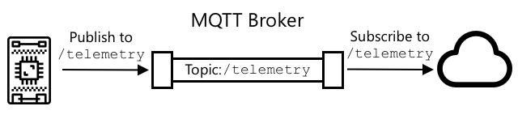

<!--
CO_OP_TRANSLATOR_METADATA:
{
  "original_hash": "71b5040e0b3472f1c0949c9b55f224c0",
  "translation_date": "2025-08-27T22:16:00+00:00",
  "source_file": "1-getting-started/lessons/4-connect-internet/README.md",
  "language_code": "id"
}
-->
# Hubungkan perangkat Anda ke Internet


> Sketchnote oleh [Nitya Narasimhan](https://github.com/nitya). Klik gambar untuk versi yang lebih besar.

Pelajaran ini diajarkan sebagai bagian dari [seri Hello IoT](https://youtube.com/playlist?list=PLmsFUfdnGr3xRts0TIwyaHyQuHaNQcb6-) dari [Microsoft Reactor](https://developer.microsoft.com/reactor/?WT.mc_id=academic-17441-jabenn). Pelajaran ini disampaikan dalam 2 video - satu pelajaran berdurasi 1 jam, dan satu sesi tanya jawab berdurasi 1 jam yang membahas lebih dalam bagian-bagian pelajaran dan menjawab pertanyaan.

[](https://youtu.be/O4dd172mZhs)

[](https://youtu.be/j-cVCzRDE2Q)

> 🎥 Klik gambar di atas untuk menonton video

## Kuis sebelum pelajaran

[Kuis sebelum pelajaran](https://black-meadow-040d15503.1.azurestaticapps.net/quiz/7)

## Pendahuluan

Huruf **I** dalam IoT adalah singkatan dari **Internet** - konektivitas cloud dan layanan yang memungkinkan banyak fitur perangkat IoT, mulai dari mengumpulkan pengukuran dari sensor yang terhubung ke perangkat, hingga mengirim pesan untuk mengontrol aktuator. Perangkat IoT biasanya terhubung ke satu layanan cloud IoT menggunakan protokol komunikasi standar, dan layanan tersebut terhubung ke seluruh aplikasi IoT Anda, mulai dari layanan AI untuk membuat keputusan cerdas berdasarkan data Anda, hingga aplikasi web untuk kontrol atau pelaporan.

> 🎓 Data yang dikumpulkan dari sensor dan dikirim ke cloud disebut telemetri.

Perangkat IoT dapat menerima pesan dari cloud. Seringkali pesan ini berisi perintah - yaitu instruksi untuk melakukan suatu tindakan baik secara internal (seperti reboot atau memperbarui firmware), atau menggunakan aktuator (seperti menyalakan lampu).

Pelajaran ini memperkenalkan beberapa protokol komunikasi yang dapat digunakan perangkat IoT untuk terhubung ke cloud, dan jenis data yang mungkin mereka kirim atau terima. Anda juga akan mempraktikkannya, menambahkan kontrol internet ke lampu malam Anda, memindahkan logika kontrol LED ke kode 'server' yang berjalan secara lokal.

Dalam pelajaran ini kita akan membahas:

* [Protokol komunikasi](../../../../../1-getting-started/lessons/4-connect-internet)
* [Message Queueing Telemetry Transport (MQTT)](../../../../../1-getting-started/lessons/4-connect-internet)
* [Telemetri](../../../../../1-getting-started/lessons/4-connect-internet)
* [Perintah](../../../../../1-getting-started/lessons/4-connect-internet)

## Protokol komunikasi

Ada sejumlah protokol komunikasi populer yang digunakan oleh perangkat IoT untuk berkomunikasi dengan Internet. Yang paling populer berbasis pada pesan publish/subscribe melalui semacam broker. Perangkat IoT terhubung ke broker dan mempublikasikan telemetri serta berlangganan perintah. Layanan cloud juga terhubung ke broker dan berlangganan semua pesan telemetri serta mempublikasikan perintah baik ke perangkat tertentu, atau ke grup perangkat.


MQTT adalah protokol komunikasi paling populer untuk perangkat IoT dan akan dibahas dalam pelajaran ini. Protokol lainnya termasuk AMQP dan HTTP/HTTPS.

## Message Queueing Telemetry Transport (MQTT)

[MQTT](http://mqtt.org) adalah protokol pesan standar terbuka yang ringan yang dapat mengirim pesan antar perangkat. Protokol ini dirancang pada tahun 1999 untuk memantau pipa minyak, sebelum dirilis sebagai standar terbuka 15 tahun kemudian oleh IBM.

MQTT memiliki satu broker dan beberapa klien. Semua klien terhubung ke broker, dan broker merutekan pesan ke klien yang relevan. Pesan dirutekan menggunakan topik bernama, bukan dikirim langsung ke klien individu. Klien dapat mempublikasikan ke topik, dan klien mana pun yang berlangganan topik tersebut akan menerima pesan.



✅ Lakukan riset. Jika Anda memiliki banyak perangkat IoT, bagaimana Anda dapat memastikan broker MQTT Anda dapat menangani semua pesan?

### Hubungkan perangkat IoT Anda ke MQTT

Bagian pertama dari menambahkan kontrol Internet ke lampu malam Anda adalah menghubungkannya ke broker MQTT.

#### Tugas

Hubungkan perangkat Anda ke broker MQTT.

Dalam bagian pelajaran ini, Anda akan menghubungkan lampu malam IoT Anda ke internet untuk memungkinkan kontrol jarak jauh. Nanti dalam pelajaran ini, perangkat IoT Anda akan mengirim pesan telemetri melalui MQTT ke broker MQTT publik dengan tingkat cahaya, di mana pesan tersebut akan diambil oleh beberapa kode server yang akan Anda tulis. Kode ini akan memeriksa tingkat cahaya dan mengirim pesan perintah kembali ke perangkat yang memberitahunya untuk menyalakan atau mematikan LED.

Kasus penggunaan dunia nyata untuk pengaturan semacam ini bisa berupa mengumpulkan data dari beberapa sensor cahaya sebelum memutuskan untuk menyalakan lampu, di lokasi yang memiliki banyak lampu, seperti stadion. Ini dapat mencegah lampu menyala jika hanya satu sensor yang tertutup awan atau burung, tetapi sensor lainnya mendeteksi cukup cahaya.

✅ Situasi lain apa yang memerlukan data dari beberapa sensor untuk dievaluasi sebelum mengirim perintah?

Daripada menangani kompleksitas pengaturan broker MQTT sebagai bagian dari tugas ini, Anda dapat menggunakan server uji publik yang menjalankan [Eclipse Mosquitto](https://www.mosquitto.org), broker MQTT sumber terbuka. Broker uji ini tersedia secara publik di [test.mosquitto.org](https://test.mosquitto.org), dan tidak memerlukan akun untuk disiapkan, menjadikannya alat yang hebat untuk menguji klien dan server MQTT.

> 💁 Broker uji ini bersifat publik dan tidak aman. Siapa pun dapat mendengarkan apa yang Anda publikasikan, jadi tidak boleh digunakan dengan data apa pun yang perlu dirahasiakan.


Ikuti langkah yang relevan di bawah ini untuk menghubungkan perangkat Anda ke broker MQTT:

* [Arduino - Wio Terminal](wio-terminal-mqtt.md)
* [Komputer papan tunggal - Raspberry Pi/Perangkat IoT Virtual](single-board-computer-mqtt.md)

### Penjelasan lebih dalam tentang MQTT

Topik dapat memiliki hierarki, dan klien dapat berlangganan berbagai level hierarki menggunakan wildcard. Sebagai contoh, Anda dapat mengirim pesan telemetri suhu ke topik `/telemetry/temperature` dan pesan kelembapan ke topik `/telemetry/humidity`, lalu dalam aplikasi cloud Anda berlangganan ke topik `/telemetry/*` untuk menerima pesan telemetri suhu dan kelembapan.

Pesan dapat dikirim dengan kualitas layanan (QoS), yang menentukan jaminan pesan diterima.

* Paling banyak sekali - pesan dikirim hanya sekali dan klien serta broker tidak mengambil langkah tambahan untuk mengakui pengiriman (fire and forget).
* Setidaknya sekali - pesan dikirim ulang oleh pengirim beberapa kali hingga pengakuan diterima (acknowledged delivery).
* Tepat sekali - pengirim dan penerima melakukan jabat tangan dua tingkat untuk memastikan hanya satu salinan pesan yang diterima (assured delivery).

✅ Situasi apa yang mungkin memerlukan pesan dengan pengiriman terjamin dibandingkan pesan fire and forget?

Meskipun namanya adalah Message Queueing (inisial dalam MQTT), sebenarnya protokol ini tidak mendukung antrian pesan. Ini berarti jika klien terputus, lalu terhubung kembali, klien tidak akan menerima pesan yang dikirim selama pemutusan, kecuali untuk pesan yang sudah mulai diproses menggunakan proses QoS. Pesan dapat memiliki flag yang disimpan. Jika flag ini diatur, broker MQTT akan menyimpan pesan terakhir yang dikirim pada topik dengan flag ini, dan mengirimkannya ke klien mana pun yang kemudian berlangganan topik tersebut. Dengan cara ini, klien akan selalu mendapatkan pesan terbaru.

MQTT juga mendukung fungsi keep alive yang memeriksa apakah koneksi masih aktif selama jeda panjang antara pesan.

> 🦟 [Mosquitto dari Eclipse Foundation](https://mosquitto.org) memiliki broker MQTT gratis yang dapat Anda jalankan sendiri untuk bereksperimen dengan MQTT, serta broker MQTT publik yang dapat Anda gunakan untuk menguji kode Anda, yang dihosting di [test.mosquitto.org](https://test.mosquitto.org).

Koneksi MQTT dapat bersifat publik dan terbuka, atau dienkripsi dan diamankan menggunakan nama pengguna dan kata sandi, atau sertifikat.

> 💁 MQTT berkomunikasi melalui TCP/IP, protokol jaringan dasar yang sama seperti HTTP, tetapi pada port yang berbeda. Anda juga dapat menggunakan MQTT melalui websockets untuk berkomunikasi dengan aplikasi web yang berjalan di browser, atau dalam situasi di mana firewall atau aturan jaringan lainnya memblokir koneksi MQTT standar.

## Telemetri

Kata telemetri berasal dari akar kata Yunani yang berarti mengukur dari jarak jauh. Telemetri adalah tindakan mengumpulkan data dari sensor dan mengirimkannya ke cloud.

> 💁 Salah satu perangkat telemetri paling awal ditemukan di Prancis pada tahun 1874 dan mengirimkan data cuaca dan kedalaman salju secara real-time dari Mont Blanc ke Paris. Perangkat ini menggunakan kabel fisik karena teknologi nirkabel belum tersedia pada saat itu.

Mari kita lihat kembali contoh termostat pintar dari Pelajaran 1.


Termostat memiliki sensor suhu untuk mengumpulkan telemetri. Kemungkinan besar, termostat memiliki satu sensor suhu bawaan, dan mungkin terhubung ke beberapa sensor suhu eksternal melalui protokol nirkabel seperti [Bluetooth Low Energy](https://wikipedia.org/wiki/Bluetooth_Low_Energy) (BLE).

Contoh data telemetri yang akan dikirimkan adalah:

| Nama | Nilai | Deskripsi |
| ---- | ----- | --------- |
| `thermostat_temperature` | 18°C | Suhu yang diukur oleh sensor suhu bawaan termostat |
| `livingroom_temperature` | 19°C | Suhu yang diukur oleh sensor suhu jarak jauh yang diberi nama `livingroom` untuk mengidentifikasi ruangan tempat sensor berada |
| `bedroom_temperature` | 21°C | Suhu yang diukur oleh sensor suhu jarak jauh yang diberi nama `bedroom` untuk mengidentifikasi ruangan tempat sensor berada |

Layanan cloud kemudian dapat menggunakan data telemetri ini untuk membuat keputusan tentang perintah apa yang akan dikirim untuk mengontrol pemanas.

### Kirim telemetri dari perangkat IoT Anda

Bagian selanjutnya dalam menambahkan kontrol Internet ke lampu malam Anda adalah mengirimkan telemetri tingkat cahaya ke broker MQTT pada topik telemetri.

#### Tugas - kirim telemetri dari perangkat IoT Anda

Kirim telemetri tingkat cahaya ke broker MQTT.

Data dikirimkan dalam format JSON - singkatan dari JavaScript Object Notation, standar untuk mengkodekan data dalam teks menggunakan pasangan kunci/nilai.

✅ Jika Anda belum pernah mendengar tentang JSON sebelumnya, Anda dapat mempelajarinya lebih lanjut di [dokumentasi JSON.org](https://www.json.org/).

Ikuti langkah yang relevan di bawah ini untuk mengirim telemetri dari perangkat Anda ke broker MQTT:

* [Arduino - Wio Terminal](wio-terminal-telemetry.md)
* [Komputer papan tunggal - Raspberry Pi/Perangkat IoT Virtual](single-board-computer-telemetry.md)

### Terima telemetri dari broker MQTT

Tidak ada gunanya mengirim telemetri jika tidak ada yang mendengarkannya. Telemetri tingkat cahaya memerlukan sesuatu yang mendengarkannya untuk memproses data. Kode 'server' ini adalah jenis kode yang akan Anda terapkan ke layanan cloud sebagai bagian dari aplikasi IoT yang lebih besar, tetapi di sini Anda akan menjalankan kode ini secara lokal di komputer Anda (atau di Pi Anda jika Anda langsung mengkode di sana). Kode server terdiri dari aplikasi Python yang mendengarkan pesan telemetri melalui MQTT dengan tingkat cahaya. Nanti dalam pelajaran ini Anda akan membuatnya membalas dengan pesan perintah dengan instruksi untuk menyalakan atau mematikan LED.

✅ Lakukan riset: Apa yang terjadi pada pesan MQTT jika tidak ada pendengar?

#### Instal Python dan VS Code

Jika Anda belum menginstal Python dan VS Code secara lokal, Anda perlu menginstalnya untuk menulis kode server. Jika Anda menggunakan perangkat IoT virtual, atau bekerja di Raspberry Pi Anda, Anda dapat melewati langkah ini karena seharusnya sudah diinstal dan dikonfigurasi.

##### Tugas - instal Python dan VS Code

Instal Python dan VS Code.

1. Instal Python. Lihat [halaman unduhan Python](https://www.python.org/downloads/) untuk instruksi menginstal versi terbaru Python.

1. Instal Visual Studio Code (VS Code). Ini adalah editor yang akan Anda gunakan untuk menulis kode perangkat virtual Anda dalam Python. Lihat [dokumentasi VS Code](https://code.visualstudio.com?WT.mc_id=academic-17441-jabenn) untuk instruksi menginstal VS Code.
💁 Anda bebas menggunakan IDE atau editor Python apa pun untuk pelajaran ini jika Anda memiliki alat yang disukai, tetapi pelajaran akan memberikan instruksi berdasarkan penggunaan VS Code.
1. Pasang ekstensi Pylance di VS Code. Ini adalah ekstensi untuk VS Code yang menyediakan dukungan bahasa Python. Lihat [dokumentasi ekstensi Pylance](https://marketplace.visualstudio.com/items?WT.mc_id=academic-17441-jabenn&itemName=ms-python.vscode-pylance) untuk petunjuk pemasangan ekstensi ini di VS Code.

#### Konfigurasi Lingkungan Virtual Python

Salah satu fitur kuat Python adalah kemampuan untuk menginstal [paket pip](https://pypi.org) - ini adalah paket kode yang ditulis oleh orang lain dan dipublikasikan di Internet. Anda dapat menginstal paket pip ke komputer Anda dengan satu perintah, lalu menggunakan paket tersebut dalam kode Anda. Anda akan menggunakan pip untuk menginstal paket untuk berkomunikasi melalui MQTT.

Secara default, ketika Anda menginstal sebuah paket, paket tersebut tersedia di seluruh komputer Anda, dan ini dapat menyebabkan masalah dengan versi paket - seperti satu aplikasi yang bergantung pada satu versi paket yang rusak ketika Anda menginstal versi baru untuk aplikasi lain. Untuk mengatasi masalah ini, Anda dapat menggunakan [lingkungan virtual Python](https://docs.python.org/3/library/venv.html), yang pada dasarnya adalah salinan Python dalam folder khusus, dan ketika Anda menginstal paket pip, paket tersebut hanya diinstal di folder tersebut.

##### Tugas - Konfigurasi Lingkungan Virtual Python

Konfigurasikan lingkungan virtual Python dan instal paket pip MQTT.

1. Dari terminal atau command line Anda, jalankan perintah berikut di lokasi pilihan Anda untuk membuat dan masuk ke direktori baru:

    ```sh
    mkdir nightlight-server
    cd nightlight-server
    ```

1. Sekarang jalankan perintah berikut untuk membuat lingkungan virtual di folder `.venv`:

    ```sh
    python3 -m venv .venv
    ```

    > 💁 Anda perlu secara eksplisit memanggil `python3` untuk membuat lingkungan virtual, terutama jika Anda memiliki Python 2 yang terinstal selain Python 3 (versi terbaru). Jika Anda memiliki Python 2 yang terinstal, maka memanggil `python` akan menggunakan Python 2, bukan Python 3.

1. Aktifkan lingkungan virtual:

    * Di Windows:
        * Jika Anda menggunakan Command Prompt, atau Command Prompt melalui Windows Terminal, jalankan:

            ```cmd
            .venv\Scripts\activate.bat
            ```

        * Jika Anda menggunakan PowerShell, jalankan:

            ```powershell
            .\.venv\Scripts\Activate.ps1
            ```

    * Di macOS atau Linux, jalankan:

        ```cmd
        source ./.venv/bin/activate
        ```

    > 💁 Perintah ini harus dijalankan dari lokasi yang sama dengan tempat Anda menjalankan perintah untuk membuat lingkungan virtual. Anda tidak perlu masuk ke folder `.venv`, Anda hanya perlu menjalankan perintah aktivasi dan perintah apa pun untuk menginstal paket atau menjalankan kode dari folder tempat Anda membuat lingkungan virtual.

1. Setelah lingkungan virtual diaktifkan, perintah `python` default akan menjalankan versi Python yang digunakan untuk membuat lingkungan virtual. Jalankan perintah berikut untuk mendapatkan versinya:

    ```sh
    python --version
    ```

    Outputnya akan mirip dengan berikut ini:

    ```output
    (.venv) ➜  nightlight-server python --version
    Python 3.9.1
    ```

    > 💁 Versi Python Anda mungkin berbeda - selama versinya 3.6 atau lebih tinggi, itu sudah cukup. Jika tidak, hapus folder ini, instal versi Python yang lebih baru, dan coba lagi.

1. Jalankan perintah berikut untuk menginstal paket pip untuk [Paho-MQTT](https://pypi.org/project/paho-mqtt/), sebuah pustaka MQTT yang populer.

    ```sh
    pip install paho-mqtt
    ```

    Paket pip ini hanya akan diinstal di lingkungan virtual, dan tidak akan tersedia di luar lingkungan ini.

#### Menulis Kode Server

Kode server sekarang dapat ditulis dalam Python.

##### Tugas - Menulis Kode Server

Tulis kode server.

1. Dari terminal atau command line Anda, jalankan perintah berikut di dalam lingkungan virtual untuk membuat file Python bernama `app.py`:

    * Di Windows, jalankan:

        ```cmd
        type nul > app.py
        ```

    * Di macOS atau Linux, jalankan:

        ```cmd
        touch app.py
        ```

1. Buka folder saat ini di VS Code:

    ```sh
    code .
    ```

1. Ketika VS Code diluncurkan, itu akan mengaktifkan lingkungan virtual Python. Ini akan dilaporkan di bilah status bawah:

    

1. Jika Terminal VS Code sudah berjalan saat VS Code dimulai, lingkungan virtual tidak akan diaktifkan di dalamnya. Cara termudah adalah dengan menutup terminal menggunakan tombol **Kill the active terminal instance**:

    

1. Luncurkan Terminal VS Code baru dengan memilih *Terminal -> New Terminal*, atau menekan `` CTRL+` ``. Terminal baru akan memuat lingkungan virtual, dengan panggilan untuk mengaktifkannya muncul di terminal. Nama lingkungan virtual (`.venv`) juga akan ada di prompt:

    ```output
    ➜  nightlight-server source .venv/bin/activate
    (.venv) ➜  nightlight 
    ```

1. Buka file `app.py` dari penjelajah VS Code dan tambahkan kode berikut:

    ```python
    import json
    import time
    
    import paho.mqtt.client as mqtt
    
    id = '<ID>'
    
    client_telemetry_topic = id + '/telemetry'
    client_name = id + 'nightlight_server'
    
    mqtt_client = mqtt.Client(client_name)
    mqtt_client.connect('test.mosquitto.org')
    
    mqtt_client.loop_start()
    
    def handle_telemetry(client, userdata, message):
        payload = json.loads(message.payload.decode())
        print("Message received:", payload)
    
    mqtt_client.subscribe(client_telemetry_topic)
    mqtt_client.on_message = handle_telemetry
    
    while True:
        time.sleep(2)
    ```

    Ganti `<ID>` pada baris 6 dengan ID unik yang Anda gunakan saat membuat kode perangkat Anda.

    ⚠️ Ini **harus** menjadi ID yang sama yang Anda gunakan pada perangkat Anda, atau kode server tidak akan berlangganan atau mempublikasikan ke topik yang benar.

    Kode ini membuat klien MQTT dengan nama unik, dan terhubung ke broker *test.mosquitto.org*. Kemudian memulai loop pemrosesan yang berjalan di thread latar belakang untuk mendengarkan pesan pada topik yang dilanggani.

    Klien kemudian berlangganan pesan pada topik telemetri, dan mendefinisikan fungsi yang dipanggil ketika pesan diterima. Ketika pesan telemetri diterima, fungsi `handle_telemetry` dipanggil, mencetak pesan yang diterima ke konsol.

    Akhirnya, loop tak terbatas menjaga aplikasi tetap berjalan. Klien MQTT mendengarkan pesan di thread latar belakang dan berjalan selama aplikasi utama berjalan.

1. Dari terminal VS Code, jalankan perintah berikut untuk menjalankan aplikasi Python Anda:

    ```sh
    python app.py
    ```

    Aplikasi akan mulai mendengarkan pesan dari perangkat IoT.

1. Pastikan perangkat Anda berjalan dan mengirim pesan telemetri. Sesuaikan tingkat cahaya yang terdeteksi oleh perangkat fisik atau virtual Anda. Pesan yang diterima akan dicetak ke terminal.

    ```output
    (.venv) ➜  nightlight-server python app.py
    Message received: {'light': 0}
    Message received: {'light': 400}
    ```

    File app.py di lingkungan virtual nightlight harus berjalan agar file app.py di lingkungan virtual nightlight-server dapat menerima pesan yang dikirim.

> 💁 Anda dapat menemukan kode ini di folder [code-server/server](../../../../../1-getting-started/lessons/4-connect-internet/code-server/server).

### Seberapa Sering Telemetri Harus Dikirim?

Salah satu pertimbangan penting dengan telemetri adalah seberapa sering data harus diukur dan dikirim? Jawabannya - tergantung. Jika Anda mengukur sering, Anda dapat merespons lebih cepat terhadap perubahan pengukuran, tetapi Anda menggunakan lebih banyak daya, lebih banyak bandwidth, menghasilkan lebih banyak data, dan membutuhkan lebih banyak sumber daya cloud untuk memprosesnya. Anda perlu mengukur cukup sering, tetapi tidak terlalu sering.

Untuk termostat, mengukur setiap beberapa menit mungkin sudah lebih dari cukup karena suhu tidak berubah terlalu sering. Jika Anda hanya mengukur sekali sehari, Anda bisa saja memanaskan rumah Anda untuk suhu malam di tengah hari yang cerah, sedangkan jika Anda mengukur setiap detik, Anda akan memiliki ribuan pengukuran suhu yang tidak perlu yang akan menghabiskan kecepatan dan bandwidth Internet pengguna (masalah bagi orang dengan paket bandwidth terbatas), menggunakan lebih banyak daya yang bisa menjadi masalah untuk perangkat bertenaga baterai seperti sensor jarak jauh, dan meningkatkan biaya sumber daya komputasi cloud penyedia untuk memproses dan menyimpannya.

Jika Anda memantau data di sekitar mesin di pabrik yang jika gagal dapat menyebabkan kerusakan besar dan kerugian jutaan dolar, maka mengukur beberapa kali per detik mungkin diperlukan. Lebih baik membuang bandwidth daripada kehilangan telemetri yang menunjukkan bahwa mesin perlu dihentikan dan diperbaiki sebelum rusak.

> 💁 Dalam situasi ini, Anda mungkin mempertimbangkan memiliki perangkat edge untuk memproses telemetri terlebih dahulu untuk mengurangi ketergantungan pada Internet.

### Kehilangan Konektivitas

Koneksi Internet bisa tidak stabil, dengan gangguan yang umum terjadi. Apa yang harus dilakukan perangkat IoT dalam keadaan ini - apakah harus kehilangan data, atau menyimpannya sampai konektivitas pulih? Sekali lagi, jawabannya tergantung.

Untuk termostat, data mungkin bisa hilang begitu pengukuran suhu baru telah diambil. Sistem pemanas tidak peduli bahwa 20 menit yang lalu suhunya 20,5°C jika suhu sekarang adalah 19°C, suhu saat ini yang menentukan apakah pemanas harus menyala atau mati.

Untuk mesin, Anda mungkin ingin menyimpan data, terutama jika data tersebut digunakan untuk mencari tren. Ada model pembelajaran mesin yang dapat mendeteksi anomali dalam aliran data dengan melihat data dari periode waktu tertentu (seperti satu jam terakhir) dan menemukan data yang anomali. Ini sering digunakan untuk pemeliharaan prediktif, mencari indikasi bahwa sesuatu mungkin akan rusak sehingga Anda dapat memperbaiki atau menggantinya sebelum itu terjadi. Anda mungkin ingin setiap bit telemetri untuk mesin dikirim sehingga dapat diproses untuk deteksi anomali, jadi begitu perangkat IoT dapat terhubung kembali, perangkat tersebut akan mengirim semua telemetri yang dihasilkan selama gangguan Internet.

Desainer perangkat IoT juga harus mempertimbangkan apakah perangkat IoT dapat digunakan selama gangguan Internet atau kehilangan sinyal yang disebabkan oleh lokasi. Sebuah termostat pintar harus dapat membuat beberapa keputusan terbatas untuk mengontrol pemanasan jika tidak dapat mengirim telemetri ke cloud karena gangguan.

[](https://twitter.com/internetofshit/status/1315736960082808832)

Untuk MQTT menangani kehilangan konektivitas, kode perangkat dan server harus bertanggung jawab untuk memastikan pengiriman pesan jika diperlukan, misalnya dengan mewajibkan semua pesan yang dikirim dijawab oleh pesan tambahan pada topik balasan, dan jika tidak, pesan tersebut diantrekan secara manual untuk diputar ulang nanti.

## Perintah

Perintah adalah pesan yang dikirim oleh cloud ke perangkat, menginstruksikannya untuk melakukan sesuatu. Sebagian besar waktu ini melibatkan memberikan beberapa jenis output melalui aktuator, tetapi bisa juga berupa instruksi untuk perangkat itu sendiri, seperti untuk reboot, atau mengumpulkan telemetri tambahan dan mengembalikannya sebagai respons terhadap perintah.


Sebuah termostat dapat menerima perintah dari cloud untuk menyalakan pemanas. Berdasarkan data telemetri dari semua sensor, jika layanan cloud memutuskan bahwa pemanas harus menyala, maka ia mengirimkan perintah yang relevan.

### Mengirim Perintah ke Broker MQTT

Langkah berikutnya untuk lampu malam yang dikontrol Internet adalah agar kode server mengirim perintah kembali ke perangkat IoT untuk mengontrol lampu berdasarkan tingkat cahaya yang terdeteksi.

1. Buka kode server di VS Code.

1. Tambahkan baris berikut setelah deklarasi `client_telemetry_topic` untuk menentukan topik mana yang akan digunakan untuk mengirim perintah:

    ```python
    server_command_topic = id + '/commands'
    ```

1. Tambahkan kode berikut ke akhir fungsi `handle_telemetry`:

    ```python
    command = { 'led_on' : payload['light'] < 300 }
    print("Sending message:", command)
    
    client.publish(server_command_topic, json.dumps(command))
    ```

    Ini mengirimkan pesan JSON ke topik perintah dengan nilai `led_on` diatur ke true atau false tergantung pada apakah cahaya kurang dari 300 atau tidak. Jika cahaya kurang dari 300, true dikirim untuk menginstruksikan perangkat untuk menyalakan LED.

1. Jalankan kode seperti sebelumnya.

1. Sesuaikan tingkat cahaya yang terdeteksi oleh perangkat fisik atau virtual Anda. Pesan yang diterima dan perintah yang dikirim akan ditulis ke terminal:

    ```output
    (.venv) ➜  nightlight-server python app.py
    Message received: {'light': 0}
    Sending message: {'led_on': True}
    Message received: {'light': 400}
    Sending message: {'led_on': False}
    ```

> 💁 Telemetri dan perintah dikirim pada satu topik masing-masing. Ini berarti telemetri dari beberapa perangkat akan muncul pada topik telemetri yang sama, dan perintah ke beberapa perangkat akan muncul pada topik perintah yang sama. Jika Anda ingin mengirim perintah ke perangkat tertentu, Anda dapat menggunakan beberapa topik, yang dinamai dengan ID perangkat unik, seperti `/commands/device1`, `/commands/device2`. Dengan cara ini, perangkat dapat mendengarkan pesan yang hanya ditujukan untuk perangkat tersebut.

> 💁 Anda dapat menemukan kode ini di folder [code-commands/server](../../../../../1-getting-started/lessons/4-connect-internet/code-commands/server).

### Menangani Perintah pada Perangkat IoT

Sekarang perintah dikirim dari server, Anda dapat menambahkan kode ke perangkat IoT untuk menangani perintah tersebut dan mengontrol LED.

Ikuti langkah yang relevan di bawah ini untuk mendengarkan perintah dari broker MQTT:

* [Arduino - Wio Terminal](wio-terminal-commands.md)
* [Single-board computer - Raspberry Pi/Virtual IoT device](single-board-computer-commands.md)

Setelah kode ini ditulis dan dijalankan, coba ubah tingkat cahaya. Perhatikan output dari server dan perangkat, serta perhatikan LED saat Anda mengubah tingkat cahaya.

### Kehilangan Konektivitas

Apa yang harus dilakukan layanan cloud jika perlu mengirim perintah ke perangkat IoT yang sedang offline? Sekali lagi, jawabannya tergantung.

Jika perintah terbaru menggantikan perintah sebelumnya, maka perintah sebelumnya mungkin bisa diabaikan. Jika layanan cloud mengirim perintah untuk menyalakan pemanas, lalu mengirim perintah untuk mematikannya, maka perintah nyala dapat diabaikan dan tidak dikirim ulang.

Jika perintah perlu diproses secara berurutan, seperti menggerakkan lengan robot ke atas, lalu menutup penjepit, maka perintah tersebut perlu dikirim dalam urutan setelah konektivitas dipulihkan.

✅ Bagaimana perangkat atau kode server dapat memastikan perintah selalu dikirim dan ditangani dalam urutan yang benar melalui MQTT jika diperlukan?

---

## 🚀 Tantangan

Tantangan dalam tiga pelajaran terakhir adalah untuk membuat daftar sebanyak mungkin perangkat IoT yang ada di rumah, sekolah, atau tempat kerja Anda dan menentukan apakah perangkat tersebut dibangun menggunakan mikrokontroler atau komputer papan tunggal, atau bahkan campuran keduanya, serta pikirkan tentang sensor dan aktuator apa yang mereka gunakan.
Untuk perangkat ini, pikirkan tentang pesan apa yang mungkin mereka kirim atau terima. Telemetri apa yang mereka kirim? Pesan atau perintah apa yang mungkin mereka terima? Apakah menurut Anda mereka aman?

## Kuis setelah kuliah

[Kuis setelah kuliah](https://black-meadow-040d15503.1.azurestaticapps.net/quiz/8)

## Tinjauan & Studi Mandiri

Baca lebih lanjut tentang MQTT di [halaman Wikipedia MQTT](https://wikipedia.org/wiki/MQTT).

Cobalah menjalankan broker MQTT sendiri menggunakan [Mosquitto](https://www.mosquitto.org) dan hubungkan ke perangkat IoT Anda serta kode server.

> 💁 Tip - secara default Mosquitto tidak mengizinkan koneksi anonim (yaitu koneksi tanpa nama pengguna dan kata sandi), dan tidak mengizinkan koneksi dari luar komputer tempat ia berjalan.
> Anda dapat memperbaikinya dengan file konfigurasi [`mosquitto.conf`](https://www.mosquitto.org/man/mosquitto-conf-5.html) dengan berikut ini:
>
> ```sh
> listener 1883 0.0.0.0
> allow_anonymous true
> ```

## Tugas

[Bandingkan dan kontraskan MQTT dengan protokol komunikasi lainnya](assignment.md)

---

**Penafian**:  
Dokumen ini telah diterjemahkan menggunakan layanan penerjemahan AI [Co-op Translator](https://github.com/Azure/co-op-translator). Meskipun kami berusaha untuk memberikan hasil yang akurat, harap diingat bahwa terjemahan otomatis mungkin mengandung kesalahan atau ketidakakuratan. Dokumen asli dalam bahasa aslinya harus dianggap sebagai sumber yang otoritatif. Untuk informasi yang bersifat kritis, disarankan menggunakan jasa penerjemahan profesional oleh manusia. Kami tidak bertanggung jawab atas kesalahpahaman atau penafsiran yang keliru yang timbul dari penggunaan terjemahan ini.