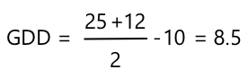

<!--
CO_OP_TRANSLATOR_METADATA:
{
  "original_hash": "d105b44deae539165855c976dcdeca99",
  "translation_date": "2025-08-28T01:42:01+00:00",
  "source_file": "2-farm/lessons/1-predict-plant-growth/README.md",
  "language_code": "id"
}
-->
# Prediksi Pertumbuhan Tanaman dengan IoT


> Sketchnote oleh [Nitya Narasimhan](https://github.com/nitya). Klik gambar untuk versi yang lebih besar.

## Kuis Pra-Pelajaran

[Kuis Pra-Pelajaran](https://black-meadow-040d15503.1.azurestaticapps.net/quiz/9)

## Pendahuluan

Tanaman membutuhkan beberapa hal untuk tumbuh - air, karbon dioksida, nutrisi, cahaya, dan panas. Dalam pelajaran ini, Anda akan belajar cara menghitung tingkat pertumbuhan dan kematangan tanaman dengan mengukur suhu udara.

Dalam pelajaran ini kita akan membahas:

* [Pertanian digital](../../../../../2-farm/lessons/1-predict-plant-growth)
* [Mengapa suhu penting dalam pertanian?](../../../../../2-farm/lessons/1-predict-plant-growth)
* [Mengukur suhu sekitar](../../../../../2-farm/lessons/1-predict-plant-growth)
* [Hari derajat pertumbuhan (GDD)](../../../../../2-farm/lessons/1-predict-plant-growth)
* [Menghitung GDD menggunakan data sensor suhu](../../../../../2-farm/lessons/1-predict-plant-growth)

## Pertanian Digital

Pertanian Digital mengubah cara kita bertani, menggunakan alat untuk mengumpulkan, menyimpan, dan menganalisis data dari aktivitas pertanian. Saat ini kita berada dalam periode yang disebut sebagai 'Revolusi Industri Keempat' oleh World Economic Forum, dan munculnya pertanian digital telah disebut sebagai 'Revolusi Pertanian Keempat', atau 'Agriculture 4.0'.

> 🎓 Istilah Pertanian Digital juga mencakup seluruh 'rantai nilai pertanian', yaitu perjalanan lengkap dari ladang ke meja makan. Ini termasuk pelacakan kualitas hasil panen saat makanan dikirim dan diproses, sistem gudang dan e-commerce, bahkan aplikasi penyewaan traktor!

Perubahan ini memungkinkan petani meningkatkan hasil panen, menggunakan lebih sedikit pupuk dan pestisida, serta menghemat air secara lebih efisien. Meskipun sebagian besar digunakan di negara-negara kaya, sensor dan perangkat lainnya perlahan-lahan menjadi lebih murah, membuatnya lebih terjangkau di negara-negara berkembang.

Beberapa teknik yang dimungkinkan oleh pertanian digital adalah:

* Pengukuran suhu - mengukur suhu memungkinkan petani memprediksi pertumbuhan dan kematangan tanaman.
* Penyiraman otomatis - mengukur kelembapan tanah dan mengaktifkan sistem irigasi saat tanah terlalu kering, daripada penyiraman berdasarkan waktu. Penyiraman berdasarkan waktu dapat menyebabkan tanaman kekurangan air selama cuaca panas dan kering, atau kelebihan air saat hujan. Dengan menyiram hanya saat tanah membutuhkannya, petani dapat mengoptimalkan penggunaan air mereka.
* Pengendalian hama - petani dapat menggunakan kamera pada robot otomatis atau drone untuk memeriksa hama, lalu menerapkan pestisida hanya di area yang diperlukan, mengurangi jumlah pestisida yang digunakan dan mengurangi limpasan pestisida ke sumber air lokal.

✅ Lakukan penelitian. Teknik apa lagi yang digunakan untuk meningkatkan hasil pertanian?

> 🎓 Istilah 'Pertanian Presisi' digunakan untuk mendefinisikan pengamatan, pengukuran, dan respons terhadap tanaman berdasarkan per bidang, atau bahkan pada bagian dari suatu bidang. Ini termasuk mengukur tingkat air, nutrisi, dan hama serta merespons secara akurat, seperti menyiram hanya sebagian kecil dari suatu bidang.

## Mengapa Suhu Penting dalam Pertanian?

Saat belajar tentang tanaman, kebanyakan siswa diajarkan tentang pentingnya air, cahaya, karbon dioksida, dan nutrisi. Tanaman juga membutuhkan kehangatan untuk tumbuh - inilah mengapa tanaman mekar di musim semi saat suhu meningkat, mengapa bunga salju atau daffodil dapat tumbuh lebih awal karena periode hangat yang singkat, dan mengapa rumah kaca sangat baik untuk membuat tanaman tumbuh.

> 🎓 Rumah kaca dan hothouse memiliki fungsi serupa, tetapi dengan perbedaan penting. Hothouse dipanaskan secara buatan dan memungkinkan petani mengontrol suhu dengan lebih akurat, sedangkan rumah kaca mengandalkan matahari untuk kehangatan dan biasanya hanya memiliki kontrol berupa jendela atau bukaan lain untuk mengeluarkan panas.

Tanaman memiliki suhu dasar atau minimum, suhu optimal, dan suhu maksimum, semuanya berdasarkan suhu rata-rata harian.

* Suhu dasar - ini adalah suhu rata-rata harian minimum yang diperlukan agar tanaman dapat tumbuh.
* Suhu optimal - ini adalah suhu rata-rata harian terbaik untuk mendapatkan pertumbuhan maksimal.
* Suhu maksimum - ini adalah suhu maksimum yang dapat ditoleransi oleh tanaman. Di atas suhu ini, tanaman akan menghentikan pertumbuhannya untuk menghemat air dan bertahan hidup.

> 💁 Ini adalah suhu rata-rata, yang dihitung dari suhu siang dan malam. Tanaman juga membutuhkan suhu yang berbeda antara siang dan malam untuk membantu mereka berfotosintesis lebih efisien dan menghemat energi di malam hari.

Setiap spesies tanaman memiliki nilai yang berbeda untuk suhu dasar, optimal, dan maksimum. Inilah mengapa beberapa tanaman tumbuh subur di negara panas, dan lainnya di negara dingin.

✅ Lakukan penelitian. Untuk tanaman apa pun yang Anda miliki di taman, sekolah, atau taman lokal, coba cari tahu suhu dasarnya.


Grafik di atas menunjukkan contoh grafik tingkat pertumbuhan terhadap suhu. Hingga suhu dasar, tidak ada pertumbuhan. Tingkat pertumbuhan meningkat hingga suhu optimal, lalu menurun setelah mencapai puncaknya. 

Bentuk grafik ini bervariasi dari satu spesies tanaman ke spesies lainnya. Beberapa memiliki penurunan tajam di atas suhu optimal, beberapa memiliki peningkatan yang lebih lambat dari suhu dasar ke suhu optimal.

> 💁 Agar petani mendapatkan pertumbuhan terbaik, mereka perlu mengetahui tiga nilai suhu ini dan memahami bentuk grafik untuk tanaman yang mereka tanam.

Jika seorang petani memiliki kontrol terhadap suhu, misalnya di hothouse komersial, maka mereka dapat mengoptimalkan untuk tanaman mereka. Sebuah hothouse komersial yang menanam tomat, misalnya, akan mengatur suhu sekitar 25°C di siang hari dan 20°C di malam hari untuk mendapatkan pertumbuhan tercepat.

> 🍅 Dengan menggabungkan suhu ini dengan lampu buatan, pupuk, dan kontrol tingkat CO
Kode ini membuka file CSV, lalu menambahkan baris baru di akhir. Baris tersebut berisi data dan waktu saat ini yang diformat dalam format yang mudah dibaca manusia, diikuti oleh suhu yang diterima dari perangkat IoT. Data disimpan dalam [format ISO 8601](https://wikipedia.org/wiki/ISO_8601) dengan zona waktu, tetapi tanpa mikrodetik.

1. Jalankan kode ini seperti sebelumnya, pastikan perangkat IoT Anda mengirimkan data. File CSV bernama `temperature.csv` akan dibuat di folder yang sama. Jika Anda melihatnya, Anda akan melihat tanggal/waktu dan pengukuran suhu:

    ```output
    date,temperature
    2021-04-19T17:21:36-07:00,25
    2021-04-19T17:31:36-07:00,24
    2021-04-19T17:41:36-07:00,25
    ```

1. Jalankan kode ini untuk beberapa waktu untuk menangkap data. Idealnya, Anda harus menjalankannya selama satu hari penuh untuk mengumpulkan cukup data untuk perhitungan GDD.

    
> 💁 Jika Anda menggunakan Perangkat IoT Virtual, pilih kotak centang acak dan tetapkan rentang untuk menghindari mendapatkan suhu yang sama setiap kali nilai suhu dikembalikan.
     

    > 💁 Jika Anda ingin menjalankan ini selama satu hari penuh, maka Anda perlu memastikan komputer tempat kode server Anda berjalan tidak akan tidur, baik dengan mengubah pengaturan daya Anda, atau menjalankan sesuatu seperti [skrip Python untuk menjaga sistem tetap aktif](https://github.com/jaqsparow/keep-system-active).
    
> 💁 Anda dapat menemukan kode ini di folder [code-server/temperature-sensor-server](../../../../../2-farm/lessons/1-predict-plant-growth/code-server/temperature-sensor-server).

### Tugas - menghitung GDD menggunakan data yang disimpan

Setelah server menangkap data suhu, GDD untuk tanaman dapat dihitung.

Langkah-langkah untuk melakukannya secara manual adalah:

1. Temukan suhu dasar untuk tanaman. Misalnya, untuk stroberi suhu dasarnya adalah 10°C.

1. Dari `temperature.csv`, temukan suhu tertinggi dan terendah untuk hari itu.

1. Gunakan perhitungan GDD yang diberikan sebelumnya untuk menghitung GDD.

Sebagai contoh, jika suhu tertinggi untuk hari itu adalah 25°C, dan terendah adalah 12°C:



* 25 + 12 = 37
* 37 / 2 = 18.5
* 18.5 - 10 = 8.5

Oleh karena itu, stroberi telah menerima **8.5** GDD. Stroberi membutuhkan sekitar 250 GDD untuk berbuah, jadi masih perlu waktu.

---

## 🚀 Tantangan

Tanaman membutuhkan lebih dari sekadar panas untuk tumbuh. Apa hal lain yang diperlukan?

Untuk hal-hal ini, cari tahu apakah ada sensor yang dapat mengukurnya. Bagaimana dengan aktuator untuk mengontrol tingkat tersebut? Bagaimana Anda akan merancang satu atau lebih perangkat IoT untuk mengoptimalkan pertumbuhan tanaman?

## Kuis setelah kuliah

[Kuis setelah kuliah](https://black-meadow-040d15503.1.azurestaticapps.net/quiz/10)

## Tinjauan & Studi Mandiri

* Baca lebih lanjut tentang pertanian digital di [halaman Wikipedia Pertanian Digital](https://wikipedia.org/wiki/Digital_agriculture). Juga baca lebih lanjut tentang pertanian presisi di [halaman Wikipedia Pertanian Presisi](https://wikipedia.org/wiki/Precision_agriculture).
* Perhitungan hari derajat tumbuh (GDD) yang lengkap lebih rumit daripada yang disederhanakan di sini. Baca lebih lanjut tentang persamaan yang lebih rumit dan cara menangani suhu di bawah baseline di [halaman Wikipedia Growing Degree Day](https://wikipedia.org/wiki/Growing_degree-day).
* Makanan mungkin langka di masa depan jika kita masih menggunakan metode yang sama untuk bertani. Pelajari lebih lanjut tentang teknik bertani berteknologi tinggi dalam [video Hi-Tech Farms of Future di YouTube](https://www.youtube.com/watch?v=KIEOuKD9KX8).

## Tugas

[Visualisasikan data GDD menggunakan Jupyter Notebook](assignment.md)

---

**Penafian**:  
Dokumen ini telah diterjemahkan menggunakan layanan penerjemahan AI [Co-op Translator](https://github.com/Azure/co-op-translator). Meskipun kami berusaha untuk memberikan hasil yang akurat, harap diperhatikan bahwa terjemahan otomatis mungkin mengandung kesalahan atau ketidakakuratan. Dokumen asli dalam bahasa aslinya harus dianggap sebagai sumber yang otoritatif. Untuk informasi yang bersifat kritis, disarankan menggunakan jasa penerjemahan profesional oleh manusia. Kami tidak bertanggung jawab atas kesalahpahaman atau penafsiran yang keliru yang timbul dari penggunaan terjemahan ini.