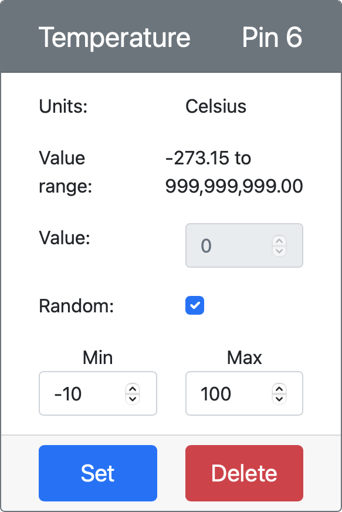

<!--
CO_OP_TRANSLATOR_METADATA:
{
  "original_hash": "d105b44deae539165855c976dcdeca99",
  "translation_date": "2025-08-27T21:23:02+00:00",
  "source_file": "2-farm/lessons/1-predict-plant-growth/README.md",
  "language_code": "id"
}
-->
# Prediksi Pertumbuhan Tanaman dengan IoT


> Sketchnote oleh [Nitya Narasimhan](https://github.com/nitya). Klik gambar untuk versi yang lebih besar.

## Kuis Pra-Pelajaran

[Kuis Pra-Pelajaran](https://black-meadow-040d15503.1.azurestaticapps.net/quiz/9)

## Pendahuluan

Tanaman membutuhkan beberapa hal untuk tumbuh - air, karbon dioksida, nutrisi, cahaya, dan panas. Dalam pelajaran ini, Anda akan belajar cara menghitung tingkat pertumbuhan dan kematangan tanaman dengan mengukur suhu udara.

Dalam pelajaran ini kita akan membahas:

* [Pertanian digital](../../../../../2-farm/lessons/1-predict-plant-growth)
* [Mengapa suhu penting dalam pertanian?](../../../../../2-farm/lessons/1-predict-plant-growth)
* [Mengukur suhu sekitar](../../../../../2-farm/lessons/1-predict-plant-growth)
* [Hari derajat pertumbuhan (GDD)](../../../../../2-farm/lessons/1-predict-plant-growth)
* [Menghitung GDD menggunakan data sensor suhu](../../../../../2-farm/lessons/1-predict-plant-growth)

## Pertanian Digital

Pertanian Digital mengubah cara kita bertani, dengan menggunakan alat untuk mengumpulkan, menyimpan, dan menganalisis data dari kegiatan pertanian. Saat ini kita berada dalam periode yang disebut sebagai 'Revolusi Industri Keempat' oleh Forum Ekonomi Dunia, dan munculnya pertanian digital disebut sebagai 'Revolusi Pertanian Keempat', atau 'Pertanian 4.0'.

> 🎓 Istilah Pertanian Digital juga mencakup seluruh 'rantai nilai pertanian', yaitu seluruh perjalanan dari ladang ke meja makan. Ini termasuk pelacakan kualitas hasil panen saat makanan dikirim dan diproses, sistem gudang dan e-commerce, bahkan aplikasi penyewaan traktor!

Perubahan ini memungkinkan petani untuk meningkatkan hasil panen, menggunakan lebih sedikit pupuk dan pestisida, serta menghemat air. Meskipun sebagian besar digunakan di negara-negara kaya, sensor dan perangkat lainnya perlahan-lahan menjadi lebih murah, sehingga lebih terjangkau di negara-negara berkembang.

Beberapa teknik yang dimungkinkan oleh pertanian digital adalah:

* Pengukuran suhu - mengukur suhu memungkinkan petani memprediksi pertumbuhan dan kematangan tanaman.
* Penyiraman otomatis - mengukur kelembaban tanah dan menyalakan sistem irigasi saat tanah terlalu kering, daripada penyiraman berdasarkan waktu. Penyiraman berdasarkan waktu dapat menyebabkan tanaman kekurangan air selama musim panas yang kering, atau kelebihan air saat hujan. Dengan menyiram hanya saat tanah membutuhkannya, petani dapat mengoptimalkan penggunaan air mereka.
* Pengendalian hama - petani dapat menggunakan kamera pada robot otomatis atau drone untuk memeriksa hama, lalu menerapkan pestisida hanya di tempat yang diperlukan, mengurangi jumlah pestisida yang digunakan dan mengurangi limpasan pestisida ke pasokan air lokal.

✅ Lakukan penelitian. Teknik lain apa yang digunakan untuk meningkatkan hasil pertanian?

> 🎓 Istilah 'Pertanian Presisi' digunakan untuk mendefinisikan pengamatan, pengukuran, dan respons terhadap tanaman berdasarkan per ladang, atau bahkan pada bagian tertentu dari ladang. Ini termasuk mengukur tingkat air, nutrisi, dan hama serta merespons secara akurat, seperti menyiram hanya sebagian kecil dari ladang.

## Mengapa Suhu Penting dalam Pertanian?

Saat belajar tentang tanaman, kebanyakan siswa diajarkan tentang pentingnya air, cahaya, karbon dioksida, dan nutrisi. Tanaman juga membutuhkan kehangatan untuk tumbuh - inilah mengapa tanaman berbunga di musim semi saat suhu meningkat, mengapa bunga salju atau daffodil dapat tumbuh lebih awal karena periode hangat yang singkat, dan mengapa rumah kaca sangat baik untuk menumbuhkan tanaman.

> 🎓 Rumah kaca dan rumah panas memiliki fungsi serupa, tetapi dengan perbedaan penting. Rumah panas dipanaskan secara buatan dan memungkinkan petani mengontrol suhu dengan lebih akurat, sedangkan rumah kaca mengandalkan matahari untuk kehangatan dan biasanya hanya memiliki kontrol berupa jendela atau bukaan lain untuk mengeluarkan panas.

Tanaman memiliki suhu dasar atau minimum, suhu optimal, dan suhu maksimum, semuanya berdasarkan suhu rata-rata harian.

* Suhu dasar - ini adalah suhu rata-rata harian minimum yang dibutuhkan tanaman untuk tumbuh.
* Suhu optimal - ini adalah suhu rata-rata harian terbaik untuk mendapatkan pertumbuhan maksimal.
* Suhu maksimum - ini adalah suhu maksimum yang dapat ditoleransi tanaman. Di atas suhu ini, tanaman akan menghentikan pertumbuhannya untuk menghemat air dan bertahan hidup.

> 💁 Ini adalah suhu rata-rata, dihitung dari suhu siang dan malam. Tanaman juga membutuhkan suhu yang berbeda antara siang dan malam untuk membantu mereka berfotosintesis lebih efisien dan menghemat energi di malam hari.

Setiap spesies tanaman memiliki nilai yang berbeda untuk suhu dasar, optimal, dan maksimum. Inilah mengapa beberapa tanaman tumbuh subur di negara panas, dan lainnya di negara dingin.

✅ Lakukan penelitian. Untuk tanaman apa pun yang Anda miliki di taman, sekolah, atau taman lokal, coba cari tahu suhu dasarnya.


Grafik di atas menunjukkan contoh grafik tingkat pertumbuhan terhadap suhu. Hingga suhu dasar, tidak ada pertumbuhan. Tingkat pertumbuhan meningkat hingga suhu optimal, lalu menurun setelah mencapai puncaknya. Pada suhu maksimum, pertumbuhan berhenti.

Bentuk grafik ini bervariasi dari satu spesies tanaman ke spesies lainnya. Beberapa memiliki penurunan tajam di atas suhu optimal, beberapa memiliki peningkatan yang lebih lambat dari suhu dasar ke suhu optimal.

> 💁 Agar petani mendapatkan pertumbuhan terbaik, mereka perlu mengetahui tiga nilai suhu ini dan memahami bentuk grafik untuk tanaman yang mereka tanam.

Jika seorang petani dapat mengontrol suhu, misalnya di rumah panas komersial, maka mereka dapat mengoptimalkan untuk tanaman mereka. Sebuah rumah panas komersial yang menanam tomat, misalnya, akan mengatur suhu sekitar 25°C di siang hari dan 20°C di malam hari untuk mendapatkan pertumbuhan tercepat.

> 🍅 Dengan menggabungkan suhu ini dengan lampu buatan, pupuk, dan kontrol tingkat CO2, petani komersial dapat menanam dan memanen sepanjang tahun.

## Mengukur Suhu Sekitar

Sensor suhu dapat digunakan dengan perangkat IoT untuk mengukur suhu sekitar.

### Tugas - mengukur suhu

Ikuti panduan yang relevan untuk memantau suhu menggunakan perangkat IoT Anda:

* [Arduino - Wio Terminal](wio-terminal-temp.md)
* [Komputer papan tunggal - Raspberry Pi](pi-temp.md)
* [Komputer papan tunggal - Perangkat virtual](virtual-device-temp.md)

## Hari Derajat Pertumbuhan

Hari derajat pertumbuhan (juga dikenal sebagai unit derajat pertumbuhan) adalah cara untuk mengukur pertumbuhan tanaman berdasarkan suhu. Dengan asumsi tanaman memiliki cukup air, nutrisi, dan CO2, suhu menentukan tingkat pertumbuhan.

Hari derajat pertumbuhan, atau GDD dihitung per hari sebagai suhu rata-rata dalam Celsius untuk satu hari di atas suhu dasar tanaman. Setiap tanaman membutuhkan sejumlah GDD tertentu untuk tumbuh, berbunga, atau menghasilkan dan mematangkan hasil panen. Semakin banyak GDD setiap hari, semakin cepat tanaman akan tumbuh.

> 🇺🇸 Untuk orang Amerika, hari derajat pertumbuhan juga dapat dihitung menggunakan Fahrenheit. 5 GDD (dalam Celsius) setara dengan 9 GDD (dalam Fahrenheit).

Rumus lengkap untuk GDD sedikit rumit, tetapi ada persamaan yang disederhanakan yang sering digunakan sebagai pendekatan yang baik:


* **GDD** - ini adalah jumlah hari derajat pertumbuhan
* **T max** - ini adalah suhu maksimum harian dalam derajat Celsius
* **T min** - ini adalah suhu minimum harian dalam derajat Celsius
* **T base** - ini adalah suhu dasar tanaman dalam derajat Celsius

> 💁 Ada variasi yang menangani T max di atas 30°C atau T min di bawah T base, tetapi kita akan mengabaikannya untuk saat ini.

### Contoh - Jagung 🌽

Tergantung pada varietasnya, jagung membutuhkan antara 800 dan 2.700 GDD untuk matang, dengan suhu dasar 10°C.

Pada hari pertama di atas suhu dasar, suhu berikut diukur:

| Pengukuran | Suhu °C |
| :--------- | :-----: |
| Maksimum   | 16      |
| Minimum    | 12      |

Memasukkan angka-angka ini ke dalam perhitungan kita:

* T max = 16
* T min = 12
* T base = 10

Ini memberikan perhitungan:


Jagung menerima 4 GDD pada hari itu. Dengan asumsi varietas jagung yang membutuhkan 800 GDD untuk matang, ia akan membutuhkan 796 GDD lagi untuk mencapai kematangan.

✅ Lakukan penelitian. Untuk tanaman apa pun yang Anda miliki di taman, sekolah, atau taman lokal, coba cari tahu jumlah GDD yang diperlukan untuk mencapai kematangan atau menghasilkan hasil panen.

## Menghitung GDD Menggunakan Data Sensor Suhu

Tanaman tidak tumbuh pada tanggal tetap - misalnya, Anda tidak bisa menanam benih dan tahu bahwa tanaman akan berbuah tepat 100 hari kemudian. Sebaliknya, sebagai petani, Anda dapat memiliki perkiraan kasar berapa lama tanaman membutuhkan waktu untuk tumbuh, lalu Anda akan memeriksa setiap hari untuk melihat kapan hasil panen siap.

Hal ini memiliki dampak besar pada tenaga kerja di ladang besar, dan berisiko petani melewatkan hasil panen yang siap lebih awal dari yang diharapkan. Dengan mengukur suhu, petani dapat menghitung GDD yang diterima tanaman, memungkinkan mereka hanya memeriksa saat mendekati kematangan yang diharapkan.

Dengan mengumpulkan data suhu menggunakan perangkat IoT, seorang petani dapat diberi tahu secara otomatis ketika tanaman mendekati kematangan. Arsitektur tipikal untuk ini adalah perangkat IoT mengukur suhu, lalu mengirimkan data telemetri ini melalui Internet menggunakan sesuatu seperti MQTT. Kode server kemudian mendengarkan data ini dan menyimpannya di suatu tempat, seperti ke dalam database. Ini berarti data dapat dianalisis nanti, seperti pekerjaan malam untuk menghitung GDD untuk hari itu, menjumlahkan GDD untuk setiap tanaman sejauh ini, dan memberi peringatan jika tanaman mendekati kematangan.


Kode server juga dapat menambahkan informasi tambahan ke data. Misalnya, perangkat IoT dapat mengirimkan pengenal untuk menunjukkan perangkat mana yang digunakan, dan kode server dapat menggunakan ini untuk mencari lokasi perangkat, serta tanaman apa yang sedang dipantau. Kode server juga dapat menambahkan data dasar seperti waktu saat ini karena beberapa perangkat IoT tidak memiliki perangkat keras yang diperlukan untuk melacak waktu yang akurat, atau memerlukan kode tambahan untuk membaca waktu saat ini melalui Internet.

✅ Mengapa menurut Anda ladang yang berbeda mungkin memiliki suhu yang berbeda?

### Tugas - mengirimkan informasi suhu

Ikuti panduan yang relevan untuk mengirimkan data suhu melalui MQTT menggunakan perangkat IoT Anda sehingga dapat dianalisis nanti:

* [Arduino - Wio Terminal](wio-terminal-temp-publish.md)
* [Komputer papan tunggal - Raspberry Pi/Perangkat IoT virtual](single-board-computer-temp-publish.md)

### Tugas - menangkap dan menyimpan informasi suhu

Setelah perangkat IoT mengirimkan telemetri, kode server dapat ditulis untuk berlangganan data ini dan menyimpannya. Alih-alih menyimpannya ke database, kode server akan menyimpannya ke file Comma Separated Values (CSV). File CSV menyimpan data sebagai baris nilai dalam bentuk teks, dengan setiap nilai dipisahkan oleh koma, dan setiap catatan pada baris baru. Ini adalah cara yang nyaman, dapat dibaca manusia, dan didukung dengan baik untuk menyimpan data sebagai file.

File CSV akan memiliki dua kolom - *tanggal* dan *suhu*. Kolom *tanggal* diatur sebagai tanggal dan waktu saat pesan diterima oleh server, sedangkan *suhu* berasal dari pesan telemetri.

1. Ulangi langkah-langkah dalam pelajaran 4 untuk membuat kode server yang berlangganan telemetri. Anda tidak perlu menambahkan kode untuk mengirimkan perintah.

    Langkah-langkah untuk ini adalah:

    * Konfigurasikan dan aktifkan Lingkungan Virtual Python

    * Instal paket pip paho-mqtt

    * Tulis kode untuk mendengarkan pesan MQTT yang diterbitkan pada topik telemetri

      > ⚠️ Anda dapat merujuk ke [instruksi dalam pelajaran 4 untuk membuat aplikasi Python untuk menerima telemetri jika diperlukan](../../../1-getting-started/lessons/4-connect-internet/README.md#receive-telemetry-from-the-mqtt-broker).

    Beri nama folder untuk proyek ini `temperature-sensor-server`.

1. Pastikan `client_name` mencerminkan proyek ini:

    ```cpp
    client_name = id + 'temperature_sensor_server'
    ```

1. Tambahkan impor berikut di bagian atas file, di bawah impor yang sudah ada:

    ```python
    from os import path
    import csv
    from datetime import datetime
    ```

    Ini mengimpor pustaka untuk membaca file, pustaka untuk berinteraksi dengan file CSV, dan pustaka untuk membantu dengan tanggal dan waktu.

1. Tambahkan kode berikut sebelum fungsi `handle_telemetry`:

    ```python
    temperature_file_name = 'temperature.csv'
    fieldnames = ['date', 'temperature']
    
    if not path.exists(temperature_file_name):
        with open(temperature_file_name, mode='w') as csv_file:
            writer = csv.DictWriter(csv_file, fieldnames=fieldnames)
            writer.writeheader()
    ```

    Kode ini mendeklarasikan beberapa konstanta untuk nama file yang akan ditulis, dan nama header kolom untuk file CSV. Baris pertama file CSV secara tradisional berisi header kolom yang dipisahkan oleh koma.

    Kode kemudian memeriksa apakah file CSV sudah ada. Jika tidak ada, file tersebut dibuat dengan header kolom pada baris pertama.

1. Tambahkan kode berikut ke akhir fungsi `handle_telemetry`:

    ```python
    with open(temperature_file_name, mode='a') as temperature_file:        
        temperature_writer = csv.DictWriter(temperature_file, fieldnames=fieldnames)
        temperature_writer.writerow({'date' : datetime.now().astimezone().replace(microsecond=0).isoformat(), 'temperature' : payload['temperature']})
    ```
Kode ini membuka file CSV, lalu menambahkan baris baru di akhir. Baris tersebut berisi data dan waktu saat ini yang diformat dalam format yang mudah dibaca manusia, diikuti oleh suhu yang diterima dari perangkat IoT. Data disimpan dalam [format ISO 8601](https://wikipedia.org/wiki/ISO_8601) dengan zona waktu, tetapi tanpa mikrodetik.

1. Jalankan kode ini seperti sebelumnya, pastikan perangkat IoT Anda mengirimkan data. File CSV bernama `temperature.csv` akan dibuat di folder yang sama. Jika Anda melihatnya, Anda akan melihat tanggal/waktu dan pengukuran suhu:

    ```output
    date,temperature
    2021-04-19T17:21:36-07:00,25
    2021-04-19T17:31:36-07:00,24
    2021-04-19T17:41:36-07:00,25
    ```

1. Jalankan kode ini untuk beberapa waktu untuk menangkap data. Idealnya, Anda harus menjalankannya selama satu hari penuh untuk mengumpulkan cukup data untuk perhitungan GDD.

    
> 💁 Jika Anda menggunakan Perangkat IoT Virtual, pilih kotak centang acak dan tetapkan rentang untuk menghindari mendapatkan suhu yang sama setiap kali nilai suhu dikembalikan.
     

    > 💁 Jika Anda ingin menjalankan ini selama satu hari penuh, maka Anda perlu memastikan komputer tempat kode server Anda berjalan tidak akan tidur, baik dengan mengubah pengaturan daya Anda, atau menjalankan sesuatu seperti [skrip Python untuk menjaga sistem tetap aktif](https://github.com/jaqsparow/keep-system-active).
    
> 💁 Anda dapat menemukan kode ini di folder [code-server/temperature-sensor-server](../../../../../2-farm/lessons/1-predict-plant-growth/code-server/temperature-sensor-server).

### Tugas - menghitung GDD menggunakan data yang disimpan

Setelah server menangkap data suhu, GDD untuk tanaman dapat dihitung.

Langkah-langkah untuk melakukannya secara manual adalah:

1. Temukan suhu dasar untuk tanaman. Misalnya, untuk stroberi suhu dasarnya adalah 10°C.

1. Dari `temperature.csv`, temukan suhu tertinggi dan terendah untuk hari itu.

1. Gunakan perhitungan GDD yang diberikan sebelumnya untuk menghitung GDD.

Sebagai contoh, jika suhu tertinggi untuk hari itu adalah 25°C, dan terendah adalah 12°C:


* 25 + 12 = 37
* 37 / 2 = 18.5
* 18.5 - 10 = 8.5

Oleh karena itu, stroberi telah menerima **8.5** GDD. Stroberi membutuhkan sekitar 250 GDD untuk berbuah, jadi masih perlu waktu.

---

## 🚀 Tantangan

Tanaman membutuhkan lebih dari sekadar panas untuk tumbuh. Apa hal lain yang dibutuhkan?

Untuk hal-hal ini, cari tahu apakah ada sensor yang dapat mengukurnya. Bagaimana dengan aktuator untuk mengontrol tingkat tersebut? Bagaimana Anda akan merancang satu atau lebih perangkat IoT untuk mengoptimalkan pertumbuhan tanaman?

## Kuis Pasca-Pelajaran

[Kuis Pasca-Pelajaran](https://black-meadow-040d15503.1.azurestaticapps.net/quiz/10)

## Tinjauan & Studi Mandiri

* Baca lebih lanjut tentang pertanian digital di [halaman Wikipedia Pertanian Digital](https://wikipedia.org/wiki/Digital_agriculture). Juga baca lebih lanjut tentang pertanian presisi di [halaman Wikipedia Pertanian Presisi](https://wikipedia.org/wiki/Precision_agriculture).
* Perhitungan hari derajat tumbuh (Growing Degree Days) yang lengkap lebih rumit daripada yang disederhanakan di sini. Baca lebih lanjut tentang persamaan yang lebih rumit dan cara menangani suhu di bawah baseline di [halaman Wikipedia Growing Degree Day](https://wikipedia.org/wiki/Growing_degree-day).
* Makanan mungkin langka di masa depan jika kita masih menggunakan metode yang sama untuk bertani. Pelajari lebih lanjut tentang teknik bertani berteknologi tinggi dalam [video Hi-Tech Farms of Future di YouTube](https://www.youtube.com/watch?v=KIEOuKD9KX8).

## Tugas

[Visualisasikan data GDD menggunakan Jupyter Notebook](assignment.md)

---

**Penafian**:  
Dokumen ini telah diterjemahkan menggunakan layanan penerjemahan AI [Co-op Translator](https://github.com/Azure/co-op-translator). Meskipun kami berupaya untuk memberikan hasil yang akurat, harap diperhatikan bahwa terjemahan otomatis mungkin mengandung kesalahan atau ketidakakuratan. Dokumen asli dalam bahasa aslinya harus dianggap sebagai sumber yang berwenang. Untuk informasi yang bersifat kritis, disarankan menggunakan jasa penerjemahan manusia profesional. Kami tidak bertanggung jawab atas kesalahpahaman atau interpretasi yang keliru yang timbul dari penggunaan terjemahan ini.