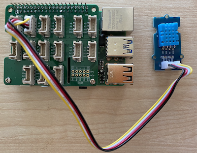

<!--
CO_OP_TRANSLATOR_METADATA:
{
  "original_hash": "7678f7c67b97ee52d5727496dcd7d346",
  "translation_date": "2025-08-28T01:40:16+00:00",
  "source_file": "2-farm/lessons/1-predict-plant-growth/pi-temp.md",
  "language_code": "id"
}
-->
# Mengukur Suhu - Raspberry Pi

Dalam bagian pelajaran ini, Anda akan menambahkan sensor suhu ke Raspberry Pi Anda.

## Perangkat Keras

Sensor yang akan Anda gunakan adalah [sensor kelembapan dan suhu DHT11](https://www.seeedstudio.com/Grove-Temperature-Humidity-Sensor-DHT11.html), yang menggabungkan 2 sensor dalam satu paket. Sensor ini cukup populer, dengan banyak sensor yang tersedia secara komersial yang menggabungkan suhu, kelembapan, dan kadang-kadang tekanan atmosfer. Komponen sensor suhu adalah termistor koefisien suhu negatif (NTC), yaitu termistor di mana resistansi berkurang saat suhu meningkat.

Ini adalah sensor digital, sehingga memiliki ADC onboard untuk membuat sinyal digital yang berisi data suhu dan kelembapan yang dapat dibaca oleh mikrokontroler.

### Menghubungkan Sensor Suhu

Sensor suhu Grove dapat dihubungkan ke Raspberry Pi.

#### Tugas

Hubungkan sensor suhu


1. Masukkan salah satu ujung kabel Grove ke soket pada sensor kelembapan dan suhu. Kabel hanya dapat masuk dengan satu arah.

1. Dengan Raspberry Pi dalam keadaan mati, hubungkan ujung lain kabel Grove ke soket digital yang ditandai **D5** pada Grove Base hat yang terpasang pada Pi. Soket ini adalah soket kedua dari kiri, pada baris soket di sebelah pin GPIO.



## Memprogram Sensor Suhu

Perangkat sekarang dapat diprogram untuk menggunakan sensor suhu yang terpasang.

### Tugas

Program perangkat.

1. Nyalakan Pi dan tunggu hingga selesai booting.

1. Luncurkan VS Code, baik langsung di Pi, atau sambungkan melalui ekstensi Remote SSH.

    > ⚠️ Anda dapat merujuk ke [instruksi untuk menyiapkan dan meluncurkan VS Code di pelajaran 1 jika diperlukan](../../../1-getting-started/lessons/1-introduction-to-iot/pi.md).

1. Dari terminal, buat folder baru di direktori home pengguna `pi` bernama `temperature-sensor`. Buat file di folder ini bernama `app.py`:

    ```sh
    mkdir temperature-sensor
    cd temperature-sensor
    touch app.py
    ```

1. Buka folder ini di VS Code.

1. Untuk menggunakan sensor suhu dan kelembapan, paket Pip tambahan perlu diinstal. Dari Terminal di VS Code, jalankan perintah berikut untuk menginstal paket Pip ini di Pi:

    ```sh
    pip3 install seeed-python-dht
    ```

1. Tambahkan kode berikut ke file `app.py` untuk mengimpor pustaka yang diperlukan:

    ```python
    import time
    from seeed_dht import DHT
    ```

    Pernyataan `from seeed_dht import DHT` mengimpor kelas `DHT` untuk berinteraksi dengan sensor suhu Grove dari modul `seeed_dht`.

1. Tambahkan kode berikut setelah kode di atas untuk membuat instance dari kelas yang mengelola sensor suhu:

    ```python
    sensor = DHT("11", 5)
    ```

    Ini mendeklarasikan instance dari kelas `DHT` yang mengelola sensor **D**igital **H**umidity dan **T**emperature. Parameter pertama memberi tahu kode bahwa sensor yang digunakan adalah sensor *DHT11* - pustaka yang Anda gunakan mendukung varian lain dari sensor ini. Parameter kedua memberi tahu kode bahwa sensor terhubung ke port digital `D5` pada Grove base hat.

    > ✅ Ingat, semua soket memiliki nomor pin yang unik. Pin 0, 2, 4, dan 6 adalah pin analog, sedangkan pin 5, 16, 18, 22, 24, dan 26 adalah pin digital.

1. Tambahkan loop tak terbatas setelah kode di atas untuk mengambil nilai sensor suhu dan mencetaknya ke konsol:

    ```python
    while True:
        _, temp = sensor.read()
        print(f'Temperature {temp}°C')
    ```

    Panggilan ke `sensor.read()` mengembalikan tuple kelembapan dan suhu. Anda hanya membutuhkan nilai suhu, sehingga kelembapan diabaikan. Nilai suhu kemudian dicetak ke konsol.

1. Tambahkan jeda kecil selama sepuluh detik di akhir `loop` karena tingkat suhu tidak perlu diperiksa secara terus-menerus. Jeda ini mengurangi konsumsi daya perangkat.

    ```python
    time.sleep(10)
    ```

1. Dari Terminal VS Code, jalankan perintah berikut untuk menjalankan aplikasi Python Anda:

    ```sh
    python3 app.py
    ```

    Anda seharusnya melihat nilai suhu yang ditampilkan di konsol. Gunakan sesuatu untuk menghangatkan sensor, seperti menekan ibu jari Anda pada sensor, atau menggunakan kipas untuk melihat nilai berubah:

    ```output
    pi@raspberrypi:~/temperature-sensor $ python3 app.py 
    Temperature 26°C
    Temperature 26°C
    Temperature 28°C
    Temperature 30°C
    Temperature 32°C
    ```

> 💁 Anda dapat menemukan kode ini di folder [code-temperature/pi](../../../../../2-farm/lessons/1-predict-plant-growth/code-temperature/pi).

😀 Program sensor suhu Anda berhasil!

---

**Penafian**:  
Dokumen ini telah diterjemahkan menggunakan layanan penerjemahan AI [Co-op Translator](https://github.com/Azure/co-op-translator). Meskipun kami berusaha untuk memberikan hasil yang akurat, harap diketahui bahwa terjemahan otomatis mungkin mengandung kesalahan atau ketidakakuratan. Dokumen asli dalam bahasa aslinya harus dianggap sebagai sumber yang otoritatif. Untuk informasi yang bersifat kritis, disarankan menggunakan jasa penerjemahan profesional oleh manusia. Kami tidak bertanggung jawab atas kesalahpahaman atau penafsiran yang keliru yang timbul dari penggunaan terjemahan ini.