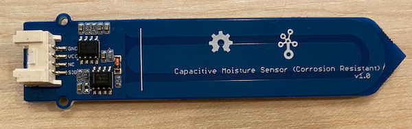

<!--
CO_OP_TRANSLATOR_METADATA:
{
  "original_hash": "0d55caa8c23d73635b7559102cd17b8a",
  "translation_date": "2025-08-27T21:53:36+00:00",
  "source_file": "2-farm/lessons/2-detect-soil-moisture/wio-terminal-soil-moisture.md",
  "language_code": "id"
}
-->
# Mengukur Kelembapan Tanah - Wio Terminal

Dalam bagian pelajaran ini, Anda akan menambahkan sensor kelembapan tanah kapasitif ke Wio Terminal, dan membaca nilai darinya.

## Perangkat Keras

Wio Terminal membutuhkan sensor kelembapan tanah kapasitif.

Sensor yang akan Anda gunakan adalah [Capacitive Soil Moisture Sensor](https://www.seeedstudio.com/Grove-Capacitive-Moisture-Sensor-Corrosion-Resistant.html), yang mengukur kelembapan tanah dengan mendeteksi kapasitansi tanah, sebuah sifat yang berubah seiring perubahan kelembapan tanah. Ketika kelembapan tanah meningkat, tegangan akan menurun.

Ini adalah sensor analog, sehingga terhubung ke pin analog pada Wio Terminal, menggunakan ADC bawaan untuk menghasilkan nilai dari 0-1.023.

### Hubungkan sensor kelembapan tanah

Sensor kelembapan tanah Grove dapat dihubungkan ke port analog/digital yang dapat dikonfigurasi pada Wio Terminal.

#### Tugas - hubungkan sensor kelembapan tanah

Hubungkan sensor kelembapan tanah.



1. Masukkan salah satu ujung kabel Grove ke soket pada sensor kelembapan tanah. Kabel hanya dapat masuk dengan satu arah.

1. Dengan Wio Terminal tidak terhubung ke komputer atau sumber daya lainnya, hubungkan ujung lain kabel Grove ke soket Grove di sisi kanan Wio Terminal saat Anda melihat layar. Ini adalah soket yang paling jauh dari tombol daya.


1. Masukkan sensor kelembapan tanah ke dalam tanah. Sensor memiliki 'garis posisi tertinggi' - garis putih melintang pada sensor. Masukkan sensor hingga garis ini, tetapi jangan melewati garis tersebut.


1. Sekarang Anda dapat menghubungkan Wio Terminal ke komputer Anda.

## Memprogram sensor kelembapan tanah

Wio Terminal sekarang dapat diprogram untuk menggunakan sensor kelembapan tanah yang terpasang.

### Tugas - memprogram sensor kelembapan tanah

Program perangkat.

1. Buat proyek Wio Terminal baru menggunakan PlatformIO. Beri nama proyek ini `soil-moisture-sensor`. Tambahkan kode dalam fungsi `setup` untuk mengonfigurasi port serial.

    > ⚠️ Anda dapat merujuk ke [instruksi untuk membuat proyek PlatformIO di proyek 1, pelajaran 1 jika diperlukan](../../../1-getting-started/lessons/1-introduction-to-iot/wio-terminal.md#create-a-platformio-project).

1. Tidak ada pustaka untuk sensor ini, tetapi Anda dapat membaca dari pin analog menggunakan fungsi bawaan Arduino [`analogRead`](https://www.arduino.cc/reference/en/language/functions/analog-io/analogread/). Mulailah dengan mengonfigurasi pin analog untuk input sehingga nilai dapat dibaca darinya dengan menambahkan kode berikut ke fungsi `setup`.

    ```cpp
    pinMode(A0, INPUT);
    ```

    Ini mengatur pin `A0`, pin analog/digital gabungan, sebagai pin input yang dapat membaca tegangan.

1. Tambahkan kode berikut ke fungsi `loop` untuk membaca tegangan dari pin ini:

    ```cpp
    int soil_moisture = analogRead(A0);
    ```

1. Di bawah kode ini, tambahkan kode berikut untuk mencetak nilai ke port serial:

    ```cpp
    Serial.print("Soil Moisture: ");
    Serial.println(soil_moisture);
    ```

1. Akhirnya tambahkan jeda selama 10 detik di akhir:

    ```cpp
    delay(10000);
    ```

1. Bangun dan unggah kode ke Wio Terminal.

    > ⚠️ Anda dapat merujuk ke [instruksi untuk membuat proyek PlatformIO di proyek 1, pelajaran 1 jika diperlukan](../../../1-getting-started/lessons/1-introduction-to-iot/wio-terminal.md#write-the-hello-world-app).

1. Setelah diunggah, Anda dapat memantau kelembapan tanah menggunakan serial monitor. Tambahkan air ke tanah, atau keluarkan sensor dari tanah, dan lihat nilai berubah.

    ```output
    > Executing task: platformio device monitor <
    
    --- Available filters and text transformations: colorize, debug, default, direct, hexlify, log2file, nocontrol, printable, send_on_enter, time
    --- More details at http://bit.ly/pio-monitor-filters
    --- Miniterm on /dev/cu.usbmodem1201  9600,8,N,1 ---
    --- Quit: Ctrl+C | Menu: Ctrl+T | Help: Ctrl+T followed by Ctrl+H ---
    Soil Moisture: 526
    Soil Moisture: 529
    Soil Moisture: 521
    Soil Moisture: 494
    Soil Moisture: 454
    Soil Moisture: 456
    Soil Moisture: 395
    Soil Moisture: 388
    Soil Moisture: 394
    Soil Moisture: 391
    ```

    Dalam contoh output di atas, Anda dapat melihat tegangan turun saat air ditambahkan.

> 💁 Anda dapat menemukan kode ini di folder [code/wio-terminal](../../../../../2-farm/lessons/2-detect-soil-moisture/code/wio-terminal).

😀 Program sensor kelembapan tanah Anda berhasil!

---

**Penafian**:  
Dokumen ini telah diterjemahkan menggunakan layanan penerjemahan AI [Co-op Translator](https://github.com/Azure/co-op-translator). Meskipun kami berusaha untuk memberikan hasil yang akurat, harap diingat bahwa terjemahan otomatis mungkin mengandung kesalahan atau ketidakakuratan. Dokumen asli dalam bahasa aslinya harus dianggap sebagai sumber yang otoritatif. Untuk informasi yang bersifat kritis, disarankan menggunakan jasa penerjemahan profesional oleh manusia. Kami tidak bertanggung jawab atas kesalahpahaman atau penafsiran yang keliru yang timbul dari penggunaan terjemahan ini.