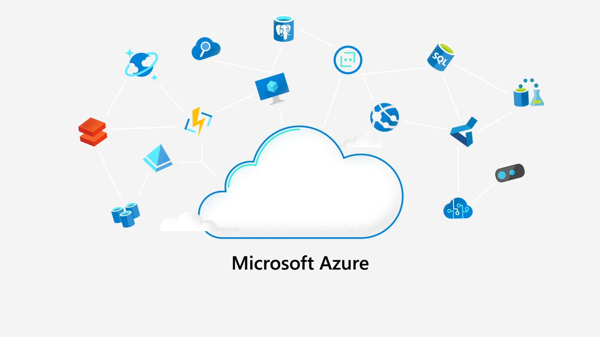

<!--
CO_OP_TRANSLATOR_METADATA:
{
  "original_hash": "4d8e7a066d75b625e7a979c14157041d",
  "translation_date": "2025-08-27T21:59:09+00:00",
  "source_file": "2-farm/lessons/4-migrate-your-plant-to-the-cloud/README.md",
  "language_code": "id"
}
-->
# Migrasikan tanaman Anda ke cloud


> Sketchnote oleh [Nitya Narasimhan](https://github.com/nitya). Klik gambar untuk versi yang lebih besar.

Pelajaran ini diajarkan sebagai bagian dari [Proyek IoT untuk Pemula - Seri Pertanian Digital](https://youtube.com/playlist?list=PLmsFUfdnGr3yCutmcVg6eAUEfsGiFXgcx) dari [Microsoft Reactor](https://developer.microsoft.com/reactor/?WT.mc_id=academic-17441-jabenn).

[](https://youtu.be/bNxjopXkhvk)

## Kuis sebelum pelajaran

[Kuis sebelum pelajaran](https://black-meadow-040d15503.1.azurestaticapps.net/quiz/15)

## Pengantar

Pada pelajaran sebelumnya, Anda telah belajar cara menghubungkan tanaman Anda ke broker MQTT dan mengontrol relay dari kode server yang berjalan secara lokal. Ini adalah inti dari sistem penyiraman otomatis yang terhubung ke internet, yang digunakan mulai dari tanaman individu di rumah hingga pertanian komersial.

Perangkat IoT berkomunikasi dengan broker MQTT publik sebagai cara untuk mendemonstrasikan prinsip-prinsipnya, tetapi ini bukan cara yang paling andal atau aman. Dalam pelajaran ini, Anda akan belajar tentang cloud dan kemampuan IoT yang disediakan oleh layanan cloud publik. Anda juga akan belajar cara memigrasikan tanaman Anda ke salah satu layanan cloud ini dari broker MQTT publik.

Dalam pelajaran ini kita akan membahas:

* [Apa itu cloud?](../../../../../2-farm/lessons/4-migrate-your-plant-to-the-cloud)
* [Buat langganan cloud](../../../../../2-farm/lessons/4-migrate-your-plant-to-the-cloud)
* [Layanan IoT di cloud](../../../../../2-farm/lessons/4-migrate-your-plant-to-the-cloud)
* [Buat layanan IoT di cloud](../../../../../2-farm/lessons/4-migrate-your-plant-to-the-cloud)
* [Berkomunikasi dengan IoT Hub](../../../../../2-farm/lessons/4-migrate-your-plant-to-the-cloud)
* [Hubungkan perangkat Anda ke layanan IoT](../../../../../2-farm/lessons/4-migrate-your-plant-to-the-cloud)

## Apa itu cloud?

Sebelum adanya cloud, ketika sebuah perusahaan ingin menyediakan layanan untuk karyawan mereka (seperti database atau penyimpanan file), atau untuk publik (seperti situs web), mereka akan membangun dan menjalankan pusat data. Ini bisa berupa ruangan dengan sejumlah kecil komputer, hingga gedung dengan banyak komputer. Perusahaan akan mengelola semuanya, termasuk:

* Membeli komputer
* Pemeliharaan perangkat keras
* Daya dan pendinginan
* Jaringan
* Keamanan, termasuk keamanan gedung dan perangkat lunak di komputer
* Instalasi dan pembaruan perangkat lunak

Hal ini bisa sangat mahal, membutuhkan berbagai macam karyawan yang terampil, dan sangat lambat untuk berubah ketika diperlukan. Misalnya, jika sebuah toko online perlu merencanakan musim liburan yang sibuk, mereka harus merencanakan berbulan-bulan sebelumnya untuk membeli lebih banyak perangkat keras, mengonfigurasinya, menginstalnya, dan menginstal perangkat lunak untuk menjalankan proses penjualan mereka. Setelah musim liburan selesai dan penjualan kembali turun, mereka akan memiliki komputer yang telah mereka bayar tetapi tidak digunakan hingga musim sibuk berikutnya.

✅ Apakah menurut Anda ini memungkinkan perusahaan untuk bergerak cepat? Jika sebuah toko pakaian online tiba-tiba menjadi populer karena seorang selebriti terlihat mengenakan pakaian mereka, apakah mereka dapat meningkatkan daya komputasi mereka dengan cepat untuk mendukung lonjakan pesanan yang tiba-tiba?

### Komputer milik orang lain

Cloud sering kali disebut secara bercanda sebagai 'komputer milik orang lain'. Ide awalnya sederhana - alih-alih membeli komputer, Anda menyewa komputer milik orang lain. Orang lain, penyedia komputasi cloud, akan mengelola pusat data besar. Mereka akan bertanggung jawab untuk membeli dan menginstal perangkat keras, mengelola daya dan pendinginan, jaringan, keamanan gedung, pembaruan perangkat keras dan perangkat lunak, semuanya. Sebagai pelanggan, Anda akan menyewa komputer yang Anda butuhkan, menyewa lebih banyak saat permintaan meningkat, lalu mengurangi jumlah yang Anda sewa jika permintaan menurun. Pusat data cloud ini ada di seluruh dunia.


Pusat data ini bisa memiliki ukuran beberapa kilometer persegi. Gambar di atas diambil beberapa tahun yang lalu di pusat data cloud Microsoft, dan menunjukkan ukuran awal, bersama dengan ekspansi yang direncanakan. Area yang dibersihkan untuk ekspansi lebih dari 5 kilometer persegi.

> 💁 Pusat data ini membutuhkan jumlah daya yang sangat besar sehingga beberapa memiliki pembangkit listrik sendiri. Karena ukurannya dan tingkat investasi dari penyedia cloud, mereka biasanya sangat ramah lingkungan. Mereka lebih efisien daripada sejumlah besar pusat data kecil, sebagian besar menggunakan energi terbarukan, dan penyedia cloud bekerja keras untuk mengurangi limbah, mengurangi penggunaan air, dan menanam kembali hutan untuk menggantikan yang ditebang untuk menyediakan ruang membangun pusat data. Anda dapat membaca lebih lanjut tentang bagaimana salah satu penyedia cloud bekerja pada keberlanjutan di [situs keberlanjutan Azure](https://azure.microsoft.com/global-infrastructure/sustainability/?WT.mc_id=academic-17441-jabenn).

✅ Lakukan penelitian: Bacalah tentang cloud utama seperti [Azure dari Microsoft](https://azure.microsoft.com/?WT.mc_id=academic-17441-jabenn) atau [GCP dari Google](https://cloud.google.com). Berapa banyak pusat data yang mereka miliki, dan di mana lokasi mereka di dunia?

Menggunakan cloud menjaga biaya tetap rendah untuk perusahaan, dan memungkinkan mereka untuk fokus pada apa yang mereka lakukan terbaik, meninggalkan keahlian komputasi cloud di tangan penyedia. Perusahaan tidak lagi perlu menyewa atau membeli ruang pusat data, membayar penyedia yang berbeda untuk konektivitas dan daya, atau mempekerjakan ahli. Sebaliknya, mereka dapat membayar satu tagihan bulanan kepada penyedia cloud untuk mengurus semuanya.

Penyedia cloud kemudian dapat menggunakan skala ekonomi untuk menekan biaya, membeli komputer dalam jumlah besar dengan biaya lebih rendah, berinvestasi dalam alat untuk mengurangi beban kerja mereka untuk pemeliharaan, bahkan merancang dan membangun perangkat keras mereka sendiri untuk meningkatkan penawaran cloud mereka.

### Microsoft Azure

Azure adalah cloud untuk pengembang dari Microsoft, dan ini adalah cloud yang akan Anda gunakan untuk pelajaran ini. Video di bawah memberikan gambaran singkat tentang Azure:

[](https://www.microsoft.com/videoplayer/embed/RE4Ibng?WT.mc_id=academic-17441-jabenn)

## Buat langganan cloud

Untuk menggunakan layanan di cloud, Anda perlu mendaftar untuk langganan dengan penyedia cloud. Untuk pelajaran ini, Anda akan mendaftar untuk langganan Microsoft Azure. Jika Anda sudah memiliki langganan Azure, Anda dapat melewati tugas ini. Detail langganan yang dijelaskan di sini benar pada saat penulisan, tetapi dapat berubah.

> 💁 Jika Anda mengakses pelajaran ini melalui sekolah Anda, Anda mungkin sudah memiliki langganan Azure yang tersedia untuk Anda. Periksa dengan guru Anda.

Ada dua jenis langganan Azure gratis yang dapat Anda daftarkan:

* **Azure untuk Pelajar** - Ini adalah langganan yang dirancang untuk pelajar berusia 18+. Anda tidak memerlukan kartu kredit untuk mendaftar, dan Anda menggunakan alamat email sekolah Anda untuk memvalidasi bahwa Anda adalah pelajar. Saat Anda mendaftar, Anda mendapatkan US$100 untuk digunakan pada sumber daya cloud, bersama dengan layanan gratis termasuk versi gratis dari layanan IoT. Ini berlaku selama 12 bulan, dan Anda dapat memperbarui setiap tahun selama Anda tetap menjadi pelajar.

* **Langganan Azure gratis** - Ini adalah langganan untuk siapa saja yang bukan pelajar. Anda akan memerlukan kartu kredit untuk mendaftar langganan ini, tetapi kartu Anda tidak akan dikenakan biaya, ini hanya digunakan untuk memverifikasi bahwa Anda adalah manusia nyata, bukan bot. Anda mendapatkan $200 kredit untuk digunakan dalam 30 hari pertama pada layanan apa pun, bersama dengan tingkat gratis dari layanan Azure. Setelah kredit Anda habis, kartu Anda tidak akan dikenakan biaya kecuali Anda mengonversi ke langganan bayar sesuai penggunaan.

> 💁 Microsoft memang menawarkan langganan Azure untuk Pelajar Starter untuk pelajar di bawah 18 tahun, tetapi pada saat penulisan ini tidak mendukung layanan IoT apa pun.

### Tugas - daftar untuk langganan cloud gratis

Jika Anda adalah pelajar berusia 18+, maka Anda dapat mendaftar untuk langganan Azure untuk Pelajar. Anda perlu memvalidasi dengan alamat email sekolah. Anda dapat melakukannya dengan dua cara:

* Daftar untuk paket pengembang pelajar GitHub di [education.github.com/pack](https://education.github.com/pack). Ini memberi Anda akses ke berbagai alat dan penawaran, termasuk GitHub dan Microsoft Azure. Setelah Anda mendaftar untuk paket pengembang, Anda kemudian dapat mengaktifkan penawaran Azure untuk Pelajar.

* Daftar langsung untuk akun Azure untuk Pelajar di [azure.microsoft.com/free/students](https://azure.microsoft.com/free/students/?WT.mc_id=academic-17441-jabenn).

> ⚠️ Jika alamat email sekolah Anda tidak dikenali, buat [isu di repo ini](https://github.com/Microsoft/IoT-For-Beginners/issues) dan kami akan melihat apakah itu dapat ditambahkan ke daftar yang diizinkan Azure untuk Pelajar.

Jika Anda bukan pelajar, atau Anda tidak memiliki alamat email sekolah yang valid, maka Anda dapat mendaftar untuk langganan Azure Gratis.

* Daftar untuk Langganan Azure Gratis di [azure.microsoft.com/free](https://azure.microsoft.com/free/?WT.mc_id=academic-17441-jabenn)

## Layanan IoT di cloud

Broker MQTT publik yang telah Anda gunakan adalah alat yang hebat saat belajar, tetapi memiliki sejumlah kekurangan sebagai alat untuk digunakan dalam pengaturan komersial:

* Keandalan - ini adalah layanan gratis tanpa jaminan, dan dapat dimatikan kapan saja
* Keamanan - ini bersifat publik, sehingga siapa pun dapat mendengarkan telemetri Anda atau mengirim perintah untuk mengontrol perangkat keras Anda
* Performa - ini dirancang hanya untuk beberapa pesan uji, sehingga tidak akan mampu menangani sejumlah besar pesan yang dikirim
* Penemuan - tidak ada cara untuk mengetahui perangkat apa yang terhubung

Layanan IoT di cloud menyelesaikan masalah ini. Mereka dikelola oleh penyedia cloud besar yang berinvestasi besar-besaran dalam keandalan dan siap untuk memperbaiki masalah apa pun yang mungkin muncul. Mereka memiliki keamanan yang terintegrasi untuk menghentikan peretas membaca data Anda atau mengirim perintah palsu. Mereka juga memiliki performa tinggi, mampu menangani jutaan pesan setiap hari, memanfaatkan cloud untuk meningkatkan skala sesuai kebutuhan.

> 💁 Meskipun Anda membayar untuk keuntungan ini dengan biaya bulanan, sebagian besar penyedia cloud menawarkan versi gratis dari layanan IoT mereka dengan jumlah pesan per hari atau perangkat yang dapat terhubung yang terbatas. Versi gratis ini biasanya lebih dari cukup bagi pengembang untuk mempelajari tentang layanan tersebut. Dalam pelajaran ini Anda akan menggunakan versi gratis.

Perangkat IoT terhubung ke layanan cloud baik menggunakan SDK perangkat (perpustakaan yang menyediakan kode untuk bekerja dengan fitur layanan), atau langsung melalui protokol komunikasi seperti MQTT atau HTTP. SDK perangkat biasanya merupakan rute termudah karena menangani semuanya untuk Anda, seperti mengetahui topik apa yang harus dipublikasikan atau berlangganan, dan cara menangani keamanan.


Perangkat Anda kemudian berkomunikasi dengan bagian lain dari aplikasi Anda melalui layanan ini - mirip dengan cara Anda mengirim telemetri dan menerima perintah melalui MQTT. Ini biasanya menggunakan SDK layanan atau perpustakaan serupa. Pesan datang dari perangkat Anda ke layanan di mana komponen lain dari aplikasi Anda kemudian dapat membacanya, dan pesan kemudian dapat dikirim kembali ke perangkat Anda.


Layanan ini menerapkan keamanan dengan mengetahui semua perangkat yang dapat terhubung dan mengirim data, baik dengan memiliki perangkat yang telah terdaftar sebelumnya dengan layanan, atau dengan memberikan perangkat kunci rahasia atau sertifikat yang dapat mereka gunakan untuk mendaftarkan diri mereka dengan layanan saat pertama kali terhubung. Perangkat yang tidak dikenal tidak dapat terhubung, jika mereka mencoba layanan akan menolak koneksi dan mengabaikan pesan yang dikirim oleh mereka.

✅ Lakukan penelitian: Apa kelemahan dari memiliki layanan IoT terbuka di mana perangkat atau kode apa pun dapat terhubung? Bisakah Anda menemukan contoh spesifik peretas yang memanfaatkan hal ini?

Komponen lain dari aplikasi Anda dapat terhubung ke layanan IoT dan mempelajari semua perangkat yang terhubung atau terdaftar, serta berkomunikasi dengan mereka secara langsung baik secara massal maupun individu.
💁 Layanan IoT juga menerapkan kemampuan tambahan, dan penyedia cloud memiliki layanan serta aplikasi tambahan yang dapat dihubungkan ke layanan tersebut. Sebagai contoh, jika Anda ingin menyimpan semua pesan telemetri yang dikirim oleh semua perangkat ke dalam sebuah database, biasanya hanya membutuhkan beberapa klik pada alat konfigurasi penyedia cloud untuk menghubungkan layanan ke database dan mengalirkan data ke dalamnya.
## Membuat layanan IoT di cloud

Sekarang Anda memiliki langganan Azure, Anda dapat mendaftar untuk layanan IoT. Layanan IoT dari Microsoft disebut Azure IoT Hub.


Video di bawah ini memberikan gambaran singkat tentang Azure IoT Hub:

[](https://www.youtube.com/watch?v=smuZaZZXKsU)

> 🎥 Klik gambar di atas untuk menonton video

✅ Luangkan waktu untuk melakukan penelitian dan baca gambaran umum IoT Hub di [dokumentasi Microsoft IoT Hub](https://docs.microsoft.com/azure/iot-hub/about-iot-hub?WT.mc_id=academic-17441-jabenn).

Layanan cloud yang tersedia di Azure dapat dikonfigurasi melalui portal berbasis web, atau melalui antarmuka baris perintah (CLI). Untuk tugas ini, Anda akan menggunakan CLI.

### Tugas - instal Azure CLI

Untuk menggunakan Azure CLI, pertama-tama harus diinstal di PC atau Mac Anda.

1. Ikuti petunjuk di [dokumentasi Azure CLI](https://docs.microsoft.com/cli/azure/install-azure-cli?WT.mc_id=academic-17441-jabenn) untuk menginstal CLI.

1. Azure CLI mendukung sejumlah ekstensi yang menambahkan kemampuan untuk mengelola berbagai layanan Azure. Instal ekstensi IoT dengan menjalankan perintah berikut dari baris perintah atau terminal Anda:

    ```sh
    az extension add --name azure-iot
    ```

1. Dari baris perintah atau terminal Anda, jalankan perintah berikut untuk masuk ke langganan Azure Anda dari Azure CLI.

    ```sh
    az login
    ```

    Sebuah halaman web akan diluncurkan di browser default Anda. Masuk menggunakan akun yang Anda gunakan untuk mendaftar langganan Azure Anda. Setelah Anda masuk, Anda dapat menutup tab browser.

1. Jika Anda memiliki beberapa langganan Azure, seperti langganan yang disediakan oleh sekolah, dan langganan Azure untuk Pelajar Anda sendiri, Anda perlu memilih yang ingin Anda gunakan. Jalankan perintah berikut untuk melihat semua langganan yang Anda miliki aksesnya:

    ```sh
    az account list --output table
    ```

    Dalam output, Anda akan melihat nama setiap langganan bersama dengan `SubscriptionId`.

    ```output
    ➜  ~ az account list --output table
    Name                    CloudName    SubscriptionId                        State    IsDefault
    ----------------------  -----------  ------------------------------------  -------  -----------
    School-subscription     AzureCloud   cb30cde9-814a-42f0-a111-754cb788e4e1  Enabled  True
    Azure for Students      AzureCloud   fa51c31b-162c-4599-add6-781def2e1fbf  Enabled  False
    ```

    Untuk memilih langganan yang ingin Anda gunakan, gunakan perintah berikut:

    ```sh
    az account set --subscription <SubscriptionId>
    ```

    Ganti `<SubscriptionId>` dengan Id dari langganan yang ingin Anda gunakan. Setelah menjalankan perintah ini, jalankan kembali perintah untuk melihat akun Anda. Anda akan melihat kolom `IsDefault` akan ditandai sebagai `True` untuk langganan yang baru saja Anda tetapkan.

### Tugas - membuat grup sumber daya

Layanan Azure, seperti instance IoT Hub, mesin virtual, basis data, atau layanan AI, disebut sebagai **sumber daya**. Setiap sumber daya harus berada di dalam **Grup Sumber Daya**, yaitu pengelompokan logis dari satu atau lebih sumber daya.

> 💁 Dengan menggunakan grup sumber daya, Anda dapat mengelola beberapa layanan sekaligus. Misalnya, setelah Anda menyelesaikan semua pelajaran untuk proyek ini, Anda dapat menghapus grup sumber daya, dan semua sumber daya di dalamnya akan dihapus secara otomatis.

1. Ada beberapa pusat data Azure di seluruh dunia, yang dibagi menjadi wilayah. Saat Anda membuat sumber daya atau grup sumber daya Azure, Anda harus menentukan di mana Anda ingin membuatnya. Jalankan perintah berikut untuk mendapatkan daftar lokasi:

    ```sh
    az account list-locations --output table
    ```

    Anda akan melihat daftar lokasi. Daftar ini akan panjang.

    > 💁 Pada saat penulisan, ada 65 lokasi yang dapat Anda gunakan untuk penyebaran.

    ```output
        ➜  ~ az account list-locations --output table
    DisplayName               Name                 RegionalDisplayName
    ------------------------  -------------------  -------------------------------------
    East US                   eastus               (US) East US
    East US 2                 eastus2              (US) East US 2
    South Central US          southcentralus       (US) South Central US
    ...
    ```

    Catat nilai dari kolom `Name` dari wilayah yang paling dekat dengan Anda. Anda dapat menemukan wilayah tersebut di peta pada [halaman geografi Azure](https://azure.microsoft.com/global-infrastructure/geographies/?WT.mc_id=academic-17441-jabenn).

1. Jalankan perintah berikut untuk membuat grup sumber daya bernama `soil-moisture-sensor`. Nama grup sumber daya harus unik dalam langganan Anda.

    ```sh
    az group create --name soil-moisture-sensor \
                    --location <location>
    ```

    Ganti `<location>` dengan lokasi yang Anda pilih pada langkah sebelumnya.

### Tugas - membuat IoT Hub

Sekarang Anda dapat membuat sumber daya IoT Hub di grup sumber daya Anda.

1. Gunakan perintah berikut untuk membuat sumber daya IoT Hub Anda:

    ```sh
    az iot hub create --resource-group soil-moisture-sensor \
                      --sku F1 \
                      --partition-count 2 \
                      --name <hub_name>
    ```

    Ganti `<hub_name>` dengan nama untuk hub Anda. Nama ini harus unik secara global - artinya tidak ada IoT Hub lain yang dibuat oleh siapa pun yang dapat memiliki nama yang sama. Nama ini digunakan dalam URL yang menunjuk ke hub, sehingga harus unik. Gunakan sesuatu seperti `soil-moisture-sensor-` dan tambahkan pengidentifikasi unik di akhir, seperti beberapa kata acak atau nama Anda.

    Opsi `--sku F1` memberi tahu untuk menggunakan tingkat gratis. Tingkat gratis mendukung 8.000 pesan sehari bersama dengan sebagian besar fitur dari tingkat berbayar penuh.

    > 🎓 Tingkat harga yang berbeda dari layanan Azure disebut sebagai tingkat. Setiap tingkat memiliki biaya yang berbeda dan menyediakan fitur atau volume data yang berbeda.

    > 💁 Jika Anda ingin mempelajari lebih lanjut tentang harga, Anda dapat melihat [panduan harga Azure IoT Hub](https://azure.microsoft.com/pricing/details/iot-hub/?WT.mc_id=academic-17441-jabenn).

    Opsi `--partition-count 2` mendefinisikan berapa banyak aliran data yang didukung oleh IoT Hub, lebih banyak partisi mengurangi pemblokiran data saat beberapa hal membaca dan menulis dari IoT Hub. Partisi berada di luar cakupan pelajaran ini, tetapi nilai ini perlu diatur untuk membuat IoT Hub tingkat gratis.

    > 💁 Anda hanya dapat memiliki satu IoT Hub tingkat gratis per langganan.

IoT Hub akan dibuat. Proses ini mungkin memakan waktu satu menit atau lebih untuk selesai.

## Berkomunikasi dengan IoT Hub

Dalam pelajaran sebelumnya, Anda menggunakan MQTT dan mengirim pesan bolak-balik pada topik yang berbeda, dengan topik yang berbeda memiliki tujuan yang berbeda. Alih-alih mengirim pesan melalui topik yang berbeda, IoT Hub memiliki sejumlah cara yang ditentukan untuk perangkat berkomunikasi dengan Hub, atau Hub berkomunikasi dengan perangkat.

> 💁 Di balik layar, komunikasi antara IoT Hub dan perangkat Anda dapat menggunakan MQTT, HTTPS, atau AMQP.

* Pesan dari perangkat ke cloud (D2C) - ini adalah pesan yang dikirim dari perangkat ke IoT Hub, seperti telemetri. Pesan ini kemudian dapat dibaca dari IoT Hub oleh kode aplikasi Anda.

    > 🎓 Di balik layar, IoT Hub menggunakan layanan Azure yang disebut [Event Hubs](https://docs.microsoft.com/azure/event-hubs/?WT.mc_id=academic-17441-jabenn). Saat Anda menulis kode untuk membaca pesan yang dikirim ke hub, pesan ini sering disebut sebagai peristiwa.

* Pesan dari cloud ke perangkat (C2D) - ini adalah pesan yang dikirim dari kode aplikasi, melalui IoT Hub ke perangkat IoT.

* Permintaan metode langsung - ini adalah pesan yang dikirim dari kode aplikasi melalui IoT Hub ke perangkat IoT untuk meminta perangkat melakukan sesuatu, seperti mengontrol aktuator. Pesan ini memerlukan respons sehingga kode aplikasi Anda dapat mengetahui apakah pesan tersebut berhasil diproses.

* Device twins - ini adalah dokumen JSON yang disinkronkan antara perangkat dan IoT Hub, dan digunakan untuk menyimpan pengaturan atau properti lain yang dilaporkan oleh perangkat, atau yang harus diatur pada perangkat (disebut sebagai desired) oleh IoT Hub.

IoT Hub dapat menyimpan pesan dan permintaan metode langsung untuk periode waktu yang dapat dikonfigurasi (defaultnya satu hari), sehingga jika perangkat atau kode aplikasi kehilangan koneksi, perangkat masih dapat mengambil pesan yang dikirim saat offline setelah terhubung kembali. Device twins disimpan secara permanen di IoT Hub, sehingga kapan saja perangkat dapat terhubung kembali dan mendapatkan device twin terbaru.

✅ Lakukan penelitian: Baca lebih lanjut tentang jenis pesan ini di [panduan komunikasi perangkat-ke-cloud](https://docs.microsoft.com/azure/iot-hub/iot-hub-devguide-d2c-guidance?WT.mc_id=academic-17441-jabenn), dan [panduan komunikasi cloud-ke-perangkat](https://docs.microsoft.com/azure/iot-hub/iot-hub-devguide-c2d-guidance?WT.mc_id=academic-17441-jabenn) dalam dokumentasi IoT Hub.

## Hubungkan perangkat Anda ke layanan IoT

Setelah hub dibuat, perangkat IoT Anda dapat terhubung ke hub tersebut. Hanya perangkat yang terdaftar yang dapat terhubung ke layanan, jadi Anda perlu mendaftarkan perangkat Anda terlebih dahulu. Saat Anda mendaftar, Anda akan mendapatkan string koneksi yang dapat digunakan perangkat untuk terhubung. String koneksi ini spesifik untuk perangkat, dan berisi informasi tentang IoT Hub, perangkat, dan kunci rahasia yang memungkinkan perangkat ini terhubung.

> 🎓 String koneksi adalah istilah umum untuk teks yang berisi detail koneksi. String ini digunakan saat terhubung ke IoT Hub, basis data, dan banyak layanan lainnya. Biasanya terdiri dari pengidentifikasi untuk layanan, seperti URL, dan informasi keamanan seperti kunci rahasia. String ini diteruskan ke SDK untuk terhubung ke layanan.

> ⚠️ String koneksi harus dijaga keamanannya! Keamanan akan dibahas lebih rinci dalam pelajaran mendatang.

### Tugas - mendaftarkan perangkat IoT Anda

Perangkat IoT dapat didaftarkan ke IoT Hub Anda menggunakan Azure CLI.

1. Jalankan perintah berikut untuk mendaftarkan perangkat:

    ```sh
    az iot hub device-identity create --device-id soil-moisture-sensor \
                                      --hub-name <hub_name>
    ```

    Ganti `<hub_name>` dengan nama yang Anda gunakan untuk IoT Hub Anda.

    Ini akan membuat perangkat dengan ID `soil-moisture-sensor`.

1. Saat perangkat IoT Anda terhubung ke IoT Hub Anda menggunakan SDK, perangkat tersebut perlu menggunakan string koneksi yang memberikan URL hub, bersama dengan kunci rahasia. Jalankan perintah berikut untuk mendapatkan string koneksi:

    ```sh
    az iot hub device-identity connection-string show --device-id soil-moisture-sensor \
                                                      --output table \
                                                      --hub-name <hub_name>
    ```

    Ganti `<hub_name>` dengan nama yang Anda gunakan untuk IoT Hub Anda.

1. Simpan string koneksi yang ditampilkan dalam output karena Anda akan membutuhkannya nanti.

### Tugas - hubungkan perangkat IoT Anda ke cloud

Ikuti panduan yang relevan untuk menghubungkan perangkat IoT Anda ke cloud:

* [Arduino - Wio Terminal](wio-terminal-connect-hub.md)
* [Komputer papan tunggal - Raspberry Pi/Perangkat IoT virtual](single-board-computer-connect-hub.md)

### Tugas - memantau peristiwa

Untuk saat ini, Anda tidak akan memperbarui kode server Anda. Sebagai gantinya, Anda dapat menggunakan Azure CLI untuk memantau peristiwa dari perangkat IoT Anda.

1. Pastikan perangkat IoT Anda berjalan dan mengirimkan nilai telemetri kelembapan tanah.

1. Jalankan perintah berikut di command prompt atau terminal Anda untuk memantau pesan yang dikirim ke IoT Hub Anda:

    ```sh
    az iot hub monitor-events --hub-name <hub_name>
    ```

    Ganti `<hub_name>` dengan nama yang Anda gunakan untuk IoT Hub Anda.

    Anda akan melihat pesan muncul di output konsol saat dikirim oleh perangkat IoT Anda.

    ```output
    Starting event monitor, use ctrl-c to stop...
    {
        "event": {
            "origin": "soil-moisture-sensor",
            "module": "",
            "interface": "",
            "component": "",
            "payload": "{\"soil_moisture\": 376}"
        }
    },
    {
        "event": {
            "origin": "soil-moisture-sensor",
            "module": "",
            "interface": "",
            "component": "",
            "payload": "{\"soil_moisture\": 381}"
        }
    }
    ```

    Isi `payload` akan sesuai dengan pesan yang dikirim oleh perangkat IoT Anda.

    > Pada saat penulisan, ekstensi `az iot` belum sepenuhnya berfungsi di Apple Silicon. Jika Anda menggunakan perangkat Apple Silicon, Anda perlu memantau pesan dengan cara yang berbeda, seperti menggunakan [Azure IoT Tools untuk Visual Studio Code](https://docs.microsoft.com/en-us/azure/iot-hub/iot-hub-vscode-iot-toolkit-cloud-device-messaging).

1. Pesan-pesan ini memiliki sejumlah properti yang secara otomatis dilampirkan, seperti stempel waktu saat pesan dikirim. Properti ini dikenal sebagai *annotations*. Untuk melihat semua anotasi pesan, gunakan perintah berikut:

    ```sh
    az iot hub monitor-events --properties anno --hub-name <hub_name>
    ```

    Ganti `<hub_name>` dengan nama yang Anda gunakan untuk IoT Hub Anda.

    Anda akan melihat pesan muncul di output konsol saat dikirim oleh perangkat IoT Anda.

    ```output
    Starting event monitor, use ctrl-c to stop...
    {
        "event": {
            "origin": "soil-moisture-sensor",
            "module": "",
            "interface": "",
            "component": "",
            "properties": {},
            "annotations": {
                "iothub-connection-device-id": "soil-moisture-sensor",
                "iothub-connection-auth-method": "{\"scope\":\"device\",\"type\":\"sas\",\"issuer\":\"iothub\",\"acceptingIpFilterRule\":null}",
                "iothub-connection-auth-generation-id": "637553997165220462",
                "iothub-enqueuedtime": 1619976150288,
                "iothub-message-source": "Telemetry",
                "x-opt-sequence-number": 1379,
                "x-opt-offset": "550576",
                "x-opt-enqueued-time": 1619976150277
            },
            "payload": "{\"soil_moisture\": 381}"
        }
    }
    ```

    Nilai waktu dalam anotasi berada dalam [waktu UNIX](https://wikipedia.org/wiki/Unix_time), yang mewakili jumlah detik sejak tengah malam pada 1 Januari 1970.

    Keluar dari monitor peristiwa saat Anda selesai.

### Tugas - mengontrol perangkat IoT Anda

Anda juga dapat menggunakan Azure CLI untuk memanggil metode langsung pada perangkat IoT Anda.

1. Jalankan perintah berikut di command prompt atau terminal Anda untuk memanggil metode `relay_on` pada perangkat IoT:
<hub_name>
` dengan nama yang Anda gunakan untuk IoT Hub Anda.

Ini mengirimkan permintaan metode langsung untuk metode yang ditentukan oleh `method-name`. Metode langsung dapat menerima payload yang berisi data untuk metode tersebut, dan ini dapat ditentukan dalam parameter `method-payload` sebagai JSON.

Anda akan melihat relay menyala, dan output yang sesuai dari perangkat IoT Anda:

```output
    Direct method received -  relay_on
    ```

1. Ulangi langkah di atas, tetapi atur `--method-name` ke `relay_off`. Anda akan melihat relay mati dan output yang sesuai dari perangkat IoT.

---

## 🚀 Tantangan

Tier gratis IoT Hub memungkinkan 8.000 pesan per hari. Kode yang Anda tulis mengirimkan pesan telemetri setiap 10 detik. Berapa banyak pesan per hari jika satu pesan dikirim setiap 10 detik?

Pikirkan tentang seberapa sering pengukuran kelembapan tanah harus dikirim? Bagaimana Anda dapat mengubah kode Anda agar tetap dalam tier gratis dan memeriksa sesering yang diperlukan tetapi tidak terlalu sering? Bagaimana jika Anda ingin menambahkan perangkat kedua?

## Kuis setelah kuliah

[Kuis setelah kuliah](https://black-meadow-040d15503.1.azurestaticapps.net/quiz/16)

## Tinjauan & Studi Mandiri

SDK IoT Hub bersifat open source untuk Arduino dan Python. Di repositori kode di GitHub terdapat sejumlah contoh yang menunjukkan cara bekerja dengan berbagai fitur IoT Hub.

* Jika Anda menggunakan Wio Terminal, lihat [contoh Arduino di GitHub](https://github.com/Azure/azure-iot-pal-arduino/tree/master/pal/samples)
* Jika Anda menggunakan Raspberry Pi atau perangkat virtual, lihat [contoh Python di GitHub](https://github.com/Azure/azure-iot-sdk-python/tree/master/azure-iot-hub/samples)

## Tugas

[Pelajari tentang layanan cloud](assignment.md)

---

**Penafian**:  
Dokumen ini telah diterjemahkan menggunakan layanan penerjemahan AI [Co-op Translator](https://github.com/Azure/co-op-translator). Meskipun kami berusaha untuk memberikan hasil yang akurat, harap diingat bahwa terjemahan otomatis mungkin mengandung kesalahan atau ketidakakuratan. Dokumen asli dalam bahasa aslinya harus dianggap sebagai sumber yang otoritatif. Untuk informasi yang bersifat kritis, disarankan menggunakan jasa penerjemahan profesional oleh manusia. Kami tidak bertanggung jawab atas kesalahpahaman atau penafsiran yang keliru yang timbul dari penggunaan terjemahan ini.