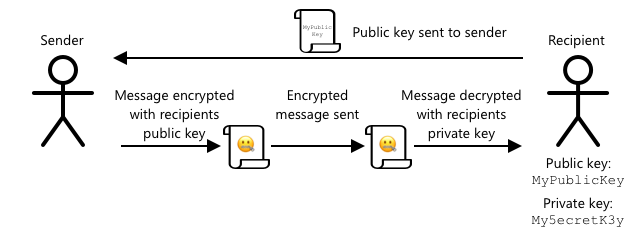

<!--
CO_OP_TRANSLATOR_METADATA:
{
  "original_hash": "81c437c568eee1b0dda1f04e88150d37",
  "translation_date": "2025-08-28T01:25:57+00:00",
  "source_file": "2-farm/lessons/6-keep-your-plant-secure/README.md",
  "language_code": "id"
}
-->
# Menjaga Keamanan Tanaman Anda


> Sketchnote oleh [Nitya Narasimhan](https://github.com/nitya). Klik gambar untuk versi yang lebih besar.

## Kuis Pra-Pelajaran

[Kuis Pra-Pelajaran](https://black-meadow-040d15503.1.azurestaticapps.net/quiz/19)

## Pendahuluan

Dalam beberapa pelajaran terakhir, Anda telah membuat perangkat IoT untuk memantau kelembapan tanah dan menghubungkannya ke cloud. Tetapi bagaimana jika peretas yang bekerja untuk petani pesaing berhasil mengambil alih perangkat IoT Anda? Bagaimana jika mereka mengirimkan pembacaan kelembapan tanah yang tinggi sehingga tanaman Anda tidak pernah disiram, atau menghidupkan sistem penyiraman Anda terus-menerus sehingga tanaman Anda mati karena terlalu banyak air dan Anda harus mengeluarkan biaya besar untuk air?

Dalam pelajaran ini, Anda akan belajar tentang cara mengamankan perangkat IoT. Karena ini adalah pelajaran terakhir untuk proyek ini, Anda juga akan belajar cara membersihkan sumber daya cloud Anda, mengurangi potensi biaya.

Dalam pelajaran ini kita akan membahas:

* [Mengapa Anda perlu mengamankan perangkat IoT?](../../../../../2-farm/lessons/6-keep-your-plant-secure)
* [Kriptografi](../../../../../2-farm/lessons/6-keep-your-plant-secure)
* [Mengamankan perangkat IoT Anda](../../../../../2-farm/lessons/6-keep-your-plant-secure)
* [Membuat dan menggunakan sertifikat X.509](../../../../../2-farm/lessons/6-keep-your-plant-secure)

> 🗑 Ini adalah pelajaran terakhir dalam proyek ini, jadi setelah menyelesaikan pelajaran dan tugas, jangan lupa untuk membersihkan layanan cloud Anda. Anda akan membutuhkan layanan tersebut untuk menyelesaikan tugas, jadi pastikan untuk menyelesaikannya terlebih dahulu.
>
> Lihat [panduan membersihkan proyek Anda](../../../clean-up.md) jika diperlukan untuk instruksi tentang cara melakukannya.

## Mengapa Anda perlu mengamankan perangkat IoT?

Keamanan IoT melibatkan memastikan bahwa hanya perangkat yang diharapkan yang dapat terhubung ke layanan IoT cloud Anda dan mengirimkan telemetri, serta hanya layanan cloud Anda yang dapat mengirimkan perintah ke perangkat Anda. Data IoT juga bisa bersifat pribadi, termasuk data medis atau data intim, sehingga seluruh aplikasi Anda perlu mempertimbangkan keamanan untuk mencegah kebocoran data ini.

Jika aplikasi IoT Anda tidak aman, ada sejumlah risiko:

* Perangkat palsu dapat mengirimkan data yang salah, menyebabkan aplikasi Anda merespons secara tidak benar. Misalnya, mereka dapat mengirimkan pembacaan kelembapan tanah yang tinggi secara terus-menerus, sehingga sistem irigasi Anda tidak pernah menyala dan tanaman Anda mati karena kekurangan air.
* Pengguna yang tidak sah dapat membaca data dari perangkat IoT termasuk data pribadi atau data bisnis yang penting.
* Peretas dapat mengirimkan perintah untuk mengontrol perangkat dengan cara yang dapat merusak perangkat atau perangkat keras yang terhubung.
* Dengan terhubung ke perangkat IoT, peretas dapat menggunakan ini untuk mengakses jaringan tambahan untuk mendapatkan akses ke sistem pribadi.
* Pengguna jahat dapat mengakses data pribadi dan menggunakannya untuk pemerasan.

Ini adalah skenario dunia nyata, dan terjadi sepanjang waktu. Beberapa contoh telah diberikan dalam pelajaran sebelumnya, tetapi berikut adalah beberapa lagi:

* Pada tahun 2018, peretas menggunakan titik akses WiFi terbuka pada termostat akuarium untuk mendapatkan akses ke jaringan kasino dan mencuri data. [The Hacker News - Casino Gets Hacked Through Its Internet-Connected Fish Tank Thermometer](https://thehackernews.com/2018/04/iot-hacking-thermometer.html)
* Pada tahun 2016, Mirai Botnet meluncurkan serangan denial of service terhadap Dyn, penyedia layanan Internet, yang menyebabkan sebagian besar Internet terganggu. Botnet ini menggunakan malware untuk terhubung ke perangkat IoT seperti DVR dan kamera yang menggunakan nama pengguna dan kata sandi default, dan dari sana meluncurkan serangan. [The Guardian - DDoS attack that disrupted internet was largest of its kind in history, experts say](https://www.theguardian.com/technology/2016/oct/26/ddos-attack-dyn-mirai-botnet)
* Spiral Toys memiliki database pengguna mainan CloudPets mereka yang terhubung, tersedia secara publik di Internet. [Troy Hunt - Data from connected CloudPets teddy bears leaked and ransomed, exposing kids' voice messages](https://www.troyhunt.com/data-from-connected-cloudpets-teddy-bears-leaked-and-ransomed-exposing-kids-voice-messages/).
* Strava menandai pelari yang Anda lewati dan menunjukkan rute mereka, memungkinkan orang asing untuk melihat di mana Anda tinggal. [Kim Komndo - Fitness app could lead a stranger right to your home — change this setting](https://www.komando.com/security-privacy/strava-fitness-app-privacy/755349/).

✅ Lakukan penelitian: Cari lebih banyak contoh peretasan IoT dan pelanggaran data IoT, terutama dengan barang-barang pribadi seperti sikat gigi atau timbangan yang terhubung ke Internet. Pikirkan tentang dampak peretasan ini terhadap korban atau pelanggan.

> 💁 Keamanan adalah topik yang sangat luas, dan pelajaran ini hanya akan menyentuh beberapa dasar tentang menghubungkan perangkat Anda ke cloud. Topik lain yang tidak akan dibahas termasuk pemantauan perubahan data selama transit, peretasan perangkat secara langsung, atau perubahan konfigurasi perangkat. Peretasan IoT adalah ancaman yang begitu besar sehingga alat seperti [Azure Defender for IoT](https://azure.microsoft.com/services/azure-defender-for-iot/?WT.mc_id=academic-17441-jabenn) telah dikembangkan. Alat-alat ini mirip dengan alat antivirus dan keamanan yang mungkin Anda miliki di komputer Anda, tetapi dirancang untuk perangkat IoT kecil dan berdaya rendah.

## Kriptografi

Ketika sebuah perangkat terhubung ke layanan IoT, ia menggunakan ID untuk mengidentifikasi dirinya. Masalahnya adalah ID ini dapat dikloning - peretas dapat mengatur perangkat jahat yang menggunakan ID yang sama dengan perangkat asli tetapi mengirimkan data palsu.


Cara mengatasinya adalah dengan mengubah data yang dikirim menjadi format yang teracak, menggunakan nilai tertentu untuk mengacak data yang hanya diketahui oleh perangkat dan cloud. Proses ini disebut *enkripsi*, dan nilai yang digunakan untuk mengenkripsi data disebut *kunci enkripsi*.


Layanan cloud kemudian dapat mengubah data kembali ke format yang dapat dibaca, menggunakan proses yang disebut *dekripsi*, menggunakan kunci enkripsi yang sama, atau *kunci dekripsi*. Jika pesan terenkripsi tidak dapat didekripsi oleh kunci, perangkat telah diretas dan pesan ditolak.

Teknik untuk melakukan enkripsi dan dekripsi disebut *kriptografi*.

### Kriptografi Awal

Jenis kriptografi paling awal adalah substitusi cipher, yang berasal dari 3.500 tahun yang lalu. Substitusi cipher melibatkan penggantian satu huruf dengan huruf lain. Misalnya, [Caesar cipher](https://wikipedia.org/wiki/Caesar_cipher) melibatkan pergeseran alfabet dengan jumlah tertentu, dengan hanya pengirim pesan terenkripsi dan penerima yang dimaksud mengetahui berapa banyak huruf yang harus digeser.

[Vigenère cipher](https://wikipedia.org/wiki/Vigenère_cipher) membawa ini lebih jauh dengan menggunakan kata-kata untuk mengenkripsi teks, sehingga setiap huruf dalam teks asli digeser dengan jumlah yang berbeda, bukan selalu bergeser dengan jumlah huruf yang sama.

Kriptografi digunakan untuk berbagai tujuan, seperti melindungi resep glasir tembikar di Mesopotamia kuno, menulis catatan cinta rahasia di India, atau menjaga rahasia mantra magis Mesir kuno.

### Kriptografi Modern

Kriptografi modern jauh lebih maju, membuatnya lebih sulit untuk dipecahkan dibandingkan metode awal. Kriptografi modern menggunakan matematika yang rumit untuk mengenkripsi data dengan terlalu banyak kemungkinan kunci untuk membuat serangan brute force menjadi mungkin.

Kriptografi digunakan dalam banyak cara untuk komunikasi yang aman. Jika Anda membaca halaman ini di GitHub, Anda mungkin memperhatikan alamat situs web dimulai dengan *HTTPS*, yang berarti komunikasi antara browser Anda dan server web GitHub dienkripsi. Jika seseorang dapat membaca lalu lintas internet yang mengalir antara browser Anda dan GitHub, mereka tidak akan dapat membaca data karena data tersebut dienkripsi. Komputer Anda bahkan mungkin mengenkripsi semua data di hard drive Anda sehingga jika seseorang mencurinya, mereka tidak akan dapat membaca data Anda tanpa kata sandi Anda.

> 🎓 HTTPS adalah singkatan dari HyperText Transfer Protocol **Secure**

Sayangnya, tidak semuanya aman. Beberapa perangkat tidak memiliki keamanan, yang lain diamankan menggunakan kunci yang mudah dipecahkan, atau kadang-kadang bahkan semua perangkat dari jenis yang sama menggunakan kunci yang sama. Ada laporan tentang perangkat IoT yang sangat pribadi yang semuanya memiliki kata sandi yang sama untuk terhubung ke mereka melalui WiFi atau Bluetooth. Jika Anda dapat terhubung ke perangkat Anda sendiri, Anda dapat terhubung ke perangkat orang lain. Setelah terhubung, Anda dapat mengakses data yang sangat pribadi, atau memiliki kontrol atas perangkat mereka.

> 💁 Meskipun kompleksitas kriptografi modern dan klaim bahwa memecahkan enkripsi dapat memakan waktu miliaran tahun, munculnya komputasi kuantum telah membuka kemungkinan untuk memecahkan semua enkripsi yang diketahui dalam waktu yang sangat singkat!

### Kunci Simetris dan Asimetris

Enkripsi datang dalam dua jenis - simetris dan asimetris.

**Enkripsi simetris** menggunakan kunci yang sama untuk mengenkripsi dan mendekripsi data. Baik pengirim maupun penerima perlu mengetahui kunci yang sama. Ini adalah jenis yang paling tidak aman, karena kunci harus dibagikan dengan cara tertentu. Agar pengirim dapat mengirim pesan terenkripsi kepada penerima, pengirim mungkin harus terlebih dahulu mengirimkan kunci kepada penerima.


Jika kunci dicuri dalam perjalanan, atau pengirim atau penerima diretas dan kunci ditemukan, enkripsi dapat dipecahkan.


**Enkripsi asimetris** menggunakan 2 kunci - kunci enkripsi dan kunci dekripsi, yang disebut sebagai pasangan kunci publik/pribadi. Kunci publik digunakan untuk mengenkripsi pesan, tetapi tidak dapat digunakan untuk mendekripsi, sedangkan kunci pribadi digunakan untuk mendekripsi pesan tetapi tidak dapat digunakan untuk mengenkripsi.



Penerima membagikan kunci publik mereka, dan pengirim menggunakan ini untuk mengenkripsi pesan. Setelah pesan dikirim, penerima mendekripsinya dengan kunci pribadi mereka. Enkripsi asimetris lebih aman karena kunci pribadi disimpan oleh penerima dan tidak pernah dibagikan. Siapa pun dapat memiliki kunci publik karena hanya dapat digunakan untuk mengenkripsi pesan.

Enkripsi simetris lebih cepat daripada enkripsi asimetris, tetapi enkripsi asimetris lebih aman. Beberapa sistem akan menggunakan keduanya - menggunakan enkripsi asimetris untuk mengenkripsi dan membagikan kunci simetris, lalu menggunakan kunci simetris untuk mengenkripsi semua data. Ini membuatnya lebih aman untuk membagikan kunci simetris antara pengirim dan penerima, dan lebih cepat saat mengenkripsi dan mendekripsi data.

## Mengamankan perangkat IoT Anda

Perangkat IoT dapat diamankan menggunakan enkripsi simetris atau asimetris. Simetris lebih mudah, tetapi kurang aman.

### Kunci Simetris

Saat Anda mengatur perangkat IoT Anda untuk berinteraksi dengan IoT Hub, Anda menggunakan string koneksi. Contoh string koneksi adalah:

```output
HostName=soil-moisture-sensor.azure-devices.net;DeviceId=soil-moisture-sensor;SharedAccessKey=Bhry+ind7kKEIDxubK61RiEHHRTrPl7HUow8cEm/mU0=
```

String koneksi ini terdiri dari tiga bagian yang dipisahkan oleh titik koma, dengan setiap bagian berupa kunci dan nilai:

| Kunci | Nilai | Deskripsi |
| --- | ----- | ----------- |
| HostName | `soil-moisture-sensor.azure-devices.net` | URL dari IoT Hub |
| DeviceId | `soil-moisture-sensor` | ID unik perangkat |
| SharedAccessKey | `Bhry+ind7kKEIDxubK61RiEHHRTrPl7HUow8cEm/mU0=` | Kunci simetris yang diketahui oleh perangkat dan IoT Hub |

Bagian terakhir dari string koneksi ini, `SharedAccessKey`, adalah kunci simetris yang diketahui oleh perangkat dan IoT Hub. Kunci ini tidak pernah dikirim dari perangkat ke cloud, atau dari cloud ke perangkat. Sebaliknya, kunci ini digunakan untuk mengenkripsi data yang dikirim atau diterima.

✅ Lakukan eksperimen. Apa yang Anda pikirkan akan terjadi jika Anda mengubah bagian `SharedAccessKey` dari string koneksi saat menghubungkan perangkat IoT Anda? Cobalah.

Ketika perangkat pertama kali mencoba terhubung, ia mengirimkan token tanda tangan akses bersama (SAS) yang terdiri dari URL IoT Hub, stempel waktu kapan tanda tangan akses akan kedaluwarsa (biasanya 1 hari dari waktu saat ini), dan tanda tangan. Tanda tangan ini terdiri dari URL dan waktu kedaluwarsa yang dienkripsi dengan kunci akses bersama dari string koneksi.

IoT Hub mendekripsi tanda tangan ini dengan kunci akses bersama, dan jika nilai yang didekripsi cocok dengan URL dan waktu kedaluwarsa, perangkat diizinkan untuk terhubung. IoT Hub juga memverifikasi bahwa waktu saat ini sebelum waktu kedaluwarsa, untuk mencegah perangkat jahat menangkap token SAS dari perangkat asli dan menggunakannya.

Ini adalah cara yang elegan untuk memverifikasi bahwa pengirim adalah perangkat yang benar. Dengan mengirimkan beberapa data yang diketahui dalam bentuk yang tidak terenkripsi dan terenkripsi, server dapat memverifikasi perangkat dengan memastikan bahwa ketika ia mendekripsi data terenkripsi, hasilnya cocok dengan versi yang tidak terenkripsi yang dikirim. Jika cocok, maka pengirim dan penerima memiliki kunci enkripsi simetris yang sama.
💁 Karena waktu kedaluwarsa, perangkat IoT Anda perlu mengetahui waktu yang akurat, biasanya dibaca dari server [NTP](https://wikipedia.org/wiki/Network_Time_Protocol). Jika waktu tidak akurat, koneksi akan gagal.
Setelah koneksi terjalin, semua data yang dikirim ke IoT Hub dari perangkat, atau ke perangkat dari IoT Hub akan dienkripsi menggunakan shared access key.

✅ Apa yang menurut Anda akan terjadi jika beberapa perangkat menggunakan connection string yang sama?

> 💁 Menyimpan kunci ini di dalam kode adalah praktik keamanan yang buruk. Jika seorang peretas mendapatkan kode sumber Anda, mereka dapat mengambil kunci tersebut. Selain itu, ini juga menyulitkan saat merilis kode karena Anda harus mengompilasi ulang dengan kunci yang diperbarui untuk setiap perangkat. Lebih baik memuat kunci ini dari hardware security module - sebuah chip pada perangkat IoT yang menyimpan nilai-nilai terenkripsi yang dapat dibaca oleh kode Anda.
>
> Saat mempelajari IoT, seringkali lebih mudah untuk memasukkan kunci ke dalam kode, seperti yang Anda lakukan di pelajaran sebelumnya, tetapi Anda harus memastikan bahwa kunci ini tidak dimasukkan ke dalam kontrol kode sumber publik.

Perangkat memiliki 2 kunci, dan 2 connection string yang sesuai. Ini memungkinkan Anda untuk mengganti kunci - yaitu beralih dari satu kunci ke kunci lainnya jika kunci pertama dikompromikan, dan menghasilkan ulang kunci pertama.

### Sertifikat X.509

Ketika Anda menggunakan enkripsi asimetris dengan pasangan kunci publik/pribadi, Anda perlu memberikan kunci publik Anda kepada siapa pun yang ingin mengirimkan data kepada Anda. Masalahnya adalah, bagaimana penerima kunci Anda dapat yakin bahwa itu benar-benar kunci publik Anda, bukan seseorang yang berpura-pura menjadi Anda? Alih-alih memberikan kunci, Anda dapat memberikan kunci publik Anda di dalam sertifikat yang telah diverifikasi oleh pihak ketiga yang terpercaya, yang disebut sertifikat X.509.

Sertifikat X.509 adalah dokumen digital yang berisi bagian kunci publik dari pasangan kunci publik/pribadi. Sertifikat ini biasanya diterbitkan oleh sejumlah organisasi terpercaya yang disebut [Certification Authorities](https://wikipedia.org/wiki/Certificate_authority) (CA), dan ditandatangani secara digital oleh CA untuk menunjukkan bahwa kunci tersebut valid dan berasal dari Anda. Anda mempercayai sertifikat tersebut dan bahwa kunci publik berasal dari siapa yang disebutkan dalam sertifikat, karena Anda mempercayai CA, mirip dengan bagaimana Anda mempercayai paspor atau SIM karena Anda mempercayai negara yang menerbitkannya. Sertifikat memerlukan biaya, jadi Anda juga dapat 'menandatangani sendiri', yaitu membuat sertifikat sendiri yang ditandatangani oleh Anda, untuk tujuan pengujian.

> 💁 Anda tidak boleh menggunakan sertifikat yang ditandatangani sendiri untuk rilis produksi.

Sertifikat ini memiliki sejumlah bidang di dalamnya, termasuk siapa pemilik kunci publik, detail CA yang menerbitkannya, berapa lama sertifikat tersebut berlaku, dan kunci publik itu sendiri. Sebelum menggunakan sertifikat, adalah praktik yang baik untuk memverifikasinya dengan memeriksa bahwa sertifikat tersebut ditandatangani oleh CA asli.

✅ Anda dapat membaca daftar lengkap bidang dalam sertifikat di [tutorial Microsoft Understanding X.509 Public Key Certificates](https://docs.microsoft.com/azure/iot-hub/tutorial-x509-certificates?WT.mc_id=academic-17441-jabenn#certificate-fields)

Saat menggunakan sertifikat X.509, baik pengirim maupun penerima akan memiliki kunci publik dan pribadi mereka sendiri, serta sertifikat X.509 yang berisi kunci publik. Mereka kemudian saling bertukar sertifikat X.509, menggunakan kunci publik masing-masing untuk mengenkripsi data yang mereka kirim, dan kunci pribadi mereka sendiri untuk mendekripsi data yang mereka terima.


Salah satu keuntungan besar menggunakan sertifikat X.509 adalah bahwa sertifikat ini dapat dibagikan di antara perangkat. Anda dapat membuat satu sertifikat, mengunggahnya ke IoT Hub, dan menggunakannya untuk semua perangkat Anda. Setiap perangkat kemudian hanya perlu mengetahui kunci pribadi untuk mendekripsi pesan yang diterima dari IoT Hub.

Sertifikat yang digunakan oleh perangkat Anda untuk mengenkripsi pesan yang dikirim ke IoT Hub diterbitkan oleh Microsoft. Ini adalah sertifikat yang sama yang digunakan oleh banyak layanan Azure, dan terkadang sudah terintegrasi dalam SDK.

> 💁 Ingat, kunci publik adalah sesuatu yang bersifat publik. Kunci publik Azure hanya dapat digunakan untuk mengenkripsi data yang dikirim ke Azure, bukan untuk mendekripsinya, sehingga dapat dibagikan di mana saja, termasuk dalam kode sumber. Sebagai contoh, Anda dapat melihatnya di [kode sumber Azure IoT C SDK](https://github.com/Azure/azure-iot-sdk-c/blob/master/certs/certs.c).

✅ Ada banyak istilah teknis terkait sertifikat X.509. Anda dapat membaca definisi beberapa istilah yang mungkin Anda temui di [Panduan sederhana untuk istilah sertifikat X.509](https://techcommunity.microsoft.com/t5/internet-of-things/the-layman-s-guide-to-x-509-certificate-jargon/ba-p/2203540?WT.mc_id=academic-17441-jabenn)

## Membuat dan menggunakan sertifikat X.509

Langkah-langkah untuk membuat sertifikat X.509 adalah:

1. Membuat pasangan kunci publik/pribadi. Salah satu algoritma yang paling banyak digunakan untuk membuat pasangan kunci publik/pribadi adalah [Rivest–Shamir–Adleman](https://wikipedia.org/wiki/RSA_(cryptosystem)) (RSA).

2. Mengirimkan kunci publik beserta data terkait untuk ditandatangani, baik oleh CA, atau dengan menandatangani sendiri.

Azure CLI memiliki perintah untuk membuat identitas perangkat baru di IoT Hub, dan secara otomatis menghasilkan pasangan kunci publik/pribadi serta membuat sertifikat yang ditandatangani sendiri.

> 💁 Jika Anda ingin melihat langkah-langkahnya secara detail, alih-alih menggunakan Azure CLI, Anda dapat menemukannya di [tutorial Menggunakan OpenSSL untuk membuat sertifikat yang ditandatangani sendiri dalam dokumentasi Microsoft IoT Hub](https://docs.microsoft.com/azure/iot-hub/tutorial-x509-self-sign?WT.mc_id=academic-17441-jabenn)

### Tugas - membuat identitas perangkat menggunakan sertifikat X.509

1. Jalankan perintah berikut untuk mendaftarkan identitas perangkat baru, secara otomatis menghasilkan kunci dan sertifikat:

    ```sh
    az iot hub device-identity create --device-id soil-moisture-sensor-x509 \
                                      --am x509_thumbprint \
                                      --output-dir . \
                                      --hub-name <hub_name>
    ```

    Ganti `<hub_name>` dengan nama yang Anda gunakan untuk IoT Hub Anda.

    Ini akan membuat perangkat dengan ID `soil-moisture-sensor-x509` untuk membedakannya dari identitas perangkat yang Anda buat di pelajaran sebelumnya. Perintah ini juga akan membuat 2 file di direktori saat ini:

    * `soil-moisture-sensor-x509-key.pem` - file ini berisi kunci pribadi untuk perangkat.
    * `soil-moisture-sensor-x509-cert.pem` - ini adalah file sertifikat X.509 untuk perangkat.

    Simpan file-file ini dengan aman! File kunci pribadi tidak boleh dimasukkan ke dalam kontrol kode sumber publik.

### Tugas - menggunakan sertifikat X.509 dalam kode perangkat Anda

Ikuti panduan yang relevan untuk menghubungkan perangkat IoT Anda ke cloud menggunakan sertifikat X.509:

* [Arduino - Wio Terminal](wio-terminal-x509.md)
* [Single-board computer - Raspberry Pi/Virtual IoT device](single-board-computer-x509.md)

---

## 🚀 Tantangan

Ada beberapa cara untuk membuat, mengelola, dan menghapus layanan Azure seperti Resource Groups dan IoT Hubs. Salah satu caranya adalah melalui [Azure Portal](https://portal.azure.com?WT.mc_id=academic-17441-jabenn) - antarmuka berbasis web yang memberikan GUI untuk mengelola layanan Azure Anda.

Kunjungi [portal.azure.com](https://portal.azure.com?WT.mc_id=academic-17441-jabenn) dan jelajahi portal tersebut. Cobalah untuk membuat IoT Hub menggunakan portal, lalu hapus IoT Hub tersebut.

**Petunjuk** - saat membuat layanan melalui portal, Anda tidak perlu membuat Resource Group terlebih dahulu, karena Resource Group dapat dibuat saat Anda membuat layanan. Pastikan Anda menghapusnya setelah selesai!

Anda dapat menemukan banyak dokumentasi, tutorial, dan panduan tentang Azure Portal di [dokumentasi Azure Portal](https://docs.microsoft.com/azure/azure-portal/?WT.mc_id=academic-17441-jabenn).

## Kuis Pasca-Kuliah

[Kuis Pasca-Kuliah](https://black-meadow-040d15503.1.azurestaticapps.net/quiz/20)

## Tinjauan & Studi Mandiri

* Pelajari sejarah kriptografi di [halaman Sejarah Kriptografi di Wikipedia](https://wikipedia.org/wiki/History_of_cryptography).
* Pelajari tentang sertifikat X.509 di [halaman X.509 di Wikipedia](https://wikipedia.org/wiki/X.509).

## Tugas

[Membangun perangkat IoT baru](assignment.md)

---

**Penafian**:  
Dokumen ini telah diterjemahkan menggunakan layanan penerjemahan AI [Co-op Translator](https://github.com/Azure/co-op-translator). Meskipun kami berusaha untuk memberikan hasil yang akurat, harap diingat bahwa terjemahan otomatis mungkin mengandung kesalahan atau ketidakakuratan. Dokumen asli dalam bahasa aslinya harus dianggap sebagai sumber yang otoritatif. Untuk informasi yang bersifat kritis, disarankan menggunakan jasa penerjemahan manusia profesional. Kami tidak bertanggung jawab atas kesalahpahaman atau penafsiran yang keliru yang timbul dari penggunaan terjemahan ini.