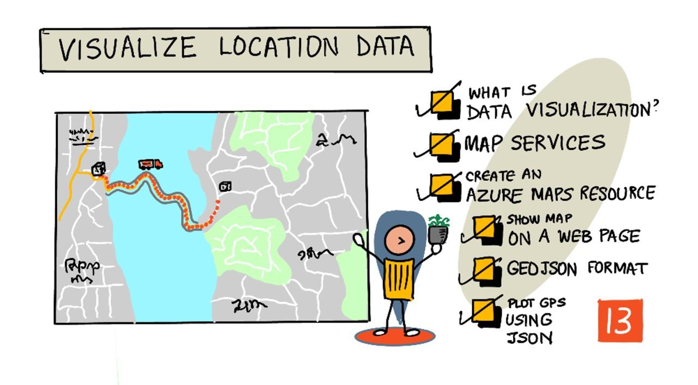
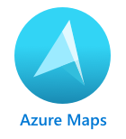

<!--
CO_OP_TRANSLATOR_METADATA:
{
  "original_hash": "9095c61445c2bca7245ef9b59a186a11",
  "translation_date": "2025-08-27T23:49:00+00:00",
  "source_file": "3-transport/lessons/3-visualize-location-data/README.md",
  "language_code": "id"
}
-->
# Visualisasi Data Lokasi



> Sketchnote oleh [Nitya Narasimhan](https://github.com/nitya). Klik gambar untuk versi yang lebih besar.

Video ini memberikan gambaran tentang Azure Maps dengan IoT, layanan yang akan dibahas dalam pelajaran ini.

[](https://www.youtube.com/watch?v=P5i2GFTtb2s)

> 🎥 Klik gambar di atas untuk menonton video

## Kuis Sebelum Pelajaran

[Kuis Sebelum Pelajaran](https://black-meadow-040d15503.1.azurestaticapps.net/quiz/25)

## Pendahuluan

Pada pelajaran sebelumnya, Anda telah mempelajari cara mendapatkan data GPS dari sensor Anda untuk disimpan di cloud dalam wadah penyimpanan menggunakan kode tanpa server. Sekarang Anda akan belajar cara memvisualisasikan titik-titik tersebut pada peta Azure. Anda akan mempelajari cara membuat peta di halaman web, memahami format data GeoJSON, dan cara menggunakannya untuk memplot semua titik GPS yang telah ditangkap pada peta Anda.

Dalam pelajaran ini kita akan membahas:

* [Apa itu visualisasi data](../../../../../3-transport/lessons/3-visualize-location-data)
* [Layanan peta](../../../../../3-transport/lessons/3-visualize-location-data)
* [Membuat sumber daya Azure Maps](../../../../../3-transport/lessons/3-visualize-location-data)
* [Menampilkan peta di halaman web](../../../../../3-transport/lessons/3-visualize-location-data)
* [Format GeoJSON](../../../../../3-transport/lessons/3-visualize-location-data)
* [Memplot data GPS pada peta menggunakan GeoJSON](../../../../../3-transport/lessons/3-visualize-location-data)

> 💁 Pelajaran ini akan melibatkan sedikit HTML dan JavaScript. Jika Anda ingin mempelajari lebih lanjut tentang pengembangan web menggunakan HTML dan JavaScript, lihat [Pengembangan Web untuk Pemula](https://github.com/microsoft/Web-Dev-For-Beginners).

## Apa itu visualisasi data

Visualisasi data, seperti namanya, adalah tentang memvisualisasikan data dengan cara yang memudahkan manusia untuk memahaminya. Biasanya dikaitkan dengan grafik dan diagram, tetapi juga mencakup cara apa pun untuk merepresentasikan data secara visual agar manusia tidak hanya memahami data dengan lebih baik, tetapi juga membantu mereka membuat keputusan.

Sebagai contoh sederhana - dalam proyek pertanian sebelumnya, Anda menangkap pengaturan kelembapan tanah. Tabel data kelembapan tanah yang ditangkap setiap jam pada tanggal 1 Juni 2021 mungkin terlihat seperti berikut:

| Tanggal          | Pembacaan |
| ---------------- | --------: |
| 01/06/2021 00:00 |      257 |
| 01/06/2021 01:00 |      268 |
| 01/06/2021 02:00 |      295 |
| 01/06/2021 03:00 |      305 |
| 01/06/2021 04:00 |      325 |
| 01/06/2021 05:00 |      359 |
| 01/06/2021 06:00 |      398 |
| 01/06/2021 07:00 |      410 |
| 01/06/2021 08:00 |      429 |
| 01/06/2021 09:00 |      451 |
| 01/06/2021 10:00 |      460 |
| 01/06/2021 11:00 |      452 |
| 01/06/2021 12:00 |      420 |
| 01/06/2021 13:00 |      408 |
| 01/06/2021 14:00 |      431 |
| 01/06/2021 15:00 |      462 |
| 01/06/2021 16:00 |      432 |
| 01/06/2021 17:00 |      402 |
| 01/06/2021 18:00 |      387 |
| 01/06/2021 19:00 |      360 |
| 01/06/2021 20:00 |      358 |
| 01/06/2021 21:00 |      354 |
| 01/06/2021 22:00 |      356 |
| 01/06/2021 23:00 |      362 |

Sebagai manusia, memahami data tersebut bisa sulit. Ini hanyalah deretan angka tanpa makna. Sebagai langkah pertama untuk memvisualisasikan data ini, data tersebut dapat dipetakan pada grafik garis:


Ini dapat ditingkatkan lebih lanjut dengan menambahkan garis untuk menunjukkan kapan sistem penyiraman otomatis diaktifkan pada pembacaan kelembapan tanah sebesar 450:


Grafik ini dengan cepat menunjukkan tidak hanya tingkat kelembapan tanah, tetapi juga titik-titik di mana sistem penyiraman diaktifkan.

Grafik bukan satu-satunya alat untuk memvisualisasikan data. Perangkat IoT yang melacak cuaca dapat memiliki aplikasi web atau aplikasi seluler yang memvisualisasikan kondisi cuaca menggunakan simbol, seperti simbol awan untuk hari berawan, awan hujan untuk hari hujan, dan sebagainya. Ada banyak cara untuk memvisualisasikan data, beberapa serius, beberapa menyenangkan.

✅ Pikirkan tentang cara-cara Anda pernah melihat data divisualisasikan. Metode mana yang paling jelas dan memungkinkan Anda membuat keputusan dengan cepat?

Visualisasi terbaik memungkinkan manusia membuat keputusan dengan cepat. Misalnya, memiliki deretan pengukur yang menunjukkan berbagai pembacaan dari mesin industri sulit untuk diproses, tetapi lampu merah yang berkedip saat ada masalah memungkinkan manusia membuat keputusan. Kadang-kadang visualisasi terbaik adalah lampu yang berkedip!

Saat bekerja dengan data GPS, visualisasi yang paling jelas adalah memplot data pada peta. Peta yang menunjukkan truk pengiriman, misalnya, dapat membantu pekerja di pabrik pengolahan melihat kapan truk akan tiba. Jika peta ini menunjukkan lebih dari sekadar gambar truk di lokasi saat ini, tetapi memberikan gambaran tentang isi truk, maka pekerja di pabrik dapat merencanakan dengan baik - jika mereka melihat truk berpendingin di dekatnya, mereka tahu untuk mempersiapkan ruang di lemari pendingin.

## Layanan peta

Bekerja dengan peta adalah latihan yang menarik, dan ada banyak pilihan seperti Bing Maps, Leaflet, Open Street Maps, dan Google Maps. Dalam pelajaran ini, Anda akan mempelajari tentang [Azure Maps](https://azure.microsoft.com/services/azure-maps/?WT.mc_id=academic-17441-jabenn) dan bagaimana mereka dapat menampilkan data GPS Anda.



Azure Maps adalah "koleksi layanan geospasial dan SDK yang menggunakan data peta terbaru untuk memberikan konteks geografis pada aplikasi web dan seluler." Pengembang diberikan alat untuk membuat peta interaktif yang indah yang dapat melakukan hal-hal seperti memberikan rute lalu lintas yang direkomendasikan, memberikan informasi tentang insiden lalu lintas, navigasi dalam ruangan, kemampuan pencarian, informasi elevasi, layanan cuaca, dan banyak lagi.

✅ Bereksperimenlah dengan beberapa [contoh kode pemetaan](https://docs.microsoft.com/samples/browse?WT.mc_id=academic-17441-jabenn&products=azure-maps)

Anda dapat menampilkan peta sebagai kanvas kosong, ubin, gambar satelit, gambar satelit dengan jalan yang ditumpangkan, berbagai jenis peta skala abu-abu, peta dengan relief yang diarsir untuk menunjukkan elevasi, peta tampilan malam, dan peta kontras tinggi. Anda dapat mendapatkan pembaruan waktu nyata pada peta Anda dengan mengintegrasikannya dengan [Azure Event Grid](https://azure.microsoft.com/services/event-grid/?WT.mc_id=academic-17441-jabenn). Anda dapat mengontrol perilaku dan tampilan peta Anda dengan mengaktifkan berbagai kontrol untuk memungkinkan peta bereaksi terhadap peristiwa seperti mencubit, menyeret, dan mengklik. Untuk mengontrol tampilan peta Anda, Anda dapat menambahkan lapisan yang mencakup gelembung, garis, poligon, peta panas, dan lainnya. Gaya peta yang Anda terapkan tergantung pada pilihan SDK Anda.

Anda dapat mengakses API Azure Maps dengan memanfaatkan [REST API](https://docs.microsoft.com/javascript/api/azure-maps-rest/?WT.mc_id=academic-17441-jabenn&view=azure-maps-typescript-latest), [Web SDK](https://docs.microsoft.com/azure/azure-maps/how-to-use-map-control?WT.mc_id=academic-17441-jabenn), atau, jika Anda sedang membangun aplikasi seluler, [Android SDK](https://docs.microsoft.com/azure/azure-maps/how-to-use-android-map-control-library?WT.mc_id=academic-17441-jabenn&pivots=programming-language-java-android).

Dalam pelajaran ini, Anda akan menggunakan web SDK untuk menggambar peta dan menampilkan jalur lokasi GPS sensor Anda.

## Membuat sumber daya Azure Maps

Langkah pertama Anda adalah membuat akun Azure Maps.

### Tugas - membuat sumber daya Azure Maps

1. Jalankan perintah berikut dari Terminal atau Command Prompt Anda untuk membuat sumber daya Azure Maps di grup sumber daya `gps-sensor` Anda:

    ```sh
    az maps account create --name gps-sensor \
                           --resource-group gps-sensor \
                           --accept-tos \
                           --sku S1
    ```

    Ini akan membuat sumber daya Azure Maps bernama `gps-sensor`. Tingkat yang digunakan adalah `S1`, yang merupakan tingkat berbayar yang mencakup berbagai fitur, tetapi dengan jumlah panggilan yang cukup besar secara gratis.

    > 💁 Untuk melihat biaya penggunaan Azure Maps, lihat [halaman harga Azure Maps](https://azure.microsoft.com/pricing/details/azure-maps/?WT.mc_id=academic-17441-jabenn).

1. Anda akan memerlukan kunci API untuk sumber daya peta. Gunakan perintah berikut untuk mendapatkan kunci ini:

    ```sh
    az maps account keys list --name gps-sensor \
                              --resource-group gps-sensor \
                              --output table
    ```

    Salin nilai `PrimaryKey`.

## Menampilkan peta di halaman web

Sekarang Anda dapat melanjutkan ke langkah berikutnya, yaitu menampilkan peta Anda di halaman web. Kita akan menggunakan satu file `html` untuk aplikasi web kecil Anda; perlu diingat bahwa dalam lingkungan produksi atau tim, aplikasi web Anda kemungkinan besar akan memiliki lebih banyak bagian yang bergerak!

### Tugas - menampilkan peta di halaman web

1. Buat file bernama index.html di folder di komputer lokal Anda. Tambahkan markup HTML untuk menampung peta:

    ```html
    <html>
    <head>
        <style>
            #myMap {
                width:100%;
                height:100%;
            }
        </style>
    </head>
    
    <body onload="init()">
        <div id="myMap"></div>
    </body>
    </html>
    ```

    Peta akan dimuat di `div` `myMap`. Beberapa gaya memungkinkan peta mencakup lebar dan tinggi halaman.

    > 🎓 `div` adalah bagian dari halaman web yang dapat diberi nama dan gaya.

1. Di bawah tag pembuka `<head>`, tambahkan lembar gaya eksternal untuk mengontrol tampilan peta, dan skrip eksternal dari Web SDK untuk mengelola perilakunya:

    ```html
    <link rel="stylesheet" href="https://atlas.microsoft.com/sdk/javascript/mapcontrol/2/atlas.min.css" type="text/css" />
    <script src="https://atlas.microsoft.com/sdk/javascript/mapcontrol/2/atlas.min.js"></script>
    ```

    Lembar gaya ini berisi pengaturan untuk tampilan peta, dan file skrip berisi kode untuk memuat peta. Menambahkan kode ini mirip dengan menyertakan file header C++ atau mengimpor modul Python.

1. Di bawah skrip tersebut, tambahkan blok skrip untuk meluncurkan peta.

    ```javascript
    <script type='text/javascript'>
        function init() {
            var map = new atlas.Map('myMap', {
                center: [-122.26473, 47.73444],
                zoom: 12,
                authOptions: {
                    authType: "subscriptionKey",
                    subscriptionKey: "<subscription_key>",

                }
            });
        }
    </script>
    ```

    Ganti `<subscription_key>` dengan kunci API untuk akun Azure Maps Anda.

    Jika Anda membuka halaman `index.html` Anda di browser web, Anda akan melihat peta dimuat, dan berfokus pada area Seattle.

    

    ✅ Bereksperimenlah dengan parameter zoom dan center untuk mengubah tampilan peta Anda. Anda dapat menambahkan koordinat berbeda yang sesuai dengan data latitude dan longitude Anda untuk memusatkan ulang peta.

> 💁 Cara yang lebih baik untuk bekerja dengan aplikasi web secara lokal adalah dengan menginstal [http-server](https://www.npmjs.com/package/http-server). Anda akan memerlukan [node.js](https://nodejs.org/) dan [npm](https://www.npmjs.com/) yang terinstal sebelum menggunakan alat ini. Setelah alat-alat tersebut terinstal, Anda dapat menavigasi ke lokasi file `index.html` Anda dan mengetik `http-server`. Aplikasi web akan terbuka di server web lokal [http://127.0.0.1:8080/](http://127.0.0.1:8080/).

## Format GeoJSON

Sekarang setelah Anda memiliki aplikasi web dengan peta yang ditampilkan, Anda perlu mengekstrak data GPS dari akun penyimpanan Anda dan menampilkannya dalam lapisan penanda di atas peta. Sebelum kita melakukannya, mari kita lihat format [GeoJSON](https://wikipedia.org/wiki/GeoJSON) yang diperlukan oleh Azure Maps.

[GeoJSON](https://geojson.org/) adalah spesifikasi JSON standar terbuka dengan format khusus yang dirancang untuk menangani data geografis. Anda dapat mempelajarinya dengan menguji data sampel menggunakan [geojson.io](https://geojson.io), yang juga merupakan alat yang berguna untuk debugging file GeoJSON.

Data GeoJSON sampel terlihat seperti ini:

```json
{
  "type": "FeatureCollection",
  "features": [
    {
      "type": "Feature",
      "geometry": {
        "type": "Point",
        "coordinates": [
          -2.10237979888916,
          57.164918677004714
        ]
      }
    }
  ]
}
```

Yang menarik adalah cara data tersebut disusun sebagai `Feature` dalam `FeatureCollection`. Di dalam objek tersebut terdapat `geometry` dengan `coordinates` yang menunjukkan latitude dan longitude.

✅ Saat membangun geoJSON Anda, perhatikan urutan `latitude` dan `longitude` dalam objek, atau titik-titik Anda tidak akan muncul di tempat yang seharusnya! GeoJSON mengharapkan data dalam urutan `lon,lat` untuk titik, bukan `lat,lon`.

`Geometry` dapat memiliki berbagai jenis, seperti titik tunggal atau poligon. Dalam contoh ini, itu adalah titik dengan dua koordinat yang ditentukan, yaitu longitude dan latitude.
✅ Azure Maps mendukung GeoJSON standar serta beberapa [fitur tambahan](https://docs.microsoft.com/azure/azure-maps/extend-geojson?WT.mc_id=academic-17441-jabenn), termasuk kemampuan untuk menggambar lingkaran dan geometri lainnya.

## Memetakan Data GPS pada Peta menggunakan GeoJSON

Sekarang Anda siap untuk menggunakan data dari penyimpanan yang telah Anda buat di pelajaran sebelumnya. Sebagai pengingat, data tersebut disimpan dalam beberapa file di blob storage, sehingga Anda perlu mengambil file-file tersebut dan memprosesnya agar Azure Maps dapat menggunakan data tersebut.

### Tugas - mengonfigurasi penyimpanan agar dapat diakses dari halaman web

Jika Anda mencoba mengambil data dari penyimpanan Anda, mungkin Anda akan terkejut melihat adanya error di konsol browser Anda. Hal ini terjadi karena Anda perlu mengatur izin untuk [CORS](https://developer.mozilla.org/docs/Web/HTTP/CORS) pada penyimpanan tersebut agar aplikasi web eksternal dapat membaca datanya.

> 🎓 CORS adalah singkatan dari "Cross-Origin Resource Sharing" dan biasanya perlu diatur secara eksplisit di Azure untuk alasan keamanan. Ini mencegah situs yang tidak diharapkan mengakses data Anda.

1. Jalankan perintah berikut untuk mengaktifkan CORS:

    ```sh
    az storage cors add --methods GET \
                        --origins "*" \
                        --services b \
                        --account-name <storage_name> \
                        --account-key <key1>
    ```

    Ganti `<storage_name>` dengan nama akun penyimpanan Anda. Ganti `<key1>` dengan kunci akun untuk akun penyimpanan Anda.

    Perintah ini memungkinkan situs web mana pun (wildcard `*` berarti semua) untuk melakukan permintaan *GET*, yaitu mengambil data, dari akun penyimpanan Anda. `--services b` berarti pengaturan ini hanya berlaku untuk blob.

### Tugas - memuat data GPS dari penyimpanan

1. Ganti seluruh isi fungsi `init` dengan kode berikut:

    ```javascript
    fetch("https://<storage_name>.blob.core.windows.net/gps-data/?restype=container&comp=list")
        .then(response => response.text())
        .then(str => new window.DOMParser().parseFromString(str, "text/xml"))
        .then(xml => {
            let blobList = Array.from(xml.querySelectorAll("Url"));
                blobList.forEach(async blobUrl => {
                    loadJSON(blobUrl.innerHTML)                
        });
    })
    .then( response => {
        map = new atlas.Map('myMap', {
            center: [-122.26473, 47.73444],
            zoom: 14,
            authOptions: {
                authType: "subscriptionKey",
                subscriptionKey: "<subscription_key>",
    
            }
        });
        map.events.add('ready', function () {
            var source = new atlas.source.DataSource();
            map.sources.add(source);
            map.layers.add(new atlas.layer.BubbleLayer(source));
            source.add(features);
        })
    })
    ```

    Ganti `<storage_name>` dengan nama akun penyimpanan Anda. Ganti `<subscription_key>` dengan kunci API untuk akun Azure Maps Anda.

    Ada beberapa hal yang terjadi di sini. Pertama, kode mengambil data GPS Anda dari kontainer blob menggunakan URL endpoint yang dibuat menggunakan nama akun penyimpanan Anda. URL ini mengambil data dari `gps-data`, menunjukkan bahwa tipe sumber daya adalah kontainer (`restype=container`), dan mencantumkan informasi tentang semua blob. Daftar ini tidak akan mengembalikan blob itu sendiri, tetapi akan mengembalikan URL untuk setiap blob yang dapat digunakan untuk memuat data blob.

    > 💁 Anda dapat memasukkan URL ini ke browser Anda untuk melihat detail semua blob di kontainer Anda. Setiap item akan memiliki properti `Url` yang juga dapat Anda muat di browser untuk melihat isi blob.

    Kode ini kemudian memuat setiap blob, memanggil fungsi `loadJSON`, yang akan dibuat berikutnya. Kemudian kode ini membuat kontrol peta, dan menambahkan kode ke event `ready`. Event ini dipanggil saat peta ditampilkan di halaman web.

    Event `ready` membuat sumber data Azure Maps - sebuah kontainer yang berisi data GeoJSON yang akan diisi nanti. Sumber data ini kemudian digunakan untuk membuat lapisan gelembung - yaitu sekumpulan lingkaran pada peta yang berpusat di setiap titik dalam GeoJSON.

1. Tambahkan fungsi `loadJSON` ke blok skrip Anda, di bawah fungsi `init`:

    ```javascript
    var map, features;

    function loadJSON(file) {
        var xhr = new XMLHttpRequest();
        features = [];
        xhr.onreadystatechange = function () {
            if (xhr.readyState === XMLHttpRequest.DONE) {
                if (xhr.status === 200) {
                    gps = JSON.parse(xhr.responseText)
                    features.push(
                        new atlas.data.Feature(new atlas.data.Point([parseFloat(gps.gps.lon), parseFloat(gps.gps.lat)]))
                    )
                }
            }
        };
        xhr.open("GET", file, true);
        xhr.send();
    }    
    ```

    Fungsi ini dipanggil oleh rutinitas pengambilan untuk memproses data JSON dan mengonversinya agar dapat dibaca sebagai koordinat bujur dan lintang dalam GeoJSON. Setelah diproses, data diatur sebagai bagian dari `Feature` GeoJSON. Peta akan diinisialisasi dan gelembung kecil akan muncul di sekitar jalur yang diplot oleh data Anda:

1. Muat halaman HTML di browser Anda. Halaman tersebut akan memuat peta, kemudian memuat semua data GPS dari penyimpanan dan memplotnya di peta.

    

> 💁 Anda dapat menemukan kode ini di [folder kode](../../../../../3-transport/lessons/3-visualize-location-data/code).

---

## 🚀 Tantangan

Menyenangkan bisa menampilkan data statis di peta sebagai penanda. Bisakah Anda meningkatkan aplikasi web ini untuk menambahkan animasi dan menunjukkan jalur penanda dari waktu ke waktu, menggunakan file JSON yang diberi stempel waktu? Berikut adalah [beberapa contoh](https://azuremapscodesamples.azurewebsites.net/) penggunaan animasi dalam peta.

## Kuis Pasca-Kuliah

[Kuis Pasca-Kuliah](https://black-meadow-040d15503.1.azurestaticapps.net/quiz/26)

## Tinjauan & Studi Mandiri

Azure Maps sangat berguna untuk bekerja dengan perangkat IoT.

* Teliti beberapa penggunaannya di [dokumentasi Azure Maps di Microsoft Docs](https://docs.microsoft.com/azure/azure-maps/tutorial-iot-hub-maps?WT.mc_id=academic-17441-jabenn).
* Perdalam pengetahuan Anda tentang pembuatan peta dan titik jalan dengan [modul pembelajaran mandiri membuat aplikasi pencarian rute pertama Anda dengan Azure Maps di Microsoft Learn](https://docs.microsoft.com/learn/modules/create-your-first-app-with-azure-maps/?WT.mc_id=academic-17441-jabenn).

## Tugas

[Deploy aplikasi Anda](assignment.md)

---

**Penafian**:  
Dokumen ini telah diterjemahkan menggunakan layanan terjemahan AI [Co-op Translator](https://github.com/Azure/co-op-translator). Meskipun kami berupaya untuk memberikan hasil yang akurat, harap diperhatikan bahwa terjemahan otomatis mungkin mengandung kesalahan atau ketidakakuratan. Dokumen asli dalam bahasa aslinya harus dianggap sebagai sumber yang berwenang. Untuk informasi yang bersifat kritis, disarankan menggunakan jasa terjemahan manusia profesional. Kami tidak bertanggung jawab atas kesalahpahaman atau interpretasi yang keliru yang timbul dari penggunaan terjemahan ini.