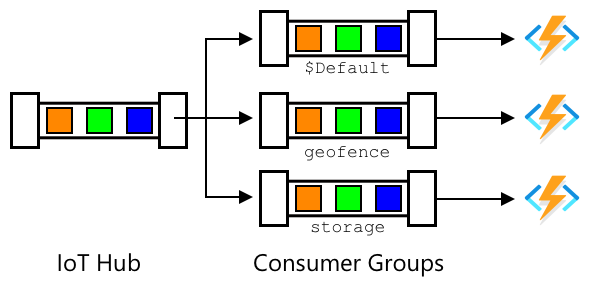

<!--
CO_OP_TRANSLATOR_METADATA:
{
  "original_hash": "078ae664c7b686bf069545e9a5fc95b2",
  "translation_date": "2025-08-27T23:55:43+00:00",
  "source_file": "3-transport/lessons/4-geofences/README.md",
  "language_code": "id"
}
-->
# Geofences


> Sketchnote oleh [Nitya Narasimhan](https://github.com/nitya). Klik gambar untuk versi yang lebih besar.

Video ini memberikan gambaran tentang geofences dan cara menggunakannya di Azure Maps, topik yang akan dibahas dalam pelajaran ini:

[](https://www.youtube.com/watch?v=nsrgYhaYNVY)

> 🎥 Klik gambar di atas untuk menonton video

## Kuis sebelum pelajaran

[Kuis sebelum pelajaran](https://black-meadow-040d15503.1.azurestaticapps.net/quiz/27)

## Pendahuluan

Dalam 3 pelajaran terakhir, Anda telah menggunakan IoT untuk melacak truk yang membawa hasil panen dari pertanian Anda ke pusat pengolahan. Anda telah menangkap data GPS, mengirimkannya ke cloud untuk disimpan, dan memvisualisasikannya di peta. Langkah berikutnya untuk meningkatkan efisiensi rantai pasokan Anda adalah mendapatkan pemberitahuan saat truk hampir tiba di pusat pengolahan, sehingga kru yang diperlukan untuk membongkar dapat siap dengan forklift dan peralatan lainnya segera setelah kendaraan tiba. Dengan cara ini, mereka dapat membongkar dengan cepat, dan Anda tidak perlu membayar truk dan pengemudi untuk menunggu.

Dalam pelajaran ini, Anda akan belajar tentang geofences - wilayah geospasial yang ditentukan seperti area dalam jarak 2 km dari pusat pengolahan, dan cara menguji apakah koordinat GPS berada di dalam atau di luar geofence, sehingga Anda dapat melihat apakah sensor GPS Anda telah tiba atau meninggalkan suatu area.

Dalam pelajaran ini kita akan membahas:

* [Apa itu geofences](../../../../../3-transport/lessons/4-geofences)
* [Mendefinisikan geofence](../../../../../3-transport/lessons/4-geofences)
* [Menguji titik terhadap geofence](../../../../../3-transport/lessons/4-geofences)
* [Menggunakan geofences dari kode serverless](../../../../../3-transport/lessons/4-geofences)

> 🗑 Ini adalah pelajaran terakhir dalam proyek ini, jadi setelah menyelesaikan pelajaran ini dan tugasnya, jangan lupa untuk membersihkan layanan cloud Anda. Anda akan membutuhkan layanan tersebut untuk menyelesaikan tugas, jadi pastikan untuk menyelesaikannya terlebih dahulu.
>
> Lihat [panduan membersihkan proyek Anda](../../../clean-up.md) jika diperlukan untuk instruksi tentang cara melakukannya.

## Apa itu Geofences

Geofence adalah perimeter virtual untuk wilayah geografis dunia nyata. Geofences dapat berupa lingkaran yang didefinisikan sebagai titik dan radius (misalnya lingkaran dengan lebar 100m di sekitar sebuah bangunan), atau poligon yang mencakup area seperti zona sekolah, batas kota, atau kampus universitas atau kantor.


> 💁 Anda mungkin sudah menggunakan geofences tanpa menyadarinya. Jika Anda pernah mengatur pengingat menggunakan aplikasi pengingat iOS atau Google Keep berdasarkan lokasi, Anda telah menggunakan geofence. Aplikasi ini akan mengatur geofence berdasarkan lokasi yang diberikan dan memberi tahu Anda saat ponsel Anda memasuki geofence.

Ada banyak alasan mengapa Anda ingin mengetahui bahwa kendaraan berada di dalam atau di luar geofence:

* Persiapan untuk membongkar - mendapatkan pemberitahuan bahwa kendaraan telah tiba di lokasi memungkinkan kru untuk siap membongkar kendaraan, mengurangi waktu tunggu kendaraan. Hal ini memungkinkan pengemudi untuk melakukan lebih banyak pengiriman dalam sehari dengan waktu tunggu yang lebih sedikit.
* Kepatuhan pajak - beberapa negara, seperti Selandia Baru, mengenakan pajak jalan untuk kendaraan diesel berdasarkan berat kendaraan saat berkendara di jalan umum saja. Menggunakan geofences memungkinkan Anda melacak jarak tempuh yang ditempuh di jalan umum dibandingkan dengan jalan pribadi di lokasi seperti pertanian atau area penebangan.
* Pemantauan pencurian - jika kendaraan seharusnya hanya tetap berada di area tertentu seperti di pertanian, dan meninggalkan geofence, kendaraan tersebut mungkin telah dicuri.
* Kepatuhan lokasi - beberapa bagian dari lokasi kerja, pertanian, atau pabrik mungkin terlarang untuk kendaraan tertentu, seperti menjaga kendaraan yang membawa pupuk buatan dan pestisida menjauh dari ladang yang menanam produk organik. Jika geofence dimasuki, maka kendaraan berada di luar kepatuhan dan pengemudi dapat diberi tahu.

✅ Bisakah Anda memikirkan penggunaan lain untuk geofences?

Azure Maps, layanan yang Anda gunakan dalam pelajaran terakhir untuk memvisualisasikan data GPS, memungkinkan Anda mendefinisikan geofences, lalu menguji untuk melihat apakah suatu titik berada di dalam atau di luar geofence.

## Mendefinisikan geofence

Geofences didefinisikan menggunakan GeoJSON, sama seperti titik-titik yang ditambahkan ke peta dalam pelajaran sebelumnya. Dalam hal ini, alih-alih menjadi `FeatureCollection` dari nilai `Point`, ini adalah `FeatureCollection` yang berisi `Polygon`.

```json
{
   "type": "FeatureCollection",
   "features": [
     {
       "type": "Feature",
       "geometry": {
         "type": "Polygon",
         "coordinates": [
           [
             [
               -122.13393688201903,
               47.63829579223815
             ],
             [
               -122.13389128446579,
               47.63782047131512
             ],
             [
               -122.13240802288054,
               47.63783312249837
             ],
             [
               -122.13238388299942,
               47.63829037035086
             ],
             [
               -122.13393688201903,
               47.63829579223815
             ]
           ]
         ]
       },
       "properties": {
         "geometryId": "1"
       }
     }
   ]
}
```

Setiap titik pada poligon didefinisikan sebagai pasangan bujur dan lintang dalam array, dan titik-titik ini berada dalam array yang diatur sebagai `coordinates`. Dalam `Point` pada pelajaran sebelumnya, `coordinates` adalah array yang berisi 2 nilai, lintang dan bujur, untuk `Polygon` ini adalah array dari array yang berisi 2 nilai, bujur dan lintang.

> 💁 Ingat, GeoJSON menggunakan `longitude, latitude` untuk titik, bukan `latitude, longitude`

Array koordinat poligon selalu memiliki 1 entri lebih banyak daripada jumlah titik pada poligon, dengan entri terakhir sama dengan yang pertama, menutup poligon. Misalnya, untuk sebuah persegi panjang akan ada 5 titik.


Pada gambar di atas, terdapat persegi panjang. Koordinat poligon dimulai di kiri atas pada 47,-122, lalu bergerak ke kanan ke 47,-121, lalu turun ke 46,-121, lalu ke kanan ke 46, -122, lalu kembali ke titik awal di 47, -122. Ini memberikan poligon 5 titik - kiri atas, kanan atas, kanan bawah, kiri bawah, lalu kiri atas untuk menutupnya.

✅ Cobalah membuat poligon GeoJSON di sekitar rumah atau sekolah Anda. Gunakan alat seperti [GeoJSON.io](https://geojson.io/).

### Tugas - mendefinisikan geofence

Untuk menggunakan geofence di Azure Maps, pertama-tama harus diunggah ke akun Azure Maps Anda. Setelah diunggah, Anda akan mendapatkan ID unik yang dapat Anda gunakan untuk menguji titik terhadap geofence. Untuk mengunggah geofences ke Azure Maps, Anda perlu menggunakan API web peta. Anda dapat memanggil API web Azure Maps menggunakan alat yang disebut [curl](https://curl.se).

> 🎓 Curl adalah alat baris perintah untuk membuat permintaan terhadap endpoint web

1. Jika Anda menggunakan Linux, macOS, atau versi terbaru Windows 10, Anda mungkin sudah memiliki curl terinstal. Jalankan perintah berikut dari terminal atau baris perintah Anda untuk memeriksa:

    ```sh
    curl --version
    ```

    Jika Anda tidak melihat informasi versi untuk curl, Anda perlu menginstalnya dari [halaman unduhan curl](https://curl.se/download.html).

    > 💁 Jika Anda berpengalaman dengan Postman, maka Anda dapat menggunakan itu sebagai alternatif jika Anda lebih suka.

1. Buat file GeoJSON yang berisi poligon. Anda akan menguji ini menggunakan sensor GPS Anda, jadi buat poligon di sekitar lokasi Anda saat ini. Anda dapat membuatnya secara manual dengan mengedit contoh GeoJSON yang diberikan di atas, atau menggunakan alat seperti [GeoJSON.io](https://geojson.io/).

    GeoJSON harus berisi `FeatureCollection`, yang berisi `Feature` dengan `geometry` tipe `Polygon`.

    Anda **HARUS** juga menambahkan elemen `properties` pada level yang sama dengan elemen `geometry`, dan ini harus berisi `geometryId`:

    ```json
    "properties": {
        "geometryId": "1"
    }
    ```

    Jika Anda menggunakan [GeoJSON.io](https://geojson.io/), maka Anda harus menambahkan item ini secara manual ke elemen `properties` yang kosong, baik setelah mengunduh file JSON, atau di editor JSON dalam aplikasi.

    `geometryId` ini harus unik dalam file ini. Anda dapat mengunggah beberapa geofences sebagai beberapa `Features` dalam `FeatureCollection` dalam file GeoJSON yang sama, selama masing-masing memiliki `geometryId` yang berbeda. Poligon dapat memiliki `geometryId` yang sama jika diunggah dari file yang berbeda pada waktu yang berbeda.

1. Simpan file ini sebagai `geofence.json`, dan navigasikan ke tempat file ini disimpan di terminal atau konsol Anda.

1. Jalankan perintah curl berikut untuk membuat GeoFence:

    ```sh
    curl --request POST 'https://atlas.microsoft.com/mapData/upload?api-version=1.0&dataFormat=geojson&subscription-key=<subscription_key>' \
         --header 'Content-Type: application/json' \
         --include \
         --data @geofence.json
    ```

    Ganti `<subscription_key>` dalam URL dengan kunci API untuk akun Azure Maps Anda.

    URL digunakan untuk mengunggah data peta melalui API `https://atlas.microsoft.com/mapData/upload`. Panggilan ini mencakup parameter `api-version` untuk menentukan API Azure Maps mana yang akan digunakan, ini untuk memungkinkan API berubah seiring waktu tetapi tetap mempertahankan kompatibilitas mundur. Format data yang diunggah diatur ke `geojson`.

    Ini akan menjalankan permintaan POST ke API unggahan dan mengembalikan daftar header respons yang mencakup header yang disebut `location`.

    ```output
    content-type: application/json
    location: https://us.atlas.microsoft.com/mapData/operations/1560ced6-3a80-46f2-84b2-5b1531820eab?api-version=1.0
    x-ms-azuremaps-region: West US 2
    x-content-type-options: nosniff
    strict-transport-security: max-age=31536000; includeSubDomains
    x-cache: CONFIG_NOCACHE
    date: Sat, 22 May 2021 21:34:57 GMT
    content-length: 0
    ```

    > 🎓 Saat memanggil endpoint web, Anda dapat meneruskan parameter ke panggilan dengan menambahkan `?` diikuti oleh pasangan kunci-nilai sebagai `key=value`, memisahkan pasangan kunci-nilai dengan `&`.

1. Azure Maps tidak memproses ini secara langsung, jadi Anda perlu memeriksa untuk melihat apakah permintaan unggahan telah selesai dengan menggunakan URL yang diberikan di header `location`. Buat permintaan GET ke lokasi ini untuk melihat statusnya. Anda perlu menambahkan kunci langganan Anda ke akhir URL `location` dengan menambahkan `&subscription-key=<subscription_key>` ke akhir, mengganti `<subscription_key>` dengan kunci API untuk akun Azure Maps Anda. Jalankan perintah berikut:

    ```sh
    curl --request GET '<location>&subscription-key=<subscription_key>'
    ```

    Ganti `<location>` dengan nilai dari header `location`, dan `<subscription_key>` dengan kunci API untuk akun Azure Maps Anda.

1. Periksa nilai `status` dalam respons. Jika tidak `Succeeded`, tunggu satu menit dan coba lagi.

1. Setelah status kembali sebagai `Succeeded`, lihat `resourceLocation` dari respons. Ini berisi detail tentang ID unik (dikenal sebagai UDID) untuk objek GeoJSON. UDID adalah nilai setelah `metadata/`, dan tidak termasuk `api-version`. Misalnya, jika `resourceLocation` adalah:

    ```json
    {
      "resourceLocation": "https://us.atlas.microsoft.com/mapData/metadata/7c3776eb-da87-4c52-ae83-caadf980323a?api-version=1.0"
    }
    ```

    Maka UDID akan menjadi `7c3776eb-da87-4c52-ae83-caadf980323a`.

    Simpan salinan UDID ini karena Anda akan membutuhkannya untuk menguji geofence.

## Menguji titik terhadap geofence

Setelah poligon diunggah ke Azure Maps, Anda dapat menguji titik untuk melihat apakah titik tersebut berada di dalam atau di luar geofence. Anda melakukan ini dengan membuat permintaan API web, meneruskan UDID dari geofence, dan lintang serta bujur dari titik yang akan diuji.

Saat Anda membuat permintaan ini, Anda juga dapat meneruskan nilai yang disebut `searchBuffer`. Ini memberi tahu API Maps seberapa akurat untuk mengembalikan hasil. Alasannya adalah GPS tidak sepenuhnya akurat, dan terkadang lokasi dapat meleset beberapa meter atau lebih. Default untuk search buffer adalah 50m, tetapi Anda dapat mengatur nilai dari 0m hingga 500m.

Ketika hasil dikembalikan dari panggilan API, salah satu bagian dari hasil adalah `distance` yang diukur ke titik terdekat di tepi geofence, dengan nilai positif jika titik berada di luar geofence, negatif jika berada di dalam geofence. Jika jarak ini kurang dari search buffer, jarak sebenarnya dikembalikan dalam meter, jika tidak nilainya adalah 999 atau -999. 999 berarti bahwa titik berada di luar geofence lebih dari search buffer, -999 berarti berada di dalam geofence lebih dari search buffer.


Pada gambar di atas, geofence memiliki search buffer 50m.

* Titik di tengah geofence, jauh di dalam search buffer memiliki jarak **-999**
* Titik jauh di luar search buffer memiliki jarak **999**
* Titik di dalam geofence dan di dalam search buffer, 6m dari geofence, memiliki jarak **6m**
* Titik di luar geofence dan di dalam search buffer, 39m dari geofence, memiliki jarak **39m**

Penting untuk mengetahui jarak ke tepi geofence, dan menggabungkan ini dengan informasi lain seperti pembacaan GPS lainnya, kecepatan, dan data jalan saat membuat keputusan berdasarkan lokasi kendaraan.

Misalnya, bayangkan pembacaan GPS menunjukkan kendaraan sedang berkendara di sepanjang jalan yang akhirnya berada di sebelah geofence. Jika satu nilai GPS tidak akurat dan menempatkan kendaraan di dalam geofence, meskipun tidak ada akses kendaraan, maka nilai tersebut dapat diabaikan.


Dalam gambar di atas, terdapat geofence yang mencakup sebagian dari kampus Microsoft. Garis merah menunjukkan sebuah truk yang melaju di sepanjang jalan 520, dengan lingkaran-lingkaran yang menunjukkan pembacaan GPS. Sebagian besar pembacaan ini akurat dan berada di sepanjang jalan 520, namun ada satu pembacaan yang tidak akurat di dalam geofence. Tidak mungkin pembacaan tersebut benar - tidak ada jalan yang memungkinkan truk tiba-tiba berbelok dari jalan 520 ke dalam kampus, lalu kembali lagi ke jalan 520. Kode yang memeriksa geofence ini perlu mempertimbangkan pembacaan sebelumnya sebelum mengambil tindakan berdasarkan hasil pengujian geofence.

✅ Data tambahan apa yang Anda perlukan untuk memeriksa apakah pembacaan GPS dapat dianggap benar?

### Tugas - menguji titik terhadap geofence

1. Mulailah dengan membangun URL untuk kueri API web. Formatnya adalah:

    ```output
    https://atlas.microsoft.com/spatial/geofence/json?api-version=1.0&deviceId=gps-sensor&subscription-key=<subscription-key>&udid=<UDID>&lat=<lat>&lon=<lon>
    ```

    Ganti `<subscription_key>` dengan kunci API untuk akun Azure Maps Anda.

    Ganti `<UDID>` dengan UDID dari geofence yang diperoleh dari tugas sebelumnya.

    Ganti `<lat>` dan `<lon>` dengan lintang dan bujur yang ingin Anda uji.

    URL ini menggunakan API `https://atlas.microsoft.com/spatial/geofence/json` untuk mengkueri geofence yang didefinisikan menggunakan GeoJSON. URL ini menargetkan versi API `1.0`. Parameter `deviceId` diperlukan dan harus berupa nama perangkat dari mana lintang dan bujur berasal.

    Buffer pencarian default adalah 50m, dan Anda dapat mengubah ini dengan menambahkan parameter tambahan `searchBuffer=<distance>`, dengan `<distance>` diatur ke jarak buffer pencarian dalam meter, dari 0 hingga 500.

1. Gunakan curl untuk membuat permintaan GET ke URL ini:

    ```sh
    curl --request GET '<URL>'
    ```

    > 💁 Jika Anda mendapatkan kode respons `BadRequest`, dengan kesalahan:
    >
    > ```output
    > Invalid GeoJSON: All feature properties should contain a geometryId, which is used for identifying the geofence.
    > ```
    >
    > maka GeoJSON Anda kehilangan bagian `properties` dengan `geometryId`. Anda perlu memperbaiki GeoJSON Anda, lalu ulangi langkah-langkah di atas untuk mengunggah ulang dan mendapatkan UDID baru.

1. Respons akan berisi daftar `geometries`, satu untuk setiap poligon yang didefinisikan dalam GeoJSON yang digunakan untuk membuat geofence. Setiap geometri memiliki 3 bidang yang menarik, yaitu `distance`, `nearestLat`, dan `nearestLon`.

    ```output
    {
        "geometries": [
            {
                "deviceId": "gps-sensor",
                "udId": "7c3776eb-da87-4c52-ae83-caadf980323a",
                "geometryId": "1",
                "distance": 999.0,
                "nearestLat": 47.645875,
                "nearestLon": -122.142713
            }
        ],
        "expiredGeofenceGeometryId": [],
        "invalidPeriodGeofenceGeometryId": []
    }
    ```

    * `nearestLat` dan `nearestLon` adalah lintang dan bujur dari titik di tepi geofence yang paling dekat dengan lokasi yang diuji.

    * `distance` adalah jarak dari lokasi yang diuji ke titik terdekat di tepi geofence. Angka negatif berarti di dalam geofence, angka positif berarti di luar. Nilai ini akan kurang dari 50 (buffer pencarian default), atau 999.

1. Ulangi langkah ini beberapa kali dengan lokasi di dalam dan di luar geofence.

## Menggunakan geofence dari kode serverless

Sekarang Anda dapat menambahkan pemicu baru ke aplikasi Functions Anda untuk menguji data GPS dari IoT Hub terhadap geofence.

### Grup konsumen

Seperti yang Anda ingat dari pelajaran sebelumnya, IoT Hub memungkinkan Anda memutar ulang peristiwa yang telah diterima oleh hub tetapi belum diproses. Namun, apa yang akan terjadi jika beberapa pemicu terhubung? Bagaimana cara mengetahui pemicu mana yang telah memproses peristiwa tertentu?

Jawabannya adalah tidak bisa! Sebagai gantinya, Anda dapat mendefinisikan beberapa koneksi terpisah untuk membaca peristiwa, dan masing-masing dapat mengelola pemutaran ulang pesan yang belum dibaca. Ini disebut *grup konsumen*. Saat Anda terhubung ke endpoint, Anda dapat menentukan grup konsumen mana yang ingin Anda hubungkan. Setiap komponen aplikasi Anda akan terhubung ke grup konsumen yang berbeda.



Secara teori, hingga 5 aplikasi dapat terhubung ke setiap grup konsumen, dan semuanya akan menerima pesan saat pesan tiba. Praktik terbaik adalah hanya memiliki satu aplikasi yang mengakses setiap grup konsumen untuk menghindari pemrosesan pesan duplikat, dan memastikan bahwa saat memulai ulang, semua pesan yang antre diproses dengan benar. Sebagai contoh, jika Anda menjalankan aplikasi Functions Anda secara lokal serta menjalankannya di cloud, keduanya akan memproses pesan, yang mengakibatkan blob duplikat disimpan di akun penyimpanan.

Jika Anda meninjau file `function.json` untuk pemicu IoT Hub yang Anda buat di pelajaran sebelumnya, Anda akan melihat grup konsumen di bagian pengikatan pemicu event hub:

```json
"consumerGroup": "$Default"
```

Saat Anda membuat IoT Hub, grup konsumen `$Default` dibuat secara default. Jika Anda ingin menambahkan pemicu tambahan, Anda dapat menambahkannya menggunakan grup konsumen baru.

> 💁 Dalam pelajaran ini, Anda akan menggunakan fungsi yang berbeda untuk menguji geofence dibandingkan dengan fungsi yang digunakan untuk menyimpan data GPS. Hal ini untuk menunjukkan cara menggunakan grup konsumen dan memisahkan kode agar lebih mudah dibaca dan dipahami. Dalam aplikasi produksi, ada banyak cara untuk merancang ini - menggabungkan keduanya dalam satu fungsi, menggunakan pemicu pada akun penyimpanan untuk menjalankan fungsi untuk memeriksa geofence, atau menggunakan beberapa fungsi. Tidak ada 'cara yang benar', semuanya tergantung pada aplikasi Anda secara keseluruhan dan kebutuhan Anda.

### Tugas - membuat grup konsumen baru

1. Jalankan perintah berikut untuk membuat grup konsumen baru bernama `geofence` untuk IoT Hub Anda:

    ```sh
    az iot hub consumer-group create --name geofence \
                                     --hub-name <hub_name>
    ```

    Ganti `<hub_name>` dengan nama yang Anda gunakan untuk IoT Hub Anda.

1. Jika Anda ingin melihat semua grup konsumen untuk IoT Hub, jalankan perintah berikut:

    ```sh
    az iot hub consumer-group list --output table \
                                   --hub-name <hub_name>
    ```

    Ganti `<hub_name>` dengan nama yang Anda gunakan untuk IoT Hub Anda. Ini akan menampilkan semua grup konsumen.

    ```output
    Name      ResourceGroup
    --------  ---------------
    $Default  gps-sensor
    geofence  gps-sensor
    ```

> 💁 Ketika Anda menjalankan pemantau event IoT Hub di pelajaran sebelumnya, itu terhubung ke grup konsumen `$Default`. Inilah sebabnya Anda tidak dapat menjalankan pemantau event dan pemicu event secara bersamaan. Jika Anda ingin menjalankan keduanya, maka Anda dapat menggunakan grup konsumen lain untuk semua aplikasi fungsi Anda, dan menyimpan `$Default` untuk pemantau event.

### Tugas - membuat pemicu IoT Hub baru

1. Tambahkan pemicu event IoT Hub baru ke aplikasi fungsi `gps-trigger` yang Anda buat di pelajaran sebelumnya. Beri nama fungsi ini `geofence-trigger`.

    > ⚠️ Anda dapat merujuk ke [instruksi untuk membuat pemicu event IoT Hub dari proyek 2, pelajaran 5 jika diperlukan](../../../2-farm/lessons/5-migrate-application-to-the-cloud/README.md#create-an-iot-hub-event-trigger).

1. Konfigurasikan string koneksi IoT Hub di file `function.json`. File `local.settings.json` dibagikan di antara semua pemicu dalam Aplikasi Fungsi.

1. Perbarui nilai `consumerGroup` di file `function.json` untuk merujuk ke grup konsumen `geofence` yang baru:

    ```json
    "consumerGroup": "geofence"
    ```

1. Anda perlu menggunakan kunci langganan untuk akun Azure Maps Anda dalam pemicu ini, jadi tambahkan entri baru ke file `local.settings.json` bernama `MAPS_KEY`.

1. Jalankan Aplikasi Fungsi untuk memastikan bahwa aplikasi terhubung dan memproses pesan. Pemicu `iot-hub-trigger` dari pelajaran sebelumnya juga akan berjalan dan mengunggah blob ke penyimpanan.

    > Untuk menghindari pembacaan GPS duplikat di penyimpanan blob, Anda dapat menghentikan Aplikasi Fungsi yang sedang berjalan di cloud. Untuk melakukannya, gunakan perintah berikut:
    >
    > ```sh
    > az functionapp stop --resource-group gps-sensor \
    >                     --name <functions_app_name>
    > ```
    >
    > Ganti `<functions_app_name>` dengan nama yang Anda gunakan untuk Aplikasi Fungsi Anda.
    >
    > Anda dapat memulainya kembali nanti dengan perintah berikut:
    >
    > ```sh
    > az functionapp start --resource-group gps-sensor \
    >                     --name <functions_app_name>
    > ```
    >
    > Ganti `<functions_app_name>` dengan nama yang Anda gunakan untuk Aplikasi Fungsi Anda.

### Tugas - menguji geofence dari pemicu

Sebelumnya dalam pelajaran ini Anda menggunakan curl untuk mengkueri geofence untuk melihat apakah suatu titik berada di dalam atau di luar. Anda dapat membuat permintaan web serupa dari dalam pemicu Anda.

1. Untuk mengkueri geofence, Anda memerlukan UDID-nya. Tambahkan entri baru ke file `local.settings.json` bernama `GEOFENCE_UDID` dengan nilai ini.

1. Buka file `__init__.py` dari pemicu `geofence-trigger` yang baru.

1. Tambahkan impor berikut ke bagian atas file:

    ```python
    import json
    import os
    import requests
    ```

    Paket `requests` memungkinkan Anda membuat panggilan API web. Azure Maps tidak memiliki SDK Python, sehingga Anda perlu membuat panggilan API web untuk menggunakannya dari kode Python.

1. Tambahkan dua baris berikut ke awal metode `main` untuk mendapatkan kunci langganan Maps:

    ```python
    maps_key = os.environ['MAPS_KEY']
    geofence_udid = os.environ['GEOFENCE_UDID']    
    ```

1. Di dalam loop `for event in events`, tambahkan yang berikut untuk mendapatkan lintang dan bujur dari setiap event:

    ```python
    event_body = json.loads(event.get_body().decode('utf-8'))
    lat = event_body['gps']['lat']
    lon = event_body['gps']['lon']
    ```

    Kode ini mengonversi JSON dari badan event menjadi dictionary, lalu mengekstrak `lat` dan `lon` dari bidang `gps`.

1. Saat menggunakan `requests`, daripada membangun URL panjang seperti yang Anda lakukan dengan curl, Anda dapat menggunakan hanya bagian URL dan meneruskan parameter sebagai dictionary. Tambahkan kode berikut untuk mendefinisikan URL yang akan dipanggil dan mengonfigurasi parameter:

    ```python
    url = 'https://atlas.microsoft.com/spatial/geofence/json'

    params = {
        'api-version': 1.0,
        'deviceId': 'gps-sensor',
        'subscription-key': maps_key,
        'udid' : geofence_udid,
        'lat' : lat,
        'lon' : lon
    }
    ```

    Item dalam dictionary `params` akan cocok dengan pasangan kunci-nilai yang Anda gunakan saat memanggil API web melalui curl.

1. Tambahkan baris kode berikut untuk memanggil API web:

    ```python
    response = requests.get(url, params=params)
    response_body = json.loads(response.text)
    ```

    Ini memanggil URL dengan parameter, dan mendapatkan kembali objek respons.

1. Tambahkan kode berikut di bawah ini:

    ```python
    distance = response_body['geometries'][0]['distance']

    if distance == 999:
        logging.info('Point is outside geofence')
    elif distance > 0:
        logging.info(f'Point is just outside geofence by a distance of {distance}m')
    elif distance == -999:
        logging.info(f'Point is inside geofence')
    else:
        logging.info(f'Point is just inside geofence by a distance of {distance}m')
    ```

    Kode ini mengasumsikan 1 geometri, dan mengekstrak jarak dari geometri tunggal tersebut. Kemudian mencatat pesan yang berbeda berdasarkan jarak.

1. Jalankan kode ini. Anda akan melihat di output log apakah koordinat GPS berada di dalam atau di luar geofence, dengan jarak jika titik berada dalam 50m. Cobalah kode ini dengan geofence yang berbeda berdasarkan lokasi sensor GPS Anda, coba pindahkan sensor (misalnya dengan tethering ke WiFi dari ponsel, atau dengan koordinat berbeda pada perangkat IoT virtual) untuk melihat perubahan ini.

1. Ketika Anda siap, terapkan kode ini ke aplikasi Functions Anda di cloud. Jangan lupa untuk menerapkan Pengaturan Aplikasi baru.

    > ⚠️ Anda dapat merujuk ke [instruksi untuk mengunggah Pengaturan Aplikasi dari proyek 2, pelajaran 5 jika diperlukan](../../../2-farm/lessons/5-migrate-application-to-the-cloud/README.md#task---upload-your-application-settings).

    > ⚠️ Anda dapat merujuk ke [instruksi untuk menerapkan aplikasi Functions Anda dari proyek 2, pelajaran 5 jika diperlukan](../../../2-farm/lessons/5-migrate-application-to-the-cloud/README.md#task---deploy-your-functions-app-to-the-cloud).

> 💁 Anda dapat menemukan kode ini di folder [code/functions](../../../../../3-transport/lessons/4-geofences/code/functions).

---

## 🚀 Tantangan

Dalam pelajaran ini Anda menambahkan satu geofence menggunakan file GeoJSON dengan satu poligon. Anda dapat mengunggah beberapa poligon sekaligus, selama mereka memiliki nilai `geometryId` yang berbeda di bagian `properties`.

Cobalah mengunggah file GeoJSON dengan beberapa poligon dan sesuaikan kode Anda untuk menemukan poligon mana yang paling dekat atau di dalam koordinat GPS.

## Kuis Pasca-Pelajaran

[Kuis Pasca-Pelajaran](https://black-meadow-040d15503.1.azurestaticapps.net/quiz/28)

## Tinjauan & Studi Mandiri

* Baca lebih lanjut tentang geofence dan beberapa kasus penggunaannya di [halaman Geofencing di Wikipedia](https://en.wikipedia.org/wiki/Geo-fence).
* Baca lebih lanjut tentang API geofencing Azure Maps di [dokumentasi Microsoft Azure Maps Spatial - Get Geofence](https://docs.microsoft.com/rest/api/maps/spatial/getgeofence?WT.mc_id=academic-17441-jabenn).
* Baca lebih lanjut tentang grup konsumen di [Fitur dan terminologi di Azure Event Hubs - dokumentasi konsumen Event di Microsoft Docs](https://docs.microsoft.com/azure/event-hubs/event-hubs-features?WT.mc_id=academic-17441-jabenn#event-consumers).

## Tugas

[Kirim notifikasi menggunakan Twilio](assignment.md)

---

**Penafian**:  
Dokumen ini telah diterjemahkan menggunakan layanan penerjemahan AI [Co-op Translator](https://github.com/Azure/co-op-translator). Meskipun kami berupaya untuk memberikan hasil yang akurat, harap diingat bahwa terjemahan otomatis mungkin mengandung kesalahan atau ketidakakuratan. Dokumen asli dalam bahasa aslinya harus dianggap sebagai sumber yang otoritatif. Untuk informasi yang bersifat kritis, disarankan menggunakan jasa penerjemahan profesional oleh manusia. Kami tidak bertanggung jawab atas kesalahpahaman atau penafsiran yang keliru yang timbul dari penggunaan terjemahan ini.