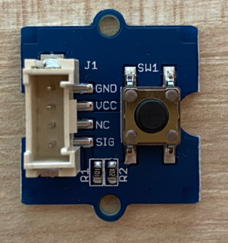

<!--
CO_OP_TRANSLATOR_METADATA:
{
  "original_hash": "0ac0afcfb40cb5970ef4cb74f01c32e9",
  "translation_date": "2025-08-27T23:18:30+00:00",
  "source_file": "6-consumer/lessons/1-speech-recognition/pi-audio.md",
  "language_code": "id"
}
-->
# Menangkap Audio - Raspberry Pi

Dalam bagian pelajaran ini, Anda akan menulis kode untuk menangkap audio pada Raspberry Pi Anda. Penangkapan audio akan dikendalikan oleh sebuah tombol.

## Perangkat Keras

Raspberry Pi memerlukan tombol untuk mengendalikan penangkapan audio.

Tombol yang akan Anda gunakan adalah tombol Grove. Ini adalah sensor digital yang menghidupkan atau mematikan sinyal. Tombol ini dapat dikonfigurasi untuk mengirimkan sinyal tinggi saat tombol ditekan, dan rendah saat tidak ditekan, atau sebaliknya.

Jika Anda menggunakan ReSpeaker 2-Mics Pi HAT sebagai mikrofon, maka tidak perlu menghubungkan tombol karena HAT ini sudah memiliki tombol bawaan. Langsung lanjut ke bagian berikutnya.

### Menghubungkan Tombol

Tombol dapat dihubungkan ke Grove base hat.

#### Tugas - Menghubungkan Tombol



1. Masukkan salah satu ujung kabel Grove ke soket pada modul tombol. Kabel hanya dapat masuk dengan satu arah.

1. Dengan Raspberry Pi dalam keadaan mati, hubungkan ujung lain kabel Grove ke soket digital yang diberi tanda **D5** pada Grove Base hat yang terpasang di Pi. Soket ini adalah soket kedua dari kiri, pada baris soket di sebelah pin GPIO.


## Menangkap Audio

Anda dapat menangkap audio dari mikrofon menggunakan kode Python.

### Tugas - Menangkap Audio

1. Nyalakan Pi dan tunggu hingga selesai booting.

1. Buka VS Code, baik langsung di Pi, atau sambungkan melalui ekstensi Remote SSH.

1. Paket PyAudio Pip memiliki fungsi untuk merekam dan memutar ulang audio. Paket ini bergantung pada beberapa pustaka audio yang perlu diinstal terlebih dahulu. Jalankan perintah berikut di terminal untuk menginstalnya:

    ```sh
    sudo apt update
    sudo apt install libportaudio0 libportaudio2 libportaudiocpp0 portaudio19-dev libasound2-plugins --yes 
    ```

1. Instal paket PyAudio Pip.

    ```sh
    pip3 install pyaudio
    ```

1. Buat folder baru bernama `smart-timer` dan tambahkan file bernama `app.py` ke folder ini.

1. Tambahkan impor berikut ke bagian atas file ini:

    ```python
    import io
    import pyaudio
    import time
    import wave
    
    from grove.factory import Factory
    ```

    Ini mengimpor modul `pyaudio`, beberapa modul Python standar untuk menangani file wave, dan modul `grove.factory` untuk mengimpor `Factory` guna membuat kelas tombol.

1. Di bawah ini, tambahkan kode untuk membuat tombol Grove.

    Jika Anda menggunakan ReSpeaker 2-Mics Pi HAT, gunakan kode berikut:

    ```python
    # The button on the ReSpeaker 2-Mics Pi HAT
    button = Factory.getButton("GPIO-LOW", 17)
    ```

    Ini membuat tombol pada port **D17**, port tempat tombol pada ReSpeaker 2-Mics Pi HAT terhubung. Tombol ini diatur untuk mengirimkan sinyal rendah saat ditekan.

    Jika Anda tidak menggunakan ReSpeaker 2-Mics Pi HAT, dan menggunakan tombol Grove yang terhubung ke base hat, gunakan kode ini.

    ```python
    button = Factory.getButton("GPIO-HIGH", 5)
    ```

    Ini membuat tombol pada port **D5** yang diatur untuk mengirimkan sinyal tinggi saat ditekan.

1. Di bawah ini, buat instance kelas PyAudio untuk menangani audio:

    ```python
    audio = pyaudio.PyAudio()
    ```

1. Deklarasikan nomor kartu perangkat keras untuk mikrofon dan speaker. Ini akan menjadi nomor kartu yang Anda temukan dengan menjalankan `arecord -l` dan `aplay -l` sebelumnya dalam pelajaran ini.

    ```python
    microphone_card_number = <microphone card number>
    speaker_card_number = <speaker card number>
    ```

    Ganti `<microphone card number>` dengan nomor kartu mikrofon Anda.

    Ganti `<speaker card number>` dengan nomor kartu speaker Anda, nomor yang sama yang Anda atur di file `alsa.conf`.

1. Di bawah ini, deklarasikan tingkat sampel yang akan digunakan untuk penangkapan dan pemutaran audio. Anda mungkin perlu mengubah ini tergantung pada perangkat keras yang Anda gunakan.

    ```python
    rate = 48000 #48KHz
    ```

    Jika Anda mendapatkan kesalahan tingkat sampel saat menjalankan kode ini nanti, ubah nilai ini menjadi `44100` atau `16000`. Semakin tinggi nilainya, semakin baik kualitas suara.

1. Di bawah ini, buat fungsi baru bernama `capture_audio`. Fungsi ini akan dipanggil untuk menangkap audio dari mikrofon:

    ```python
    def capture_audio():
    ```

1. Di dalam fungsi ini, tambahkan kode berikut untuk menangkap audio:

    ```python
    stream = audio.open(format = pyaudio.paInt16,
                        rate = rate,
                        channels = 1, 
                        input_device_index = microphone_card_number,
                        input = True,
                        frames_per_buffer = 4096)

    frames = []

    while button.is_pressed():
        frames.append(stream.read(4096))

    stream.stop_stream()
    stream.close()
    ```

    Kode ini membuka aliran input audio menggunakan objek PyAudio. Aliran ini akan menangkap audio dari mikrofon pada 16KHz, menangkapnya dalam buffer berukuran 4096 byte.

    Kode kemudian melakukan loop selama tombol Grove ditekan, membaca buffer 4096 byte ini ke dalam array setiap kali.

    > 💁 Anda dapat membaca lebih lanjut tentang opsi yang diteruskan ke metode `open` di [dokumentasi PyAudio](https://people.csail.mit.edu/hubert/pyaudio/docs/).

    Setelah tombol dilepaskan, aliran dihentikan dan ditutup.

1. Tambahkan kode berikut di akhir fungsi ini:

    ```python
    wav_buffer = io.BytesIO()
    with wave.open(wav_buffer, 'wb') as wavefile:
        wavefile.setnchannels(1)
        wavefile.setsampwidth(audio.get_sample_size(pyaudio.paInt16))
        wavefile.setframerate(rate)
        wavefile.writeframes(b''.join(frames))
        wav_buffer.seek(0)

    return wav_buffer
    ```

    Kode ini membuat buffer biner, dan menulis semua audio yang ditangkap ke dalamnya sebagai [file WAV](https://wikipedia.org/wiki/WAV). Ini adalah cara standar untuk menulis audio tanpa kompresi ke file. Buffer ini kemudian dikembalikan.

1. Tambahkan fungsi `play_audio` berikut untuk memutar ulang buffer audio:

    ```python
    def play_audio(buffer):
        stream = audio.open(format = pyaudio.paInt16,
                            rate = rate,
                            channels = 1,
                            output_device_index = speaker_card_number,
                            output = True)
    
        with wave.open(buffer, 'rb') as wf:
            data = wf.readframes(4096)
    
            while len(data) > 0:
                stream.write(data)
                data = wf.readframes(4096)
    
            stream.close()
    ```

    Fungsi ini membuka aliran audio lain, kali ini untuk output - untuk memutar audio. Fungsi ini menggunakan pengaturan yang sama dengan aliran input. Buffer kemudian dibuka sebagai file wave dan ditulis ke aliran output dalam potongan 4096 byte, memutar audio. Aliran kemudian ditutup.

1. Tambahkan kode berikut di bawah fungsi `capture_audio` untuk melakukan loop hingga tombol ditekan. Setelah tombol ditekan, audio ditangkap, lalu diputar.

    ```python
    while True:
        while not button.is_pressed():
            time.sleep(.1)
        
        buffer = capture_audio()
        play_audio(buffer)
    ```

1. Jalankan kode. Tekan tombol dan berbicaralah ke mikrofon. Lepaskan tombol saat selesai, dan Anda akan mendengar rekaman.

    Anda mungkin mendapatkan beberapa kesalahan ALSA saat instance PyAudio dibuat. Ini disebabkan oleh konfigurasi pada Pi untuk perangkat audio yang tidak Anda miliki. Anda dapat mengabaikan kesalahan ini.

    ```output
    pi@raspberrypi:~/smart-timer $ python3 app.py 
    ALSA lib pcm.c:2565:(snd_pcm_open_noupdate) Unknown PCM cards.pcm.front
    ALSA lib pcm.c:2565:(snd_pcm_open_noupdate) Unknown PCM cards.pcm.rear
    ALSA lib pcm.c:2565:(snd_pcm_open_noupdate) Unknown PCM cards.pcm.center_lfe
    ALSA lib pcm.c:2565:(snd_pcm_open_noupdate) Unknown PCM cards.pcm.side
    ```

    Jika Anda mendapatkan kesalahan berikut:

    ```output
    OSError: [Errno -9997] Invalid sample rate
    ```

    maka ubah `rate` menjadi 44100 atau 16000.

> 💁 Anda dapat menemukan kode ini di folder [code-record/pi](../../../../../6-consumer/lessons/1-speech-recognition/code-record/pi).

😀 Program perekaman audio Anda berhasil!

---

**Penafian**:  
Dokumen ini telah diterjemahkan menggunakan layanan penerjemahan AI [Co-op Translator](https://github.com/Azure/co-op-translator). Meskipun kami berusaha untuk memberikan hasil yang akurat, harap diingat bahwa terjemahan otomatis mungkin mengandung kesalahan atau ketidakakuratan. Dokumen asli dalam bahasa aslinya harus dianggap sebagai sumber yang otoritatif. Untuk informasi yang bersifat kritis, disarankan menggunakan jasa penerjemahan profesional oleh manusia. Kami tidak bertanggung jawab atas kesalahpahaman atau penafsiran yang keliru yang timbul dari penggunaan terjemahan ini.