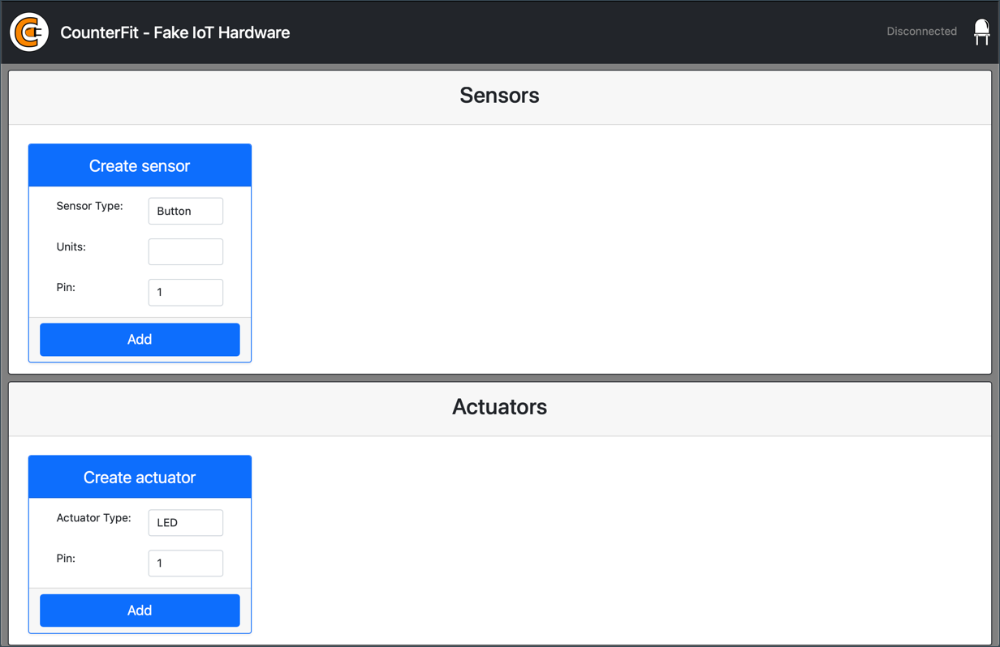

<!--
CO_OP_TRANSLATOR_METADATA:
{
  "original_hash": "52b4de6144b2efdced7797a5339d6035",
  "translation_date": "2025-08-25T17:28:17+00:00",
  "source_file": "1-getting-started/lessons/1-introduction-to-iot/virtual-device.md",
  "language_code": "it"
}
-->
# Computer virtuale a scheda singola

Invece di acquistare un dispositivo IoT, insieme a sensori e attuatori, puoi utilizzare il tuo computer per simulare l'hardware IoT. Il progetto [CounterFit](https://github.com/CounterFit-IoT/CounterFit) ti consente di eseguire un'app localmente che simula hardware IoT come sensori e attuatori, e di accedere ai sensori e agli attuatori tramite codice Python locale scritto nello stesso modo in cui scriveresti il codice su un Raspberry Pi utilizzando hardware fisico.

## Configurazione

Per utilizzare CounterFit, dovrai installare alcuni software gratuiti sul tuo computer.

### Attività

Installa il software richiesto.

1. Installa Python. Consulta la [pagina di download di Python](https://www.python.org/downloads/) per le istruzioni su come installare l'ultima versione di Python.

1. Installa Visual Studio Code (VS Code). Questo è l'editor che utilizzerai per scrivere il codice del dispositivo virtuale in Python. Consulta la [documentazione di VS Code](https://code.visualstudio.com?WT.mc_id=academic-17441-jabenn) per le istruzioni su come installare VS Code.

    > 💁 Sei libero di utilizzare qualsiasi IDE o editor Python per queste lezioni se hai uno strumento preferito, ma le lezioni forniranno istruzioni basate sull'uso di VS Code.

1. Installa l'estensione Pylance per VS Code. Questa è un'estensione per VS Code che fornisce supporto per il linguaggio Python. Consulta la [documentazione dell'estensione Pylance](https://marketplace.visualstudio.com/items?WT.mc_id=academic-17441-jabenn&itemName=ms-python.vscode-pylance) per le istruzioni su come installare questa estensione in VS Code.

Le istruzioni per installare e configurare l'app CounterFit verranno fornite al momento opportuno nelle istruzioni dell'assegnazione, poiché viene installata su base per progetto.

## Hello world

È tradizionale, quando si inizia con un nuovo linguaggio di programmazione o tecnologia, creare un'applicazione 'Hello World' - una piccola applicazione che mostra un testo come `"Hello World"` per verificare che tutti gli strumenti siano configurati correttamente.

L'app Hello World per l'hardware IoT virtuale garantirà che Python e Visual Studio Code siano installati correttamente. Si connetterà anche a CounterFit per i sensori e attuatori IoT virtuali. Non utilizzerà alcun hardware, si limiterà a connettersi per dimostrare che tutto funziona.

Questa app sarà in una cartella chiamata `nightlight`, e verrà riutilizzata con codice diverso nelle parti successive di questa assegnazione per costruire l'applicazione nightlight.

### Configurare un ambiente virtuale Python

Una delle caratteristiche potenti di Python è la possibilità di installare [pacchetti Pip](https://pypi.org) - pacchetti di codice scritti da altre persone e pubblicati su Internet. Puoi installare un pacchetto Pip sul tuo computer con un solo comando e poi utilizzare quel pacchetto nel tuo codice. Utilizzerai Pip per installare un pacchetto per comunicare con CounterFit.

Per impostazione predefinita, quando installi un pacchetto, esso è disponibile ovunque sul tuo computer, e questo può portare a problemi con le versioni dei pacchetti - ad esempio, un'applicazione dipende da una versione di un pacchetto che si rompe quando installi una nuova versione per un'altra applicazione. Per aggirare questo problema, puoi utilizzare un [ambiente virtuale Python](https://docs.python.org/3/library/venv.html), essenzialmente una copia di Python in una cartella dedicata, e quando installi pacchetti Pip, essi vengono installati solo in quella cartella.

> 💁 Se stai utilizzando un Raspberry Pi, non hai configurato un ambiente virtuale su quel dispositivo per gestire i pacchetti Pip, ma stai utilizzando pacchetti globali, poiché i pacchetti Grove sono installati globalmente dallo script di installazione.

#### Attività - configurare un ambiente virtuale Python

Configura un ambiente virtuale Python e installa i pacchetti Pip per CounterFit.

1. Dal tuo terminale o riga di comando, esegui il seguente comando in una posizione a tua scelta per creare e navigare in una nuova directory:

    ```sh
    mkdir nightlight
    cd nightlight
    ```

1. Ora esegui il seguente comando per creare un ambiente virtuale nella cartella `.venv`:

    ```sh
    python3 -m venv .venv
    ```

    > 💁 Devi chiamare esplicitamente `python3` per creare l'ambiente virtuale nel caso tu abbia Python 2 installato oltre a Python 3 (l'ultima versione). Se hai Python 2 installato, chiamando `python` verrà utilizzato Python 2 invece di Python 3.

1. Attiva l'ambiente virtuale:

    * Su Windows:
        * Se stai utilizzando il Prompt dei comandi, o il Prompt dei comandi tramite Windows Terminal, esegui:

            ```cmd
            .venv\Scripts\activate.bat
            ```

        * Se stai utilizzando PowerShell, esegui:

            ```powershell
            .\.venv\Scripts\Activate.ps1
            ```

            > Se ricevi un errore riguardo l'esecuzione di script disabilitata su questo sistema, dovrai abilitare l'esecuzione di script impostando una politica di esecuzione appropriata. Puoi farlo avviando PowerShell come amministratore, quindi eseguendo il seguente comando:

            ```powershell
            Set-ExecutionPolicy -ExecutionPolicy Unrestricted
            ```

            Inserisci `Y` quando ti viene chiesto di confermare. Quindi riavvia PowerShell e riprova.

            Puoi reimpostare questa politica di esecuzione in un secondo momento, se necessario. Puoi leggere di più su questo nella [pagina delle politiche di esecuzione su Microsoft Docs](https://docs.microsoft.com/powershell/module/microsoft.powershell.core/about/about_execution_policies?WT.mc_id=academic-17441-jabenn).

    * Su macOS o Linux, esegui:

        ```cmd
        source ./.venv/bin/activate
        ```

    > 💁 Questi comandi devono essere eseguiti dalla stessa posizione in cui hai eseguito il comando per creare l'ambiente virtuale. Non dovrai mai navigare nella cartella `.venv`, dovresti sempre eseguire il comando di attivazione e qualsiasi comando per installare pacchetti o eseguire codice dalla cartella in cui ti trovavi quando hai creato l'ambiente virtuale.

1. Una volta attivato l'ambiente virtuale, il comando predefinito `python` eseguirà la versione di Python utilizzata per creare l'ambiente virtuale. Esegui il seguente comando per ottenere la versione:

    ```sh
    python --version
    ```

    L'output dovrebbe contenere il seguente:

    ```output
    (.venv) ➜  nightlight python --version
    Python 3.9.1
    ```

    > 💁 La tua versione di Python potrebbe essere diversa - finché è la versione 3.6 o superiore va bene. In caso contrario, elimina questa cartella, installa una versione più recente di Python e riprova.

1. Esegui i seguenti comandi per installare i pacchetti Pip per CounterFit. Questi pacchetti includono l'app principale CounterFit e shims per l'hardware Grove. Questi shims ti consentono di scrivere codice come se stessi programmando utilizzando sensori e attuatori fisici dell'ecosistema Grove ma collegati a dispositivi IoT virtuali.

    ```sh
    pip install CounterFit
    pip install counterfit-connection
    pip install counterfit-shims-grove
    ```

    Questi pacchetti Pip verranno installati solo nell'ambiente virtuale e non saranno disponibili al di fuori di esso.

### Scrivere il codice

Una volta che l'ambiente virtuale Python è pronto, puoi scrivere il codice per l'applicazione 'Hello World'.

#### Attività - scrivere il codice

Crea un'applicazione Python per stampare `"Hello World"` sulla console.

1. Dal tuo terminale o riga di comando, esegui il seguente comando all'interno dell'ambiente virtuale per creare un file Python chiamato `app.py`:

    * Su Windows, esegui:

        ```cmd
        type nul > app.py
        ```

    * Su macOS o Linux, esegui:

        ```cmd
        touch app.py
        ```

1. Apri la cartella corrente in VS Code:

    ```sh
    code .
    ```

    > 💁 Se il tuo terminale restituisce `command not found` su macOS significa che VS Code non è stato aggiunto al tuo PATH. Puoi aggiungere VS Code al tuo PATH seguendo le istruzioni nella [sezione Avvio dalla riga di comando della documentazione di VS Code](https://code.visualstudio.com/docs/setup/mac?WT.mc_id=academic-17441-jabenn#_launching-from-the-command-line) e eseguire il comando successivamente. VS Code viene aggiunto al tuo PATH per impostazione predefinita su Windows e Linux.

1. Quando VS Code si avvia, attiverà l'ambiente virtuale Python. L'ambiente virtuale selezionato apparirà nella barra di stato in basso:

    

1. Se il terminale di VS Code è già in esecuzione quando VS Code si avvia, non avrà l'ambiente virtuale attivato. La cosa più semplice da fare è chiudere il terminale utilizzando il pulsante **Kill the active terminal instance**:

    

    Puoi capire se il terminale ha l'ambiente virtuale attivato poiché il nome dell'ambiente virtuale sarà un prefisso sul prompt del terminale. Ad esempio, potrebbe essere:

    ```sh
    (.venv) ➜  nightlight
    ```

    Se non hai `.venv` come prefisso sul prompt, l'ambiente virtuale non è attivo nel terminale.

1. Avvia un nuovo terminale di VS Code selezionando *Terminal -> New Terminal*, o premendo `` CTRL+` ``. Il nuovo terminale caricherà l'ambiente virtuale e il comando per attivarlo apparirà nel terminale. Il prompt avrà anche il nome dell'ambiente virtuale (`.venv`):

    ```output
    ➜  nightlight source .venv/bin/activate
    (.venv) ➜  nightlight 
    ```

1. Apri il file `app.py` dall'esploratore di VS Code e aggiungi il seguente codice:

    ```python
    print('Hello World!')
    ```

    La funzione `print` stampa sulla console qualsiasi cosa venga passata.

1. Dal terminale di VS Code, esegui il seguente comando per eseguire la tua app Python:

    ```sh
    python app.py
    ```

    L'output sarà il seguente:

    ```output
    (.venv) ➜  nightlight python app.py 
    Hello World!
    ```

😀 Il tuo programma 'Hello World' è stato un successo!

### Collegare l'hardware

Come secondo passo 'Hello World', eseguirai l'app CounterFit e collegherai il tuo codice ad essa. Questo è l'equivalente virtuale di collegare dell'hardware IoT a un kit di sviluppo.

#### Attività - collegare l'hardware

1. Dal terminale di VS Code, avvia l'app CounterFit con il seguente comando:

    ```sh
    counterfit
    ```

    L'app inizierà a funzionare e si aprirà nel tuo browser web:

    

    Sarà contrassegnata come *Disconnected*, con il LED nell'angolo in alto a destra spento.

1. Aggiungi il seguente codice all'inizio di `app.py`:

    ```python
    from counterfit_connection import CounterFitConnection
    CounterFitConnection.init('127.0.0.1', 5000)
    ```

    Questo codice importa la classe `CounterFitConnection` dal modulo `counterfit_connection`, che proviene dal pacchetto pip `counterfit-connection` che hai installato in precedenza. Inizializza quindi una connessione all'app CounterFit in esecuzione su `127.0.0.1`, che è un indirizzo IP che puoi sempre utilizzare per accedere al tuo computer locale (spesso chiamato *localhost*), sulla porta 5000.

    > 💁 Se hai altre app in esecuzione sulla porta 5000, puoi cambiarla aggiornando la porta nel codice e eseguendo CounterFit utilizzando `CounterFit --port <port_number>`, sostituendo `<port_number>` con la porta che desideri utilizzare.

1. Dovrai avviare un nuovo terminale di VS Code selezionando il pulsante **Create a new integrated terminal**. Questo perché l'app CounterFit è in esecuzione nel terminale corrente.

    

1. In questo nuovo terminale, esegui il file `app.py` come prima. Lo stato di CounterFit cambierà in **Connected** e il LED si accenderà.

    

> 💁 Puoi trovare questo codice nella cartella [code/virtual-device](../../../../../1-getting-started/lessons/1-introduction-to-iot/code/virtual-device).

😀 La connessione all'hardware è stata un successo!

**Disclaimer**:  
Questo documento è stato tradotto utilizzando il servizio di traduzione automatica [Co-op Translator](https://github.com/Azure/co-op-translator). Sebbene ci impegniamo per garantire l'accuratezza, si prega di notare che le traduzioni automatiche possono contenere errori o imprecisioni. Il documento originale nella sua lingua nativa dovrebbe essere considerato la fonte autorevole. Per informazioni critiche, si raccomanda una traduzione professionale effettuata da un traduttore umano. Non siamo responsabili per eventuali incomprensioni o interpretazioni errate derivanti dall'uso di questa traduzione.