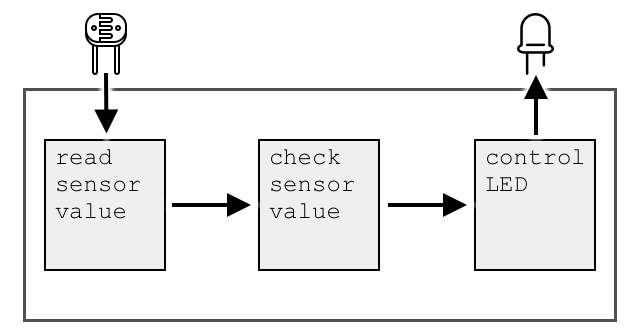
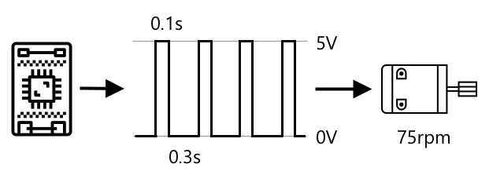

<!--
CO_OP_TRANSLATOR_METADATA:
{
  "original_hash": "e9ee00eb5fc55922a73762acc542166b",
  "translation_date": "2025-08-25T17:21:07+00:00",
  "source_file": "1-getting-started/lessons/3-sensors-and-actuators/README.md",
  "language_code": "it"
}
-->
# Interagire con il mondo fisico con sensori e attuatori


> Illustrazione di [Nitya Narasimhan](https://github.com/nitya). Clicca sull'immagine per una versione più grande.

Questa lezione è stata insegnata come parte della serie [Hello IoT](https://youtube.com/playlist?list=PLmsFUfdnGr3xRts0TIwyaHyQuHaNQcb6-) del [Microsoft Reactor](https://developer.microsoft.com/reactor/?WT.mc_id=academic-17441-jabenn). La lezione è stata suddivisa in 2 video: una lezione di 1 ora e un'ora di approfondimento con domande e risposte.

[](https://youtu.be/Lqalu1v6aF4)

[](https://youtu.be/qR3ekcMlLWA)

> 🎥 Clicca sulle immagini sopra per guardare i video

## Quiz preliminare

[Quiz preliminare](https://black-meadow-040d15503.1.azurestaticapps.net/quiz/5)

## Introduzione

Questa lezione introduce due concetti fondamentali per il tuo dispositivo IoT: sensori e attuatori. Avrai anche l'opportunità di sperimentarli direttamente, aggiungendo un sensore di luce al tuo progetto IoT e poi un LED controllato dai livelli di luce, creando di fatto una luce notturna.

In questa lezione tratteremo:

* [Cosa sono i sensori?](../../../../../1-getting-started/lessons/3-sensors-and-actuators)
* [Utilizzare un sensore](../../../../../1-getting-started/lessons/3-sensors-and-actuators)
* [Tipi di sensori](../../../../../1-getting-started/lessons/3-sensors-and-actuators)
* [Cosa sono gli attuatori?](../../../../../1-getting-started/lessons/3-sensors-and-actuators)
* [Utilizzare un attuatore](../../../../../1-getting-started/lessons/3-sensors-and-actuators)
* [Tipi di attuatori](../../../../../1-getting-started/lessons/3-sensors-and-actuators)

## Cosa sono i sensori?

I sensori sono dispositivi hardware che percepiscono il mondo fisico, ovvero misurano una o più proprietà circostanti e inviano le informazioni a un dispositivo IoT. Esistono molti tipi di sensori, poiché ci sono molte cose che possono essere misurate, da proprietà naturali come la temperatura dell'aria a interazioni fisiche come il movimento.

Alcuni sensori comuni includono:

* Sensori di temperatura - misurano la temperatura dell'aria o di ciò in cui sono immersi. Per hobbisti e sviluppatori, spesso sono combinati con sensori di pressione atmosferica e umidità in un unico dispositivo.
* Pulsanti - rilevano quando vengono premuti.
* Sensori di luce - rilevano i livelli di luce e possono essere specifici per determinati colori, luce UV, luce IR o luce visibile generale.
* Fotocamere - catturano una rappresentazione visiva del mondo scattando una foto o trasmettendo un video.
* Accelerometri - rilevano il movimento in più direzioni.
* Microfoni - rilevano il suono, sia i livelli generali che il suono direzionale.

✅ Fai una ricerca. Quali sensori ha il tuo telefono?

Tutti i sensori hanno una cosa in comune: convertono ciò che percepiscono in un segnale elettrico che può essere interpretato da un dispositivo IoT. Come questo segnale elettrico viene interpretato dipende dal sensore e dal protocollo di comunicazione utilizzato per comunicare con il dispositivo IoT.

## Utilizzare un sensore

Segui la guida pertinente qui sotto per aggiungere un sensore al tuo dispositivo IoT:

* [Arduino - Wio Terminal](wio-terminal-sensor.md)
* [Computer a scheda singola - Raspberry Pi](pi-sensor.md)
* [Computer a scheda singola - Dispositivo virtuale](virtual-device-sensor.md)

## Tipi di sensori

I sensori possono essere analogici o digitali.

### Sensori analogici

Alcuni dei sensori più semplici sono analogici. Questi sensori ricevono una tensione dal dispositivo IoT, i componenti del sensore regolano questa tensione e la tensione restituita dal sensore viene misurata per ottenere il valore del sensore.

> 🎓 La tensione è una misura di quanto "spinta" c'è per spostare l'elettricità da un punto all'altro, ad esempio dal terminale positivo di una batteria a quello negativo. Ad esempio, una batteria AA standard è di 1,5V (V è il simbolo per volt) e può spingere l'elettricità con una forza di 1,5V dal suo terminale positivo a quello negativo. Diversi componenti elettrici richiedono tensioni diverse per funzionare, ad esempio, un LED può accendersi con una tensione tra 2-3V, ma una lampadina a filamento da 100W richiederebbe 240V. Puoi leggere di più sulla tensione nella [pagina di Wikipedia sulla tensione](https://wikipedia.org/wiki/Voltage).

Un esempio è un potenziometro. Questo è una manopola che puoi ruotare tra due posizioni e il sensore misura la rotazione.


Il dispositivo IoT invierà un segnale elettrico al potenziometro a una certa tensione, ad esempio 5 volt (5V). Man mano che il potenziometro viene regolato, cambia la tensione che esce dall'altro lato. Immagina di avere un potenziometro etichettato come una manopola che va da 0 a [11](https://wikipedia.org/wiki/Up_to_eleven), come una manopola del volume su un amplificatore. Quando il potenziometro è nella posizione completamente spenta (0), usciranno 0V (0 volt). Quando è nella posizione completamente accesa (11), usciranno 5V (5 volt).

> 🎓 Questa è una semplificazione, e puoi leggere di più sui potenziometri e sui resistori variabili nella [pagina di Wikipedia sul potenziometro](https://wikipedia.org/wiki/Potentiometer).

La tensione che esce dal sensore viene quindi letta dal dispositivo IoT, che può rispondere di conseguenza. A seconda del sensore, questa tensione può essere un valore arbitrario o può essere mappata a un'unità standard. Ad esempio, un sensore di temperatura analogico basato su un [termistore](https://wikipedia.org/wiki/Thermistor) cambia la sua resistenza in base alla temperatura. La tensione in uscita può quindi essere convertita in una temperatura in Kelvin, e corrispondentemente in °C o °F, tramite calcoli nel codice.

✅ Cosa pensi che accada se il sensore restituisce una tensione più alta di quella inviata (ad esempio proveniente da un'alimentazione esterna)? ⛔️ NON testarlo.

#### Conversione da analogico a digitale

I dispositivi IoT sono digitali: non possono lavorare con valori analogici, ma solo con 0 e 1. Questo significa che i valori dei sensori analogici devono essere convertiti in un segnale digitale prima di poter essere elaborati. Molti dispositivi IoT hanno convertitori analogico-digitali (ADC) per convertire gli input analogici in rappresentazioni digitali del loro valore. I sensori possono anche funzionare con ADC tramite una scheda di connessione. Ad esempio, nell'ecosistema Seeed Grove con un Raspberry Pi, i sensori analogici si collegano a porte specifiche su un "hat" che si collega ai pin GPIO del Pi, e questo hat ha un ADC per convertire la tensione in un segnale digitale che può essere inviato dai pin GPIO del Pi.

Immagina di avere un sensore di luce analogico collegato a un dispositivo IoT che utilizza 3,3V e restituisce un valore di 1V. Questo 1V non significa nulla nel mondo digitale, quindi deve essere convertito. La tensione verrà convertita in un valore analogico utilizzando una scala a seconda del dispositivo e del sensore. Un esempio è il sensore di luce Seeed Grove che restituisce valori da 0 a 1.023. Per questo sensore che funziona a 3,3V, un'uscita di 1V corrisponderebbe a un valore di 300. Un dispositivo IoT non può gestire 300 come valore analogico, quindi il valore verrebbe convertito in `0000000100101100`, la rappresentazione binaria di 300 dall'hat Grove. Questo verrebbe poi elaborato dal dispositivo IoT.

✅ Se non conosci il sistema binario, fai una piccola ricerca per imparare come i numeri sono rappresentati con 0 e 1. La [lezione introduttiva al sistema binario di BBC Bitesize](https://www.bbc.co.uk/bitesize/guides/zwsbwmn/revision/1) è un ottimo punto di partenza.

Dal punto di vista della programmazione, tutto questo è solitamente gestito da librerie che vengono fornite con i sensori, quindi non devi preoccuparti di questa conversione. Per il sensore di luce Grove, utilizzeresti la libreria Python e chiameresti la proprietà `light`, oppure utilizzeresti la libreria Arduino e chiameresti `analogRead` per ottenere un valore di 300.

### Sensori digitali

I sensori digitali, come quelli analogici, rilevano il mondo circostante utilizzando variazioni di tensione elettrica. La differenza è che restituiscono un segnale digitale, misurando solo due stati o utilizzando un ADC integrato. I sensori digitali stanno diventando sempre più comuni per evitare la necessità di utilizzare un ADC su una scheda di connessione o sul dispositivo IoT stesso.

Il sensore digitale più semplice è un pulsante o un interruttore. Questo è un sensore con due stati: acceso o spento.


I pin sui dispositivi IoT, come i pin GPIO, possono misurare direttamente questo segnale come 0 o 1. Se la tensione inviata è uguale a quella restituita, il valore letto è 1, altrimenti il valore letto è 0. Non c'è bisogno di convertire il segnale, può essere solo 1 o 0.

> 💁 Le tensioni non sono mai esatte, specialmente perché i componenti di un sensore avranno una certa resistenza, quindi di solito c'è una tolleranza. Ad esempio, i pin GPIO di un Raspberry Pi funzionano a 3,3V e leggono un segnale di ritorno sopra 1,8V come 1, sotto 1,8V come 0.

* 3,3V entrano nel pulsante. Il pulsante è spento, quindi escono 0V, dando un valore di 0.
* 3,3V entrano nel pulsante. Il pulsante è acceso, quindi escono 3,3V, dando un valore di 1.

Sensori digitali più avanzati leggono valori analogici, poi li convertono utilizzando ADC integrati in segnali digitali. Ad esempio, un sensore di temperatura digitale utilizzerà comunque un termocoppia nello stesso modo di un sensore analogico e misurerà comunque la variazione di tensione causata dalla resistenza del termocoppia alla temperatura corrente. Invece di restituire un valore analogico e fare affidamento sul dispositivo o sulla scheda di connessione per convertirlo in un segnale digitale, un ADC integrato nel sensore convertirà il valore e lo invierà come una serie di 0 e 1 al dispositivo IoT. Questi 0 e 1 vengono inviati nello stesso modo del segnale digitale per un pulsante, con 1 che rappresenta la tensione piena e 0 che rappresenta 0V.


L'invio di dati digitali consente ai sensori di diventare più complessi e di inviare dati più dettagliati, persino dati crittografati per sensori sicuri. Un esempio è una fotocamera. Questo è un sensore che cattura un'immagine e la invia come dati digitali contenenti quell'immagine, solitamente in un formato compresso come JPEG, per essere letta dal dispositivo IoT. Può persino trasmettere video catturando immagini e inviando o l'immagine completa fotogramma per fotogramma o un flusso video compresso.

## Cosa sono gli attuatori?

Gli attuatori sono l'opposto dei sensori: convertono un segnale elettrico dal tuo dispositivo IoT in un'interazione con il mondo fisico, come emettere luce o suono, o muovere un motore.

Alcuni attuatori comuni includono:

* LED - emettono luce quando accesi.
* Altoparlanti - emettono suoni in base al segnale inviato, da un semplice cicalino a un altoparlante audio che può riprodurre musica.
* Motori passo-passo - convertono un segnale in una quantità definita di rotazione, ad esempio ruotando una manopola di 90°.
* Relè - sono interruttori che possono essere accesi o spenti da un segnale elettrico. Consentono a una piccola tensione di un dispositivo IoT di accendere tensioni più elevate.
* Schermi - sono attuatori più complessi e mostrano informazioni su un display multi-segmento. Gli schermi variano da semplici display LED a monitor video ad alta risoluzione.

✅ Fai una ricerca. Quali attuatori ha il tuo telefono?

## Utilizzare un attuatore

Segui la guida pertinente qui sotto per aggiungere un attuatore al tuo dispositivo IoT, controllato dal sensore, per costruire una luce notturna IoT. Raccoglierà i livelli di luce dal sensore di luce e utilizzerà un attuatore sotto forma di LED per emettere luce quando il livello di luce rilevato è troppo basso.



* [Arduino - Wio Terminal](wio-terminal-actuator.md)
* [Computer a scheda singola - Raspberry Pi](pi-actuator.md)
* [Computer a scheda singola - Dispositivo virtuale](virtual-device-actuator.md)

## Tipi di attuatori

Come i sensori, gli attuatori possono essere analogici o digitali.

### Attuatori analogici

Gli attuatori analogici prendono un segnale analogico e lo convertono in un'interazione, dove l'interazione cambia in base alla tensione fornita.

Un esempio è una luce dimmerabile, come quelle che potresti avere in casa. La quantità di tensione fornita alla luce determina quanto è luminosa.


Come per i sensori, il dispositivo IoT effettivo funziona con segnali digitali, non analogici. Ciò significa che per inviare un segnale analogico, il dispositivo IoT necessita di un convertitore digitale-analogico (DAC), integrato direttamente nel dispositivo IoT o su una scheda di connessione. Questo converte gli 0 e 1 del dispositivo IoT in una tensione analogica che l'attuatore può utilizzare.

✅ Cosa pensi che accada se il dispositivo IoT invia una tensione più alta di quella che l'attuatore può gestire?  
⛔️ NON testare questa ipotesi.

#### Modulazione a larghezza di impulso

Un'altra opzione per convertire i segnali digitali di un dispositivo IoT in un segnale analogico è la modulazione a larghezza di impulso (PWM). Questo metodo prevede l'invio di molti impulsi digitali brevi che simulano un segnale analogico.

Ad esempio, puoi utilizzare il PWM per controllare la velocità di un motore.

Immagina di controllare un motore con un'alimentazione di 5V. Invi un breve impulso al motore, portando la tensione a 5V per due centesimi di secondo (0,02s). In quel tempo, il motore può ruotare di un decimo di giro, ovvero 36°. Il segnale poi si interrompe per due centesimi di secondo (0,02s), inviando un segnale basso (0V). Ogni ciclo di accensione e spegnimento dura 0,04s. Il ciclo si ripete.


Ciò significa che in un secondo ci sono 25 impulsi di 5V della durata di 0,02s che fanno ruotare il motore, ciascuno seguito da una pausa di 0,02s a 0V in cui il motore non ruota. Ogni impulso fa ruotare il motore di un decimo di giro, il che significa che il motore completa 2,5 giri al secondo. Hai utilizzato un segnale digitale per far ruotare il motore a 2,5 giri al secondo, ovvero 150 [giri al minuto](https://wikipedia.org/wiki/Revolutions_per_minute) (una misura non standard di velocità di rotazione).

```output
25 pulses per second x 0.1 rotations per pulse = 2.5 rotations per second
2.5 rotations per second x 60 seconds in a minute = 150rpm
```

> 🎓 Quando un segnale PWM è attivo per metà del tempo e inattivo per l'altra metà, si parla di [ciclo di lavoro al 50%](https://wikipedia.org/wiki/Duty_cycle). I cicli di lavoro sono misurati come la percentuale di tempo in cui il segnale è nello stato attivo rispetto allo stato inattivo.



Puoi modificare la velocità del motore cambiando la durata degli impulsi. Ad esempio, con lo stesso motore puoi mantenere lo stesso tempo di ciclo di 0,04s, dimezzando l'impulso attivo a 0,01s e aumentando l'impulso inattivo a 0,03s. Hai lo stesso numero di impulsi al secondo (25), ma ogni impulso attivo è lungo la metà. Un impulso di lunghezza dimezzata fa ruotare il motore di un ventesimo di giro, e con 25 impulsi al secondo il motore completerà 1,25 giri al secondo o 75rpm. Modificando la velocità degli impulsi di un segnale digitale, hai dimezzato la velocità di un motore analogico.

```output
25 pulses per second x 0.05 rotations per pulse = 1.25 rotations per second
1.25 rotations per second x 60 seconds in a minute = 75rpm
```

✅ Come manterresti la rotazione del motore fluida, soprattutto a basse velocità? Utilizzeresti un numero ridotto di impulsi lunghi con pause lunghe o molti impulsi molto brevi con pause molto brevi?

> 💁 Alcuni sensori utilizzano anche il PWM per convertire segnali analogici in segnali digitali.

> 🎓 Puoi leggere di più sulla modulazione a larghezza di impulso nella [pagina Wikipedia sulla modulazione a larghezza di impulso](https://wikipedia.org/wiki/Pulse-width_modulation).

### Attuatori digitali

Gli attuatori digitali, come i sensori digitali, hanno due stati controllati da una tensione alta o bassa oppure hanno un DAC integrato che consente di convertire un segnale digitale in uno analogico.

Un semplice attuatore digitale è un LED. Quando un dispositivo invia un segnale digitale di 1, viene inviata una tensione alta che accende il LED. Quando viene inviato un segnale digitale di 0, la tensione scende a 0V e il LED si spegne.


✅ Quali altri semplici attuatori a 2 stati ti vengono in mente? Un esempio è un solenoide, che è un elettromagnete che può essere attivato per fare cose come spostare un chiavistello di una porta per bloccarla/sbloccarla.

Gli attuatori digitali più avanzati, come gli schermi, richiedono che i dati digitali vengano inviati in formati specifici. Di solito sono accompagnati da librerie che semplificano l'invio dei dati corretti per controllarli.

---

## 🚀 Sfida

La sfida delle ultime due lezioni era elencare quanti più dispositivi IoT possibile presenti nella tua casa, scuola o luogo di lavoro e decidere se sono basati su microcontrollori o computer a scheda singola, o anche una combinazione di entrambi.

Per ogni dispositivo elencato, quali sensori e attuatori sono collegati? Qual è lo scopo di ciascun sensore e attuatore collegato a questi dispositivi?

## Quiz post-lezione

[Quiz post-lezione](https://black-meadow-040d15503.1.azurestaticapps.net/quiz/6)

## Revisione e studio autonomo

* Leggi sull'elettricità e i circuiti su [ThingLearn](http://thinglearn.jenlooper.com/curriculum/).  
* Leggi sui diversi tipi di sensori di temperatura nella [guida ai sensori di temperatura di Seeed Studios](https://www.seeedstudio.com/blog/2019/10/14/temperature-sensors-for-arduino-projects/)  
* Leggi sui LED nella [pagina Wikipedia sui LED](https://wikipedia.org/wiki/Light-emitting_diode)  

## Compito

[Ricerca su sensori e attuatori](assignment.md)  

**Disclaimer**:  
Questo documento è stato tradotto utilizzando il servizio di traduzione automatica [Co-op Translator](https://github.com/Azure/co-op-translator). Sebbene ci impegniamo per garantire l'accuratezza, si prega di notare che le traduzioni automatiche possono contenere errori o imprecisioni. Il documento originale nella sua lingua nativa dovrebbe essere considerato la fonte autorevole. Per informazioni critiche, si raccomanda una traduzione professionale effettuata da un traduttore umano. Non siamo responsabili per eventuali incomprensioni o interpretazioni errate derivanti dall'uso di questa traduzione.