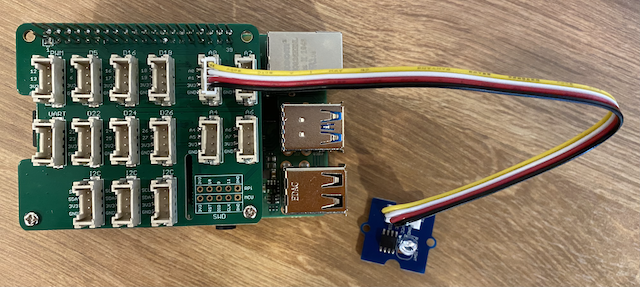

<!--
CO_OP_TRANSLATOR_METADATA:
{
  "original_hash": "ea733bd0cdf2479e082373f765a08678",
  "translation_date": "2025-08-25T17:19:46+00:00",
  "source_file": "1-getting-started/lessons/3-sensors-and-actuators/pi-sensor.md",
  "language_code": "it"
}
-->
# Costruisci una luce notturna - Raspberry Pi

In questa parte della lezione, aggiungerai un sensore di luce al tuo Raspberry Pi.

## Hardware

Il sensore per questa lezione è un **sensore di luce** che utilizza un [fotodiodo](https://wikipedia.org/wiki/Photodiode) per convertire la luce in un segnale elettrico. Si tratta di un sensore analogico che invia un valore intero da 0 a 1.000, indicando una quantità relativa di luce che non corrisponde a nessuna unità di misura standard come il [lux](https://wikipedia.org/wiki/Lux).

Il sensore di luce è un sensore Grove esterno e deve essere collegato al Grove Base hat sul Raspberry Pi.

### Collega il sensore di luce

Il sensore di luce Grove utilizzato per rilevare i livelli di luce deve essere collegato al Raspberry Pi.

#### Attività - collega il sensore di luce

Collega il sensore di luce.


1. Inserisci un'estremità di un cavo Grove nella presa del modulo sensore di luce. Entrerà solo in un verso.

1. Con il Raspberry Pi spento, collega l'altra estremità del cavo Grove alla presa analogica contrassegnata come **A0** sul Grove Base hat collegato al Pi. Questa presa è la seconda da destra, nella fila di prese accanto ai pin GPIO.



## Programma il sensore di luce

Ora il dispositivo può essere programmato utilizzando il sensore di luce Grove.

### Attività - programma il sensore di luce

Programma il dispositivo.

1. Accendi il Raspberry Pi e attendi che si avvii.

1. Apri il progetto della luce notturna in VS Code che hai creato nella parte precedente di questo compito, eseguendolo direttamente sul Pi o collegandoti tramite l'estensione Remote SSH.

1. Apri il file `app.py` e rimuovi tutto il codice presente.

1. Aggiungi il seguente codice al file `app.py` per importare alcune librerie necessarie:

    ```python
    import time
    from grove.grove_light_sensor_v1_2 import GroveLightSensor
    ```

    L'istruzione `import time` importa il modulo `time`, che verrà utilizzato più avanti in questo compito.

    L'istruzione `from grove.grove_light_sensor_v1_2 import GroveLightSensor` importa il `GroveLightSensor` dalle librerie Python di Grove. Questa libreria contiene il codice per interagire con un sensore di luce Grove ed è stata installata globalmente durante la configurazione del Pi.

1. Aggiungi il seguente codice dopo il codice sopra per creare un'istanza della classe che gestisce il sensore di luce:

    ```python
    light_sensor = GroveLightSensor(0)
    ```

    La riga `light_sensor = GroveLightSensor(0)` crea un'istanza della classe `GroveLightSensor` collegandosi al pin **A0** - il pin analogico Grove a cui è collegato il sensore di luce.

1. Aggiungi un ciclo infinito dopo il codice sopra per interrogare il valore del sensore di luce e stamparlo sulla console:

    ```python
    while True:
        light = light_sensor.light
        print('Light level:', light)
    ```

    Questo leggerà il livello di luce corrente su una scala da 0 a 1.023 utilizzando la proprietà `light` della classe `GroveLightSensor`. Questa proprietà legge il valore analogico dal pin. Questo valore viene poi stampato sulla console.

1. Aggiungi una breve pausa di un secondo alla fine del `loop`, poiché i livelli di luce non devono essere controllati continuamente. Una pausa riduce il consumo energetico del dispositivo.

    ```python
    time.sleep(1)
    ```

1. Dal Terminale di VS Code, esegui il seguente comando per avviare la tua app Python:

    ```sh
    python3 app.py
    ```

    I valori della luce verranno visualizzati sulla console. Copri e scopri il sensore di luce, e i valori cambieranno:

    ```output
    pi@raspberrypi:~/nightlight $ python3 app.py 
    Light level: 634
    Light level: 634
    Light level: 634
    Light level: 230
    Light level: 104
    Light level: 290
    ```

> 💁 Puoi trovare questo codice nella cartella [code-sensor/pi](../../../../../1-getting-started/lessons/3-sensors-and-actuators/code-sensor/pi).

😀 Aggiungere un sensore al tuo programma per la luce notturna è stato un successo!

**Disclaimer**:  
Questo documento è stato tradotto utilizzando il servizio di traduzione automatica [Co-op Translator](https://github.com/Azure/co-op-translator). Sebbene ci impegniamo per garantire l'accuratezza, si prega di notare che le traduzioni automatiche possono contenere errori o imprecisioni. Il documento originale nella sua lingua nativa dovrebbe essere considerato la fonte autorevole. Per informazioni critiche, si raccomanda una traduzione professionale effettuata da un traduttore umano. Non siamo responsabili per eventuali incomprensioni o interpretazioni errate derivanti dall'uso di questa traduzione.