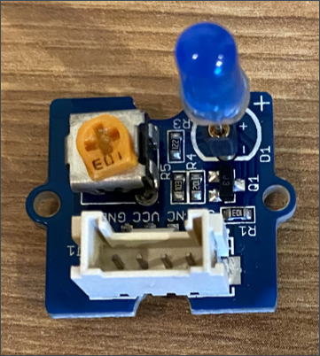

<!--
CO_OP_TRANSLATOR_METADATA:
{
  "original_hash": "db44083b4dc6fb06eac83c4f16448940",
  "translation_date": "2025-08-25T17:23:24+00:00",
  "source_file": "1-getting-started/lessons/3-sensors-and-actuators/wio-terminal-actuator.md",
  "language_code": "it"
}
-->
# Costruire una luce notturna - Wio Terminal

In questa parte della lezione, aggiungerai un LED al tuo Wio Terminal e lo utilizzerai per creare una luce notturna.

## Hardware

La luce notturna ora necessita di un attuatore.

L'attuatore è un **LED**, un [diodo a emissione luminosa](https://wikipedia.org/wiki/Light-emitting_diode) che emette luce quando la corrente lo attraversa. Questo è un attuatore digitale che ha 2 stati, acceso e spento. Inviare un valore di 1 accende il LED, mentre inviare un valore di 0 lo spegne. Questo è un attuatore esterno Grove e deve essere collegato al Wio Terminal.

La logica della luce notturna in pseudo-codice è:

```output
Check the light level.
If the light is less than 300
    Turn the LED on
Otherwise
    Turn the LED off
```

### Collegare il LED

Il Grove LED è fornito come modulo con una selezione di LED, permettendoti di scegliere il colore.

#### Attività - collegare il LED

Collega il LED.



1. Scegli il tuo LED preferito e inserisci i piedini nei due fori del modulo LED.

    I LED sono diodi a emissione luminosa, e i diodi sono dispositivi elettronici che possono trasportare corrente solo in una direzione. Questo significa che il LED deve essere collegato nel verso corretto, altrimenti non funzionerà.

    Uno dei piedini del LED è il pin positivo, l'altro è il pin negativo. Il LED non è perfettamente rotondo ed è leggermente più piatto su un lato. Il lato leggermente più piatto è il pin negativo. Quando colleghi il LED al modulo, assicurati che il pin dal lato arrotondato sia collegato alla presa contrassegnata con **+** all'esterno del modulo, e il lato più piatto sia collegato alla presa più vicina al centro del modulo.

1. Il modulo LED ha un pulsante rotante che ti permette di controllare la luminosità. Ruotalo completamente verso l'alto all'inizio, girandolo in senso antiorario il più possibile con un piccolo cacciavite a croce.

1. Inserisci un'estremità di un cavo Grove nella presa del modulo LED. Entrerà solo in un verso.

1. Con il Wio Terminal scollegato dal computer o da un'altra fonte di alimentazione, collega l'altra estremità del cavo Grove alla presa Grove sul lato destro del Wio Terminal, guardando lo schermo. Questa è la presa più lontana dal pulsante di accensione.

    > 💁 La presa Grove sul lato destro può essere utilizzata con sensori e attuatori analogici o digitali. La presa sul lato sinistro è per sensori e attuatori digitali soltanto. C sarà trattato in una lezione successiva.


## Programmare la luce notturna

Ora è possibile programmare la luce notturna utilizzando il sensore di luce integrato e il LED Grove.

### Attività - programmare la luce notturna

Programma la luce notturna.

1. Apri il progetto della luce notturna in VS Code che hai creato nella parte precedente di questo compito.

1. Aggiungi la seguente riga alla fine della funzione `setup`:

    ```cpp
    pinMode(D0, OUTPUT);
    ```

    Questa riga configura il pin utilizzato per comunicare con il LED tramite la porta Grove.

    Il pin `D0` è il pin digitale per la presa Grove sul lato destro. Questo pin è impostato su `OUTPUT`, il che significa che si collega a un attuatore e i dati verranno scritti sul pin.

1. Aggiungi il seguente codice immediatamente prima del `delay` nella funzione loop:

    ```cpp
    if (light < 300)
    {
        digitalWrite(D0, HIGH);
    }
    else
    {
        digitalWrite(D0, LOW);
    }
    ```

    Questo codice controlla il valore `light`. Se è inferiore a 300, invia un valore `HIGH` al pin digitale `D0`. Questo `HIGH` è un valore di 1, che accende il LED. Se il valore della luce è maggiore o uguale a 300, viene inviato un valore `LOW` di 0 al pin, spegnendo il LED.

    > 💁 Quando si inviano valori digitali agli attuatori, un valore LOW è 0v, mentre un valore HIGH è la tensione massima per il dispositivo. Per il Wio Terminal, la tensione HIGH è 3.3V.

1. Ricollega il Wio Terminal al tuo computer e carica il nuovo codice come hai fatto in precedenza.

1. Collega il Serial Monitor. I valori della luce verranno visualizzati nel terminale.

    ```output
    > Executing task: platformio device monitor <

    --- Available filters and text transformations: colorize, debug, default, direct, hexlify, log2file, nocontrol, printable, send_on_enter, time
    --- More details at http://bit.ly/pio-monitor-filters
    --- Miniterm on /dev/cu.usbmodem101  9600,8,N,1 ---
    --- Quit: Ctrl+C | Menu: Ctrl+T | Help: Ctrl+T followed by Ctrl+H ---
    Light value: 4
    Light value: 5
    Light value: 4
    Light value: 158
    Light value: 343
    Light value: 348
    Light value: 344
    ```

1. Copri e scopri il sensore di luce. Nota come il LED si accende se il livello di luce è 300 o inferiore, e si spegne quando il livello di luce è maggiore di 300.


> 💁 Puoi trovare questo codice nella cartella [code-actuator/wio-terminal](../../../../../1-getting-started/lessons/3-sensors-and-actuators/code-actuator/wio-terminal).

😀 Il tuo programma per la luce notturna è stato un successo!

**Disclaimer**:  
Questo documento è stato tradotto utilizzando il servizio di traduzione automatica [Co-op Translator](https://github.com/Azure/co-op-translator). Sebbene ci impegniamo per garantire l'accuratezza, si prega di notare che le traduzioni automatiche possono contenere errori o imprecisioni. Il documento originale nella sua lingua nativa dovrebbe essere considerato la fonte autorevole. Per informazioni critiche, si raccomanda una traduzione professionale effettuata da un traduttore umano. Non siamo responsabili per eventuali incomprensioni o interpretazioni errate derivanti dall'uso di questa traduzione.