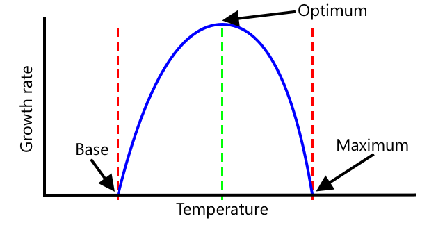

<!--
CO_OP_TRANSLATOR_METADATA:
{
  "original_hash": "d105b44deae539165855c976dcdeca99",
  "translation_date": "2025-08-25T16:44:51+00:00",
  "source_file": "2-farm/lessons/1-predict-plant-growth/README.md",
  "language_code": "it"
}
-->
# Prevedere la crescita delle piante con IoT


> Illustrazione di [Nitya Narasimhan](https://github.com/nitya). Clicca sull'immagine per una versione più grande.

## Quiz preliminare alla lezione

[Quiz preliminare alla lezione](https://black-meadow-040d15503.1.azurestaticapps.net/quiz/9)

## Introduzione

Le piante necessitano di alcuni elementi per crescere: acqua, anidride carbonica, nutrienti, luce e calore. In questa lezione imparerai a calcolare i tassi di crescita e maturazione delle piante misurando la temperatura dell'aria.

In questa lezione tratteremo:

* [Agricoltura digitale](../../../../../2-farm/lessons/1-predict-plant-growth)
* [Perché la temperatura è importante in agricoltura?](../../../../../2-farm/lessons/1-predict-plant-growth)
* [Misurare la temperatura ambiente](../../../../../2-farm/lessons/1-predict-plant-growth)
* [Giorni grado di crescita (GDD)](../../../../../2-farm/lessons/1-predict-plant-growth)
* [Calcolare i GDD utilizzando i dati del sensore di temperatura](../../../../../2-farm/lessons/1-predict-plant-growth)

## Agricoltura digitale

L'agricoltura digitale sta trasformando il modo in cui coltiviamo, utilizzando strumenti per raccogliere, archiviare e analizzare i dati agricoli. Attualmente ci troviamo in un periodo descritto dal World Economic Forum come la "Quarta Rivoluzione Industriale", e l'ascesa dell'agricoltura digitale è stata definita la "Quarta Rivoluzione Agricola" o "Agricoltura 4.0".

> 🎓 Il termine Agricoltura Digitale include anche l'intera "catena del valore agricolo", ovvero tutto il percorso dal campo alla tavola. Comprende il monitoraggio della qualità dei prodotti mentre vengono spediti e lavorati, i sistemi di magazzino e di e-commerce, persino le app per il noleggio di trattori!

Questi cambiamenti permettono agli agricoltori di aumentare i raccolti, utilizzare meno fertilizzanti e pesticidi e ottimizzare l'uso dell'acqua. Sebbene principalmente utilizzati nei paesi più ricchi, i sensori e altri dispositivi stanno lentamente diminuendo di prezzo, rendendoli più accessibili nei paesi in via di sviluppo.

Alcune tecniche rese possibili dall'agricoltura digitale sono:

* Misurazione della temperatura - misurare la temperatura consente agli agricoltori di prevedere la crescita e la maturazione delle piante.
* Irrigazione automatizzata - misurare l'umidità del suolo e attivare i sistemi di irrigazione quando il terreno è troppo secco, anziché irrigare a intervalli prestabiliti. L'irrigazione programmata può portare a una sotto-irrigazione durante un periodo caldo e secco, o a una sovra-irrigazione durante la pioggia. Irrigando solo quando il terreno ne ha bisogno, gli agricoltori possono ottimizzare l'uso dell'acqua.
* Controllo dei parassiti - gli agricoltori possono utilizzare telecamere su robot automatizzati o droni per controllare la presenza di parassiti, applicando pesticidi solo dove necessario, riducendo la quantità di pesticidi utilizzati e il loro deflusso nelle riserve idriche locali.

✅ Fai una ricerca. Quali altre tecniche vengono utilizzate per migliorare i raccolti agricoli?

> 🎓 Il termine "Agricoltura di Precisione" si riferisce all'osservazione, misurazione e risposta alle colture su base per campo, o persino su parti di un campo. Questo include la misurazione dei livelli di acqua, nutrienti e parassiti e la risposta accurata, come irrigare solo una piccola parte di un campo.

## Perché la temperatura è importante in agricoltura?

Quando si studiano le piante, la maggior parte degli studenti impara la necessità di acqua, luce, anidride carbonica e nutrienti. Le piante hanno anche bisogno di calore per crescere - ecco perché fioriscono in primavera quando la temperatura aumenta, perché bucaneve o narcisi possono germogliare presto grazie a un breve periodo di caldo, e perché serre e hothouse sono così efficaci nel favorire la crescita delle piante.

> 🎓 Le serre e le hothouse svolgono un lavoro simile, ma con una differenza importante. Le hothouse sono riscaldate artificialmente e permettono agli agricoltori di controllare la temperatura in modo più accurato, mentre le serre si affidano al sole per il calore e di solito l'unico controllo è rappresentato da finestre o altre aperture per far uscire il calore.

Le piante hanno una temperatura base o minima, una temperatura ottimale e una temperatura massima, tutte basate sulle temperature medie giornaliere.

* Temperatura base - è la temperatura media giornaliera minima necessaria affinché una pianta cresca.
* Temperatura ottimale - è la temperatura media giornaliera ideale per ottenere la massima crescita.
* Temperatura massima - è la temperatura massima che una pianta può sopportare. Al di sopra di questa, la pianta interrompe la crescita nel tentativo di conservare acqua e sopravvivere.

> 💁 Queste sono temperature medie, calcolate come media tra le temperature diurne e notturne. Le piante necessitano anche di temperature diverse tra giorno e notte per fotosintetizzare in modo più efficiente e risparmiare energia di notte.

Ogni specie di pianta ha valori diversi per la temperatura base, ottimale e massima. Questo spiega perché alcune piante prosperano in paesi caldi e altre in paesi freddi.

✅ Fai una ricerca. Per le piante che hai nel tuo giardino, scuola o parco locale, cerca di trovare la temperatura base.



Il grafico sopra mostra un esempio di relazione tra tasso di crescita e temperatura. Fino alla temperatura base non c'è crescita. Il tasso di crescita aumenta fino alla temperatura ottimale, poi diminuisce dopo aver raggiunto il picco. Alla temperatura massima la crescita si interrompe.

La forma di questo grafico varia da specie a specie. Alcune hanno cali più bruschi sopra la temperatura ottimale, altre hanno aumenti più graduali dalla temperatura base a quella ottimale.

> 💁 Per ottenere la migliore crescita, un agricoltore deve conoscere i tre valori di temperatura e comprendere la forma dei grafici per le piante che sta coltivando.

Se un agricoltore ha il controllo della temperatura, ad esempio in una hothouse commerciale, può ottimizzare per le sue piante. Una hothouse commerciale che coltiva pomodori, ad esempio, avrà la temperatura impostata intorno ai 25°C durante il giorno e 20°C di notte per ottenere la crescita più rapida.

> 🍅 Combinando queste temperature con luci artificiali, fertilizzanti e livelli controllati di CO
Questo codice apre il file CSV e aggiunge una nuova riga alla fine. La riga contiene la data e l'ora corrente formattate in un formato leggibile, seguite dalla temperatura ricevuta dal dispositivo IoT. I dati sono memorizzati nel [formato ISO 8601](https://wikipedia.org/wiki/ISO_8601) con il fuso orario, ma senza microsecondi.

1. Esegui questo codice nello stesso modo di prima, assicurandoti che il tuo dispositivo IoT stia inviando dati. Verrà creato un file CSV chiamato `temperature.csv` nella stessa cartella. Se lo visualizzi, vedrai date/ore e misurazioni della temperatura:

    ```output
    date,temperature
    2021-04-19T17:21:36-07:00,25
    2021-04-19T17:31:36-07:00,24
    2021-04-19T17:41:36-07:00,25
    ```

1. Esegui questo codice per un po' di tempo per catturare i dati. Idealmente, dovresti eseguirlo per un'intera giornata per raccogliere abbastanza dati per i calcoli GDD.

    
> 💁 Se stai utilizzando un dispositivo IoT virtuale, seleziona la casella di controllo casuale e imposta un intervallo per evitare di ottenere sempre la stessa temperatura ogni volta che viene restituito il valore della temperatura.
     

    > 💁 Se vuoi eseguirlo per un'intera giornata, devi assicurarti che il computer su cui gira il codice del server non vada in sospensione, modificando le impostazioni di alimentazione o eseguendo qualcosa come [questo script Python per mantenere il sistema attivo](https://github.com/jaqsparow/keep-system-active).
    
> 💁 Puoi trovare questo codice nella cartella [code-server/temperature-sensor-server](../../../../../2-farm/lessons/1-predict-plant-growth/code-server/temperature-sensor-server).

### Compito - calcolare GDD utilizzando i dati memorizzati

Una volta che il server ha catturato i dati sulla temperatura, è possibile calcolare i GDD per una pianta.

I passaggi per farlo manualmente sono:

1. Trova la temperatura base per la pianta. Ad esempio, per le fragole la temperatura base è 10°C.

1. Dal file `temperature.csv`, trova le temperature massime e minime della giornata.

1. Utilizza il calcolo GDD fornito in precedenza per calcolare i GDD.

Ad esempio, se la temperatura massima della giornata è 25°C e la minima è 12°C:


* 25 + 12 = 37
* 37 / 2 = 18.5
* 18.5 - 10 = 8.5

Pertanto, le fragole hanno ricevuto **8.5** GDD. Le fragole necessitano di circa 250 GDD per produrre frutti, quindi c'è ancora un po' di strada da fare.

---

## 🚀 Sfida

Le piante hanno bisogno di più del calore per crescere. Quali altre cose sono necessarie?

Per queste, trova se ci sono sensori che possono misurarle. E gli attuatori per controllare questi livelli? Come metteresti insieme uno o più dispositivi IoT per ottimizzare la crescita delle piante?

## Quiz post-lezione

[Quiz post-lezione](https://black-meadow-040d15503.1.azurestaticapps.net/quiz/10)

## Revisione e studio autonomo

* Leggi di più sull'agricoltura digitale sulla [pagina Wikipedia sull'agricoltura digitale](https://wikipedia.org/wiki/Digital_agriculture). Leggi anche di più sull'agricoltura di precisione sulla [pagina Wikipedia sull'agricoltura di precisione](https://wikipedia.org/wiki/Precision_agriculture).
* Il calcolo completo dei gradi giorno di crescita è più complicato rispetto a quello semplificato fornito qui. Leggi di più sull'equazione più complessa e su come gestire le temperature al di sotto della soglia sulla [pagina Wikipedia sui gradi giorno di crescita](https://wikipedia.org/wiki/Growing_degree-day).
* Il cibo potrebbe diventare scarso in futuro se continuiamo a utilizzare gli stessi metodi di coltivazione. Scopri di più sulle tecniche di agricoltura hi-tech in questo [video sulle fattorie hi-tech del futuro su YouTube](https://www.youtube.com/watch?v=KIEOuKD9KX8).

## Compito

[Visualizza i dati GDD utilizzando un Jupyter Notebook](assignment.md)

**Disclaimer**:  
Questo documento è stato tradotto utilizzando il servizio di traduzione automatica [Co-op Translator](https://github.com/Azure/co-op-translator). Sebbene ci impegniamo per garantire l'accuratezza, si prega di notare che le traduzioni automatiche possono contenere errori o imprecisioni. Il documento originale nella sua lingua nativa dovrebbe essere considerato la fonte autorevole. Per informazioni critiche, si raccomanda una traduzione professionale effettuata da un traduttore umano. Non siamo responsabili per eventuali incomprensioni o interpretazioni errate derivanti dall'uso di questa traduzione.