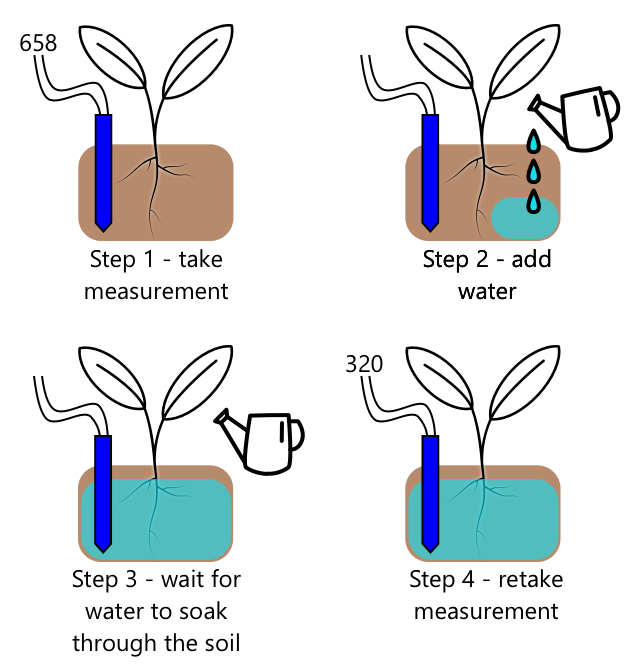

<!--
CO_OP_TRANSLATOR_METADATA:
{
  "original_hash": "f7bb24ba53fb627ddb38a8b24a05e594",
  "translation_date": "2025-08-25T16:50:20+00:00",
  "source_file": "2-farm/lessons/3-automated-plant-watering/README.md",
  "language_code": "it"
}
-->
# Irrigazione automatica delle piante


> Illustrazione di [Nitya Narasimhan](https://github.com/nitya). Clicca sull'immagine per una versione più grande.

Questa lezione è stata insegnata come parte della serie [IoT for Beginners Project 2 - Digital Agriculture](https://youtube.com/playlist?list=PLmsFUfdnGr3yCutmcVg6eAUEfsGiFXgcx) del [Microsoft Reactor](https://developer.microsoft.com/reactor/?WT.mc_id=academic-17441-jabenn).

[](https://youtu.be/g9FfZwv9R58)

## Quiz preliminare alla lezione

[Quiz preliminare alla lezione](https://black-meadow-040d15503.1.azurestaticapps.net/quiz/13)

## Introduzione

Nella lezione precedente, hai imparato a monitorare l'umidità del terreno. In questa lezione imparerai a costruire i componenti principali di un sistema di irrigazione automatizzato che risponde ai livelli di umidità del terreno. Inoltre, scoprirai l'importanza del tempo di risposta: i sensori possono impiegare un po' di tempo per rispondere ai cambiamenti, e gli attuatori possono richiedere tempo per modificare le proprietà misurate dai sensori.

In questa lezione tratteremo:

* [Controllare dispositivi ad alta potenza da un dispositivo IoT a bassa potenza](../../../../../2-farm/lessons/3-automated-plant-watering)
* [Controllare un relè](../../../../../2-farm/lessons/3-automated-plant-watering)
* [Controllare la tua pianta tramite MQTT](../../../../../2-farm/lessons/3-automated-plant-watering)
* [Tempi di risposta di sensori e attuatori](../../../../../2-farm/lessons/3-automated-plant-watering)
* [Aggiungere il tempo di risposta al server di controllo della pianta](../../../../../2-farm/lessons/3-automated-plant-watering)

## Controllare dispositivi ad alta potenza da un dispositivo IoT a bassa potenza

I dispositivi IoT utilizzano una tensione bassa. Sebbene questa sia sufficiente per sensori e attuatori a bassa potenza come i LED, non è sufficiente per controllare hardware più grande, come una pompa d'acqua utilizzata per l'irrigazione. Anche le piccole pompe che potresti usare per le piante da appartamento richiedono troppa corrente per un kit di sviluppo IoT e potrebbero danneggiare la scheda.

> 🎓 La corrente, misurata in Ampere (A), è la quantità di elettricità che scorre attraverso un circuito. La tensione fornisce la spinta, mentre la corrente rappresenta quanto viene spinto. Puoi leggere di più sulla corrente nella [pagina dedicata su Wikipedia](https://wikipedia.org/wiki/Electric_current).

La soluzione consiste nel collegare una pompa a un alimentatore esterno e utilizzare un attuatore per accendere la pompa, simile a come accenderesti una luce. Serve una quantità minima di energia (sotto forma di energia del tuo corpo) per il tuo dito per azionare un interruttore, e questo collega la luce all'elettricità di rete che funziona a 110v/240v.


> 🎓 [Elettricità di rete](https://wikipedia.org/wiki/Mains_electricity) si riferisce all'elettricità fornita a case e aziende attraverso infrastrutture nazionali in molte parti del mondo.

✅ I dispositivi IoT possono solitamente fornire 3.3V o 5V, con meno di 1 ampere (1A) di corrente. Confronta questo con l'elettricità di rete che è più spesso a 230V (120V in Nord America e 100V in Giappone) e può fornire energia per dispositivi che richiedono 30A.

Esistono diversi attuatori che possono fare questo, inclusi dispositivi meccanici che puoi collegare agli interruttori esistenti per simulare un dito che li accende. Il più popolare è il relè.

### Relè

Un relè è un interruttore elettromeccanico che converte un segnale elettrico in un movimento meccanico che accende un interruttore. Il cuore di un relè è un elettromagnete.

> 🎓 [Elettromagneti](https://wikipedia.org/wiki/Electromagnet) sono magneti creati facendo passare elettricità attraverso una bobina di filo. Quando l'elettricità è accesa, la bobina si magnetizza. Quando l'elettricità è spenta, la bobina perde il suo magnetismo.


In un relè, un circuito di controllo alimenta l'elettromagnete. Quando l'elettromagnete è acceso, tira una leva che muove un interruttore, chiudendo un paio di contatti e completando un circuito di uscita.


Quando il circuito di controllo è spento, l'elettromagnete si spegne, rilasciando la leva e aprendo i contatti, spegnendo il circuito di uscita. I relè sono attuatori digitali: un segnale alto al relè lo accende, un segnale basso lo spegne.

Il circuito di uscita può essere utilizzato per alimentare hardware aggiuntivo, come un sistema di irrigazione. Il dispositivo IoT può accendere il relè, completando il circuito di uscita che alimenta il sistema di irrigazione, e le piante vengono irrigate. Il dispositivo IoT può quindi spegnere il relè, interrompendo l'alimentazione al sistema di irrigazione e spegnendo l'acqua.


Nel video sopra, un relè viene acceso. Un LED sul relè si illumina per indicare che è acceso (alcune schede relè hanno LED per indicare se il relè è acceso o spento), e l'alimentazione viene inviata alla pompa, accendendola e pompando acqua in una pianta.

> 💁 I relè possono anche essere utilizzati per passare da un circuito di uscita a un altro invece di accenderne o spegnerne uno. Quando la leva si muove, sposta un interruttore da un circuito di uscita a un altro, solitamente condividendo una connessione di alimentazione comune o una connessione di massa comune.

✅ Fai una ricerca: Esistono diversi tipi di relè, con differenze come se il circuito di controllo accende o spegne il relè quando viene applicata l'alimentazione, o circuiti di uscita multipli. Scopri di più su questi diversi tipi.

Quando la leva si muove, di solito puoi sentirla fare contatto con l'elettromagnete con un rumore ben definito di clic.

> 💁 Un relè può essere cablato in modo che la connessione effettivamente interrompa l'alimentazione al relè, spegnendolo, il che poi invia alimentazione al relè riaccendendolo, e così via. Questo significa che il relè cliccherà molto velocemente producendo un rumore di ronzio. Questo è il modo in cui funzionavano alcuni dei primi campanelli elettrici.

### Alimentazione del relè

L'elettromagnete non necessita di molta energia per attivarsi e tirare la leva, può essere controllato utilizzando l'uscita a 3.3V o 5V di un kit di sviluppo IoT. Il circuito di uscita può trasportare molta più energia, a seconda del relè, inclusa la tensione di rete o livelli di potenza ancora più elevati per uso industriale. In questo modo un kit di sviluppo IoT può controllare un sistema di irrigazione, da una piccola pompa per una singola pianta, fino a un sistema industriale massiccio per un'intera azienda agricola commerciale.


L'immagine sopra mostra un relè Grove. Il circuito di controllo si collega a un dispositivo IoT e accende o spegne il relè utilizzando 3.3V o 5V. Il circuito di uscita ha due terminali, uno può essere alimentazione o massa. Il circuito di uscita può gestire fino a 250V a 10A, sufficiente per una gamma di dispositivi alimentati dalla rete. Puoi trovare relè che possono gestire livelli di potenza ancora più elevati.


Nell'immagine sopra, l'alimentazione viene fornita a una pompa tramite un relè. C'è un filo rosso che collega il terminale +5V di un alimentatore USB a un terminale del circuito di uscita del relè, e un altro filo rosso che collega l'altro terminale del circuito di uscita alla pompa. Un filo nero collega la pompa alla massa dell'alimentatore USB. Quando il relè si accende, completa il circuito, inviando 5V alla pompa e accendendola.

## Controllare un relè

Puoi controllare un relè dal tuo kit di sviluppo IoT.

### Attività - controllare un relè

Segui la guida pertinente per controllare un relè utilizzando il tuo dispositivo IoT:

* [Arduino - Wio Terminal](wio-terminal-relay.md)
* [Computer a scheda singola - Raspberry Pi](pi-relay.md)
* [Computer a scheda singola - Dispositivo virtuale](virtual-device-relay.md)

## Controllare la tua pianta tramite MQTT

Finora il tuo relè è stato controllato direttamente dal dispositivo IoT basandosi su una singola lettura dell'umidità del terreno. In un sistema di irrigazione commerciale, la logica di controllo sarà centralizzata, permettendo di prendere decisioni sull'irrigazione utilizzando dati provenienti da più sensori e consentendo di modificare qualsiasi configurazione in un unico luogo. Per simulare questo, puoi controllare il relè tramite MQTT.

### Attività - controllare il relè tramite MQTT

1. Aggiungi le librerie MQTT/pacchetti pip pertinenti e il codice al tuo progetto `soil-moisture-sensor` per connetterti a MQTT. Nomina l'ID client come `soilmoisturesensor_client` preceduto dal tuo ID.

    > ⚠️ Puoi fare riferimento [alle istruzioni per connettersi a MQTT nel progetto 1, lezione 4 se necessario](../../../1-getting-started/lessons/4-connect-internet/README.md#connect-your-iot-device-to-mqtt).

1. Aggiungi il codice del dispositivo pertinente per inviare telemetria con le impostazioni di umidità del terreno. Per il messaggio di telemetria, nomina la proprietà `soil_moisture`.

    > ⚠️ Puoi fare riferimento [alle istruzioni per inviare telemetria a MQTT nel progetto 1, lezione 4 se necessario](../../../1-getting-started/lessons/4-connect-internet/README.md#send-telemetry-from-your-iot-device).

1. Crea del codice server locale per sottoscrivere la telemetria e inviare un comando per controllare il relè in una cartella chiamata `soil-moisture-sensor-server`. Nomina la proprietà nel messaggio di comando `relay_on` e imposta l'ID client come `soilmoisturesensor_server` preceduto dal tuo ID. Mantieni la stessa struttura del codice server che hai scritto per il progetto 1, lezione 4, poiché aggiungerai a questo codice più avanti in questa lezione.

    > ⚠️ Puoi fare riferimento [alle istruzioni per inviare telemetria a MQTT](../../../1-getting-started/lessons/4-connect-internet/README.md#write-the-server-code) e [inviare comandi tramite MQTT](../../../1-getting-started/lessons/4-connect-internet/README.md#send-commands-to-the-mqtt-broker) nel progetto 1, lezione 4 se necessario.

1. Aggiungi il codice del dispositivo pertinente per controllare il relè dai comandi ricevuti, utilizzando la proprietà `relay_on` dal messaggio. Invia true per `relay_on` se il valore di `soil_moisture` è maggiore di 450, altrimenti invia false, seguendo la stessa logica che hai aggiunto al dispositivo IoT in precedenza.

    > ⚠️ Puoi fare riferimento [alle istruzioni per rispondere ai comandi da MQTT nel progetto 1, lezione 4 se necessario](../../../1-getting-started/lessons/4-connect-internet/README.md#handle-commands-on-the-iot-device).

> 💁 Puoi trovare questo codice nella cartella [code-mqtt](../../../../../2-farm/lessons/3-automated-plant-watering/code-mqtt).

Assicurati che il codice sia in esecuzione sul tuo dispositivo e sul server locale, e testalo modificando i livelli di umidità del terreno, sia cambiando i valori inviati dal sensore virtuale, sia modificando i livelli di umidità del terreno aggiungendo acqua o rimuovendo il sensore dal terreno.

## Tempi di risposta di sensori e attuatori

Nella lezione 3 hai costruito una luce notturna: un LED che si accende non appena un livello basso di luce viene rilevato da un sensore di luce. Il sensore di luce rilevava un cambiamento nei livelli di luce istantaneamente, e il dispositivo era in grado di rispondere rapidamente, limitato solo dalla lunghezza del ritardo nella funzione `loop` o nel ciclo `while True:`. Come sviluppatore IoT, non puoi sempre fare affidamento su un ciclo di feedback così veloce.

### Tempi di risposta per l'umidità del terreno

Se hai seguito la lezione precedente sull'umidità del terreno utilizzando un sensore fisico, avrai notato che ci sono voluti alcuni secondi affinché la lettura dell'umidità del terreno diminuisse dopo aver irrigato la tua pianta. Questo non è dovuto alla lentezza del sensore, ma al tempo necessario affinché l'acqua si diffonda nel terreno.
💁 Se hai annaffiato troppo vicino al sensore, potresti aver notato che la lettura è diminuita rapidamente per poi risalire - questo accade perché l'acqua vicino al sensore si diffonde nel resto del terreno, riducendo l'umidità del suolo rilevata dal sensore.


Nel diagramma sopra, una lettura dell'umidità del suolo mostra 658. La pianta viene irrigata, ma questa lettura non cambia immediatamente, poiché l'acqua non ha ancora raggiunto il sensore. L'irrigazione può persino terminare prima che l'acqua raggiunga il sensore e il valore scenda per riflettere il nuovo livello di umidità.

Se stai scrivendo del codice per controllare un sistema di irrigazione tramite un relè basato sui livelli di umidità del suolo, dovresti tenere in considerazione questo ritardo e costruire una logica temporale più intelligente nel tuo dispositivo IoT.

✅ Prenditi un momento per pensare a come potresti fare questo.

### Controllare il tempo del sensore e dell'attuatore

Immagina di dover costruire un sistema di irrigazione per una fattoria. In base al tipo di terreno, il livello ideale di umidità del suolo per le piante coltivate corrisponde a una lettura di tensione analogica compresa tra 400 e 450.

Potresti programmare il dispositivo nello stesso modo di una luce notturna: ogni volta che il sensore legge un valore superiore a 450, accendi un relè per attivare una pompa. Il problema è che l'acqua impiega del tempo per passare dalla pompa, attraverso il terreno, fino al sensore. Il sensore interromperà l'acqua quando rileva un livello di 450, ma il livello di umidità continuerà a scendere poiché l'acqua pompata continua a infiltrarsi nel terreno. Il risultato finale è uno spreco d'acqua e il rischio di danneggiare le radici.

✅ Ricorda: troppa acqua può essere dannosa per le piante quanto troppo poca, oltre a sprecare una risorsa preziosa.

La soluzione migliore è comprendere che c'è un ritardo tra l'attivazione dell'attuatore e il cambiamento della proprietà rilevata dal sensore. Questo significa che non solo il sensore dovrebbe attendere un po' prima di misurare nuovamente il valore, ma l'attuatore deve spegnersi per un po' prima che venga effettuata la prossima misurazione del sensore.

Quanto tempo dovrebbe rimanere acceso il relè ogni volta? È meglio essere prudenti e accendere il relè solo per un breve periodo, quindi attendere che l'acqua si infiltri, e poi ricontrollare i livelli di umidità. Dopotutto, puoi sempre riaccendere il relè per aggiungere più acqua, ma non puoi rimuovere l'acqua dal terreno.

> 💁 Questo tipo di controllo temporale è molto specifico per il dispositivo IoT che stai costruendo, la proprietà che stai misurando e i sensori e attuatori utilizzati.


Ad esempio, ho una pianta di fragole con un sensore di umidità del suolo e una pompa controllata da un relè. Ho osservato che quando aggiungo acqua ci vogliono circa 20 secondi affinché la lettura dell'umidità del suolo si stabilizzi. Questo significa che devo spegnere il relè e attendere 20 secondi prima di controllare i livelli di umidità. Preferisco avere poca acqua piuttosto che troppa: posso sempre riaccendere la pompa, ma non posso togliere l'acqua dalla pianta.



Questo significa che il miglior processo sarebbe un ciclo di irrigazione simile a:

* Accendi la pompa per 5 secondi
* Attendi 20 secondi
* Controlla l'umidità del suolo
* Se il livello è ancora superiore a quello necessario, ripeti i passaggi sopra

5 secondi potrebbero essere troppo lunghi per la pompa, specialmente se i livelli di umidità sono solo leggermente superiori al livello richiesto. Il modo migliore per sapere quale tempistica utilizzare è provarla, quindi regolarla quando hai i dati del sensore, con un ciclo di feedback costante. Questo può persino portare a una tempistica più granulare, come accendere la pompa per 1 secondo per ogni 100 sopra il livello di umidità richiesto, invece di un valore fisso di 5 secondi.

✅ Fai una ricerca: Ci sono altre considerazioni temporali? La pianta può essere irrigata in qualsiasi momento in cui l'umidità del suolo è troppo bassa, o ci sono momenti specifici della giornata che sono buoni o cattivi per irrigare le piante?

> 💁 Anche le previsioni meteorologiche possono essere prese in considerazione quando si controllano sistemi di irrigazione automatizzati per coltivazioni all'aperto. Se è prevista pioggia, l'irrigazione può essere sospesa fino a dopo la pioggia. A quel punto il terreno potrebbe essere sufficientemente umido da non richiedere irrigazione, molto più efficiente che sprecare acqua irrigando poco prima della pioggia.

## Aggiungi la temporizzazione al server di controllo della pianta

Il codice del server può essere modificato per aggiungere il controllo attorno alla temporizzazione del ciclo di irrigazione e attendere che i livelli di umidità del suolo cambino. La logica del server per controllare la temporizzazione del relè è:

1. Messaggio di telemetria ricevuto
1. Controlla il livello di umidità del suolo
1. Se è ok, non fare nulla. Se la lettura è troppo alta (significa che l'umidità del suolo è troppo bassa), allora:
    1. Invia un comando per accendere il relè
    1. Attendi 5 secondi
    1. Invia un comando per spegnere il relè
    1. Attendi 20 secondi affinché i livelli di umidità del suolo si stabilizzino

Il ciclo di irrigazione, il processo che va dalla ricezione del messaggio di telemetria fino a essere pronti a elaborare nuovamente i livelli di umidità del suolo, dura circa 25 secondi. Stiamo inviando i livelli di umidità del suolo ogni 10 secondi, quindi c'è una sovrapposizione in cui un messaggio viene ricevuto mentre il server sta aspettando che i livelli di umidità del suolo si stabilizzino, il che potrebbe avviare un altro ciclo di irrigazione.

Ci sono due opzioni per risolvere questo problema:

* Modificare il codice del dispositivo IoT per inviare la telemetria solo ogni minuto, in modo che il ciclo di irrigazione venga completato prima che venga inviato il messaggio successivo
* Annullare l'iscrizione alla telemetria durante il ciclo di irrigazione

La prima opzione non è sempre una buona soluzione per grandi fattorie. Il contadino potrebbe voler acquisire i livelli di umidità del suolo mentre il terreno viene irrigato per un'analisi successiva, ad esempio per essere consapevole del flusso d'acqua in diverse aree della fattoria e guidare un'irrigazione più mirata. La seconda opzione è migliore: il codice ignora semplicemente la telemetria quando non può utilizzarla, ma la telemetria è comunque disponibile per altri servizi che potrebbero iscriversi ad essa.

> 💁 I dati IoT non vengono inviati da un solo dispositivo a un solo servizio, ma molti dispositivi possono inviare dati a un broker, e molti servizi possono ascoltare i dati dal broker. Ad esempio, un servizio potrebbe ascoltare i dati sull'umidità del suolo e archiviarli in un database per un'analisi successiva. Un altro servizio può anche ascoltare la stessa telemetria per controllare un sistema di irrigazione.

### Compito - aggiungi la temporizzazione al server di controllo della pianta

Aggiorna il codice del server per far funzionare il relè per 5 secondi, quindi attendere 20 secondi.

1. Apri la cartella `soil-moisture-sensor-server` in VS Code se non è già aperta. Assicurati che l'ambiente virtuale sia attivato.

1. Apri il file `app.py`

1. Aggiungi il seguente codice al file `app.py` sotto gli import esistenti:

    ```python
    import threading
    ```

    Questa istruzione importa `threading` dalle librerie Python, permettendo a Python di eseguire altro codice mentre aspetta.

1. Aggiungi il seguente codice prima della funzione `handle_telemetry` che gestisce i messaggi di telemetria ricevuti dal codice del server:

    ```python
    water_time = 5
    wait_time = 20
    ```

    Questo definisce quanto tempo far funzionare il relè (`water_time`) e quanto tempo attendere successivamente per controllare l'umidità del suolo (`wait_time`).

1. Sotto questo codice, aggiungi il seguente:

    ```python
    def send_relay_command(client, state):
        command = { 'relay_on' : state }
        print("Sending message:", command)
        client.publish(server_command_topic, json.dumps(command))
    ```

    Questo codice definisce una funzione chiamata `send_relay_command` che invia un comando tramite MQTT per controllare il relè. La telemetria viene creata come un dizionario, quindi convertita in una stringa JSON. Il valore passato in `state` determina se il relè deve essere acceso o spento.

1. Dopo la funzione `send_relay_code`, aggiungi il seguente codice:

    ```python
    def control_relay(client):
        print("Unsubscribing from telemetry")
        mqtt_client.unsubscribe(client_telemetry_topic)
    
        send_relay_command(client, True)
        time.sleep(water_time)
        send_relay_command(client, False)
    
        time.sleep(wait_time)
    
        print("Subscribing to telemetry")
        mqtt_client.subscribe(client_telemetry_topic)
    ```

    Questo definisce una funzione per controllare il relè in base alla temporizzazione richiesta. Inizia annullando l'iscrizione alla telemetria in modo che i messaggi sull'umidità del suolo non vengano elaborati durante l'irrigazione. Successivamente invia un comando per accendere il relè. Poi attende per il tempo definito in `water_time` prima di inviare un comando per spegnere il relè. Infine attende che i livelli di umidità del suolo si stabilizzino per il tempo definito in `wait_time`. Poi si riscrive alla telemetria.

1. Modifica la funzione `handle_telemetry` come segue:

    ```python
    def handle_telemetry(client, userdata, message):
        payload = json.loads(message.payload.decode())
        print("Message received:", payload)
    
        if payload['soil_moisture'] > 450:
            threading.Thread(target=control_relay, args=(client,)).start()
    ```

    Questo codice controlla il livello di umidità del suolo. Se è maggiore di 450, il suolo necessita di irrigazione, quindi chiama la funzione `control_relay`. Questa funzione viene eseguita su un thread separato, in esecuzione in background.

1. Assicurati che il tuo dispositivo IoT sia in esecuzione, quindi esegui questo codice. Modifica i livelli di umidità del suolo e osserva cosa succede al relè: dovrebbe accendersi per 5 secondi, quindi rimanere spento per almeno 20 secondi, accendendosi solo se i livelli di umidità del suolo non sono sufficienti.

    ```output
    (.venv) ➜  soil-moisture-sensor-server ✗ python app.py
    Message received: {'soil_moisture': 457}
    Unsubscribing from telemetry
    Sending message: {'relay_on': True}
    Sending message: {'relay_on': False}
    Subscribing to telemetry
    Message received: {'soil_moisture': 302}
    ```

    Un buon modo per testare questo in un sistema di irrigazione simulato è utilizzare terreno asciutto, quindi versare acqua manualmente mentre il relè è acceso, interrompendo il versamento quando il relè si spegne.

> 💁 Puoi trovare questo codice nella cartella [code-timing](../../../../../2-farm/lessons/3-automated-plant-watering/code-timing).

> 💁 Se vuoi utilizzare una pompa per costruire un sistema di irrigazione reale, puoi utilizzare una [pompa d'acqua da 6V](https://www.seeedstudio.com/6V-Mini-Water-Pump-p-1945.html) con un [alimentatore USB](https://www.adafruit.com/product/3628). Assicurati che l'alimentazione verso o dalla pompa sia collegata tramite il relè.

---

## 🚀 Sfida

Riesci a pensare ad altri dispositivi IoT o elettrici che hanno un problema simile, in cui ci vuole del tempo affinché i risultati dell'attuatore raggiungano il sensore? Probabilmente ne hai un paio in casa o a scuola.

* Quali proprietà misurano?
* Quanto tempo impiega la proprietà a cambiare dopo l'uso di un attuatore?
* È accettabile che la proprietà cambi oltre il valore richiesto?
* Come può essere riportata al valore richiesto, se necessario?

## Quiz post-lezione

[Quiz post-lezione](https://black-meadow-040d15503.1.azurestaticapps.net/quiz/14)

## Revisione e studio autonomo

* Leggi di più sui relè, inclusi i loro usi storici negli scambi telefonici, sulla [pagina Wikipedia sui relè](https://wikipedia.org/wiki/Relay).

## Compito

[Costruisci un ciclo di irrigazione più efficiente](assignment.md)

**Disclaimer**:  
Questo documento è stato tradotto utilizzando il servizio di traduzione automatica [Co-op Translator](https://github.com/Azure/co-op-translator). Sebbene ci impegniamo per garantire l'accuratezza, si prega di notare che le traduzioni automatiche possono contenere errori o imprecisioni. Il documento originale nella sua lingua nativa dovrebbe essere considerato la fonte autorevole. Per informazioni critiche, si raccomanda una traduzione professionale effettuata da un traduttore umano. Non siamo responsabili per eventuali incomprensioni o interpretazioni errate derivanti dall'uso di questa traduzione.