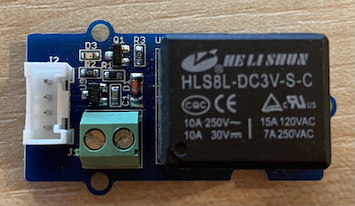

<!--
CO_OP_TRANSLATOR_METADATA:
{
  "original_hash": "66b81165e60f8f169bd52a401b6a0f8b",
  "translation_date": "2025-08-25T16:52:58+00:00",
  "source_file": "2-farm/lessons/3-automated-plant-watering/pi-relay.md",
  "language_code": "it"
}
-->
# Controllare un relè - Raspberry Pi

In questa parte della lezione, aggiungerai un relè al tuo Raspberry Pi, oltre al sensore di umidità del suolo, e lo controllerai in base al livello di umidità del suolo.

## Hardware

Il Raspberry Pi necessita di un relè.

Il relè che utilizzerai è un [Grove relay](https://www.seeedstudio.com/Grove-Relay.html), un relè normalmente aperto (il che significa che il circuito di uscita è aperto, o disconnesso, quando non viene inviato alcun segnale al relè) che può gestire circuiti di uscita fino a 250V e 10A.

Questo è un attuatore digitale, quindi si collega a un pin digitale sul Grove Base Hat.

### Collegare il relè

Il relè Grove può essere collegato al Raspberry Pi.

#### Attività

Collega il relè.



1. Inserisci un'estremità di un cavo Grove nella presa del relè. Entrerà solo in un verso.

1. Con il Raspberry Pi spento, collega l'altra estremità del cavo Grove alla presa digitale contrassegnata **D5** sul Grove Base Hat collegato al Pi. Questa presa è la seconda da sinistra, nella fila di prese accanto ai pin GPIO. Lascia il sensore di umidità del suolo collegato alla presa **A0**.


1. Inserisci il sensore di umidità del suolo nel terreno, se non lo hai già fatto dalla lezione precedente.

## Programmare il relè

Ora il Raspberry Pi può essere programmato per utilizzare il relè collegato.

### Attività

Programma il dispositivo.

1. Accendi il Pi e attendi che si avvii.

1. Apri il progetto `soil-moisture-sensor` dalla lezione precedente in VS Code, se non è già aperto. Aggiungerai del codice a questo progetto.

1. Aggiungi il seguente codice al file `app.py` sotto gli import esistenti:

    ```python
    from grove.grove_relay import GroveRelay
    ```

    Questa istruzione importa il `GroveRelay` dalle librerie Python di Grove per interagire con il relè Grove.

1. Aggiungi il seguente codice sotto la dichiarazione della classe `ADC` per creare un'istanza di `GroveRelay`:

    ```python
    relay = GroveRelay(5)
    ```

    Questo crea un relè utilizzando il pin **D5**, il pin digitale a cui hai collegato il relè.

1. Per testare che il relè funzioni, aggiungi il seguente codice al ciclo `while True:`:

    ```python
    relay.on()
    time.sleep(.5)
    relay.off()
    ```

    Il codice accende il relè, attende 0,5 secondi, quindi spegne il relè.

1. Esegui l'app Python. Il relè si accenderà e spegnerà ogni 10 secondi, con un ritardo di mezzo secondo tra accensione e spegnimento. Sentirai il relè fare clic quando si accende e spegne. Un LED sulla scheda Grove si accenderà quando il relè è acceso e si spegnerà quando il relè è spento.

    

## Controllare il relè in base all'umidità del suolo

Ora che il relè funziona, può essere controllato in risposta alle letture dell'umidità del suolo.

### Attività

Controlla il relè.

1. Elimina le 3 righe di codice che hai aggiunto per testare il relè. Sostituiscile con il seguente codice:

    ```python
    if soil_moisture > 450:
        print("Soil Moisture is too low, turning relay on.")
        relay.on()
    else:
        print("Soil Moisture is ok, turning relay off.")
        relay.off()
    ```

    Questo codice controlla il livello di umidità del suolo dal sensore di umidità del suolo. Se è superiore a 450, accende il relè, e lo spegne quando scende sotto 450.

    > 💁 Ricorda che il sensore capacitivo di umidità del suolo legge: più basso è il livello di umidità del suolo, maggiore è l'umidità presente nel terreno e viceversa.

1. Esegui l'app Python. Vedrai il relè accendersi o spegnersi a seconda del livello di umidità del suolo. Prova con terreno asciutto, poi aggiungi acqua.

    ```output
    Soil Moisture: 638
    Soil Moisture is too low, turning relay on.
    Soil Moisture: 452
    Soil Moisture is too low, turning relay on.
    Soil Moisture: 347
    Soil Moisture is ok, turning relay off.
    ```

> 💁 Puoi trovare questo codice nella cartella [code-relay/pi](../../../../../2-farm/lessons/3-automated-plant-watering/code-relay/pi).

😀 Il tuo programma per controllare un relè con il sensore di umidità del suolo è stato un successo!

**Disclaimer**:  
Questo documento è stato tradotto utilizzando il servizio di traduzione automatica [Co-op Translator](https://github.com/Azure/co-op-translator). Sebbene ci impegniamo per garantire l'accuratezza, si prega di notare che le traduzioni automatiche potrebbero contenere errori o imprecisioni. Il documento originale nella sua lingua nativa dovrebbe essere considerato la fonte autorevole. Per informazioni critiche, si raccomanda una traduzione professionale effettuata da un esperto umano. Non siamo responsabili per eventuali incomprensioni o interpretazioni errate derivanti dall'uso di questa traduzione.