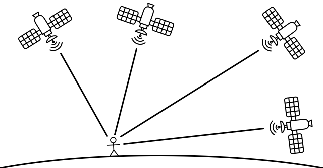

<!--
CO_OP_TRANSLATOR_METADATA:
{
  "original_hash": "52ed2bd997d08040f79a1a6ef2bac958",
  "translation_date": "2025-08-25T18:04:59+00:00",
  "source_file": "3-transport/lessons/1-location-tracking/README.md",
  "language_code": "it"
}
-->
# Tracciamento della posizione

> Illustrazione di [Nitya Narasimhan](https://github.com/nitya). Clicca sull'immagine per una versione più grande.

## Quiz preliminare alla lezione

[Quiz preliminare alla lezione](https://black-meadow-040d15503.1.azurestaticapps.net/quiz/21)

## Introduzione

Il processo principale per portare il cibo da un agricoltore a un consumatore prevede il carico di casse di prodotti su camion, navi, aerei o altri veicoli di trasporto commerciale, e la consegna del cibo in un luogo specifico - direttamente a un cliente o a un hub centrale o magazzino per la lavorazione. L'intero processo end-to-end, dalla fattoria al consumatore, fa parte di un processo chiamato *catena di approvvigionamento*. Il video qui sotto, realizzato dalla W. P. Carey School of Business dell'Arizona State University, spiega il concetto di catena di approvvigionamento e come viene gestita in modo più dettagliato.

> 🎥 Clicca sull'immagine sopra per guardare il video

L'aggiunta di dispositivi IoT può migliorare drasticamente la tua catena di approvvigionamento, consentendoti di gestire la posizione degli articoli, pianificare meglio il trasporto e la gestione delle merci, e rispondere più rapidamente ai problemi.

Quando si gestisce una flotta di veicoli, come camion, è utile sapere dove si trova ogni veicolo in un determinato momento. I veicoli possono essere dotati di sensori GPS che inviano la loro posizione ai sistemi IoT, consentendo ai proprietari di individuare la loro posizione, vedere il percorso seguito e sapere quando arriveranno a destinazione. La maggior parte dei veicoli opera al di fuori della copertura WiFi, quindi utilizza reti cellulari per inviare questo tipo di dati. A volte il sensore GPS è integrato in dispositivi IoT più complessi, come i registri elettronici di bordo. Questi dispositivi tracciano per quanto tempo un camion è stato in transito per garantire che i conducenti rispettino le leggi locali sugli orari di lavoro.

In questa lezione imparerai come tracciare la posizione di un veicolo utilizzando un sensore GPS (Global Positioning System).

In questa lezione tratteremo:

* [Veicoli connessi](../../../../../3-transport/lessons/1-location-tracking)
* [Coordinate geospaziali](../../../../../3-transport/lessons/1-location-tracking)
* [Sistemi di Posizionamento Globale (GPS)](../../../../../3-transport/lessons/1-location-tracking)
* [Leggere i dati del sensore GPS](../../../../../3-transport/lessons/1-location-tracking)
* [Dati GPS NMEA](../../../../../3-transport/lessons/1-location-tracking)
* [Decodificare i dati del sensore GPS](../../../../../3-transport/lessons/1-location-tracking)

## Veicoli connessi

L'IoT sta trasformando il modo in cui le merci vengono trasportate creando flotte di *veicoli connessi*. Questi veicoli sono collegati a sistemi IT centrali che riportano informazioni sulla loro posizione e altri dati dei sensori. Avere una flotta di veicoli connessi offre una vasta gamma di vantaggi:

* Tracciamento della posizione - puoi individuare dove si trova un veicolo in qualsiasi momento, consentendoti di:

  * Ricevere avvisi quando un veicolo sta per arrivare a destinazione per preparare una squadra per lo scarico
  * Localizzare veicoli rubati
  * Combinare i dati di posizione e percorso con i problemi di traffico per consentire di reindirizzare i veicoli durante il viaggio
  * Essere conforme alle tasse. Alcuni paesi addebitano ai veicoli il chilometraggio percorso su strade pubbliche (come il [RUC della Nuova Zelanda](https://www.nzta.govt.nz/vehicles/licensing-rego/road-user-charges/)), quindi sapere quando un veicolo è su strade pubbliche rispetto a strade private rende più facile calcolare le tasse dovute.
  * Sapere dove inviare squadre di manutenzione in caso di guasto

* Telemetria del conducente - essere in grado di garantire che i conducenti rispettino i limiti di velocità, affrontino le curve a velocità adeguate, frenino in modo tempestivo ed efficiente e guidino in sicurezza. I veicoli connessi possono anche avere telecamere per registrare incidenti. Questo può essere collegato alle assicurazioni, offrendo tariffe ridotte per i conducenti virtuosi.

* Conformità agli orari di guida - garantire che i conducenti guidino solo per le ore legalmente consentite in base agli orari di accensione e spegnimento del motore.

Questi vantaggi possono essere combinati - ad esempio, combinando la conformità agli orari di guida con il tracciamento della posizione per reindirizzare i conducenti se non possono raggiungere la loro destinazione entro le ore di guida consentite. Questi possono anche essere combinati con altre telemetrie specifiche del veicolo, come i dati sulla temperatura dei camion a temperatura controllata, consentendo di reindirizzare i veicoli se il percorso attuale significherebbe che le merci non possono essere mantenute alla temperatura adeguata.

> 🎓 La logistica è il processo di trasporto delle merci da un luogo a un altro, ad esempio da una fattoria a un supermercato tramite uno o più magazzini. Un agricoltore confeziona casse di pomodori che vengono caricate su un camion, consegnate a un magazzino centrale e caricate su un secondo camion che può contenere una miscela di diversi tipi di prodotti che vengono poi consegnati a un supermercato.

Il componente principale del tracciamento dei veicoli è il GPS - sensori che possono individuare la loro posizione ovunque sulla Terra. In questa lezione imparerai come utilizzare un sensore GPS, iniziando con l'apprendimento di come definire una posizione sulla Terra.

## Coordinate geospaziali

Le coordinate geospaziali vengono utilizzate per definire punti sulla superficie terrestre, in modo simile a come le coordinate possono essere utilizzate per disegnare un pixel su uno schermo di computer o posizionare punti in un ricamo a punto croce. Per un singolo punto, hai una coppia di coordinate. Ad esempio, il campus Microsoft a Redmond, Washington, USA si trova a 47.6423109, -122.1390293.

### Latitudine e longitudine

La Terra è una sfera - un cerchio tridimensionale. Per questo motivo, i punti vengono definiti dividendo la sfera in 360 gradi, come nella geometria dei cerchi. La latitudine misura il numero di gradi da nord a sud, mentre la longitudine misura il numero di gradi da est a ovest.

> 💁 Nessuno sa davvero il motivo originale per cui i cerchi sono divisi in 360 gradi. La [pagina Wikipedia sul grado (angolo)](https://wikipedia.org/wiki/Degree_(angle)) copre alcune delle possibili ragioni.

La latitudine è misurata utilizzando linee che circondano la Terra e corrono parallele all'equatore, dividendo gli emisferi settentrionale e meridionale in 90° ciascuno. L'equatore è a 0°, il Polo Nord è a 90°, noto anche come 90° Nord, e il Polo Sud è a -90°, o 90° Sud.

La longitudine è misurata come il numero di gradi misurati da est a ovest. L'origine a 0° della longitudine è chiamata *Primo Meridiano* ed è stata definita nel 1884 come una linea dal Polo Nord al Polo Sud che attraversa il [Royal Observatory britannico a Greenwich, Inghilterra](https://wikipedia.org/wiki/Royal_Observatory,_Greenwich).

> 🎓 Un meridiano è una linea immaginaria che va dal Polo Nord al Polo Sud, formando un semicerchio.

Per misurare la longitudine di un punto, si misura il numero di gradi lungo l'equatore dal Primo Meridiano a un meridiano che passa attraverso quel punto. La longitudine va da -180°, o 180° Ovest, attraverso 0° al Primo Meridiano, fino a 180°, o 180° Est. 180° e -180° si riferiscono allo stesso punto, l'antimeridiano o 180° meridiano. Questo è un meridiano sul lato opposto della Terra rispetto al Primo Meridiano.

> 💁 L'antimeridiano non deve essere confuso con la Linea Internazionale del Cambio di Data, che si trova approssimativamente nella stessa posizione, ma non è una linea retta e varia per adattarsi ai confini geopolitici.

✅ Fai una ricerca: Prova a trovare la latitudine e la longitudine della tua posizione attuale.

### Gradi, minuti e secondi vs gradi decimali

Tradizionalmente, le misurazioni dei gradi di latitudine e longitudine venivano effettuate utilizzando la numerazione sessagesimale, o base-60, un sistema numerico utilizzato dagli antichi Babilonesi che per primi misurarono e registrarono il tempo e le distanze. Probabilmente usi la numerazione sessagesimale ogni giorno senza nemmeno rendertene conto - dividendo le ore in 60 minuti e i minuti in 60 secondi.

La longitudine e la latitudine sono misurate in gradi, minuti e secondi, con un minuto pari a 1/60 di grado e 1 secondo pari a 1/60 di minuto.

Ad esempio, all'equatore:

* 1° di latitudine è **111,3 chilometri**
* 1 minuto di latitudine è 111,3/60 = **1,855 chilometri**
* 1 secondo di latitudine è 1,855/60 = **0,031 chilometri**

Il simbolo per un minuto è un apostrofo singolo, per un secondo è un doppio apostrofo. 2 gradi, 17 minuti e 43 secondi, ad esempio, sarebbero scritti come 2°17'43". Parti di secondi sono date come decimali, ad esempio mezzo secondo è 0°0'0.5".

I computer non lavorano in base-60, quindi queste coordinate vengono fornite come gradi decimali quando si utilizzano i dati GPS nella maggior parte dei sistemi informatici. Ad esempio, 2°17'43" è 2,295277. Di solito il simbolo del grado viene omesso.

Le coordinate per un punto sono sempre date come `latitudine, longitudine`, quindi l'esempio precedente del campus Microsoft a 47.6423109,-122.117198 ha:

* Una latitudine di 47.6423109 (47.6423109 gradi a nord dell'equatore)
* Una longitudine di -122.1390293 (122.1390293 gradi a ovest del Primo Meridiano).

## Sistemi di Posizionamento Globale (GPS)

I sistemi GPS utilizzano più satelliti in orbita attorno alla Terra per individuare la tua posizione. Probabilmente hai utilizzato sistemi GPS senza nemmeno accorgertene - per trovare la tua posizione su un'app di mappe sul tuo telefono, come Apple Maps o Google Maps, per vedere dove si trova il tuo passaggio in un'app di ride hailing come Uber o Lyft, o quando utilizzi un sistema di navigazione satellitare (sat-nav) nella tua auto.

> 🎓 I satelliti nella "navigazione satellitare" sono satelliti GPS!

I sistemi GPS funzionano grazie a un certo numero di satelliti che inviano un segnale con la posizione attuale di ciascun satellite e un timestamp accurato. Questi segnali vengono inviati tramite onde radio e rilevati da un'antenna nel sensore GPS. Un sensore GPS rileva questi segnali e, utilizzando l'ora corrente, misura quanto tempo è trascorso affinché il segnale raggiungesse il sensore dal satellite. Poiché la velocità delle onde radio è costante, il sensore GPS può utilizzare il timestamp inviato per calcolare quanto è distante il sensore dal satellite. Combinando i dati di almeno 3 satelliti con le posizioni inviate, il sensore GPS è in grado di individuare la sua posizione sulla Terra.

> 💁 I sensori GPS necessitano di antenne per rilevare le onde radio. Le antenne integrate nei camion e nelle auto con GPS di bordo sono posizionate per ottenere un buon segnale, di solito sul parabrezza o sul tetto. Se stai utilizzando un sistema GPS separato, come uno smartphone o un dispositivo IoT, devi assicurarti che l'antenna integrata nel sistema GPS o nel telefono abbia una chiara visuale del cielo, ad esempio montandola sul parabrezza.

I satelliti GPS orbitano attorno alla Terra, non sono fissi sopra il sensore, quindi i dati di posizione includono l'altitudine sopra il livello del mare oltre alla latitudine e alla longitudine.

In passato, i GPS avevano limitazioni di precisione imposte dall'esercito statunitense, che limitavano l'accuratezza a circa 5 metri. Questa limitazione è stata rimossa nel 2000, consentendo un'accuratezza di 30 centimetri. Tuttavia, ottenere questa precisione non è sempre possibile a causa di interferenze con i segnali.

✅ Se hai uno smartphone, avvia l'app di mappe e verifica quanto è precisa la tua posizione. Potrebbe essere necessario un breve periodo di tempo affinché il tuo telefono rilevi più satelliti per ottenere una posizione più accurata.
💁 I satelliti contengono orologi atomici incredibilmente precisi, ma subiscono una deriva di 38 microsecondi (0,0000038 secondi) al giorno rispetto agli orologi atomici sulla Terra, a causa del rallentamento del tempo con l'aumentare della velocità, come previsto dalle teorie della relatività speciale e generale di Einstein - i satelliti viaggiano più velocemente della rotazione terrestre. Questa deriva è stata utilizzata per confermare le previsioni della relatività speciale e generale e deve essere corretta nella progettazione dei sistemi GPS. Letteralmente, il tempo scorre più lentamente su un satellite GPS.
I sistemi GPS sono stati sviluppati e implementati da diversi paesi e unioni politiche, tra cui gli Stati Uniti, la Russia, il Giappone, l'India, l'UE e la Cina. I sensori GPS moderni possono connettersi alla maggior parte di questi sistemi per ottenere posizioni più rapide e precise.

> 🎓 I gruppi di satelliti in ogni implementazione sono chiamati costellazioni.

## Leggere i dati del sensore GPS

La maggior parte dei sensori GPS invia dati GPS tramite UART.

> ⚠️ UART è stato trattato in [progetto 2, lezione 2](../../../2-farm/lessons/2-detect-soil-moisture/README.md#universal-asynchronous-receiver-transmitter-uart). Consulta quella lezione se necessario.

Puoi utilizzare un sensore GPS sul tuo dispositivo IoT per ottenere dati GPS.

### Attività - collegare un sensore GPS e leggere i dati GPS

Segui la guida pertinente per leggere i dati GPS utilizzando il tuo dispositivo IoT:

* [Arduino - Wio Terminal](wio-terminal-gps-sensor.md)
* [Computer a scheda singola - Raspberry Pi](pi-gps-sensor.md)
* [Computer a scheda singola - Dispositivo virtuale](virtual-device-gps-sensor.md)

## Dati GPS NMEA

Quando hai eseguito il tuo codice, potresti aver visto quello che sembra essere un insieme di caratteri incomprensibili nell'output. In realtà, si tratta di dati GPS standard, e ogni parte ha un significato.

I sensori GPS inviano dati utilizzando messaggi NMEA, seguendo lo standard NMEA 0183. NMEA è un acronimo per la [National Marine Electronics Association](https://www.nmea.org), un'organizzazione commerciale statunitense che stabilisce standard per la comunicazione tra dispositivi elettronici marini.

> 💁 Questo standard è proprietario e ha un costo di almeno 2.000 dollari statunitensi, ma abbastanza informazioni su di esso sono di dominio pubblico, tanto che la maggior parte dello standard è stata decodificata e può essere utilizzata in codice open source e non commerciale.

Questi messaggi sono basati su testo. Ogni messaggio consiste in una *frase* che inizia con il carattere `$`, seguito da 2 caratteri che indicano la fonte del messaggio (ad esempio GP per il sistema GPS degli Stati Uniti, GN per GLONASS, il sistema GPS russo), e 3 caratteri che indicano il tipo di messaggio. Il resto del messaggio è composto da campi separati da virgole, terminando con un carattere di nuova linea.

Alcuni tipi di messaggi che possono essere ricevuti sono:

| Tipo | Descrizione |
| ---- | ----------- |
| GGA | Dati di fissaggio GPS, inclusi latitudine, longitudine e altitudine del sensore GPS, insieme al numero di satelliti visibili per calcolare questa posizione. |
| ZDA | La data e l'ora corrente, inclusa la zona oraria locale |
| GSV | Dettagli sui satelliti visibili - definiti come i satelliti da cui il sensore GPS può rilevare segnali |

> 💁 I dati GPS includono timestamp, quindi il tuo dispositivo IoT può ottenere l'ora da un sensore GPS, se necessario, invece di affidarsi a un server NTP o a un orologio interno in tempo reale.

Il messaggio GGA include la posizione corrente utilizzando il formato `(dd)dmm.mmmm`, insieme a un singolo carattere per indicare la direzione. La `d` nel formato rappresenta i gradi, la `m` i minuti, con i secondi come decimali dei minuti. Ad esempio, 2°17'43" sarebbe 217.716666667 - 2 gradi, 17.716666667 minuti.

Il carattere di direzione può essere `N` o `S` per la latitudine per indicare nord o sud, e `E` o `W` per la longitudine per indicare est o ovest. Ad esempio, una latitudine di 2°17'43" avrebbe un carattere di direzione `N`, -2°17'43" avrebbe un carattere di direzione `S`.

Ad esempio - la frase NMEA `$GNGGA,020604.001,4738.538654,N,12208.341758,W,1,3,,164.7,M,-17.1,M,,*67`

* La parte della latitudine è `4738.538654,N`, che si converte in 47.6423109 in gradi decimali. `4738.538654` è 47.6423109, e la direzione è `N` (nord), quindi è una latitudine positiva.

* La parte della longitudine è `12208.341758,W`, che si converte in -122.1390293 in gradi decimali. `12208.341758` è 122.1390293°, e la direzione è `W` (ovest), quindi è una longitudine negativa.

## Decodificare i dati del sensore GPS

Piuttosto che utilizzare i dati NMEA grezzi, è meglio decodificarli in un formato più utile. Esistono molte librerie open source che puoi utilizzare per estrarre dati utili dai messaggi NMEA grezzi.

### Attività - decodificare i dati del sensore GPS

Segui la guida pertinente per decodificare i dati del sensore GPS utilizzando il tuo dispositivo IoT:

* [Arduino - Wio Terminal](wio-terminal-gps-decode.md)
* [Computer a scheda singola - Raspberry Pi/Dispositivo IoT virtuale](single-board-computer-gps-decode.md)

---

## 🚀 Sfida

Scrivi il tuo decoder NMEA! Invece di affidarti a librerie di terze parti per decodificare le frasi NMEA, puoi scrivere il tuo decoder per estrarre latitudine e longitudine dalle frasi NMEA?

## Quiz post-lezione

[Quiz post-lezione](https://black-meadow-040d15503.1.azurestaticapps.net/quiz/22)

## Revisione e studio autonomo

* Leggi di più sulle coordinate geospaziali nella [pagina del sistema di coordinate geografiche su Wikipedia](https://wikipedia.org/wiki/Geographic_coordinate_system).
* Approfondisci i meridiani principali su altri corpi celesti oltre alla Terra nella [pagina del meridiano principale su Wikipedia](https://wikipedia.org/wiki/Prime_meridian#Prime_meridian_on_other_planetary_bodies).
* Ricerca i vari sistemi GPS dei diversi governi mondiali e unioni politiche come l'UE, il Giappone, la Russia, l'India e gli Stati Uniti.

## Compito

[Indaga su altri dati GPS](assignment.md)

**Disclaimer**:  
Questo documento è stato tradotto utilizzando il servizio di traduzione automatica [Co-op Translator](https://github.com/Azure/co-op-translator). Sebbene ci impegniamo per garantire l'accuratezza, si prega di notare che le traduzioni automatiche possono contenere errori o imprecisioni. Il documento originale nella sua lingua nativa dovrebbe essere considerato la fonte autorevole. Per informazioni critiche, si raccomanda una traduzione professionale effettuata da un traduttore umano. Non siamo responsabili per eventuali incomprensioni o interpretazioni errate derivanti dall'uso di questa traduzione.