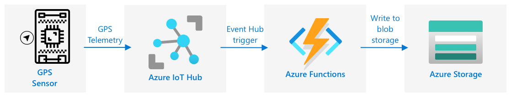

<!--
CO_OP_TRANSLATOR_METADATA:
{
  "original_hash": "e345843ccfeb7261d81500d19c64d476",
  "translation_date": "2025-08-25T18:11:37+00:00",
  "source_file": "3-transport/lessons/2-store-location-data/README.md",
  "language_code": "it"
}
-->
# Memorizzare i dati di localizzazione


> Illustrazione di [Nitya Narasimhan](https://github.com/nitya). Clicca sull'immagine per una versione più grande.

## Quiz preliminare alla lezione

[Quiz preliminare alla lezione](https://black-meadow-040d15503.1.azurestaticapps.net/quiz/23)

## Introduzione

Nella lezione precedente, hai imparato a utilizzare un sensore GPS per acquisire dati di localizzazione. Per utilizzare questi dati per visualizzare la posizione di un camion carico di cibo e il suo percorso, è necessario inviarli a un servizio IoT nel cloud e poi archiviarli da qualche parte.

In questa lezione imparerai i diversi modi per memorizzare i dati IoT e come archiviare i dati provenienti dal tuo servizio IoT utilizzando codice serverless.

In questa lezione tratteremo:

* [Dati strutturati e non strutturati](../../../../../3-transport/lessons/2-store-location-data)
* [Inviare dati GPS a un IoT Hub](../../../../../3-transport/lessons/2-store-location-data)
* [Percorsi hot, warm e cold](../../../../../3-transport/lessons/2-store-location-data)
* [Gestire eventi GPS con codice serverless](../../../../../3-transport/lessons/2-store-location-data)
* [Account di archiviazione Azure](../../../../../3-transport/lessons/2-store-location-data)
* [Collegare il codice serverless all'archiviazione](../../../../../3-transport/lessons/2-store-location-data)

## Dati strutturati e non strutturati

I sistemi informatici gestiscono dati che possono assumere forme e dimensioni molto diverse. Possono variare da numeri singoli a grandi quantità di testo, video, immagini e dati IoT. I dati possono generalmente essere suddivisi in due categorie: *strutturati* e *non strutturati*.

* **Dati strutturati**: dati con una struttura ben definita e rigida che non cambia e che di solito si mappano su tabelle con relazioni. Un esempio è rappresentato dai dettagli di una persona, come nome, data di nascita e indirizzo.

* **Dati non strutturati**: dati senza una struttura ben definita e rigida, inclusi dati che possono cambiare struttura frequentemente. Un esempio sono documenti come testi scritti o fogli di calcolo.

✅ Fai una ricerca: Riesci a pensare ad altri esempi di dati strutturati e non strutturati?

> 💁 Esistono anche dati semi-strutturati, che sono strutturati ma non si adattano a tabelle di dati fisse.

I dati IoT sono generalmente considerati dati non strutturati.

Immagina di aggiungere dispositivi IoT a una flotta di veicoli per una grande azienda agricola. Potresti voler utilizzare dispositivi diversi per tipi diversi di veicoli. Ad esempio:

* Per veicoli agricoli come i trattori, vuoi dati GPS per assicurarti che stiano lavorando nei campi corretti.
* Per i camion di consegna che trasportano cibo ai magazzini, vuoi dati GPS, velocità e accelerazione per garantire che il conducente stia guidando in sicurezza, oltre a dati sull'identità del conducente e sull'inizio/fine del viaggio per verificare la conformità alle leggi locali sugli orari di lavoro.
* Per i camion refrigerati, vuoi anche dati sulla temperatura per assicurarti che il cibo non si riscaldi o raffreddi troppo, rischiando di deteriorarsi durante il trasporto.

Questi dati possono cambiare costantemente. Ad esempio, se il dispositivo IoT si trova nella cabina di un camion, i dati inviati potrebbero cambiare a seconda del rimorchio, inviando dati sulla temperatura solo quando viene utilizzato un rimorchio refrigerato.

✅ Quali altri dati IoT potrebbero essere acquisiti? Pensa ai tipi di carichi che i camion possono trasportare, oltre ai dati di manutenzione.

Questi dati variano da veicolo a veicolo, ma vengono tutti inviati allo stesso servizio IoT per l'elaborazione. Il servizio IoT deve essere in grado di elaborare questi dati non strutturati, archiviarli in modo che possano essere cercati o analizzati, ma funzionare con strutture diverse.

### Archiviazione SQL vs NoSQL

I database sono servizi che consentono di archiviare e interrogare i dati. I database si dividono in due tipi: SQL e NoSQL.

#### Database SQL

I primi database erano Sistemi di Gestione di Database Relazionali (RDBMS), o database relazionali. Sono anche noti come database SQL, dal linguaggio Structured Query Language (SQL) utilizzato per interagire con essi per aggiungere, rimuovere, aggiornare o interrogare i dati. Questi database consistono in uno schema: un insieme ben definito di tabelle di dati, simile a un foglio di calcolo. Ogni tabella ha più colonne con nomi specifici. Quando inserisci dati, aggiungi una riga alla tabella, inserendo valori in ciascuna colonna. Questo mantiene i dati in una struttura molto rigida: sebbene tu possa lasciare colonne vuote, se vuoi aggiungere una nuova colonna devi farlo sul database, popolando i valori per le righe esistenti. Questi database sono relazionali, nel senso che una tabella può avere una relazione con un'altra.


Ad esempio, se memorizzi i dettagli personali di un utente in una tabella, avrai un ID univoco interno per ogni utente utilizzato in una riga della tabella che contiene il nome e l'indirizzo dell'utente. Se poi vuoi memorizzare altri dettagli su quell'utente, come i suoi acquisti, in un'altra tabella, avrai una colonna nella nuova tabella per l'ID dell'utente. Quando cerchi un utente, puoi utilizzare il suo ID per ottenere i dettagli personali da una tabella e i suoi acquisti da un'altra.

I database SQL sono ideali per memorizzare dati strutturati e per garantire che i dati corrispondano al tuo schema.

✅ Se non hai mai usato SQL prima, prenditi un momento per leggere la [pagina SQL su Wikipedia](https://wikipedia.org/wiki/SQL).

Alcuni database SQL noti sono Microsoft SQL Server, MySQL e PostgreSQL.

✅ Fai una ricerca: Leggi alcune informazioni su questi database SQL e le loro capacità.

#### Database NoSQL

I database NoSQL sono chiamati NoSQL perché non hanno la stessa struttura rigida dei database SQL. Sono anche noti come database documentali, poiché possono memorizzare dati non strutturati come documenti.

> 💁 Nonostante il nome, alcuni database NoSQL consentono di utilizzare SQL per interrogare i dati.


I database NoSQL non hanno uno schema predefinito che limita il modo in cui i dati vengono memorizzati; puoi invece inserire qualsiasi dato non strutturato, di solito utilizzando documenti JSON. Questi documenti possono essere organizzati in cartelle, simili ai file sul tuo computer. Ogni documento può avere campi diversi rispetto ad altri documenti. Ad esempio, se stai memorizzando dati IoT dai tuoi veicoli agricoli, alcuni potrebbero avere campi per dati di accelerometro e velocità, altri potrebbero avere campi per la temperatura nel rimorchio. Se aggiungessi un nuovo tipo di camion, come uno con bilance integrate per monitorare il peso del carico, il tuo dispositivo IoT potrebbe aggiungere questo nuovo campo e potrebbe essere memorizzato senza modifiche al database.

Alcuni database NoSQL noti includono Azure CosmosDB, MongoDB e CouchDB.

✅ Fai una ricerca: Leggi alcune informazioni su questi database NoSQL e le loro capacità.

In questa lezione utilizzerai un'archiviazione NoSQL per memorizzare i dati IoT.

## Inviare dati GPS a un IoT Hub

Nella lezione precedente hai acquisito dati GPS da un sensore GPS collegato al tuo dispositivo IoT. Per memorizzare questi dati IoT nel cloud, devi inviarli a un servizio IoT. Ancora una volta, utilizzerai Azure IoT Hub, lo stesso servizio IoT cloud che hai usato nel progetto precedente.


### Attività - inviare dati GPS a un IoT Hub

1. Crea un nuovo IoT Hub utilizzando il livello gratuito.

    > ⚠️ Puoi fare riferimento alle [istruzioni per creare un IoT Hub dal progetto 2, lezione 4](../../../2-farm/lessons/4-migrate-your-plant-to-the-cloud/README.md#create-an-iot-service-in-the-cloud) se necessario.

    Ricorda di creare un nuovo Gruppo di Risorse. Assegna al nuovo Gruppo di Risorse il nome `gps-sensor` e al nuovo IoT Hub un nome univoco basato su `gps-sensor`, ad esempio `gps-sensor-<tuo nome>`.

    > 💁 Se hai ancora il tuo IoT Hub dal progetto precedente, puoi riutilizzarlo. Ricorda di utilizzare il nome di questo IoT Hub e il Gruppo di Risorse in cui si trova quando crei altri servizi.

1. Aggiungi un nuovo dispositivo all'IoT Hub. Chiamalo `gps-sensor`. Recupera la stringa di connessione per il dispositivo.

1. Aggiorna il codice del tuo dispositivo per inviare i dati GPS al nuovo IoT Hub utilizzando la stringa di connessione del dispositivo ottenuta nel passaggio precedente.

    > ⚠️ Puoi fare riferimento alle [istruzioni per connettere il tuo dispositivo a un IoT dal progetto 2, lezione 4](../../../2-farm/lessons/4-migrate-your-plant-to-the-cloud/README.md#connect-your-device-to-the-iot-service) se necessario.

1. Quando invii i dati GPS, fallo in formato JSON nel seguente formato:

    ```json
    {
        "gps" :
        {
            "lat" : <latitude>,
            "lon" : <longitude>
        }
    }
    ```

1. Invia i dati GPS ogni minuto per non superare la tua allocazione giornaliera di messaggi.

Se stai utilizzando il Wio Terminal, ricorda di aggiungere tutte le librerie necessarie e di impostare l'ora utilizzando un server NTP. Il tuo codice dovrà anche assicurarsi di aver letto tutti i dati dalla porta seriale prima di inviare la posizione GPS, utilizzando il codice esistente della lezione precedente. Usa il seguente codice per costruire il documento JSON:

```cpp
DynamicJsonDocument doc(1024);
doc["gps"]["lat"] = gps.location.lat();
doc["gps"]["lon"] = gps.location.lng();
```

Se stai utilizzando un dispositivo IoT virtuale, ricorda di installare tutte le librerie necessarie utilizzando un ambiente virtuale.

Per il Raspberry Pi e il dispositivo IoT virtuale, utilizza il codice esistente della lezione precedente per ottenere i valori di latitudine e longitudine, quindi inviali nel formato JSON corretto con il seguente codice:

```python
message_json = { "gps" : { "lat":lat, "lon":lon } }
print("Sending telemetry", message_json)
message = Message(json.dumps(message_json))
```

> 💁 Puoi trovare questo codice nelle cartelle [code/wio-terminal](../../../../../3-transport/lessons/2-store-location-data/code/wio-terminal), [code/pi](../../../../../3-transport/lessons/2-store-location-data/code/pi) o [code/virtual-device](../../../../../3-transport/lessons/2-store-location-data/code/virtual-device).

Esegui il codice del tuo dispositivo e assicurati che i messaggi stiano fluendo nell'IoT Hub utilizzando il comando CLI `az iot hub monitor-events`.

## Percorsi hot, warm e cold

I dati che fluiscono da un dispositivo IoT al cloud non vengono sempre elaborati in tempo reale. Alcuni dati necessitano di elaborazione in tempo reale, altri possono essere elaborati poco dopo e altri ancora possono essere elaborati molto più tardi. Il flusso di dati verso diversi servizi che elaborano i dati in momenti diversi è definito percorsi hot, warm e cold.

### Percorso hot

Il percorso hot si riferisce ai dati che devono essere elaborati in tempo reale o quasi in tempo reale. Utilizzeresti i dati del percorso hot per avvisi, come ricevere notifiche che un veicolo si sta avvicinando a un deposito o che la temperatura in un camion refrigerato è troppo alta.

Per utilizzare i dati del percorso hot, il tuo codice risponderebbe agli eventi non appena vengono ricevuti dai tuoi servizi cloud.

### Percorso warm

Il percorso warm si riferisce ai dati che possono essere elaborati poco dopo essere stati ricevuti, ad esempio per report o analisi a breve termine. Utilizzeresti i dati del percorso warm per report giornalieri sul chilometraggio dei veicoli, utilizzando i dati raccolti il giorno precedente.

I dati del percorso warm vengono archiviati una volta ricevuti dal servizio cloud in un tipo di archiviazione che può essere rapidamente accessibile.

### Percorso cold

Il percorso cold si riferisce ai dati storici, archiviati a lungo termine per essere elaborati quando necessario. Ad esempio, potresti utilizzare il percorso cold per ottenere report annuali sul chilometraggio dei veicoli o eseguire analisi sui percorsi per trovare il percorso più ottimale per ridurre i costi del carburante.

I dati del percorso cold vengono archiviati in data warehouse, database progettati per memorizzare grandi quantità di dati che non cambieranno mai e che possono essere interrogati rapidamente e facilmente. Normalmente avresti un'attività regolare nella tua applicazione cloud che si esegue a intervalli regolari (giornalieri, settimanali o mensili) per spostare i dati dall'archiviazione del percorso warm al data warehouse.

✅ Pensa ai dati che hai acquisito finora in queste lezioni. Sono dati del percorso hot, warm o cold?

## Gestire eventi GPS con codice serverless

Una volta che i dati fluiscono nel tuo IoT Hub, puoi scrivere del codice serverless per ascoltare gli eventi pubblicati sull'endpoint compatibile con Event Hub. Questo è il percorso warm: questi dati verranno archiviati e utilizzati nella prossima lezione per creare report sul percorso.


### Attività - gestire eventi GPS con codice serverless

1. Crea un'app Azure Functions utilizzando la CLI di Azure Functions. Usa il runtime Python e crea l'app in una cartella chiamata `gps-trigger`, utilizzando lo stesso nome per il progetto dell'app Functions. Assicurati di creare un ambiente virtuale per questo.
> ⚠️ Puoi fare riferimento alle [istruzioni per creare un progetto Azure Functions dal progetto 2, lezione 5](../../../2-farm/lessons/5-migrate-application-to-the-cloud/README.md#create-a-serverless-application) se necessario.
1. Aggiungi un trigger di evento IoT Hub che utilizzi l'endpoint compatibile con Event Hub dell'IoT Hub.

    > ⚠️ Puoi fare riferimento alle [istruzioni per creare un trigger di evento IoT Hub dal progetto 2, lezione 5](../../../2-farm/lessons/5-migrate-application-to-the-cloud/README.md#create-an-iot-hub-event-trigger) se necessario.

1. Imposta la stringa di connessione dell'endpoint compatibile con Event Hub nel file `local.settings.json` e utilizza la chiave per quella voce nel file `function.json`.

1. Usa l'app Azurite come emulatore di archiviazione locale.

1. Esegui la tua app di funzioni per assicurarti che stia ricevendo eventi dal tuo dispositivo GPS. Assicurati che il tuo dispositivo IoT sia in esecuzione e stia inviando dati GPS.

    ```output
    Python EventHub trigger processed an event: {"gps": {"lat": 47.73481, "lon": -122.25701}}
    ```

## Account di Archiviazione Azure


Gli Account di Archiviazione Azure sono un servizio di archiviazione generico che può memorizzare dati in diversi modi. Puoi archiviare dati come blob, in code, in tabelle o come file, e tutto contemporaneamente.

### Archiviazione Blob

La parola *Blob* significa oggetti binari di grandi dimensioni, ma è diventata il termine per qualsiasi dato non strutturato. Puoi archiviare qualsiasi dato nell'archiviazione blob, dai documenti JSON contenenti dati IoT, ai file di immagini e video. L'archiviazione blob ha il concetto di *contenitori*, ovvero bucket nominati in cui puoi archiviare dati, simili alle tabelle in un database relazionale. Questi contenitori possono avere una o più cartelle per archiviare blob, e ogni cartella può contenere altre cartelle, simile a come i file sono archiviati sul disco rigido del tuo computer.

Utilizzerai l'archiviazione blob in questa lezione per archiviare i dati IoT.

✅ Fai una ricerca: Leggi di più su [Azure Blob Storage](https://docs.microsoft.com/azure/storage/blobs/storage-blobs-overview?WT.mc_id=academic-17441-jabenn)

### Archiviazione Tabelle

L'archiviazione tabelle ti consente di archiviare dati semi-strutturati. L'archiviazione tabelle è in realtà un database NoSQL, quindi non richiede un set definito di tabelle in anticipo, ma è progettata per archiviare dati in una o più tabelle, con chiavi uniche per definire ogni riga.

✅ Fai una ricerca: Leggi di più su [Azure Table Storage](https://docs.microsoft.com/azure/storage/tables/table-storage-overview?WT.mc_id=academic-17441-jabenn)

### Archiviazione Code

L'archiviazione code ti consente di archiviare messaggi di dimensioni fino a 64KB in una coda. Puoi aggiungere messaggi alla fine della coda e leggerli dalla parte anteriore. Le code archiviano i messaggi indefinitamente finché c'è spazio di archiviazione disponibile, consentendo di archiviare i messaggi a lungo termine e leggerli quando necessario. Ad esempio, se volessi eseguire un lavoro mensile per elaborare i dati GPS, potresti aggiungerli a una coda ogni giorno per un mese, quindi alla fine del mese elaborare tutti i messaggi dalla coda.

✅ Fai una ricerca: Leggi di più su [Azure Queue Storage](https://docs.microsoft.com/azure/storage/queues/storage-queues-introduction?WT.mc_id=academic-17441-jabenn)

### Archiviazione File

L'archiviazione file consente di archiviare file nel cloud, e qualsiasi app o dispositivo può connettersi utilizzando protocolli standard del settore. Puoi scrivere file nell'archiviazione file, quindi montarla come un'unità sul tuo PC o Mac.

✅ Fai una ricerca: Leggi di più su [Azure File Storage](https://docs.microsoft.com/azure/storage/files/storage-files-introduction?WT.mc_id=academic-17441-jabenn)

## Collega il tuo codice serverless all'archiviazione

La tua app di funzioni ora deve connettersi all'archiviazione blob per archiviare i messaggi dall'IoT Hub. Ci sono 2 modi per farlo:

* All'interno del codice della funzione, connettiti all'archiviazione blob utilizzando l'SDK Python per l'archiviazione blob e scrivi i dati come blob.
* Usa un binding di output della funzione per associare il valore restituito della funzione all'archiviazione blob e salvare automaticamente il blob.

In questa lezione, utilizzerai l'SDK Python per vedere come interagire con l'archiviazione blob.



I dati verranno salvati come un blob JSON con il seguente formato:

```json
{
    "device_id": <device_id>,
    "timestamp" : <time>,
    "gps" :
    {
        "lat" : <latitude>,
        "lon" : <longitude>
    }
}
```

### Attività - collega il tuo codice serverless all'archiviazione

1. Crea un account di Archiviazione Azure. Dagli un nome come `gps<tuo nome>`.

    > ⚠️ Puoi fare riferimento alle [istruzioni per creare un account di archiviazione dal progetto 2, lezione 5](../../../2-farm/lessons/5-migrate-application-to-the-cloud/README.md#task---create-the-cloud-resources) se necessario.

    Se hai ancora un account di archiviazione dal progetto precedente, puoi riutilizzarlo.

    > 💁 Sarà possibile utilizzare lo stesso account di archiviazione per distribuire la tua app di Azure Functions più avanti in questa lezione.

1. Esegui il seguente comando per ottenere la stringa di connessione per l'account di archiviazione:

    ```sh
    az storage account show-connection-string --output table \
                                              --name <storage_name>
    ```

    Sostituisci `<storage_name>` con il nome dell'account di archiviazione che hai creato nel passaggio precedente.

1. Aggiungi una nuova voce al file `local.settings.json` per la stringa di connessione del tuo account di archiviazione, utilizzando il valore del passaggio precedente. Chiamala `STORAGE_CONNECTION_STRING`.

1. Aggiungi il seguente al file `requirements.txt` per installare i pacchetti Pip per l'archiviazione Azure:

    ```sh
    azure-storage-blob
    ```

    Installa i pacchetti da questo file nel tuo ambiente virtuale.

    > Se ricevi un errore, aggiorna la tua versione di Pip nel tuo ambiente virtuale all'ultima versione con il seguente comando, quindi riprova:
    >
    > ```sh
    > pip install --upgrade pip
    > ```

1. Nel file `__init__.py` per il `iot-hub-trigger`, aggiungi le seguenti istruzioni di importazione:

    ```python
    import json
    import os
    import uuid
    from azure.storage.blob import BlobServiceClient, PublicAccess
    ```

    Il modulo di sistema `json` verrà utilizzato per leggere e scrivere JSON, il modulo di sistema `os` verrà utilizzato per leggere la stringa di connessione, il modulo di sistema `uuid` verrà utilizzato per generare un ID univoco per la lettura GPS.

    Il pacchetto `azure.storage.blob` contiene l'SDK Python per lavorare con l'archiviazione blob.

1. Prima del metodo `main`, aggiungi la seguente funzione helper:

    ```python
    def get_or_create_container(name):
        connection_str = os.environ['STORAGE_CONNECTION_STRING']
        blob_service_client = BlobServiceClient.from_connection_string(connection_str)
    
        for container in blob_service_client.list_containers():
            if container.name == name:
                return blob_service_client.get_container_client(container.name)
        
        return blob_service_client.create_container(name, public_access=PublicAccess.Container)
    ```

    L'SDK Python per i blob non ha un metodo helper per creare un contenitore se non esiste. Questo codice caricherà la stringa di connessione dal file `local.settings.json` (o dalle Impostazioni dell'Applicazione una volta distribuito nel cloud), quindi creerà una classe `BlobServiceClient` da questa per interagire con l'account di archiviazione blob. Successivamente, scorre tutti i contenitori per l'account di archiviazione blob, cercandone uno con il nome fornito - se lo trova, restituirà una classe `ContainerClient` che può interagire con il contenitore per creare blob. Se non lo trova, il contenitore viene creato e viene restituito il client per il nuovo contenitore.

    Quando viene creato il nuovo contenitore, viene concesso l'accesso pubblico per interrogare i blob nel contenitore. Questo verrà utilizzato nella prossima lezione per visualizzare i dati GPS su una mappa.

1. A differenza dell'umidità del suolo, con questo codice vogliamo archiviare ogni evento, quindi aggiungi il seguente codice all'interno del ciclo `for event in events:` nella funzione `main`, sotto l'istruzione `logging`:

    ```python
    device_id = event.iothub_metadata['connection-device-id']
    blob_name = f'{device_id}/{str(uuid.uuid1())}.json'
    ```

    Questo codice ottiene l'ID del dispositivo dai metadati dell'evento, quindi lo utilizza per creare un nome di blob. I blob possono essere archiviati in cartelle, e l'ID del dispositivo verrà utilizzato per il nome della cartella, quindi ogni dispositivo avrà tutti i suoi eventi GPS in una cartella. Il nome del blob è questa cartella, seguita da un nome di documento, separati da barre oblique, simili ai percorsi di Linux e macOS (simili anche a Windows, ma Windows utilizza barre rovesciate). Il nome del documento è un ID univoco generato utilizzando il modulo Python `uuid`, con il tipo di file `json`.

    Ad esempio, per l'ID dispositivo `gps-sensor`, il nome del blob potrebbe essere `gps-sensor/a9487ac2-b9cf-11eb-b5cd-1e00621e3648.json`.

1. Aggiungi il seguente codice sotto questo:

    ```python
    container_client = get_or_create_container('gps-data')
    blob = container_client.get_blob_client(blob_name)
    ```

    Questo codice ottiene il client del contenitore utilizzando la funzione helper `get_or_create_container`, e quindi ottiene un oggetto client del blob utilizzando il nome del blob. Questi client di blob possono fare riferimento a blob esistenti o, come in questo caso, a nuovi blob.

1. Aggiungi il seguente codice dopo questo:

    ```python
    event_body = json.loads(event.get_body().decode('utf-8'))
    blob_body = {
        'device_id' : device_id,
        'timestamp' : event.iothub_metadata['enqueuedtime'],
        'gps': event_body['gps']
    }
    ```

    Questo costruisce il corpo del blob che verrà scritto nell'archiviazione blob. È un documento JSON contenente l'ID del dispositivo, l'ora in cui la telemetria è stata inviata a IoT Hub e le coordinate GPS dalla telemetria.

    > 💁 È importante utilizzare l'ora di accodamento del messaggio anziché l'ora corrente per ottenere l'ora in cui il messaggio è stato inviato. Potrebbe essere rimasto sull'hub per un po' prima di essere elaborato se l'app di funzioni non era in esecuzione.

1. Aggiungi il seguente codice sotto questo:

    ```python
    logging.info(f'Writing blob to {blob_name} - {blob_body}')
    blob.upload_blob(json.dumps(blob_body).encode('utf-8'))
    ```

    Questo codice registra che un blob sta per essere scritto con i suoi dettagli, quindi carica il corpo del blob come contenuto del nuovo blob.

1. Esegui l'app di funzioni. Vedrai i blob essere scritti per tutti gli eventi GPS nell'output:

    ```output
    [2021-05-21T01:31:14.325Z] Python EventHub trigger processed an event: {"gps": {"lat": 47.73092, "lon": -122.26206}}
    ...
    [2021-05-21T01:31:14.351Z] Writing blob to gps-sensor/4b6089fe-ba8d-11eb-bc7b-1e00621e3648.json - {'device_id': 'gps-sensor', 'timestamp': '2021-05-21T00:57:53.878Z', 'gps': {'lat': 47.73092, 'lon': -122.26206}}
    ```

    > 💁 Assicurati di non eseguire il monitor degli eventi di IoT Hub contemporaneamente.

> 💁 Puoi trovare questo codice nella cartella [code/functions](../../../../../3-transport/lessons/2-store-location-data/code/functions).

### Attività - verifica i blob caricati

1. Per visualizzare i blob creati, puoi utilizzare [Azure Storage Explorer](https://azure.microsoft.com/features/storage-explorer/?WT.mc_id=academic-17441-jabenn), uno strumento gratuito che ti consente di visualizzare e gestire i tuoi account di archiviazione, oppure il CLI.

    1. Per utilizzare il CLI, prima avrai bisogno di una chiave dell'account. Esegui il seguente comando per ottenere questa chiave:

        ```sh
        az storage account keys list --output table \
                                     --account-name <storage_name>
        ```

        Sostituisci `<storage_name>` con il nome dell'account di archiviazione.

        Copia il valore di `key1`.

    1. Esegui il seguente comando per elencare i blob nel contenitore:

        ```sh
        az storage blob list --container-name gps-data \
                             --output table \
                             --account-name <storage_name> \
                             --account-key <key1>
        ```

        Sostituisci `<storage_name>` con il nome dell'account di archiviazione e `<key1>` con il valore di `key1` copiato nel passaggio precedente.

        Questo elencherà tutti i blob nel contenitore:

        ```output
        Name                                                  Blob Type    Blob Tier    Length    Content Type              Last Modified              Snapshot
        ----------------------------------------------------  -----------  -----------  --------  ------------------------  -------------------------  ----------
        gps-sensor/1810d55e-b9cf-11eb-9f5b-1e00621e3648.json  BlockBlob    Hot          45        application/octet-stream  2021-05-21T00:54:27+00:00
        gps-sensor/18293e46-b9cf-11eb-9f5b-1e00621e3648.json  BlockBlob    Hot          45        application/octet-stream  2021-05-21T00:54:28+00:00
        gps-sensor/1844549c-b9cf-11eb-9f5b-1e00621e3648.json  BlockBlob    Hot          45        application/octet-stream  2021-05-21T00:54:28+00:00
        gps-sensor/1894d714-b9cf-11eb-9f5b-1e00621e3648.json  BlockBlob    Hot          45        application/octet-stream  2021-05-21T00:54:28+00:00
        ```

    1. Scarica uno dei blob utilizzando il seguente comando:

        ```sh
        az storage blob download --container-name gps-data \
                                 --account-name <storage_name> \
                                 --account-key <key1> \
                                 --name <blob_name> \
                                 --file <file_name>
        ```

        Sostituisci `<storage_name>` con il nome dell'account di archiviazione e `<key1>` con il valore di `key1` copiato nel passaggio precedente.

        Sostituisci `<blob_name>` con il nome completo dalla colonna `Name` dell'output del passaggio precedente, inclusa la cartella. Sostituisci `<file_name>` con il nome di un file locale in cui salvare il blob.

    Una volta scaricato, puoi aprire il file JSON in VS Code e vedrai il blob contenente i dettagli della posizione GPS:

    ```json
    {"device_id": "gps-sensor", "timestamp": "2021-05-21T00:57:53.878Z", "gps": {"lat": 47.73092, "lon": -122.26206}}
    ```

### Attività - distribuisci la tua app di funzioni nel cloud

Ora che la tua app di funzioni funziona, puoi distribuirla nel cloud.

1. Crea una nuova app di Azure Functions, utilizzando l'account di archiviazione che hai creato in precedenza. Dagli un nome come `gps-sensor-` e aggiungi un identificatore univoco alla fine, come alcune parole casuali o il tuo nome.

    > ⚠️ Puoi fare riferimento alle [istruzioni per creare un'app di funzioni dal progetto 2, lezione 5](../../../2-farm/lessons/5-migrate-application-to-the-cloud/README.md#task---create-the-cloud-resources) se necessario.

1. Carica i valori `IOT_HUB_CONNECTION_STRING` e `STORAGE_CONNECTION_STRING` nelle Impostazioni dell'Applicazione.

    > ⚠️ Puoi fare riferimento alle [istruzioni per caricare le Impostazioni dell'Applicazione dal progetto 2, lezione 5](../../../2-farm/lessons/5-migrate-application-to-the-cloud/README.md#task---upload-your-application-settings) se necessario.

1. Distribuisci la tua app di funzioni locale nel cloud.
⚠️ Puoi fare riferimento alle [istruzioni per distribuire la tua app Functions dal progetto 2, lezione 5](../../../2-farm/lessons/5-migrate-application-to-the-cloud/README.md#task---deploy-your-functions-app-to-the-cloud) se necessario.
## 🚀 Sfida

I dati GPS non sono perfettamente accurati, e le posizioni rilevate possono essere sbagliate di alcuni metri, se non di più, specialmente in gallerie e aree con edifici alti.

Pensa a come la navigazione satellitare potrebbe superare questo problema. Quali dati ha il tuo sistema di navigazione satellitare che gli permetterebbero di fare previsioni migliori sulla tua posizione?

## Quiz post-lezione

[Quiz post-lezione](https://black-meadow-040d15503.1.azurestaticapps.net/quiz/24)

## Revisione e studio autonomo

* Leggi dei dati strutturati sulla [pagina del modello di dati su Wikipedia](https://wikipedia.org/wiki/Data_model)
* Leggi dei dati semi-strutturati sulla [pagina dei dati semi-strutturati su Wikipedia](https://wikipedia.org/wiki/Semi-structured_data)
* Leggi dei dati non strutturati sulla [pagina dei dati non strutturati su Wikipedia](https://wikipedia.org/wiki/Unstructured_data)
* Approfondisci Azure Storage e i diversi tipi di archiviazione nella [documentazione di Azure Storage](https://docs.microsoft.com/azure/storage/?WT.mc_id=academic-17441-jabenn)

## Compito

[Indaga sui function bindings](assignment.md)

**Disclaimer**:  
Questo documento è stato tradotto utilizzando il servizio di traduzione automatica [Co-op Translator](https://github.com/Azure/co-op-translator). Sebbene ci impegniamo per garantire l'accuratezza, si prega di notare che le traduzioni automatiche possono contenere errori o imprecisioni. Il documento originale nella sua lingua nativa dovrebbe essere considerato la fonte autorevole. Per informazioni critiche, si raccomanda una traduzione professionale effettuata da un traduttore umano. Non siamo responsabili per eventuali incomprensioni o interpretazioni errate derivanti dall'uso di questa traduzione.