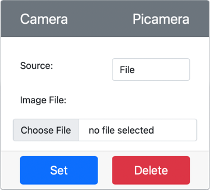

<!--
CO_OP_TRANSLATOR_METADATA:
{
  "original_hash": "3ba7150ffc4a6999f6c3cfb4906ec7df",
  "translation_date": "2025-08-25T16:32:52+00:00",
  "source_file": "4-manufacturing/lessons/2-check-fruit-from-device/virtual-device-camera.md",
  "language_code": "it"
}
-->
# Catturare un'immagine - Hardware IoT Virtuale

In questa parte della lezione, aggiungerai un sensore di fotocamera al tuo dispositivo IoT virtuale e leggerai immagini da esso.

## Hardware

Il dispositivo IoT virtuale utilizzerà una fotocamera simulata che invia immagini da file o dalla tua webcam.

### Aggiungere la fotocamera a CounterFit

Per utilizzare una fotocamera virtuale, devi aggiungerne una all'app CounterFit.

#### Attività - aggiungere la fotocamera a CounterFit

Aggiungi la fotocamera all'app CounterFit.

1. Crea una nuova app Python sul tuo computer in una cartella chiamata `fruit-quality-detector` con un unico file chiamato `app.py` e un ambiente virtuale Python, e aggiungi i pacchetti pip di CounterFit.

    > ⚠️ Puoi fare riferimento a [le istruzioni per creare e configurare un progetto Python CounterFit nella lezione 1, se necessario](../../../1-getting-started/lessons/1-introduction-to-iot/virtual-device.md).

1. Installa un pacchetto Pip aggiuntivo per installare uno shim CounterFit che può comunicare con i sensori della fotocamera simulando alcune funzionalità del [pacchetto Pip Picamera](https://pypi.org/project/picamera/). Assicurati di installarlo da un terminale con l'ambiente virtuale attivato.

    ```sh
    pip install counterfit-shims-picamera
    ```

1. Assicurati che l'app web CounterFit sia in esecuzione.

1. Crea una fotocamera:

    1. Nella casella *Create sensor* nel pannello *Sensors*, apri il menu a tendina *Sensor type* e seleziona *Camera*.

    1. Imposta il *Name* su `Picamera`.

    1. Seleziona il pulsante **Add** per creare la fotocamera.

    

    La fotocamera verrà creata e apparirà nell'elenco dei sensori.

    

## Programmare la fotocamera

Ora il dispositivo IoT virtuale può essere programmato per utilizzare la fotocamera virtuale.

### Attività - programmare la fotocamera

Programma il dispositivo.

1. Assicurati che l'app `fruit-quality-detector` sia aperta in VS Code.

1. Apri il file `app.py`.

1. Aggiungi il seguente codice all'inizio di `app.py` per connettere l'app a CounterFit:

    ```python
    from counterfit_connection import CounterFitConnection
    CounterFitConnection.init('127.0.0.1', 5000)
    ```

1. Aggiungi il seguente codice al file `app.py`:

    ```python
    import io
    from counterfit_shims_picamera import PiCamera
    ```

    Questo codice importa alcune librerie necessarie, inclusa la classe `PiCamera` dalla libreria counterfit_shims_picamera.

1. Aggiungi il seguente codice sotto questo per inizializzare la fotocamera:

    ```python
    camera = PiCamera()
    camera.resolution = (640, 480)
    camera.rotation = 0
    ```

    Questo codice crea un oggetto PiCamera, imposta la risoluzione a 640x480. Sebbene siano supportate risoluzioni più alte, il classificatore di immagini funziona con immagini molto più piccole (227x227), quindi non è necessario catturare e inviare immagini più grandi.

    La riga `camera.rotation = 0` imposta la rotazione dell'immagine in gradi. Se hai bisogno di ruotare l'immagine dalla webcam o dal file, imposta questo valore come appropriato. Ad esempio, se vuoi cambiare l'immagine di una banana su una webcam in modalità orizzontale in modalità verticale, imposta `camera.rotation = 90`.

1. Aggiungi il seguente codice sotto questo per catturare l'immagine come dati binari:

    ```python
    image = io.BytesIO()
    camera.capture(image, 'jpeg')
    image.seek(0)
    ```

    Questo codice crea un oggetto `BytesIO` per memorizzare i dati binari. L'immagine viene letta dalla fotocamera come file JPEG e memorizzata in questo oggetto. Questo oggetto ha un indicatore di posizione per sapere dove si trova nei dati, in modo che possano essere scritti ulteriori dati alla fine, se necessario. La riga `image.seek(0)` sposta questa posizione all'inizio, in modo che tutti i dati possano essere letti successivamente.

1. Sotto questo, aggiungi il seguente codice per salvare l'immagine in un file:

    ```python
    with open('image.jpg', 'wb') as image_file:
        image_file.write(image.read())
    ```

    Questo codice apre un file chiamato `image.jpg` per la scrittura, quindi legge tutti i dati dall'oggetto `BytesIO` e li scrive nel file.

    > 💁 Puoi catturare l'immagine direttamente in un file invece che in un oggetto `BytesIO` passando il nome del file alla chiamata `camera.capture`. Il motivo per utilizzare l'oggetto `BytesIO` è che più avanti in questa lezione potrai inviare l'immagine al tuo classificatore di immagini.

1. Configura l'immagine che la fotocamera in CounterFit catturerà. Puoi impostare il *Source* su *File*, quindi caricare un file immagine, oppure impostare il *Source* su *WebCam*, e le immagini verranno catturate dalla tua webcam. Assicurati di selezionare il pulsante **Set** dopo aver selezionato un'immagine o la tua webcam.

    

1. Un'immagine verrà catturata e salvata come `image.jpg` nella cartella corrente. Vedrai questo file nell'esploratore di VS Code. Seleziona il file per visualizzare l'immagine. Se necessita di rotazione, aggiorna la riga `camera.rotation = 0` come necessario e scatta un'altra foto.

> 💁 Puoi trovare questo codice nella cartella [code-camera/virtual-iot-device](../../../../../4-manufacturing/lessons/2-check-fruit-from-device/code-camera/virtual-iot-device).

😀 Il tuo programma per la fotocamera è stato un successo!

**Disclaimer**:  
Questo documento è stato tradotto utilizzando il servizio di traduzione automatica [Co-op Translator](https://github.com/Azure/co-op-translator). Sebbene ci impegniamo per garantire l'accuratezza, si prega di notare che le traduzioni automatiche possono contenere errori o imprecisioni. Il documento originale nella sua lingua nativa dovrebbe essere considerato la fonte autorevole. Per informazioni critiche, si raccomanda una traduzione professionale effettuata da un traduttore umano. Non siamo responsabili per eventuali incomprensioni o interpretazioni errate derivanti dall'uso di questa traduzione.